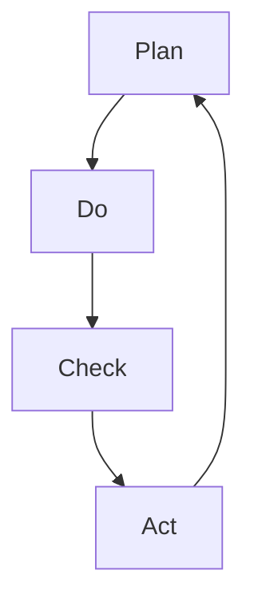

                 

# PDCA循环与持续改进文化

PDCA（Plan-Do-Check-Act）循环是一种经典的持续改进管理方法，最初由美国工程师W. Edwards Deming于1950年代提出。PDCA循环包括四个步骤：计划（Plan）、执行（Do）、检查（Check）、行动（Act），用于不断优化和提升管理与业务流程。在IT领域，PDCA循环同样适用，并衍生出了面向软件开发和运维的DevOps持续集成持续部署（CI/CD）实践，持续改进软件开发和运维的效率和质量。

本文将详细阐述PDCA循环在软件开发和运维中的具体应用，包括每个步骤的关键点、最佳实践以及如何高效实施PDCA循环以推动组织内持续改进文化的建立。

## 1. 背景介绍

在当今竞争激烈的市场环境中，快速响应变化、持续改进和优化是组织获取竞争优势的关键。PDCA循环提供了一种结构化的方法，使得组织能够系统地识别问题、制定改进计划、实施并评估改进措施，从而不断提升产品、服务和流程的质量和效率。

### 1.1 问题由来

随着技术的发展，软件开发和运维的复杂度日益增加，传统的手工运维方式难以满足业务对高可用性、高效率的需求。而PDCA循环提供了一套系统化的方法论，帮助组织在不断变化的技术环境中，构建和优化其软件开发和运维流程。

### 1.2 问题核心关键点

PDCA循环的核心在于其周期性的循环过程，通过不断计划、执行、检查和行动，使得组织能够系统地识别问题、制定改进计划、实施并评估改进措施，从而不断提升产品、服务和流程的质量和效率。

## 2. 核心概念与联系

### 2.1 核心概念概述

PDCA循环包括四个关键步骤，每个步骤都有其独特的目标和活动：

- **计划（Plan）**：识别当前业务和流程中的问题，制定改进目标和计划。
- **执行（Do）**：实施改进计划，引入新流程、工具和人员。
- **检查（Check）**：评估改进措施的效果，确认改进目标是否达成。
- **行动（Act）**：根据检查结果，决定是否接受改进措施，确定下一步行动计划。

PDCA循环中的“检查”和“行动”步骤，与传统质量管理的PDCA循环有所区别，主要体现在其面向持续改进的动态特性。在软件开发和运维中，PDCA循环需要结合CI/CD等实践，实现代码的持续集成和持续部署，确保新变更能够快速、可靠地发布。

### 2.2 核心概念原理和架构的 Mermaid 流程图



这个流程图展示了PDCA循环的核心过程：计划（A） -> 执行（B） -> 检查（C） -> 行动（D） -> 重新计划（A）。这个过程是一个持续循环的过程，确保组织不断优化和提升其业务和流程。

## 3. 核心算法原理 & 具体操作步骤

### 3.1 算法原理概述

PDCA循环的核心在于其周期性的循环过程，通过不断计划、执行、检查和行动，使得组织能够系统地识别问题、制定改进计划、实施并评估改进措施，从而不断提升产品、服务和流程的质量和效率。

### 3.2 算法步骤详解

#### 3.2.1 计划（Plan）

计划阶段是PDCA循环的起点，包括明确目标、识别问题、制定计划三个关键活动。具体步骤如下：

1. **明确目标**：基于业务需求和市场反馈，明确改进的目标和预期成果。例如，提高系统的可靠性和可用性。
2. **识别问题**：通过数据分析、用户反馈、监控告警等方式，识别当前业务和流程中的问题和瓶颈。例如，系统响应时间过长。
3. **制定计划**：基于目标和问题，制定具体的改进计划，包括改进措施、时间表、资源配置等。例如，优化系统架构、引入新工具、培训相关人员。

#### 3.2.2 执行（Do）

执行阶段是将计划付诸实践，实施改进措施的过程。具体步骤如下：

1. **引入新流程、工具和人员**：根据改进计划，引入新的流程、工具和人员，进行持续集成和持续部署。例如，引入新的CI/CD工具，引入新的运维团队。
2. **实施改进措施**：按照计划执行改进措施，确保新变更能够快速、可靠地发布。例如，部署优化后的系统架构。

#### 3.2.3 检查（Check）

检查阶段是评估改进措施效果的过程，包括收集数据、分析结果和评估改进措施的成效。具体步骤如下：

1. **收集数据**：通过监控、测试、用户反馈等方式，收集相关数据。例如，系统响应时间、故障率等。
2. **分析结果**：对收集到的数据进行分析，评估改进措施的成效。例如，对比优化前后的系统响应时间和故障率。
3. **评估改进措施**：基于分析结果，评估改进措施的成效，决定是否接受改进措施。例如，系统响应时间是否明显缩短，故障率是否明显降低。

#### 3.2.4 行动（Act）

行动阶段是PDCA循环的最终阶段，基于检查结果，决定是否接受改进措施，确定下一步行动计划。具体步骤如下：

1. **决定是否接受改进措施**：根据检查结果，决定是否接受改进措施。例如，如果系统响应时间显著缩短，故障率显著降低，则决定接受改进措施。
2. **确定下一步行动计划**：基于检查结果，确定下一步的行动计划。例如，继续优化系统架构，引入新的监控工具，进行持续改进。

### 3.3 算法优缺点

#### 3.3.1 优点

1. **系统性**：PDCA循环提供了一种系统化的方法，使得组织能够系统地识别问题、制定改进计划、实施并评估改进措施，从而不断提升业务和流程的质量和效率。
2. **动态性**：PDCA循环的检查和行动步骤，使得组织能够根据实际情况进行动态调整，适应不断变化的环境。
3. **透明度**：PDCA循环的每个步骤都要求记录和跟踪，使得改进过程透明可见，便于评估和改进。

#### 3.3.2 缺点

1. **复杂度**：PDCA循环需要较多的资源和时间投入，包括人力、工具和过程管理。
2. **短期见效**：由于PDCA循环涉及多个步骤和多个阶段，短期内难以看到显著的效果，需要持续投入和改进。

### 3.4 算法应用领域

PDCA循环在软件开发和运维中的应用非常广泛，包括但不限于以下几个方面：

- **软件开发**：通过PDCA循环，不断优化软件开发流程，提高代码质量和开发效率。例如，引入敏捷开发方法、持续集成和持续部署。
- **系统运维**：通过PDCA循环，不断优化系统运维流程，提高系统可用性和故障响应速度。例如，引入自动化监控、自动化故障排查和恢复工具。
- **业务改进**：通过PDCA循环，不断优化业务流程，提高业务效率和客户满意度。例如，优化客户服务流程，引入新的客户反馈机制。

## 4. 数学模型和公式 & 详细讲解 & 举例说明

### 4.1 数学模型构建

PDCA循环的每个步骤都可以用数学模型来表示，具体如下：

- **计划（Plan）**：$P = \{G, I, D\}$，其中 $G$ 为目标，$I$ 为识别的问题，$D$ 为制定的计划。
- **执行（Do）**：$D = \{A, T\}$，其中 $A$ 为引入的新流程、工具和人员，$T$ 为实施的改进措施。
- **检查（Check）**：$C = \{D, R\}$，其中 $D$ 为收集的数据，$R$ 为分析的结果。
- **行动（Act）**：$A = \{A, F\}$，其中 $A$ 为接受改进措施的决定，$F$ 为下一步的行动计划。

### 4.2 公式推导过程

#### 4.2.1 计划（Plan）

- **目标**：$G = O_i$，其中 $O_i$ 为第 $i$ 个目标。
- **问题**：$I = P_i$，其中 $P_i$ 为第 $i$ 个问题。
- **计划**：$D = \{M, R, H\}$，其中 $M$ 为改进措施，$R$ 为资源配置，$H$ 为时间表。

#### 4.2.2 执行（Do）

- **引入新流程**：$A = F_i$，其中 $F_i$ 为第 $i$ 个新流程。
- **引入新工具**：$T = W_i$，其中 $W_i$ 为第 $i$ 个新工具。
- **引入新人员**：$P = S_i$，其中 $S_i$ 为第 $i$ 个新人员。

#### 4.2.3 检查（Check）

- **收集数据**：$D = \{C_i, R_i, E_i\}$，其中 $C_i$ 为第 $i$ 个关键性能指标，$R_i$ 为第 $i$ 个测试结果，$E_i$ 为第 $i$ 个用户反馈。
- **分析结果**：$R = \{F_i, P_i, M_i\}$，其中 $F_i$ 为第 $i$ 个改进措施的故障率，$P_i$ 为第 $i$ 个改进措施的性能指标，$M_i$ 为第 $i$ 个改进措施的监控结果。

#### 4.2.4 行动（Act）

- **接受改进措施**：$A = Y_i$，其中 $Y_i$ 为第 $i$ 个改进措施是否接受。
- **下一步行动计划**：$F = \{N_i, T_i, R_i\}$，其中 $N_i$ 为第 $i$ 个新引入的流程，$T_i$ 为第 $i$ 个新引入的工具，$R_i$ 为第 $i$ 个新引入的人员。

### 4.3 案例分析与讲解

#### 4.3.1 案例背景

某电商企业希望通过优化其订单管理系统，提升订单处理效率和准确性。在PDCA循环中，具体实施步骤如下：

1. **计划（Plan）**：明确目标为提高订单处理效率和准确性，识别问题为订单处理过程中存在手工操作和重复操作，制定计划为引入新的订单管理系统，优化流程，引入新工具，培训运维团队。
2. **执行（Do）**：引入新的订单管理系统，引入新的监控工具，培训运维团队，进行持续集成和持续部署。
3. **检查（Check）**：收集关键性能指标（订单处理时间、错误率），进行测试，收集用户反馈，分析数据，评估改进措施的成效。
4. **行动（Act）**：决定接受改进措施，继续优化系统架构，引入新的监控工具，进行持续改进。

通过PDCA循环，该企业成功优化了订单管理系统，提高了订单处理效率和准确性。

## 5. 项目实践：代码实例和详细解释说明

### 5.1 开发环境搭建

要实践PDCA循环，首先需要搭建一个开发环境。以下是一个基于Python和Jenkins的PDCA循环实践环境搭建流程：

1. **安装Python**：从官网下载并安装Python。
2. **安装Jenkins**：从官网下载并安装Jenkins。
3. **配置Jenkins**：配置Jenkins，确保其能够访问远程代码库和远程服务器。
4. **配置CI/CD管道**：在Jenkins中配置CI/CD管道，确保代码的持续集成和持续部署。

完成上述步骤后，即可在Jenkins环境中进行PDCA循环的实践。

### 5.2 源代码详细实现

以下是一个基于Jenkins的PDCA循环实践的Python代码实现：

```python
# 导入相关模块
import jenkins
import time

# 配置Jenkins
jenkins_url = "http://jenkins.example.com"
jenkins_username = "user"
jenkins_password = "password"

# 登录Jenkins
session = jenkins.Jenkins(jenkins_url, username=jenkins_username, password=jenkins_password)

# 获取当前任务
jobs = session.get_jobs()
current_job = jobs[-1].name

# 构建任务
build = session.build_job(current_job)

# 执行任务
build.result()
```

这段代码实现了通过Jenkins执行持续集成和持续部署的过程。首先，登录Jenkins，获取当前任务，然后构建任务，并执行任务。

### 5.3 代码解读与分析

这段代码实现了通过Jenkins执行持续集成和持续部署的过程。首先，登录Jenkins，获取当前任务，然后构建任务，并执行任务。

1. **登录Jenkins**：使用Jenkins的API登录Jenkins，获取当前用户名和密码。
2. **获取当前任务**：通过Jenkins的API获取当前任务的信息，包括任务名称、任务状态等。
3. **构建任务**：通过Jenkins的API构建当前任务，提交代码变更，启动构建过程。
4. **执行任务**：通过Jenkins的API获取任务状态，检查任务是否成功，并执行下一步行动。

### 5.4 运行结果展示

运行上述代码，可以在Jenkins中看到任务的状态和执行结果。如果任务成功，则说明代码变更已成功集成和部署，PDCA循环中的“执行（Do）”步骤已成功完成。

## 6. 实际应用场景

### 6.1 智能客服系统

在智能客服系统中，PDCA循环可以帮助企业不断优化其服务流程，提高客户满意度。具体步骤如下：

1. **计划（Plan）**：明确目标为提高客户满意度，识别问题为系统响应时间较长，制定计划为引入新的客服系统，优化流程，引入新工具，培训客服团队。
2. **执行（Do）**：引入新的客服系统，引入新的监控工具，培训客服团队，进行持续集成和持续部署。
3. **检查（Check）**：收集关键性能指标（平均响应时间、客户满意度），进行测试，收集用户反馈，分析数据，评估改进措施的成效。
4. **行动（Act）**：决定接受改进措施，继续优化系统架构，引入新的监控工具，进行持续改进。

通过PDCA循环，企业可以不断优化其智能客服系统，提高客户满意度。

### 6.2 金融舆情监测系统

在金融舆情监测系统中，PDCA循环可以帮助金融机构不断优化其舆情监测流程，提高舆情分析的准确性。具体步骤如下：

1. **计划（Plan）**：明确目标为提高舆情分析准确性，识别问题为舆情数据处理时间较长，制定计划为引入新的舆情监测系统，优化流程，引入新工具，培训运维团队。
2. **执行（Do）**：引入新的舆情监测系统，引入新的监控工具，培训运维团队，进行持续集成和持续部署。
3. **检查（Check）**：收集关键性能指标（舆情处理时间、舆情分析准确率），进行测试，收集用户反馈，分析数据，评估改进措施的成效。
4. **行动（Act）**：决定接受改进措施，继续优化系统架构，引入新的监控工具，进行持续改进。

通过PDCA循环，金融机构可以不断优化其舆情监测系统，提高舆情分析的准确性。

### 6.3 个性化推荐系统

在个性化推荐系统中，PDCA循环可以帮助电商平台不断优化其推荐算法，提高推荐准确性。具体步骤如下：

1. **计划（Plan）**：明确目标为提高推荐准确性，识别问题为推荐算法模型不精准，制定计划为引入新的推荐算法，优化流程，引入新工具，培训数据团队。
2. **执行（Do）**：引入新的推荐算法，引入新的监控工具，培训数据团队，进行持续集成和持续部署。
3. **检查（Check）**：收集关键性能指标（推荐准确率、用户满意度），进行测试，收集用户反馈，分析数据，评估改进措施的成效。
4. **行动（Act）**：决定接受改进措施，继续优化推荐算法，引入新的监控工具，进行持续改进。

通过PDCA循环，电商平台可以不断优化其个性化推荐系统，提高推荐准确性。

### 6.4 未来应用展望

随着技术的不断发展，PDCA循环在软件开发和运维中的应用将更加广泛和深入。未来，PDCA循环将结合更多现代技术，如机器学习、人工智能等，进一步提升其优化和改进能力。

## 7. 工具和资源推荐

### 7.1 学习资源推荐

为了帮助开发者系统掌握PDCA循环的理论基础和实践技巧，这里推荐一些优质的学习资源：

1. **《PDCA循环与管理》**：这是一本详细介绍PDCA循环原理和管理实践的书籍，适合入门和进阶学习。
2. **《精益敏捷》**：这是一本介绍精益和敏捷管理的书籍，其中包含大量关于PDCA循环的案例和实践方法。
3. **《DevOps实践指南》**：这是一本介绍DevOps实践的书籍，其中包含大量关于PDCA循环的应用案例和最佳实践。
4. **Jenkins官方文档**：这是Jenkins官方文档，包含大量关于PDCA循环在持续集成和持续部署中的应用案例和实践指南。
5. **Kubernetes官方文档**：这是Kubernetes官方文档，包含大量关于PDCA循环在容器编排中的应用案例和实践指南。

通过这些资源的学习，相信你一定能够全面掌握PDCA循环的理论基础和实践技巧，并将其应用于软件开发和运维中。

### 7.2 开发工具推荐

要高效实施PDCA循环，以下工具是非常有用的：

1. **Jenkins**：这是一个开源的持续集成和持续部署工具，非常适合于PDCA循环中的“执行（Do）”和“检查（Check）”步骤。
2. **GitLab**：这是一个集成了持续集成和持续部署功能的源代码管理系统，非常适合于PDCA循环中的“执行（Do）”和“检查（Check）”步骤。
3. **Kubernetes**：这是一个开源的容器编排平台，非常适合于PDCA循环中的“执行（Do）”和“检查（Check）”步骤。
4. **Prometheus**：这是一个开源的监控系统，非常适合于PDCA循环中的“检查（Check）”步骤。
5. **Slack**：这是一个团队协作工具，非常适合于PDCA循环中的“检查（Check）”和“行动（Act）”步骤。

这些工具可以帮助你高效实施PDCA循环，快速优化和改进你的软件开发和运维流程。

### 7.3 相关论文推荐

PDCA循环在软件开发和运维中的应用是一个研究热点，以下是几篇经典论文，推荐阅读：

1. **《PDCA循环与软件开发》**：这是一篇详细介绍PDCA循环在软件开发中应用的研究论文，提供了大量的案例和实践方法。
2. **《DevOps实践指南》**：这是一篇详细介绍DevOps实践的研究论文，其中包含大量关于PDCA循环的应用案例和最佳实践。
3. **《持续集成与持续部署》**：这是一篇详细介绍持续集成与持续部署的研究论文，其中包含大量关于PDCA循环的应用案例和实践方法。
4. **《PDCA循环与质量管理》**：这是一篇详细介绍PDCA循环在质量管理中应用的研究论文，提供了大量的案例和实践方法。
5. **《PDCA循环与项目管理》**：这是一篇详细介绍PDCA循环在项目管理中应用的研究论文，提供了大量的案例和实践方法。

这些论文代表了大规模运维管理领域的研究进展，通过学习这些前沿成果，可以帮助研究者把握学科前进方向，激发更多的创新灵感。

## 8. 总结：未来发展趋势与挑战

### 8.1 总结

本文对PDCA循环在软件开发和运维中的应用进行了详细阐述，介绍了其核心步骤、关键活动和最佳实践。通过系统性地应用PDCA循环，组织可以不断优化和改进其软件开发和运维流程，提升业务效率和客户满意度。

### 8.2 未来发展趋势

展望未来，PDCA循环在软件开发和运维中的应用将呈现以下几个发展趋势：

1. **自动化**：随着自动化技术的发展，PDCA循环的执行和检查步骤将越来越多地采用自动化工具，如Jenkins、GitLab、Kubernetes等，以提高效率和准确性。
2. **数据驱动**：随着大数据和人工智能技术的发展，PDCA循环将越来越多地依赖数据驱动，通过数据分析和机器学习技术，优化和改进业务流程。
3. **跨团队协作**：随着敏捷开发和DevOps实践的推广，PDCA循环将越来越多地涉及跨团队协作，如研发、运维、业务等团队的协同工作。
4. **持续改进文化**：随着PDCA循环的广泛应用，其将成为组织中的一种文化，使得组织能够不断优化和改进其业务流程，提升竞争力。
5. **技术融合**：随着技术的发展，PDCA循环将越来越多地与其他技术进行融合，如微服务架构、容器化技术、云平台等，提升其灵活性和可扩展性。

### 8.3 面临的挑战

尽管PDCA循环在软件开发和运维中具有重要的作用，但其推广和应用仍面临一些挑战：

1. **组织文化**：PDCA循环需要组织内部的支持和管理，对于一些组织而言，改变其传统的工作方式和文化可能面临较大的阻力。
2. **资源投入**：PDCA循环的实施需要较多的资源投入，包括人力、工具和过程管理，对于一些资源有限的中小企业而言，可能难以承受。
3. **技术复杂度**：PDCA循环的实施需要一定的技术基础，对于一些技术能力较弱的企业而言，可能面临一定的挑战。
4. **测量和评估**：PDCA循环的实施需要明确的测量和评估标准，对于一些缺乏标准化管理的企业而言，可能难以衡量其效果。

### 8.4 研究展望

为了克服PDCA循环面临的挑战，未来的研究需要在以下几个方面寻求新的突破：

1. **文化建设**：通过组织内部的文化建设，推广PDCA循环的思想和方法，改变传统的工作方式和文化。
2. **技术支持**：通过引入现代化的工具和技术，如Jenkins、GitLab、Kubernetes等，降低PDCA循环的实施难度和资源投入。
3. **标准化管理**：通过制定和实施标准化管理流程，明确PDCA循环的测量和评估标准，确保PDCA循环的有效实施。
4. **技术融合**：将PDCA循环与其他技术进行融合，如微服务架构、容器化技术、云平台等，提升其灵活性和可扩展性。
5. **数据驱动**：通过引入大数据和人工智能技术，优化和改进业务流程，提高PDCA循环的效果和效率。

总之，PDCA循环作为一种系统化的方法论，在软件开发和运维中的应用具有重要的价值和意义。只有不断优化和改进PDCA循环，才能在快速变化的技术环境中，保持竞争力和创新力，推动组织的持续发展和进步。

