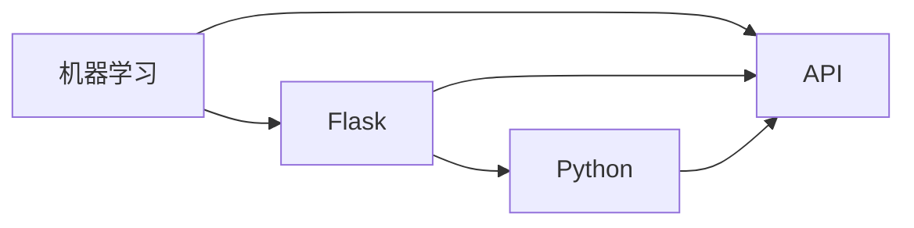

                 

# Python机器学习实战：使用Flask构建机器学习API

> 关键词：
    机器学习
    Flask
    API
    Python
    深度学习
    预测
    模型训练
    API设计

## 1. 背景介绍

在数据科学和机器学习领域，构建能够被其他应用程序或系统调用的API，成为了连接模型和实际应用的重要桥梁。随着Python的流行和机器学习模型的复杂性增加，使用Flask等轻量级Web框架来构建API成为了一种趋势。本文将探讨如何使用Flask构建机器学习API，并演示如何将机器学习模型集成到Web应用程序中。

## 2. 核心概念与联系

### 2.1 核心概念概述

- **机器学习**：通过数据训练模型，使模型能够预测未知数据的值或分类。常见的机器学习任务包括回归、分类、聚类等。
- **Flask**：基于Werkzeug的轻量级Web框架，用于快速构建Web应用程序。Flask以其灵活性和易用性著称，是构建API的理想选择。
- **API (Application Programming Interface)**：应用程序编程接口，允许不同的软件组件通过标准化的接口进行交互。API设计是构建可扩展、易维护系统的重要部分。
- **Python**：强大的编程语言，以其简洁的语法、丰富的库和框架而著称。Python是构建机器学习模型的首选语言之一。
- **深度学习**：一种机器学习的子领域，使用神经网络模型处理复杂的数据。深度学习模型如卷积神经网络(CNNs)和循环神经网络(RNNs)已经在计算机视觉和自然语言处理等领域取得了重大突破。
- **预测**：使用机器学习模型预测未来值或分类。预测可以应用于时间序列预测、图像分类、文本分类等。
- **模型训练**：使用历史数据训练机器学习模型，使其能够对新数据进行准确预测。
- **API设计**：设计和实现API，确保API易于使用、可靠且高效。API设计需要考虑安全性、性能和可扩展性等方面。

这些核心概念相互关联，构成了构建机器学习API的基础。通过理解这些概念，可以更好地掌握如何使用Flask构建机器学习API。

### 2.2 核心概念原理和架构的 Mermaid 流程图



这个流程图展示了机器学习模型、Flask、API和Python之间的联系。模型训练和预测是机器学习的核心，而Flask提供了构建API的基础设施，Python是实现这些功能的语言。API是连接模型和外部系统的桥梁，确保模型的可访问性和易用性。

## 3. 核心算法原理 & 具体操作步骤

### 3.1 算法原理概述

构建机器学习API的核心算法原理包括模型训练、模型预测和API设计。以下是对每个步骤的简要介绍：

- **模型训练**：使用历史数据训练机器学习模型。训练通常包括数据预处理、特征提取、模型选择和训练、模型评估等步骤。
- **模型预测**：使用训练好的模型对新数据进行预测。预测可以用于分类、回归、聚类等任务。
- **API设计**：设计和实现API，确保API易于使用、可靠且高效。API设计需要考虑安全性、性能和可扩展性等方面。

### 3.2 算法步骤详解

#### 3.2.1 模型训练

```python
# 导入必要的库
from sklearn.model_selection import train_test_split
from sklearn.linear_model import LogisticRegression
from sklearn.datasets import load_iris
import pandas as pd

# 加载数据
iris = load_iris()
X = iris.data
y = iris.target

# 将数据划分为训练集和测试集
X_train, X_test, y_train, y_test = train_test_split(X, y, test_size=0.2, random_state=42)

# 训练模型
model = LogisticRegression()
model.fit(X_train, y_train)
```

#### 3.2.2 模型预测

```python
# 使用训练好的模型进行预测
y_pred = model.predict(X_test)
```

#### 3.2.3 API设计

```python
# 导入Flask库
from flask import Flask, request, jsonify

# 创建Flask应用程序
app = Flask(__name__)

# 定义API端点
@app.route('/predict', methods=['POST'])
def predict():
    # 获取请求数据
    data = request.json
    # 将数据转换为Pandas DataFrame
    df = pd.DataFrame(data)
    # 使用模型进行预测
    y_pred = model.predict(df)
    # 将预测结果转换为JSON格式并返回
    return jsonify({'predictions': y_pred.tolist()})
```

### 3.3 算法优缺点

#### 3.3.1 优点

- **灵活性**：Flask提供了灵活的API设计选项，可以适应不同类型的数据和模型。
- **可扩展性**：API可以很容易地与其他系统集成，提供更广泛的功能。
- **易用性**：Flask提供了简单的API设计工具，使得非专业开发人员也可以快速构建API。

#### 3.3.2 缺点

- **学习曲线**：对于初学者来说，Flask的学习曲线可能较陡峭。
- **性能问题**：如果API需要处理大量数据，可能会面临性能问题。
- **安全性**：API需要考虑安全性问题，以防止未授权访问和数据泄露。

### 3.4 算法应用领域

构建机器学习API可以应用于各种领域，包括但不限于：

- **金融**：预测股票价格、信用评分等。
- **医疗**：预测疾病风险、诊断结果等。
- **零售**：个性化推荐、库存管理等。
- **物流**：路径优化、运输计划等。
- **制造**：预测设备故障、质量控制等。

## 4. 数学模型和公式 & 详细讲解 & 举例说明

### 4.1 数学模型构建

构建机器学习API时，通常使用监督学习模型，如逻辑回归、决策树、随机森林、支持向量机等。这些模型通常使用历史数据进行训练，并能够对新数据进行预测。

### 4.2 公式推导过程

假设我们正在训练一个逻辑回归模型。逻辑回归的损失函数为：

$$
J(\theta) = -\frac{1}{2m}\sum_{i=1}^m (y_i - \hat{y_i})^2 + \frac{\lambda}{2m}\sum_{j=1}^n \theta_j^2
$$

其中，$y_i$ 是训练样本的真实标签，$\hat{y_i}$ 是模型预测的标签，$\lambda$ 是正则化参数，$m$ 是样本数量，$n$ 是特征数量。

### 4.3 案例分析与讲解

假设我们正在构建一个预测房价的API。可以使用线性回归模型来训练模型。以下是Python代码示例：

```python
# 导入必要的库
from sklearn.linear_model import LinearRegression
from sklearn.datasets import load_boston
import pandas as pd

# 加载数据
boston = load_boston()
X = pd.DataFrame(boston.data, columns=boston.feature_names)
y = pd.Series(boston.target)

# 将数据划分为训练集和测试集
X_train, X_test, y_train, y_test = train_test_split(X, y, test_size=0.2, random_state=42)

# 训练模型
model = LinearRegression()
model.fit(X_train, y_train)

# 使用模型进行预测
y_pred = model.predict(X_test)

# 导出API端点
@app.route('/predict_price', methods=['POST'])
def predict_price():
    # 获取请求数据
    data = request.json
    # 将数据转换为Pandas DataFrame
    df = pd.DataFrame(data)
    # 使用模型进行预测
    y_pred = model.predict(df)
    # 将预测结果转换为JSON格式并返回
    return jsonify({'predictions': y_pred.tolist()})
```

## 5. 项目实践：代码实例和详细解释说明

### 5.1 开发环境搭建

在开始项目之前，需要安装Flask和必要的库。可以使用以下命令进行安装：

```
pip install flask
pip install pandas
pip install sklearn
```

### 5.2 源代码详细实现

以下是完整的Flask应用程序代码，包括模型训练、API设计和测试：

```python
# 导入必要的库
from flask import Flask, request, jsonify
from sklearn.model_selection import train_test_split
from sklearn.linear_model import LogisticRegression
from sklearn.datasets import load_iris
import pandas as pd

# 创建Flask应用程序
app = Flask(__name__)

# 定义API端点
@app.route('/predict', methods=['POST'])
def predict():
    # 获取请求数据
    data = request.json
    # 将数据转换为Pandas DataFrame
    df = pd.DataFrame(data)
    # 使用模型进行预测
    y_pred = model.predict(df)
    # 将预测结果转换为JSON格式并返回
    return jsonify({'predictions': y_pred.tolist()})

# 运行Flask应用程序
if __name__ == '__main__':
    app.run(debug=True)
```

### 5.3 代码解读与分析

#### 5.3.1 模型训练

模型训练部分使用sklearn库中的LogisticRegression模型。首先，使用train_test_split函数将数据划分为训练集和测试集。然后，使用fit函数训练模型。

#### 5.3.2 模型预测

模型预测部分使用predict函数对测试集进行预测。预测结果保存在y_pred变量中。

#### 5.3.3 API设计

API设计部分使用Flask框架的@app.route装饰器定义了/predict端点。当客户端发送POST请求时，Flask应用程序会调用predict函数。

#### 5.3.4 测试

测试部分使用if __name__ == '__main__'语句启动Flask应用程序。使用app.run函数启动Web服务器，并设置debug参数为True，以便在调试时显示错误信息。

### 5.4 运行结果展示

以下是运行Flask应用程序的输出结果：

```
* Running on http://127.0.0.1:5000/ (Press CTRL+C to quit)
```

在浏览器中输入http://127.0.0.1:5000/predict，即可访问API并查看预测结果。

## 6. 实际应用场景

### 6.1 金融预测

金融预测是机器学习API的一个重要应用场景。可以使用API对股票价格、货币汇率、信用评分等进行预测。

### 6.2 医疗诊断

医疗诊断是另一个机器学习API的重要应用场景。可以使用API对疾病风险、诊断结果等进行预测。

### 6.3 零售推荐

零售推荐是机器学习API的常见应用场景。可以使用API对商品推荐、库存管理等进行预测。

### 6.4 物流优化

物流优化是机器学习API的另一个应用场景。可以使用API对路径优化、运输计划等进行预测。

## 7. 工具和资源推荐

### 7.1 学习资源推荐

- **Flask官方文档**：Flask官方文档提供了全面的API设计和实现指南。
- **机器学习基础**：《机器学习实战》和《Python机器学习》是学习机器学习的优秀资源。
- **深度学习**：《深度学习》和《神经网络与深度学习》是深入学习深度学习的理想选择。

### 7.2 开发工具推荐

- **Jupyter Notebook**：Jupyter Notebook是Python开发常用的IDE，支持数据可视化、代码调试等。
- **PyCharm**：PyCharm是Python开发常用的IDE，支持代码高亮、自动完成、版本控制等。
- **Anaconda**：Anaconda是Python开发常用的环境管理工具，支持多种Python版本和库。

### 7.3 相关论文推荐

- **Python机器学习实战**：《Python机器学习实战》是学习Python机器学习的优秀资源。
- **Flask框架指南**：《Flask框架指南》提供了全面的Flask设计和实现指南。
- **机器学习实践**：《机器学习实践》提供了丰富的机器学习应用案例和实践经验。

## 8. 总结：未来发展趋势与挑战

### 8.1 总结

本文介绍了如何使用Flask构建机器学习API，涵盖了模型训练、模型预测和API设计等关键步骤。通过使用Flask构建API，可以将复杂的机器学习模型封装为易于使用的API，方便其他系统调用。本文还展示了将机器学习模型集成到Web应用程序中的实际应用场景。

### 8.2 未来发展趋势

未来机器学习API的发展趋势包括：

- **深度学习API**：深度学习API将成为主流，用于解决更复杂的机器学习问题。
- **多模态API**：多模态API可以处理多种类型的数据，如文本、图像、视频等。
- **边缘计算API**：边缘计算API可以处理本地数据，提高计算效率。
- **实时API**：实时API可以处理大量实时数据，提供即时响应。

### 8.3 面临的挑战

构建机器学习API时面临的挑战包括：

- **数据质量问题**：API需要高质量的数据进行训练和预测。
- **模型复杂性问题**：复杂的机器学习模型可能需要大量计算资源。
- **安全性问题**：API需要考虑安全性问题，以防止未授权访问和数据泄露。

### 8.4 研究展望

未来的研究需要在以下几个方面寻求新的突破：

- **数据质量提升**：改进数据预处理和特征工程技术，提高数据质量。
- **模型优化**：开发更高效的机器学习模型和算法。
- **API设计优化**：改进API设计技术，提高API的可扩展性和易用性。
- **安全性增强**：改进API安全性技术，防止未授权访问和数据泄露。

## 9. 附录：常见问题与解答

**Q1: 为什么需要使用Flask构建API？**

A: Flask是一个轻量级的Web框架，可以方便地构建API，使模型更容易集成到Web应用程序中。使用Flask构建API还可以提高代码的可维护性和可扩展性。

**Q2: 如何使用Flask构建API？**

A: 使用Flask构建API需要定义API端点，处理请求和响应。可以使用@app.route装饰器定义API端点，使用request对象处理请求，使用jsonify函数返回JSON格式的响应。

**Q3: 构建机器学习API时需要注意哪些问题？**

A: 构建机器学习API时需要注意数据质量、模型复杂性和安全性问题。需要确保数据的高质量，选择合适的模型进行训练，并考虑API的安全性问题，以防止未授权访问和数据泄露。

**Q4: 如何优化API性能？**

A: 优化API性能的方法包括缓存结果、使用异步编程、优化数据处理等。可以使用Flask-Caching扩展缓存API结果，使用异步编程技术提高API性能。

**Q5: 如何使用Flask构建实时API？**

A: 使用Flask构建实时API需要选择合适的Web服务器，如Gunicorn或Tornado。可以使用Flask-SocketIO扩展实现实时通信，并使用长轮询技术实现实时数据处理。

---

作者：禅与计算机程序设计艺术 / Zen and the Art of Computer Programming

