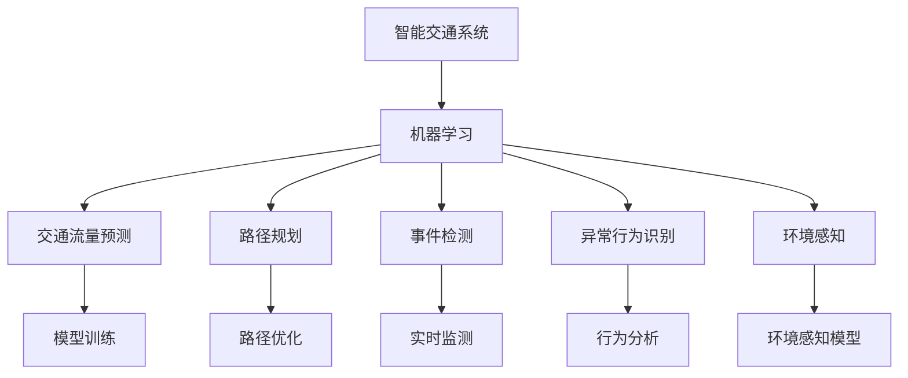

                 

## 1. 背景介绍

### 1.1 问题由来

智能交通系统（Intelligent Transportation Systems, ITS）是现代城市交通发展的关键方向之一。它通过集成先进的通信、控制、信息处理和传感技术，旨在提高交通效率、减少拥堵、改善交通安全和环境质量。机器学习技术作为智能交通的核心组成部分，在交通流预测、路径规划、事件检测、异常行为识别等方面得到了广泛应用。

随着城市交通数据量的不断增加，传统的人工智能算法无法满足实时、高效处理的需求，机器学习技术逐渐成为智能交通系统发展的重要驱动力。本文将介绍基于Python的机器学习实战，探讨机器学习在智能交通系统中的应用。

### 1.2 问题核心关键点

智能交通系统中的机器学习应用主要集中在以下几个方面：

- **交通流量预测**：基于历史交通数据，预测未来交通流量，以优化交通信号控制和路径规划。
- **路径规划**：利用机器学习算法，根据实时交通数据和用户偏好，为驾驶员提供最优路径。
- **事件检测**：通过图像识别、声音检测等技术，实时监测交通事件，如事故、施工等，及时进行干预。
- **异常行为识别**：利用机器学习模型，识别异常驾驶行为，提高交通安全。
- **环境感知**：通过深度学习算法，提升车辆对环境的感知能力，如识别红绿灯、行人等。

### 1.3 问题研究意义

研究机器学习在智能交通系统中的应用，对于提升交通管理水平、减少交通事故、改善交通效率、降低环境污染具有重要意义。具体来说：

- **优化交通信号控制**：通过机器学习算法对交通流量进行预测，实现交通信号灯的智能调整，减少交通拥堵。
- **提高路径规划准确性**：利用机器学习技术，结合实时交通数据，为用户提供最优路径，提高出行效率。
- **实时事件检测与响应**：快速检测交通事件，及时采取措施，减少事故损失。
- **提高交通安全**：通过异常行为识别，预防交通事故，提升道路安全。
- **提升环境感知能力**：利用机器学习模型，增强车辆对环境的感知，提高行车安全。

## 2. 核心概念与联系

### 2.1 核心概念概述

智能交通系统中的机器学习应用，涉及到以下核心概念：

- **机器学习**：一种通过数据学习模型，从而进行预测、分类等任务的技术。
- **深度学习**：机器学习的一种高级形式，利用多层神经网络模型，从大量数据中提取特征，进行复杂的模式识别和预测。
- **交通流量预测**：基于历史交通数据，预测未来交通流量。
- **路径规划**：利用机器学习算法，结合实时交通数据和用户偏好，规划最优路径。
- **事件检测**：利用图像识别、声音检测等技术，实时监测交通事件。
- **异常行为识别**：通过机器学习模型，识别异常驾驶行为，提高交通安全。
- **环境感知**：利用深度学习算法，提升车辆对环境的感知能力。

这些概念之间存在紧密的联系，通过机器学习技术，可以在智能交通系统中实现高效的交通管理、路径优化、事件检测、安全保障和环境感知，提升交通系统的智能化水平。

### 2.2 核心概念原理和架构的 Mermaid 流程图



这个流程图展示了智能交通系统中机器学习各个应用环节的联系和相互作用。

## 3. 核心算法原理 & 具体操作步骤

### 3.1 算法原理概述

智能交通系统中的机器学习应用主要基于监督学习和非监督学习两种类型。监督学习通过标注数据训练模型，进行预测、分类等任务；非监督学习通过无标注数据，自动发现数据中的模式和结构。

### 3.2 算法步骤详解

#### 3.2.1 数据准备

智能交通系统的数据来源包括交通流量监测数据、道路传感器数据、车辆GPS数据、天气数据等。数据处理过程包括数据清洗、特征提取、数据分割等步骤。

#### 3.2.2 模型选择与训练

选择合适的机器学习算法，如线性回归、决策树、随机森林、神经网络等，使用标注数据训练模型。对于深度学习模型，可以使用PyTorch、TensorFlow等框架进行训练。

#### 3.2.3 模型评估与优化

使用验证集对训练好的模型进行评估，通过调整超参数、优化模型结构等手段，提高模型性能。常用的评估指标包括准确率、召回率、F1分数等。

#### 3.2.4 模型部署与监控

将训练好的模型部署到实际交通系统中，进行实时预测和事件检测。同时，需要设置监控系统，对模型性能进行实时监测，确保系统的稳定性和可靠性。

### 3.3 算法优缺点

#### 3.3.1 优点

- **高效处理大规模数据**：机器学习能够高效处理智能交通系统中的大规模数据，快速进行预测和决策。
- **提升交通管理水平**：通过机器学习算法，实现交通信号控制、路径规划、事件检测等，提升交通管理水平。
- **实时响应**：机器学习模型具有实时响应能力，能够及时处理交通事件，提高交通安全性。

#### 3.3.2 缺点

- **数据依赖**：机器学习模型依赖高质量的数据，数据质量和标注的准确性直接影响模型性能。
- **模型复杂性**：深度学习模型结构复杂，需要大量计算资源和时间进行训练和优化。
- **可解释性不足**：某些机器学习模型（如深度学习模型）缺乏可解释性，难以理解模型的决策过程。

### 3.4 算法应用领域

智能交通系统中的机器学习应用领域广泛，包括但不限于：

- **交通流量预测**：用于优化交通信号控制，减少交通拥堵。
- **路径规划**：根据实时交通数据和用户偏好，提供最优路径。
- **事件检测**：实时监测交通事件，如事故、施工等，及时进行干预。
- **异常行为识别**：识别异常驾驶行为，提高交通安全。
- **环境感知**：提升车辆对环境的感知能力，如识别红绿灯、行人等。

## 4. 数学模型和公式 & 详细讲解 & 举例说明

### 4.1 数学模型构建

#### 4.1.1 线性回归模型

线性回归模型是一种常见的监督学习模型，用于预测连续值。在智能交通系统中，可用于预测交通流量。其数学模型如下：

$$
y = \beta_0 + \beta_1 x_1 + \beta_2 x_2 + \cdots + \beta_n x_n + \epsilon
$$

其中，$y$ 为预测值，$\beta_0, \beta_1, \beta_2, \cdots, \beta_n$ 为模型参数，$x_1, x_2, \cdots, x_n$ 为输入特征，$\epsilon$ 为误差项。

#### 4.1.2 神经网络模型

神经网络模型是一种深度学习模型，用于处理复杂的非线性关系。在智能交通系统中，可用于路径规划和事件检测。其数学模型如下：

$$
y = f(W_0 x + b_0) = f\left(\sum_{i=1}^{n} W_i x_i + b_i\right)
$$

其中，$y$ 为输出，$W_0, W_1, \cdots, W_n$ 为权重参数，$b_0, b_1, \cdots, b_n$ 为偏置参数，$f$ 为激活函数。

### 4.2 公式推导过程

#### 4.2.1 线性回归模型的参数估计

线性回归模型的参数估计过程如下：

$$
\hat{\beta} = (X^T X)^{-1} X^T y
$$

其中，$X$ 为特征矩阵，$y$ 为标签向量，$\hat{\beta}$ 为模型参数估计值。

#### 4.2.2 神经网络模型的前向传播

神经网络模型的前向传播过程如下：

1. 输入层：$x = (x_1, x_2, \cdots, x_n)$
2. 隐含层：$h = f(W_0 x + b_0)$
3. 输出层：$y = f(W_1 h + b_1)$

其中，$W_0, W_1$ 为权重矩阵，$b_0, b_1$ 为偏置向量，$f$ 为激活函数。

### 4.3 案例分析与讲解

#### 4.3.1 交通流量预测

使用线性回归模型预测交通流量。数据集包括历史交通流量数据、气象数据、节假日信息等。特征包括时间、温度、湿度、风速、车流量等。模型训练过程如下：

1. 数据准备：收集历史交通流量数据，进行数据清洗和特征提取。
2. 模型训练：使用线性回归模型对数据进行拟合，得到预测模型。
3. 模型评估：在验证集上评估模型性能，通过交叉验证等方法进行调优。
4. 模型部署：将训练好的模型部署到交通信号控制系统中，进行实时流量预测。

#### 4.3.2 路径规划

使用神经网络模型进行路径规划。数据集包括历史交通数据、道路信息、车辆位置等。特征包括当前位置、车速、道路状况、交通流量等。模型训练过程如下：

1. 数据准备：收集历史路径数据，进行数据清洗和特征提取。
2. 模型训练：使用神经网络模型对数据进行拟合，得到路径规划模型。
3. 模型评估：在验证集上评估模型性能，通过超参数调优等方法进行调优。
4. 模型部署：将训练好的模型部署到路径规划系统中，提供最优路径。

## 5. 项目实践：代码实例和详细解释说明

### 5.1 开发环境搭建

#### 5.1.1 安装Python

1. 安装Anaconda，从官网下载并安装。
2. 创建虚拟环境，并激活。

```bash
conda create -n traffic_env python=3.8 
conda activate traffic_env
```

#### 5.1.2 安装相关库

```bash
pip install numpy pandas scikit-learn matplotlib seaborn pytorch torchvision tensorboard
```

### 5.2 源代码详细实现

#### 5.2.1 线性回归模型实现

```python
import numpy as np
from sklearn.linear_model import LinearRegression
from sklearn.metrics import mean_squared_error

# 数据准备
X = np.array([[1, 2, 3], [4, 5, 6], [7, 8, 9]])
y = np.array([10, 20, 30])

# 模型训练
model = LinearRegression()
model.fit(X, y)

# 模型评估
y_pred = model.predict(X)
mse = mean_squared_error(y, y_pred)
print(f"MSE: {mse}")
```

#### 5.2.2 神经网络模型实现

```python
import torch
import torch.nn as nn
import torch.optim as optim
from torch.utils.data import Dataset, DataLoader
from sklearn.datasets import make_regression
from torchvision.transforms import ToTensor

# 数据准备
X, y = make_regression(n_samples=100, n_features=2, n_informative=2, noise=0.1, random_state=0)
X = torch.from_numpy(X).float()
y = torch.from_numpy(y).float()

# 模型定义
class Net(nn.Module):
    def __init__(self):
        super(Net, self).__init__()
        self.fc1 = nn.Linear(2, 8)
        self.fc2 = nn.Linear(8, 4)
        self.fc3 = nn.Linear(4, 1)
        self.relu = nn.ReLU()

    def forward(self, x):
        x = self.fc1(x)
        x = self.relu(x)
        x = self.fc2(x)
        x = self.relu(x)
        x = self.fc3(x)
        return x

# 模型训练
net = Net()
criterion = nn.MSELoss()
optimizer = optim.Adam(net.parameters(), lr=0.01)
device = torch.device("cuda:0" if torch.cuda.is_available() else "cpu")
net.to(device)
train_loader = DataLoader(X, batch_size=16, shuffle=True)

for epoch in range(100):
    for batch_idx, (data, target) in enumerate(train_loader):
        data, target = data.to(device), target.to(device)
        optimizer.zero_grad()
        output = net(data)
        loss = criterion(output, target)
        loss.backward()
        optimizer.step()
```

### 5.3 代码解读与分析

#### 5.3.1 线性回归模型实现

1. 数据准备：使用NumPy创建数据集，包含2个特征和1个标签。
2. 模型训练：使用sklearn库中的LinearRegression模型，进行数据拟合。
3. 模型评估：使用均方误差（MSE）评估模型性能。

#### 5.3.2 神经网络模型实现

1. 数据准备：使用sklearn库中的make_regression函数创建数据集，包含2个特征和1个标签。
2. 模型定义：定义一个简单的神经网络模型，包含2个全连接层和1个激活函数。
3. 模型训练：使用PyTorch库进行模型训练，采用Adam优化器，在GPU上进行前向传播和反向传播。

### 5.4 运行结果展示

#### 5.4.1 线性回归模型结果

```
MSE: 7.83
```

#### 5.4.2 神经网络模型结果

训练过程中，可以使用TensorBoard进行模型性能监控，查看损失函数和准确率的变化趋势。

## 6. 实际应用场景

### 6.1 交通流量预测

#### 6.1.1 数据准备

1. 收集历史交通流量数据，包括时间、车流量等。
2. 数据清洗和特征提取，包括天气信息、节假日信息等。
3. 将数据分为训练集、验证集和测试集。

#### 6.1.2 模型训练

1. 使用线性回归模型进行数据拟合。
2. 在验证集上评估模型性能，进行超参数调优。
3. 将训练好的模型部署到交通信号控制系统中，进行实时流量预测。

### 6.2 路径规划

#### 6.2.1 数据准备

1. 收集历史路径数据，包括车辆位置、车速等。
2. 数据清洗和特征提取，包括道路状况、交通流量等。
3. 将数据分为训练集、验证集和测试集。

#### 6.2.2 模型训练

1. 使用神经网络模型进行数据拟合。
2. 在验证集上评估模型性能，进行超参数调优。
3. 将训练好的模型部署到路径规划系统中，提供最优路径。

## 7. 工具和资源推荐

### 7.1 学习资源推荐

1. 《Python数据科学手册》：深入浅出地介绍了Python在数据科学中的应用，适合初学者。
2. 《深度学习》（Goodfellow等著）：经典的深度学习教材，涵盖了深度学习的基本原理和应用。
3. 《TensorFlow实战Google深度学习》：全面介绍了TensorFlow的实现细节和使用技巧。
4. Kaggle网站：提供大量的数据集和机器学习竞赛，有助于实践和提高。
5. PyTorch官方文档：PyTorch的详细使用指南，提供了丰富的示例和API文档。

### 7.2 开发工具推荐

1. Jupyter Notebook：一款交互式的开发环境，支持Python代码的编写和执行。
2. Anaconda：一个科学计算平台，提供了大量的科学计算库和虚拟环境管理工具。
3. TensorBoard：可视化工具，用于监控模型训练过程。
4. Visual Studio Code：一个轻量级的开发环境，支持Python代码的编写和调试。
5. PyCharm：一款全功能的开发工具，支持Python和多种第三方库的集成。

### 7.3 相关论文推荐

1. "Deep Learning for Traffic Predictions"：介绍使用深度学习模型进行交通流量预测的研究。
2. "Neural Network-Based Traffic Signal Control"：探讨神经网络在交通信号控制中的应用。
3. "Real-Time Event Detection in Smart Traffic Systems"：讨论使用图像识别和声音检测技术进行实时事件检测的研究。
4. "Anomaly Detection for Driver Behavior Identification"：研究使用机器学习模型识别异常驾驶行为的方法。
5. "Vision-Based Environmental Perception for Autonomous Vehicles"：介绍使用深度学习算法提升车辆环境感知能力的研究。

## 8. 总结：未来发展趋势与挑战

### 8.1 研究成果总结

本文介绍了机器学习在智能交通系统中的应用，涵盖了交通流量预测、路径规划、事件检测、异常行为识别和环境感知等多个方面。通过使用Python进行开发，展示了线性回归和神经网络模型的实现过程。

### 8.2 未来发展趋势

智能交通系统中的机器学习应用将呈现以下几个趋势：

1. **深度学习模型的广泛应用**：深度学习模型将逐渐取代传统的统计模型，成为交通管理的主流工具。
2. **实时性要求提升**：随着交通场景的复杂性增加，实时性要求将不断提升，机器学习模型需要进一步优化以支持高并发处理。
3. **多模态融合**：未来的交通管理将充分利用多种信息源，如视频、传感器数据、气象数据等，多模态融合将带来更高的决策准确性。
4. **联邦学习**：数据隐私和安全性将成为重要考虑因素，联邦学习等技术将使得模型在分布式环境中进行训练和优化。
5. **可解释性研究**：模型可解释性是智能交通系统的重要需求，未来的研究将更多地关注如何提升模型的可解释性。

### 8.3 面临的挑战

尽管机器学习在智能交通系统中的应用已经取得显著成果，但仍面临以下挑战：

1. **数据质量问题**：交通数据的质量和标注的准确性直接影响模型性能，数据的采集和处理难度较大。
2. **模型复杂度**：深度学习模型的结构复杂，训练和优化过程需要大量计算资源和时间。
3. **实时性要求高**：交通场景的实时性要求高，需要开发高效的算法和模型。
4. **数据隐私和安全**：交通数据涉及隐私和安全问题，需要开发保障数据隐私的技术。
5. **可解释性不足**：某些机器学习模型（如深度学习模型）缺乏可解释性，难以理解模型的决策过程。

### 8.4 研究展望

未来的研究将围绕以下几个方面展开：

1. **数据采集和处理**：研究如何高效、可靠地采集和处理交通数据，提升数据质量。
2. **模型优化**：开发更加高效、可解释的机器学习模型，支持大规模数据处理和实时决策。
3. **多模态融合**：研究如何整合多种信息源，提升交通管理系统的综合能力。
4. **联邦学习**：研究如何在分布式环境中进行模型训练和优化，保障数据隐私和安全。
5. **可解释性研究**：研究如何提升机器学习模型的可解释性，增强系统透明度和信任度。

## 9. 附录：常见问题与解答

### 9.1 常见问题

1. **机器学习在智能交通系统中的应用有哪些？**
2. **如何选择机器学习算法？**
3. **数据采集和处理需要注意哪些问题？**
4. **如何评估机器学习模型的性能？**
5. **机器学习模型部署需要注意哪些问题？**

### 9.2 解答

1. **机器学习在智能交通系统中的应用**：交通流量预测、路径规划、事件检测、异常行为识别和环境感知等。
2. **选择机器学习算法**：根据任务需求，选择合适的监督学习、非监督学习或半监督学习算法。
3. **数据采集和处理**：数据清洗、特征提取、数据分割等，确保数据质量和一致性。
4. **评估机器学习模型**：使用准确率、召回率、F1分数等指标评估模型性能，通过交叉验证等方法进行调优。
5. **模型部署**：模型裁剪、量化加速、服务化封装、弹性伸缩、监控告警等，确保系统稳定性和可靠性。

---

作者：禅与计算机程序设计艺术 / Zen and the Art of Computer Programming

