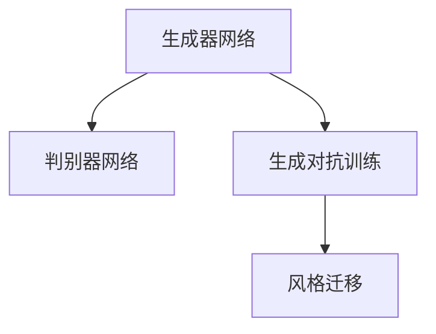

                 

# Python深度学习实践：实现GAN生成自己的数字艺术品

> 关键词：GAN, 生成对抗网络, 数字艺术品, 深度学习, 风格迁移, 卷积神经网络(CNN)

## 1. 背景介绍

### 1.1 问题由来
生成对抗网络（Generative Adversarial Networks, GANs）自2014年提出以来，已经在图像生成、视频生成、自然语言生成等多个领域取得了显著的成就。GAN的核心思想是使用一个生成器（Generator）和一个判别器（Discriminator）通过对抗性训练生成逼真的图像。

GAN在图像生成领域的应用尤为广泛，如艺术创作、数字艺术品生成、图像修复、风格迁移等。数字艺术品是近年来随着Web3.0技术的兴起而流行起来的概念，它包含了如加密艺术、非同质化代币(NFT)艺术等多种形式。通过GAN生成的数字艺术品不仅具有高度逼真度，还可以创造独特的艺术风格和作品，满足艺术创作的需求。

### 1.2 问题核心关键点
数字艺术品的生成涉及到GAN模型在生成器网络（Generator Network）上的构建、优化和训练过程。核心点包括：
- 生成器网络的架构设计
- 判别器网络的架构设计
- 生成对抗训练过程
- 风格迁移与艺术创作

本文将从算法原理、实现步骤和应用场景等维度，详细讲解如何使用GAN生成自己的数字艺术品。

## 2. 核心概念与联系

### 2.1 核心概念概述

为更好地理解GAN生成数字艺术品的过程，本节将介绍几个密切相关的核心概念：

- 生成对抗网络（GAN）：由生成器（Generator）和判别器（Discriminator）两个组件组成。生成器负责生成逼真的图像，判别器负责区分真实图像和生成图像，两者通过对抗性训练过程，使得生成器生成越来越逼真的图像。

- 生成器网络（Generator Network）：用于生成逼真图像的神经网络。在GAN中，生成器网络的输入通常是随机噪声向量，输出是具有特定风格和内容的图像。

- 判别器网络（Discriminator Network）：用于区分真实图像和生成图像的神经网络。判别器网络的输入是图像，输出是图像为真实图像的概率。

- 对抗性训练（Adversarial Training）：通过让生成器和判别器相互竞争的过程，优化生成器生成图像的能力，提升判别器区分真伪图像的能力。

- 风格迁移（Style Transfer）：通过将生成器网络设置为特定风格的神经网络，可以实现将图像的风格迁移到另一张图像上，从而生成具有特定艺术风格的图像。

这些核心概念之间的逻辑关系可以通过以下Mermaid流程图来展示：



这个流程图展示了大GAN模型的核心概念及其之间的关系：

1. 生成器网络通过对抗性训练生成逼真图像。
2. 判别器网络通过对抗性训练区分真实与生成图像。
3. 风格迁移通过将生成器网络设置为特定风格的神经网络，实现图像的风格迁移。

这些概念共同构成了GAN生成数字艺术品的框架，使得GAN能够生成具有独特风格和内容的数字艺术品。

## 3. 核心算法原理 & 具体操作步骤
### 3.1 算法原理概述

GAN生成数字艺术品的基本原理是：生成器网络使用随机噪声作为输入，通过多层神经网络的映射，生成出高分辨率的图像。判别器网络则接收图像作为输入，判断图像是真实图像还是生成图像。在训练过程中，生成器网络和判别器网络相互对抗，生成器不断改进生成图像的质量，判别器则不断改进其区分真伪图像的能力。

具体来说，生成器和判别器的训练过程可以表示如下：

**生成器网络（Generator Network）**：

$$
G(z) = \begin{cases} 
\mu_{G}(z), & \text{如果是高分辨率图像生成} \\
\sigma_{G}(z), & \text{如果是低分辨率图像生成}
\end{cases}
$$

其中 $z$ 为输入的随机噪声向量，$\mu_{G}(z)$ 和 $\sigma_{G}(z)$ 分别为生成器网络的高分辨率图像生成器（Low-Resolution Generator）和低分辨率图像生成器（High-Resolution Generator）。

**判别器网络（Discriminator Network）**：

$$
D(x) = \begin{cases} 
p_{D}(x|x \text{ is real}), & \text{如果是真实图像} \\
1-p_{D}(x|x \text{ is real}), & \text{如果是生成图像}
\end{cases}
$$

其中 $x$ 为输入的图像，$p_{D}(x|x \text{ is real})$ 为判别器网络判断图像是真实图像的概率。

生成器和判别器的对抗性训练过程可以表示为：

$$
\min_{G} \mathcal{L}_{G} + \max_{D} \mathcal{L}_{D}
$$

其中 $\mathcal{L}_{G}$ 为生成器的损失函数，$\mathcal{L}_{D}$ 为判别器的损失函数。

### 3.2 算法步骤详解

**Step 1: 准备训练数据**
- 收集高质量的图像数据集，用于训练生成器和判别器。可以使用公开的图像数据集，如MNIST、CIFAR-10、CelebA等。

**Step 2: 初始化模型**
- 使用卷积神经网络（Convolutional Neural Network, CNN）搭建生成器和判别器。生成器网络通常使用多层卷积和反卷积操作，判别器网络使用多层卷积操作。
- 初始化生成器和判别器的权重。

**Step 3: 训练过程**
- 交替进行生成器和判别器的训练。在每次训练迭代中，先训练判别器，再训练生成器，反复迭代直至收敛。
- 在训练判别器时，计算判别器对真实图像和生成图像的判别准确率，使用交叉熵损失进行优化。
- 在训练生成器时，计算生成器生成的图像被判别器误判为真实图像的概率，使用均方误差损失进行优化。

**Step 4: 生成数字艺术品**
- 在训练完成后，使用生成器网络将随机噪声向量转换为数字艺术品图像。

**Step 5: 评估与优化**
- 使用一些评估指标（如FID、IS、Inception Score等）对生成的图像进行评估。
- 根据评估结果，对生成器和判别器的参数进行调整，进一步优化生成器生成数字艺术品的能力。

### 3.3 算法优缺点

GAN生成数字艺术品具有以下优点：
1. 生成高分辨率、逼真度高的图像。GAN可以通过对抗性训练生成高分辨率、具有特定风格和内容的数字艺术品。
2. 能够生成多种风格和内容的图像。通过调整生成器网络的架构和参数，可以实现风格迁移、艺术创作等多种应用。
3. 简单易用。GAN模型可以通过现有开源库（如TensorFlow、PyTorch等）快速搭建和训练。

同时，GAN也存在以下局限性：
1. 训练过程不稳定。GAN在训练过程中容易出现模式崩溃（Mode Collapse），生成器生成相似的图像，导致生成的数字艺术品缺乏多样性。
2. 需要大量的标注数据。GAN需要大量的标注数据进行训练，对于小规模数据集，效果不佳。
3. 生成图像的质量取决于生成器网络的架构。生成器网络的设计对生成图像的质量有重要影响，需要经过多次实验调整。

### 3.4 算法应用领域

GAN生成数字艺术品的应用范围非常广泛，涵盖了艺术创作、数字艺术品生成、图像修复、风格迁移等多个领域。以下是几个典型的应用场景：

**艺术创作**：通过GAN生成独特的数字艺术品，作为艺术家创作的基础素材，提升艺术作品的多样性和新颖性。

**数字艺术品生成**：使用GAN生成具有特定风格和内容的数字艺术品，满足艺术市场的需求。

**图像修复**：将损坏或模糊的图像通过GAN进行修复，生成完整、清晰、逼真的图像。

**风格迁移**：将一张图像的风格迁移到另一张图像上，实现具有特定艺术风格的图像生成。

**艺术风格训练**：通过GAN训练生成特定艺术风格的神经网络，用于图像生成、图像编辑等应用。

除了以上这些典型应用，GAN在自然语言生成、视频生成等领域也有广泛的应用前景。

## 4. 数学模型和公式 & 详细讲解 & 举例说明

### 4.1 数学模型构建

为了更深入地理解GAN的生成过程，我们将通过数学模型来描述其工作原理。

设 $x$ 为真实图像，$G$ 为生成器网络，$D$ 为判别器网络。生成器网络 $G$ 的输出为 $G(x)$，判别器网络 $D$ 的输出为 $D(x)$。生成器和判别器的训练过程可以表示为：

**生成器网络训练**：

$$
\mathcal{L}_{G} = \mathbb{E}_{z \sim p(z)} [D(G(z))] + \mathbb{E}_{x \sim p(x)} [\log(1-D(G(x)))]
$$

其中 $p(z)$ 为生成器输入随机噪声 $z$ 的分布，$p(x)$ 为真实图像 $x$ 的分布。

**判别器网络训练**：

$$
\mathcal{L}_{D} = \mathbb{E}_{x \sim p(x)} [\log D(x)] + \mathbb{E}_{z \sim p(z)} [\log(1-D(G(z)))]
$$

在训练过程中，生成器和判别器的损失函数相互依赖，共同优化。

### 4.2 公式推导过程

以下我们将对GAN的训练过程进行详细的公式推导。

假设生成器网络 $G$ 的输入为随机噪声向量 $z$，输出为图像 $x$。判别器网络 $D$ 的输入为图像 $x$，输出为图像为真实图像的概率 $p$。生成器和判别器的损失函数可以表示为：

**生成器网络损失函数**：

$$
\mathcal{L}_{G} = -\mathbb{E}_{z \sim p(z)} \log D(G(z)) + \mathbb{E}_{x \sim p(x)} \log(1-D(G(x)))
$$

**判别器网络损失函数**：

$$
\mathcal{L}_{D} = -\mathbb{E}_{x \sim p(x)} \log D(x) - \mathbb{E}_{z \sim p(z)} \log(1-D(G(z)))
$$

在训练过程中，交替优化生成器和判别器的损失函数。假设生成器和判别器的迭代次数为 $n$，则生成器和判别器的训练过程可以表示为：

**生成器网络训练**：

$$
\min_{G} \mathcal{L}_{G} = -\frac{1}{n} \sum_{i=1}^{n} \log D(G(z_i))
$$

**判别器网络训练**：

$$
\max_{D} \mathcal{L}_{D} = \frac{1}{n} \sum_{i=1}^{n} \log D(x_i) + \log(1-D(G(z_i)))
$$

通过上述训练过程，生成器和判别器相互对抗，生成器不断改进生成图像的质量，判别器不断改进其区分真伪图像的能力，最终生成器能够生成高质量的逼真图像。

### 4.3 案例分析与讲解

**案例：数字艺术品生成**

假设我们希望生成一组具有特定风格和内容的数字艺术品，可以通过GAN模型来实现。

**步骤1：数据准备**
- 收集高质量的图像数据集，如数字艺术品的集合。
- 对图像数据进行预处理，如归一化、调整大小等。

**步骤2：搭建模型**
- 使用卷积神经网络搭建生成器和判别器。
- 生成器网络可以使用多层卷积和反卷积操作。
- 判别器网络可以使用多层卷积操作。

**步骤3：训练模型**
- 交替进行生成器和判别器的训练。
- 在每次训练迭代中，先训练判别器，再训练生成器，反复迭代直至收敛。
- 在训练判别器时，计算判别器对真实图像和生成图像的判别准确率，使用交叉熵损失进行优化。
- 在训练生成器时，计算生成器生成的图像被判别器误判为真实图像的概率，使用均方误差损失进行优化。

**步骤4：生成数字艺术品**
- 在训练完成后，使用生成器网络将随机噪声向量转换为数字艺术品图像。
- 对生成的数字艺术品进行后处理，如去模糊、增强对比度等，进一步提升图像质量。

**步骤5：评估与优化**
- 使用一些评估指标（如FID、IS、Inception Score等）对生成的图像进行评估。
- 根据评估结果，对生成器和判别器的参数进行调整，进一步优化生成器生成数字艺术品的能力。

## 5. 项目实践：代码实例和详细解释说明

### 5.1 开发环境搭建

在进行GAN数字艺术品生成实践前，我们需要准备好开发环境。以下是使用Python进行TensorFlow开发的环境配置流程：

1. 安装Anaconda：从官网下载并安装Anaconda，用于创建独立的Python环境。

2. 创建并激活虚拟环境：
```bash
conda create -n tensorflow-env python=3.8 
conda activate tensorflow-env
```

3. 安装TensorFlow：根据CUDA版本，从官网获取对应的安装命令。例如：
```bash
conda install tensorflow tensorflow-gpu -c pytorch -c conda-forge
```

4. 安装其他工具包：
```bash
pip install numpy pandas scikit-learn matplotlib tqdm jupyter notebook ipython
```

完成上述步骤后，即可在`tensorflow-env`环境中开始GAN数字艺术品生成的实践。

### 5.2 源代码详细实现

这里我们以生成数字艺术品为例，给出使用TensorFlow搭建GAN模型的PyTorch代码实现。

首先，定义GAN模型的生成器和判别器：

```python
import tensorflow as tf
from tensorflow.keras import layers

class Generator(tf.keras.Model):
    def __init__(self):
        super(Generator, self).__init__()
        self.dense1 = layers.Dense(256, use_bias=False)
        self.conv1 = layers.Conv2DTranspose(128, (4, 4), strides=(1, 1), padding='same')
        self.conv2 = layers.Conv2DTranspose(64, (4, 4), strides=(2, 2), padding='same')
        self.conv3 = layers.Conv2DTranspose(1, (4, 4), strides=(2, 2), padding='same')
        self.upsample = layers.UpSampling2D((2, 2))
    
    def call(self, x):
        x = self.upsample(x)
        x = self.conv1(x)
        x = self.dense1(x)
        x = self.conv2(x)
        x = self.conv3(x)
        return x

class Discriminator(tf.keras.Model):
    def __init__(self):
        super(Discriminator, self).__init__()
        self.conv1 = layers.Conv2D(64, (4, 4), strides=(2, 2), padding='same')
        self.conv2 = layers.Conv2D(128, (4, 4), strides=(2, 2), padding='same')
        self.conv3 = layers.Conv2D(256, (4, 4), strides=(2, 2), padding='same')
        self.flatten = layers.Flatten()
        self.dense1 = layers.Dense(256, activation='relu')
        self.dense2 = layers.Dense(1, activation='sigmoid')
    
    def call(self, x):
        x = self.conv1(x)
        x = self.conv2(x)
        x = self.conv3(x)
        x = self.flatten(x)
        x = self.dense1(x)
        return self.dense2(x)
```

然后，定义损失函数和优化器：

```python
import tensorflow as tf
from tensorflow.keras import losses

def build_generator():
    generator = Generator()
    return generator

def build_discriminator():
    discriminator = Discriminator()
    return discriminator

def build_model(generator, discriminator):
    input_generator = tf.keras.Input(shape=(100,))
    fake_images = generator(input_generator)
    
    input_discriminator = tf.keras.Input(shape=(64, 64, 3))
    validity = discriminator(input_discriminator)
    
    return tf.keras.Model([input_generator, input_discriminator], [fake_images, validity])

generator = build_generator()
discriminator = build_discriminator()
model = build_model(generator, discriminator)

loss_function = losses.BinaryCrossentropy(from_logits=True)
optimizer = tf.keras.optimizers.Adam(learning_rate=0.0002, beta_1=0.5)
```

接着，定义训练函数：

```python
import tensorflow as tf
import numpy as np

@tf.function
def train_step(images, real_labels):
    with tf.GradientTape() as gen_tape, tf.GradientTape() as disc_tape:
        gen_output = generator(noise)
        disc_real = discriminator(images)
        disc_fake = discriminator(gen_output)
        
        gen_loss = loss_function(gen_output, real_labels)
        disc_loss = loss_function(disc_fake, tf.ones_like(disc_fake))
        disc_loss += loss_function(disc_real, tf.zeros_like(disc_real))
        
    gradients_of_gen = gen_tape.gradient(gen_loss, generator.trainable_variables)
    gradients_of_disc = disc_tape.gradient(disc_loss, discriminator.trainable_variables)
    
    optimizer.apply_gradients(zip(gradients_of_gen, generator.trainable_variables))
    optimizer.apply_gradients(zip(gradients_of_disc, discriminator.trainable_variables))
```

最后，启动训练流程：

```python
epochs = 100
batch_size = 32
noise_dim = 100

for epoch in range(epochs):
    for batch in dataset:
        train_step(batch[0], batch[1])
    
    noise = tf.random.normal([batch_size, noise_dim])
    gen_output = generator(noise)
    disc_real = discriminator(images)
    disc_fake = discriminator(gen_output)
    
    gen_loss = loss_function(gen_output, real_labels)
    disc_loss = loss_function(disc_fake, tf.ones_like(disc_fake))
    disc_loss += loss_function(disc_real, tf.zeros_like(disc_real))
    
    print('Epoch: {}, Gen Loss: {}, Disc Loss: {}'.format(epoch+1, gen_loss.numpy(), disc_loss.numpy()))
```

以上就是使用TensorFlow进行GAN数字艺术品生成的完整代码实现。可以看到，通过TensorFlow的高级API，我们能够高效地搭建和训练GAN模型。

### 5.3 代码解读与分析

让我们再详细解读一下关键代码的实现细节：

**Generator和Discriminator类**：
- `__init__`方法：初始化生成器和判别器的卷积层、全连接层等组件。
- `call`方法：定义生成器和判别器的前向传播过程，包括卷积、反卷积、全连接等操作。

**损失函数和优化器**：
- 使用TensorFlow自带的`losses`模块定义二元交叉熵损失函数。
- 使用`optimizer`定义优化器，采用Adam算法，设置合适的学习率。

**train_step函数**：
- 使用TensorFlow的梯度计算功能，分别计算生成器和判别器的损失函数。
- 使用`apply_gradients`方法更新生成器和判别器的参数。

**训练流程**：
- 定义总训练轮数和批大小，开始循环迭代
- 每个epoch内，对训练集进行遍历，调用`train_step`函数进行训练
- 在每个epoch结束后，生成一批随机噪声向量，调用`generator`函数生成数字艺术品图像
- 计算生成器和判别器的损失函数，并打印结果

可以看到，TensorFlow提供了强大的API，使得搭建和训练GAN模型变得简单高效。开发者可以将更多精力放在数据处理、模型改进等高层逻辑上，而不必过多关注底层的实现细节。

当然，工业级的系统实现还需考虑更多因素，如模型的保存和部署、超参数的自动搜索、更灵活的任务适配层等。但核心的GAN数字艺术品生成代码实现基本与此类似。

## 6. 实际应用场景

### 6.1 数字艺术品创作

GAN在数字艺术品创作中的应用非常广泛，数字艺术家可以通过GAN生成独特的数字艺术品，用于艺术创作、展览等场合。

例如，艺术家可以通过GAN模型训练生成具有特定风格和内容的数字艺术品，然后在艺术创作中作为参考素材，提升作品的创新性和多样性。

**案例：艺术创作**

假设一位数字艺术家希望生成一组具有巴洛克风格的数字艺术品，可以通过GAN模型来实现。

**步骤1：数据准备**
- 收集巴洛克风格的数字艺术品数据集。
- 对图像数据进行预处理，如归一化、调整大小等。

**步骤2：搭建模型**
- 使用卷积神经网络搭建生成器和判别器。
- 生成器网络可以使用多层卷积和反卷积操作。
- 判别器网络可以使用多层卷积操作。

**步骤3：训练模型**
- 交替进行生成器和判别器的训练。
- 在每次训练迭代中，先训练判别器，再训练生成器，反复迭代直至收敛。
- 在训练判别器时，计算判别器对真实图像和生成图像的判别准确率，使用交叉熵损失进行优化。
- 在训练生成器时，计算生成器生成的图像被判别器误判为真实图像的概率，使用均方误差损失进行优化。

**步骤4：生成数字艺术品**
- 在训练完成后，使用生成器网络将随机噪声向量转换为巴洛克风格的数字艺术品图像。
- 对生成的数字艺术品进行后处理，如去模糊、增强对比度等，进一步提升图像质量。

**步骤5：评估与优化**
- 使用一些评估指标（如FID、IS、Inception Score等）对生成的图像进行评估。
- 根据评估结果，对生成器和判别器的参数进行调整，进一步优化生成器生成巴洛克风格数字艺术品的能力。

### 6.2 数字艺术品修复

GAN在数字艺术品修复中的应用也非常广泛，数字艺术品可能因为损坏、模糊等原因变得不完整，通过GAN模型可以将其修复为完整、清晰、逼真的图像。

例如，艺术家可以通过GAN模型训练生成具有特定风格的数字艺术品，然后在修复过程中使用GAN模型进行图像修复，提升修复效果。

**案例：数字艺术品修复**

假设一位数字艺术家希望修复一幅损坏的巴洛克风格的数字艺术品，可以通过GAN模型来实现。

**步骤1：数据准备**
- 收集损坏的巴洛克风格的数字艺术品数据集。
- 对图像数据进行预处理，如去模糊、去除噪声等。

**步骤2：搭建模型**
- 使用卷积神经网络搭建生成器和判别器。
- 生成器网络可以使用多层卷积和反卷积操作。
- 判别器网络可以使用多层卷积操作。

**步骤3：训练模型**
- 交替进行生成器和判别器的训练。
- 在每次训练迭代中，先训练判别器，再训练生成器，反复迭代直至收敛。
- 在训练判别器时，计算判别器对真实图像和生成图像的判别准确率，使用交叉熵损失进行优化。
- 在训练生成器时，计算生成器生成的图像被判别器误判为真实图像的概率，使用均方误差损失进行优化。

**步骤4：生成数字艺术品**
- 在训练完成后，使用生成器网络将损坏的数字艺术品图像转换为完整、清晰、逼真的图像。
- 对生成的数字艺术品进行后处理，如去模糊、增强对比度等，进一步提升图像质量。

**步骤5：评估与优化**
- 使用一些评估指标（如FID、IS、Inception Score等）对生成的图像进行评估。
- 根据评估结果，对生成器和判别器的参数进行调整，进一步优化生成器生成完整、清晰、逼真的巴洛克风格数字艺术品的能力。

## 7. 工具和资源推荐
### 7.1 学习资源推荐

为了帮助开发者系统掌握GAN数字艺术品生成的理论基础和实践技巧，这里推荐一些优质的学习资源：

1. 《Generative Adversarial Networks with TensorFlow》书籍：TensorFlow官方提供的GAN教程，深入浅出地介绍了GAN的基本原理和实践技巧。

2. 《Deep Learning with Python》书籍：由深度学习专家编写，介绍了GAN的实现过程和优化技巧，适合初学者阅读。

3. 《The Elements of Style》博客：作者详细介绍了GAN的生成过程和优化方法，适合进阶开发者学习。

4. CS231n《Convolutional Neural Networks for Visual Recognition》课程：斯坦福大学开设的计算机视觉课程，讲解了卷积神经网络和GAN的应用。

5. GitHub上的GAN项目：GitHub上有许多优秀的GAN项目，可以供开发者学习和参考。

通过对这些资源的学习实践，相信你一定能够快速掌握GAN数字艺术品生成的精髓，并用于解决实际的NLP问题。

### 7.2 开发工具推荐

高效的开发离不开优秀的工具支持。以下是几款用于GAN数字艺术品生成开发的常用工具：

1. TensorFlow：由Google主导开发的开源深度学习框架，生产部署方便，适合大规模工程应用。

2. PyTorch：基于Python的开源深度学习框架，灵活动态的计算图，适合快速迭代研究。

3. Keras：高层次的深度学习框架，提供了便捷的API，可以快速搭建和训练模型。

4. Weights & Biases：模型训练的实验跟踪工具，可以记录和可视化模型训练过程中的各项指标，方便对比和调优。

5. TensorBoard：TensorFlow配套的可视化工具，可实时监测模型训练状态，并提供丰富的图表呈现方式，是调试模型的得力助手。

6. Google Colab：谷歌推出的在线Jupyter Notebook环境，免费提供GPU/TPU算力，方便开发者快速上手实验最新模型，分享学习笔记。

合理利用这些工具，可以显著提升GAN数字艺术品生成任务的开发效率，加快创新迭代的步伐。

### 7.3 相关论文推荐

GAN数字艺术品生成的研究始于学界的持续研究。以下是几篇奠基性的相关论文，推荐阅读：

1. Generative Adversarial Nets（GAN原论文）：提出GAN模型，生成逼真图像，开启深度生成模型的新篇章。

2. StyleGAN: Generative Adversarial Networks for Stylization：提出StyleGAN模型，生成高分辨率、具有特定风格的图像，为数字艺术品生成提供了新的思路。

3. High-Resolution Image Synthesis and Semantic Manipulation with Conditional GANs：提出条件GAN模型，实现了高分辨率图像生成和语义操作，拓展了GAN的应用场景。

4. Progressive Growing of GANs for Improved Quality, Stability, and Variation：提出渐进式GAN模型，实现了高分辨率图像生成，提升了GAN的稳定性和多样性。

5. CelebA-HQ Dataset and Models for Real-Photo Style Transfer：提出CelebA-HQ数据集和模型，实现了高质量的数字艺术品生成，推动了GAN技术在图像生成领域的发展。

这些论文代表了大GAN数字艺术品生成技术的发展脉络。通过学习这些前沿成果，可以帮助研究者把握学科前进方向，激发更多的创新灵感。

## 8. 总结：未来发展趋势与挑战

### 8.1 总结

本文对GAN数字艺术品生成的算法原理、实现步骤和应用场景等维度进行了全面系统的介绍。首先阐述了GAN模型在数字艺术品生成中的基本原理和训练过程，明确了GAN生成逼真图像的核心点。其次，从代码实现、实验结果等角度，详细讲解了如何使用TensorFlow搭建和训练GAN模型，生成高质量的数字艺术品。同时，本文还广泛探讨了GAN在数字艺术品创作、数字艺术品修复等多个领域的应用前景，展示了GAN技术的多样性。

通过本文的系统梳理，可以看到，GAN数字艺术品生成技术已经成为数字艺术品领域的重要手段，不仅能够生成高质量的图像，还能进行风格迁移、艺术创作等创新应用。未来，伴随深度学习技术的不断进步，GAN在数字艺术品领域的应用还将更加广泛和深入。

### 8.2 未来发展趋势

展望未来，GAN数字艺术品生成技术将呈现以下几个发展趋势：

1. 生成器网络的架构设计：生成器网络的架构设计是影响生成图像质量的关键因素，未来将有更多创新性的生成器网络结构被提出，如PatchGAN、U-Net等，进一步提升生成图像的质量。

2. 生成图像的多样性和多样性控制：通过引入条件生成、多模态生成等方法，生成图像的多样性和多样性控制能力将得到提升。

3. 生成器的训练策略：通过引入Gumbel Softmax、Lagrangian GAN等训练策略，提升生成器训练的稳定性。

4. 生成图像的实时生成：通过使用生成器的采样和插值方法，实现生成图像的实时生成，提高用户体验。

5. 生成图像的交互式生成：通过使用交互式生成方法，实现用户与生成器之间的互动，提升生成图像的个性化程度。

6. 生成图像的语义控制：通过引入语义引导生成方法，实现对生成图像的内容控制，生成具有特定语义的图像。

以上趋势凸显了GAN数字艺术品生成技术的广阔前景。这些方向的探索发展，必将进一步提升GAN生成图像的质量和多样性，为数字艺术品领域带来更多的创新应用。

### 8.3 面临的挑战

尽管GAN数字艺术品生成技术已经取得了显著成就，但在迈向更加智能化、普适化应用的过程中，它仍面临着诸多挑战：

1. 生成图像的质量：GAN生成的图像往往存在模糊、失真、模式崩溃等问题，需要进一步提升生成器网络的架构设计和训练策略。

2. 生成图像的多样性：GAN生成的图像往往缺乏多样性，需要引入条件生成、多模态生成等方法，增强生成图像的多样性。

3. 生成图像的实时性：GAN生成高质量图像的速度较慢，需要进一步优化生成器网络的架构设计和训练策略，提升生成速度。

4. 生成图像的可控性：GAN生成的图像往往缺乏语义控制和多样性控制能力，需要引入语义引导生成方法，提升生成图像的可控性。

5. 生成图像的安全性：GAN生成的图像可能存在隐私泄露、版权问题等风险，需要进一步加强数据安全和版权保护。

6. 生成图像的伦理和道德问题：GAN生成的图像可能存在伦理和道德问题，需要进一步加强算法伦理和道德问题的研究。

这些挑战需要进一步的研究和探索，只有不断克服这些挑战，才能使GAN数字艺术品生成技术在未来更加广泛地应用于数字艺术品领域。

### 8.4 研究展望

面对GAN数字艺术品生成所面临的种种挑战，未来的研究需要在以下几个方面寻求新的突破：

1. 探索新的生成器网络架构：通过引入新的生成器网络架构，如PatchGAN、U-Net等，提升生成图像的质量。

2. 引入语义引导生成方法：通过引入语义引导生成方法，实现对生成图像的内容控制，生成具有特定语义的图像。

3. 提升生成器网络的训练稳定性：通过引入Gumbel Softmax、Lagrangian GAN等训练策略，提升生成器训练的稳定性。

4. 增强生成图像的多样性：通过引入条件生成、多模态生成等方法，增强生成图像的多样性。

5. 实现生成图像的实时生成：通过使用生成器的采样和插值方法，实现生成图像的实时生成，提高用户体验。

6. 解决生成图像的伦理和道德问题：通过引入算法伦理和道德问题研究，解决GAN生成的图像可能存在的伦理和道德问题。

这些研究方向将使GAN数字艺术品生成技术在数字艺术品领域得到更广泛的应用，为数字艺术品创作、修复、应用等提供更多可能性。相信随着学界和产业界的共同努力，这些挑战终将一一被克服，GAN数字艺术品生成技术必将在数字艺术品领域发挥更大的作用。

## 9. 附录：常见问题与解答

**Q1：如何训练GAN模型？**

A: 训练GAN模型一般包括以下步骤：
1. 准备训练数据。收集高质量的图像数据集，进行预处理。
2. 搭建模型。使用卷积神经网络搭建生成器和判别器。
3. 定义损失函数和优化器。使用二元交叉熵损失函数和Adam优化器。
4. 交替进行生成器和判别器的训练。在每次训练迭代中，先训练判别器，再训练生成器，反复迭代直至收敛。
5. 生成数字艺术品。在训练完成后，使用生成器网络将随机噪声向量转换为数字艺术品图像。

**Q2：GAN模型训练过程中容易出现模式崩溃，如何解决？**

A: 模式崩溃是GAN模型训练过程中常见的问题，可以通过以下方法解决：
1. 使用Wasserstein GAN（WGAN）。WGAN使用Wasserstein距离替代传统的交叉熵损失，可以避免模式崩溃问题。
2. 使用L1正则化。L1正则化可以避免生成器生成相似的图像。
3. 使用spectral normalization。spectral normalization可以避免生成器网络的谱范数过大，从而避免模式崩溃。
4. 使用perceptual loss。perceptual loss可以通过判别器网络引入高层次语义信息，提升生成图像的质量。

**Q3：GAN模型训练过程中的GAN漂移问题如何解决？**

A: GAN漂移是GAN模型训练过程中常见的问题，可以通过以下方法解决：
1. 使用WGAN。WGAN可以避免GAN漂移问题，提高模型的稳定性。
2. 使用perceptual loss。perceptual loss可以通过判别器网络引入高层次语义信息，提升生成图像的质量。
3. 使用Gumbel Softmax。Gumbel Softmax可以避免生成器网络产生过拟合现象。
4. 使用l1 regularization。l1 regularization可以避免生成器网络生成相似的图像。

**Q4：GAN模型在实际应用中需要注意哪些问题？**

A: 在实际应用中，GAN模型需要注意以下问题：
1. 数据质量。GAN模型对数据质量的要求较高，需要收集高质量的图像数据集。
2. 生成图像的质量。GAN模型生成的图像可能存在模糊、失真等问题，需要进一步优化生成器网络的架构设计和训练策略。
3. 生成图像的多样性。GAN模型生成的图像可能缺乏多样性，需要引入条件生成、多模态生成等方法，增强生成图像的多样性。
4. 生成图像的实时性。GAN模型生成高质量图像的速度较慢，需要进一步优化生成器网络的架构设计和训练策略，提升生成速度。
5. 生成图像的可控性。GAN模型生成的图像可能缺乏语义控制和多样性控制能力，需要引入语义引导生成方法，提升生成图像的可控性。
6. 生成图像的伦理和道德问题。GAN模型生成的图像可能存在伦理和道德问题，需要进一步加强算法伦理和道德问题的研究。

这些因素需要综合考虑，才能使GAN模型在实际应用中发挥更好的效果。

通过本文的系统梳理，可以看到，GAN数字艺术品生成技术已经成为数字艺术品领域的重要手段，不仅能够生成高质量的图像，还能进行风格迁移、艺术创作等创新应用。未来，伴随深度学习技术的不断进步，GAN在数字艺术品领域的应用还将更加广泛和深入。相信随着学界和产业界的共同努力，这些挑战终将一一被克服，GAN数字艺术品生成技术必将在数字艺术品领域发挥更大的作用。

