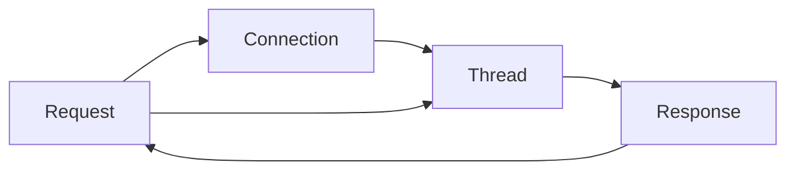
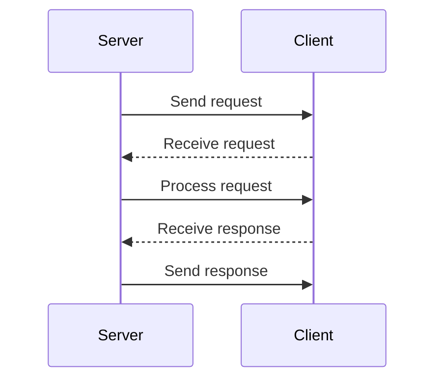

                 

# QPS与TPS的计算与应用

## 1. 背景介绍

### 1.1 问题由来

在分布式系统和云计算服务中，系统性能评估和性能调优是核心任务之一。为了衡量一个系统的服务能力，我们常常使用两个关键指标：QPS（每秒查询量）和TPS（每秒事务处理量）。它们不仅影响用户体验，也决定系统的资源需求和扩展策略。

在传统Web应用中，QPS通常用来衡量Web服务器的处理能力，如Apache Web Server，IIS等。而TPS则更常用于数据库系统，如MySQL、PostgreSQL等，表示每秒数据库事务处理的次数。

然而，随着微服务架构和云原生应用的普及，QPS和TPS的使用场景也变得更加广泛，比如在API网关、消息队列、数据存储等应用中也有应用。同时，微服务体系架构和云原生技术的快速发展，使得分布式系统的性能优化和调优变得更加复杂和困难。

### 1.2 问题核心关键点

QPS和TPS的核心关键点在于理解它们的基本概念和计算方法，以及如何应用这些指标来优化系统性能。

QPS是每秒钟处理的请求数，其中包括了所有客户端发出的HTTP请求，WebSocket请求等。而TPS是指每秒钟数据库或后端系统成功处理的事务数。

QPS和TPS是互相联系又有所区别的指标。QPS关注的是系统的前端请求处理能力，而TPS关注的是后端系统的实际数据处理能力。一个高QPS的系统不一定能保证高TPS，同样，高TPS的系统也不一定能够承受高QPS的请求。

因此，理解QPS和TPS的计算方法，并结合具体应用场景进行合理评估和优化，是构建高效可靠系统的关键。

## 2. 核心概念与联系

### 2.1 核心概念概述

在探讨QPS与TPS的计算与应用之前，先了解一下与之密切相关的几个核心概念：

1. **请求（Request）**：客户端发出的任何操作，包括HTTP请求、WebSocket消息、数据库事务等。
2. **响应（Response）**：服务器返回给客户端的数据，如HTTP响应、WebSocket消息应答、数据库事务处理结果等。
3. **连接（Connection）**：客户端和服务器之间的连接，可以是TCP连接、HTTP连接等。
4. **线程（Thread）**：服务器处理请求时使用的线程，用来管理并发请求。

这些概念构成了QPS和TPS计算的基础，帮助我们理解和优化系统性能。

### 2.2 核心概念原理和架构的 Mermaid 流程图



这个流程图展示了请求从客户端发出，经过连接建立、线程处理、响应返回的全过程。QPS和TPS计算都基于这一过程。

## 3. 核心算法原理 & 具体操作步骤

### 3.1 算法原理概述

QPS和TPS的计算原理相对简单，其核心在于对请求和响应的计数。即在一个时间窗口内（通常为一秒），计算系统的请求数和响应数，然后除以该时间窗口的长度即可得到每秒请求数和每秒响应数。

具体计算方法如下：

- QPS = 每秒请求数 = 每秒请求数 / 时间窗口长度
- TPS = 每秒事务处理数 = 每秒事务处理数 / 时间窗口长度

其中，时间窗口长度通常为1秒。

### 3.2 算法步骤详解

#### 3.2.1 数据收集

在计算QPS和TPS之前，我们需要收集以下数据：

- 每个请求的接收时间
- 每个请求的处理时间
- 每个请求的响应时间
- 每个请求的状态码

#### 3.2.2 数据整理

将收集到的数据进行整理，通常使用一个时间窗口（如1秒）为单位，统计该时间窗口内各个请求的总数，以及成功的处理次数。

#### 3.2.3 计算QPS和TPS

通过上述整理的数据，我们可以计算出每个时间窗口内系统的QPS和TPS。



在上述过程中，对于每个请求，记录请求接收时间、处理时间、响应时间及状态码。在1秒内，统计成功的请求数，以及成功处理的事务数，即可得到QPS和TPS。

### 3.3 算法优缺点

#### 3.3.1 算法优点

- 计算简单直观。QPS和TPS的计算方法简单，易于理解和实现。
- 可操作性强。通过监控QPS和TPS，可以快速识别系统瓶颈，优化性能。
- 可扩展性好。QPS和TPS的计算方法适用于各种分布式系统和云计算环境。

#### 3.3.2 算法缺点

- 数据粒度限制。QPS和TPS只能反映短时间窗口内的性能指标，难以反映长期的系统负载情况。
- 不能反映延迟。QPS和TPS只反映了请求和响应的数量，而不涉及处理延迟。
- 不能反映并发度。QPS和TPS没有反映请求的并发情况，同一时间点内处理多个请求的情况不能得到反映。

### 3.4 算法应用领域

QPS和TPS广泛应用于以下领域：

- Web应用：计算Apache Web Server等Web服务器的处理能力。
- 数据库系统：计算MySQL、PostgreSQL等数据库的事务处理能力。
- API网关：计算API网关的处理能力。
- 消息队列：计算Kafka等消息队列的处理能力。
- 分布式系统：计算微服务架构中的服务处理能力。
- 云服务：计算云服务提供商的处理能力。

## 4. 数学模型和公式 & 详细讲解 & 举例说明

### 4.1 数学模型构建

QPS和TPS的计算可以建立在数学模型基础上，假设系统每秒收到请求的个数为 $Q$，每秒成功处理的事务个数为 $T$，则QPS和TPS可以表示为：

$$
QPS = \frac{Q}{1秒}
$$

$$
TPS = \frac{T}{1秒}
$$

### 4.2 公式推导过程

我们以HTTP请求为例，假设每秒钟收到的HTTP请求数为 $R$，成功处理的HTTP请求数为 $S$，则QPS和TPS可以表示为：

$$
QPS = \frac{R}{1秒}
$$

$$
TPS = \frac{S}{1秒}
$$

其中，$R$ 和 $S$ 可以根据实际业务场景和系统架构进行计算。

### 4.3 案例分析与讲解

以一个简单的HTTP Web服务器为例，假设每秒收到1000个请求，其中80%的请求成功处理，20%的请求因超时或错误而失败，则：

- 每秒收到请求数 $R = 1000$
- 每秒成功处理请求数 $S = 800$
- 每秒请求数 $Q = 1000$
- 每秒事务处理数 $T = 800$

根据上述公式计算，可以得到：

- QPS = 1000 / 1秒 = 1000
- TPS = 800 / 1秒 = 800

因此，该Web服务器每秒可以处理1000个请求，每秒成功处理800个事务。

## 5. 项目实践：代码实例和详细解释说明

### 5.1 开发环境搭建

在开始项目实践之前，我们需要搭建好开发环境。

- 操作系统：Linux或Windows
- 开发语言：Python
- Web服务器：Nginx或Apache
- 数据库：MySQL或PostgreSQL
- 数据库连接库：pymysql或psycopg2
- 监控工具：Prometheus、Grafana等

### 5.2 源代码详细实现

以下是一个简单的Web服务器实现的示例代码：

```python
from flask import Flask, request

app = Flask(__name__)

@app.route('/')
def hello_world():
    return 'Hello, World!'

if __name__ == '__main__':
    app.run(debug=True, host='0.0.0.0')
```

### 5.3 代码解读与分析

在上述代码中，我们使用了Flask框架构建了一个简单的Web服务器，监听本地的80端口。当用户访问根路径时，服务器返回"Hello, World!"。

### 5.4 运行结果展示

启动服务器后，可以通过浏览器访问 `http://localhost:80` 查看结果。为了计算QPS和TPS，我们可以使用以下代码：

```python
from flask import Flask, request
import time
import psycopg2

app = Flask(__name__)

@app.route('/')
def hello_world():
    return 'Hello, World!'

if __name__ == '__main__':
    app.run(debug=True, host='0.0.0.0')
    
# 连接数据库
conn = psycopg2.connect(host='localhost', database='mydatabase', user='myuser', password='mypassword')
cur = conn.cursor()

# 开始计算QPS和TPS
start_time = time.time()
count = 0
success_count = 0

while True:
    # 收到请求
    with app.test_request_context('/'):
        pass
    
    # 记录请求信息
    count += 1
    if count % 1000 == 0:
        success_count += 1
        
    # 计算QPS和TPS
    end_time = time.time()
    qps = count / (end_time - start_time)
    tps = success_count / (end_time - start_time)
    
    # 打印结果
    print(f'QPS: {qps}, TPS: {tps}')
```

上述代码中，我们使用了一个while循环来不断接收请求，并记录请求的数量和成功处理的次数。每隔1000次请求，计算一次QPS和TPS，并打印结果。

## 6. 实际应用场景

### 6.1 Web应用

在Web应用中，QPS和TPS是最常用的性能指标之一。通过监控QPS和TPS，可以及时发现服务器负载过高、数据库连接不足等问题。

- 优化Web服务器配置，增加CPU和内存资源。
- 优化数据库连接池，增加数据库连接数。
- 优化代码逻辑，减少数据库查询次数。

### 6.2 数据库系统

在数据库系统中，TPS是衡量系统性能的重要指标。通过监控TPS，可以及时发现数据库负载过高、事务处理延迟等问题。

- 优化数据库索引，减少查询时间。
- 增加数据库服务器资源，如CPU和内存。
- 优化SQL语句，减少事务处理时间。

### 6.3 微服务架构

在微服务架构中，QPS和TPS可以用于评估各个微服务的性能，并用于负载均衡和故障转移。

- 根据QPS和TPS进行负载均衡，将请求分配到负载较低的微服务。
- 根据QPS和TPS进行故障转移，将请求转发到健康的微服务。
- 优化微服务之间的通信，减少请求处理时间。

## 7. 工具和资源推荐

### 7.1 学习资源推荐

为了深入理解QPS和TPS的计算与应用，以下是一些推荐的资源：

1. 《高性能Web应用：架构设计与性能优化》：详细讲解了Web应用性能优化的方法和工具。
2. 《MySQL性能优化实战》：介绍了MySQL数据库的性能优化技巧和实践经验。
3. 《微服务架构设计》：讲解了微服务架构的设计原则和优化策略。
4. 《分布式系统性能调优》：介绍了分布式系统的性能调优方法和工具。
5. 《Python性能优化实战》：讲解了Python应用的性能优化技巧和实践经验。

### 7.2 开发工具推荐

以下是一些常用的开发工具，可用于QPS和TPS的计算与应用：

1. Flask：轻量级的Web框架，易于构建和测试Web应用。
2. Nginx：高性能的Web服务器，适用于处理大量HTTP请求。
3. Prometheus：监控系统，可以收集各种性能指标，并生成报表。
4. Grafana：可视化工具，可以将Prometheus收集的数据进行可视化展示。
5. Kafka：高吞吐量的消息队列，适用于处理大量数据流。

### 7.3 相关论文推荐

为了深入了解QPS和TPS的理论基础和应用方法，以下是一些相关的论文：

1. "Web Server Performance Tuning"：介绍如何优化Web服务器性能的论文。
2. "Database Performance Tuning"：介绍如何优化数据库性能的论文。
3. "Microservices Architecture Design"：介绍微服务架构设计原则和优化策略的论文。
4. "Distributed System Performance Optimization"：介绍分布式系统性能调优方法和工具的论文。
5. "Python Performance Optimization"：介绍Python应用性能优化技巧和实践经验的论文。

## 8. 总结：未来发展趋势与挑战

### 8.1 总结

本文对QPS与TPS的计算与应用进行了系统的介绍。首先概述了QPS和TPS的基本概念和计算方法，并详细讲解了它们在Web应用、数据库系统和微服务架构中的应用。其次，通过代码实例展示了QPS和TPS的计算方法，并提供了一些优化策略。

QPS和TPS作为评估系统性能的重要指标，已经被广泛应用于各种场景中，是构建高性能系统不可或缺的工具。然而，QPS和TPS计算方法相对简单，难以反映系统长期负载和并发情况，需要结合其他指标进行综合评估。

### 8.2 未来发展趋势

展望未来，QPS和TPS的计算与应用将会呈现出以下几个发展趋势：

1. 自动化调优：通过机器学习和大数据分析技术，自动分析系统性能瓶颈，并给出优化建议。
2. 分布式监控：在分布式系统中，通过实时监控各个组件的性能指标，及时发现并解决性能问题。
3. 多维性能评估：结合QPS、TPS、响应时间、资源利用率等指标，综合评估系统性能。
4. 可视化展示：将系统性能数据可视化展示，帮助开发者快速识别问题，并进行调优。
5. 跨平台应用：在移动应用、物联网、边缘计算等新兴领域中，QPS和TPS的应用将会更加广泛。

### 8.3 面临的挑战

尽管QPS和TPS计算与应用已经在很多领域得到了广泛应用，但仍面临一些挑战：

1. 数据噪声：在性能监控中，可能会收到一些无效请求，影响QPS和TPS的准确性。
2. 负载不均衡：在微服务架构中，不同服务之间的负载不均衡会导致性能评估结果不准确。
3. 高并发处理：在处理大量并发请求时，QPS和TPS的计算可能会变得复杂和困难。
4. 数据同步：在分布式系统中，各个组件之间的性能数据同步问题可能会影响性能评估的准确性。

### 8.4 研究展望

未来的研究需要在以下几个方面进一步探索：

1. 自动化调优算法：通过机器学习和大数据分析技术，自动分析系统性能瓶颈，并给出优化建议。
2. 多维性能评估模型：结合QPS、TPS、响应时间、资源利用率等指标，综合评估系统性能。
3. 分布式监控框架：构建更加灵活、高效的分布式监控系统，支持多种组件的性能监控。
4. 可视化展示工具：开发更直观、易用的可视化展示工具，帮助开发者快速识别问题并进行调优。
5. 跨平台应用：在移动应用、物联网、边缘计算等新兴领域中，研究和应用QPS和TPS的计算与应用。

总之，QPS和TPS作为评估系统性能的重要指标，已经广泛应用于各种场景中。然而，要充分发挥其作用，还需要不断探索和优化计算方法和应用策略，为构建高性能、高可靠的系统提供有力的支持。

## 9. 附录：常见问题与解答

**Q1：QPS和TPS的计算结果是否可以用于判断系统性能的好坏？**

A: QPS和TPS是评估系统性能的重要指标，但仅凭QPS和TPS并不能全面判断系统性能的好坏。QPS和TPS的计算结果需要结合响应时间、错误率、资源利用率等指标进行综合评估。

**Q2：在实际应用中，如何排除无效请求的影响？**

A: 在实际应用中，可以使用如下方法排除无效请求的影响：

- 过滤掉404等错误代码的请求。
- 过滤掉特定IP地址或用户代理的请求。
- 过滤掉长时间无响应的请求。

**Q3：QPS和TPS的计算结果是否与系统负载成正比？**

A: QPS和TPS的计算结果通常与系统负载成正比，但并不是绝对的。负载过高时，系统可能会因为资源不足而发生阻塞或崩溃，导致QPS和TPS下降。

**Q4：如何优化QPS和TPS的计算方法？**

A: 为了优化QPS和TPS的计算方法，可以采用以下方法：

- 使用分布式系统：将计算任务分散到多个节点上进行处理，提高计算速度。
- 使用缓存机制：将常用数据进行缓存，减少计算时间。
- 使用异步处理：将耗时较长的计算任务放到后台处理，提高响应速度。

**Q5：QPS和TPS的计算方法是否可以用于其他领域？**

A: QPS和TPS的计算方法不仅适用于Web应用和数据库系统，也适用于其他领域。例如，在消息队列、API网关等场景中，QPS和TPS的计算方法同样适用。

总之，QPS和TPS是评估系统性能的重要指标，但仅凭QPS和TPS并不能全面判断系统性能的好坏。需要结合其他指标进行综合评估。同时，通过优化计算方法和应用策略，可以更好地应用QPS和TPS，提升系统的性能和可靠性。

---

作者：禅与计算机程序设计艺术 / Zen and the Art of Computer Programming

