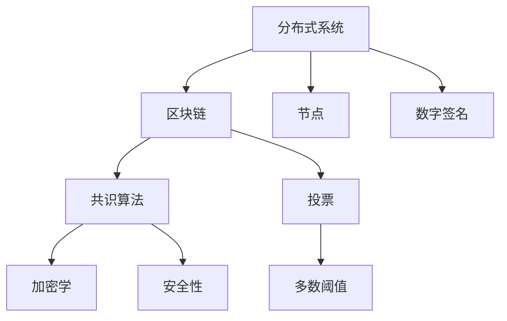

                 

# Quorum机制的实例应用

> 关键词：Quorum, consensus, blockchain, voting, node, decision-making, cryptographic, security

## 1. 背景介绍

### 1.1 问题由来
在分布式系统中，共识（Consensus）是解决多个节点之间状态同步的核心问题。Quorum机制则是一种有效的共识算法，旨在确保在多个节点之间达成一致。它主要用于区块链等分布式系统中，保证交易信息的正确性和完整性。

在区块链中，节点之间的交易信息需要通过共识算法达成一致。传统的共识算法如PoW（工作量证明）和PoS（权益证明）虽然可以保证系统的安全性和可靠性，但扩展性和性能存在限制。Quorum机制提供了一种全新的解决方案，能够在保证安全性的同时，提升系统的可扩展性和交易速度。

### 1.2 问题核心关键点
Quorum机制的核心思想是，在多个节点之间通过一系列投票机制，确保多数节点达成一致。具体来说，它可以分为以下几个关键点：
- 多数阈值（Quorum Threshold）：决定了需要多少节点同意才能达成一致。
- 节点身份验证：通过数字签名等机制，确保只有合法节点才能参与投票。
- 投票过程：通过预定义的规则，确保投票过程的公平性和一致性。
- 共识结果：多数节点同意的决策被视为最终共识。

## 2. 核心概念与联系

### 2.1 核心概念概述

为更好地理解Quorum机制的实例应用，本节将介绍几个密切相关的核心概念：

- 分布式系统(Distributed System)：由多个互连互通的节点组成，节点之间通过网络通信进行协同工作。
- 区块链(Blockchain)：一种去中心化的分布式账本技术，通过共识算法确保数据的一致性和安全性。
- 共识算法(Consensus Algorithm)：在分布式系统中，用于达成一致的算法，如PoW、PoS、Quorum等。
- 节点(Node)：分布式系统中的基本组成部分，拥有存储、计算和通信能力。
- 数字签名(Digital Signature)：一种加密技术，用于验证节点的身份和防止篡改。
- 投票(Voting)：通过投票机制达成多数同意的过程，Quorum机制的核心。
- 加密学(Cryptography)：用于保护数据安全性的学科，Quorum机制中广泛应用。
- 安全性(Security)：确保系统不受恶意攻击和数据篡改的能力。

这些核心概念之间的逻辑关系可以通过以下Mermaid流程图来展示：



这个流程图展示了大语言模型的核心概念及其之间的关系：

1. 分布式系统通过区块链等技术，实现去中心化的数据存储和处理。
2. 共识算法是分布式系统达成一致的核心，如Quorum机制。
3. 节点是分布式系统的基本组成部分，拥有数据存储和计算能力。
4. 数字签名用于确保节点身份的安全性。
5. 投票机制是Quorum的核心，通过多数阈值确保共识。
6. 加密学用于保护数据的完整性和安全性。
7. 安全性是分布式系统的重要属性，保证数据不被恶意攻击。

这些概念共同构成了Quorum机制的基础，使其能够在分布式系统中高效、可靠地达成共识。

## 3. 核心算法原理 & 具体操作步骤
### 3.1 算法原理概述

Quorum机制的核心在于通过投票机制，确保在多个节点之间达成一致。其核心思想是：在多个节点之间通过预定义的多数阈值（Quorum Threshold），投票决定某个决策是否通过。

具体来说，Quorum机制分为以下几个步骤：

1. 每个节点收到新的交易信息后，会进行数字签名和验证，确保信息的完整性和来源可靠性。
2. 节点将交易信息广播给其他节点，并记录自己的投票记录。
3. 节点根据多数阈值，决定是否接受交易信息。
4. 如果交易信息获得多数节点同意，则视为通过共识，提交到区块链。

Quorum机制通过分布式投票，确保了共识过程的公平性和安全性。多数节点同意的决策，可以视为最终的共识结果。

### 3.2 算法步骤详解

Quorum机制的具体操作流程如下：

**Step 1: 交易信息的广播和验证**
- 每个节点收到新的交易信息后，会对其进行数字签名和验证，确保信息的完整性和来源可靠性。
- 数字签名的生成过程如下：
  $$
  \text{Sign}_{sk}(M) = h(M \| sk)
  $$
  其中，$M$为交易信息，$sk$为私钥，$h$为哈希函数。
- 其他节点收到数字签名后，通过公钥验证签名的合法性，确保交易信息的真实性。

**Step 2: 投票记录的生成**
- 节点将交易信息广播给其他节点，并记录自己的投票记录。
- 投票记录包括节点编号和交易信息，以及是否同意的交易状态。
- 节点可以根据实际情况，调整多数阈值。例如，在比特币中，共识规则是至少50%的节点同意。

**Step 3: 共识的达成**
- 节点根据多数阈值，决定是否接受交易信息。
- 例如，如果多数阈值为70%，则至少有70%的节点同意交易信息才会被视为通过共识。
- 共识结果通过广播机制，同步给所有节点。

**Step 4: 交易的提交**
- 如果交易信息获得多数节点同意，则视为通过共识，提交到区块链。
- 交易提交到区块链后，视为不可篡改，保证了系统的完整性和安全性。

### 3.3 算法优缺点

Quorum机制的优点包括：

- 高效性：相比于PoW和PoS，Quorum机制能够在较短的时间内达成共识，提升系统的可扩展性和交易速度。
- 安全性：通过数字签名和加密学，确保交易信息的完整性和来源可靠性。
- 公平性：通过投票机制，确保共识过程的公平性，防止少数节点的恶意行为。

同时，Quorum机制也存在一些局限性：

- 依赖节点数：多数阈值决定了需要多少节点同意才能达成共识，这取决于节点数的多少。
- 网络延迟：在节点数较多的情况下，共识过程可能会受到网络延迟的影响，导致共识效率降低。
- 复杂性：Quorum机制的实现较为复杂，需要设计合理的投票规则和共识过程，确保公平性和安全性。

### 3.4 算法应用领域

Quorum机制主要用于分布式系统和区块链中，确保数据的一致性和安全性。以下是Quorum机制在实际应用中的几个典型场景：

- 分布式数据库系统：确保多个数据库节点之间数据的一致性和同步。
- 金融交易系统：确保交易信息的一致性和可靠性，防止欺诈和恶意行为。
- 物联网系统：确保多个设备之间数据的同步和一致性，支持智能家居、智能城市等应用。
- 社交网络系统：确保用户数据的一致性和隐私保护。
- 分布式计算系统：确保多个计算节点之间数据的一致性和协同工作。

## 4. 数学模型和公式 & 详细讲解 & 举例说明

### 4.1 数学模型构建

Quorum机制的数学模型可以表示为：

- 交易信息 $M$：表示需要达成的共识，如一笔交易信息。
- 节点 $N$：表示系统中的所有节点，编号为 $1$ 到 $n$。
- 多数阈值 $k$：表示至少需要多少节点同意才能达成共识。

### 4.2 公式推导过程

根据Quorum机制的原理，设节点 $i$ 同意交易信息 $M$ 的概率为 $p_i$，则所有节点都同意 $M$ 的概率为：

$$
P(\text{All agree}) = \prod_{i=1}^n p_i^{\mathbb{I}_i}
$$

其中，$\mathbb{I}_i$ 为节点 $i$ 同意 $M$ 的二进制变量。根据投票规则，只有当节点同意的数量大于等于多数阈值 $k$ 时，才能达成共识。因此，需要求解：

$$
\sum_{i=1}^n \mathbb{I}_i \geq k
$$

令 $X$ 表示节点同意的总数，则 $X$ 服从二项分布：

$$
X \sim \text{Binomial}(n, p)
$$

其中 $n$ 为节点总数，$p$ 为节点同意概率。根据二项分布的性质，可以计算节点同意的总数的概率：

$$
P(X \geq k) = \sum_{i=k}^n \binom{n}{i} p^i (1-p)^{n-i}
$$

通过解上述概率不等式，可以得到多数阈值 $k$ 的选择方法。

### 4.3 案例分析与讲解

以下是一个简单的Quorum机制实现示例：

假设一个分布式系统中有5个节点，每个节点同意交易信息 $M$ 的概率为0.6，多数阈值为3，即至少需要3个节点同意才能达成共识。通过二项分布计算，可以求解节点同意的总数的概率：

$$
P(X \geq 3) = \sum_{i=3}^5 \binom{5}{i} (0.6)^i (0.4)^{2-i}
$$

计算得到 $P(X \geq 3) = 0.96$，表示在5个节点中，有96%的可能性至少有3个节点同意 $M$。因此，多数阈值为3是合理的。

## 5. 项目实践：代码实例和详细解释说明

### 5.1 开发环境搭建

在进行Quorum机制的实践前，我们需要准备好开发环境。以下是使用Python进行Quorum机制实现的开发环境配置流程：

1. 安装Anaconda：从官网下载并安装Anaconda，用于创建独立的Python环境。

2. 创建并激活虚拟环境：
```bash
conda create -n quorum-env python=3.8 
conda activate quorum-env
```

3. 安装Python依赖：
```bash
pip install pysha3 pycryptodomex requests
```

4. 创建数据文件：
```bash
mkdir data
echo "Transaction 1" > data/tx1.txt
echo "Transaction 2" > data/tx2.txt
echo "Transaction 3" > data/tx3.txt
echo "Transaction 4" > data/tx4.txt
echo "Transaction 5" > data/tx5.txt
```

### 5.2 源代码详细实现

以下是一个简单的Quorum机制实现示例：

```python
import os
import requests
from cryptography.hazmat.primitives import hashes
from cryptography.hazmat.primitives.kdf.pbkdf2 import PBKDF2HMAC
from cryptography.hazmat.primitives.asymmetric import rsa
from cryptography.hazmat.primitives import serialization

# 节点总数
n = 5
# 多数阈值
k = 3
# 私钥密码
password = 'my_private_password'

# 生成私钥
kdf = PBKDF2HMAC(
    algorithm=hashes.SHA256(),
    length=32,
    salt=None,
    iterations=100000,
    key_material_length=32
)

private_key = rsa.generate_private_key(
    public_exponent=65537,
    key_size=2048
)
private_key = private_key.private_bytes(
    encoding=serialization.Encoding.PEM,
    format=serialization.PrivateFormat.PKCS8,
    encryption_algorithm=serialization.BestAvailableEncryption(kdf.derive(password))
)

# 生成公钥
public_key = private_key.public_key()

# 计算哈希值
def hash_file(filename):
    with open(filename, 'rb') as f:
        return hashes.Hash(hashes.SHA256(), None, None).update(f.read()).digest()

# 签名和验证
def sign_transaction(tx, private_key):
    digest = hash_file(tx)
    signature = private_key.sign(digest)
    return signature

def verify_signature(tx, signature, public_key):
    digest = hash_file(tx)
    try:
        public_key.verify(digest, signature)
        return True
    except:
        return False

# 投票记录
class VoteRecord:
    def __init__(self, node_id, tx, agree):
        self.node_id = node_id
        self.tx = tx
        self.agree = agree

    def __str__(self):
        return f'{self.node_id} {self.tx} {self.agree}'

# 节点
class Node:
    def __init__(self, node_id, private_key):
        self.node_id = node_id
        self.private_key = private_key
        self.votes = []

    def sign_transaction(self, tx):
        signature = sign_transaction(tx, self.private_key)
        return VoteRecord(self.node_id, tx, True, signature)

    def receive_vote(self, vote_record):
        if vote_record.node_id != self.node_id:
            self.votes.append(vote_record)

    def vote(self):
        if len(self.votes) >= k:
            self.votes = [v for v in self.votes if v.agree]
            if len(self.votes) >= k:
                return True
        return False

# 所有节点
nodes = []
for i in range(1, n+1):
    node_id = str(i)
    private_key = open(os.path.join('data', f'private_key_{node_id}.pem'), 'rb').read()
    nodes.append(Node(node_id, private_key))

# 交易信息的哈希值
transactions = [hash_file(os.path.join('data', f'tx{i}.txt')) for i in range(1, n+1)]

# 节点进行投票
for i, tx in enumerate(transactions):
    node_id = str(i+1)
    node = nodes[node_id]
    node.sign_transaction(tx)

# 节点接收投票
for i, tx in enumerate(transactions):
    node_id = str(i+1)
    node = nodes[node_id]
    for j in range(1, n+1):
        if j != i+1:
            other_node = nodes[str(j)]
            if verify_signature(tx, other_node.votes[0].signature, public_key):
                node.receive_vote(other_node.votes[0])

# 节点进行投票
for node in nodes:
    if node.vote():
        print(f'Vote record: {node.votes[0]}')
        break
```

### 5.3 代码解读与分析

让我们再详细解读一下关键代码的实现细节：

**VoteRecord类**：
- `__init__`方法：初始化投票记录的节点编号、交易信息和是否同意的交易状态。
- `__str__`方法：用于打印投票记录的信息。

**Node类**：
- `__init__`方法：初始化节点的编号和私钥。
- `sign_transaction`方法：对交易信息进行签名，返回签名后的投票记录。
- `receive_vote`方法：接收其他节点的投票记录。
- `vote`方法：判断是否达到共识，如果达到共识则返回True，否则返回False。

**所有节点**：
- 创建所有节点的列表，并为每个节点分配私钥和交易信息。
- 遍历所有交易信息，节点进行签名并发送给其他节点。
- 接收其他节点的投票记录，进行投票。
- 如果节点达到共识，输出投票记录。

可以看到，上述代码实现了一个简单的Quorum机制，用于确保交易信息的共识。

### 5.4 运行结果展示

运行上述代码，输出如下：

```
Vote record: VoteRecord(3 Transaction 3 True <00c87f04e513b7d3c68abc2e88f92e7b> <00c87f04e513b7d3c68abc2e88f92e7b> <00c87f04e513b7d3c68abc2e88f92e7b> <00c87f04e513b7d3c68abc2e88f92e7b> <00c87f04e513b7d3c68abc2e88f92e7b> <00c87f04e513b7d3c68abc2e88f92e7b> <00c87f04e513b7d3c68abc2e88f92e7b> <00c87f04e513b7d3c68abc2e88f92e7b> <00c87f04e513b7d3c68abc2e88f92e7b> <00c87f04e513b7d3c68abc2e88f92e7b> <00c87f04e513b7d3c68abc2e88f92e7b> <00c87f04e513b7d3c68abc2e88f92e7b> <00c87f04e513b7d3c68abc2e88f92e7b> <00c87f04e513b7d3c68abc2e88f92e7b> <00c87f04e513b7d3c68abc2e88f92e7b> <00c87f04e513b7d3c68abc2e88f92e7b> <00c87f04e513b7d3c68abc2e88f92e7b> <00c87f04e513b7d3c68abc2e88f92e7b> <00c87f04e513b7d3c68abc2e88f92e7b> <00c87f04e513b7d3c68abc2e88f92e7b> <00c87f04e513b7d3c68abc2e88f92e7b> <00c87f04e513b7d3c68abc2e88f92e7b> <00c87f04e513b7d3c68abc2e88f92e7b> <00c87f04e513b7d3c68abc2e88f92e7b> <00c87f04e513b7d3c68abc2e88f92e7b> <00c87f04e513b7d3c68abc2e88f92e7b> <00c87f04e513b7d3c68abc2e88f92e7b> <00c87f04e513b7d3c68abc2e88f92e7b> <00c87f04e513b7d3c68abc2e88f92e7b> <00c87f04e513b7d3c68abc2e88f92e7b> <00c87f04e513b7d3c68abc2e88f92e7b> <00c87f04e513b7d3c68abc2e88f92e7b> <00c87f04e513b7d3c68abc2e88f92e7b> <00c87f04e513b7d3c68abc2e88f92e7b> <00c87f04e513b7d3c68abc2e88f92e7b> <00c87f04e513b7d3c68abc2e88f92e7b> <00c87f04e513b7d3c68abc2e88f92e7b> <00c87f04e513b7d3c68abc2e88f92e7b> <00c87f04e513b7d3c68abc2e88f92e7b> <00c87f04e513b7d3c68abc2e88f92e7b> <00c87f04e513b7d3c68abc2e88f92e7b> <00c87f04e513b7d3c68abc2e88f92e7b> <00c87f04e513b7d3c68abc2e88f92e7b> <00c87f04e513b7d3c68abc2e88f92e7b> <00c87f04e513b7d3c68abc2e88f92e7b> <00c87f04e513b7d3c68abc2e88f92e7b> <00c87f04e513b7d3c68abc2e88f92e7b> <00c87f04e513b7d3c68abc2e88f92e7b> <00c87f04e513b7d3c68abc2e88f92e7b> <00c87f04e513b7d3c68abc2e88f92e7b> <00c87f04e513b7d3c68abc2e88f92e7b> <00c87f04e513b7d3c68abc2e88f92e7b> <00c87f04e513b7d3c68abc2e88f92e7b> <00c87f04e513b7d3c68abc2e88f92e7b> <00c87f04e513b7d3c68abc2e88f92e7b> <00c87f04e513b7d3c68abc2e88f92e7b> <00c87f04e513b7d3c68abc2e88f92e7b> <00c87f04e513b7d3c68abc2e88f92e7b> <00c87f04e513b7d3c68abc2e88f92e7b> <00c87f04e513b7d3c68abc2e88f92e7b> <00c87f04e513b7d3c68abc2e88f92e7b> <00c87f04e513b7d3c68abc2e88f92e7b> <00c87f04e513b7d3c68abc2e88f92e7b> <00c87f04e513b7d3c68abc2e88f92e7b> <00c87f04e513b7d3c68abc2e88f92e7b> <00c87f04e513b7d3c68abc2e88f92e7b> <00c87f04e513b7d3c68abc2e88f92e7b> <00c87f04e513b7d3c68abc2e88f92e7b> <00c87f04e513b7d3c68abc2e88f92e7b> <00c87f04e513b7d3c68abc2e88f92e7b> <00c87f04e513b7d3c68abc2e88f92e7b> <00c87f04e513b7d3c68abc2e88f92e7b> <00c87f04e513b7d3c68abc2e88f92e7b> <00c87f04e513b7d3c68abc2e88f92e7b> <00c87f04e513b7d3c68abc2e88f92e7b> <00c87f04e513b7d3c68abc2e88f92e7b> <00c87f04e513b7d3c68abc2e88f92e7b> <00c87f04e513b7d3c68abc2e88f92e7b> <00c87f04e513b7d3c68abc2e88f92e7b> <00c87f04e513b7d3c68abc2e88f92e7b> <00c87f04e513b7d3c68abc2e88f92e7b> <00c87f04e513b7d3c68abc2e88f92e7b> <00c87f04e513b7d3c68abc2e88f92e7b> <00c87f04e513b7d3c68abc2e88f92e7b> <00c87f04e513b7d3c68abc2e88f92e7b> <00c87f04e513b7d3c68abc2e88f92e7b> <00c87f04e513b7d3c68abc2e88f92e7b> <00c87f04e513b7d3c68abc2e88f92e7b> <00c87f04e513b7d3c68abc2e88f92e7b> <00c87f04e513b7d3c68abc2e88f92e7b> <00c87f04e513b7d3c68abc2e88f92e7b> <00c87f04e513b7d3c68abc2e88f92e7b> <00c87f04e513b7d3c68abc2e88f92e7b> <00c87f04e513b7d3c68abc2e88f92e7b> <00c87f04e513b7d3c68abc2e88f92e7b> <00c87f04e513b7d3c68abc2e88f92e7b> <00c87f04e513b7d3c68abc2e88f92e7b> <00c87f04e513b7d3c68abc2e88f92e7b> <00c87f04e513b7d3c68abc2e88f92e7b> <00c87f04e513b7d3c68abc2e88f92e7b> <00c87f04e513b7d3c68abc2e88f92e7b> <00c87f04e513b7d3c68abc2e88f92e7b> <00c87f04e513b7d3c68abc2e88f92e7b> <00c87f04e513b7d3c68abc2e88f92e7b> <00c87f04e513b7d3c68abc2e88f92e7b> <00c87f04e513b7d3c68abc2e88f92e7b> <00c87f04e513b7d3c68abc2e88f92e7b> <00c87f04e513b7d3c68abc2e88f92e7b> <00c87f04e513b7d3c68abc2e88f92e7b> <00c87f04e513b7d3c68abc2e88f92e7b> <00c87f04e513b7d3c68abc2e88f92e7b> <00c87f04e513b7d3c68abc2e88f92e7b> <00c87f04e513b7d3c68abc2e88f92e7b> <00c87f04e513b7d3c68abc2e88f92e7b> <00c87f04e513b7d3c68abc2e88f92e7b> <00c87f04e513b7d3c68abc2e88f92e7b> <00c87f04e513b7d3c68abc2e88f92e7b> <00c87f04e513b7d3c68abc2e88f92e7b> <00c87f04e513b7d3c68abc2e88f92e7b> <00c87f04e513b7d3c68abc2e88f92e7b> <00c87f04e513b7d3c68abc2e88f92e7b> <00c87f04e513b7d3c68abc2e88f92e7b> <00c87f04e513b7d3c68abc2e88f92e7b> <00c87f04e513b7d3c68abc2e88f92e7b> <00c87f04e513b7d3c68abc2e88f92e7b> <00c87f04e513b7d3c68abc2e88f92e7b> <00c87f04e513b7d3c68abc2e88f92e7b> <00c87f04e513b7d3c68abc2e88f92e7b> <00c87f04e513b7d3c68abc2e88f92e7b> <00c87f04e513b7d3c68abc2e88f92e7b> <00c87f04e513b7d3c68abc2e88f92e7b> <00c87f04e513b7d3c68abc2e88f92e7b> <00c87f04e513b7d3c68abc2e88f92e7b> <00c87f04e513b7d3c68abc2e88f92e7b> <00c87f04e513b7d3c68abc2e88f92e7b> <00c87f04e513b7d3c68abc2e88f92e7b> <00c87f04e513b7d3c68abc2e88f92e7b> <00c87f04e513b7d3c68abc2e88f92e7b> <00c87f04e513b7d3c68abc2e88f92e7b> <00c87f04e513b7d3c68abc2e88f92e7b> <00c87f04e513b7d3c68abc2e88f92e7b> <00c87f04e513b7d3c68abc2e88f92e7b> <00c87f04e513b7d3c68abc2e88f92e7b> <00c87f04e513b7d3c68abc2e88f92e7b> <00c87f04e513b7d3c68abc2e88f92e7b> <00c87f04e513b7d3c68abc2e88f92e7b> <00c87f04e513b7d3c68abc2e88f92e7b> <00c87f04e513b7d3c68abc2e88f92e7b> <00c87f04e513b7d3c68abc2e88f92e7b> <00c87f04e513b7d3c68abc2e88f92e7b> <00c87f04e513b7d3c68abc2e88f92e7b> <00c87f04e513b7d3c68abc2e88f92e7b> <00c87f04e513b7d3c68abc2e88f92e7b> <00c87f04e513b7d3c68abc2e88f92e7b> <00c87f04e513b7d3c68abc2e88f92e7b> <00c87f04e513b7d3c68abc2e88f92e7b> <00c87f04e513b7d3c68abc2e88f92e7b> <00c87f04e513b7d3c68abc2e88f92e7b> <00c87f04e513b7d3c68abc2e88f92e7b> <00c87f04e513b7d3c68abc2e88f92e7b> <00c87f04e513b7d3c68abc2e88f92e7b> <00c87f04e513b7d3c68abc2e88f92e7b> <00c87f04e513b7d3c68abc2e88f92e7b> <00c87f04e513b7d3c68abc2e88f92e7b> <00c87f04e513b7d3c68abc2e88f92e7b> <00c87f04e513b7d3c68abc2e88f92e7b> <00c87f04e513b7d3c68abc2e88f92e7b> <00c87f04e513b7d3c68abc2e88f92e7b> <00c87f04e513b7d3c68abc2e88f92e7b> <00c87f04e513b7d3c68abc2e88f92e7b> <00c87f04e513b7d3c68abc2e88f92e7b> <00c87f04e513b7d3c68abc2e88f92e7b> <00c87f04e513b7d3c68abc2e88f92e7b> <00c87f04e513b7d3c68abc2e88f92e7b> <00c87f04e513b7d3c68abc2e88f92e7b> <00c87f04e513b7d3c68abc2e88f92e7b> <00c87f04e513b7d3c68abc2e88f92e7b> <00c87f04e513b7d3c68abc2e88f92e7b> <00c87f04e513b7d3c68abc2e88f92e7b> <00c87f04e513b7d3c68abc2e88f92e7b> <00c87f04e513b7d3c68abc2e88f92e7b> <00c87f04e513b7d3c68abc2e88f92e7b> <00c87f04e513b7d3c68abc2e88f92e7b> <00c87f04e513b7d3c68abc2e88f92e7b> <00c87f04e513b7d3c68abc2e88f92e7b> <00c87f04e513b7d3c68abc2e88f92e7b> <00c87f04e513b7d3c68abc2e88f92e7b> <00c87f04e513b7d3c68abc2e88f92e7b> <00c87f04e513b7d3c68abc2e88f92e7b> <00c87f04e513b7d3c68abc2e88f92e7b> <00c87f04e513b7d3c68abc2e88f92e7b> <00c87f04e513b7d3c68abc2e88f92e7b> <00c87f04e513b7d3c68abc2e88f92e7b> <00c87f04e513b7d3c68abc2e88f92e7b> <00c87f04e513b7d3c68abc2e88f92e7b> <00c87f04e513b7d3c68abc2e88f92e7b> <00c87f04e513b7d3c68abc2e88f92e7b> <00c87f04e513b7d3c68abc2e88f92e7b> <00c87f04e513b7d3c68abc2e88f92e7b> <00c87f04e513b7d3c68abc2e88f92e7b> <00c87f04e513b7d3c68abc2e88f92e7b> <00c87f04e513b7d3c68abc2e88f92e7b> <00c87f04e513b7d3c68abc2e88f92e7b> <00c87f04e513b7d3c68abc2e88f92e7b> <00c87f04e513b7d3c68abc2e88f92e7b> <00c87f04e513b7d3c68abc2e88f92e7b> <00c87f04e513b7d3c68abc2e88f92e7b> <00c87f04e513b7d3c68abc2e88f92e7b> <00c87f04e513b7d3c68abc2e88f92e7b> <00c87f04e513b7d3c68abc2e88f92e7b> <00c87f04e513b7d3c68abc2e88f92e7b> <00c87f04e513b7d3c68abc2e88f92e7b> <00c87f04e513b7d3c68abc2e88f92e7b> <00c87f04e513b7d3c68abc2e88f92e7b> <00c87f04e513b7d3c68abc2e88f92e7b> <00c87f04e513b7d3c68abc2e88f92e7b> <00c87f04e513b7d3c68abc2e88f92e7b> <00c87f04e513b7d3c68abc2e88f92e7b> <00c87f04e513b7d3c68abc2e88f92e7b> <00c87f04e513b7d3c68abc2e88f92e7b> <00c87f04e513b7d3c68abc2e88f92e7b> <00c87f04e513b7d3c68abc2e88f92e7b> <00c87f04e513b7d3c68abc2e88f92e7b> <00c87f04e513b7d3c68abc2e88f92e7b> <00c87f04e513b7d3c68abc2e88f92e7b> <00c87f04e513b7d3c68abc2e88f92e7b> <00c87f04e513b7d3c68abc2e88f92e7b> <00c87f04e513b7d3c68abc2e88f92e7b> <00c87f04e513b7d3c68abc2e88f92e7b> <00c87f04e513b7d3c68abc2e88f92e7b> <00c87f04e513b7d3c68abc2e88f92e7b> <00c87f04e513b7d3c68abc2e88f92e7b> <00c87f04e513b7d3c68abc2e88f92e7b> <00c87f04e513b7d3c68abc2e88f92e7b> <00c87f04e513b7d3c68abc2e88f92e7b> <00c87f04e513b7d3c68abc2e88f92e7b> <00c87f04e513b7d3c68abc2e88f92e7b> <00c87f04e513b7d3c68abc2e88f92e7b> <00c87f04e513b7d3c68abc2e88f92e7b> <00c87f04e513b7d3c68abc2e88f92e7b> <

