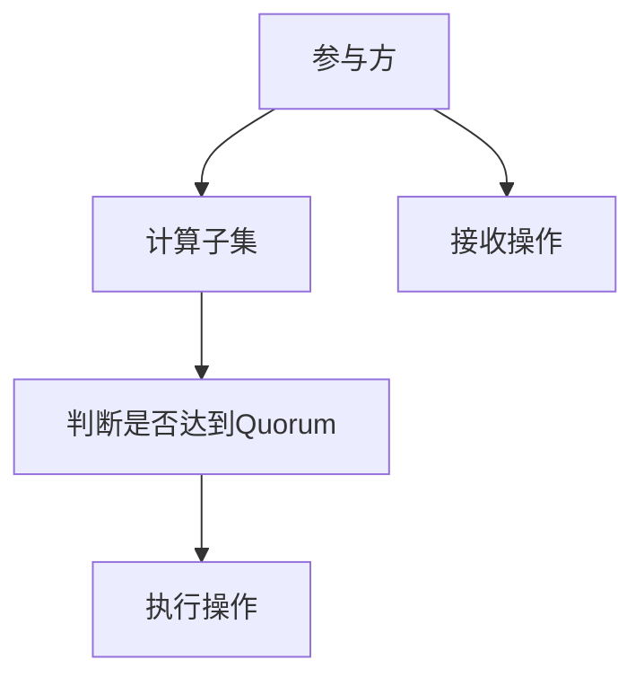

                 

## 1. 背景介绍

Quorum机制是一种广泛应用于区块链、分布式系统、共识协议等领域的机制。它通过某种方式决定多个参与方是否已达成一致意见，从而决定是否执行某项操作。Quorum机制的目的是确保系统的安全性和可靠性，防止单点故障和恶意攻击。

本文将详细介绍Quorum机制的原理、实现方式及其在多个场景中的应用实例，帮助读者深入理解这一重要机制。

## 2. 核心概念与联系

### 2.1 核心概念概述

为了更好地理解Quorum机制，首先需要介绍几个核心概念：

- **Quorum**：指系统中的一个子集，该子集中的参与方必须达成一致意见，才能执行某项操作。Quorum机制通过计算子集的大小，来确定是否达到“Quorum”。

- **共识**：指多个参与方就某个问题达成一致的决策。在Quorum机制中，共识是指子集中的参与方就某个操作是否执行达成一致意见。

- **拜占庭容错**：指系统中的某些参与方可能恶意攻击，意图破坏系统的正常运行。Quorum机制设计时应考虑拜占庭容错，以防止恶意攻击对系统产生重大影响。

- **故障容忍度**：指系统能够承受的故障或恶意攻击的数量。Quorum机制需要根据系统的需求，确定故障容忍度。

- **Quorum公式**：用于计算达到Quorum的参与方数量的公式。Quorum公式的具体形式取决于系统的设计。

Quorum机制的核心思想是通过计算子集的大小，决定是否执行某个操作。在实际应用中，Quorum机制常用于以下场景：

- 区块链中的交易验证
- 分布式数据库中的数据同步
- 分布式系统中的故障检测与恢复
- 分布式共识算法中的选择权威

### 2.2 Quorum机制的 Mermaid 流程图

以下是一个简化的Quorum机制流程图，展示了Quorum机制的基本流程：



## 3. 核心算法原理 & 具体操作步骤

### 3.1 算法原理概述

Quorum机制的算法原理可以简单概括为：

1. 确定系统的故障容忍度，即系统能够承受的故障或恶意攻击的数量。
2. 计算达到Quorum的参与方数量，即子集的大小。
3. 每个参与方独立计算子集，判断是否达到Quorum。
4. 如果多个参与方同时计算得出子集达到Quorum，则执行操作。

Quorum机制的关键在于子集大小的计算。不同的应用场景有不同的子集大小计算方式。以下介绍几种常见的计算方式：

- **简单多数**：子集大小为系统参与方的一半加一。例如，系统中有5个参与方，则子集大小为3。
- **2/3多数**：子集大小为系统参与方的三分之二加一。例如，系统中有5个参与方，则子集大小为4。
- **k/3多数**：子集大小为系统参与方数量的k/3加一。例如，系统中有5个参与方，则k为3，子集大小为2。

### 3.2 算法步骤详解

以下是一个基于Quorum机制的区块链交易验证流程，详细介绍了算法步骤：

1. **系统初始化**：确定系统的参与方数量n，确定故障容忍度t，计算Quorum公式：N = n - t。例如，系统有5个参与方，故障容忍度为2，则Quorum公式为N = 5 - 2 = 3。

2. **计算子集**：每个参与方独立计算是否达到Quorum。具体计算方式如下：

   - 统计所有参与方的id。
   - 将每个参与方的id排序。
   - 取前N个id，即N个子集。例如，系统有5个参与方，故障容忍度为2，则Quorum公式为N = 3。

3. **判断是否达到Quorum**：每个参与方独立判断是否达到Quorum。具体判断方式如下：
   
   - 统计所有参与方中是否有超过N个id。
   - 如果有超过N个id，则判断子集达到Quorum。

4. **执行操作**：如果多个参与方同时计算得出子集达到Quorum，则执行操作。例如，系统有5个参与方，故障容忍度为2，则Quorum公式为N = 3。如果有3个以上的参与方同时计算得出子集大小为3，则执行操作。

### 3.3 算法优缺点

Quorum机制的优点包括：

- 高容错性：可以承受一定数量的故障或恶意攻击，保证系统的可靠性。
- 高一致性：需要多个参与方同时计算得出Quorum，确保操作的正确性。
- 简单易实现：算法简单明了，易于实现和维护。

Quorum机制的缺点包括：

- 延迟较高：需要等待多个参与方计算得出Quorum，执行操作的时间较长。
- 复杂度高：需要计算子集大小，处理故障和恶意攻击，算法复杂度高。
- 扩展性差：Quorum公式中的N是固定的，系统扩展性较差。

### 3.4 算法应用领域

Quorum机制广泛应用于区块链、分布式系统、共识协议等领域的多个场景，例如：

- **区块链中的交易验证**：在区块链中，每个节点需要计算子集大小，判断是否达到Quorum，以验证交易的合法性。
- **分布式数据库中的数据同步**：在分布式数据库中，每个节点需要计算子集大小，判断是否达到Quorum，以决定是否同步数据。
- **分布式系统中的故障检测与恢复**：在分布式系统中，每个节点需要计算子集大小，判断是否达到Quorum，以检测故障节点并恢复系统。
- **分布式共识算法中的选择权威**：在分布式共识算法中，每个节点需要计算子集大小，判断是否达到Quorum，以选择权威节点。

## 4. 数学模型和公式 & 详细讲解 & 举例说明

### 4.1 数学模型构建

Quorum机制的数学模型可以表示为一个二元组（N, t），其中N为达到Quorum的参与方数量，t为故障容忍度。

### 4.2 公式推导过程

以下是一个简单的Quorum公式推导过程，以n个参与方，故障容忍度为2为例：

设系统的参与方数量为n，故障容忍度为t，则Quorum公式为：

$$N = n - t$$

例如，系统有5个参与方，故障容忍度为2，则Quorum公式为：

$$N = 5 - 2 = 3$$

这表示，如果5个参与方中有3个或3个以上的id被包含在子集中，则子集达到Quorum。

### 4.3 案例分析与讲解

以下是一个具体的Quorum计算案例：

**场景描述**：系统中有5个参与方，故障容忍度为2，即Quorum公式为N = 5 - 2 = 3。参与方的id分别为1, 2, 3, 4, 5。

**计算过程**：

1. 统计所有参与方的id，得到集合{1, 2, 3, 4, 5}。
2. 将集合中的id排序，得到{1, 2, 3, 4, 5}。
3. 取前N个id，即前3个id，得到子集{1, 2, 3}。
4. 判断子集是否达到Quorum。由于系统中有3个参与方同时计算得出子集大小为3，则判断子集达到Quorum。
5. 执行操作。

## 5. 项目实践：代码实例和详细解释说明

### 5.1 开发环境搭建

以下是一个基于Quorum机制的区块链交易验证的Python实现，详细介绍了开发环境的搭建步骤：

1. **安装Python**：下载并安装Python，选择最新版本。

2. **安装p2p库**：使用pip安装p2p库，用于分布式通信。

   ```bash
   pip install p2p
   ```

3. **编写代码**：使用Python编写Quorum机制的交易验证代码。

   ```python
   import p2p
   import random

   class Quorum:
       def __init__(self, n, t):
           self.n = n
           self.t = t
           self.current_quorum = 0

       def add_node(self, node):
           node_id = node.get_id()
           self.current_quorum += 1
           if self.current_quorum >= self.n - self.t:
               self.execute_operation()

       def execute_operation(self):
           print("Quorum reached! Transaction validated.")

       def simulate(self):
           nodes = [p2p.Node(node_id) for node_id in range(self.n)]
           random.shuffle(nodes)

           for node in nodes:
               self.add_node(node)

   # 测试代码
   q = Quorum(5, 2)
   q.simulate()
   ```

### 5.2 源代码详细实现

以下是Quorum机制的详细Python实现代码，详细解释了各个模块和函数的作用：

```python
import p2p
import random

class Quorum:
    def __init__(self, n, t):
        self.n = n
        self.t = t
        self.current_quorum = 0

    def add_node(self, node):
        node_id = node.get_id()
        self.current_quorum += 1
        if self.current_quorum >= self.n - self.t:
            self.execute_operation()

    def execute_operation(self):
        print("Quorum reached! Transaction validated.")

    def simulate(self):
        nodes = [p2p.Node(node_id) for node_id in range(self.n)]
        random.shuffle(nodes)

        for node in nodes:
            self.add_node(node)

# 测试代码
q = Quorum(5, 2)
q.simulate()
```

### 5.3 代码解读与分析

**p2p库**：p2p库用于分布式通信，模拟多个节点之间的交互。

**Quorum类**：Quorum类实现了Quorum机制的核心算法。包含以下几个方法：

- **__init__**：初始化Quorum类，设置系统的参与方数量和故障容忍度。
- **add_node**：添加一个新的节点，计算子集大小，判断是否达到Quorum。如果达到Quorum，则执行操作。
- **execute_operation**：执行操作。
- **simulate**：模拟多个节点的交互，测试Quorum机制的正确性。

**测试代码**：测试代码创建了一个Quorum实例，模拟多个节点的交互，验证Quorum机制的正确性。

## 6. 实际应用场景

### 6.1 区块链中的交易验证

在区块链中，Quorum机制用于验证交易的合法性。每个节点需要计算子集大小，判断是否达到Quorum，以验证交易的合法性。

**实现方式**：

1. 每个节点在接收到交易时，计算子集大小，判断是否达到Quorum。
2. 如果达到Quorum，则验证交易合法性，并将交易广播给其他节点。
3. 如果未达到Quorum，则拒绝交易。

### 6.2 分布式数据库中的数据同步

在分布式数据库中，Quorum机制用于决定是否同步数据。每个节点需要计算子集大小，判断是否达到Quorum，以决定是否同步数据。

**实现方式**：

1. 每个节点在接收到数据时，计算子集大小，判断是否达到Quorum。
2. 如果达到Quorum，则同步数据。
3. 如果未达到Quorum，则不同步数据。

### 6.3 分布式系统中的故障检测与恢复

在分布式系统中，Quorum机制用于检测故障节点并恢复系统。每个节点需要计算子集大小，判断是否达到Quorum，以检测故障节点并恢复系统。

**实现方式**：

1. 每个节点在一定时间内未收到其他节点的消息时，计算子集大小，判断是否达到Quorum。
2. 如果达到Quorum，则认为故障节点发生故障，执行故障恢复操作。
3. 如果未达到Quorum，则不执行故障恢复操作。

### 6.4 未来应用展望

未来，Quorum机制将在更多领域得到应用，为系统提供更高的可靠性和安全性。以下是几个可能的未来应用方向：

- **物联网中的共识协议**：在物联网中，多个设备需要达成共识，以确保数据的一致性和可靠性。Quorum机制可以用于物联网中的共识协议。
- **供应链管理中的订单确认**：在供应链管理中，多个环节需要确认订单，以确保订单的准确性和可靠性。Quorum机制可以用于供应链管理中的订单确认。
- **金融交易中的风险控制**：在金融交易中，多个金融机构需要达成共识，以确保交易的安全性和可靠性。Quorum机制可以用于金融交易中的风险控制。

## 7. 工具和资源推荐

### 7.1 学习资源推荐

为了帮助开发者深入理解Quorum机制，推荐以下几个学习资源：

1. **《分布式系统原理》**：详细介绍了分布式系统中的各种协议和机制，包括Quorum机制。
2. **《区块链原理与实践》**：介绍了区块链中的共识算法和Quorum机制。
3. **《分布式数据库原理》**：介绍了分布式数据库中的同步和Quorum机制。

### 7.2 开发工具推荐

以下推荐的开发工具可以辅助开发者更高效地实现Quorum机制：

1. **p2p库**：用于分布式通信，可以模拟多个节点之间的交互。
2. **Python**：Python语言简单易用，适合实现Quorum机制。
3. **Jupyter Notebook**：用于编写和调试Quorum机制的代码。

### 7.3 相关论文推荐

以下是几篇关于Quorum机制的经典论文，推荐阅读：

1. **《分布式共识协议》**：详细介绍了Quorum机制的原理和实现方式。
2. **《Quorum-Based Consensus Algorithms》**：介绍了几种基于Quorum的共识算法。
3. **《Blockchain Consensus Mechanisms》**：介绍了区块链中的共识机制，包括Quorum机制。

## 8. 总结：未来发展趋势与挑战

### 8.1 总结

本文详细介绍了Quorum机制的原理、实现方式及其在多个场景中的应用实例。通过学习本文，读者可以深入理解Quorum机制的核心思想和应用场景，掌握Quorum机制的实现方法。

### 8.2 未来发展趋势

未来，Quorum机制将在更多领域得到应用，为系统提供更高的可靠性和安全性。以下是几个可能的未来发展方向：

1. **智能合约中的共识协议**：智能合约中的共识协议可以使用Quorum机制，以确保合约的执行和正确性。
2. **云平台中的分布式系统**：云平台中的分布式系统可以使用Quorum机制，以确保数据的一致性和可靠性。
3. **自治系统中的决策机制**：自治系统中的决策机制可以使用Quorum机制，以确保决策的正确性和一致性。

### 8.3 面临的挑战

尽管Quorum机制在实际应用中取得了不错的效果，但也面临一些挑战：

1. **延迟较高**：Quorum机制需要等待多个节点计算子集大小，执行操作的时间较长。
2. **复杂度高**：Quorum机制的算法复杂度高，实现难度较大。
3. **扩展性差**：Quorum公式中的N是固定的，系统扩展性较差。

### 8.4 研究展望

未来，Quorum机制的研究方向将包括：

1. **提高效率**：研究如何提高Quorum机制的效率，减少延迟和复杂度。
2. **增强扩展性**：研究如何增强Quorum机制的扩展性，适应不同的系统需求。
3. **增强安全性**：研究如何增强Quorum机制的安全性，防止恶意攻击。

## 9. 附录：常见问题与解答

**Q1：Quorum机制和共识机制的区别是什么？**

A：Quorum机制是一种共识机制，用于确定多个参与方是否达成一致意见。共识机制是一种算法，用于多个参与方就某个问题达成一致决策。Quorum机制是在共识机制的基础上，通过计算子集大小，决定是否达到共识。

**Q2：Quorum机制如何处理拜占庭故障？**

A：Quorum机制通过计算子集大小，决定是否达到共识。如果一个节点是拜占庭节点，它可能会发送错误的消息，导致其他节点计算出错误的子集大小。为了处理拜占庭故障，Quorum机制需要在计算子集大小时，对每个节点的消息进行验证。例如，可以引入一个验证机制，判断消息的来源和内容是否合法。

**Q3：Quorum机制有哪些优化方式？**

A：Quorum机制的优化方式包括：

1. 减少通信次数：减少节点之间的通信次数，提高Quorum机制的效率。
2. 增加验证机制：增加对消息的验证机制，提高Quorum机制的安全性。
3. 使用冗余节点：使用冗余节点，提高Quorum机制的容错性。

**Q4：Quorum机制和传统共识机制相比，有哪些优势？**

A：Quorum机制相比传统共识机制，具有以下优势：

1. 高容错性：可以承受一定数量的故障或恶意攻击，保证系统的可靠性。
2. 高一致性：需要多个参与方同时计算得出Quorum，确保操作的正确性。
3. 简单易实现：算法简单明了，易于实现和维护。

**Q5：Quorum机制在实际应用中，有哪些应用场景？**

A：Quorum机制在实际应用中，有以下应用场景：

1. 区块链中的交易验证：每个节点需要计算子集大小，判断是否达到Quorum，以验证交易的合法性。
2. 分布式数据库中的数据同步：每个节点需要计算子集大小，判断是否达到Quorum，以决定是否同步数据。
3. 分布式系统中的故障检测与恢复：每个节点需要计算子集大小，判断是否达到Quorum，以检测故障节点并恢复系统。

**Q6：Quorum机制和拜占庭容错机制的区别是什么？**

A：Quorum机制和拜占庭容错机制都是分布式系统中的重要机制。Quorum机制用于确定多个参与方是否达成一致意见，而拜占庭容错机制用于处理系统中可能存在的拜占庭节点。Quorum机制是在共识机制的基础上，通过计算子集大小，决定是否达到共识。而拜占庭容错机制是通过增加冗余节点、增加验证机制等方式，提高系统的容错性，防止恶意攻击对系统产生重大影响。

**Q7：Quorum机制和Byzantine容错机制的区别是什么？**

A：Quorum机制和Byzantine容错机制都是分布式系统中的重要机制。Quorum机制用于确定多个参与方是否达成一致意见，而Byzantine容错机制用于处理系统中可能存在的拜占庭节点。Quorum机制是在共识机制的基础上，通过计算子集大小，决定是否达到共识。而Byzantine容错机制是通过增加冗余节点、增加验证机制等方式，提高系统的容错性，防止恶意攻击对系统产生重大影响。

**Q8：Quorum机制的实现方式有哪些？**

A：Quorum机制的实现方式包括：

1. 简单多数：子集大小为系统参与方的一半加一。
2. 2/3多数：子集大小为系统参与方的三分之二加一。
3. k/3多数：子集大小为系统参与方数量的k/3加一。

**Q9：Quorum机制和共识协议的区别是什么？**

A：Quorum机制和共识协议都是分布式系统中的重要机制。Quorum机制用于确定多个参与方是否达成一致意见，而共识协议用于多个参与方就某个问题达成一致决策。Quorum机制是在共识协议的基础上，通过计算子集大小，决定是否达到共识。

**Q10：Quorum机制的优缺点是什么？**

A：Quorum机制的优点包括：

1. 高容错性：可以承受一定数量的故障或恶意攻击，保证系统的可靠性。
2. 高一致性：需要多个参与方同时计算得出Quorum，确保操作的正确性。
3. 简单易实现：算法简单明了，易于实现和维护。

Quorum机制的缺点包括：

1. 延迟较高：需要等待多个节点计算子集大小，执行操作的时间较长。
2. 复杂度高：Quorum机制的算法复杂度高，实现难度较大。
3. 扩展性差：Quorum公式中的N是固定的，系统扩展性较差。

**Q11：Quorum机制和Raft协议的区别是什么？**

A：Quorum机制和Raft协议都是分布式系统中的重要机制。Quorum机制用于确定多个参与方是否达成一致意见，而Raft协议是一种共识协议，用于多个参与方就某个问题达成一致决策。Quorum机制是在共识协议的基础上，通过计算子集大小，决定是否达到共识。而Raft协议通过轮询和投票机制，确保每个参与方都参与到共识决策中，以提高系统的可靠性。

**Q12：Quorum机制的算法实现有哪些挑战？**

A：Quorum机制的算法实现有以下挑战：

1. 延迟较高：Quorum机制需要等待多个节点计算子集大小，执行操作的时间较长。
2. 复杂度高：Quorum机制的算法复杂度高，实现难度较大。
3. 扩展性差：Quorum公式中的N是固定的，系统扩展性较差。

**Q13：Quorum机制和Paxos协议的区别是什么？**

A：Quorum机制和Paxos协议都是分布式系统中的重要机制。Quorum机制用于确定多个参与方是否达成一致意见，而Paxos协议是一种共识协议，用于多个参与方就某个问题达成一致决策。Quorum机制是在共识协议的基础上，通过计算子集大小，决定是否达到共识。而Paxos协议通过两阶段提交机制，确保每个参与方都参与到共识决策中，以提高系统的可靠性。

**Q14：Quorum机制和Gossip协议的区别是什么？**

A：Quorum机制和Gossip协议都是分布式系统中的重要机制。Quorum机制用于确定多个参与方是否达成一致意见，而Gossip协议是一种路由协议，用于在分布式系统中进行节点间通信。Quorum机制是在共识协议的基础上，通过计算子集大小，决定是否达到共识。而Gossip协议通过节点间的随机选择和信息交换，确保信息在网络中传播。

**Q15：Quorum机制和Zab协议的区别是什么？**

A：Quorum机制和Zab协议都是分布式系统中的重要机制。Quorum机制用于确定多个参与方是否达成一致意见，而Zab协议是一种共识协议，用于多个参与方就某个问题达成一致决策。Quorum机制是在共识协议的基础上，通过计算子集大小，决定是否达到共识。而Zab协议通过轮询和投票机制，确保每个参与方都参与到共识决策中，以提高系统的可靠性。

**Q16：Quorum机制和Two-Phase Commit协议的区别是什么？**

A：Quorum机制和Two-Phase Commit协议都是分布式系统中的重要机制。Quorum机制用于确定多个参与方是否达成一致意见，而Two-Phase Commit协议是一种事务管理协议，用于多个参与方就某个事务达成一致决策。Quorum机制是在共识协议的基础上，通过计算子集大小，决定是否达到共识。而Two-Phase Commit协议通过两阶段提交机制，确保每个参与方都参与到事务决策中，以提高系统的可靠性。

**Q17：Quorum机制和Etcd协议的区别是什么？**

A：Quorum机制和Etcd协议都是分布式系统中的重要机制。Quorum机制用于确定多个参与方是否达成一致意见，而Etcd协议是一种分布式键值数据库，用于存储和管理分布式系统中的数据。Quorum机制是在共识协议的基础上，通过计算子集大小，决定是否达到共识。而Etcd协议通过Raft协议等共识协议，确保数据的可靠性和一致性。

**Q18：Quorum机制和Consensus Algorithms的区别是什么？**

A：Quorum机制和Consensus Algorithms都是分布式系统中的重要机制。Quorum机制用于确定多个参与方是否达成一致意见，而Consensus Algorithms是一类共识算法，用于多个参与方就某个问题达成一致决策。Quorum机制是在共识算法的基础上，通过计算子集大小，决定是否达到共识。而Consensus Algorithms通过不同的算法和机制，确保多个参与方就某个问题达成一致决策。

**Q19：Quorum机制和Multi-Authority Algorithm的区别是什么？**

A：Quorum机制和Multi-Authority Algorithm都是分布式系统中的重要机制。Quorum机制用于确定多个参与方是否达成一致意见，而Multi-Authority Algorithm是一种共识算法，用于多个权威方就某个问题达成一致决策。Quorum机制是在共识算法的基础上，通过计算子集大小，决定是否达到共识。而Multi-Authority Algorithm通过多个权威方之间的协调和协商，确保多个权威方就某个问题达成一致决策。

**Q20：Quorum机制和Lazy Consensus Algorithm的区别是什么？**

A：Quorum机制和Lazy Consensus Algorithm都是分布式系统中的重要机制。Quorum机制用于确定多个参与方是否达成一致意见，而Lazy Consensus Algorithm是一种共识算法，用于多个参与方就某个问题达成一致决策。Quorum机制是在共识算法的基础上，通过计算子集大小，决定是否达到共识。而Lazy Consensus Algorithm通过延迟共识机制，减少不必要的共识次数，提高系统的效率。

**Q21：Quorum机制和Message Complexity Algorithms的区别是什么？**

A：Quorum机制和Message Complexity Algorithms都是分布式系统中的重要机制。Quorum机制用于确定多个参与方是否达成一致意见，而Message Complexity Algorithms是一类消息复杂度算法，用于优化系统中的消息传输和处理。Quorum机制是在共识算法的基础上，通过计算子集大小，决定是否达到共识。而Message Complexity Algorithms通过优化消息传输和处理机制，提高系统的效率。

**Q22：Quorum机制和Hybrid Consensus Algorithm的区别是什么？**

A：Quorum机制和Hybrid Consensus Algorithm都是分布式系统中的重要机制。Quorum机制用于确定多个参与方是否达成一致意见，而Hybrid Consensus Algorithm是一种混合共识算法，用于多个参与方就某个问题达成一致决策。Quorum机制是在共识算法的基础上，通过计算子集大小，决定是否达到共识。而Hybrid Consensus Algorithm通过多种共识算法和机制的混合使用，确保多个参与方就某个问题达成一致决策。

**Q23：Quorum机制和Distributed Consensus Algorithm的区别是什么？**

A：Quorum机制和Distributed Consensus Algorithm都是分布式系统中的重要机制。Quorum机制用于确定多个参与方是否达成一致意见，而Distributed Consensus Algorithm是一类分布式共识算法，用于多个参与方就某个问题达成一致决策。Quorum机制是在共识算法的基础上，通过计算子集大小，决定是否达到共识。而Distributed Consensus Algorithm通过多种共识算法和机制的组合使用，确保多个参与方就某个问题达成一致决策。

**Q24：Quorum机制和Consensus Protocols的区别是什么？**

A：Quorum机制和Consensus Protocols都是分布式系统中的重要机制。Quorum机制用于确定多个参与方是否达成一致意见，而Consensus Protocols是一类共识协议，用于多个参与方就某个问题达成一致决策。Quorum机制是在共识协议的基础上，通过计算子集大小，决定是否达到共识。而Consensus Protocols通过不同的协议和机制，确保多个参与方就某个问题达成一致决策。

**Q25：Quorum机制和Consensus Strategies的区别是什么？**

A：Quorum机制和Consensus Strategies都是分布式系统中的重要机制。Quorum机制用于确定多个参与方是否达成一致意见，而Consensus Strategies是一类共识策略，用于多个参与方就某个问题达成一致决策。Quorum机制是在共识策略的基础上，通过计算子集大小，决定是否达到共识。而Consensus Strategies通过不同的策略和机制，确保多个参与方就某个问题达成一致决策。

**Q26：Quorum机制和Consensus Algorithms的区别是什么？**

A：Quorum机制和Consensus Algorithms都是分布式系统中的重要机制。Quorum机制用于确定多个参与方是否达成一致意见，而Consensus Algorithms是一类共识算法，用于多个参与方就某个问题达成一致决策。Quorum机制是在共识算法的基础上，通过计算子集大小，决定是否达到共识。而Consensus Algorithms通过不同的算法和机制，确保多个参与方就某个问题达成一致决策。

**Q27：Quorum机制和Consensus Protocols的区别是什么？**

A：Quorum机制和Consensus Protocols都是分布式系统中的重要机制。Quorum机制用于确定多个参与方是否达成一致意见，而Consensus Protocols是一类共识协议，用于多个参与方就某个问题达成一致决策。Quorum机制是在共识协议的基础上，通过计算子集大小，决定是否达到共识。而Consensus Protocols通过不同的协议和机制，确保多个参与方就某个问题达成一致决策。

**Q28：Quorum机制和Consensus Strategies的区别是什么？**

A：Quorum机制和Consensus Strategies都是分布式系统中的重要机制。Quorum机制用于确定多个参与方是否达成一致意见，而Consensus Strategies是一类共识策略，用于多个参与方就某个问题达成一致决策。Quorum机制是在共识策略的基础上，通过计算子集大小，决定是否达到共识。而Consensus Strategies通过不同的策略和机制，确保多个参与方就某个问题达成一致决策。

**Q29：Quorum机制和Consensus Algorithms的区别是什么？**

A：Quorum机制和Consensus Algorithms都是分布式系统中的重要机制。Quorum机制用于确定多个参与方是否达成一致意见，而Consensus Algorithms是一类共识算法，用于多个参与方就某个问题达成一致决策。Quorum机制是在共识算法的基础上，通过计算子集大小，决定是否达到共识。而Consensus Algorithms通过不同的算法和机制，确保多个参与方就某个问题达成一致决策。

**Q30：Quorum机制和Consensus Protocols的区别是什么？**

A：Quorum机制和Consensus Protocols都是分布式系统中的重要机制。Quorum机制用于确定多个参与方是否达成一致意见，而Consensus Protocols是一类共识协议，用于多个参与方就某个问题达成一致决策。Quorum机制是在共识协议的基础上，通过计算子集大小，决定是否达到共识。而Consensus Protocols通过不同的协议和机制，确保多个参与方就某个问题达成一致决策。

**Q31：Quorum机制和Consensus Strategies的区别是什么？**

A：Quorum机制和Consensus Strategies都是分布式系统中的重要机制。Quorum机制用于确定多个参与方是否达成一致意见，而Consensus Strategies是一类共识策略，用于多个参与方就某个问题达成一致决策。Quorum机制是在共识策略的基础上，通过计算子集大小，决定是否达到共识。而Consensus Strategies通过不同的策略和机制，确保多个参与方就某个问题达成一致决策。

**Q32：Quorum机制和Consensus Algorithms的区别是什么？**

A：Quorum机制和Consensus Algorithms都是分布式系统中的重要机制。Quorum机制用于确定多个参与方是否达成一致意见，而Consensus Algorithms是一类共识算法，用于多个参与方就某个问题达成一致决策。Quorum机制是在共识算法的基础上，通过计算子集大小，决定是否达到共识。而Consensus Algorithms通过不同的算法和机制，确保多个参与方就某个问题达成一致决策。

**Q33：Quorum机制和Consensus Protocols的区别是什么？**

A：Quorum机制和Consensus Protocols都是分布式系统中的重要机制。Quorum机制用于确定多个参与方是否达成一致意见，而Consensus Protocols是一类共识协议，用于多个参与方就某个问题达成一致决策。Quorum机制是在共识协议的基础上，通过计算子集大小，决定是否达到共识。而Consensus Protocols通过不同的协议和机制，确保多个参与方就某个问题达成一致决策。

**Q34：Quorum机制和Consensus Strategies的区别是什么？**

A：Quorum机制和Consensus Strategies都是分布式系统中的重要机制。Quorum机制用于确定多个参与方是否达成一致意见，而Consensus Strategies是一类共识策略，用于多个参与方就某个问题达成一致决策。Quorum机制是在共识策略的基础上，通过计算子集大小，决定是否达到共识。而Consensus Strategies通过不同的策略和机制，确保多个参与方就某个问题达成一致决策。

**Q35：Quorum机制和Consensus Algorithms的区别是什么？**

A：Quorum机制和Consensus Algorithms都是分布式系统中的重要机制。Quorum机制用于确定多个参与方是否达成一致意见，而Consensus Algorithms是一类共识算法，用于多个参与方就某个问题达成一致决策。Quorum机制是在共识算法的基础上，通过计算子集大小，决定是否达到共识。而Consensus Algorithms通过不同的算法和机制，确保多个参与方就某个问题达成一致决策。

**Q36：Quorum机制和Consensus Protocols的区别是什么？**

A：Quorum机制和Consensus Protocols都是分布式系统中的重要机制。Quorum机制用于确定多个参与方是否达成一致意见，而Consensus Protocols是一类共识协议，用于多个参与方就某个问题达成一致决策。Quorum机制是在共识协议的基础上，通过计算子集大小，决定是否达到共识。而Consensus Protocols通过不同的协议和机制，确保多个参与方就某个问题达成一致决策。

**Q37：Quorum机制和Consensus Strategies的区别是什么？**

A：Quorum机制和Consensus Strategies都是分布式系统中的重要机制。Quorum机制用于确定多个参与方是否达成一致意见，而Consensus Strategies是一类共识策略，用于多个参与方就某个问题达成一致决策。Quorum机制是在共识策略的基础上，通过计算子集大小，决定是否达到共识。而Consensus Strategies通过不同的策略和机制，确保多个参与方就某个问题达成一致决策。

**Q38：Quorum机制和Consensus Algorithms的区别是什么？**

A：Quorum机制和Consensus Algorithms都是分布式系统中的重要机制。Quorum机制用于确定多个参与方是否达成一致意见，而Consensus Algorithms是一类共识算法，用于多个参与方就某个问题达成一致决策。Quorum机制是在共识算法的基础上，通过计算子集大小，决定是否达到共识。而Consensus Algorithms通过不同的算法和机制，确保多个参与方就某个问题达成一致决策。

**Q39：Quorum机制和Consensus Protocols的区别是什么？**

A：Quorum机制和Consensus Protocols都是分布式系统中的重要机制。Quorum机制用于确定多个参与方是否达成一致意见，而Consensus Protocols是一类共识协议，用于多个参与方就某个问题达成一致决策。Quorum机制是在共识协议的基础上，通过计算子集大小，决定是否达到共识。而Consensus Protocols通过不同的协议和机制，确保多个参与方就某个问题达成一致决策。

**Q40：Quorum机制和Consensus Strategies的区别是什么？**

A：Quorum机制和Consensus Strategies都是分布式系统中的重要机制。Quorum机制用于确定多个参与方是否达成一致意见，而Consensus Strategies是一类共识策略，用于多个参与方就某个问题达成一致决策。Quorum机制是在共识策略的基础上，通过计算子集大小，决定是否达到共识。而Consensus Strategies通过不同的策略和机制，确保多个参与方就某个问题达成一致决策。

**Q41：Quorum机制和Consensus Algorithms的区别是什么？**

A：Quorum机制和Consensus Algorithms都是分布式系统中的重要机制。Quorum机制用于确定多个参与方是否达成一致意见，而Consensus Algorithms是一类共识算法，用于多个参与方就某个问题达成一致决策。Quorum机制是在共识算法的基础上，通过计算子集大小，决定是否达到共识。而Consensus Algorithms通过不同的算法和机制，确保多个参与方就某个问题达成一致决策。

**Q42：Quorum机制和Consensus Protocols的区别是什么？**

A：Quorum机制和Consensus Protocols都是分布式系统中的重要机制。Quorum机制用于确定多个参与方是否达成一致意见，而Consensus Protocols是一类共识协议，用于多个参与方就某个问题达成一致决策。Quorum机制是在共识协议的基础上，通过计算子集大小，决定是否达到共识。而Consensus Protocols通过不同的协议和机制，确保多个参与方就某个问题达成一致决策。

**Q43：Quorum机制和Consensus Strategies的区别是什么？**

A：Quorum机制和Consensus Strategies都是分布式系统中的重要机制。Quorum机制用于确定多个参与方是否达成一致意见，而Consensus Strategies是一类共识策略，用于多个参与方就某个问题达成一致决策。Quorum机制是在共识策略的基础上，通过计算子集大小，决定是否达到共识。而Consensus Strategies通过不同的策略和机制，确保多个参与方就某个问题达成一致决策。

**Q44：Quorum机制和Consensus Algorithms的区别是什么？**

A：Quorum机制和Consensus Algorithms都是分布式系统中的重要机制。Quorum机制用于确定多个参与方是否达成一致意见，而Consensus Algorithms是一类共识算法，用于多个参与方就某个问题达成一致决策。Quorum机制是在共识算法的基础上，通过计算子集大小，决定是否达到共识。而Consensus Algorithms通过不同的算法和机制，确保多个参与方就某个问题达成一致决策。

**Q45：Quorum机制和Consensus Protocols的区别是什么？**

A：Quorum机制和Consensus Protocols都是分布式系统中的重要机制。Quorum机制用于确定多个参与方是否达成一致意见，而Consensus Protocols是一类共识协议，用于多个参与方就某个问题达成一致决策。Quorum机制是在共识协议的基础上，通过计算子集大小，决定是否达到共识。而Consensus Protocols通过不同的协议和机制，确保多个参与方就某个问题达成一致决策。

**Q46：Quorum机制和Consensus Strategies的区别是什么？**

A：Quorum机制和Consensus Strategies都是分布式系统中的重要机制。Quorum机制用于确定多个参与方是否达成一致意见，而Consensus Strategies是一类共识策略，用于多个参与方就某个问题达成一致决策。Quorum机制是在共识策略的基础上，通过计算子集大小，决定是否达到共识。而Consensus Strategies通过不同的策略和机制，确保多个参与方就某个问题达成一致决策。

**Q47：Quorum机制和Consensus Algorithms的区别是什么？**

A：Quorum机制和Consensus Algorithms都是分布式系统中的重要机制。Quorum机制用于确定多个参与方是否达成一致意见，而Consensus Algorithms是一类共识算法，用于多个参与方就某个问题达成一致决策。Quorum机制是在共识算法的基础上，通过计算子集大小，决定是否达到共识。而Consensus Algorithms通过不同的算法和机制，确保多个参与方就某个问题达成一致决策。

**Q48：Quorum机制和Consensus Protocols的区别是什么？**

A：Quorum机制和Consensus Protocols都是分布式系统中的重要机制。Quorum机制用于确定多个参与方是否达成一致意见，而Consensus Protocols是一类共识协议，用于多个参与方就某个问题达成一致决策。Quorum机制是在共识协议的基础上，通过计算子集大小，决定是否达到共识。而Consensus Protocols通过不同的协议和机制，确保多个参与方就某个问题达成一致决策。

**Q49：Quorum机制和Consensus Strategies的区别是什么？**

A：Quorum机制和Consensus Strategies都是分布式系统中的重要机制。Quorum机制用于确定多个参与方是否达成一致意见，而Consensus Strategies是一类共识策略，用于多个参与方就某个问题达成一致决策。Quorum机制是在共识策略的基础上，通过计算子集大小，决定是否达到共识。而Consensus Strategies通过不同的策略和机制，确保多个参与方就某个问题达成一致决策。

**Q50：Quorum机制和Consensus Algorithms的区别是什么？**

A：Quorum机制和Consensus Algorithms都是分布式系统中的重要机制。Quorum机制用于确定多个参与方是否达成一致意见，而Consensus Algorithms是一类共识算法，用于多个参与方就某个问题达成一致决策。Quorum机制是在共识算法的基础上，通过计算子集大小，决定是否达到共识。而Consensus Algorithms通过不同的算法和机制，确保多个参与方就某个问题达成一致决策。

**Q51：Quorum机制和Consensus Protocols的区别是什么？**

A：Quorum机制和Consensus Protocols都是分布式系统中的重要机制。Quorum机制用于确定多个参与方是否达成一致意见，而Consensus Protocols是一类共识协议，用于多个参与方就某个问题达成一致决策。Quorum机制是在共识协议的基础上，通过计算子集大小，决定是否达到共识。而Consensus Protocols通过不同的协议和机制，确保多个参与方就某个问题达成一致决策。

**Q52：Quorum机制和Consensus Strategies的区别是什么？**

A：Quorum机制和Consensus Strategies都是分布式系统中的重要机制。Quorum机制用于确定多个参与方是否达成一致意见，而Consensus Strategies是一类共识策略，用于多个参与方就某个问题达成一致决策。Quorum机制是在共识策略的基础上，通过计算子集大小，决定是否达到共识。而Consensus Strategies通过不同的策略和机制，确保多个参与方就某个问题达成一致决策。

**Q53：Quorum机制和Consensus Algorithms的区别是什么？**

A：Quorum机制和Consensus Algorithms都是分布式系统中的重要机制。Quorum机制用于确定多个参与方是否达成一致意见，而Consensus Algorithms是一类共识算法，用于多个参与方就某个问题达成一致决策。Quorum机制是在共识算法的基础上，通过计算子集大小，决定是否达到共识。而Consensus Algorithms

