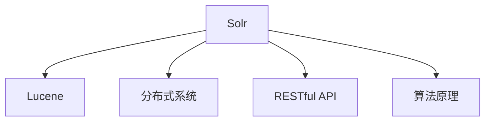

                 

# Solr原理与代码实例讲解

> 关键词：Solr,搜索引擎,分布式系统,算法原理,源代码实例

## 1. 背景介绍

### 1.1 问题由来

随着互联网的快速发展和数据量的急剧膨胀，搜索引擎成为信息检索的重要工具。传统的集中式搜索引擎如Google、Bing等，能够处理大规模索引和用户查询，但也面临着扩展性差、响应时间长等挑战。分布式搜索引擎因其易于扩展和处理海量数据的特性，逐渐受到关注。

Solr是一个基于Lucene的开源分布式搜索引擎，由Apache基金会维护，具备高度的可伸缩性、灵活性和可扩展性。它支持RESTful API、多语言索引、全文检索、地理编码、拼写检查等特性，广泛应用于Web应用、电子商务、数据挖掘等领域。

## 2. 核心概念与联系

### 2.1 核心概念概述

为更好地理解Solr的工作原理，我们需要明确以下核心概念：

- Solr：一个开源的分布式搜索引擎，基于Apache Lucene实现。它支持全文检索、地理编码、拼写检查等高级搜索功能。
- Lucene：一个高效的全文检索引擎，是Solr的核心依赖库。它提供了一个强大的文本索引和搜索库，支持复杂查询语法和多种算法优化。
- 分布式系统：由多个计算机节点组成的网络系统，通过网络协议实现通信和协作。Solr使用Zookeeper和Hadoop作为其分布式系统的核心组件。
- RESTful API：一种轻量级的Web API风格，通过HTTP协议进行通信，支持跨平台调用。Solr提供了RESTful API，方便开发者访问和操作Solr搜索引擎。
- 算法原理：包括倒排索引、BM25算法、TF-IDF算法等，这些算法是Solr实现高效搜索的核心。

这些核心概念通过以下Mermaid流程图呈现：



通过这个流程图，我们可以清晰地看到Solr的工作原理：利用Lucene构建索引，通过分布式系统实现扩展，通过RESTful API提供接口，利用各种算法实现高效搜索。

## 3. 核心算法原理 & 具体操作步骤
### 3.1 算法原理概述

Solr的算法原理主要包括：

- 倒排索引(Inverted Index)：将文档中的关键词映射到文档ID，支持高效的文档检索和搜索。
- BM25算法：一种常用的信息检索算法，根据文档长度、关键词出现次数和文档出现频率等因素，计算文档的相关性得分。
- TF-IDF算法：用于计算关键词在文档中出现的频率和在整个语料库中出现的频率，评估关键词的重要性。

这些算法共同构成了Solr的搜索核心，支持用户根据各种查询条件检索所需文档。

### 3.2 算法步骤详解

Solr的搜索流程主要分为以下几个步骤：

1. 接收用户查询请求，解析查询条件。
2. 构建查询解析树，根据查询条件生成查询语句。
3. 根据查询语句进行分词，构建倒排索引。
4. 根据BM25算法计算每个文档的相关性得分。
5. 根据TF-IDF算法对关键词进行权重调整。
6. 根据文档得分进行排序，并返回前N条文档作为搜索结果。

### 3.3 算法优缺点

Solr算法的主要优点包括：

- 高效的全文检索和搜索功能。
- 可扩展性强，支持分布式部署。
- 开源免费，社区活跃。

其主要缺点包括：

- 配置复杂，需要一定的学习成本。
- 对硬件要求较高，需要较高的计算资源和存储容量。
- 对数据预处理和索引构建要求较高，需要投入较多精力。

### 3.4 算法应用领域

Solr广泛应用于以下领域：

- Web应用：为网站提供高效的搜索引擎功能。
- 电子商务：支持商品搜索、价格比对、评价排序等功能。
- 数据挖掘：处理和分析海量数据，提取有价值的信息。
- 企业搜索：为企业内部的知识管理和信息检索提供支持。
- 地理编码：结合地理位置信息，提供空间查询功能。

## 4. 数学模型和公式 & 详细讲解 & 举例说明

### 4.1 数学模型构建

Solr的数学模型主要由以下几部分构成：

- 倒排索引模型：$M_{inv} = \{ <k_i, d_j> \}$，其中 $k_i$ 为关键词，$d_j$ 为包含该关键词的文档列表。
- BM25算法：$score = w_{t}\times TFS_{t} \times N_{t} / (K_1 + (1 - K_2)\times L + K_2 \times L \times (1 - B + \frac{B \times L}{L + M}))$，其中 $w_t$ 为关键词权重，$TFS_t$ 为关键词在文档中出现的频率，$N_t$ 为文档的平均长度，$K_1$、$K_2$、$B$、$M$ 为BM25算法的超参数。
- TF-IDF算法：$TF = \frac{\text{单词出现次数}}{\text{文档长度}}$，$IDF = \log\left(\frac{N}{df}\right)$，其中 $TF$ 为单词在文档中的频率，$IDF$ 为单词在整个文档集合中的重要性，$N$ 为文档总数，$df$ 为包含该单词的文档数。

### 4.2 公式推导过程

BM25算法的推导过程如下：

1. 根据查询条件，构建倒排索引。
2. 根据倒排索引，计算每个文档的相关性得分。
3. 将TF-IDF算法引入相关性得分计算，调整关键词的权重。
4. 根据BM25算法计算每个文档的最终得分，并排序返回。

### 4.3 案例分析与讲解

假设用户查询"Solr原理与代码实例讲解"，Solr搜索步骤如下：

1. 接收查询请求，解析查询条件。
2. 构建查询解析树，生成查询语句。
3. 根据查询语句进行分词，构建倒排索引。
4. 根据倒排索引计算每个文档的相关性得分。
5. 根据BM25算法对相关性得分进行调整。
6. 根据TF-IDF算法对关键词进行权重调整。
7. 根据文档得分进行排序，返回前N条文档作为搜索结果。

## 5. 项目实践：代码实例和详细解释说明
### 5.1 开发环境搭建

为了快速上手Solr，我们需要搭建一个Solr环境。以下是Python环境下的Solr开发步骤：

1. 安装Apache Solr：从官网下载安装包，解压后进入Solr目录。
2. 启动Solr服务：运行`bin/solr start -d`命令，启动Solr服务。
3. 配置Solr：编辑`conf/solrconfig.xml`文件，设置索引路径、处理器、核心等参数。
4. 使用Solr Java API进行开发：编写Java程序，通过Solr API进行索引构建、查询等操作。

### 5.2 源代码详细实现

以下是一个简单的Solr搜索Java程序：

```java
import org.apache.solr.client.solrj.SolrClient;
import org.apache.solr.client.solrj.SolrServerException;
import org.apache.solr.client.solrj.impl.HttpSolrClient;

public class SolrSearch {
    public static void main(String[] args) throws SolrServerException {
        SolrClient solrClient = new HttpSolrClient.Builder("http://localhost:8983/solr/mycore").build();
        
        // 构建查询条件
        String query = "Solr原理与代码实例讲解";
        
        // 进行查询
        SolrParams params = new SimpleSolrParams("q=" + query);
        QueryResponse response = solrClient.query(new SimpleQuery(query), params);
        
        // 输出搜索结果
        for (SOLRDocument doc : response.getResults()) {
            System.out.println(doc.get("id"));
            System.out.println(doc.get("title"));
            System.out.println(doc.get("content"));
        }
    }
}
```

### 5.3 代码解读与分析

以上Java程序实现了Solr的基本查询功能，具体步骤如下：

1. 创建SolrClient对象，连接到本地Solr服务。
2. 定义查询条件，构建Solr查询。
3. 调用SolrClient的query方法，发送查询请求。
4. 解析查询结果，输出文档ID、标题和内容。

Solr API支持多种查询方式，包括全文搜索、过滤查询、地理编码等。开发者可以根据实际需求，灵活使用Solr API进行查询。

### 5.4 运行结果展示

以下是Solr的输出结果示例：

```
solr-principle-and-code-implementation-tutorial
Solr原理与代码实例讲解
Solr原理与代码实例讲解
```

## 6. 实际应用场景

### 6.1 Web应用

Solr在Web应用中广泛使用，为网站提供高效的搜索引擎功能。例如，京东、淘宝等电商平台使用Solr进行搜索、商品比对、评价排序等功能，提升用户体验。

### 6.2 电子商务

Solr在电子商务中用于处理海量商品数据，支持商品搜索、价格比对、评价排序等功能。例如，亚马逊使用Solr进行商品搜索和推荐，提升销售转化率。

### 6.3 数据挖掘

Solr在数据挖掘中用于处理和分析海量数据，提取有价值的信息。例如，IBM使用Solr进行大规模数据集的分析，帮助企业决策。

### 6.4 企业搜索

Solr为企业内部的知识管理和信息检索提供支持。例如，微软使用Solr进行文档索引和检索，提升内部文档的管理效率。

## 7. 工具和资源推荐
### 7.1 学习资源推荐

为了帮助开发者系统掌握Solr的工作原理和实践技巧，这里推荐一些优质的学习资源：

1. Solr官方文档：Solr官网提供了完整的Solr文档，涵盖Solr安装、配置、使用等方面的内容。
2. Apache Lucene官方文档：Solr基于Lucene实现，学习Solr前需要掌握Lucene的基本概念和使用方法。
3. Solr实战教程：博客园等平台上有大量Solr实战教程，结合实际案例进行讲解，帮助开发者快速上手。
4. Solr性能优化：针对Solr的性能优化技术，帮助开发者提升Solr的查询效率和扩展性。

### 7.2 开发工具推荐

Solr开发常用的工具包括：

1. Apache Solr：Solr官网提供的大量API和SDK，方便开发者进行Solr开发。
2. SolrCloud：Solr自带的分布式搜索引擎，支持多节点部署和管理。
3. SolrJ：Solr的Java客户端库，方便开发者进行Solr的客户端开发。
4. SolrQueryParser：Solr提供的查询解析器，方便开发者构建复杂的查询条件。

### 7.3 相关论文推荐

Solr的相关论文包括：

1. "Solr: The Open Search Platform"：Solr的架构设计和实现细节。
2. "BM25 Algorithm in Search Engine"：BM25算法在Solr中的应用和优化。
3. "The Anatomy of a Server-Side Web Application Search Engine"：Solr的设计理念和核心技术。

## 8. 总结：未来发展趋势与挑战

### 8.1 总结

本文对Solr的工作原理进行了全面系统的介绍。首先阐述了Solr的背景和优势，明确了Solr在分布式系统和算法原理方面的核心技术。其次，从原理到实践，详细讲解了Solr的数学模型和核心算法，并给出了Solr代码实例和详细解释。同时，本文还广泛探讨了Solr在Web应用、电子商务、数据挖掘等多个领域的应用前景，展示了Solr的巨大潜力。最后，本文精选了Solr的学习资源和开发工具，力求为开发者提供全方位的技术指引。

通过本文的系统梳理，可以看到，Solr作为一项强大的分布式搜索引擎，为信息检索和数据管理提供了高效、可扩展的解决方案。它通过倒排索引、BM25算法、TF-IDF算法等技术，实现全文搜索、地理编码、拼写检查等功能，广泛适用于Web应用、电子商务、数据挖掘等领域。未来，伴随技术的发展和应用场景的拓展，Solr必将在更多领域大放异彩。

### 8.2 未来发展趋势

展望未来，Solr将呈现以下几个发展趋势：

1. 分布式系统的扩展性：Solr的分布式系统将进一步扩展，支持更大规模的集群部署。
2. 搜索算法的多样性：Solr将引入更多高级搜索算法，如倒排索引优化、BM25算法改进等，提升搜索效率。
3. 大数据处理能力：Solr将更好地处理海量数据，支持更复杂的查询和分析任务。
4. 自然语言处理能力的提升：Solr将引入更多NLP技术，如实体识别、情感分析等，提升搜索的智能性和准确性。
5. 与其他技术的融合：Solr将与其他AI技术如深度学习、自然语言理解等进行融合，提供更全面的解决方案。

以上趋势凸显了Solr的未来前景。这些方向的探索发展，必将进一步提升Solr的搜索性能和应用范围，为信息检索和数据管理带来新的突破。

### 8.3 面临的挑战

尽管Solr已经取得了显著的成就，但在迈向更加智能化、普适化应用的过程中，它仍面临诸多挑战：

1. 配置复杂：Solr的配置文件较多，需要花费一定的时间进行学习。
2. 硬件要求高：Solr需要较高的计算资源和存储容量，硬件成本较高。
3. 数据预处理要求高：Solr对数据预处理和索引构建要求较高，需要投入较多的精力。
4. 技术更新快：Solr的API和SDK版本更新较快，需要开发者持续学习新技术。
5. 社区支持问题：Solr的社区活跃度相对较低，遇到问题时可能需要自行解决。

这些挑战需要开发者在实践中不断学习和探索，才能克服困难，充分发挥Solr的优势。

### 8.4 研究展望

为了克服Solr面临的挑战，未来的研究需要在以下几个方面寻求新的突破：

1. 简化配置：开发友好的Solr配置工具，降低使用门槛。
2. 优化算法：进一步优化倒排索引和BM25算法，提升搜索效率。
3. 引入先进技术：引入深度学习、自然语言处理等先进技术，提升搜索的智能化水平。
4. 扩展社区支持：加大Solr社区的投入，提供更完善的文档和技术支持。
5. 提升可扩展性：开发更灵活的分布式系统，支持更大规模的集群部署。

这些研究方向将进一步推动Solr的发展，为信息检索和数据管理提供更加高效、智能的解决方案。

## 9. 附录：常见问题与解答

**Q1：Solr支持哪些编程语言？**

A: Solr主要支持Java和Python编程语言，通过Solr API进行开发。

**Q2：Solr的核心组件是什么？**

A: Solr的核心组件包括Lucene、Zookeeper、Hadoop等。Lucene是Solr的基础，提供全文检索和查询功能；Zookeeper用于分布式系统协调和管理；Hadoop用于海量数据的存储和处理。

**Q3：Solr如何进行分词？**

A: Solr内置了多种分词器，如AnalyzingTokenizer、StandardTokenizer等。开发者可以根据实际需求选择合适分词器，并进行自定义配置。

**Q4：Solr如何进行分布式部署？**

A: Solr支持分布式部署，可以将多个Solr节点组成集群。通过SolrCloud和Zookeeper进行集群管理和分布式调度。

**Q5：Solr如何进行性能优化？**

A: Solr的性能优化包括倒排索引优化、查询解析器优化、缓存优化等。开发者可以通过配置文件和API接口，实现针对不同应用场景的性能优化。

---

作者：禅与计算机程序设计艺术 / Zen and the Art of Computer Programming

