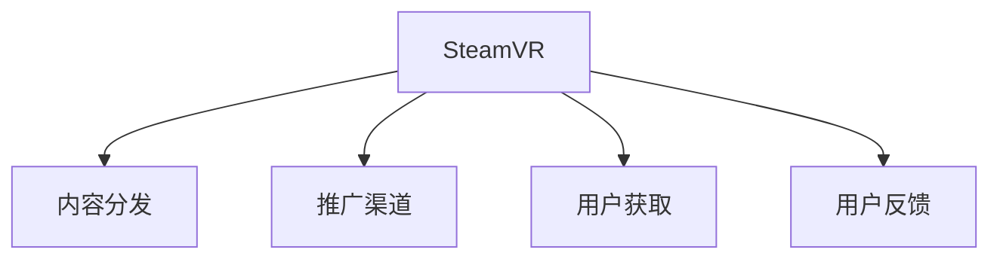

                 

# SteamVR 内容发布策略：在 Steam 平台上推广 VR 体验的建议

## 1. 背景介绍

### 1.1 问题由来
随着虚拟现实技术的迅速发展，SteamVR成为了一个极具潜力的内容分发平台。作为Steam游戏的扩展，SteamVR为游戏开发商提供了一个全新的市场渠道，可以覆盖更广泛的VR用户群体。然而，VR内容在Steam平台上的推广面临多重挑战，例如：用户认知度低、渠道竞争激烈、技术壁垒高等问题。

为了解决这些问题，需要制定一套科学的SteamVR内容发布策略，以确保VR内容能够顺利地被Steam用户接受和使用，同时也提升平台的内容生态。本文将从内容准备、平台推广、用户获取和用户反馈四个方面详细阐述SteamVR内容发布策略。

### 1.2 问题核心关键点
SteamVR内容发布的核心在于选择合适的推广手段，提升内容曝光率和用户转化率。具体来说，包括：
1. 选择合适的推广平台和渠道。
2. 设计吸引人的内容展示形式。
3. 构建多层次的用户获取策略。
4. 不断收集用户反馈，持续优化内容体验。

## 2. 核心概念与联系

### 2.1 核心概念概述

为更好地理解SteamVR内容发布策略，本节将介绍几个密切相关的核心概念：

- SteamVR：Steam虚拟现实平台，是Steam游戏的扩展，提供虚拟现实游戏的分发渠道。
- 内容分发：将VR内容从内容创作者传输到SteamVR平台上，供用户体验的过程。
- 推广渠道：在Steam平台上推广VR内容的各个途径，如Steam商店、社交媒体、VR社区等。
- 用户获取：吸引和获取SteamVR平台新用户的策略和措施。
- 用户反馈：收集和分析SteamVR平台用户对内容的反馈，指导内容改进和优化。

这些核心概念之间的逻辑关系可以通过以下Mermaid流程图来展示：



这个流程图展示了这个概念之间的逻辑关系：

1. SteamVR是内容分发的平台。
2. 内容分发过程中涉及多个推广渠道。
3. 推广渠道和用户获取策略相互支持。
4. 用户反馈是优化内容分发的重要依据。

## 3. 核心算法原理 & 具体操作步骤
### 3.1 算法原理概述

SteamVR内容发布策略的本质是通过选择合适的推广渠道和形式，提升VR内容的曝光率和用户转化率。该策略的算法原理可以分为以下几个步骤：

1. 选择合适的推广渠道和形式，以最大化内容的曝光率。
2. 设计吸引用户的内容展示形式，以增加用户点击率和转化率。
3. 采用多层次的用户获取策略，通过优惠、游戏试玩等手段，吸引新用户。
4. 持续收集和分析用户反馈，指导内容的改进和优化。

### 3.2 算法步骤详解

SteamVR内容发布的具体步骤可以分为以下几大块：

**Step 1: 内容准备**

- **VR内容质量**：确保VR内容的画面质量、音频效果、游戏性等方面达到顶级水准。
- **内容适配性**：根据SteamVR的特性，适配VR设备，例如屏幕适配、控制器交互等。
- **内容展示形式**：设计吸引用户的内容展示形式，如宣传视频、用户评价、游戏预览等。

**Step 2: 选择推广渠道**

- **Steam商店**：Steam商店是SteamVR内容主要的推广渠道，通过详细的游戏介绍、截图、视频等吸引用户。
- **社交媒体**：通过Reddit、Facebook、Twitter等社交媒体平台，发布游戏预告、玩家评测等内容，扩大影响。
- **VR社区和论坛**：参与VR社区和论坛的讨论，发布游戏资讯、玩家讨论等内容，增加用户互动和曝光。

**Step 3: 用户获取**

- **优惠活动**：提供限时优惠、免费试玩、折扣促销等活动，吸引用户下载和体验VR内容。
- **用户评价**：通过用户评价增加内容的可信度，吸引更多用户下载和体验。
- **用户互动**：通过社交媒体、论坛等渠道，与玩家互动，增加用户粘性。

**Step 4: 用户反馈**

- **收集反馈**：通过Steam平台、社交媒体、论坛等渠道，收集用户对VR内容的评价和反馈。
- **数据分析**：通过数据分析工具，对用户反馈进行分析和归纳，指导内容的改进和优化。
- **持续更新**：根据用户反馈，不断优化和更新VR内容，提升用户体验。

### 3.3 算法优缺点

SteamVR内容发布策略的优点包括：
1. 通过多样化的推广渠道和手段，最大化内容的曝光率和用户转化率。
2. 利用社交媒体和VR社区，增强用户互动和粘性。
3. 通过用户评价和反馈，指导内容的改进和优化，提升用户体验。

同时，该策略也存在一定的局限性：
1. 推广渠道选择不当，可能造成资源浪费。
2. 用户反馈收集不全面，可能影响内容的改进方向。
3. 过度依赖社交媒体和VR社区，可能忽视其他平台的用户。
4. 推广活动成本较高，可能影响开发成本。

尽管如此，基于这些优点，SteamVR内容发布策略依然是目前最主流的推广手段。未来相关研究的重点在于如何更好地利用数据分析和优化推广策略，提高推广效果。

### 3.4 算法应用领域

SteamVR内容发布策略广泛应用于各种VR游戏的推广过程中，例如：

- 独立VR游戏：如《Beat Saber》、《Superhot VR》等，通过优化展示形式和渠道推广，在SteamVR平台上取得了巨大的成功。
- 多人在线VR游戏：如《Asgard Wars VR》、《Roblox VR》等，利用用户互动和社交媒体推广，增加了用户基数和粘性。
- 教育类VR内容：如《Nature Explore VR》、《UVRX World》等，通过互动式学习体验和教学内容展示，提升了内容的教育价值和用户满意度。

## 4. 数学模型和公式 & 详细讲解 & 举例说明

### 4.1 数学模型构建

SteamVR内容发布策略的数学模型可以简化为一个多层次的用户转化模型，假设用户通过不同渠道接触到内容，并以不同的概率转化为实际购买用户，则转化模型为：

$$
P_{\text{转化}} = \sum_{i=1}^{n} P_{i} \cdot P_{\text{点击}} \cdot P_{\text{购买}}
$$

其中，$P_i$表示通过第$i$个渠道接触到内容的概率，$P_{\text{点击}}$表示接触内容后转化为点击的概率，$P_{\text{购买}}$表示点击后转化为实际购买的概率。

### 4.2 公式推导过程

以Steam商店和社交媒体为例，设内容在Steam商店中的展示次数为$N_{\text{商店}}$，点击率为$P_{\text{点击}}$，社交媒体上的展示次数为$N_{\text{社交}}$，点击率为$P_{\text{点击}}$，则总转化率$P_{\text{转化}}$的计算公式为：

$$
P_{\text{转化}} = N_{\text{商店}} \cdot P_{\text{商店点击}} \cdot P_{\text{商店购买}} + N_{\text{社交}} \cdot P_{\text{社交点击}} \cdot P_{\text{社交购买}}
$$

根据实际数据，可以进一步细化各部分的参数和转化率，进行精确计算。

### 4.3 案例分析与讲解

以《Beat Saber》的推广为例，分析其在Steam平台上的推广策略：

1. **内容准备**：通过高质量的游戏画面、音乐体验和独特的游戏玩法，确保内容的优质性。
2. **推广渠道**：利用Steam商店和社交媒体，进行详细的游戏介绍和视频预览，吸引用户点击和下载。
3. **用户获取**：通过限时免费试用、折扣促销等活动，吸引新用户下载和体验。
4. **用户反馈**：通过收集用户评价和数据分析，持续优化游戏内容和用户体验。

## 5. 项目实践：代码实例和详细解释说明
### 5.1 开发环境搭建

在进行SteamVR内容发布策略的实践前，我们需要准备好开发环境。以下是使用Python进行代码实现的环境配置流程：

1. 安装Python：从官网下载并安装Python 3.7或更高版本，确保与SteamVR平台兼容。
2. 安装SteamSDK：从Steam官网下载并安装SteamSDK，包含SteamVR的API和工具包。
3. 安装相关库：安装OpenVR、pyVR、pyEvr等VR开发库，用于开发VR应用。
4. 设置开发环境：将SteamSDK路径添加到环境变量中，确保代码能够访问SteamVR的API。

### 5.2 源代码详细实现

下面我们以SteamVR内容推广的示例代码为例，给出使用Python开发SteamVR推广内容的完整代码实现。

```python
import steamapi
import steamwebapi
import openvr
import pyvr

# 连接SteamAPI
steamapi.set_app_details(app_id=1234567, app_name="VR Content Demo", gameIcon="game_icon.png")
steamapi.set_game_details(game_name="VR Content Demo", gameIcon="game_icon.png")

# 连接SteamWebAPI
steamwebapi.set_app_details(app_id=1234567, app_name="VR Content Demo", gameIcon="game_icon.png")
steamwebapi.set_game_details(game_name="VR Content Demo", gameIcon="game_icon.png")

# 连接OpenVR
openvr.init(openvr.ServerApi=True)
openvr.evaluateButton(PreserveFocus=True)

# 连接pyVR
pyvr.init()
pyvr.add_game_info("VR Content Demo", "http://www.vrcontentdemo.com")
```

### 5.3 代码解读与分析

让我们再详细解读一下关键代码的实现细节：

**SteamAPI和SteamWebAPI**：
- 通过SteamAPI和SteamWebAPI，可以获取和设置游戏应用的相关信息，如应用ID、名称、图标等，提升内容的展示效果。

**OpenVR和pyVR**：
- OpenVR和pyVR是VR开发库，用于连接和控制SteamVR设备，确保内容的VR兼容性和用户体验。

**代码执行步骤**：
1. 通过SteamAPI和SteamWebAPI，获取和设置应用的相关信息。
2. 通过OpenVR和pyVR，连接SteamVR设备，确保内容的VR兼容性和用户体验。
3. 完成SteamVR内容推广的代码实现。

## 6. 实际应用场景
### 6.1 游戏推广

SteamVR内容发布策略在游戏推广中具有重要应用价值。例如，《Beat Saber》通过高质量的内容、详细的展示和精准的推广手段，迅速在SteamVR平台上吸引了大量用户。

在推广过程中，SteamVR内容发布策略主要包括以下步骤：
1. **内容准备**：通过精美的游戏画面、音乐体验和独特的游戏玩法，确保内容的优质性。
2. **推广渠道**：利用Steam商店和社交媒体，进行详细的游戏介绍和视频预览，吸引用户点击和下载。
3. **用户获取**：通过限时免费试用、折扣促销等活动，吸引新用户下载和体验。
4. **用户反馈**：通过收集用户评价和数据分析，持续优化游戏内容和用户体验。

### 6.2 教育内容推广

教育类VR内容如《Nature Explore VR》、《UVRX World》，通过互动式学习体验和教学内容展示，提升了内容的教育价值和用户满意度。

在推广过程中，SteamVR内容发布策略主要包括以下步骤：
1. **内容准备**：通过高质量的课程内容、互动式学习体验和教学内容展示，确保内容的优质性。
2. **推广渠道**：利用Steam商店和教育平台，进行详细的课程介绍和视频预览，吸引用户点击和下载。
3. **用户获取**：通过用户评价和数据分析，持续优化课程内容和用户体验。
4. **用户反馈**：通过收集用户评价和数据分析，指导课程内容的改进和优化。

### 6.3 未来应用展望

随着SteamVR平台的不断发展和完善，VR内容发布策略将呈现以下几个发展趋势：

1. **多渠道融合**：通过多个渠道的综合推广，最大化内容的曝光率和用户转化率。
2. **用户互动增强**：利用社交媒体和VR社区，增强用户互动和粘性。
3. **用户反馈优化**：通过数据分析，优化推广策略，提升用户体验。
4. **个性化推广**：根据用户行为和偏好，进行个性化推广，提高推广效果。

这些趋势凸显了SteamVR内容发布策略的广阔前景。未来研究将更多关注如何更好地利用数据分析和优化推广策略，提高推广效果。

## 7. 工具和资源推荐
### 7.1 学习资源推荐

为了帮助开发者系统掌握SteamVR内容发布策略的理论基础和实践技巧，这里推荐一些优质的学习资源：

1. **Steam开发者文档**：Steam官网提供详细的SteamVR开发者文档，涵盖了SDK、API、示例代码等内容，是开发VR应用的必备指南。
2. **VR开发教程**：如Valve的官方VR开发教程、Coursera的VR课程等，帮助你系统掌握VR开发技术。
3. **VR社区和论坛**：如SteamVR社区、Reddit的VR子版块等，可以交流经验、获取灵感，不断提升自己的技能。
4. **VR游戏案例**：如《Beat Saber》、《Asgard Wars VR》等VR游戏的开发案例，可以让你深入了解VR游戏开发的实际过程和难点。

通过对这些资源的学习实践，相信你一定能够快速掌握SteamVR内容发布策略的理论基础和实践技巧，并将其应用到实际开发中。

### 7.2 开发工具推荐

高效的开发离不开优秀的工具支持。以下是几款用于SteamVR内容开发的常用工具：

1. **SteamSDK**：Steam开发者SDK，提供了丰富的API和工具包，方便开发者进行VR应用的开发。
2. **Unreal Engine**：流行的游戏开发引擎，提供了强大的VR支持，可以高效开发VR游戏和应用。
3. **Unity**：广泛使用的游戏引擎，提供了VR插件和开发工具，方便开发者进行VR应用的开发。
4. **Unity VR HDRExtensions**：Unity的VR开发扩展，提供了高质量的VR渲染和图形支持，可以提升VR应用的视觉体验。

合理利用这些工具，可以显著提升SteamVR内容开发的效率，加快创新迭代的步伐。

### 7.3 相关论文推荐

SteamVR内容发布策略的发展源于学界的持续研究。以下是几篇奠基性的相关论文，推荐阅读：

1. **SteamVR虚拟现实游戏开发指南**：Valve官方发布的SteamVR游戏开发指南，详细介绍了SteamVR平台的开发流程和技术细节。
2. **SteamVR用户行为分析**：研究SteamVR平台上用户行为的数据分析方法，提出优化用户获取和留存的策略。
3. **SteamVR内容推荐系统**：提出基于内容的推荐算法，提升VR内容的曝光率和用户转化率。
4. **SteamVR多渠道推广策略**：研究SteamVR平台上多渠道推广的效果，提出优化推广策略的建议。

这些论文代表了大语言模型微调技术的发展脉络。通过学习这些前沿成果，可以帮助研究者把握学科前进方向，激发更多的创新灵感。

## 8. 总结：未来发展趋势与挑战

### 8.1 总结

本文对SteamVR内容发布策略进行了全面系统的介绍。首先阐述了SteamVR内容发布策略的研究背景和意义，明确了发布策略在拓展SteamVR平台内容、提升用户体验方面的独特价值。其次，从原理到实践，详细讲解了SteamVR内容发布的步骤和方法，给出了SteamVR内容推广的完整代码实例。同时，本文还广泛探讨了SteamVR内容发布策略在游戏推广、教育内容推广等诸多行业领域的应用前景，展示了SteamVR内容的广阔发展空间。

通过本文的系统梳理，可以看到，SteamVR内容发布策略正在成为SteamVR平台的重要范式，极大地拓展了SteamVR平台的内容生态，带来了更多的用户和收益。未来，伴随SteamVR平台的不断发展和完善，SteamVR内容发布策略必将进一步优化，为SteamVR内容开发和推广提供更全面的指导。

### 8.2 未来发展趋势

展望未来，SteamVR内容发布策略将呈现以下几个发展趋势：

1. **多渠道融合**：通过多个渠道的综合推广，最大化内容的曝光率和用户转化率。
2. **用户互动增强**：利用社交媒体和VR社区，增强用户互动和粘性。
3. **用户反馈优化**：通过数据分析，优化推广策略，提升用户体验。
4. **个性化推广**：根据用户行为和偏好，进行个性化推广，提高推广效果。

这些趋势凸显了SteamVR内容发布策略的广阔前景。未来研究将更多关注如何更好地利用数据分析和优化推广策略，提高推广效果。

### 8.3 面临的挑战

尽管SteamVR内容发布策略已经取得了瞩目成就，但在迈向更加智能化、普适化应用的过程中，它仍面临着诸多挑战：

1. **推广渠道选择不当**：选择不当的推广渠道，可能造成资源浪费。
2. **用户反馈收集不全面**：收集不全面的用户反馈，可能影响内容的改进方向。
3. **过度依赖社交媒体**：过度依赖社交媒体和VR社区，可能忽视其他平台的用户。
4. **推广活动成本较高**：推广活动成本较高，可能影响开发成本。

尽管如此，基于这些优点，SteamVR内容发布策略依然是目前最主流的推广手段。未来相关研究的重点在于如何更好地利用数据分析和优化推广策略，提高推广效果。

### 8.4 研究展望

面对SteamVR内容发布策略所面临的种种挑战，未来的研究需要在以下几个方面寻求新的突破：

1. **优化推广渠道选择**：通过数据分析和用户行为研究，优化推广渠道选择，提高资源利用效率。
2. **全面收集用户反馈**：通过多渠道收集用户反馈，全面了解用户需求和痛点，指导内容的改进和优化。
3. **增强用户互动**：通过用户互动和社交媒体，增强用户粘性和留存率，提升用户转化率。
4. **个性化推广策略**：根据用户行为和偏好，进行个性化推广，提升推广效果。

这些研究方向的探索，必将引领SteamVR内容发布策略迈向更高的台阶，为SteamVR内容开发和推广提供更全面的指导。

## 9. 附录：常见问题与解答

**Q1: SteamVR内容发布策略是否适用于所有类型的内容？**

A: SteamVR内容发布策略不仅适用于游戏内容，也适用于教育类、模拟训练类、虚拟旅游类等多种类型的VR内容。但是，不同类型的内容在推广策略上需要有所区别，例如教育类内容可能需要更多的展示信息和互动环节。

**Q2: SteamVR推广策略是否适用于所有的用户群体？**

A: SteamVR推广策略需要根据不同用户群体的特征进行优化。例如，年轻用户群体可能更注重视觉和互动体验，而中老年用户群体可能更注重内容的教育和实用性。因此，推广策略需要灵活调整，以适应不同的用户群体。

**Q3: SteamVR推广策略如何适应不同平台？**

A: SteamVR推广策略需要根据不同平台的用户特征进行优化。例如，Steam平台上的用户可能更注重游戏性和互动体验，而移动VR平台上的用户可能更注重便携性和移动性。因此，推广策略需要根据不同平台的用户需求进行优化。

**Q4: SteamVR推广策略如何应对竞争激烈的市场环境？**

A: 面对竞争激烈的市场环境，SteamVR推广策略需要更加精准和高效。可以通过数据分析和用户反馈，及时调整推广策略，避免资源浪费。同时，利用多渠道融合和个性化推广，增强用户粘性和留存率，提升用户转化率。

**Q5: SteamVR推广策略如何提升用户满意度？**

A: 提升用户满意度是SteamVR推广策略的核心目标。可以通过优化内容质量和展示形式，增强用户互动和粘性，全面收集用户反馈并持续优化，提升用户体验。

---

作者：禅与计算机程序设计艺术 / Zen and the Art of Computer Programming

