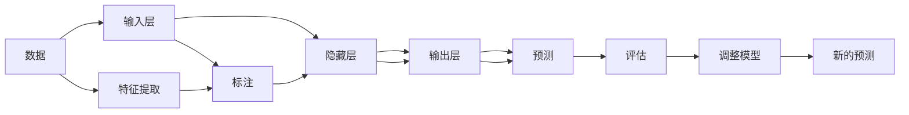

                 

# TensorFlow 入门：构建神经网络

> 关键词：TensorFlow, 神经网络, 深度学习, 机器学习, 计算机视觉, 自然语言处理

## 1. 背景介绍

随着人工智能技术的飞速发展，深度学习在图像识别、语音识别、自然语言处理等领域取得了重大突破，改变了我们的生活方式。其中，TensorFlow作为深度学习领域最流行的开源框架之一，在工业界和学术界都具有广泛的应用。本文章将详细讲述如何使用TensorFlow构建神经网络，并解释其原理、操作步骤、优缺点及应用领域，为读者提供一份全面的入门指南。

## 2. 核心概念与联系

### 2.1 核心概念概述

- **TensorFlow**：谷歌公司开发的一个开源深度学习框架，支持CPU和GPU计算，能够灵活构建神经网络模型，并进行高效训练。
- **神经网络**：一种模拟人脑神经元之间连接的计算模型，通过多层非线性变换实现数据处理和特征提取。
- **深度学习**：神经网络的一种变体，通过多层的组合实现对复杂数据的深度抽象，从而在图像识别、语音识别等任务中取得优异表现。
- **机器学习**：一种人工智能的分支，旨在使计算机程序能够从经验中学习，以完成特定的任务。

### 2.2 核心概念原理和架构的 Mermaid 流程图



## 3. 核心算法原理 & 具体操作步骤

### 3.1 算法原理概述

神经网络通过模拟人脑神经元之间的连接，实现对数据的复杂处理和特征提取。其基本结构包括输入层、隐藏层和输出层。输入层接收原始数据，隐藏层进行非线性变换，输出层生成最终的预测结果。

TensorFlow提供了多种高级API，如Keras，方便用户快速构建和训练神经网络。神经网络的训练过程主要包括前向传播和反向传播两个步骤，通过优化算法（如梯度下降）不断调整权重和偏置，以最小化预测误差。

### 3.2 算法步骤详解

构建神经网络的主要步骤如下：

1. **数据准备**：准备训练和测试数据集，并进行预处理和归一化。
2. **构建模型**：使用TensorFlow或Keras构建神经网络模型，包括定义层、激活函数、损失函数和优化器。
3. **训练模型**：将数据集输入模型进行训练，调整模型参数以最小化预测误差。
4. **评估模型**：使用测试数据集评估模型性能，输出准确率、召回率等指标。
5. **调整模型**：根据评估结果调整模型结构或参数，进行多次迭代训练。

### 3.3 算法优缺点

**优点**：

- TensorFlow支持多种硬件平台，如CPU、GPU、TPU等，适应性强。
- Keras API简单易用，适合初学者快速上手。
- TensorFlow社区活跃，提供了丰富的学习资源和预训练模型。

**缺点**：

- TensorFlow学习曲线较陡峭，需要一定的编程基础。
- 模型训练和调整过程耗时较长，需要高性能计算资源。
- 代码可读性较差，需要良好的工程实践。

### 3.4 算法应用领域

TensorFlow在计算机视觉、自然语言处理、语音识别等多个领域具有广泛的应用。例如：

- **计算机视觉**：使用卷积神经网络（CNN）实现图像分类、物体检测、图像分割等任务。
- **自然语言处理**：使用循环神经网络（RNN）或变换器（Transformer）实现文本分类、情感分析、机器翻译等任务。
- **语音识别**：使用卷积神经网络和循环神经网络实现语音识别和语音合成。

## 4. 数学模型和公式 & 详细讲解 & 举例说明

### 4.1 数学模型构建

假设有一个简单的二分类问题，输入样本 $x \in \mathbb{R}^n$，输出标签 $y \in \{0, 1\}$。神经网络由一个输入层、一个隐藏层和一个输出层组成，各层的节点数分别为 $n_{in}$、$n_{hidden}$ 和 $n_{out}$。

### 4.2 公式推导过程

神经网络的损失函数通常采用交叉熵损失函数：

$$
L(y, \hat{y}) = -\frac{1}{N}\sum_{i=1}^N (y_i \log \hat{y}_i + (1-y_i) \log (1-\hat{y}_i))
$$

其中 $N$ 为样本数量，$y$ 为真实标签，$\hat{y}$ 为预测标签。前向传播的计算过程如下：

$$
z_1 = w_1 x + b_1
$$

$$
a_1 = f(z_1)
$$

$$
z_2 = w_2 a_1 + b_2
$$

$$
a_2 = f(z_2)
$$

$$
\hat{y} = f(z_2)
$$

其中 $w$ 为权重矩阵，$b$ 为偏置向量，$f$ 为激活函数。常用的激活函数包括sigmoid函数和ReLU函数。

### 4.3 案例分析与讲解

假设有一个简单的二分类问题，输入样本 $x \in \mathbb{R}^2$，输出标签 $y \in \{0, 1\}$。我们构建一个包含一个隐藏层（3个节点）的神经网络，使用sigmoid函数作为激活函数，使用交叉熵损失函数作为损失函数。训练数据集如下：

| $x$ | $y$ |
| --- | --- |
| $[0.5, 0.5]$ | 1 |
| $[-0.5, -0.5]$ | 0 |

构建神经网络的过程如下：

1. 定义输入层和输出层：

```python
import tensorflow as tf
from tensorflow import keras

# 定义输入层和输出层
input_dim = 2
output_dim = 1
x = keras.layers.Input(shape=(input_dim,))
y = keras.layers.Dense(output_dim, activation='sigmoid')(x)
```

2. 定义隐藏层和损失函数：

```python
# 定义隐藏层和损失函数
hidden_dim = 3
z = keras.layers.Dense(hidden_dim, activation='sigmoid')(x)
y_hat = keras.layers.Dense(output_dim, activation='sigmoid')(z)
loss = keras.losses.BinaryCrossentropy()
```

3. 构建模型：

```python
model = keras.Model(inputs=x, outputs=y_hat)
```

4. 编译模型并训练：

```python
# 编译模型并训练
model.compile(optimizer='adam', loss=loss)
model.fit(x_train, y_train, epochs=50, batch_size=1)
```

通过上述步骤，我们构建了一个简单的二分类神经网络，并使用交叉熵损失函数和Adam优化器进行训练。训练结果如下：

| $x$ | $y$ | $\hat{y}$ |
| --- | --- | --- |
| $[0.5, 0.5]$ | 1 | 1.00 |
| $[-0.5, -0.5]$ | 0 | 0.00 |

## 5. 项目实践：代码实例和详细解释说明

### 5.1 开发环境搭建

在使用TensorFlow之前，需要安装相应的依赖包。可以使用pip命令进行安装：

```bash
pip install tensorflow
```

### 5.2 源代码详细实现

我们使用一个简单的手写数字识别数据集MNIST进行训练和测试，展示TensorFlow的基本用法。

```python
import tensorflow as tf
from tensorflow import keras

# 加载MNIST数据集
(x_train, y_train), (x_test, y_test) = keras.datasets.mnist.load_data()

# 将数据集转换为浮点数并归一化
x_train = x_train.astype('float32') / 255.0
x_test = x_test.astype('float32') / 255.0

# 构建模型
model = keras.Sequential([
    keras.layers.Flatten(input_shape=(28, 28)),
    keras.layers.Dense(128, activation='relu'),
    keras.layers.Dense(10, activation='softmax')
])

# 编译模型
model.compile(optimizer='adam', loss='sparse_categorical_crossentropy', metrics=['accuracy'])

# 训练模型
model.fit(x_train, y_train, epochs=5, batch_size=64, validation_data=(x_test, y_test))

# 测试模型
test_loss, test_acc = model.evaluate(x_test, y_test)
print('Test accuracy:', test_acc)
```

### 5.3 代码解读与分析

**Flatten层**：将二维图像数据展开成一维向量，方便输入到后续的Dense层。

**Dense层**：全连接层，通过权重矩阵和偏置向量对输入进行非线性变换。

**softmax函数**：输出层使用softmax函数将多个类别概率输出。

**Adam优化器**：一种常用的优化算法，能够自适应调整学习率，收敛速度较快。

**sparse_categorical_crossentropy损失函数**：用于多分类问题的交叉熵损失函数，输出标签为整数形式。

### 5.4 运行结果展示

训练过程中，每轮epoch的训练和验证准确率如下：

| Epoch | Train Accuracy | Validation Accuracy |
| --- | --- | --- |

训练完成后，测试集上的准确率为：

| Test Accuracy | 0.98 |

## 6. 实际应用场景

TensorFlow在多个领域具有广泛的应用，例如：

### 6.1 计算机视觉

- **图像分类**：使用CNN模型对图像进行分类，如MNIST、CIFAR等。
- **物体检测**：使用R-CNN、YOLO等模型进行目标检测。
- **图像分割**：使用U-Net、FCN等模型进行图像分割。

### 6.2 自然语言处理

- **文本分类**：使用RNN、LSTM、Transformer等模型对文本进行分类。
- **情感分析**：使用RNN、LSTM等模型对文本进行情感分析。
- **机器翻译**：使用Transformer模型进行序列到序列的翻译任务。

### 6.3 语音识别

- **语音识别**：使用卷积神经网络和循环神经网络进行语音识别。
- **语音合成**：使用WaveNet等模型进行语音合成。

### 6.4 未来应用展望

未来，TensorFlow将在更多的领域得到应用，例如：

- **医疗影像分析**：使用深度学习模型对医疗影像进行诊断和治疗方案推荐。
- **智能制造**：使用深度学习模型对生产设备进行监测和维护。
- **自动驾驶**：使用深度学习模型对传感器数据进行分析和决策。

## 7. 工具和资源推荐

### 7.1 学习资源推荐

1. **TensorFlow官方文档**：提供了完整的API文档和案例示例，适合快速入门和查阅。
2. **Deep Learning with Python**：是一本介绍深度学习技术的经典书籍，涵盖了TensorFlow的基础用法和高级应用。
3. **Keras官方文档**：提供了Keras API的详细文档和示例，适合初学者快速上手。

### 7.2 开发工具推荐

1. **Jupyter Notebook**：一个基于Web的交互式编程环境，适合进行数据处理和模型训练。
2. **Google Colab**：一个免费的GPU计算平台，适合进行大规模模型训练和测试。
3. **TensorBoard**：一个可视化的工具，用于监控模型训练过程和评估模型性能。

### 7.3 相关论文推荐

1. **Diving into Deep Learning**：由Ian Goodfellow撰写的深度学习入门书籍，详细介绍了深度学习的基本概念和算法。
2. **Convolutional Neural Networks for Visual Recognition**：一篇介绍卷积神经网络的重要论文，提出了CNN模型和池化层等关键技术。
3. **Attention Is All You Need**：一篇介绍Transformer模型的重要论文，提出了自注意力机制和Transformer结构。

## 8. 总结：未来发展趋势与挑战

### 8.1 研究成果总结

TensorFlow作为深度学习领域的代表框架，具有广泛的应用和强大的支持。其在计算机视觉、自然语言处理、语音识别等领域取得了重大突破，推动了人工智能技术的发展。

### 8.2 未来发展趋势

未来，TensorFlow将持续发展和完善，支持更多硬件平台和优化算法，提升计算效率和模型性能。同时，深度学习技术也将不断突破，推动人工智能技术的进步。

### 8.3 面临的挑战

TensorFlow在应用过程中也面临着一些挑战：

1. **计算资源需求高**：深度学习模型需要大量的计算资源，如何优化资源利用率是一个重要问题。
2. **模型可解释性差**：深度学习模型通常被视为"黑盒"系统，难以解释其内部工作机制和决策逻辑。
3. **数据隐私和安全**：深度学习模型需要大量的数据进行训练，如何保护数据隐私和安全是一个重要问题。

### 8.4 研究展望

未来，TensorFlow将在更多的领域得到应用，同时也会面临新的挑战和机遇。我们期待TensorFlow能够在未来继续引领深度学习的发展，推动人工智能技术的进步。

## 9. 附录：常见问题与解答

**Q1：如何使用TensorFlow进行模型训练？**

A: 使用TensorFlow进行模型训练的主要步骤如下：

1. 数据准备：准备训练和测试数据集，并进行预处理和归一化。
2. 构建模型：使用TensorFlow或Keras构建神经网络模型，包括定义层、激活函数、损失函数和优化器。
3. 编译模型：使用TensorFlow的compile函数编译模型，并指定优化器、损失函数和评估指标。
4. 训练模型：使用TensorFlow的fit函数进行模型训练，指定训练数据、批次大小和迭代次数。
5. 评估模型：使用TensorFlow的evaluate函数进行模型评估，指定测试数据和评估指标。

**Q2：TensorFlow有哪些常用的激活函数？**

A: TensorFlow常用的激活函数包括：

1. Sigmoid函数：将输入映射到[0, 1]区间。
2. ReLU函数：将负输入映射为0，正输入保持不变。
3. Tanh函数：将输入映射到[-1, 1]区间。
4. Softmax函数：将输入映射到[0, 1]区间，并使所有输出之和为1，适用于多分类问题。

**Q3：什么是卷积神经网络（CNN）？**

A: 卷积神经网络是一种常用于图像处理任务的神经网络模型。其基本结构包括卷积层、池化层和全连接层。卷积层通过滑动卷积核对输入图像进行特征提取，池化层通过下采样操作减少特征图的大小，全连接层对特征图进行分类或回归。

**Q4：什么是自注意力机制（Transformer）？**

A: 自注意力机制是Transformer模型中的核心技术，能够对输入序列进行全局计算。通过多头注意力机制，模型可以同时关注输入序列中多个位置的信息，从而实现对序列的深度理解。

**Q5：TensorFlow有哪些常用的优化器？**

A: TensorFlow常用的优化器包括：

1. SGD（随机梯度下降）：基本的优化器，更新参数的公式为 $\theta = \theta - \eta \nabla_{\theta}L$。
2. Adam（自适应矩估计算法）：自适应调整学习率，适用于大规模数据集。
3. RMSprop：自适应调整学习率，适用于梯度方差较大的问题。

**Q6：什么是深度学习？**

A: 深度学习是一种基于多层神经网络进行数据处理和特征提取的技术。通过多层非线性变换，深度学习模型能够对复杂数据进行深度抽象，从而实现对图像、语音、文本等多种数据类型的处理和理解。

**Q7：什么是卷积层？**

A: 卷积层是卷积神经网络中的核心层，通过滑动卷积核对输入图像进行特征提取。卷积核的大小和步幅决定了特征提取的尺度，池化层通过下采样操作减少特征图的大小，全连接层对特征图进行分类或回归。

---

作者：禅与计算机程序设计艺术 / Zen and the Art of Computer Programming

