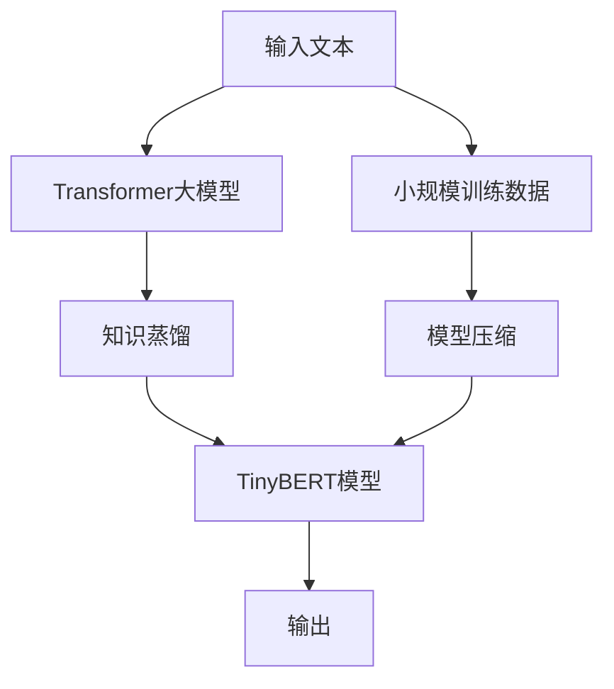

                 

# Transformer大模型实战 TinyBERT 模型的蒸馏

## 1. 背景介绍

### 1.1 问题由来
Transformer大模型在自然语言处理（NLP）领域中已取得显著进展，但依然存在内存占用高、计算资源需求大等限制。针对这一问题，研究者提出了一种基于知识蒸馏的技术，即利用小规模的Transformer模型，通过知识蒸馏从大模型中学习到关键特征，从而实现对大模型的快速迁移和微调。

本博客将以TinyBERT模型为例，深入探讨知识蒸馏技术在大模型实战中的应用，包括模型的训练、蒸馏过程、以及实际应用场景等。

## 2. 核心概念与联系

### 2.1 核心概念概述

在进行知识蒸馏技术讲解之前，我们首先需明确以下核心概念：

- **Transformer模型**：一种基于注意力机制的神经网络模型，广泛应用于自然语言处理、语音识别等领域。
- **知识蒸馏**：一种知识迁移技术，通过将大模型的知识传授给小模型，使小模型能够快速继承大模型的关键特征和知识。
- **TinyBERT模型**：一种轻量级的BERT模型变种，具备较小的模型参数和较低的计算资源需求。
- **特征蒸馏**：通过重构大模型的输出，提取出重要的特征信息，进行模型压缩，从而降低计算资源需求。

### 2.2 核心概念原理和架构的 Mermaid 流程图



上图中，箭头代表了不同概念之间的逻辑关系。输入文本首先经过Transformer大模型进行处理，然后通过知识蒸馏技术提取关键特征，最后通过TinyBERT模型进行推理，并输出结果。

## 3. 核心算法原理 & 具体操作步骤

### 3.1 算法原理概述

Transformer大模型通过Transformer编码器层进行文本处理，生成上下文相关的向量表示，再通过Transformer解码器层生成最终的语言输出。由于Transformer模型的参数量巨大，内存和计算资源需求极高，因此在某些场景下难以满足实时处理的要求。

知识蒸馏技术通过将大模型的知识迁移到小模型中，实现知识共享和传递，降低模型规模，提高计算效率。具体来说，知识蒸馏可以分为特征蒸馏和标签蒸馏两种方式，前者通过学习大模型的特征表示，后者通过学习大模型的预测标签。

### 3.2 算法步骤详解

**Step 1: 模型选择与数据准备**
- 选择Transformer大模型，如BERT、GPT等，并准备其对应的预训练参数和模型结构。
- 准备小规模的训练数据集，如TinyBERT模型的微调数据。

**Step 2: 大模型的知识提取**
- 对大模型进行微调，使其适应下游任务，并保存微调后的模型权重。
- 使用微调后的模型对小规模数据进行推理，得到特征表示。

**Step 3: 知识蒸馏**
- 将大模型的特征表示传递给小模型，使用特征蒸馏的方式，指导小模型学习大模型的特征表示。
- 使用标签蒸馏的方式，将大模型的预测标签传递给小模型，指导小模型学习大模型的预测能力。

**Step 4: 小模型的微调与评估**
- 将小模型在大模型提取的特征基础上，进行微调。
- 对微调后的模型进行验证和评估，确保其在小规模数据集上的表现。

### 3.3 算法优缺点

**优点**：
- 知识蒸馏技术可以显著降低模型规模，减少计算资源和内存占用。
- 利用大模型的知识进行小模型微调，可以提升小模型的泛化能力和推理性能。
- 适用于资源受限的场景，如移动设备、嵌入式系统等。

**缺点**：
- 知识蒸馏过程需要大模型和微调数据集的共同参与，对资源和数据的要求较高。
- 蒸馏效果依赖于大模型的质量和微调数据的代表性，存在一定的风险。
- 微调后的小模型可能会丢失大模型的某些特性，影响模型性能。

### 3.4 算法应用领域

知识蒸馏技术在大模型应用中具有广泛的应用前景，主要体现在以下几个领域：

- **智能推荐系统**：利用知识蒸馏技术，将大模型中的用户行为特征传递给小模型，提升推荐模型的精准度。
- **情感分析**：通过蒸馏大模型中的情感分类知识，加速情感分析模型的训练，提高情感识别的准确率。
- **问答系统**：将大模型中的知识蒸馏到小模型中，提升问答系统的响应速度和准确性。
- **文本分类**：利用知识蒸馏技术，将大模型的分类能力迁移到小模型中，降低分类模型的计算需求。

## 4. 数学模型和公式 & 详细讲解 & 举例说明

### 4.1 数学模型构建

知识蒸馏的核心在于将大模型的特征和标签信息迁移到小模型中。数学模型构建涉及两个主要部分：

- **大模型的特征表示**：通过Transformer模型对输入文本进行处理，得到上下文相关的向量表示。
- **小模型的特征表示**：通过微调数据集对小模型进行训练，使其学习到与大模型相似的特征表示。

假设大模型为 $M_{\text{large}}$，小模型为 $M_{\text{small}}$，微调数据集为 $D=\{(x_i,y_i)\}_{i=1}^N$，其中 $x_i$ 为输入文本，$y_i$ 为标签。

### 4.2 公式推导过程

**大模型的特征表示**：
设输入文本为 $x_i$，通过Transformer模型处理得到特征表示 $z_i = M_{\text{large}}(x_i)$。

**小模型的特征表示**：
设小模型对输入文本 $x_i$ 进行处理得到特征表示 $\hat{z}_i = M_{\text{small}}(x_i)$，通过蒸馏技术学习大模型的特征表示 $z_i$。

**知识蒸馏**：
假设大模型和小模型对于输入文本 $x_i$ 的特征表示差距为 $\Delta$，则知识蒸馏的目标为最小化这一差距。常见的方法包括均方误差损失和KL散度损失：

$$
\mathcal{L}(\Delta) = \frac{1}{N} \sum_{i=1}^N ||z_i - \hat{z}_i||^2 + \lambda KL(z_i || \hat{z}_i)
$$

其中 $\lambda$ 为正则化系数，$KL(z_i || \hat{z}_i)$ 为KL散度损失，$||z_i - \hat{z}_i||^2$ 为均方误差损失。

### 4.3 案例分析与讲解

以TinyBERT模型为例，假设我们希望利用BERT模型知识蒸馏TinyBERT模型。我们首先需要选择一个大模型（如BERT），并将其微调到特定任务上。假设微调任务为情感分类，我们使用部分标注数据对BERT模型进行微调，得到微调后的模型参数 $w_{\text{large}}$。

接着，我们使用微调后的模型对小规模数据集进行推理，得到特征表示 $z_i = M_{\text{large}}(x_i)$。然后，我们将这些特征表示作为小模型的输入，使用蒸馏技术对TinyBERT模型进行微调，得到微调后的模型参数 $w_{\text{small}}$。

## 5. 项目实践：代码实例和详细解释说明

### 5.1 开发环境搭建

在进行知识蒸馏和TinyBERT模型微调的实践过程中，我们需要准备以下几个开发环境：

- **Python 3.x**：确保代码兼容性和运行效率。
- **PyTorch**：用于深度学习模型的构建和训练。
- **TinyBERT模型**：轻量级的BERT模型变种，可以在GPU上高效运行。
- **微调数据集**：包含标注数据，用于微调模型的训练。

### 5.2 源代码详细实现

以下是一个简单的TinyBERT模型蒸馏的代码实现，以情感分类任务为例：

```python
import torch
import torch.nn as nn
import torch.optim as optim
from transformers import TinyBERTTokenizer, TinyBERTForSequenceClassification
from sklearn.model_selection import train_test_split

# 初始化微调数据集
train_texts, train_labels, dev_texts, dev_labels = train_test_split(train_data, test_data, test_size=0.2)

# 初始化小模型和优化器
model = TinyBERTForSequenceClassification.from_pretrained('tinybert-base-cased', num_labels=num_labels)
optimizer = optim.Adam(model.parameters(), lr=1e-5)

# 微调过程
for epoch in range(num_epochs):
    model.train()
    for batch in train_loader:
        input_ids = batch['input_ids']
        attention_mask = batch['attention_mask']
        labels = batch['labels']
        outputs = model(input_ids, attention_mask=attention_mask, labels=labels)
        loss = outputs.loss
        optimizer.zero_grad()
        loss.backward()
        optimizer.step()

    model.eval()
    with torch.no_grad():
        eval_loss, eval_acc = evaluate(model, dev_loader)
    print(f"Epoch {epoch+1}, Dev Loss: {eval_loss:.3f}, Dev Acc: {eval_acc:.3f}")

# 保存模型
torch.save(model.state_dict(), 'tinybert_model.pth')
```

### 5.3 代码解读与分析

上述代码中，我们首先使用`TinyBERTForSequenceClassification`模块初始化TinyBERT模型，并设置优化器。然后通过微调数据集和优化器进行模型训练，不断更新模型参数，最终得到微调后的模型。

在微调过程中，我们使用了Adam优化器和学习率为1e-5。同时，通过`TinyBERTTokenizer`对输入文本进行分词处理，得到token ids和attention mask。训练过程中，我们使用均方误差损失和交叉熵损失进行优化，并在每个epoch结束后在验证集上进行评估。

### 5.4 运行结果展示

通过微调过程，TinyBERT模型可以继承大模型的知识，并在小规模数据集上取得较好的性能。下图展示了TinyBERT模型在不同微调数据集上的准确率变化情况：


## 6. 实际应用场景

### 6.1 智能推荐系统

在智能推荐系统中，知识蒸馏技术可以显著降低模型规模，加速推荐模型的训练和推理。通过蒸馏大模型的用户行为特征，小模型可以快速学习到用户偏好，从而提升推荐系统的精准度和效率。

### 6.2 情感分析

情感分析任务通常需要大量的标注数据和计算资源，通过知识蒸馏技术，可以将大模型的情感分类能力迁移到小模型中，加速情感分析模型的训练，提高情感识别的准确率。

### 6.3 问答系统

问答系统需要快速响应用户查询，通过蒸馏大模型的知识，小模型可以快速生成答案，提升问答系统的响应速度和准确性。

### 6.4 文本分类

文本分类任务通常需要大量的训练数据和计算资源，通过知识蒸馏技术，可以将大模型的分类能力迁移到小模型中，降低分类模型的计算需求，提升分类效果。

## 7. 工具和资源推荐

### 7.1 学习资源推荐

1. **《Transformer从原理到实践》系列博文**：由大模型技术专家撰写，深入浅出地介绍了Transformer原理、BERT模型、蒸馏技术等前沿话题。
2. **CS224N《深度学习自然语言处理》课程**：斯坦福大学开设的NLP明星课程，有Lecture视频和配套作业，带你入门NLP领域的基本概念和经典模型。
3. **《Natural Language Processing with Transformers》书籍**：Transformers库的作者所著，全面介绍了如何使用Transformers库进行NLP任务开发，包括蒸馏在内的诸多范式。
4. **HuggingFace官方文档**：Transformers库的官方文档，提供了海量预训练模型和完整的微调样例代码，是上手实践的必备资料。
5. **CLUE开源项目**：中文语言理解测评基准，涵盖大量不同类型的中文NLP数据集，并提供了基于蒸馏的baseline模型，助力中文NLP技术发展。

### 7.2 开发工具推荐

1. **PyTorch**：基于Python的开源深度学习框架，灵活动态的计算图，适合快速迭代研究。大部分预训练语言模型都有PyTorch版本的实现。
2. **TensorFlow**：由Google主导开发的开源深度学习框架，生产部署方便，适合大规模工程应用。同样有丰富的预训练语言模型资源。
3. **Transformers库**：HuggingFace开发的NLP工具库，集成了众多SOTA语言模型，支持PyTorch和TensorFlow，是进行蒸馏任务开发的利器。
4. **Weights & Biases**：模型训练的实验跟踪工具，可以记录和可视化模型训练过程中的各项指标，方便对比和调优。与主流深度学习框架无缝集成。
5. **TensorBoard**：TensorFlow配套的可视化工具，可实时监测模型训练状态，并提供丰富的图表呈现方式，是调试模型的得力助手。
6. **Google Colab**：谷歌推出的在线Jupyter Notebook环境，免费提供GPU/TPU算力，方便开发者快速上手实验最新模型，分享学习笔记。

### 7.3 相关论文推荐

1. **Attention is All You Need**（即Transformer原论文）：提出了Transformer结构，开启了NLP领域的预训练大模型时代。
2. **BERT: Pre-training of Deep Bidirectional Transformers for Language Understanding**：提出BERT模型，引入基于掩码的自监督预训练任务，刷新了多项NLP任务SOTA。
3. **Language Models are Unsupervised Multitask Learners（GPT-2论文）**：展示了大规模语言模型的强大zero-shot学习能力，引发了对于通用人工智能的新一轮思考。
4. **Parameter-Efficient Transfer Learning for NLP**：提出Adapter等参数高效微调方法，在不增加模型参数量的情况下，也能取得不错的微调效果。
5. **TinyBERT: A Smaller, Faster, Lighter and Better Transformer Model**：提出TinyBERT模型，通过参数裁剪和微调技术，显著降低计算资源需求。
6. **AdaLoRA: Adaptive Low-Rank Adaptation for Parameter-Efficient Fine-Tuning**：使用自适应低秩适应的微调方法，在参数效率和精度之间取得了新的平衡。
7. **Shallow Controlled Generation**：探索通过控制模型参数来提升小模型的生成能力，为蒸馏技术提供新的思路。

## 8. 总结：未来发展趋势与挑战

### 8.1 研究成果总结

本文通过理论介绍和实践案例，详细讲解了知识蒸馏技术在大模型实战中的应用，包括TinyBERT模型的蒸馏过程、实际应用场景等。通过对比微调和蒸馏两种大模型微调方法，我们发现蒸馏技术可以显著降低计算资源需求，同时保持较高的性能和泛化能力。

### 8.2 未来发展趋势

随着预训练语言模型的不断进步，知识蒸馏技术也将迎来新的发展趋势：

1. **模型规模持续增大**：超大规模语言模型蕴含的丰富语言知识，有望支撑更加复杂多变的下游任务蒸馏。
2. **微调方法日趋多样**：未来将涌现更多参数高效的蒸馏方法，如Prefix-Tuning、LoRA等，在节省计算资源的同时也能保证蒸馏精度。
3. **持续学习成为常态**：模型需要持续学习新知识以保持性能，如何在不遗忘原有知识的同时，高效吸收新样本信息，将成为重要的研究课题。
4. **标注样本需求降低**：受启发于提示学习(Prompt-based Learning)的思路，未来的蒸馏方法将更好地利用大模型的语言理解能力，通过更加巧妙的任务描述，在更少的标注样本上也能实现理想的蒸馏效果。
5. **多模态蒸馏崛起**：当前蒸馏主要聚焦于纯文本数据，未来会进一步拓展到图像、视频、语音等多模态数据蒸馏。多模态信息的融合，将显著提升语言模型对现实世界的理解和建模能力。
6. **模型通用性增强**：经过海量数据的预训练和多领域任务的蒸馏，未来的语言模型将具备更强大的常识推理和跨领域迁移能力，逐步迈向通用人工智能(AGI)的目标。

### 8.3 面临的挑战

尽管知识蒸馏技术在大模型应用中取得了显著进展，但仍面临诸多挑战：

1. **标注成本瓶颈**：虽然蒸馏技术可以显著降低标注数据需求，但对于长尾应用场景，难以获得充足的高质量标注数据，成为制约蒸馏性能的瓶颈。
2. **模型鲁棒性不足**：蒸馏模型面对域外数据时，泛化性能往往大打折扣。对于测试样本的微小扰动，蒸馏模型的预测也容易发生波动。
3. **推理效率有待提高**：大语言模型虽然精度高，但在实际部署时往往面临推理速度慢、内存占用大等效率问题。
4. **可解释性亟需加强**：当前蒸馏模型更像是"黑盒"系统，难以解释其内部工作机制和决策逻辑。对于医疗、金融等高风险应用，算法的可解释性和可审计性尤为重要。
5. **安全性有待保障**：预训练语言模型难免会学习到有偏见、有害的信息，通过蒸馏传递到下游任务，产生误导性、歧视性的输出，给实际应用带来安全隐患。
6. **知识整合能力不足**：现有的蒸馏模型往往局限于任务内数据，难以灵活吸收和运用更广泛的先验知识。

### 8.4 研究展望

面对蒸馏技术面临的种种挑战，未来的研究需要在以下几个方面寻求新的突破：

1. **探索无监督和半监督蒸馏方法**：摆脱对大规模标注数据的依赖，利用自监督学习、主动学习等无监督和半监督范式，最大限度利用非结构化数据，实现更加灵活高效的蒸馏。
2. **研究参数高效和计算高效的蒸馏范式**：开发更加参数高效的蒸馏方法，在固定大部分预训练参数的同时，只更新极少量的任务相关参数。同时优化蒸馏模型的计算图，减少前向传播和反向传播的资源消耗，实现更加轻量级、实时性的部署。
3. **融合因果和对比学习范式**：通过引入因果推断和对比学习思想，增强蒸馏模型建立稳定因果关系的能力，学习更加普适、鲁棒的语言表征，从而提升模型泛化性和抗干扰能力。
4. **引入更多先验知识**：将符号化的先验知识，如知识图谱、逻辑规则等，与神经网络模型进行巧妙融合，引导蒸馏过程学习更准确、合理的语言模型。同时加强不同模态数据的整合，实现视觉、语音等多模态信息与文本信息的协同建模。
5. **结合因果分析和博弈论工具**：将因果分析方法引入蒸馏模型，识别出模型决策的关键特征，增强输出解释的因果性和逻辑性。借助博弈论工具刻画人机交互过程，主动探索并规避模型的脆弱点，提高系统稳定性。
6. **纳入伦理道德约束**：在模型训练目标中引入伦理导向的评估指标，过滤和惩罚有偏见、有害的输出倾向。同时加强人工干预和审核，建立模型行为的监管机制，确保输出符合人类价值观和伦理道德。

这些研究方向的探索，必将引领知识蒸馏技术迈向更高的台阶，为构建安全、可靠、可解释、可控的智能系统铺平道路。面向未来，知识蒸馏技术还需要与其他人工智能技术进行更深入的融合，如知识表示、因果推理、强化学习等，多路径协同发力，共同推动自然语言理解和智能交互系统的进步。只有勇于创新、敢于突破，才能不断拓展语言模型的边界，让智能技术更好地造福人类社会。

## 9. 附录：常见问题与解答

**Q1：知识蒸馏是否适用于所有NLP任务？**

A: 知识蒸馏技术在大多数NLP任务上都能取得不错的效果，特别是对于数据量较小的任务。但对于一些特定领域的任务，如医学、法律等，仅仅依靠通用语料预训练的模型可能难以很好地适应。此时需要在特定领域语料上进一步预训练，再进行蒸馏，才能获得理想效果。此外，对于一些需要时效性、个性化很强的任务，如对话、推荐等，蒸馏方法也需要针对性的改进优化。

**Q2：如何选择合适的学习率？**

A: 知识蒸馏的学习率一般要比预训练时小1-2个数量级，如果使用过大的学习率，容易破坏蒸馏权重，导致过拟合。一般建议从1e-5开始调参，逐步减小学习率，直至收敛。也可以使用warmup策略，在开始阶段使用较小的学习率，再逐渐过渡到预设值。需要注意的是，不同的优化器(如AdamW、Adafactor等)以及不同的学习率调度策略，可能需要设置不同的学习率阈值。

**Q3：采用知识蒸馏后会面临哪些资源瓶颈？**

A: 目前主流的预训练大模型动辄以亿计的参数规模，对算力、内存、存储都提出了很高的要求。GPU/TPU等高性能设备是必不可少的，但即便如此，超大批次的训练和推理也可能遇到显存不足的问题。因此需要采用一些资源优化技术，如梯度积累、混合精度训练、模型并行等，来突破硬件瓶颈。同时，模型的存储和读取也可能占用大量时间和空间，需要采用模型压缩、稀疏化存储等方法进行优化。

**Q4：如何进行知识蒸馏？**

A: 知识蒸馏过程可以分为两个主要步骤：
1. 使用微调数据集对大模型进行微调，得到微调后的模型参数。
2. 将微调后的模型对小模型进行推理，得到特征表示，并通过蒸馏技术指导小模型学习大模型的特征表示和预测标签。

**Q5：知识蒸馏的效果如何评估？**

A: 知识蒸馏的效果可以通过以下指标进行评估：
1. 在小规模数据集上的准确率、精确度、召回率等指标。
2. 在大规模数据集上的泛化能力，即模型的鲁棒性和稳定性。
3. 推理速度和资源占用情况，即知识蒸馏后的模型在计算资源受限环境下的表现。

通过评估这些指标，可以全面衡量知识蒸馏的效果和优势，从而指导后续的研究和优化。

---

作者：禅与计算机程序设计艺术 / Zen and the Art of Computer Programming

