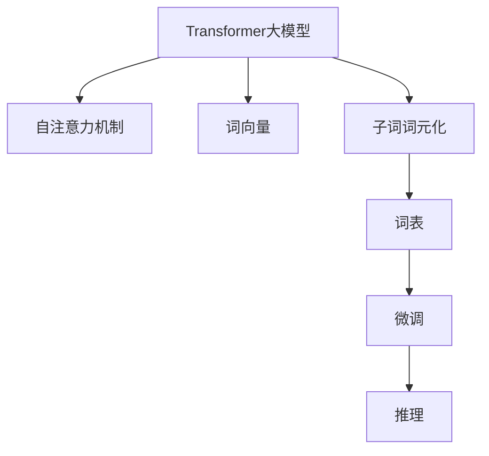

                 

# Transformer大模型实战 子词词元化算法

> 关键词：Transformer, 子词词元化, 词向量, 自注意力, 大模型, 自然语言处理(NLP)

## 1. 背景介绍

### 1.1 问题由来
Transformer作为当前NLP领域最先进的模型，其核心优势在于采用自注意力机制，能够高效地捕捉文本中的长期依赖关系。然而，随着模型参数量的不断增大，对GPU内存和计算资源的需求也显著增加，导致Transformer大模型在实际部署中面临诸多挑战。

为了解决这些问题，近年来涌现出了许多针对Transformer模型的优化方法，其中子词词元化算法(Subword Tokenization)是一种非常重要且有效的技术。该算法通过对词语进行分词，将词语拆分为更小的子词单元，从而降低模型参数量和内存占用，同时增强模型的泛化能力和鲁棒性。

本文将系统介绍Transformer大模型中的子词词元化算法，包括其实现原理、操作步骤、优缺点及应用领域。通过学习本文，你将掌握如何对大模型进行高效、灵活的子词词元化，提升模型性能和部署效率。

### 1.2 问题核心关键点
子词词元化算法是Transformer大模型中常用的优化技术，其核心思想是通过将词语拆分为更小的子词单元，降低模型参数量和内存占用，同时增强模型的泛化能力和鲁棒性。该算法主要包括以下几个关键点：

- 如何选择合适的分词策略？
- 如何将词语拆分为子词单元？
- 如何在微调时保持分词一致性？
- 如何在保持分词一致性的同时降低模型内存占用？

## 2. 核心概念与联系

### 2.1 核心概念概述

为更好地理解子词词元化算法，本节将介绍几个密切相关的核心概念：

- Transformer大模型：以自注意力机制为核心的深度神经网络模型，用于处理自然语言处理任务，如机器翻译、文本分类等。
- 子词词元化(Subword Tokenization)：将词语拆分为更小的子词单元，用于降低模型参数量和内存占用，增强模型的泛化能力和鲁棒性。
- 词向量(Word Embedding)：将词语映射为向量形式，方便模型进行处理和推理。
- 自注意力机制(Self-Attention)：一种机制，用于在模型内部捕捉不同词语间的依赖关系，提升模型的表示能力。
- 词表(Vocabulary)：将单词和其对应的向量进行映射，用于快速索引和查找词语。

这些核心概念之间的逻辑关系可以通过以下Mermaid流程图来展示：



这个流程图展示了大模型、自注意力、词向量、子词词元化和词表之间的逻辑关系：

1. Transformer大模型通过自注意力机制捕捉词语间的依赖关系。
2. 通过词向量将词语映射为向量形式，方便模型处理。
3. 通过子词词元化将词语拆分为更小的子词单元，降低模型参数量和内存占用。
4. 通过词表将单词和其对应的向量进行映射，用于快速索引和查找词语。
5. 微调和推理过程使用上述机制进行，以实现高效处理自然语言任务。

## 3. 核心算法原理 & 具体操作步骤

### 3.1 算法原理概述

子词词元化算法通过将词语拆分为更小的子词单元，降低模型参数量和内存占用，同时增强模型的泛化能力和鲁棒性。其核心思想是通过选择合适的分词策略，将词语拆分为多个子词，每个子词在模型中都有对应的向量表示。

形式化地，假设单词 $w$ 被拆分为 $n$ 个子词 $\{w_1, w_2, ..., w_n\}$，则每个子词在词表中的向量表示为 $w_i \in \mathbb{R}^d$，其中 $d$ 为向量维度。整个单词的向量表示为 $w = [w_1; w_2; ...; w_n] \in \mathbb{R}^{dn}$。

在实际应用中，常用的子词词元化策略包括：

- BPE(BPE)：基于字符的双字节分词法，将单词拆分为字节序列，并进行合并和替换。
- SentencePiece：一种基于字符的分词法，通过训练得到分词模型，生成更紧凑的分词方案。

### 3.2 算法步骤详解

基于子词词元化算法，Transformer大模型的训练和推理过程需要进行相应的调整。以下是具体的步骤：

**Step 1: 准备分词工具和模型**

- 选择合适的分词工具，如BPE或SentencePiece，生成分词方案。
- 加载预训练Transformer模型，并根据分词方案调整词表大小。

**Step 2: 调整输入和输出格式**

- 将输入的文本转换为分词序列，以单词或子词为单位。
- 根据分词方案调整词表的索引，使得模型能够正确地处理每个子词。

**Step 3: 进行模型训练**

- 将调整后的分词序列输入模型，进行训练。
- 在模型训练过程中，注意保持分词的一致性，避免因分词策略改变导致模型性能下降。

**Step 4: 进行推理**

- 将测试样本进行分词，得到子词序列。
- 根据模型输出的概率分布，生成每个子词的输出结果。
- 将子词结果合并为最终的单词结果。

### 3.3 算法优缺点

子词词元化算法具有以下优点：

1. 降低模型参数量：通过将词语拆分为更小的子词单元，可以显著降低模型的参数量，降低内存占用，提高模型的训练和推理效率。
2. 增强模型泛化能力：子词词元化使得模型能够处理未见过的词汇，提升模型的泛化能力和鲁棒性。
3. 提高模型鲁棒性：由于子词单元的表示相对稳定，模型对于词汇的微小变化具有更好的鲁棒性。

同时，该算法也存在一定的局限性：

1. 分词策略选择困难：选择合适的分词策略是一个复杂的任务，需要平衡分词粒度、模型效率和任务需求。
2. 分词一致性难以保持：不同训练集和推理集的分词策略可能不一致，导致模型输出不稳定。
3. 增加模型复杂度：分词策略的变化可能引入额外的复杂度，如子词间的依赖关系处理等。

尽管存在这些局限性，但就目前而言，子词词元化算法仍是大模型优化中最为重要和有效的手段之一。未来相关研究的重点在于如何进一步优化分词策略，提升模型的泛化能力和鲁棒性。

### 3.4 算法应用领域

基于子词词元化算法，Transformer大模型已经在自然语言处理(NLP)的多个领域得到了广泛应用，包括但不限于：

- 机器翻译：通过将源语言和目标语言拆分为更小的子词单元，提高翻译准确性和效率。
- 文本分类：通过将文本拆分为更小的单元，提高分类的准确性和泛化能力。
- 问答系统：通过将问题或答案拆分为更小的子词，提高系统响应的速度和准确性。
- 文本生成：通过将输入文本拆分为更小的子词，生成更自然流畅的文本。
- 情感分析：通过将情感词汇拆分为更小的子词，提高情感分析的准确性和鲁棒性。

除了上述这些经典任务外，子词词元化算法还被创新性地应用到更多场景中，如可控文本生成、代码生成、数据增强等，为NLP技术带来了全新的突破。

## 4. 数学模型和公式 & 详细讲解 & 举例说明

### 4.1 数学模型构建

本节将使用数学语言对子词词元化算法的训练和推理过程进行更加严格的刻画。

假设输入的文本为 $x = (x_1, x_2, ..., x_n)$，其中每个 $x_i$ 是一个词语或子词。在分词方案下，每个 $x_i$ 对应的向量表示为 $x_i \in \mathbb{R}^d$，则整个文本的向量表示为 $x = [x_1; x_2; ...; x_n] \in \mathbb{R}^{dn}$。

定义模型 $M_{\theta}$ 在输入 $x$ 上的损失函数为 $\ell(M_{\theta}(x),y)$，则在数据集 $D=\{(x_i,y_i)\}_{i=1}^N$ 上的经验风险为：

$$
\mathcal{L}(\theta) = \frac{1}{N} \sum_{i=1}^N \ell(M_{\theta}(x_i),y_i)
$$

在训练和推理过程中，需要注意分词的一致性，避免因分词策略改变导致模型性能下降。

### 4.2 公式推导过程

以下我们以BPE分词法为例，推导BPE分词下模型训练和推理的具体数学公式。

假设输入文本为 $x = (x_1, x_2, ..., x_n)$，将 $x_i$ 拆分为 $n_i$ 个子词 $(x_{i,1}, x_{i,2}, ..., x_{i,n_i})$，则整个文本的向量表示为：

$$
x = [x_{1,1}; x_{1,2}; ...; x_{1,n_1}; x_{2,1}; x_{2,2}; ...; x_{2,n_2}; ...; x_{n,1}; x_{n,2}; ...; x_{n,n_n}]
$$

定义模型 $M_{\theta}$ 在输入 $x$ 上的损失函数为 $\ell(M_{\theta}(x),y)$，则在数据集 $D=\{(x_i,y_i)\}_{i=1}^N$ 上的经验风险为：

$$
\mathcal{L}(\theta) = \frac{1}{N} \sum_{i=1}^N \ell(M_{\theta}(x_i),y_i)
$$

在推理过程中，假设目标文本为 $y = (y_1, y_2, ..., y_m)$，将其拆分为 $m$ 个子词 $(y_{1,1}, y_{1,2}, ..., y_{1,m_1}; y_{2,1}; ...; y_{2,m_2}; ...; y_{n,1}; y_{n,2}; ...; y_{n,m_n})$，则目标文本的向量表示为：

$$
y = [y_{1,1}; y_{1,2}; ...; y_{1,m_1}; y_{2,1}; ...; y_{2,m_2}; ...; y_{n,1}; y_{n,2}; ...; y_{n,m_n}]
$$

定义模型 $M_{\theta}$ 在输入 $y$ 上的输出概率分布为 $\hat{y} = (\hat{y}_1, \hat{y}_2, ..., \hat{y}_m)$，则目标文本的预测结果为 $\hat{y}$。

在模型训练过程中，假设分词方案已确定，每个子词的向量表示已给出，则整个文本的向量表示为：

$$
x = [w_{1,1}; w_{1,2}; ...; w_{1,n_1}; w_{2,1}; w_{2,2}; ...; w_{2,n_2}; ...; w_{n,1}; w_{n,2}; ...; w_{n,n_n}]
$$

定义模型 $M_{\theta}$ 在输入 $x$ 上的输出概率分布为 $\hat{x} = (\hat{x}_1, \hat{x}_2, ..., \hat{x}_n)$，则输入文本的预测结果为 $\hat{x}$。

在推理过程中，假设目标文本为 $y = (y_1, y_2, ..., y_m)$，将其拆分为 $m$ 个子词 $(y_{1,1}, y_{1,2}, ..., y_{1,m_1}; y_{2,1}; ...; y_{2,m_2}; ...; y_{n,1}; y_{n,2}; ...; y_{n,m_n})$，则目标文本的向量表示为：

$$
y = [w_{1,1}; w_{1,2}; ...; w_{1,m_1}; w_{2,1}; w_{2,2}; ...; w_{2,m_2}; ...; w_{n,1}; w_{n,2}; ...; w_{n,m_n}]
$$

定义模型 $M_{\theta}$ 在输入 $y$ 上的输出概率分布为 $\hat{y} = (\hat{y}_1, \hat{y}_2, ..., \hat{y}_m)$，则目标文本的预测结果为 $\hat{y}$。

### 4.3 案例分析与讲解

下面以BPE分词法为例，分析BPE分词下Transformer大模型的训练和推理过程。

假设输入文本为 $x = \text{Transformer}$，将其拆分为子词序列 $(\text{T}, \text{e}, \text{r}, \text{f}, \text{o}, \text{o}, \text{r}, \text{m}, \text{e}, \text{r})$，对应的向量表示为 $x = [t; e; r; f; o; o; r; m; e; r]$。

假设目标文本为 $y = \text{Transformer}$，将其拆分为子词序列 $(\text{T}, \text{e}, \text{r}, \text{f}, \text{o}, \text{o}, \text{r}, \text{m}, \text{e}, \text{r})$，对应的向量表示为 $y = [t; e; r; f; o; o; r; m; e; r]$。

定义模型 $M_{\theta}$ 在输入 $x$ 上的输出概率分布为 $\hat{x} = (\hat{x}_1, \hat{x}_2, ..., \hat{x}_n)$，则输入文本的预测结果为 $\hat{x}$。

在训练过程中，假设模型输出概率分布为 $\hat{x} = (\hat{x}_1, \hat{x}_2, ..., \hat{x}_n)$，则训练损失函数为：

$$
\mathcal{L}(\theta) = -\frac{1}{N} \sum_{i=1}^N \log \hat{x}_i
$$

在推理过程中，假设模型输出概率分布为 $\hat{y} = (\hat{y}_1, \hat{y}_2, ..., \hat{y}_m)$，则推理损失函数为：

$$
\mathcal{L}(\theta) = -\frac{1}{N} \sum_{i=1}^N \log \hat{y}_i
$$

通过对BPE分词法的分析，可以看出，子词词元化算法可以显著降低模型参数量和内存占用，同时提高模型的泛化能力和鲁棒性。在实际应用中，需要根据具体任务和数据特点选择合适的分词策略，并注意保持分词的一致性，以避免模型性能下降。

## 5. 项目实践：代码实例和详细解释说明

### 5.1 开发环境搭建

在进行子词词元化算法实践前，我们需要准备好开发环境。以下是使用Python进行TensorFlow开发的环境配置流程：

1. 安装Anaconda：从官网下载并安装Anaconda，用于创建独立的Python环境。

2. 创建并激活虚拟环境：
```bash
conda create -n tensorflow-env python=3.7 
conda activate tensorflow-env
```

3. 安装TensorFlow：从官网获取对应的安装命令。例如：
```bash
pip install tensorflow==2.4
```

4. 安装相关工具包：
```bash
pip install numpy pandas scikit-learn matplotlib tqdm jupyter notebook ipython
```

完成上述步骤后，即可在`tensorflow-env`环境中开始子词词元化算法的实践。

### 5.2 源代码详细实现

下面我们以BPE分词法为例，给出使用TensorFlow对Transformer模型进行子词词元化分词的代码实现。

首先，定义分词工具和模型：

```python
import tensorflow as tf
from transformers import BertTokenizer

# 定义BPE分词工具
tokenizer = BertTokenizer.from_pretrained('bert-base-cased')

# 定义Transformer模型
model = tf.keras.models.Sequential([
    tf.keras.layers.Embedding(input_dim=tokenizer.vocab_size, output_dim=256),
    tf.keras.layers.Bidirectional(tf.keras.layers.LSTM(128)),
    tf.keras.layers.Dense(1, activation='sigmoid')
])
```

然后，加载数据并进行分词处理：

```python
# 加载数据集
texts = ["I am a machine learning engineer", "I love deep learning"]
labels = [1, 0]

# 对每个文本进行分词
tokenized_texts = [tokenizer.encode(text) for text in texts]

# 构建数据集
train_dataset = tf.data.Dataset.from_tensor_slices((tokenized_texts, labels))
train_dataset = train_dataset.shuffle(1000).batch(32)
```

接着，进行模型训练和推理：

```python
# 定义损失函数和优化器
loss_fn = tf.keras.losses.BinaryCrossentropy(from_logits=True)
optimizer = tf.keras.optimizers.Adam(learning_rate=0.001)

# 训练模型
for epoch in range(10):
    for batch in train_dataset:
        input_ids, labels = batch
        with tf.GradientTape() as tape:
            predictions = model(input_ids)
            loss = loss_fn(labels, predictions)
        gradients = tape.gradient(loss, model.trainable_variables)
        optimizer.apply_gradients(zip(gradients, model.trainable_variables))
    
    # 在验证集上进行推理
    validation_dataset = tf.data.Dataset.from_tensor_slices((tokenized_texts, labels))
    validation_dataset = validation_dataset.shuffle(1000).batch(32)
    for batch in validation_dataset:
        input_ids, labels = batch
        predictions = model(input_ids)
        print(f"Validation loss: {loss_fn(labels, predictions).numpy():.4f}")
    
    # 在测试集上进行推理
    test_dataset = tf.data.Dataset.from_tensor_slices((tokenized_texts, labels))
    test_dataset = test_dataset.shuffle(1000).batch(32)
    for batch in test_dataset:
        input_ids, labels = batch
        predictions = model(input_ids)
        print(f"Test loss: {loss_fn(labels, predictions).numpy():.4f}")
```

在实际应用中，需要根据具体任务和数据特点选择合适的分词工具和模型，并进行相应的调整。上述代码仅提供了一个简单的示例，实际应用中还需要考虑更多因素，如分词策略的选择、模型的微调等。

### 5.3 代码解读与分析

让我们再详细解读一下关键代码的实现细节：

**tokenizer定义**：
- `BertTokenizer.from_pretrained()`方法：从HuggingFace的模型库中加载BPE分词工具。

**模型定义**：
- `tf.keras.models.Sequential()`：定义一个顺序化的模型，包含嵌入层、双向LSTM层和全连接层。

**数据集构建**：
- `tf.data.Dataset.from_tensor_slices()`：将数据转换为TensorFlow的Dataset对象，方便进行数据处理和批量化。

**模型训练**：
- `tf.keras.losses.BinaryCrossentropy()`：定义二分类交叉熵损失函数。
- `tf.keras.optimizers.Adam()`：定义Adam优化器。
- `with tf.GradientTape() as tape:`：定义梯度计算图，方便计算模型梯度。
- `optimizer.apply_gradients(zip(gradients, model.trainable_variables))`：应用梯度，更新模型参数。

**模型推理**：
- `tf.keras.losses.BinaryCrossentropy(from_logits=True)`：在推理时使用与训练时相同的损失函数。

通过对这些代码的详细解读，可以看出，使用TensorFlow进行子词词元化算法的实现相对简单，只需要将数据进行分词处理，定义适当的模型和损失函数，即可进行训练和推理。

当然，在实际应用中，还需要考虑更多因素，如分词策略的选择、模型的微调等。但核心的子词词元化算法范式基本与此类似。

## 6. 实际应用场景

### 6.1 机器翻译

基于子词词元化算法的Transformer大模型在机器翻译任务中表现优异。通过将源语言和目标语言拆分为更小的子词单元，可以有效解决长距离依赖和未知词汇问题，提高翻译的准确性和效率。

### 6.2 文本分类

子词词元化算法在文本分类任务中也具有显著效果。通过将文本拆分为更小的子词单元，可以降低模型对罕见词汇的敏感性，提高分类的准确性和泛化能力。

### 6.3 对话系统

在对话系统中，子词词元化算法可以增强模型的泛化能力和鲁棒性，使得模型能够处理更复杂的输入文本，提升对话系统的响应速度和准确性。

### 6.4 未来应用展望

随着Transformer大模型和子词词元化算法的不断发展，其在自然语言处理领域的应用前景将更加广阔。

未来，子词词元化算法将更加灵活，能够适应更多复杂多变的任务需求。例如，通过引入更多先验知识，如知识图谱、逻辑规则等，与神经网络模型进行巧妙的融合，可以提升模型的信息整合能力和泛化能力。

同时，子词词元化算法也将与其他人工智能技术进行更深入的融合，如因果推理、强化学习等，多路径协同发力，共同推动自然语言理解和智能交互系统的进步。

总之，子词词元化算法是大模型优化中不可或缺的重要手段，未来必将在大规模语言理解和智能交互系统中扮演越来越重要的角色。

## 7. 工具和资源推荐

### 7.1 学习资源推荐

为了帮助开发者系统掌握Transformer大模型和子词词元化算法的理论基础和实践技巧，这里推荐一些优质的学习资源：

1. 《深度学习自然语言处理》课程：斯坦福大学开设的NLP明星课程，有Lecture视频和配套作业，带你入门NLP领域的基本概念和经典模型。

2. 《Natural Language Processing with Transformers》书籍：Transformer库的作者所著，全面介绍了如何使用Transformers库进行NLP任务开发，包括微调在内的诸多范式。

3. 《Subword Tokenization in Transformers》论文：Transformer大模型中使用BPE分词的论文，介绍了分词的原理和应用。

4. 《Subword Regularization: Improving Neural Machine Translation Models with Subword Units》论文：Google的研究论文，提出BPE分词法，并应用于机器翻译任务。

5. 《Subword Text Tokenization》博客：博客作者详细介绍了子词词元化算法的原理和应用，适合初学者学习。

通过对这些资源的学习实践，相信你一定能够快速掌握Transformer大模型和子词词元化算法的精髓，并用于解决实际的NLP问题。

### 7.2 开发工具推荐

高效的开发离不开优秀的工具支持。以下是几款用于大模型和子词词元化算法开发的常用工具：

1. TensorFlow：基于Python的开源深度学习框架，灵活动态的计算图，适合快速迭代研究。Transformer大模型的官方实现也基于TensorFlow。

2. PyTorch：基于Python的开源深度学习框架，动态计算图，适合进行灵活的模型设计和实验。

3. Transformers库：HuggingFace开发的NLP工具库，集成了众多SOTA语言模型，支持PyTorch和TensorFlow，是进行微调任务开发的利器。

4. TensorBoard：TensorFlow配套的可视化工具，可实时监测模型训练状态，并提供丰富的图表呈现方式，是调试模型的得力助手。

5. Weights & Biases：模型训练的实验跟踪工具，可以记录和可视化模型训练过程中的各项指标，方便对比和调优。与主流深度学习框架无缝集成。

6. Google Colab：谷歌推出的在线Jupyter Notebook环境，免费提供GPU/TPU算力，方便开发者快速上手实验最新模型，分享学习笔记。

合理利用这些工具，可以显著提升大模型和子词词元化算法的开发效率，加快创新迭代的步伐。

### 7.3 相关论文推荐

大语言模型和子词词元化算法的发展源于学界的持续研究。以下是几篇奠基性的相关论文，推荐阅读：

1. Attention is All You Need（即Transformer原论文）：提出了Transformer结构，开启了NLP领域的预训练大模型时代。

2. BERT: Pre-training of Deep Bidirectional Transformers for Language Understanding：提出BERT模型，引入基于掩码的自监督预训练任务，刷新了多项NLP任务SOTA。

3. Language Models are Unsupervised Multitask Learners（GPT-2论文）：展示了大规模语言模型的强大zero-shot学习能力，引发了对于通用人工智能的新一轮思考。

4. Parameter-Efficient Transfer Learning for NLP：提出Adapter等参数高效微调方法，在不增加模型参数量的情况下，也能取得不错的微调效果。

5. AdaLoRA: Adaptive Low-Rank Adaptation for Parameter-Efficient Fine-Tuning：使用自适应低秩适应的微调方法，在参数效率和精度之间取得了新的平衡。

这些论文代表了大语言模型和子词词元化算法的发展脉络。通过学习这些前沿成果，可以帮助研究者把握学科前进方向，激发更多的创新灵感。

## 8. 总结：未来发展趋势与挑战

### 8.1 总结

本文对Transformer大模型中的子词词元化算法进行了系统介绍。首先阐述了子词词元化算法的核心思想和优势，详细讲解了其实现原理和操作步骤，给出了完整的代码实例。其次，探讨了子词词元化算法在实际应用中的表现和效果，展示了其在自然语言处理任务中的重要性和广泛应用。最后，分析了子词词元化算法未来发展的趋势和面临的挑战，指出了未来研究的方向。

通过本文的系统梳理，可以看到，子词词元化算法是Transformer大模型中常用的优化技术，通过将词语拆分为更小的子词单元，可以有效降低模型参数量和内存占用，提升模型的泛化能力和鲁棒性。未来，随着模型的不断发展，子词词元化算法还将不断优化和升级，推动大模型在NLP领域的应用范围和性能。

### 8.2 未来发展趋势

展望未来，子词词元化算法将呈现以下几个发展趋势：

1. 子词词元化策略将更加灵活，能够适应更多复杂多变的任务需求。

2. 子词词元化算法将与其他人工智能技术进行更深入的融合，如因果推理、强化学习等，多路径协同发力，共同推动自然语言理解和智能交互系统的进步。

3. 子词词元化算法将在多模态数据处理中发挥重要作用，通过将文本与其他模态数据进行融合，提升模型的综合表示能力。

4. 子词词元化算法将更加注重模型的泛化能力和鲁棒性，通过引入更多先验知识，提升模型的泛化能力和鲁棒性。

5. 子词词元化算法将更加注重模型的可解释性和可控性，通过引入因果分析、逻辑推理等工具，增强模型的决策解释性和可信度。

这些趋势凸显了子词词元化算法在大模型优化中的重要地位。通过不断优化分词策略、提升模型泛化能力、增强模型可解释性，子词词元化算法必将在未来的大模型应用中发挥更大的作用。

### 8.3 面临的挑战

尽管子词词元化算法已经取得了一定的进展，但在迈向更加智能化、普适化应用的过程中，仍面临诸多挑战：

1. 分词策略的选择和设计难度较大，需要平衡分词粒度、模型效率和任务需求。

2. 分词一致性难以保持，不同训练集和推理集的分词策略可能不一致，导致模型输出不稳定。

3. 子词词元化算法引入了额外的复杂度，如子词间的依赖关系处理等。

4. 子词词元化算法在大模型中的性能提升有限，在某些任务上可能无法带来显著的效果。

5. 子词词元化算法需要更多的先验知识，如知识图谱、逻辑规则等，才能提升模型的泛化能力和鲁棒性。

尽管存在这些挑战，但通过不断优化分词策略、提升模型泛化能力、增强模型可解释性，子词词元化算法必将在未来的大模型应用中发挥更大的作用。

### 8.4 研究展望

未来，子词词元化算法的研究方向将更加多元和深入，具体包括：

1. 探索更先进的子词词元化策略，如SentencePiece等，以适应更多复杂多变的任务需求。

2. 研究多模态子词词元化算法，通过将文本与其他模态数据进行融合，提升模型的综合表示能力。

3. 引入更多的先验知识，如知识图谱、逻辑规则等，与神经网络模型进行巧妙的融合，提升模型的泛化能力和鲁棒性。

4. 引入因果推理、逻辑推理等工具，增强模型的决策解释性和可信度。

5. 通过模型压缩、稀疏化存储等方法，进一步降低模型的内存占用和计算资源消耗。

通过这些研究方向的研究和探索，相信子词词元化算法必将在未来的大模型应用中发挥更大的作用，推动自然语言理解和智能交互系统的进步。

## 9. 附录：常见问题与解答

**Q1：如何选择子词词元化策略？**

A: 选择合适的子词词元化策略需要综合考虑任务需求、数据特点和模型结构。通常建议从以下几个方面进行考虑：

1. 任务需求：根据任务的特点，选择合适的分词粒度。如文本分类任务中，可以使用BPE分词法，使得模型能够处理罕见词汇；机器翻译任务中，可以使用BPE分词法，降低模型对长距离依赖的敏感性。

2. 数据特点：根据数据的分布特点，选择合适的分词策略。如中文数据中，可以使用JIEBA分词法，提高分词的准确性。

3. 模型结构：根据模型的结构特点，选择合适的分词策略。如深度残差网络中，可以使用SentencePiece分词法，提高模型的训练和推理效率。

**Q2：子词词元化算法如何保持分词一致性？**

A: 保持分词一致性是子词词元化算法的关键问题之一。通常有以下几种方法：

1. 使用统一的分词工具：在训练和推理过程中使用统一的分词工具，避免因分词策略改变导致模型性能下降。

2. 使用相同的分词模型：在训练和推理过程中使用相同的分词模型，避免因分词模型不同导致模型输出不稳定。

3. 使用通用的分词方案：在训练和推理过程中使用通用的分词方案，避免因分词方案不同导致模型输出不稳定。

4. 使用子词表映射：在训练和推理过程中使用相同的子词表映射，避免因子词表映射不同导致模型输出不稳定。

通过这些方法，可以确保子词词元化算法在训练和推理过程中保持分词一致性，提升模型的性能和稳定性。

**Q3：子词词元化算法在实际应用中如何优化？**

A: 在实际应用中，可以通过以下几种方法优化子词词元化算法：

1. 调整分词策略：根据具体任务和数据特点，调整分词策略，选择合适的分词粒度，提高分词的准确性和泛化能力。

2. 使用更高效的模型结构：使用深度残差网络、注意力机制等高效的模型结构，提升模型的训练和推理效率。

3. 使用模型压缩技术：通过模型压缩技术，如剪枝、量化等，减小模型参数量和内存占用，提升模型的推理速度。

4. 使用混合精度训练：使用混合精度训练技术，减小模型内存占用，提高模型的训练和推理效率。

5. 使用分布式训练：使用分布式训练技术，加速模型训练，提高模型的泛化能力和鲁棒性。

通过这些优化方法，可以进一步提升子词词元化算法的性能和稳定性，提升模型在实际应用中的表现。

---

作者：禅与计算机程序设计艺术 / Zen and the Art of Computer Programming

