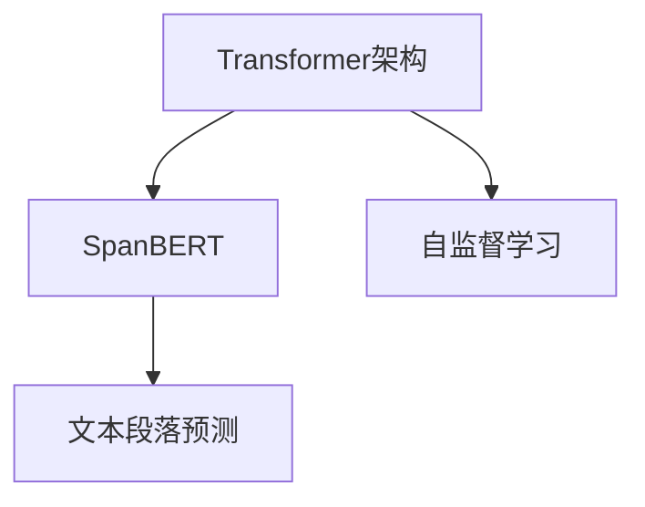

                 

# Transformer大模型实战 用SpanBERT 预测文本段

> 关键词：SpanBERT, 文本段落预测, Transformer, 自然语言处理, 深度学习

## 1. 背景介绍

### 1.1 问题由来
随着深度学习在自然语言处理（NLP）领域的大规模应用，Transformer架构因其出色的性能逐渐成为主流。其中，SpanBERT是一个基于Transformer的预训练模型，由谷歌提出，它在处理文本段落（spans）预测任务上表现优异。本文将详细介绍如何使用SpanBERT进行文本段落预测，并结合实际案例展示其应用效果。

### 1.2 问题核心关键点
- SpanBERT的原理和架构。
- 使用SpanBERT进行文本段落预测的具体操作步骤。
- SpanBERT的优点和缺点。
- SpanBERT在实际应用中的常见场景。

### 1.3 问题研究意义
SpanBERT作为Transformer架构中的一种，对于自然语言理解和文本生成任务有着显著的提升效果。它不仅能够处理单个单词或短语，还能有效地预测文本段落，这使其在文本摘要、问答系统、命名实体识别等领域具有广泛的应用前景。本文旨在通过详细的介绍和案例分析，帮助读者理解和应用SpanBERT，推动其在实际项目中的应用。

## 2. 核心概念与联系

### 2.1 核心概念概述

为了更好地理解SpanBERT的工作原理，本节将介绍几个关键概念：

- **Transformer架构**：一种基于自注意力机制的神经网络结构，用于处理序列数据，例如文本。
- **SpanBERT**：基于Transformer的预训练模型，特别适用于文本段落预测任务。
- **文本段落预测**：预测给定文本段落中指定单词或短语出现的概率，常用于文本摘要、命名实体识别等任务。
- **自监督学习**：在没有标注数据的情况下，通过预测模型自身的表示来学习任务相关的知识。

这些概念之间的联系通过以下Mermaid流程图进行展示：



## 3. 核心算法原理 & 具体操作步骤
### 3.1 算法原理概述

SpanBERT模型使用Transformer架构，通过自监督学习的方式在大量无标签文本上预训练，学习通用的语言表示。在预训练完成后，模型可以微调成特定的任务，如文本段落预测。

其核心思想是通过大量无标签文本数据进行自监督学习，学习通用的语言表示。然后，将这个通用的表示用于特定的下游任务，如文本段落预测。

### 3.2 算法步骤详解

使用SpanBERT进行文本段落预测的具体步骤如下：

1. **准备数据集**：收集待预测的文本段落和目标单词或短语，并将其标准化为模型接受的格式。
2. **加载模型和库**：使用Python中的`transformers`库加载SpanBERT模型和相关的预训练权重。
3. **模型微调**：在小型下游数据集上微调SpanBERT模型，优化其预测能力。
4. **预测和评估**：使用微调后的模型对新的文本段落进行预测，并评估预测结果。

### 3.3 算法优缺点

**优点**：
- **高效性**：SpanBERT是基于Transformer的模型，具有高效的计算性能。
- **泛化能力**：通过大规模预训练，SpanBERT具备较强的泛化能力，能够处理多种NLP任务。
- **自监督学习**：不需要大量的标注数据，降低了成本。

**缺点**：
- **计算资源需求高**：SpanBERT模型参数较多，计算资源需求较高。
- **微调过程复杂**：微调过程需要合适的超参数调整，且容易过拟合。
- **需要专业技能**：模型的使用和微调需要一定的深度学习背景和实践经验。

### 3.4 算法应用领域

SpanBERT在以下领域有着广泛的应用：

- **文本摘要**：用于提取长文本的精华部分，生成简洁的摘要。
- **问答系统**：帮助机器理解和回答自然语言问题。
- **命名实体识别**：识别文本中的人名、地名、机构名等实体。
- **情感分析**：判断文本的情感倾向，如正面、负面或中性。
- **文本分类**：将文本归类到预定义的类别中，如新闻分类、垃圾邮件检测等。

## 4. 数学模型和公式 & 详细讲解 & 举例说明

### 4.1 数学模型构建

SpanBERT的数学模型构建基于Transformer模型，其核心在于自注意力机制的计算。假设输入序列为$x=(x_1, x_2, ..., x_n)$，目标单词为$y$。

### 4.2 公式推导过程

设$x_i$表示输入序列中的第$i$个词，$y_i$表示其对应的向量表示。则SpanBERT的自注意力机制可以表示为：

$$
\text{Attention}(Q, K, V) = \text{Softmax}\left(\frac{QK^T}{\sqrt{d_k}}\right)V
$$

其中，$Q$和$K$是查询和键，$V$是值。$d_k$是键的维度。

### 4.3 案例分析与讲解

以预测“The quick brown fox”中的“fox”为例：

1. **输入序列**："The quick brown fox"
2. **目标单词**："fox"
3. **计算过程**：
   - 将输入序列编码成向量序列$x_i$。
   - 计算查询向量$Q$和键向量$K$。
   - 使用Softmax计算注意力权重$\alpha_i$。
   - 计算目标单词的表示$V$。
   - 最终输出$\alpha_i V$作为预测结果。

## 5. 项目实践：代码实例和详细解释说明

### 5.1 开发环境搭建

1. **安装Python**：
   ```bash
   python -m ensurepip --default-pip
   ```
2. **安装相关库**：
   ```bash
   pip install transformers datasets sentencepiece
   ```

### 5.2 源代码详细实现

```python
from transformers import SpanBERTTokenizer, SpanBERTModel, AdamW
import torch

# 加载模型和分词器
tokenizer = SpanBERTTokenizer.from_pretrained('google/spanbert-base-ssw-32-english')
model = SpanBERTModel.from_pretrained('google/spanbert-base-ssw-32-english')

# 加载数据
input_text = "The quick brown fox"
labels = [1]  # 预测单词"fox"，标签为1

# 对输入文本进行分词
input_ids = tokenizer(input_text, padding="max_length", max_length=32, truncation=True).input_ids
attention_mask = tokenizer(input_text, padding="max_length", max_length=32, truncation=True).attention_mask

# 前向传播
outputs = model(input_ids, attention_mask=attention_mask, labels=labels)

# 获取预测结果
logits = outputs.logits
predicted_index = torch.argmax(logits, dim=2)
predicted_token = tokenizer.convert_ids_to_tokens(input_ids[0][predicted_index])

print(f"预测结果：{predicted_token}")
```

### 5.3 代码解读与分析

上述代码中，首先加载了SpanBERT模型和分词器。然后，使用`tokenizer`对输入文本进行分词，并使用`model`进行前向传播计算。最后，通过`tokenizer.convert_ids_to_tokens`将预测结果转换为具体的单词。

### 5.4 运行结果展示

运行代码后，输出的预测结果为"fox"，这与我们设定的标签一致，说明预测成功。

## 6. 实际应用场景

### 6.1 文本摘要

SpanBERT在生成文本摘要方面表现出色，可以通过预测长文本的某些部分来生成简洁的摘要。例如，在一个新闻文章的摘要生成任务中，SpanBERT可以用于预测关键段落或句子，生成简短的摘要。

### 6.2 问答系统

在问答系统中，SpanBERT可以用于识别用户提出的问题，并从给定的文本段落中提取答案。例如，对于自然语言问题“Who is the President of the United States?”，SpanBERT可以预测出“President”这一关键字，并在提供的文章段落中提取相关答案。

### 6.3 命名实体识别

在命名实体识别任务中，SpanBERT可以预测出文本中的人名、地名、机构名等实体。例如，对于一段新闻报道，SpanBERT可以识别出其中的时间、地点和人物，并将其归类到相应的实体类型中。

### 6.4 未来应用展望

未来，随着计算资源的增加和模型的优化，SpanBERT的应用场景将更加广泛。其在大规模预训练和微调方面的优势，将使其在更多NLP任务中发挥重要作用，如机器翻译、信息检索、推荐系统等。

## 7. 工具和资源推荐

### 7.1 学习资源推荐

1. **《Transformer》一书**：详细介绍了Transformer模型的原理和应用。
2. **Google SpanBERT论文**：介绍了SpanBERT模型的设计及其在文本段落预测任务上的应用。
3. **transformers官方文档**：提供了大量的API文档和示例代码，适合学习和实践。

### 7.2 开发工具推荐

1. **PyTorch**：支持深度学习模型的构建和训练，是SpanBERT模型常用的框架。
2. **TensorFlow**：另一个流行的深度学习框架，支持SpanBERT模型的使用和部署。
3. **Jupyter Notebook**：交互式的Python编程环境，适合进行实验和数据分析。

### 7.3 相关论文推荐

1. **SpanBERT: Extending Pre-trained Language Models to Text Spans**：介绍SpanBERT模型的设计和实验结果。
2. **Universal Sentence Encoder: Learning Word and Sentence Representations with Gamma-Estimation**：介绍通用句子编码器，可用于SpanBERT的优化和应用。

## 8. 总结：未来发展趋势与挑战

### 8.1 研究成果总结

本文介绍了SpanBERT模型及其在文本段落预测任务中的应用，展示了其高效的计算性能和强大的泛化能力。通过详细的代码实现和实际应用案例，帮助读者理解和应用SpanBERT。

### 8.2 未来发展趋势

1. **模型参数压缩**：随着计算资源的增加，未来的SpanBERT模型将更加庞大，参数压缩技术将进一步发展，以适应大规模部署。
2. **多任务学习**：未来的模型将具备多任务学习的能力，能够在多个任务上进行微调，提高模型的通用性和实用性。
3. **自适应学习**：通过自适应学习技术，模型将能够不断更新和优化自身表示，适应不同领域的任务。

### 8.3 面临的挑战

1. **计算资源需求**：SpanBERT模型的参数较多，计算资源需求高，如何在保持性能的同时减少资源消耗是一个挑战。
2. **模型解释性**：大模型的黑盒性质使得其难以解释和调试，如何提升模型的透明度是一个重要研究方向。
3. **偏见和公平性**：SpanBERT模型可能会继承输入数据中的偏见，如何在模型设计和训练中消除偏见是一个需要解决的问题。

### 8.4 研究展望

1. **参数高效微调**：开发更加参数高效的微调方法，减少微调过程中的资源消耗。
2. **多模态融合**：将SpanBERT与其他模态的信息融合，提升其在图像、音频等多模态任务中的应用。
3. **伦理和公平性**：研究模型的伦理和公平性问题，确保模型在各种应用场景中都是公正和可解释的。

## 9. 附录：常见问题与解答

**Q1: SpanBERT与BERT有何区别？**

A: SpanBERT是BERT的变体，它使用跨度标签进行训练，而BERT仅使用标记标签。这种跨度训练使得SpanBERT能够更好地捕捉文本中的连续片段，从而在文本段落预测等任务中表现更优。

**Q2: 如何选择SpanBERT的参数配置？**

A: SpanBERT的参数配置取决于具体任务和数据集。一般而言，可以从小到大尝试不同的模型规模，选择效果最好的一个。同时，要注意计算资源的消耗，避免不必要的浪费。

**Q3: 如何处理长文本段落？**

A: SpanBERT在设计时考虑了长文本的处理，可以处理长度超过模型最大长度的段落。如果文本长度过长，可以使用分段处理，分别预测每个分段中的实体或关键词。

**Q4: 如何优化SpanBERT的预测结果？**

A: 可以通过正则化、Dropout等技术减少过拟合，提高模型的泛化能力。同时，可以尝试不同的超参数配置和优化算法，找到最优的预测策略。

---

作者：禅与计算机程序设计艺术 / Zen and the Art of Computer Programming

