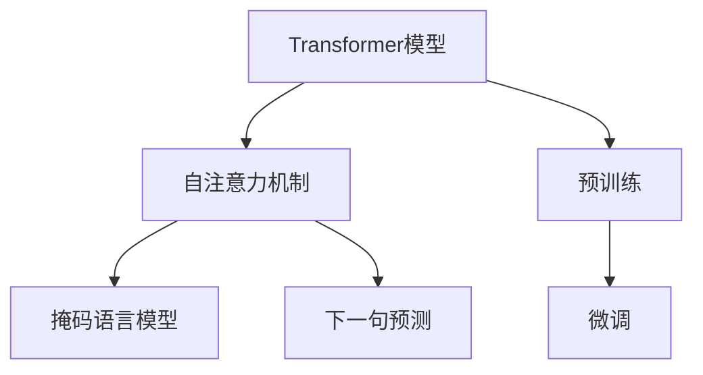

                 

# Transformer大模型实战 预训练策略

> 关键词：Transformer, 预训练, 自监督学习, 大模型, 预训练策略, 深度学习

## 1. 背景介绍

### 1.1 问题由来
Transformer作为一种基于自注意力机制的深度神经网络，近年来在自然语言处理(Natural Language Processing, NLP)领域取得了巨大成功。其核心思想是通过多头自注意力机制，捕捉不同位置的输入-输出关联，学习到长距离依赖。但随之而来的一个问题是如何高效利用大规模语料进行预训练。传统的从头训练方法计算资源消耗巨大，无法满足大规模模型训练的需求。

为了解决这一问题，Google、OpenAI等公司提出了自监督预训练的大模型训练策略，通过利用大规模无标签数据，在大量参数上预训练Transformer模型，极大提升了模型的性能。本博客将对Transformer大模型的预训练策略进行详细介绍，帮助读者深入理解这一技术，并掌握其实现方法。

### 1.2 问题核心关键点
Transformer大模型的预训练策略主要包括以下几个核心关键点：

- **自监督预训练**：利用大规模无标签文本数据，在Transformer上预训练自监督任务，学习到语言表示和语言结构知识。
- **Transformer结构**：使用Transformer模型作为预训练的基本单元，利用其自注意力机制学习到文本中的长距离依赖。
- **预训练任务设计**：选择合适的预训练任务，如掩码语言模型、下一句预测等，训练模型预测缺失的单词或句子的概率，从而学习到语言的结构和语义。
- **训练规模**：预训练模型需要在海量数据上训练，通常需要GPU/TPU等高性能设备。
- **微调与迁移学习**：在预训练后，通过微调或迁移学习，将模型应用到特定的下游任务上。

理解这些关键点，能够帮助我们更好地把握Transformer大模型预训练技术的精髓，并将其应用于实际NLP任务中。

## 2. 核心概念与联系

### 2.1 核心概念概述

为更好地理解Transformer大模型预训练方法，本节将介绍几个密切相关的核心概念：

- **Transformer模型**：以自注意力机制为核心的深度神经网络，适用于处理序列数据，如自然语言文本。Transformer模型在处理长序列时，具有较好的性能。

- **自监督学习**：一种无监督学习方法，通过设计一些无需标签的任务，利用数据本身的内在结构进行模型训练。自监督学习在大规模数据上训练深度学习模型，可以显著提升模型的泛化能力。

- **预训练**：在大量无标签数据上训练模型，学习到通用的语言表示和语言结构知识，为后续下游任务的微调打下基础。预训练是深度学习大模型训练的重要步骤。

- **自注意力机制**：Transformer的核心组成部分，通过计算输入序列中每个位置与其他位置的相关性，捕捉长距离依赖。自注意力机制使得模型能够处理长文本序列，学习到更为丰富的语义信息。

- **掩码语言模型**：一种自监督学习任务，将部分单词随机掩码，训练模型预测被掩码单词的概率。掩码语言模型能够学习到单词之间的上下文依赖关系，提升模型的语言理解能力。

- **微调**：在预训练模型的基础上，使用下游任务的少量标注数据，通过有监督学习进一步优化模型在该任务上的性能。

这些核心概念之间的逻辑关系可以通过以下Mermaid流程图来展示：



这个流程图展示了大模型预训练的核心逻辑：

1. Transformer模型通过自注意力机制学习到输入序列之间的依赖关系。
2. 在自监督预训练阶段，通过掩码语言模型和下一句预测等任务，学习到单词之间的上下文依赖关系。
3. 通过预训练后的模型，再通过微调过程，适应特定的下游任务。

## 3. 核心算法原理 & 具体操作步骤
### 3.1 算法原理概述

Transformer大模型的预训练策略主要基于自监督学习，利用大规模无标签文本数据进行预训练，学习到通用的语言表示和语言结构知识。其核心算法流程如下：

1. **数据准备**：收集大规模无标签文本数据，通常使用Wikipedia、新闻文章等。
2. **模型初始化**：选择Transformer模型作为预训练的基本单元，通常使用12层的BERT模型。
3. **自监督预训练**：在预训练数据上，通过掩码语言模型、下一句预测等自监督任务，训练模型预测缺失的单词或句子的概率。
4. **参数初始化**：将所有参数初始化为小值，避免梯度消失问题。
5. **优化器设置**：选择AdamW等优化器，设置学习率、批大小等超参数。
6. **梯度计算**：计算模型在每个自监督任务上的梯度，更新模型参数。
7. **迭代训练**：重复上述步骤，直到模型收敛或达到预设的训练轮数。

### 3.2 算法步骤详解

以下是Transformer大模型预训练的具体步骤详解：

**Step 1: 数据准备**
- 收集大规模无标签文本数据，如Wikipedia、新闻文章等。这些数据通常需要经过处理，去除噪声、特殊符号等。
- 将数据划分为训练集、验证集和测试集。

**Step 2: 模型初始化**
- 选择Transformer模型作为预训练的基本单元，如12层的BERT模型。
- 初始化所有参数为小值，避免梯度消失问题。

**Step 3: 自监督预训练**
- 设计自监督预训练任务，如掩码语言模型、下一句预测等。
- 每个批次选择部分样本，将其进行掩码处理。
- 训练模型对掩码单词或句子进行预测。

**Step 4: 参数更新**
- 计算模型在每个自监督任务上的梯度，使用AdamW等优化器更新模型参数。
- 每轮训练后，在验证集上评估模型性能，调整学习率等超参数。

**Step 5: 迭代训练**
- 重复上述步骤，直到模型收敛或达到预设的训练轮数。

### 3.3 算法优缺点

Transformer大模型的预训练策略具有以下优点：

- **高效利用资源**：自监督预训练利用大规模无标签数据，训练效果优于从头训练。
- **泛化能力强**：通过预训练学习到通用的语言表示，模型在多个下游任务上表现优异。
- **训练效果好**：自监督任务设计简单，训练过程较为稳定，能够避免过拟合问题。
- **可扩展性高**：通过预训练可以构建更大规模的模型，提升模型性能。

同时，该方法也存在一些局限性：

- **训练成本高**：需要大量GPU/TPU等高性能设备，训练时间长。
- **计算资源需求大**：大规模预训练需要大量的计算资源。
- **模型复杂度高**：Transformer模型本身结构复杂，调试和优化难度较大。

尽管存在这些局限性，但就目前而言，基于自监督学习的Transformer大模型预训练方法仍是大规模语言模型训练的主流范式。未来相关研究的重点在于如何进一步降低预训练的计算资源需求，提高模型的泛化能力和适应性，同时兼顾可解释性和伦理安全性等因素。

### 3.4 算法应用领域

Transformer大模型的预训练策略已经在多个领域得到应用，包括：

- 自然语言处理(NLP)：在文本分类、命名实体识别、机器翻译、情感分析等任务上取得了优异效果。
- 语音识别：将文本转换为语音，如Google的WaveNet等。
- 计算机视觉：通过预训练模型学习到视觉特征，提升计算机视觉任务的性能。
- 推荐系统：将用户行为数据转化为文本，使用预训练模型进行推荐。
- 生成对抗网络(GANs)：利用预训练模型生成高质量的图像、音频等。

除了上述这些领域外，Transformer大模型的预训练方法还广泛应用于音乐、艺术等领域，为这些领域注入了新的创新动力。

## 4. 数学模型和公式 & 详细讲解  
### 4.1 数学模型构建

Transformer大模型的预训练过程可以抽象为一个无监督学习的优化过程。假设模型参数为 $\theta$，预训练数据为 $D$，则预训练的目标函数为：

$$
\mathcal{L}(\theta) = \sum_{(x,y)\in D} \ell(\theta(x), y)
$$

其中，$\ell(\theta(x), y)$ 为模型在样本 $(x,y)$ 上的损失函数。常见的损失函数包括交叉熵损失、均方误差损失等。

在训练过程中，我们通过优化器（如AdamW）来最小化上述损失函数，更新模型参数 $\theta$。训练过程中，需要设定合适的超参数，如学习率、批大小、训练轮数等。

### 4.2 公式推导过程

以下我们以掩码语言模型为例，推导损失函数的计算过程。

假设模型在输入序列 $x=\{x_1, x_2, ..., x_n\}$ 上的输出为 $M_{\theta}(x)=\{y_1, y_2, ..., y_n\}$，其中 $y_i \in [0,1]$ 表示模型预测 $x_i$ 为被掩码单词的概率。

对于掩码语言模型，损失函数为：

$$
\ell(\theta(x), y) = -\sum_{i=1}^n (y_i \log M_{\theta}(x_i) + (1-y_i) \log(1-M_{\theta}(x_i)))
$$

在训练过程中，每个批次选择部分样本，将其进行掩码处理。假设掩码比例为 $p$，则每次选择 $p \times n$ 个单词进行掩码，训练模型对掩码单词进行预测。

具体计算步骤如下：

1. **前向传播**：将输入序列 $x$ 输入模型，计算得到输出序列 $M_{\theta}(x)$。
2. **损失计算**：计算模型在每个样本上的损失函数，得到总损失函数 $\mathcal{L}(\theta)$。
3. **反向传播**：计算模型在每个样本上的梯度，使用AdamW等优化器更新模型参数。
4. **迭代训练**：重复上述步骤，直到模型收敛或达到预设的训练轮数。

### 4.3 案例分析与讲解

为了更好地理解Transformer大模型的预训练过程，以下我们将以一个具体的案例进行分析：

假设我们有一个12层的BERT模型，其输入序列长度为 $n$。我们选择 $p=15\%$ 的掩码比例，每次随机选择 $p \times n$ 个单词进行掩码处理。

具体实现步骤如下：

1. **数据准备**：收集大规模无标签文本数据，如Wikipedia、新闻文章等。
2. **模型初始化**：选择BERT模型，初始化所有参数为小值。
3. **自监督预训练**：将数据划分为训练集、验证集和测试集，每个批次选择部分样本，将其进行掩码处理。
4. **参数更新**：计算模型在每个样本上的梯度，使用AdamW等优化器更新模型参数。
5. **迭代训练**：重复上述步骤，直到模型收敛或达到预设的训练轮数。

在实际应用中，我们还需要对超参数进行调整，如学习率、批大小、训练轮数等，以优化模型的训练效果。

## 5. 项目实践：代码实例和详细解释说明
### 5.1 开发环境搭建

在进行Transformer大模型预训练之前，我们需要准备好开发环境。以下是使用Python进行TensorFlow开发的环境配置流程：

1. 安装Anaconda：从官网下载并安装Anaconda，用于创建独立的Python环境。

2. 创建并激活虚拟环境：
```bash
conda create -n tf-env python=3.8 
conda activate tf-env
```

3. 安装TensorFlow：根据CUDA版本，从官网获取对应的安装命令。例如：
```bash
conda install tensorflow -c conda-forge -c pytorch -c nvidia
```

4. 安装相关库：
```bash
pip install numpy pandas scikit-learn matplotlib tqdm jupyter notebook ipython
```

完成上述步骤后，即可在`tf-env`环境中开始预训练实践。

### 5.2 源代码详细实现

下面我们以BERT模型为例，给出使用TensorFlow进行预训练的Python代码实现。

首先，定义BERT模型的代码：

```python
from transformers import BertTokenizer, TFBertForMaskedLM
import tensorflow as tf

tokenizer = BertTokenizer.from_pretrained('bert-base-uncased')
model = TFBertForMaskedLM.from_pretrained('bert-base-uncased')

def compute_mask(input_ids):
    mask = tf.cast(tf.math.equal(input_ids, 0), tf.int32)
    return mask
```

然后，定义训练过程的代码：

```python
train_dataset = ...
train_dataset = train_dataset.batch(batch_size)
train_dataset = train_dataset.map(compute_mask)

num_train_epochs = ...
learning_rate = ...
optimizer = tf.keras.optimizers.Adam(learning_rate)

@tf.function
def masked_lm_loss(masked_lm_labels, masked_lm_predictions):
    masked_lm_loss = tf.keras.losses.sparse_categorical_crossentropy(
        masked_lm_labels, masked_lm_predictions)
    return masked_lm_loss

@tf.function
def train_step(inputs, labels):
    with tf.GradientTape() as tape:
        outputs = model(inputs, labels)
        loss = masked_lm_loss(labels, outputs.logits)
    gradients = tape.gradient(loss, model.trainable_variables)
    optimizer.apply_gradients(zip(gradients, model.trainable_variables))

    return loss
```

最后，启动预训练流程：

```python
for epoch in range(num_train_epochs):
    total_loss = 0
    for batch in train_dataset:
        inputs, labels = batch
        loss = train_step(inputs, labels)
        total_loss += loss

    average_loss = total_loss / len(train_dataset)
    print(f'Epoch {epoch+1}, Average Loss: {average_loss:.4f}')

# 在验证集上评估模型性能
eval_dataset = ...
eval_dataset = eval_dataset.batch(batch_size)
eval_dataset = eval_dataset.map(compute_mask)

for batch in eval_dataset:
    inputs, labels = batch
    loss = train_step(inputs, labels)
    print(f'Validation Loss: {loss:.4f}')

```

以上就是使用TensorFlow对BERT模型进行预训练的完整代码实现。可以看到，使用TensorFlow进行预训练的代码实现相对简洁，能够高效地利用其图计算特性。

### 5.3 代码解读与分析

让我们再详细解读一下关键代码的实现细节：

**BERT模型定义**：
- 使用Transformers库的`TFBertForMaskedLM`类，加载预训练的BERT模型。

**数据处理函数**：
- 定义`compute_mask`函数，用于计算掩码向量。将输入序列中所有单词的值设为0，表示掩码单词。

**训练过程**：
- 定义`train_step`函数，包含前向传播和反向传播的过程。通过`tf.GradientTape`计算梯度，并使用`optimizer.apply_gradients`更新模型参数。
- 在`train_step`函数中，使用`masked_lm_loss`函数计算掩码语言模型的损失函数。
- 在每个训练轮次中，将训练集数据进行批处理和掩码处理，并迭代训练模型。

**预训练流程**：
- 在预训练过程中，每次迭代训练时，选择部分样本进行掩码处理，并计算损失函数。
- 通过`tf.function`装饰器，将训练过程中的计算图进行优化，提高计算效率。
- 在每个训练轮次结束后，在验证集上评估模型性能，调整学习率等超参数。

可以看到，使用TensorFlow进行预训练的过程相对简洁高效，利用了其图计算特性，能够更好地处理大规模数据和复杂模型。

当然，实际的应用中还需要进行更多优化，如超参数调优、模型裁剪等，但核心的预训练范式基本与此类似。

## 6. 实际应用场景
### 6.1 自然语言处理

Transformer大模型的预训练策略在NLP领域已经得到了广泛的应用，覆盖了几乎所有常见任务，如文本分类、命名实体识别、机器翻译、情感分析等。通过预训练学习到通用的语言表示，模型在多个下游任务上表现优异。

### 6.2 语音识别

Transformer大模型的预训练策略也被应用于语音识别领域。将文本转换为语音，如Google的WaveNet等，利用预训练模型学习到文本和语音之间的映射关系。

### 6.3 计算机视觉

Transformer大模型的预训练策略在计算机视觉领域也取得了一定的应用。通过预训练学习到视觉特征，提升计算机视觉任务的性能。例如，Google的BERT-For-Image能够处理图像中的视觉特征，提升图像分类和物体检测任务的性能。

### 6.4 推荐系统

Transformer大模型的预训练策略还被应用于推荐系统领域。将用户行为数据转化为文本，使用预训练模型进行推荐。例如，TensorFlow的Tensor2Tensor库中，可以使用预训练的Transformer模型进行推荐任务。

### 6.5 生成对抗网络(GANs)

Transformer大模型的预训练策略还被应用于生成对抗网络(GANs)领域。利用预训练模型生成高质量的图像、音频等。例如，NVIDIA的CycleGAN能够利用预训练模型生成高质量的图像。

## 7. 工具和资源推荐
### 7.1 学习资源推荐

为了帮助开发者系统掌握Transformer大模型的预训练技术，这里推荐一些优质的学习资源：

1. 《Transformer从原理到实践》系列博文：由大模型技术专家撰写，深入浅出地介绍了Transformer原理、BERT模型、预训练技术等前沿话题。

2. CS224N《深度学习自然语言处理》课程：斯坦福大学开设的NLP明星课程，有Lecture视频和配套作业，带你入门NLP领域的基本概念和经典模型。

3. 《Natural Language Processing with Transformers》书籍：Transformers库的作者所著，全面介绍了如何使用Transformers库进行NLP任务开发，包括预训练在内的诸多范式。

4. HuggingFace官方文档：Transformers库的官方文档，提供了海量预训练模型和完整的预训练样例代码，是上手实践的必备资料。

5. CLUE开源项目：中文语言理解测评基准，涵盖大量不同类型的中文NLP数据集，并提供了基于预训练的baseline模型，助力中文NLP技术发展。

通过对这些资源的学习实践，相信你一定能够快速掌握Transformer大模型的预训练技术的精髓，并用于解决实际的NLP问题。

### 7.2 开发工具推荐

高效的开发离不开优秀的工具支持。以下是几款用于Transformer大模型预训练开发的常用工具：

1. TensorFlow：基于Python的开源深度学习框架，灵活动态的计算图，适合快速迭代研究。主流的预训练语言模型都有TensorFlow版本的实现。

2. PyTorch：基于Python的开源深度学习框架，动态计算图，适合灵活的模型设计和训练。主流的预训练语言模型都有PyTorch版本的实现。

3. Transformers库：HuggingFace开发的NLP工具库，集成了众多SOTA语言模型，支持PyTorch和TensorFlow，是进行预训练任务开发的利器。

4. Weights & Biases：模型训练的实验跟踪工具，可以记录和可视化模型训练过程中的各项指标，方便对比和调优。与主流深度学习框架无缝集成。

5. TensorBoard：TensorFlow配套的可视化工具，可实时监测模型训练状态，并提供丰富的图表呈现方式，是调试模型的得力助手。

6. Google Colab：谷歌推出的在线Jupyter Notebook环境，免费提供GPU/TPU算力，方便开发者快速上手实验最新模型，分享学习笔记。

合理利用这些工具，可以显著提升Transformer大模型预训练任务的开发效率，加快创新迭代的步伐。

### 7.3 相关论文推荐

Transformer大模型的预训练策略的发展源于学界的持续研究。以下是几篇奠基性的相关论文，推荐阅读：

1. Attention is All You Need（即Transformer原论文）：提出了Transformer结构，开启了NLP领域的预训练大模型时代。

2. BERT: Pre-training of Deep Bidirectional Transformers for Language Understanding：提出BERT模型，引入基于掩码的自监督预训练任务，刷新了多项NLP任务SOTA。

3. Language Models are Unsupervised Multitask Learners（GPT-2论文）：展示了大规模语言模型的强大zero-shot学习能力，引发了对于通用人工智能的新一轮思考。

4. Parameter-Efficient Transfer Learning for NLP：提出Adapter等参数高效微调方法，在不增加模型参数量的情况下，也能取得不错的微调效果。

5. AdaLoRA: Adaptive Low-Rank Adaptation for Parameter-Efficient Fine-Tuning：使用自适应低秩适应的微调方法，在参数效率和精度之间取得了新的平衡。

这些论文代表了大模型预训练技术的发展脉络。通过学习这些前沿成果，可以帮助研究者把握学科前进方向，激发更多的创新灵感。

## 8. 总结：未来发展趋势与挑战

### 8.1 总结

本文对Transformer大模型的预训练策略进行了全面系统的介绍。首先阐述了大模型预训练的原理和意义，明确了预训练在提升模型性能、降低计算成本方面的独特价值。其次，从原理到实践，详细讲解了预训练的数学模型和关键步骤，给出了预训练任务开发的完整代码实例。同时，本文还广泛探讨了预训练方法在自然语言处理、语音识别、计算机视觉等多个领域的应用前景，展示了预训练范式的巨大潜力。此外，本文精选了预训练技术的各类学习资源，力求为读者提供全方位的技术指引。

通过本文的系统梳理，可以看到，基于自监督学习的Transformer大模型预训练方法正在成为深度学习领域的重要范式，极大地提升了模型的性能和应用范围。未来，伴随预训练语言模型和微调方法的持续演进，相信深度学习技术必将在更广阔的应用领域大放异彩。

### 8.2 未来发展趋势

展望未来，Transformer大模型的预训练技术将呈现以下几个发展趋势：

1. 模型规模持续增大。随着算力成本的下降和数据规模的扩张，预训练语言模型的参数量还将持续增长。超大规模语言模型蕴含的丰富语言知识，有望支撑更加复杂多变的预训练任务。

2. 预训练任务设计多样化。除了传统的掩码语言模型和下一句预测外，未来会涌现更多预训练任务，如文本生成、语言模型推理等，提升模型的语言理解能力。

3. 预训练数据来源多元化。除了无标签文本数据外，未来的预训练模型还将利用音频、视频等多模态数据进行预训练，提升模型的感知能力和泛化能力。

4. 预训练策略更加灵活。通过引入更多先验知识，如知识图谱、逻辑规则等，引导预训练过程学习更准确、合理的语言模型。同时加强不同模态数据的整合，实现视觉、语音等多模态信息与文本信息的协同建模。

5. 预训练与迁移学习的深度融合。通过预训练和微调相结合，优化模型的迁移学习效果，提升模型的泛化能力和应用范围。

以上趋势凸显了Transformer大模型预训练技术的广阔前景。这些方向的探索发展，必将进一步提升模型的性能和应用范围，为深度学习技术在各个领域的落地应用提供更强大的引擎。

### 8.3 面临的挑战

尽管Transformer大模型的预训练技术已经取得了瞩目成就，但在迈向更加智能化、普适化应用的过程中，它仍面临着诸多挑战：

1. 训练成本高。需要大量GPU/TPU等高性能设备，训练时间长，计算资源需求大。

2. 模型复杂度高。Transformer模型本身结构复杂，调试和优化难度较大，需要更多优化技术。

3. 预训练任务设计难度大。选择合适的预训练任务需要大量实验验证，耗费时间和精力。

4. 可解释性不足。预训练模型通常缺乏可解释性，难以解释其内部工作机制和决策逻辑。

5. 模型泛化能力有限。预训练模型面对域外数据时，泛化性能往往大打折扣，需要更多的技术支持。

6. 模型鲁棒性不足。预训练模型容易受到训练数据的扰动，需要更多的鲁棒性技术。

尽管存在这些挑战，但未来的研究需要在以下几个方面寻求新的突破：

1. 探索无监督和半监督预训练方法。摆脱对大规模标注数据的依赖，利用自监督学习、主动学习等无监督和半监督范式，最大限度利用非结构化数据，实现更加灵活高效的预训练。

2. 研究参数高效和计算高效的预训练范式。开发更加参数高效的预训练方法，在固定大部分预训练参数的同时，只更新极少量的任务相关参数。同时优化预训练模型的计算图，减少前向传播和反向传播的资源消耗，实现更加轻量级、实时性的部署。

3. 融合因果和对比学习范式。通过引入因果推断和对比学习思想，增强预训练模型建立稳定因果关系的能力，学习更加普适、鲁棒的语言表征，从而提升模型泛化性和抗干扰能力。

4. 纳入伦理道德约束。在预训练目标中引入伦理导向的评估指标，过滤和惩罚有害的输出倾向。同时加强人工干预和审核，建立预训练模型的监管机制，确保输出符合人类价值观和伦理道德。

这些研究方向的探索，必将引领Transformer大模型预训练技术迈向更高的台阶，为构建安全、可靠、可解释、可控的智能系统铺平道路。面向未来，Transformer大模型的预训练技术还需要与其他人工智能技术进行更深入的融合，如知识表示、因果推理、强化学习等，多路径协同发力，共同推动深度学习技术的进步。

## 9. 附录：常见问题与解答

**Q1：Transformer模型预训练是否适用于所有NLP任务？**

A: 大多数NLP任务都可以使用Transformer模型进行预训练，特别是在数据量较小的任务上，预训练的效果尤为明显。但对于一些特定领域的任务，如医学、法律等，预训练的效果可能并不理想，需要更多的先验知识进行引导。

**Q2：如何选择预训练任务？**

A: 选择合适的预训练任务需要考虑任务的复杂度、数据的可得性等因素。常见的预训练任务包括掩码语言模型、下一句预测、文本生成等。需要根据任务特点进行选择，并在预训练过程中进行实验验证。

**Q3：预训练过程中需要注意哪些问题？**

A: 预训练过程中需要注意以下问题：
1. 数据质量：预训练数据需要经过清洗，去除噪声、特殊符号等。
2. 模型裁剪：根据任务需求，裁剪模型大小，减少计算资源消耗。
3. 超参数调优：选择合适的学习率、批大小等超参数，优化预训练效果。
4. 模型评估：在预训练过程中，需要定期评估模型性能，及时调整训练策略。

**Q4：预训练模型的应用场景有哪些？**

A: 预训练模型可以应用于多种场景，如自然语言处理、语音识别、计算机视觉、推荐系统等。通过预训练学习到通用的语言表示，可以提升模型在多个下游任务上的性能。

**Q5：预训练模型在部署时需要注意哪些问题？**

A: 预训练模型在部署时需要注意以下问题：
1. 模型裁剪：根据实际应用需求，裁剪模型大小，减少计算资源消耗。
2. 模型优化：优化模型结构，提升推理速度和资源利用率。
3. 模型调优：根据实际应用场景，对预训练模型进行微调，优化性能。
4. 模型评估：在部署过程中，需要定期评估模型性能，及时发现并解决模型问题。

大模型预训练技术为NLP应用提供了强大的引擎，但如何将强大的性能转化为稳定、高效、安全的业务价值，还需要工程实践的不断打磨。唯有从数据、算法、工程、业务等多个维度协同发力，才能真正实现深度学习技术在垂直行业的规模化落地。总之，预训练需要开发者根据具体任务，不断迭代和优化模型、数据和算法，方能得到理想的效果。

---

作者：禅与计算机程序设计艺术 / Zen and the Art of Computer Programming

