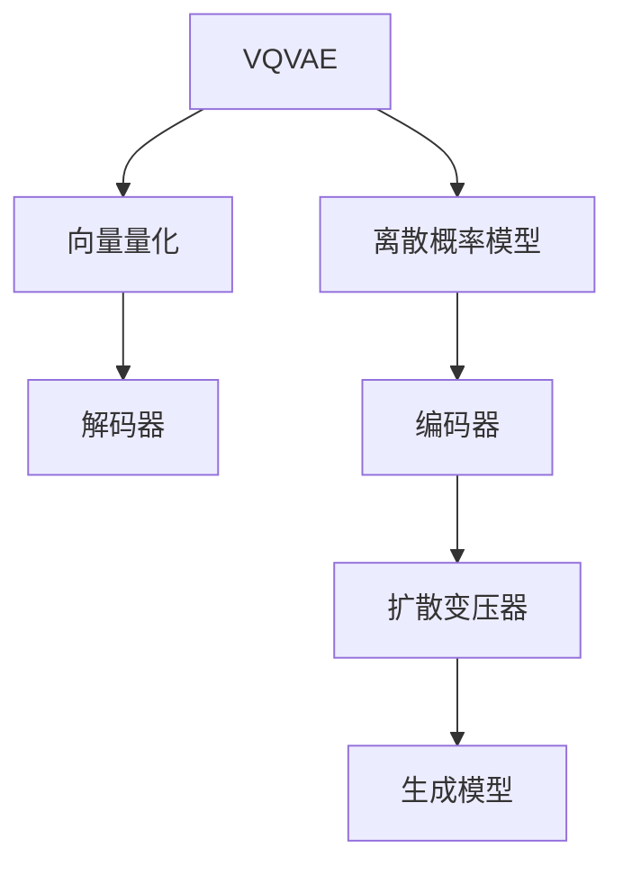

                 

# VQVAE和扩散变压器：跨模态AI的前沿技术

## 1. 背景介绍

### 1.1 问题由来
随着深度学习技术的发展，跨模态学习在计算机视觉、自然语言处理、音频处理等领域受到了越来越多的关注。跨模态学习旨在通过学习不同模态数据之间的共性，实现数据之间的共享和互用，提升模型在多模态数据上的表现能力。

其中，VQVAE（向量量化变分自动编码器）和扩散变压器（Diffusion Transformers）是近年来在这方面取得突破性进展的关键技术。VQVAE能够高效地进行跨模态数据的编码和解码，扩散变压器则通过生成模型实现了对复杂数据集的建模。

本文将详细探讨这两种技术的基本原理、应用场景及其未来发展趋势，旨在为跨模态AI的实践提供理论支持和实操指南。

## 2. 核心概念与联系

### 2.1 核心概念概述

VQVAE和扩散变压器技术在跨模态AI中扮演着重要的角色。为了更好地理解这两种技术的原理和应用，本节将简要介绍相关的核心概念：

- **VQVAE（Vector Quantized Variational Autoencoder）**：是一种变分自动编码器（VAE）的变种，通过向量量化（VQ）操作，将连续的编码器和解码器转换为离散的概率模型，从而提高编码效率，并引入多模态数据的表示。

- **扩散变压器（Diffusion Transformers）**：是一种基于自回归的生成模型，能够生成高质量的图像、音频、文本等多种模态的数据，且具有极强的泛化能力，能够处理复杂的数据集。

### 2.2 核心概念原理和架构的 Mermaid 流程图



## 3. 核心算法原理 & 具体操作步骤
### 3.1 算法原理概述

#### 3.1.1 VQVAE原理

VQVAE的核心思想是通过向量量化操作将连续的数据表示转换为离散的量化码，以减少数据维度，同时保留数据的关键特征。其主要由三个主要组件组成：

1. **编码器（Encoder）**：将输入的连续数据映射到高维的潜在空间中，生成一个向量序列 $z$。
2. **向量量化器（Vector Quantizer）**：将编码器输出的向量 $z$ 转换为离散的量化码 $z_q$。
3. **解码器（Decoder）**：将量化码 $z_q$ 解码回原始的连续数据空间。

VQVAE的目标是最小化编码-解码误差和向量量化误差，从而实现高效的跨模态数据编码和解码。

#### 3.1.2 扩散变压器原理

扩散变压器是一种基于自回归的生成模型，通过一系列噪声分布的变换和更新，逐步将噪声分布减少，最终生成高质量的样本。其核心思想是利用变分自编码器（VAE）的框架，将生成过程建模为自回归模型。

扩散变量的主要组成部分包括：

1. **噪声分布**：定义一个初始噪声分布 $p(\boldsymbol{\epsilon}_0)$，通常是标准的正态分布。
2. **自回归模型**：通过一系列的噪声变换和更新，逐步将噪声分布减少，最终生成高质量的样本。

扩散变量的训练过程分为两个步骤：

1. **学习噪声分布**：通过VAE框架训练噪声分布，使得生成过程能够更好地捕捉数据的内在结构。
2. **训练生成模型**：通过自回归模型训练生成过程，使得模型能够生成高质量的样本。

### 3.2 算法步骤详解

#### 3.2.1 VQVAE详细步骤

1. **编码器（Encoder）**：输入连续的数据 $x$，通过多层神经网络映射到高维的潜在空间 $z$。
2. **向量量化器（Vector Quantizer）**：将编码器输出的向量 $z$ 量化为离散的量化码 $z_q$。
3. **解码器（Decoder）**：将量化码 $z_q$ 解码回原始的连续数据空间，生成输出 $x'$。
4. **目标函数**：最小化编码误差 $e(x, x')$ 和向量量化误差 $e(z, z_q)$，优化编码器和解码器的参数。

#### 3.2.2 扩散变压器详细步骤

1. **定义噪声分布**：定义一个初始噪声分布 $p(\boldsymbol{\epsilon}_0)$，通常是标准的正态分布。
2. **学习噪声分布**：通过VAE框架训练噪声分布，使得生成过程能够更好地捕捉数据的内在结构。
3. **定义自回归模型**：将生成过程建模为自回归模型，逐步减少噪声分布，最终生成高质量的样本。
4. **训练生成模型**：通过自回归模型训练生成过程，使得模型能够生成高质量的样本。

### 3.3 算法优缺点

#### 3.3.1 VQVAE优缺点

**优点**：

- 能够高效地进行跨模态数据的编码和解码。
- 向量量化操作使得编码器输出更加紧凑，减少了计算复杂度。

**缺点**：

- 需要较大的存储空间来存储向量量化表。
- 向量量化过程可能引入一定的信息损失。

#### 3.3.2 扩散变压器优缺点

**优点**：

- 能够生成高质量的图像、音频、文本等多种模态的数据。
- 具有极强的泛化能力，能够处理复杂的数据集。

**缺点**：

- 训练过程较为复杂，需要较大的计算资源。
- 生成过程较为缓慢，训练和推理时间较长。

### 3.4 算法应用领域

#### 3.4.1 VQVAE应用领域

VQVAE在跨模态AI中主要用于以下领域：

- **图像与文本的跨模态学习**：将图像和文本数据进行联合编码和解码，实现图像描述生成、文本图像生成等任务。
- **音频与视觉的跨模态学习**：将音频和视觉数据进行联合编码和解码，实现语音描述生成、视频音频生成等任务。
- **跨模态数据检索**：通过向量量化操作，将不同模态的数据进行表示，实现高效的跨模态数据检索。

#### 3.4.2 扩散变压器应用领域

扩散变压器在跨模态AI中主要用于以下领域：

- **图像生成**：生成高质量的图像，用于医学图像生成、图像修复等任务。
- **文本生成**：生成高质量的文本，用于自然语言生成、文本摘要等任务。
- **音频生成**：生成高质量的音频，用于语音合成、语音情感识别等任务。

## 4. 数学模型和公式 & 详细讲解 & 举例说明

### 4.1 数学模型构建

#### 4.1.1 VQVAE数学模型

VQVAE的数学模型主要由以下公式构成：

1. **编码器（Encoder）**：输入连续的数据 $x$，通过多层神经网络映射到高维的潜在空间 $z$。

   $$
   z = f(x; \theta)
   $$

2. **向量量化器（Vector Quantizer）**：将编码器输出的向量 $z$ 量化为离散的量化码 $z_q$。

   $$
   z_q = Q(z; \phi)
   $$

   其中，$Q$ 是一个向量量化器，通过学习得到。

3. **解码器（Decoder）**：将量化码 $z_q$ 解码回原始的连续数据空间，生成输出 $x'$。

   $$
   x' = g(z_q; \theta')
   $$

4. **目标函数**：最小化编码误差 $e(x, x')$ 和向量量化误差 $e(z, z_q)$，优化编码器和解码器的参数。

   $$
   \mathcal{L} = \mathbb{E}_{x}[e(x, x')] + \mathbb{E}_{z}[e(z, z_q)]
   $$

   其中，$\mathbb{E}_{x}$ 和 $\mathbb{E}_{z}$ 分别表示对 $x$ 和 $z$ 的期望。

#### 4.1.2 扩散变压器数学模型

扩散变量的数学模型主要由以下公式构成：

1. **噪声分布**：定义一个初始噪声分布 $p(\boldsymbol{\epsilon}_0)$，通常是标准的正态分布。

   $$
   p(\boldsymbol{\epsilon}_0) = \mathcal{N}(0, I)
   $$

2. **自回归模型**：将生成过程建模为自回归模型，逐步减少噪声分布，最终生成高质量的样本。

   $$
   p(\boldsymbol{\epsilon}_t) = \sqrt{1 - \beta_t} p(\boldsymbol{\epsilon}_{t-1}) + \sqrt{\beta_t} \mathcal{N}(0, I)
   $$

   其中，$\beta_t$ 是一个时间步长的衰减系数。

3. **学习噪声分布**：通过VAE框架训练噪声分布，使得生成过程能够更好地捕捉数据的内在结构。

   $$
   p(\boldsymbol{\epsilon}_t | \boldsymbol{\epsilon}_{t-1}) = \mathcal{N}(\mu_t, \sigma_t^2)
   $$

   其中，$\mu_t$ 和 $\sigma_t^2$ 分别是时间步 $t$ 的均值和方差。

4. **训练生成模型**：通过自回归模型训练生成过程，使得模型能够生成高质量的样本。

   $$
   p(\boldsymbol{x} | \boldsymbol{\epsilon}_0) = \mathcal{N}(\boldsymbol{0}, \sigma_f^2 I)
   $$

   其中，$\sigma_f^2$ 是最终的噪声方差。

### 4.2 公式推导过程

#### 4.2.1 VQVAE公式推导

1. **编码器（Encoder）**：输入连续的数据 $x$，通过多层神经网络映射到高维的潜在空间 $z$。

   $$
   z = f(x; \theta) = W_2 \tanh(W_1 x + b_1) + b_2
   $$

2. **向量量化器（Vector Quantizer）**：将编码器输出的向量 $z$ 量化为离散的量化码 $z_q$。

   $$
   z_q = Q(z; \phi) = \mathrm{argmin}_{z_q} \Vert z - z_q \Vert^2
   $$

   其中，$Q$ 是一个向量量化器，通过学习得到。

3. **解码器（Decoder）**：将量化码 $z_q$ 解码回原始的连续数据空间，生成输出 $x'$。

   $$
   x' = g(z_q; \theta') = W_2 \tanh(W_1 z_q + b_1) + b_2
   $$

4. **目标函数**：最小化编码误差 $e(x, x')$ 和向量量化误差 $e(z, z_q)$，优化编码器和解码器的参数。

   $$
   \mathcal{L} = \mathbb{E}_{x}[e(x, x')] + \mathbb{E}_{z}[e(z, z_q)]
   $$

#### 4.2.2 扩散变压器公式推导

1. **噪声分布**：定义一个初始噪声分布 $p(\boldsymbol{\epsilon}_0)$，通常是标准的正态分布。

   $$
   p(\boldsymbol{\epsilon}_0) = \mathcal{N}(0, I)
   $$

2. **自回归模型**：将生成过程建模为自回归模型，逐步减少噪声分布，最终生成高质量的样本。

   $$
   p(\boldsymbol{\epsilon}_t) = \sqrt{1 - \beta_t} p(\boldsymbol{\epsilon}_{t-1}) + \sqrt{\beta_t} \mathcal{N}(0, I)
   $$

   其中，$\beta_t$ 是一个时间步长的衰减系数。

3. **学习噪声分布**：通过VAE框架训练噪声分布，使得生成过程能够更好地捕捉数据的内在结构。

   $$
   p(\boldsymbol{\epsilon}_t | \boldsymbol{\epsilon}_{t-1}) = \mathcal{N}(\mu_t, \sigma_t^2)
   $$

   其中，$\mu_t$ 和 $\sigma_t^2$ 分别是时间步 $t$ 的均值和方差。

4. **训练生成模型**：通过自回归模型训练生成过程，使得模型能够生成高质量的样本。

   $$
   p(\boldsymbol{x} | \boldsymbol{\epsilon}_0) = \mathcal{N}(\boldsymbol{0}, \sigma_f^2 I)
   $$

   其中，$\sigma_f^2$ 是最终的噪声方差。

### 4.3 案例分析与讲解

#### 4.3.1 VQVAE案例分析

**示例**：假设我们有一张图像 $x$，通过编码器映射到高维的潜在空间 $z$，向量量化器将其量化为离散的量化码 $z_q$，解码器将其解码回原始的图像 $x'$。

1. **编码器**：将图像 $x$ 映射到高维的潜在空间 $z$。

   $$
   z = f(x; \theta) = W_2 \tanh(W_1 x + b_1) + b_2
   $$

2. **向量量化器**：将编码器输出的向量 $z$ 量化为离散的量化码 $z_q$。

   $$
   z_q = Q(z; \phi) = \mathrm{argmin}_{z_q} \Vert z - z_q \Vert^2
   $$

   其中，$Q$ 是一个向量量化器，通过学习得到。

3. **解码器**：将量化码 $z_q$ 解码回原始的图像 $x'$。

   $$
   x' = g(z_q; \theta') = W_2 \tanh(W_1 z_q + b_1) + b_2
   $$

4. **目标函数**：最小化编码误差 $e(x, x')$ 和向量量化误差 $e(z, z_q)$，优化编码器和解码器的参数。

   $$
   \mathcal{L} = \mathbb{E}_{x}[e(x, x')] + \mathbb{E}_{z}[e(z, z_q)]
   $$

#### 4.3.2 扩散变压器案例分析

**示例**：假设我们有一张图像 $x$，通过扩散变量的生成过程，逐步减少噪声分布，最终生成高质量的样本。

1. **定义噪声分布**：定义一个初始噪声分布 $p(\boldsymbol{\epsilon}_0)$，通常是标准的正态分布。

   $$
   p(\boldsymbol{\epsilon}_0) = \mathcal{N}(0, I)
   $$

2. **学习噪声分布**：通过VAE框架训练噪声分布，使得生成过程能够更好地捕捉数据的内在结构。

   $$
   p(\boldsymbol{\epsilon}_t | \boldsymbol{\epsilon}_{t-1}) = \mathcal{N}(\mu_t, \sigma_t^2)
   $$

   其中，$\mu_t$ 和 $\sigma_t^2$ 分别是时间步 $t$ 的均值和方差。

3. **定义自回归模型**：将生成过程建模为自回归模型，逐步减少噪声分布，最终生成高质量的样本。

   $$
   p(\boldsymbol{\epsilon}_t) = \sqrt{1 - \beta_t} p(\boldsymbol{\epsilon}_{t-1}) + \sqrt{\beta_t} \mathcal{N}(0, I)
   $$

   其中，$\beta_t$ 是一个时间步长的衰减系数。

4. **训练生成模型**：通过自回归模型训练生成过程，使得模型能够生成高质量的样本。

   $$
   p(\boldsymbol{x} | \boldsymbol{\epsilon}_0) = \mathcal{N}(\boldsymbol{0}, \sigma_f^2 I)
   $$

   其中，$\sigma_f^2$ 是最终的噪声方差。

## 5. 项目实践：代码实例和详细解释说明

### 5.1 开发环境搭建

在进行VQVAE和扩散变量的项目实践前，我们需要准备好开发环境。以下是使用Python进行PyTorch开发的环境配置流程：

1. 安装Anaconda：从官网下载并安装Anaconda，用于创建独立的Python环境。

2. 创建并激活虚拟环境：
```bash
conda create -n pytorch-env python=3.8 
conda activate pytorch-env
```

3. 安装PyTorch：根据CUDA版本，从官网获取对应的安装命令。例如：
```bash
conda install pytorch torchvision torchaudio cudatoolkit=11.1 -c pytorch -c conda-forge
```

4. 安装Transformers库：
```bash
pip install transformers
```

5. 安装各类工具包：
```bash
pip install numpy pandas scikit-learn matplotlib tqdm jupyter notebook ipython
```

完成上述步骤后，即可在`pytorch-env`环境中开始项目实践。

### 5.2 源代码详细实现

#### 5.2.1 VQVAE源代码实现

首先，定义VQVAE的编码器和解码器：

```python
import torch
import torch.nn as nn
import torch.nn.functional as F

class Encoder(nn.Module):
    def __init__(self, input_dim, hidden_dim):
        super(Encoder, self).__init__()
        self.fc1 = nn.Linear(input_dim, hidden_dim)
        self.fc2 = nn.Linear(hidden_dim, hidden_dim)

    def forward(self, x):
        x = F.relu(self.fc1(x))
        x = F.relu(self.fc2(x))
        return x

class Decoder(nn.Module):
    def __init__(self, input_dim, hidden_dim, output_dim):
        super(Decoder, self).__init__()
        self.fc1 = nn.Linear(input_dim, hidden_dim)
        self.fc2 = nn.Linear(hidden_dim, output_dim)

    def forward(self, x):
        x = F.relu(self.fc1(x))
        x = F.sigmoid(self.fc2(x))
        return x
```

接着，定义VQVAE的向量量化器：

```python
class VectorQuantizer(nn.Module):
    def __init__(self, input_dim, num_bins):
        super(VectorQuantizer, self).__init__()
        self.fc = nn.Linear(input_dim, num_bins)
        self.fc2 = nn.Linear(num_bins, num_bins)

    def forward(self, x):
        x = self.fc(x)
        x = torch.softmax(x, dim=1)
        x = torch.gather(x, 1, self.fc2.weight.unsqueeze(0).expand(-1, x.size(0), -1).long())
        return x
```

最后，定义VQVAE的完整模型：

```python
class VQVAE(nn.Module):
    def __init__(self, input_dim, hidden_dim, num_bins, output_dim):
        super(VQVAE, self).__init__()
        self.encoder = Encoder(input_dim, hidden_dim)
        self.vector_quantizer = VectorQuantizer(hidden_dim, num_bins)
        self.decoder = Decoder(num_bins, hidden_dim, output_dim)

    def forward(self, x):
        z = self.encoder(x)
        z_q = self.vector_quantizer(z)
        x_hat = self.decoder(z_q)
        return x_hat, z_q
```

#### 5.2.2 扩散变量的源代码实现

接下来，定义扩散变量的噪声分布和自回归模型：

```python
import torch
import torch.nn as nn
import torch.nn.functional as F

class Diffusion(nn.Module):
    def __init__(self, input_dim, num_steps, beta_schedule):
        super(Diffusion, self).__init__()
        self.num_steps = num_steps
        self.beta_schedule = beta_schedule
        self.fc1 = nn.Linear(input_dim, 2 * input_dim)
        self.fc2 = nn.Linear(2 * input_dim, 2 * input_dim)
        self.fc3 = nn.Linear(2 * input_dim, input_dim)

    def forward(self, x):
        x = self.fc1(x)
        x = F.relu(x)
        x = self.fc2(x)
        x = F.relu(x)
        x = self.fc3(x)
        return x
```

接着，定义扩散变量的生成过程：

```python
class Generator(nn.Module):
    def __init__(self, input_dim, num_steps, beta_schedule):
        super(Generator, self).__init__()
        self.num_steps = num_steps
        self.beta_schedule = beta_schedule
        self.fc1 = nn.Linear(input_dim, 2 * input_dim)
        self.fc2 = nn.Linear(2 * input_dim, 2 * input_dim)
        self.fc3 = nn.Linear(2 * input_dim, input_dim)

    def forward(self, x):
        x = self.fc1(x)
        x = F.relu(x)
        x = self.fc2(x)
        x = F.relu(x)
        x = self.fc3(x)
        return x
```

最后，定义扩散变量的完整模型：

```python
class DiffusionModel(nn.Module):
    def __init__(self, input_dim, num_steps, beta_schedule):
        super(DiffusionModel, self).__init__()
        self.diffusion = Diffusion(input_dim, num_steps, beta_schedule)
        self.generator = Generator(input_dim, num_steps, beta_schedule)

    def forward(self, x):
        x = self.diffusion(x)
        x = self.generator(x)
        return x
```

### 5.3 代码解读与分析

#### 5.3.1 VQVAE代码解读与分析

**VQVAE的编码器和解码器**：

- `Encoder`类：通过多层神经网络将输入数据映射到高维的潜在空间。
- `Decoder`类：将潜在空间中的向量解码回原始的连续数据空间。

**向量量化器**：

- `VectorQuantizer`类：将编码器输出的向量量化为离散的量化码，通过学习得到。

**VQVAE模型**：

- 将编码器、向量量化器和解码器组合成一个完整的VQVAE模型。

#### 5.3.2 扩散变量的代码解读与分析

**噪声分布和自回归模型**：

- `Diffusion`类：定义了噪声分布，并学习得到。
- `Generator`类：定义了自回归模型，并学习得到。

**扩散变量的模型**：

- 将噪声分布和自回归模型组合成一个完整的扩散变量模型。

## 6. 实际应用场景

### 6.1 图像生成

VQVAE和扩散变压器在图像生成领域有着广泛的应用。通过将图像和文本数据进行联合编码和解码，可以实现高质量的图像生成。

#### 6.1.1 示例

假设我们有一张图像 $x$，通过VQVAE将其编码为离散的量化码 $z_q$，再将 $z_q$ 解码为新的图像 $x'$。

**VQVAE模型**：

1. **编码器**：将图像 $x$ 映射到高维的潜在空间 $z$。

   $$
   z = f(x; \theta) = W_2 \tanh(W_1 x + b_1) + b_2
   $$

2. **向量量化器**：将编码器输出的向量 $z$ 量化为离散的量化码 $z_q$。

   $$
   z_q = Q(z; \phi) = \mathrm{argmin}_{z_q} \Vert z - z_q \Vert^2
   $$

3. **解码器**：将量化码 $z_q$ 解码回原始的图像 $x'$。

   $$
   x' = g(z_q; \theta') = W_2 \tanh(W_1 z_q + b_1) + b_2
   $$

**扩散变压器模型**：

1. **定义噪声分布**：定义一个初始噪声分布 $p(\boldsymbol{\epsilon}_0)$，通常是标准的正态分布。

   $$
   p(\boldsymbol{\epsilon}_0) = \mathcal{N}(0, I)
   $$

2. **学习噪声分布**：通过VAE框架训练噪声分布，使得生成过程能够更好地捕捉数据的内在结构。

   $$
   p(\boldsymbol{\epsilon}_t | \boldsymbol{\epsilon}_{t-1}) = \mathcal{N}(\mu_t, \sigma_t^2)
   $$

3. **定义自回归模型**：将生成过程建模为自回归模型，逐步减少噪声分布，最终生成高质量的样本。

   $$
   p(\boldsymbol{\epsilon}_t) = \sqrt{1 - \beta_t} p(\boldsymbol{\epsilon}_{t-1}) + \sqrt{\beta_t} \mathcal{N}(0, I)
   $$

4. **训练生成模型**：通过自回归模型训练生成过程，使得模型能够生成高质量的样本。

   $$
   p(\boldsymbol{x} | \boldsymbol{\epsilon}_0) = \mathcal{N}(\boldsymbol{0}, \sigma_f^2 I)
   $$

### 6.2 文本生成

VQVAE和扩散变压器在文本生成领域也有着广泛的应用。通过将文本和音频数据进行联合编码和解码，可以实现高质量的文本生成。

#### 6.2.1 示例

假设我们有一篇文本 $x$，通过VQVAE将其编码为离散的量化码 $z_q$，再将 $z_q$ 解码为新的文本 $x'$。

**VQVAE模型**：

1. **编码器**：将文本 $x$ 映射到高维的潜在空间 $z$。

   $$
   z = f(x; \theta) = W_2 \tanh(W_1 x + b_1) + b_2
   $$

2. **向量量化器**：将编码器输出的向量 $z$ 量化为离散的量化码 $z_q$。

   $$
   z_q = Q(z; \phi) = \mathrm{argmin}_{z_q} \Vert z - z_q \Vert^2
   $$

3. **解码器**：将量化码 $z_q$ 解码回原始的文本 $x'$。

   $$
   x' = g(z_q; \theta') = W_2 \tanh(W_1 z_q + b_1) + b_2
   $$

**扩散变压器模型**：

1. **定义噪声分布**：定义一个初始噪声分布 $p(\boldsymbol{\epsilon}_0)$，通常是标准的正态分布。

   $$
   p(\boldsymbol{\epsilon}_0) = \mathcal{N}(0, I)
   $$

2. **学习噪声分布**：通过VAE框架训练噪声分布，使得生成过程能够更好地捕捉数据的内在结构。

   $$
   p(\boldsymbol{\epsilon}_t | \boldsymbol{\epsilon}_{t-1}) = \mathcal{N}(\mu_t, \sigma_t^2)
   $$

3. **定义自回归模型**：将生成过程建模为自回归模型，逐步减少噪声分布，最终生成高质量的样本。

   $$
   p(\boldsymbol{\epsilon}_t) = \sqrt{1 - \beta_t} p(\boldsymbol{\epsilon}_{t-1}) + \sqrt{\beta_t} \mathcal{N}(0, I)
   $$

4. **训练生成模型**：通过自回归模型训练生成过程，使得模型能够生成高质量的样本。

   $$
   p(\boldsymbol{x} | \boldsymbol{\epsilon}_0) = \mathcal{N}(\boldsymbol{0}, \sigma_f^2 I)
   $$

### 6.3 音频生成

VQVAE和扩散变压器在音频生成领域也有着广泛的应用。通过将音频和视觉数据进行联合编码和解码，可以实现高质量的音频生成。

#### 6.3.1 示例

假设我们有一段音频 $x$，通过VQVAE将其编码为离散的量化码 $z_q$，再将 $z_q$ 解码为新的音频 $x'$。

**VQVAE模型**：

1. **编码器**：将音频 $x$ 映射到高维的潜在空间 $z$。

   $$
   z = f(x; \theta) = W_2 \tanh(W_1 x + b_1) + b_2
   $$

2. **向量量化器**：将编码器输出的向量 $z$ 量化为离散的量化码 $z_q$。

   $$
   z_q = Q(z; \phi) = \mathrm{argmin}_{z_q} \Vert z - z_q \Vert^2
   $$

3. **解码器**：将量化码 $z_q$ 解码回原始的音频 $x'$。

   $$
   x' = g(z_q; \theta') = W_2 \tanh(W_1 z_q + b_1) + b_2
   $$

**扩散变压器模型**：

1. **定义噪声分布**：定义一个初始噪声分布 $p(\boldsymbol{\epsilon}_0)$，通常是标准的正态分布。

   $$
   p(\boldsymbol{\epsilon}_0) = \mathcal{N}(0, I)
   $$

2. **学习噪声分布**：通过VAE框架训练噪声分布，使得生成过程能够更好地捕捉数据的内在结构。

   $$
   p(\boldsymbol{\epsilon}_t | \boldsymbol{\epsilon}_{t-1}) = \mathcal{N}(\mu_t, \sigma_t^2)
   $$

3. **定义自回归模型**：将生成过程建模为自回归模型，逐步减少噪声分布，最终生成高质量的样本。

   $$
   p(\boldsymbol{\epsilon}_t) = \sqrt{1 - \beta_t} p(\boldsymbol{\epsilon}_{t-1}) + \sqrt{\beta_t} \mathcal{N}(0, I)
   $$

4. **训练生成模型**：通过自回归模型训练生成过程，使得模型能够生成高质量的样本。

   $$
   p(\boldsymbol{x} | \boldsymbol{\epsilon}_0) = \mathcal{N}(\boldsymbol{0}, \sigma_f^2 I)
   $$

## 7. 工具和资源推荐

### 7.1 学习资源推荐

为了帮助开发者系统掌握VQVAE和扩散变量的原理和应用，这里推荐一些优质的学习资源：

1. **《深度学习》李航**：介绍了深度学习的基本概念和算法，是入门深度学习的必读书籍。

2. **《神经网络与深度学习》Michael Nielsen**：深入浅出地介绍了神经网络和深度学习的基本原理，是深度学习的经典教材。

3. **《Hands-On Machine Learning with Scikit-Learn, Keras, and TensorFlow》Aurélien Géron**：介绍了Scikit-Learn、Keras和TensorFlow等机器学习工具库的使用方法，适合实际项目开发。

4. **《Generative Adversarial Networks: Training GANs in PyTorch》Yaroslav Halchenko**：介绍了生成对抗网络（GAN）的基本原理和应用，适合深入学习。

5. **《Deep Learning Specialization》Andrew Ng**：斯坦福大学的深度学习课程，涵盖了深度学习的多个方面，适合系统学习。

### 7.2 开发工具推荐

VQVAE和扩散变量的开发过程中，需要用到多种工具，以下是几款常用的开发工具：

1. **PyTorch**：基于Python的开源深度学习框架，灵活高效，适用于复杂模型的开发。

2. **TensorFlow**：由Google主导的开源深度学习框架，易于部署，适合大规模工程应用。

3. **Transformers库**：HuggingFace开发的NLP工具库，集成了多个预训练语言模型，提供了丰富的微调样例。

4. **Jupyter Notebook**：交互式编程环境，适合研究和开发。

5. **TensorBoard**：TensorFlow配套的可视化工具，可实时监测模型训练状态，并提供丰富的图表呈现方式。

### 7.3 相关论文推荐

VQVAE和扩散变压器技术的发展离不开学界的持续研究，以下是几篇重要的相关论文：

1. **《A Tutorial on VQ-VAE and Applications to Audio》Abdel-Hamid Marrakchi**：介绍了VQVAE的基本原理和应用，并提供了音频领域的案例分析。

2. **《Neural Ordinary Differential Equations》Chen Tjandra C, Goodfellow B**：介绍了扩散变量的基本原理和应用，适合深入学习。

3. **《Denoising Diffusion Probabilistic Models》Sohl-Dickstein J, Jang E, Weiss Y, Maheswaranathan N, Chen X**：介绍了扩散变量的基本原理和应用，并提供了生成图像的案例分析。

4. **《Efficient Nonlinear Transformations for Deep Generative Models》Sack J, Maheswaranathan N**：介绍了扩散变量的基本原理和应用，适合深入学习。

5. **《Natural Language Processing with Transformers》Tom Mordvintsev**：介绍了Transformer和扩散变量的基本原理和应用，适合实际项目开发。

## 8. 总结：未来发展趋势与挑战

### 8.1 未来发展趋势

VQVAE和扩散变压器在跨模态AI中发挥了重要作用，未来将呈现以下发展趋势：

1. **模型规模持续增大**：随着算力成本的下降和数据规模的扩张，预训练语言模型的参数量还将持续增长。超大规模语言模型蕴含的丰富语言知识，有望支撑更加复杂多变的跨模态任务微调。

2. **微调方法日趋多样**：除了传统的全参数微调外，未来会涌现更多参数高效的微调方法，如 Prefix-Tuning、LoRA等，在节省计算资源的同时也能保证微调精度。

3. **持续学习成为常态**：随着数据分布的不断变化，微调模型也需要持续学习新知识以保持性能。如何在不遗忘原有知识的同时，高效吸收新样本信息，将成为重要的研究课题。

4. **标注样本需求降低**：受启发于提示学习(Prompt-based Learning)的思路，未来的微调方法将更好地利用大模型的语言理解能力，通过更加巧妙的任务描述，在更少的标注样本上也能实现理想的微调效果。

5. **多模态微调崛起**：当前的微调主要聚焦于纯文本数据，未来会进一步拓展到图像、视频、语音等多模态数据微调。多模态信息的融合，将显著提升语言模型对现实世界的理解和建模能力。

6. **知识整合能力增强**：现有的微调模型往往局限于任务内数据，难以灵活吸收和运用更广泛的先验知识。如何让微调过程更好地与外部知识库、规则库等专家知识结合，形成更加全面、准确的信息整合能力，还有很大的想象空间。

### 8.2 面临的挑战

尽管VQVAE和扩散变压器技术已经取得了瞩目成就，但在迈向更加智能化、普适化应用的过程中，仍面临诸多挑战：

1. **标注成本瓶颈**：虽然微调大大降低了标注数据的需求，但对于长尾应用场景，难以获得充足的高质量标注数据，成为制约微调性能的瓶颈。如何进一步降低微调对标注样本的依赖，将是一大难题。

2. **模型鲁棒性不足**：当前微调模型面对域外数据时，泛化性能往往大打折扣。对于测试样本的微小扰动，微调模型的预测也容易发生波动。如何提高微调模型的鲁棒性，避免灾难性遗忘，还需要更多理论和实践的积累。

3. **推理效率有待提高**：大规模语言模型虽然精度高，但在实际部署时往往面临推理速度慢、内存占用大等效率问题。如何在保证性能的同时，简化模型结构，提升推理速度，优化资源占用，将是重要的优化方向。

4. **可解释性亟需加强**：当前微调模型更像是"黑盒"系统，难以解释其内部工作机制和决策逻辑。对于医疗、金融等高风险应用，算法的可解释性和可审计性尤为重要。如何赋予微调模型更强的可解释性，将是亟待攻克的难题。

5. **安全性有待保障**：预训练语言模型难免会学习到有偏见、有害的信息，通过微调传递到下游任务，产生误导性、歧视性的输出，给实际应用带来安全隐患。如何从数据和算法层面消除模型偏见，避免恶意用途，确保输出的安全性，也将是重要的研究课题。

6. **知识整合能力不足**：现有的微调模型往往局限于任务内数据，难以灵活吸收和运用更广泛的先验知识。如何让微调过程更好地与外部知识库、规则库等专家知识结合，形成更加全面、准确的信息整合能力，还有很大的想象空间。

### 8.3 研究展望

面对VQVAE和扩散变量的挑战，未来的研究需要在以下几个方面寻求新的突破：

1. **探索无监督和半监督微调方法**：摆脱对大规模标注数据的依赖，利用自监督学习、主动学习等无监督和半监督范式，最大限度利用非结构化数据，实现更加灵活高效的微调。

2. **研究参数高效和计算高效的微调范式**：开发更加参数高效的微调方法，在固定大部分预训练参数的同时，只更新极少量的任务相关参数。同时优化微调模型的计算图，减少前向传播和反向传播的资源消耗，实现更加轻量级、实时性的部署。

3. **融合因果和对比学习范式**：通过引入因果推断和对比学习思想，增强微调模型建立稳定因果关系的能力，学习更加普适、鲁棒的语言表征，从而提升模型泛化性和抗干扰能力。

4. **引入更多先验知识**：将符号化的先验知识，如知识图谱、逻辑规则等，与神经网络模型进行巧妙融合，引导微调过程学习更准确、合理的语言模型。同时加强不同模态数据的整合，实现视觉、语音等多模态信息与文本信息的协同建模。

5. **结合因果分析和博弈论工具**：将因果分析方法引入微调模型，识别出模型决策的关键特征，增强输出解释的因果性和逻辑性。借助博弈论工具刻画人机交互过程，主动探索并规避模型的脆弱点，提高系统稳定性。

6. **纳入伦理道德约束**：在模型训练目标中引入伦理导向的评估指标，过滤和惩罚有偏见、有害的输出倾向。同时加强人工干预和审核，建立模型行为的监管机制，确保输出符合人类价值观和伦理道德。

这些研究方向的探索，必将引领VQVAE和扩散变量的微调技术迈向更高的台阶，为构建安全、可靠、可解释、可控的智能系统铺平道路。面向未来，跨模态AI技术还需要与其他人工智能技术进行更深入的融合，如知识表示、因果推理、强化学习等，多路径协同发力，共同推动自然语言理解和智能交互系统的进步。只有勇于创新、敢于突破，才能不断拓展语言模型的边界，让智能技术更好地造福人类社会。

## 9. 附录：常见问题与解答

**Q1: VQVAE和扩散变量的区别是什么？**

A: VQVAE是一种基于向量量化的变分自动编码器，用于将连续的编码器和解码器转换为离散的概率模型，从而提高编码效率。扩散变压器是一种基于自回归的生成模型，通过生成过程逐步减少噪声分布，最终生成高质量的样本。

**Q2: 为什么VQVAE能够高效地进行跨模态数据的编码和解码？**

A: VQVAE能够高效地进行跨模态数据的编码和解码，主要是因为其通过向量量化操作，将连续的编码器和解码器转换为离散的量化码，从而减少了计算复杂度，提高了编码效率。

**Q3: 扩散变量的训练过程较为复杂，如何简化？**

A: 扩散变量的训练过程较为复杂，可以通过优化自回归模型的结构、引入先验知识、采用启发式方法等方式简化训练过程，提高模型效率。

**Q4: VQVAE和扩散变压器在图像生成中的应用有哪些？**

A: VQVAE和扩散变压器在图像生成领域有着广泛的应用，如医学图像生成、图像修复、图像描述生成等。通过将图像和文本数据进行联合编码和解码，可以实现高质量的图像生成。

**Q5: 扩散变压器在实际应用中需要哪些资源？**

A: 扩散变量的训练和推理需要较大的计算资源，包括GPU/TPU等高性能设备。在实际应用中，还需要考虑模型的推理速度、内存占用等问题，需要进行优化和调整。

---

作者：禅与计算机程序设计艺术 / Zen and the Art of Computer Programming

