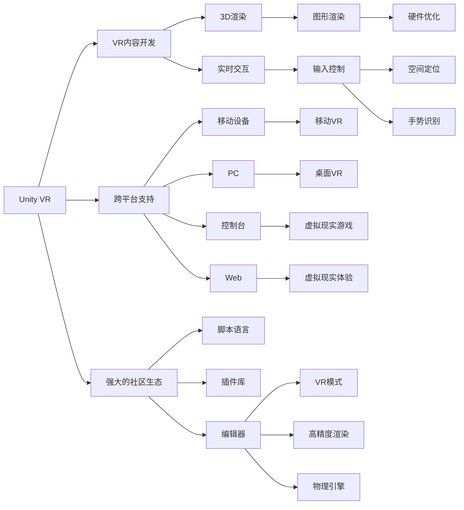

                 

## 1. 背景介绍

随着虚拟现实技术（Virtual Reality, VR）的不断发展，VR内容开发逐渐成为各类应用开发的热门领域。传统游戏引擎，如Unity 和 Unreal，已逐步实现了对VR内容的支持。本文将以Unity VR和Unreal VR为例，对VR内容开发框架进行详细探讨，帮助开发者选择最合适的工具和平台，快速构建出高质量的VR内容。

## 2. 核心概念与联系

### 2.1 核心概念概述

为了更好地理解Unity VR和Unreal VR，首先需要了解一些核心概念。

- **虚拟现实（Virtual Reality, VR）**：通过计算机生成的三维环境，使用户可以沉浸在虚拟环境中，并进行交互。
- **Unity**：一款跨平台的游戏引擎，支持2D、3D和VR游戏开发，具有强大的跨平台支持和社区生态。
- **Unreal Engine**：一款高级游戏引擎，提供强大的3D图形渲染功能和VR支持，适用于高端游戏和电影制作。
- **VR内容开发框架**：提供工具、技术和开发环境，帮助开发者快速构建VR内容。

这些概念相互关联，共同构成了VR内容开发的框架。

### 2.2 核心概念原理和架构的 Mermaid 流程图



这个流程图展示了Unity VR和Unreal VR在VR内容开发中的关键角色和架构：

1. **Unity VR**：作为跨平台的游戏引擎，支持移动设备、PC、控制台和Web平台。具有强大的社区生态，包含丰富的脚本语言和插件库。
2. **Unreal Engine**：提供强大的3D渲染功能和VR支持，适用于高端游戏和电影制作。
3. **VR内容开发**：使用这些引擎和框架，可以创建3D渲染、实时交互的虚拟现实内容。
4. **跨平台支持**：Unity VR和Unreal VR支持各种平台，使开发者可以构建跨平台的VR内容。
5. **社区生态**：Unity VR和Unreal VR都有庞大的社区，提供了丰富的资源和开发工具。
6. **实时交互**：VR内容需要实现实时交互，Unity VR和Unreal VR都提供了强大的输入控制功能。
7. **输入控制**：包括空间定位和手势识别等，增强用户的沉浸感和交互体验。

## 3. 核心算法原理 & 具体操作步骤

### 3.1 算法原理概述

VR内容开发的核心算法包括场景渲染、输入控制、物理模拟等。这些算法共同构成了VR体验的关键要素。

- **场景渲染**：通过3D渲染引擎，将虚拟场景中的对象和环境实时渲染到屏幕上。
- **输入控制**：实现空间定位、手势识别等，使用户能够与虚拟环境进行交互。
- **物理模拟**：通过物理引擎，模拟物体的运动和交互，增强沉浸感。

### 3.2 算法步骤详解

1. **场景渲染**：
    - 创建3D模型和材质。
    - 配置光源和相机。
    - 渲染场景。

2. **输入控制**：
    - 配置空间定位设备（如Oculus Rift）。
    - 实现手势识别和用户交互。
    - 处理用户输入，更新场景。

3. **物理模拟**：
    - 配置物理引擎（如Unity中的Physics Engine）。
    - 模拟物体的运动和碰撞。
    - 更新物理状态，渲染场景。

### 3.3 算法优缺点

**Unity VR的优点：**
- 跨平台支持：支持iOS、Android、Windows、macOS等多个平台。
- 庞大的社区生态：丰富的插件和脚本资源。
- 简单易学：使用Unity Editor进行可视化编程，降低了开发门槛。

**Unity VR的缺点：**
- 渲染性能：在低端硬件上性能表现不如Unreal Engine。
- 物理模拟：需要依赖插件，不如Unreal Engine直接支持。

**Unreal Engine的优点：**
- 强大的渲染引擎：支持高质量的3D渲染。
- 直接支持物理模拟：无需依赖插件。
- 广泛的应用领域：适用于游戏、电影制作等。

**Unreal Engine的缺点：**
- 开发门槛高：需要一定的图形编程基础。
- 学习曲线陡峭：使用C++进行开发，入门难度较大。
- 资源消耗：在高性能硬件上的性能表现优秀，但硬件成本较高。

### 3.4 算法应用领域

Unity VR和Unreal VR在多个领域有广泛应用，包括：

- **游戏开发**：支持2D、3D和VR游戏开发，适用于移动平台和桌面平台。
- **电影制作**：提供强大的3D渲染和物理模拟功能，适用于高质量电影制作。
- **虚拟现实体验**：支持虚拟现实环境构建，用于教育和培训等领域。
- **交互式应用**：支持交互式应用开发，如虚拟会议、虚拟旅游等。

## 4. 数学模型和公式 & 详细讲解

### 4.1 数学模型构建

在VR内容开发中，数学模型是实现3D渲染和物理模拟的核心。以下是几个关键的数学模型：

- **光照模型**：用于计算场景中每个像素的光照强度。常用的模型包括Phong模型和Blinn-Phong模型。
- **碰撞检测模型**：用于检测两个物体之间的碰撞。常用的算法包括Octree和BVH树。
- **物理引擎模型**：用于模拟物体的运动和碰撞。常用的模型包括刚体动力学模型和软体动力学模型。

### 4.2 公式推导过程

以Phong光照模型为例，推导其在3D渲染中的应用：

$$
\text{Diffuse Reflectance} = k_d \cdot \max(0,\vec{n} \cdot \vec{l})^n
$$

$$
\text{Specular Reflectance} = k_s \cdot (\vec{r} \cdot \vec{v})^n
$$

$$
\text{BRDF} = \frac{\text{Diffuse Reflectance}}{\text{Luminance} \cdot \text{Cosine of Incident Angle}^n}
$$

其中：
- $\vec{n}$：法线向量。
- $\vec{l}$：光源方向向量。
- $\vec{r}$：反射向量。
- $\vec{v}$：视角向量。
- $k_d$：漫反射系数。
- $k_s$：镜面反射系数。
- $n$：镜面指数。

通过上述公式，可以计算出每个像素的光照强度，从而实现逼真的3D渲染。

### 4.3 案例分析与讲解

以Unity VR中的光追渲染为例，分析其实现过程：

1. **环境光贴图**：使用环境光贴图，模拟真实世界的环境光照效果。
2. **动态光追踪**：使用动态光追踪算法，实时计算每个像素的光照强度。
3. **全局光照**：使用全局光照技术，模拟光源在场景中的传播效果。

## 5. 项目实践：代码实例和详细解释说明

### 5.1 开发环境搭建

为了进行Unity VR或Unreal VR开发，需要搭建相应的开发环境。

- **Unity**：
    - 下载Unity Hub，创建新的Unity项目。
    - 配置VR插件（如VR SDK）。
    - 配置VR硬件设备（如Oculus Rift）。

- **Unreal Engine**：
    - 下载Unreal Engine，创建新的Unreal项目。
    - 配置VR插件（如Oculus VR插件）。
    - 配置VR硬件设备（如Oculus Rift）。

### 5.2 源代码详细实现

**Unity VR示例代码**：

```csharp
using UnityEngine;
using UnityEngine.XR;
using UnityEngine.XR.Interaction.Toolkit;

public class VRController : MonoBehaviour
{
    public InputSystemHandController handController;
    
    void Update()
    {
        if (handController.IsGrabbing)
        {
            // 处理手势事件
        }
    }
}
```

**Unreal Engine示例代码**：

```c++
class VRController : APlayerController
{
    void BeginPlay()
    {
        // 初始化VR控制器
    }

    void Update(float DeltaTime)
    {
        // 处理输入事件
    }
}
```

### 5.3 代码解读与分析

以上代码展示了Unity VR和Unreal VR的基本控制器实现。

- **Unity**：使用XR功能模块和InputSystem，实现空间定位和手势识别。
- **Unreal Engine**：使用VR模块和APlayerController，实现空间定位和输入控制。

### 5.4 运行结果展示

可以通过搭建VR环境，运行上述代码，观察VR内容的效果。

- **Unity**：运行Unity VR项目，观察VR控制器在虚拟环境中的表现。
- **Unreal Engine**：运行Unreal VR项目，观察VR控制器在虚拟环境中的表现。

## 6. 实际应用场景

### 6.1 虚拟现实游戏

Unity VR和Unreal VR被广泛应用于虚拟现实游戏开发，包括动作游戏、射击游戏等。

- **Unity**：适用于移动平台和桌面平台，开发门槛较低。
- **Unreal Engine**：适用于高端游戏，支持高质量渲染和物理模拟。

### 6.2 虚拟现实体验

Unity VR和Unreal VR在虚拟现实体验中也有广泛应用，如虚拟旅游、虚拟会议等。

- **Unity**：支持移动设备，易于部署和分发。
- **Unreal Engine**：支持高端硬件，提供高质量的沉浸式体验。

### 6.3 教育培训

虚拟现实技术在教育培训中的应用日益广泛，Unity VR和Unreal VR提供了强大的开发平台。

- **Unity**：支持跨平台，方便大规模部署。
- **Unreal Engine**：支持高质量渲染和物理模拟，适用于高精度培训。

## 7. 工具和资源推荐

### 7.1 学习资源推荐

为了帮助开发者学习Unity VR和Unreal VR，推荐以下学习资源：

- **Unity官方文档**：提供了完整的VR开发教程和API参考。
- **Unreal Engine官方文档**：提供了详细的VR开发教程和API参考。
- **Unity VR开发指南**：涵盖了Unity VR的开发技巧和最佳实践。
- **Unreal Engine VR开发指南**：涵盖了Unreal Engine VR的开发技巧和最佳实践。

### 7.2 开发工具推荐

为了进行Unity VR和Unreal VR开发，推荐以下工具：

- **Unity Hub**：用于创建和管理Unity项目。
- **Unreal Engine Launcher**：用于创建和管理Unreal Engine项目。
- **VR设备套装**：如Oculus Rift、HTC Vive等，用于测试VR内容。
- **VR编辑器**：如Unity Editor、Unreal Editor等，用于可视化编程。

### 7.3 相关论文推荐

为了深入了解Unity VR和Unreal VR，推荐以下论文：

- **"Unity VR: A Comprehensive Guide to Creating Virtual Reality Applications"**：详细介绍了Unity VR的开发方法和最佳实践。
- **"Unreal Engine VR Development: Techniques and Best Practices"**：详细介绍了Unreal Engine VR的开发方法和最佳实践。
- **"Virtual Reality in Education and Training: A Survey"**：综述了虚拟现实在教育和培训中的应用。

## 8. 总结：未来发展趋势与挑战

### 8.1 研究成果总结

Unity VR和Unreal VR在虚拟现实内容开发中具有重要的地位，帮助开发者快速构建高质量的VR内容。未来，VR内容开发将继续快速发展，推动虚拟现实技术的普及应用。

### 8.2 未来发展趋势

1. **跨平台开发**：VR内容开发将更加跨平台，方便开发者在各种设备上发布应用。
2. **高精度渲染**：支持更高质量的3D渲染和物理模拟，提升用户体验。
3. **交互式体验**：支持更丰富的输入控制和手势识别，增强用户的沉浸感和交互体验。
4. **低延迟技术**：优化网络传输和计算效率，减少延迟，提高用户体验。

### 8.3 面临的挑战

1. **性能瓶颈**：高精度渲染和实时计算需要强大的硬件支持，成本较高。
2. **开发门槛**：VR内容开发需要一定的图形编程基础，门槛较高。
3. **用户体验**：用户对VR体验的要求不断提升，需要不断优化和改进。
4. **技术演进**：VR技术快速发展，需要不断学习和更新知识。

### 8.4 研究展望

1. **跨平台优化**：优化VR内容的跨平台性能，降低开发成本。
2. **高精度渲染**：开发更高效的高精度渲染算法，提升用户体验。
3. **交互式体验**：进一步优化输入控制和手势识别，增强沉浸感和交互体验。
4. **低延迟技术**：优化网络传输和计算效率，提高用户体验。

## 9. 附录：常见问题与解答

**Q1: 如何选择Unity VR或Unreal VR？**

A: 选择Unity VR或Unreal VR取决于具体的应用场景和需求。
- Unity VR适用于移动平台和桌面平台，开发门槛较低，学习资源丰富。
- Unreal Engine适用于高端游戏和电影制作，支持高质量渲染和物理模拟。

**Q2: 如何提升Unity VR的性能？**

A: 提升Unity VR的性能可以从以下几个方面入手：
- 优化渲染管线，减少渲染时间和内存消耗。
- 使用异步处理技术，提高渲染和计算效率。
- 优化输入控制，减少延迟和响应时间。

**Q3: 如何提升Unreal Engine的性能？**

A: 提升Unreal Engine的性能可以从以下几个方面入手：
- 优化渲染管线，减少渲染时间和内存消耗。
- 使用异步处理技术，提高渲染和计算效率。
- 优化输入控制，减少延迟和响应时间。

通过本文的详细探讨，相信你对Unity VR和Unreal VR有了更深入的理解，能够更好地选择和开发VR内容。

---

作者：禅与计算机程序设计艺术 / Zen and the Art of Computer Programming

