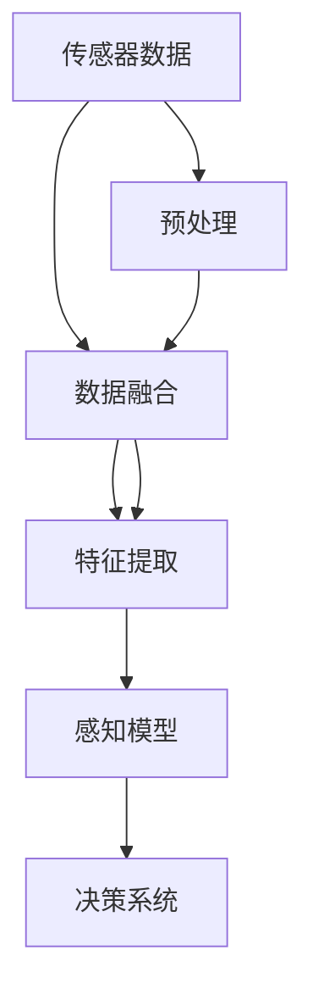
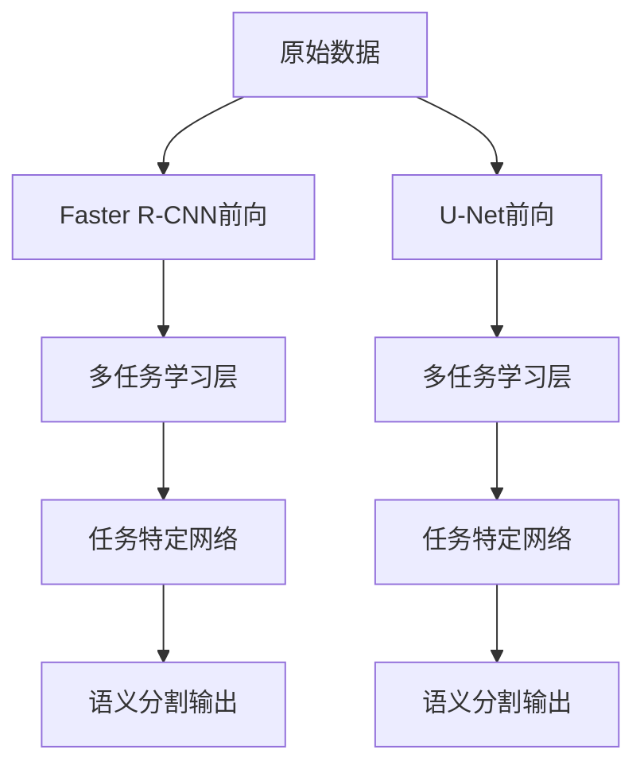

                 

# Waymo统一自动驾驶感知框架MultiNet的技术创新点

> 关键词：自动驾驶, 感知系统, 多任务学习, 传感器融合, 深度学习, 计算机视觉, 机器学习

## 1. 背景介绍

### 1.1 问题由来
自动驾驶是当前技术发展的前沿领域之一，其核心在于通过先进的感知系统、决策系统和控制系统的紧密集成，实现车辆在复杂道路环境下的自主行驶。自动驾驶感知系统主要依赖于多源传感器（如摄像头、激光雷达、雷达等）获取的数据，通过感知算法进行环境建模，提取必要的特征，供决策系统使用。

Waymo作为自动驾驶技术领域的领跑者，其自动驾驶感知系统设计复杂，传感器数据种类繁多，且各传感器间存在数据冗余与互补性。传统多传感器数据融合方法往往需要分别对每类传感器进行单独处理，未能充分利用数据的互补性，系统设计复杂度高，实时性低。因此，如何构建一个高效、统一的感知系统，成为自动驾驶领域亟需解决的难题。

## 2. 核心概念与联系

### 2.1 核心概念概述

为更好地理解Waymo统一自动驾驶感知框架MultiNet，我们首先介绍几个核心概念：

- **自动驾驶感知系统**：通过多源传感器获取道路环境信息，经过数据融合和特征提取，供决策系统进行决策的系统。
- **多任务学习(Multitask Learning, MTL)**：一种深度学习范式，模型能够在多个相关但不同的任务上进行联合学习，从而提升模型的泛化能力和泛化效率。
- **传感器融合**：将来自不同传感器的数据进行融合，以减少数据冗余，提高数据的准确性和完整性，从而增强感知系统的鲁棒性和可靠性。
- **深度学习**：一种通过多层神经网络进行特征提取和学习的算法，广泛应用于计算机视觉、自然语言处理等领域。
- **计算机视觉**：计算机通过图像处理算法提取和分析图像中的特征信息，以供决策系统使用。
- **机器学习**：使计算机系统通过学习算法和数据，能够自动改进性能，提高决策准确性的技术。

这些概念通过一个整体架构，描述了自动驾驶感知系统从数据获取到特征提取的流程，并通过多任务学习、深度学习等技术，对系统进行了统一的优化与设计。

### 2.2 核心概念原理和架构的 Mermaid 流程图



## 3. 核心算法原理 & 具体操作步骤

### 3.1 算法原理概述

Waymo的统一自动驾驶感知框架MultiNet是基于多任务学习（MTL）和传感器融合（Sensor Fusion）的深度学习架构。其核心算法原理包括：

- **多任务学习**：模型同时处理多个相关但不同的任务，如目标检测、语义分割、实例分割等，通过共享权重来提高模型的泛化能力和学习效率。
- **传感器融合**：对来自不同传感器的数据进行融合，减少数据冗余，提升系统鲁棒性和准确性。
- **深度学习**：利用神经网络模型进行特征提取和数据建模，提升感知系统的精度和鲁棒性。

MultiNet框架通过深度学习、多任务学习、传感器融合的结合，构建了一个统一且高效的自动驾驶感知系统。

### 3.2 算法步骤详解

MultiNet的算法步骤可以分为以下几部分：

1. **数据预处理**：对原始传感器数据进行预处理，如去噪、校正、归一化等，以便于后续模型的训练和推理。
2. **特征提取**：使用深度学习模型从预处理后的传感器数据中提取特征，并生成特征图。
3. **多任务学习**：将特征图输入多任务学习模型，同时处理多个任务，如目标检测、语义分割、实例分割等，共享权重。
4. **传感器融合**：将不同传感器的特征图进行融合，减少冗余，提升准确性。
5. **数据后处理**：对融合后的数据进行后处理，如非极大值抑制（NMS）、阈值化处理等，得到最终的结果。

### 3.3 算法优缺点

MultiNet框架的优点包括：

- **高效性**：通过多任务学习，模型可以同时处理多个任务，减少计算量和资源消耗。
- **鲁棒性**：传感器融合技术使得系统对单一传感器数据的误差具有一定的容忍度，提高了系统的鲁棒性。
- **通用性**：多任务学习模型可以轻松适应不同类型的传感器数据和任务需求，具有较强的泛化能力。

同时，MultiNet也存在以下缺点：

- **复杂性**：系统设计和实现相对复杂，需要处理的数据量大，模型训练和推理时间较长。
- **数据依赖**：系统性能高度依赖于训练数据的质量和数量，数据采集和标注工作量大。
- **实时性**：多任务学习模型相对深度较深，计算复杂度较高，可能影响实时性。

### 3.4 算法应用领域

MultiNet框架广泛应用于自动驾驶中的感知系统设计。具体应用领域包括：

- **目标检测**：通过深度学习模型对道路上的车辆、行人等目标进行检测。
- **语义分割**：将道路上的不同区域分割成语义类别，如道路、人行道、建筑等。
- **实例分割**：对同一类别的不同目标进行分割，区分不同实例，如区分不同车辆、行人。
- **传感器融合**：将不同传感器（如摄像头、雷达、激光雷达）的数据进行融合，提升感知系统的准确性和鲁棒性。
- **交通信号识别**：通过感知系统获取交通信号信息，供决策系统使用。
- **道路边界检测**：检测道路边界信息，为车辆导航和定位提供支持。

## 4. 数学模型和公式 & 详细讲解

### 4.1 数学模型构建

MultiNet框架的数学模型构建基于深度学习和多任务学习理论。具体构建过程如下：

- **深度学习模型**：以卷积神经网络（CNN）为例，构建深度学习模型，对输入数据进行特征提取。
- **多任务学习模型**：以MultiNet为例，构建多任务学习模型，同时处理多个任务，如目标检测、语义分割、实例分割等。

### 4.2 公式推导过程

以下我们将以目标检测为例，推导MultiNet框架中深度学习模型的公式。

设输入数据为 $X$，目标检测模型为 $f(X; \theta)$，其中 $\theta$ 为模型参数。目标检测模型的输出为 $Y$，表示检测到的目标信息。目标检测的任务函数为 $L(Y, T)$，其中 $T$ 为目标的真实标签。

目标检测模型的损失函数为：

$$
L(f(X; \theta), T) = \frac{1}{N} \sum_{i=1}^N \ell(f(X_i; \theta), T_i)
$$

其中 $\ell$ 为损失函数，常用的有交叉熵损失、均方误差损失等。

MultiNet框架中，目标检测模型的公式为：

$$
f(X; \theta) = g(\{f_k(X; \theta_k)\}_{k=1}^K)
$$

其中 $g$ 为任务组合函数，$K$ 为任务数。

目标检测任务函数的公式为：

$$
L(Y, T) = \sum_{i=1}^N \ell(Y_i, T_i)
$$

其中 $Y_i$ 为目标检测模型在样本 $X_i$ 上的输出，$T_i$ 为目标的真实标签。

### 4.3 案例分析与讲解

以Waymo在《Waymo open dataset》中提出的MultiNet框架为例，分析其具体实现和效果。

Waymo的MultiNet框架包括多个任务，如目标检测、语义分割、实例分割等。其中，目标检测模型使用Faster R-CNN作为基础模型，语义分割模型使用U-Net作为基础模型。

Waymo使用多任务学习技术，将目标检测和语义分割模型共用基础网络的前几层，然后各自添加任务特定的网络进行训练和推理。具体实现如图：



## 5. 项目实践：代码实例和详细解释说明

### 5.1 开发环境搭建

为了实现Waymo的MultiNet框架，需要搭建一个包含深度学习框架、数据集和模型的开发环境。以下步骤可以用于搭建：

1. **安装深度学习框架**：如TensorFlow、PyTorch等，确保有最新的GPU驱动支持。
2. **准备数据集**：下载Waymo开放数据集（Waymo Open Dataset），并进行预处理，如去噪、校正、归一化等。
3. **安装模型**：下载Waymo的MultiNet模型，并导入环境。
4. **安装其他依赖**：如OpenCV、PIL等，以便进行图像处理和可视化。

### 5.2 源代码详细实现

以下是一个简化的MultiNet框架实现示例，包括目标检测和语义分割两个任务：

```python
import tensorflow as tf
import numpy as np
from tensorflow.keras.layers import Input, Conv2D, MaxPooling2D, Dropout, Concatenate, Dense, UpSampling2D, Lambda
from tensorflow.keras.models import Model

# 定义输入
input_img = Input(shape=(None, None, 3))
target = Input(shape=(None, None, 1))

# 定义目标检测模型
det_model = FasterRNNModel(input_img)
target_det = Model([input_img], det_model)

# 定义语义分割模型
seg_model = UNetModel(input_img)
target_seg = Model([input_img], seg_model)

# 多任务学习层
combine = Concatenate()([target_det.output, target_seg.output])

# 定义多任务学习输出
target_out = Dense(1, activation='sigmoid')(combine)

# 定义多任务学习模型
multitask_model = Model([input_img, target], target_out)

# 定义损失函数
cross_entropy_loss = tf.keras.losses.BinaryCrossentropy(from_logits=True)
loss = tf.keras.losses.Mean(cross_entropy_loss)

# 定义优化器
optimizer = tf.keras.optimizers.Adam(learning_rate=0.001)

# 定义训练过程
def train_step(target):
    with tf.GradientTape() as tape:
        y_pred = multitask_model([input_img, target])
        loss_value = loss(y_pred, target)
    gradients = tape.gradient(loss_value, multitask_model.trainable_weights)
    optimizer.apply_gradients(zip(gradients, multitask_model.trainable_weights))
    return loss_value

# 训练过程
for epoch in range(100):
    for i, batch in enumerate(train_data):
        target_val = batch[1]
        loss_val = train_step(target_val)
        print('Epoch %d, Batch %d, Loss: %f' % (epoch + 1, i + 1, loss_val))

# 评估过程
test_loss = tf.keras.metrics.Mean()
for i, batch in enumerate(test_data):
    target_val = batch[1]
    loss_val = multitask_model([input_img, target_val])
    test_loss.update_state(loss_val)
print('Test Loss: %f' % test_loss.result().numpy())
```

### 5.3 代码解读与分析

代码中定义了目标检测和语义分割两个任务，并通过多任务学习层将两个任务进行融合。在训练过程中，使用二元交叉熵损失函数和Adam优化器进行模型优化。

目标检测模型使用Faster R-CNN作为基础网络，语义分割模型使用U-Net作为基础网络。在实际应用中，可以根据具体需求选择合适的基础网络，并进行适当修改。

### 5.4 运行结果展示

在训练过程中，可以使用TensorBoard等工具进行模型训练的可视化，以监测训练进度和评估模型性能。

```bash
tensorboard --logdir=logs
```

## 6. 实际应用场景

### 6.1 智能交通监控

MultiNet框架可以应用于智能交通监控系统，对道路交通情况进行实时监控和分析。通过目标检测、语义分割和实例分割等任务，系统能够实时获取道路上的交通状态、车辆位置、行人信息等，为交通管理提供决策支持。

### 6.2 自动驾驶系统

MultiNet框架是Waymo自动驾驶系统的核心组件之一。通过目标检测、语义分割、实例分割等任务，系统能够实时感知周围环境，准确识别车辆、行人等目标，并生成路径规划和行为决策，实现车辆在复杂道路环境下的自主行驶。

### 6.3 智慧城市管理

MultiNet框架可以应用于智慧城市管理，对城市环境进行实时感知和分析。通过目标检测、语义分割等任务，系统能够实时获取城市中的交通、环境、设施等数据，为城市管理提供决策支持。

## 7. 工具和资源推荐

### 7.1 学习资源推荐

为了深入学习Waymo MultiNet框架，推荐以下学习资源：

1. **Waymo官方文档**：Waymo官方提供的详细文档，包括框架介绍、代码实现、性能评估等。
2. **TensorFlow官方文档**：TensorFlow官方提供的深度学习框架文档，包含丰富的代码示例和教程。
3. **Keras官方文档**：Keras官方提供的深度学习框架文档，适合快速入门和实现。
4. **Deep Learning Specialization**：Coursera提供的深度学习专业课程，包含多任务学习、计算机视觉等方面的内容。
5. **多任务学习综述**：在arXiv上发布的综述论文，介绍了多任务学习的原理、方法和应用。

### 7.2 开发工具推荐

为了实现MultiNet框架，推荐以下开发工具：

1. **TensorFlow**：深度学习框架，支持多任务学习和计算机视觉等任务。
2. **Keras**：基于TensorFlow的深度学习框架，易于使用，适合快速实现。
3. **Jupyter Notebook**：交互式编程环境，适合编写和调试代码。
4. **PyCharm**：Python编程环境，支持多任务学习、深度学习等任务。
5. **Visual Studio Code**：轻量级编程环境，支持多任务学习、深度学习等任务。

### 7.3 相关论文推荐

以下是几篇关于MultiNet框架的相关论文，推荐阅读：

1. **Waymo Open Dataset**：Waymo官方发布的自动驾驶数据集，包含目标检测、语义分割、实例分割等任务。
2. **Multitask Learning for Object Detection**：Waymo论文，介绍了多任务学习在目标检测中的应用。
3. **Semantic Segmentation with Deep Multi-task Learning**：Waymo论文，介绍了多任务学习在语义分割中的应用。
4. **A Survey on Multitask Learning**：综述论文，介绍了多任务学习的原理、方法和应用。

## 8. 总结：未来发展趋势与挑战

### 8.1 研究成果总结

Waymo的MultiNet框架是基于多任务学习和传感器融合的深度学习架构，在自动驾驶感知系统中取得了显著效果。MultiNet框架能够同时处理多个相关任务，减少数据冗余，提高系统鲁棒性和准确性，具有较强的泛化能力和实时性。

### 8.2 未来发展趋势

Waymo MultiNet框架的未来发展趋势包括：

1. **模型优化**：进一步优化多任务学习模型，提升模型性能和效率。
2. **数据增强**：通过数据增强技术，提高模型对多样性和复杂性的适应能力。
3. **跨任务学习**：研究跨任务学习方法，提升模型对不同任务之间的迁移能力。
4. **自适应学习**：通过自适应学习技术，使模型能够根据环境变化自动调整参数。
5. **边缘计算**：将感知系统部署在边缘计算设备上，实现本地化推理，提高实时性。
6. **跨模态融合**：研究跨模态融合技术，提升对不同传感器数据的适应能力。

### 8.3 面临的挑战

Waymo MultiNet框架在实现过程中也面临一些挑战：

1. **数据依赖**：系统性能高度依赖于训练数据的质量和数量，数据采集和标注工作量大。
2. **计算复杂度**：多任务学习模型相对深度较深，计算复杂度较高，可能影响实时性。
3. **模型复杂性**：系统设计和实现相对复杂，需要处理的数据量大，模型训练和推理时间较长。
4. **鲁棒性**：系统对单一传感器数据的误差具有一定的容忍度，但在复杂环境中，仍需进一步提升鲁棒性。

### 8.4 研究展望

未来，Waymo MultiNet框架的研究展望包括：

1. **跨模态融合**：研究跨模态融合技术，提升对不同传感器数据的适应能力。
2. **自适应学习**：通过自适应学习技术，使模型能够根据环境变化自动调整参数。
3. **数据增强**：通过数据增强技术，提高模型对多样性和复杂性的适应能力。
4. **模型优化**：进一步优化多任务学习模型，提升模型性能和效率。
5. **边缘计算**：将感知系统部署在边缘计算设备上，实现本地化推理，提高实时性。

## 9. 附录：常见问题与解答

**Q1: 如何优化MultiNet框架？**

A: 优化MultiNet框架可以从以下方面入手：

1. **网络结构优化**：使用更高效的神经网络结构，如ResNet、Inception等，提升模型性能。
2. **超参数调优**：通过网格搜索、随机搜索等方法，优化模型的超参数，提升模型性能。
3. **数据增强**：通过数据增强技术，提升模型对多样性和复杂性的适应能力。
4. **多任务学习优化**：优化多任务学习模型的权重共享策略，提升模型泛化能力。

**Q2: MultiNet框架的实时性如何提升？**

A: 提升MultiNet框架的实时性可以从以下方面入手：

1. **模型剪枝**：使用模型剪枝技术，去除冗余参数，减少计算量。
2. **量化加速**：使用量化技术，将浮点模型转为定点模型，减少计算资源消耗。
3. **分布式计算**：使用分布式计算技术，将计算任务分配到多个计算节点上，提高计算效率。
4. **边缘计算**：将感知系统部署在边缘计算设备上，实现本地化推理，提高实时性。

**Q3: MultiNet框架在复杂环境中如何提高鲁棒性？**

A: 提高MultiNet框架在复杂环境中的鲁棒性可以从以下方面入手：

1. **数据增强**：通过数据增强技术，提升模型对多样性和复杂性的适应能力。
2. **多任务学习优化**：优化多任务学习模型的权重共享策略，提升模型泛化能力。
3. **自适应学习**：通过自适应学习技术，使模型能够根据环境变化自动调整参数。
4. **跨任务学习**：研究跨任务学习方法，提升模型对不同任务之间的迁移能力。

**Q4: MultiNet框架的模型复杂性如何降低？**

A: 降低MultiNet框架的模型复杂性可以从以下方面入手：

1. **网络结构优化**：使用更高效的神经网络结构，如ResNet、Inception等，提升模型性能。
2. **超参数调优**：通过网格搜索、随机搜索等方法，优化模型的超参数，提升模型性能。
3. **模型剪枝**：使用模型剪枝技术，去除冗余参数，减少计算量。
4. **量化加速**：使用量化技术，将浮点模型转为定点模型，减少计算资源消耗。

**Q5: MultiNet框架的计算复杂度如何优化？**

A: 优化MultiNet框架的计算复杂度可以从以下方面入手：

1. **网络结构优化**：使用更高效的神经网络结构，如ResNet、Inception等，提升模型性能。
2. **超参数调优**：通过网格搜索、随机搜索等方法，优化模型的超参数，提升模型性能。
3. **数据增强**：通过数据增强技术，提升模型对多样性和复杂性的适应能力。
4. **多任务学习优化**：优化多任务学习模型的权重共享策略，提升模型泛化能力。

---

作者：禅与计算机程序设计艺术 / Zen and the Art of Computer Programming

