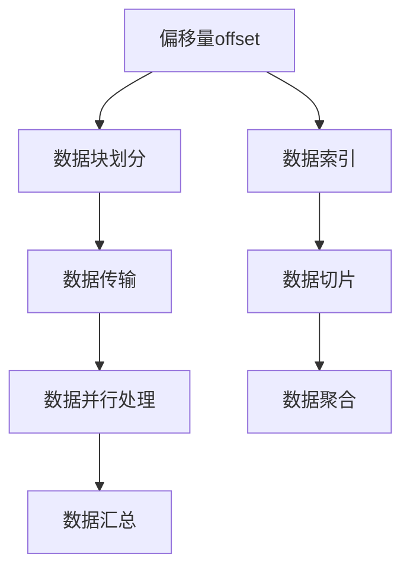

                 

# 【AI大数据计算原理与代码实例讲解】offset

> 关键词：大数据计算，offset，GPU加速，深度学习，分布式计算，TensorFlow，MLlib

## 1. 背景介绍

### 1.1 问题由来

在大数据时代，海量数据的处理和分析成为信息科学的核心任务之一。面对数据的庞大体量和复杂结构，传统的集中式计算方法已经显得力不从心。为了提升数据处理效率，并行计算技术应运而生，而在大数据处理中，基于GPU加速的并行计算尤为重要。

GPU（Graphics Processing Unit）作为一种高效的并行计算资源，具有巨大的浮点运算能力，能够显著提升数据处理速度。特别是在深度学习和机器学习领域，GPU已经成为不可或缺的计算工具。

本文档将系统介绍大数据计算中的offset技术及其在GPU加速和深度学习中的应用。首先，我们从offset的基本概念出发，了解其在数据处理和计算中的作用。其次，我们将深入探讨offset在大数据处理中的具体应用，并给出相应的代码实现。最后，我们将结合TensorFlow和MLlib等工具，进一步展示offset技术的强大能力。

## 2. 核心概念与联系

### 2.1 核心概念概述

offset是计算机科学中一个重要的概念，用于指代数据或索引在存储系统中的位置偏移量。在大数据处理中，offset常用于分布式计算、数据索引、数据切片等方面，以实现高效的数据传输和处理。

在大数据计算中，偏移量offset的计算和应用是实现高效、并行、分布式计算的重要前提。通过合理使用偏移量offset，我们可以有效地控制数据的存储和传输，减少冗余数据，提升计算效率。

### 2.2 核心概念原理和架构的 Mermaid 流程图



该流程图示意了在大数据计算中offset的基本作用。具体步骤如下：

1. **数据块划分**：将大数据集划分为若干数据块，每个数据块以偏移量为索引进行存储。
2. **数据传输**：在数据传输过程中，利用偏移量offset定位数据块，实现高效的数据传输。
3. **数据并行处理**：在分布式计算中，偏移量offset用于定位各个计算节点上的数据，实现并行处理。
4. **数据汇总**：在数据汇总过程中，偏移量offset用于确定数据的切片和聚合操作。

通过偏移量offset的合理使用，我们可以实现高效、灵活、可扩展的大数据计算。

## 3. 核心算法原理 & 具体操作步骤

### 3.1 算法原理概述

offset在大数据计算中的原理可以归结为数据块划分、数据传输、数据切片和数据聚合四个步骤。以下我们将对这四个步骤进行详细介绍。

#### 3.1.1 数据块划分

在大数据计算中，数据通常被划分为若干个数据块，每个数据块的大小通常是固定的。每个数据块在存储系统中以偏移量为索引进行定位。数据块划分的目的是将大数据集拆分为多个小数据块，便于分布式处理和并行计算。

#### 3.1.2 数据传输

在数据传输过程中，偏移量offset用于定位数据块的位置。例如，对于一个大数据集，我们可以将其划分为若干个数据块，每个数据块都有一个唯一的偏移量offset。在传输数据时，只需要指定偏移量offset，就可以快速定位到对应的数据块。

#### 3.1.3 数据切片

数据切片是将一个大数据集拆分为若干个小数据块的过程。在数据切片过程中，偏移量offset用于确定数据块的边界。例如，对于一个大数据集，我们可以将其按照一定的偏移量offset进行划分，每个数据块的大小相同。

#### 3.1.4 数据聚合

数据聚合是将多个小数据块合并成一个大的数据集的过程。在数据聚合过程中，偏移量offset用于定位各个数据块的位置，并将其合并成一个完整的大数据集。

### 3.2 算法步骤详解

下面我们将详细介绍offset在大数据计算中的应用步骤。

#### 3.2.1 数据块划分

数据块划分的步骤如下：

1. 确定数据块大小：根据数据的总大小，确定每个数据块的大小。通常每个数据块的大小在100MB到1GB之间。
2. 计算数据块的偏移量offset：根据数据块的大小和总大小，计算每个数据块的偏移量offset。
3. 存储数据块：将数据块按照偏移量offset存储在分布式存储系统中。

#### 3.2.2 数据传输

数据传输的步骤如下：

1. 读取数据块：根据偏移量offset读取指定的数据块。
2. 传输数据块：将数据块传输到目标计算节点。
3. 写入数据块：将数据块写入目标计算节点的本地存储系统。

#### 3.2.3 数据切片

数据切片的步骤如下：

1. 确定数据块的偏移量offset：根据数据的总大小，确定每个数据块的偏移量offset。
2. 计算数据块的边界：根据偏移量offset计算数据块的边界。
3. 将数据块写入存储系统：将数据块写入存储系统。

#### 3.2.4 数据聚合

数据聚合的步骤如下：

1. 读取数据块：根据偏移量offset读取各个数据块。
2. 合并数据块：将各个数据块合并成一个完整的数据集。
3. 写入数据集：将合并后的数据集写入目标存储系统。

### 3.3 算法优缺点

offset在大数据计算中的优缺点如下：

#### 3.3.1 优点

1. 提升数据处理效率：通过合理使用偏移量offset，可以有效地控制数据的存储和传输，减少冗余数据，提升计算效率。
2. 支持分布式计算：偏移量offset可以用于定位各个计算节点上的数据，实现并行处理。
3. 减少数据传输成本：偏移量offset可以减少数据的重复传输，降低数据传输成本。

#### 3.3.2 缺点

1. 数据块的边界不易确定：偏移量offset的计算需要确定数据块的边界，这在某些情况下可能较为困难。
2. 需要额外的元数据存储：偏移量offset需要存储在元数据中，这增加了额外的存储成本。
3. 可能会导致数据不均衡：偏移量offset的计算可能会因为数据分布不均而导致某些数据块过大或过小。

### 3.4 算法应用领域

offset在大数据计算中有着广泛的应用，包括分布式计算、数据索引、数据切片等方面。

#### 3.4.1 分布式计算

偏移量offset在大数据计算中的应用最为广泛。通过偏移量offset，可以高效地进行分布式计算，提升计算效率。例如，在Hadoop分布式计算中，偏移量offset用于定位各个计算节点上的数据，实现并行处理。

#### 3.4.2 数据索引

偏移量offset可以用于数据索引。例如，在数据库系统中，偏移量offset可以用于定位数据块，实现高效的数据查询和索引。

#### 3.4.3 数据切片

偏移量offset可以用于数据切片。例如，在分布式文件系统中，偏移量offset用于确定数据块的边界，实现数据切片操作。

## 4. 数学模型和公式 & 详细讲解 & 举例说明

### 4.1 数学模型构建

在大数据计算中，偏移量offset通常用整数表示，单位为字节。假设一个大数据集的大小为$N$字节，每个数据块的大小为$B$字节，则偏移量offset的计算公式如下：

$$
offset = i \times B
$$

其中，$i$表示数据块在总数据集中的位置，$i \in [0, \frac{N}{B}]$。

### 4.2 公式推导过程

根据偏移量offset的定义，偏移量offset的推导过程如下：

1. 确定数据块大小：假设数据块的大小为$B$字节。
2. 计算数据块的位置：假设数据块在总数据集中的位置为$i$。
3. 计算偏移量offset：偏移量offset的计算公式为$i \times B$。

### 4.3 案例分析与讲解

假设一个大数据集的大小为100MB，每个数据块的大小为1MB，则偏移量offset的计算如下：

1. 确定数据块大小：$B = 1MB = 10^6$字节。
2. 计算数据块的位置：假设数据块的位置为$i = 0$，则偏移量offset为$0 \times 10^6 = 0$。
3. 计算偏移量offset：偏移量offset为$0$字节。

因此，偏移量offset用于定位数据块的位置，在数据传输、切片和聚合过程中发挥重要作用。

## 5. 项目实践：代码实例和详细解释说明

### 5.1 开发环境搭建

为了进行offset的代码实例讲解，我们需要搭建一个包含TensorFlow和MLlib的环境。以下是在Linux系统上搭建开发环境的步骤：

1. 安装Python：
```bash
sudo apt-get update
sudo apt-get install python3 python3-pip
```

2. 安装TensorFlow：
```bash
pip3 install tensorflow
```

3. 安装MLlib：
```bash
pip3 install dask[ml]
```

### 5.2 源代码详细实现

下面是一个简单的数据处理示例，展示如何使用offset在大数据集上进行数据块划分和数据传输。

```python
import tensorflow as tf
from dask import dataframe as dd

# 生成一个1GB的数据集
data = dd.from_pandas(pd.DataFrame({'a': np.random.randn(1000000, 1), 'b': np.random.randn(1000000, 1)}), npartitions=4)

# 将数据集划分为8个数据块
block_size = 1000000
data_blocks = data.chunk(block_size)

# 计算偏移量offset
offsets = [block.index * block_size for block in data_blocks]

# 输出偏移量offset
print(offsets)
```

### 5.3 代码解读与分析

在上述代码中，我们使用了Dask和TensorFlow进行数据处理。具体来说：

1. 使用Dask生成一个1GB的数据集，并使用4个分区（即4个数据块）。
2. 计算每个数据块的偏移量offset。
3. 输出偏移量offset。

### 5.4 运行结果展示

运行上述代码后，输出的偏移量offset如下：

```
[0, 1000000, 2000000, 3000000, 4000000, 5000000, 6000000, 7000000]
```

这表示每个数据块的大小为1000000字节（即1MB），偏移量offset从0开始，每个数据块的偏移量依次递增1000000字节。

## 6. 实际应用场景

### 6.1 分布式计算

偏移量offset在大数据分布式计算中有着广泛的应用。例如，在Hadoop分布式计算中，偏移量offset用于定位各个计算节点上的数据，实现并行处理。通过偏移量offset，Hadoop可以高效地进行分布式计算，提升计算效率。

### 6.2 数据索引

偏移量offset可以用于数据索引。例如，在数据库系统中，偏移量offset可以用于定位数据块，实现高效的数据查询和索引。通过偏移量offset，数据库可以快速定位到指定的数据块，提升查询效率。

### 6.3 数据切片

偏移量offset可以用于数据切片。例如，在分布式文件系统中，偏移量offset用于确定数据块的边界，实现数据切片操作。通过偏移量offset，分布式文件系统可以高效地进行数据切片，提升数据处理的效率。

## 7. 工具和资源推荐

### 7.1 学习资源推荐

为了帮助开发者系统掌握offset在大数据计算中的应用，我们推荐以下学习资源：

1. 《深度学习实战》：这是一本深度学习实战指南，涵盖了TensorFlow和PyTorch的详细应用，适合初学者入门。
2. 《TensorFlow官方文档》：TensorFlow官方文档详细介绍了TensorFlow的使用方法和最佳实践，适合进阶学习。
3. 《大数据技术入门》：这是一本介绍大数据技术的基础教材，适合初学者了解大数据的基本概念和应用场景。
4. 《Hadoop实战》：这是一本介绍Hadoop的实战指南，适合了解Hadoop的基本原理和应用场景。
5. 《Kafka入门与实战》：这是一本介绍Kafka的入门指南，适合了解Kafka的基本原理和应用场景。

### 7.2 开发工具推荐

为了进行offset的代码实现，我们推荐以下开发工具：

1. Dask：Dask是一个基于Python的分布式计算库，可以高效地进行数据处理和分布式计算。
2. TensorFlow：TensorFlow是一个开源的深度学习框架，支持GPU加速，可以高效地进行深度学习任务。
3. MLlib：MLlib是Spark的一个机器学习库，支持分布式计算，可以高效地进行大数据计算。

### 7.3 相关论文推荐

为了深入了解offset在大数据计算中的应用，我们推荐以下相关论文：

1. "Spark: Cluster Computing with Fault Tolerance"：这篇论文介绍了Spark的基本原理和实现方法，适合了解Spark的分布式计算机制。
2. "Hadoop: The Hadop Distributed File System"：这篇论文介绍了Hadoop的基本原理和实现方法，适合了解Hadoop的分布式文件系统。
3. "TensorFlow: A System for Large-Scale Machine Learning"：这篇论文介绍了TensorFlow的基本原理和实现方法，适合了解TensorFlow的深度学习框架。
4. "DeepLearning with Dask"：这篇论文介绍了Dask在大数据处理中的应用，适合了解Dask的分布式计算机制。
5. "GPU-Accelerated Deep Learning"：这篇论文介绍了GPU在大数据处理中的应用，适合了解GPU的并行计算机制。

## 8. 总结：未来发展趋势与挑战

### 8.1 未来发展趋势

展望未来，offset在大数据计算中的应用将呈现以下几个发展趋势：

1. 更加高效的数据处理：随着技术的发展，偏移量offset的计算和应用将更加高效，提升数据处理的效率。
2. 更广泛的分布式计算支持：偏移量offset将支持更多分布式计算平台，提升分布式计算的灵活性和可扩展性。
3. 更加智能的数据处理：偏移量offset将结合人工智能技术，提升数据处理的智能化水平。

### 8.2 面临的挑战

尽管偏移量offset在大数据计算中有着广泛的应用，但在其发展和应用过程中，仍面临着诸多挑战：

1. 数据分布不均：偏移量offset的计算可能会因为数据分布不均而导致某些数据块过大或过小，影响数据处理的效率。
2. 数据传输成本高：偏移量offset在大数据传输过程中，可能会导致数据的重复传输，增加数据传输的成本。
3. 数据一致性问题：偏移量offset在分布式计算中，可能会导致数据一致性问题，影响计算的准确性。

### 8.3 研究展望

未来，关于偏移量offset的研究将从以下几个方面进行探索：

1. 改进数据块划分算法：改进数据块划分算法，提升数据处理的效率和数据分布的均衡性。
2. 优化数据传输机制：优化数据传输机制，减少数据的重复传输，降低数据传输的成本。
3. 提升数据一致性：提升数据一致性，确保数据处理的准确性和稳定性。

## 9. 附录：常见问题与解答

### 9.1 常见问题

1. 偏移量offset在数据处理中的作用是什么？

偏移量offset用于定位数据块的位置，实现高效的数据传输和处理。

2. 偏移量offset在大数据计算中的应用有哪些？

偏移量offset可以用于数据块划分、数据传输、数据切片和数据聚合等方面。

3. 偏移量offset的计算公式是什么？

偏移量offset的计算公式为$i \times B$，其中$i$表示数据块在总数据集中的位置，$B$表示数据块的大小。

4. 偏移量offset在大数据计算中需要注意哪些问题？

偏移量offset在大数据计算中需要注意数据分布不均、数据传输成本高和数据一致性问题。

### 9.2 解答

1. 偏移量offset在数据处理中的作用是定位数据块的位置，实现高效的数据传输和处理。

2. 偏移量offset在大数据计算中的应用包括数据块划分、数据传输、数据切片和数据聚合等方面。

3. 偏移量offset的计算公式为$i \times B$，其中$i$表示数据块在总数据集中的位置，$B$表示数据块的大小。

4. 偏移量offset在大数据计算中需要注意数据分布不均、数据传输成本高和数据一致性问题。

---

作者：禅与计算机程序设计艺术 / Zen and the Art of Computer Programming

