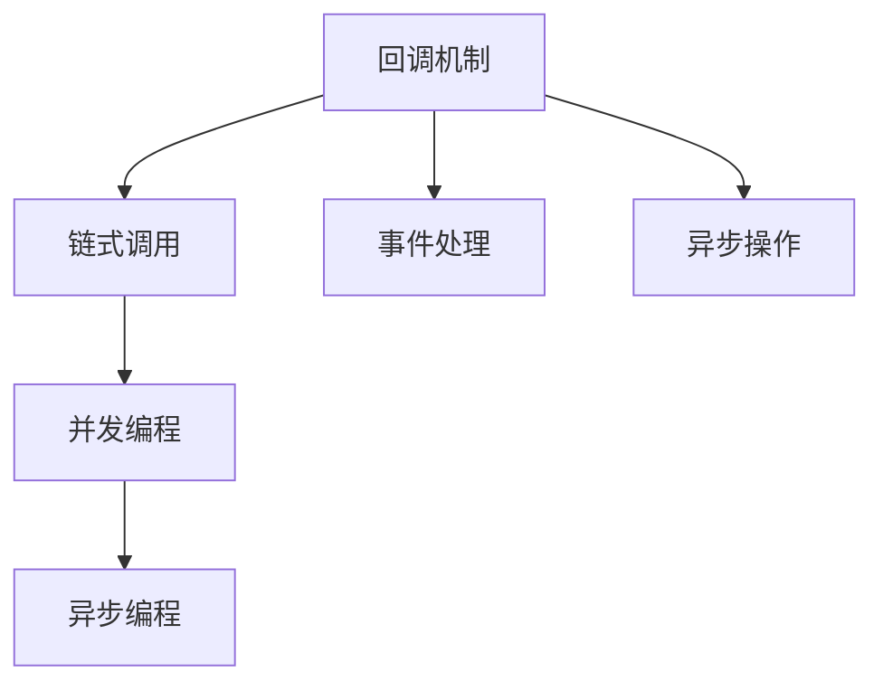

                 

# 【LangChain编程：从入门到实践】回调机制

> 关键词：LangChain, 回调机制, 链式调用, 并发编程, 异步编程, 编程范式

## 1. 背景介绍

在编程实践中，回调（Callback）是一种常见而重要的机制，用于实现异步操作、事件处理等任务。特别是在高并发、高性能的系统设计中，回调机制被广泛应用于各个角落，其重要性不言而喻。本文将深入探讨回调机制在LangChain编程中的具体应用，从入门到实践，带你全面了解回调机制的核心原理、操作步骤以及相关实践技巧。

## 2. 核心概念与联系

### 2.1 核心概念概述

回调（Callback），简单来说，就是在异步操作完成后执行一个指定的操作或函数。它可以用来处理异步操作的结果，或者触发某些特定的事件。

在LangChain编程中，回调机制可以与链式调用、并发编程、异步编程等多种编程范式相结合，实现更加灵活、高效的代码编写方式。

- 链式调用（Chain Call）：通过一系列的函数嵌套调用，将多个操作组合成一个连贯的过程，实现代码的串行执行。
- 并发编程（Concurrent Programming）：通过多线程或多进程的方式，同时执行多个任务，提高程序的执行效率。
- 异步编程（Asynchronous Programming）：在不阻塞主线程的情况下，启动子线程或异步任务，让程序在等待子任务完成的同时继续执行其他操作，提高系统的响应能力。

通过理解这些核心概念，我们可以更好地掌握回调机制在LangChain编程中的具体应用。

### 2.2 核心概念原理和架构的 Mermaid 流程图



该图展示了回调机制与链式调用、并发编程、异步编程等多种编程范式之间的联系。回调机制的核心是等待异步操作完成后执行某些操作，而链式调用、并发编程、异步编程都是回调机制在具体场景中的应用示例。

## 3. 核心算法原理 & 具体操作步骤

### 3.1 算法原理概述

回调机制的核心思想是：在异步操作完成后，执行指定的回调函数。这一机制广泛应用于各种异步操作中，如文件读写、网络请求、定时器等。

回调函数通常接受一个参数，即异步操作的结果或状态信息。在异步操作完成后，回调函数被调用，处理异步操作的结果，并决定下一步的操作。

### 3.2 算法步骤详解

1. **定义回调函数**：
   ```python
   def callback_func(result):
       # 处理异步操作结果
       print(f"异步操作结果：{result}")
   ```

2. **启动异步操作**：
   ```python
   import asyncio

   async def async_func():
       # 异步操作
       await asyncio.sleep(1)
       result = "异步操作完成"
       callback_func(result)
   ```

3. **注册回调函数**：
   ```python
   asyncio.run(async_func())
   ```

### 3.3 算法优缺点

**优点**：
- 提高了程序的响应能力，避免了阻塞主线程。
- 简化异步操作的流程，代码更加简洁、易读。
- 可以实现更加灵活的编程范式，如链式调用、并发编程等。

**缺点**：
- 回调函数通常无法立即返回结果，增加了代码的复杂性。
- 回调函数可能存在回调地狱（Callback Hell）的问题，代码可读性差。
- 回调函数的管理和调用需要更加仔细，容易出现错误。

### 3.4 算法应用领域

回调机制在LangChain编程中的应用非常广泛，可以应用于以下领域：

- **Web开发**：如使用AJAX进行异步数据请求、处理用户事件等。
- **网络编程**：如使用Socket进行网络通信、处理数据包等。
- **并发编程**：如使用多线程或多进程进行数据处理、计算等。
- **异步编程**：如使用异步任务进行数据缓存、定时任务等。
- **事件处理**：如使用事件触发器进行用户交互、系统监控等。

## 4. 数学模型和公式 & 详细讲解 & 举例说明

### 4.1 数学模型构建

回调机制的数学模型可以抽象为以下形式：

- 异步操作：$A$，输入参数为$x$，输出结果为$y$。
- 回调函数：$C$，输入参数为$y$，无返回值。
- 回调链：$A \rightarrow C$，表示异步操作$A$完成后，执行回调函数$C$。

### 4.2 公式推导过程

假设异步操作$A$的执行时间为$t_A$，回调函数$C$的执行时间为$t_C$。则整个回调过程的时间开销为：

$$
T = t_A + t_C
$$

其中$t_A$和$t_C$分别代表了异步操作和回调函数的执行时间，可以通过实验测试得到。

### 4.3 案例分析与讲解

下面以Web开发中的AJAX请求为例，展示回调机制的应用：

```python
import requests
import json

def ajax_request(url):
    def callback(response):
        # 处理异步操作结果
        data = json.loads(response.text)
        print(f"AJAX请求结果：{data}")
        
    # 发起AJAX请求
    response = requests.get(url)
    callback(response)

ajax_request("https://api.example.com/data")
```

在这个例子中，`ajax_request`函数发起了一个AJAX请求，并在异步操作完成后调用了回调函数`callback`。回调函数处理了异步操作的结果，并打印出来。这样，我们就可以在Web页面中实现异步数据请求和处理，提高用户体验。

## 5. 项目实践：代码实例和详细解释说明

### 5.1 开发环境搭建

为了更好地实践回调机制，我们需要搭建一个Python开发环境。以下是搭建环境的步骤：

1. 安装Python：从Python官网下载并安装Python 3.x版本。
2. 安装pip：在命令行输入`python -m ensurepip --default-pip`，安装pip工具。
3. 安装相关库：在命令行中输入以下命令，安装requests、asyncio等库。
   ```
   pip install requests
   pip install asyncio
   ```

### 5.2 源代码详细实现

下面是一个使用回调机制实现异步操作的Python代码示例：

```python
import asyncio

async def async_func():
    # 异步操作
    await asyncio.sleep(1)
    result = "异步操作完成"
    callback_func(result)

def callback_func(result):
    # 处理异步操作结果
    print(f"异步操作结果：{result}")

asyncio.run(async_func())
```

在这个例子中，`async_func`函数定义了一个异步操作，并在操作完成后调用了回调函数`callback_func`。回调函数处理了异步操作的结果，并打印出来。最后，通过`asyncio.run`启动异步操作。

### 5.3 代码解读与分析

- `async_func`函数定义了一个异步操作，使用了`await`关键字，等待异步操作完成后执行下一步操作。
- `callback_func`函数定义了一个回调函数，接受异步操作的结果，并处理结果。
- `asyncio.run`函数启动了异步操作，等待操作完成后调用回调函数。

### 5.4 运行结果展示

运行上述代码，输出结果如下：

```
异步操作结果：异步操作完成
```

这表明异步操作完成后，回调函数被调用，并打印了异步操作的结果。

## 6. 实际应用场景

回调机制在实际应用中具有广泛的应用场景。以下是一些常见的应用场景：

- **Web开发**：如使用AJAX进行异步数据请求、处理用户事件等。
- **网络编程**：如使用Socket进行网络通信、处理数据包等。
- **并发编程**：如使用多线程或多进程进行数据处理、计算等。
- **异步编程**：如使用异步任务进行数据缓存、定时任务等。
- **事件处理**：如使用事件触发器进行用户交互、系统监控等。

## 7. 工具和资源推荐

### 7.1 学习资源推荐

为了深入学习回调机制，以下是一些推荐的学习资源：

- **《Python异步编程实战》**：详细介绍Python异步编程的原理和实践，包括回调机制、协程、异步框架等。
- **《JavaScript异步编程》**：介绍JavaScript异步编程的原理和实践，包括回调、Promise、async/await等。
- **《回调地狱与异步编程》**：讨论回调地狱的问题，并提出解决方案，如Promise、async/await等。

### 7.2 开发工具推荐

为了更好地实现回调机制，以下是一些推荐的开发工具：

- **PyCharm**：功能强大的Python开发环境，支持异步编程、回调机制等特性。
- **Visual Studio Code**：轻量级的代码编辑器，支持JavaScript、Python等语言的异步编程和回调机制。
- **IntelliJ IDEA**：Java开发环境，支持异步编程、回调机制等特性。

### 7.3 相关论文推荐

为了深入理解回调机制，以下是一些推荐的相关论文：

- **《A Survey on Asynchronous Programming Paradigms in JavaScript》**：讨论JavaScript中的异步编程范式，包括回调、Promise、async/await等。
- **《Asynchronous Programming with Python》**：详细介绍Python中的异步编程，包括回调机制、协程、异步框架等。
- **《Callback Hell and Asynchronous Programming》**：讨论回调地狱的问题，并提出解决方案，如Promise、async/await等。

## 8. 总结：未来发展趋势与挑战

### 8.1 研究成果总结

回调机制在LangChain编程中的应用已经非常成熟，广泛应用于各种异步操作中。通过理解回调机制的核心原理和操作步骤，我们可以更好地实现异步操作、事件处理等任务，提高程序的响应能力和效率。

### 8.2 未来发展趋势

回调机制在未来将继续发挥重要作用，并与其他编程范式进一步融合。以下是一些未来趋势：

- **更高级别的异步编程**：如使用async/await、Promise等高级异步编程范式，简化异步操作的流程，提高代码可读性。
- **分布式异步编程**：如使用微服务、分布式计算等技术，实现大规模异步操作的协调和调度。
- **异步编程框架的完善**：如使用Asyncio、Ktor等异步编程框架，提供更多的工具和支持，简化异步编程的开发过程。

### 8.3 面临的挑战

尽管回调机制已经非常成熟，但在实际应用中仍面临一些挑战：

- **回调函数的管理和调用**：在复杂的应用场景中，回调函数的嵌套和调用容易出现问题，需要更加仔细地管理。
- **异步编程的并发控制**：在多线程或多进程的应用中，需要避免数据竞争和死锁等问题，确保程序的正确性和性能。
- **异步编程的测试和调试**：异步编程的调试和测试相对困难，需要更多工具和技巧支持。

### 8.4 研究展望

未来的研究可以在以下几个方向进行探索：

- **异步编程的自动化**：使用AI技术，自动化处理异步编程中的回调函数，减少编程工作量。
- **异步编程的统一语言**：提出一种统一的异步编程语言，简化异步编程的开发过程。
- **异步编程的安全性**：研究异步编程中的安全问题，如数据泄露、网络攻击等，提供相应的防护措施。

## 9. 附录：常见问题与解答

**Q1：回调函数可以用于哪些场景？**

A: 回调函数可以用于各种异步操作中，如文件读写、网络请求、定时器等。它可以将异步操作的结果传递给回调函数，处理异步操作的结果。

**Q2：回调函数如何避免回调地狱？**

A: 回调函数可能会陷入回调地狱，可以通过使用Promise、async/await等高级异步编程范式来避免。Promise和async/await可以简化异步编程的流程，减少回调函数的嵌套。

**Q3：异步编程中需要注意哪些问题？**

A: 在异步编程中，需要注意回调函数的管理和调用、异步编程的并发控制、异步编程的测试和调试等问题。

**Q4：如何提高异步编程的效率？**

A: 可以使用异步编程框架、异步编程库等工具和资源，提高异步编程的效率。同时，可以使用异步编程的高级范式，如Promise、async/await等，简化异步编程的流程。

---

作者：禅与计算机程序设计艺术 / Zen and the Art of Computer Programming

