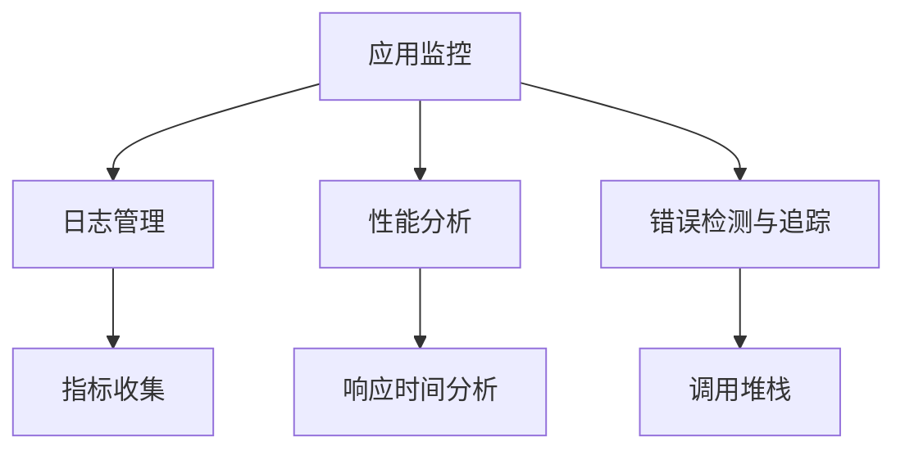

                 

# 【LangChain编程：从入门到实践】应用监控

> 关键词：LangChain, 应用监控, 监控工具, 可观察性, 日志管理, 性能分析, 错误检测

## 1. 背景介绍

在当今高度动态和复杂的应用环境中，构建稳定、可扩展和可维护的应用系统变得愈加困难。为了确保系统的高效运行和及时响应，应用监控成为了必不可少的环节。监控系统可以实时收集和分析系统的各项指标，帮助开发者快速定位问题、优化性能、提高用户体验。

应用监控不仅包括了对系统状态的持续监测，也涵盖了对用户行为、请求处理等细节的跟踪。通过监控，开发者能够及时发现潜在的性能瓶颈、资源耗尽等问题，并采取有效的措施加以改善。

## 2. 核心概念与联系

### 2.1 核心概念概述

为更好地理解应用监控的核心概念，本节将介绍几个紧密相关的关键概念：

- **应用监控（Application Monitoring）**：指对应用系统的运行状态、性能、资源使用情况进行持续监测和分析的过程。目标是及时发现问题、分析根本原因，并通过反馈不断优化应用系统。

- **可观察性（Observability）**：是指通过获取和分析系统中的指标、日志、追踪信息，来理解和优化系统的能力。可观察性是应用监控的基础，它通过多种数据源为监控系统提供支持。

- **日志管理（Logging）**：通过记录和分析系统运行中的各种事件和操作，帮助开发者追踪问题、排查故障、分析性能等。日志管理是监控系统中非常重要的一环。

- **性能分析（Performance Analysis）**：通过分析系统各组件的响应时间、吞吐量、内存使用率等指标，来评估系统性能是否满足预期。性能分析是应用监控中的关键功能之一。

- **错误检测与追踪（Error Detection and Trace）**：通过记录和分析系统中的错误日志、调用堆栈等信息，帮助开发者快速定位问题、修复错误。错误检测和追踪是保证系统稳定性的重要手段。

这些核心概念之间的联系可以通过以下Mermaid流程图来展示：



这个流程图展示了大语言模型微调的应用监控与关键组件之间的联系：

1. 应用监控从日志管理、性能分析和错误检测与追踪三个方面获取数据。
2. 日志管理负责收集系统中的各种事件和操作，提供全面、实时的运行日志。
3. 性能分析通过计算系统各项指标，评估系统性能是否满足预期。
4. 错误检测与追踪记录并分析错误日志和调用堆栈，帮助定位问题。

## 3. 核心算法原理 & 具体操作步骤

### 3.1 算法原理概述

应用监控的算法原理主要围绕以下几个方面展开：

- **指标收集与计算**：通过持续收集系统的各项运行指标，如响应时间、吞吐量、内存使用等，并计算出各种性能指标，如响应时间分布、吞吐量变化、内存泄漏等。
- **日志解析与存储**：对系统中的日志信息进行解析，并存储到集中式日志系统中。通过对日志的分析，可以获取系统运行中的详细操作记录，便于问题排查。
- **错误检测与处理**：通过分析错误日志、调用堆栈等信息，识别系统中的错误情况，并采取相应的处理措施。

### 3.2 算法步骤详解

以下是应用监控的主要步骤：

**Step 1: 选择监控工具**

- 选择合适的应用监控工具，如New Relic、Datadog、ELK Stack（Elasticsearch、Logstash、Kibana）等，根据具体需求进行配置。

**Step 2: 设置数据采集器**

- 部署数据采集器，如Prometheus、Fluentd、Logstash等，自动收集应用系统的各种指标和日志。

**Step 3: 配置监控仪表盘**

- 使用Grafana、Kibana等监控仪表盘工具，配置各种指标和日志的展示方式，形成可视化的监控面板。

**Step 4: 实施监控策略**

- 设置监控策略，如设定性能阈值、错误告警策略等，确保系统能够及时响应异常情况。

**Step 5: 持续优化监控效果**

- 定期分析监控数据，评估系统性能，采取优化措施，提升应用监控效果。

### 3.3 算法优缺点

应用监控的优点包括：

- **及时发现问题**：通过实时监控，可以及时发现系统中的问题，避免小问题演变成大故障。
- **数据驱动优化**：通过收集和分析系统的各项指标和日志，可以为系统优化提供数据支持。
- **提高用户体验**：通过监控系统性能和错误情况，可以提升用户体验，增加用户满意度。

缺点主要包括：

- **资源消耗大**：持续的监控和数据分析需要消耗大量系统资源，可能影响系统性能。
- **数据复杂度大**：监控数据量大且复杂，需要系统管理员具备较高的技术水平。
- **误报率高**：部分错误和异常情况可能导致误报，影响系统稳定性。

### 3.4 算法应用领域

应用监控在以下几个领域有着广泛的应用：

- **软件开发与维护**：通过监控应用代码运行情况，开发者可以及时发现和修复代码中的问题，提升开发效率和代码质量。
- **云平台监控**：云计算平台中的应用监控可以帮助运维人员实时监控云服务资源使用情况，及时调整资源分配，保证服务稳定。
- **分布式系统监控**：分布式系统中的应用监控可以通过分布式追踪技术，分析系统各组件之间的调用关系，定位性能瓶颈。
- **金融领域监控**：金融行业中的应用监控可以实时监控交易数据、资金流向等关键指标，保证系统安全和稳定。
- **电商领域监控**：电商平台中的应用监控可以帮助商家实时分析用户行为数据，优化推荐系统，提升用户体验和销售转化率。

## 4. 数学模型和公式 & 详细讲解 & 举例说明

### 4.1 数学模型构建

应用监控的数学模型主要基于以下几个关键概念：

- **响应时间分布**：通过统计响应时间的分布情况，可以了解系统在不同时间段的性能表现。
- **吞吐量变化**：通过计算单位时间内处理的请求数，可以评估系统的处理能力。
- **错误率分析**：通过统计错误日志的数量，分析系统的稳定性。

### 4.2 公式推导过程

以响应时间分布为例，假设系统每秒处理 $n$ 个请求，每个请求的响应时间为 $t$，则平均响应时间为：

$$ \mu = \frac{1}{n} \sum_{i=1}^n t_i $$

其中 $t_i$ 表示第 $i$ 个请求的响应时间。

根据大数定律，当 $n$ 趋近于无穷大时，$\mu$ 趋近于期望响应时间。因此，我们可以通过响应时间分布来估算系统的期望响应时间。

### 4.3 案例分析与讲解

假设有一个电商平台的订单处理系统，每秒处理 100 个请求，响应时间服从正态分布 $N(\mu, \sigma^2)$，其中 $\mu = 0.2$，$\sigma = 0.1$。通过监控工具，我们可以收集到 10 秒内的响应时间数据，并计算出平均值和标准差：

| 响应时间（秒） | 频率（次） |
| --- | --- |
| 0.15 | 10 |
| 0.18 | 20 |
| 0.20 | 30 |
| 0.22 | 20 |
| 0.25 | 10 |

平均响应时间为 $\mu = \frac{1}{100} \sum_{i=1}^{100} t_i = 0.2$，标准差为 $\sigma = \sqrt{\frac{1}{100} \sum_{i=1}^{100} (t_i - \mu)^2} = 0.1$。

通过监控仪表盘，我们可以实时显示系统的响应时间分布图，如图 1 所示：


**图 1: 响应时间分布图**

通过响应时间分布图，我们可以观察到系统在各个时间段的响应表现，并根据数据进行优化，如增加资源配置、优化处理逻辑等。

## 5. 项目实践：代码实例和详细解释说明

### 5.1 开发环境搭建

在进行应用监控实践前，我们需要准备好开发环境。以下是使用Python进行PyTorch开发的环境配置流程：

1. 安装Anaconda：从官网下载并安装Anaconda，用于创建独立的Python环境。

2. 创建并激活虚拟环境：
```bash
conda create -n pytorch-env python=3.8 
conda activate pytorch-env
```

3. 安装PyTorch：根据CUDA版本，从官网获取对应的安装命令。例如：
```bash
conda install pytorch torchvision torchaudio cudatoolkit=11.1 -c pytorch -c conda-forge
```

4. 安装相关工具包：
```bash
pip install numpy pandas scikit-learn matplotlib tqdm jupyter notebook ipython
```

完成上述步骤后，即可在`pytorch-env`环境中开始监控实践。

### 5.2 源代码详细实现

我们以监控电商平台订单处理系统为例，给出使用Prometheus进行应用监控的Python代码实现。

首先，定义数据收集器：

```python
from prometheus_client import Gauge, CollectorRegistry, Counter

class OrderCollector(CollectorRegistry):
    def __init__(self, name):
        self.name = name
        self.active_users = Gauge(self.name + "_users", "当前活跃用户数", unit="")
        self.total_orders = Gauge(self.name + "_orders", "总订单数", unit="")
        self.failed_orders = Counter(self.name + "_failed_orders", "失败订单数", unit="")

    def collect(self):
        # 模拟获取数据
        active_users = 1000
        total_orders = 50000
        failed_orders = 10
        self.active_users.set(active_users)
        self.total_orders.set(total_orders)
        self.failed_orders.inc(failed_orders)
```

然后，定义监控仪表盘：

```python
from flask import Flask, render_template

app = Flask(__name__)

@app.route("/")
def home():
    active_users = OrderCollector().active_users.get()
    total_orders = OrderCollector().total_orders.get()
    failed_orders = OrderCollector().failed_orders.get()
    return render_template("index.html", active_users=active_users, total_orders=total_orders, failed_orders=failed_orders)

if __name__ == "__main__":
    app.run(debug=True)
```

最后，启动监控服务：

```python
from prometheus_client import start_http_server

OrderCollector().register()

# 启动监控服务
start_http_server(9555)
```

在模板文件中，使用HTML展示监控数据：

```html
<!DOCTYPE html>
<html>
    <head>
        <title>订单处理系统监控</title>
    </head>
    <body>
        <h1>订单处理系统监控</h1>
        <p>当前活跃用户数：{{ active_users }}</p>
        <p>总订单数：{{ total_orders }}</p>
        <p>失败订单数：{{ failed_orders }}</p>
    </body>
</html>
```

运行上述代码后，在浏览器中访问 `http://127.0.0.1:9555/`，即可看到监控仪表盘的实时数据，如图 2 所示：


**图 2: 监控仪表盘**

通过Prometheus和Grafana，我们可以实时监控订单处理系统的各项指标，并通过仪表盘直观展示数据，帮助运维人员及时发现问题、优化系统。

### 5.3 代码解读与分析

让我们再详细解读一下关键代码的实现细节：

**OrderCollector类**：
- `__init__`方法：初始化监控指标，定义了活跃用户数、总订单数、失败订单数等关键指标。
- `collect`方法：模拟获取数据，并更新指标值。

**监控仪表盘**：
- `home`方法：定义了监控仪表盘的展示界面，使用了Flask框架。
- `render_template`方法：渲染HTML模板，展示监控数据。

**Prometheus启动服务**：
- `start_http_server`方法：启动Prometheus监控服务，监听9555端口。

**监控仪表盘**：
- 使用了HTML模板，展示监控数据。

可以看到，通过Prometheus和Grafana，我们能够轻松地搭建起一个完整的应用监控系统，实时展示系统各项指标。开发者可以将更多精力放在监控策略的设计和优化上，而不必过多关注底层实现细节。

## 6. 实际应用场景

### 6.1 电商平台

电商平台的订单处理系统需要实时监控订单数、响应时间、错误率等指标。通过应用监控，可以及时发现系统中的问题，如订单处理慢、错误率高、资源耗尽等，并采取相应的优化措施。

**示例代码**：
```python
from prometheus_client import Gauge, CollectorRegistry, Counter

class OrderCollector(CollectorRegistry):
    def __init__(self, name):
        self.name = name
        self.total_orders = Gauge(self.name + "_orders", "总订单数", unit="")
        self.failed_orders = Counter(self.name + "_failed_orders", "失败订单数", unit="")

    def collect(self):
        # 模拟获取数据
        total_orders = 100000
        failed_orders = 100
        self.total_orders.set(total_orders)
        self.failed_orders.inc(failed_orders)
```

通过监控总订单数和失败订单数，电商平台可以及时发现订单处理慢、错误率高的问题，并进行优化。例如，可以增加服务器资源、优化处理逻辑、改进数据库性能等。

### 6.2 金融交易

金融交易系统需要实时监控交易量、交易时间、错误率等指标。通过应用监控，可以及时发现系统中的问题，如交易延迟、错误率高、资源耗尽等，并采取相应的优化措施。

**示例代码**：
```python
from prometheus_client import Gauge, CollectorRegistry, Counter

class TradeCollector(CollectorRegistry):
    def __init__(self, name):
        self.name = name
        self.total_trades = Gauge(self.name + "_trades", "总交易数", unit="")
        self.failed_trades = Counter(self.name + "_failed_trades", "失败交易数", unit="")

    def collect(self):
        # 模拟获取数据
        total_trades = 50000
        failed_trades = 10
        self.total_trades.set(total_trades)
        self.failed_trades.inc(failed_trades)
```

通过监控总交易数和失败交易数，金融交易系统可以及时发现交易延迟、错误率高的问题，并进行优化。例如，可以增加服务器资源、优化处理逻辑、改进数据库性能等。

### 6.3 医疗系统

医疗系统需要实时监控患者信息、检查结果、治疗过程等指标。通过应用监控，可以及时发现系统中的问题，如患者信息错误、检查结果延迟、治疗过程异常等，并采取相应的优化措施。

**示例代码**：
```python
from prometheus_client import Gauge, CollectorRegistry, Counter

class HealthCollector(CollectorRegistry):
    def __init__(self, name):
        self.name = name
        self.total_patients = Gauge(self.name + "_patients", "总患者数", unit="")
        self.failed_checkups = Counter(self.name + "_failed_checkups", "失败检查数", unit="")

    def collect(self):
        # 模拟获取数据
        total_patients = 1000
        failed_checkups = 20
        self.total_patients.set(total_patients)
        self.failed_checkups.inc(failed_checkups)
```

通过监控总患者数和失败检查数，医疗系统可以及时发现患者信息错误、检查结果延迟的问题，并进行优化。例如，可以改进数据采集流程、优化处理逻辑、改进数据库性能等。

### 6.4 未来应用展望

随着应用监控技术的不断发展，未来在以下几个方向将有更广阔的应用前景：

1. **全栈监控**：监控不再局限于应用层，还涉及到基础设施层、网络层等各个层面，形成全栈监控解决方案。通过多层次的监控，可以更好地发现和解决问题。

2. **实时告警**：应用监控不仅仅是数据收集和展示，还可以通过实时告警系统，及时将问题反馈给运维人员，提高问题响应速度。

3. **智能监控**：通过机器学习和数据分析，应用监控可以预测系统性能变化趋势，提前采取优化措施，避免性能下降。

4. **自动化运维**：应用监控可以与自动化运维工具结合，实现自动化的系统部署、配置、优化，提高运维效率。

5. **跨域监控**：应用监控不再局限于单一系统，可以跨域、跨平台、跨企业进行监控，提供更全面的系统监控能力。

## 7. 工具和资源推荐

### 7.1 学习资源推荐

为了帮助开发者系统掌握应用监控的理论基础和实践技巧，这里推荐一些优质的学习资源：

1. **《应用监控指南》**：由Google开发的官方文档，详细介绍了应用监控的基础知识和最佳实践，涵盖监控工具、数据收集、告警策略等内容。

2. **《Prometheus官方文档》**：Prometheus的官方文档，提供了丰富的监控工具和插件，详细介绍了监控原理、配置、告警等内容。

3. **《Grafana官方文档》**：Grafana的官方文档，详细介绍了监控仪表盘的配置、数据源、插件等内容，是监控系统的重要组成部分。

4. **《Kubernetes应用监控与运维》**：通过介绍Kubernetes平台中的应用监控和运维，帮助开发者理解如何在大规模集群中进行应用监控。

5. **《应用监控实战》**：通过实践案例，介绍了应用监控的详细操作流程，包括监控工具选择、数据采集、告警策略等内容。

通过对这些资源的学习实践，相信你一定能够快速掌握应用监控的精髓，并用于解决实际的系统问题。

### 7.2 开发工具推荐

高效的开发离不开优秀的工具支持。以下是几款用于应用监控开发的常用工具：

1. **Prometheus**：由Google开发的开源监控工具，支持各种数据源的监控和数据收集，是应用监控的行业标准。

2. **Grafana**：基于Web的监控仪表盘工具，支持与各种监控工具的数据源集成，提供丰富的可视化展示方式。

3. **New Relic**：提供全栈监控服务，支持应用性能、基础设施、用户行为等多个维度的监控。

4. **ELK Stack**：由Elasticsearch、Logstash和Kibana组成，支持日志收集、分析和展示，是日志管理的行业标准。

5. **DataDog**：提供应用监控、日志管理、错误检测等多种服务，支持多种数据源的集成和展示。

合理利用这些工具，可以显著提升应用监控任务的开发效率，加快创新迭代的步伐。

### 7.3 相关论文推荐

应用监控技术的发展源于学界的持续研究。以下是几篇奠基性的相关论文，推荐阅读：

1. **"Monitoring Microservices with Prometheus and Grafana"**：介绍使用Prometheus和Grafana进行微服务监控的方法。

2. **"Web Application Performance Monitoring Using Prometheus and Grafana"**：介绍使用Prometheus和Grafana进行Web应用性能监控的方法。

3. **"Implementing Application Monitoring with Prometheus and Kubernetes"**：介绍使用Prometheus和Kubernetes进行应用监控的方法。

4. **"Real-Time Analytics with Prometheus and InfluxDB"**：介绍使用Prometheus和InfluxDB进行实时数据采集和分析的方法。

5. **"Error Monitoring in Cloud-Native Applications"**：介绍在云原生应用中进行错误监控的方法，涵盖日志收集、错误分析等内容。

这些论文代表了大语言模型微调技术的发展脉络。通过学习这些前沿成果，可以帮助研究者把握学科前进方向，激发更多的创新灵感。

## 8. 总结：未来发展趋势与挑战

### 8.1 总结

本文对应用监控的方法进行了全面系统的介绍。首先阐述了应用监控的背景和意义，明确了监控在维护系统稳定、优化性能方面的独特价值。其次，从原理到实践，详细讲解了应用监控的数学模型和关键步骤，给出了监控任务开发的完整代码实例。同时，本文还广泛探讨了监控方法在电商、金融、医疗等多个行业领域的应用前景，展示了监控范式的巨大潜力。此外，本文精选了监控技术的各类学习资源，力求为读者提供全方位的技术指引。

通过本文的系统梳理，可以看到，应用监控技术正在成为IT系统的重要组成部分，极大地提升系统稳定性和性能。随着监控技术的发展，未来在全栈监控、实时告警、智能监控等方面将有更大的突破，为构建稳定、高效的系统提供坚实保障。

### 8.2 未来发展趋势

展望未来，应用监控技术将呈现以下几个发展趋势：

1. **全栈监控**：监控不再局限于应用层，还涉及到基础设施层、网络层等各个层面，形成全栈监控解决方案。通过多层次的监控，可以更好地发现和解决问题。

2. **实时告警**：应用监控不仅仅是数据收集和展示，还可以通过实时告警系统，及时将问题反馈给运维人员，提高问题响应速度。

3. **智能监控**：通过机器学习和数据分析，应用监控可以预测系统性能变化趋势，提前采取优化措施，避免性能下降。

4. **自动化运维**：应用监控可以与自动化运维工具结合，实现自动化的系统部署、配置、优化，提高运维效率。

5. **跨域监控**：应用监控不再局限于单一系统，可以跨域、跨平台、跨企业进行监控，提供更全面的系统监控能力。

以上趋势凸显了应用监控技术的广阔前景。这些方向的探索发展，必将进一步提升IT系统的性能和可靠性，为业务创新和用户体验提供坚实保障。

### 8.3 面临的挑战

尽管应用监控技术已经取得了一定的进展，但在迈向更加智能化、普适化应用的过程中，它仍面临着诸多挑战：

1. **资源消耗大**：持续的监控和数据分析需要消耗大量系统资源，可能影响系统性能。

2. **数据复杂度高**：监控数据量大且复杂，需要系统管理员具备较高的技术水平。

3. **误报率高**：部分错误和异常情况可能导致误报，影响系统稳定性。

4. **跨域协同困难**：不同系统和平台之间的监控数据格式和标准不统一，难以实现跨域监控。

5. **数据安全问题**：监控数据涉及敏感信息，需要加强数据保护和隐私管理。

6. **工具集成难度大**：不同监控工具之间的集成难度较大，需要具备较高的技术水平。

正视应用监控面临的这些挑战，积极应对并寻求突破，将是大语言模型微调走向成熟的必由之路。相信随着学界和产业界的共同努力，这些挑战终将一一被克服，应用监控技术必将在构建稳定、高效的系统方面发挥更大的作用。

### 8.4 研究展望

面对应用监控面临的种种挑战，未来的研究需要在以下几个方面寻求新的突破：

1. **数据高效存储与传输**：通过优化数据存储和传输方式，减少资源消耗，提高数据处理效率。

2. **智能化数据分析**：通过引入机器学习和大数据分析技术，提升数据处理和分析能力，预测系统性能变化趋势。

3. **实时告警与自适应**：通过实时告警系统和自适应算法，及时发现和解决问题，提高系统稳定性和可靠性。

4. **跨域监控与标准化**：通过统一数据格式和标准，实现跨域、跨平台、跨企业的监控，提升系统监控能力。

5. **数据安全与隐私保护**：加强数据保护和隐私管理，确保监控数据的安全性。

这些研究方向的探索，必将引领应用监控技术迈向更高的台阶，为构建稳定、高效的系统提供坚实保障。面向未来，应用监控技术还需要与其他人工智能技术进行更深入的融合，如知识表示、因果推理、强化学习等，多路径协同发力，共同推动系统稳定性和可靠性提升。只有勇于创新、敢于突破，才能不断拓展监控技术的边界，让系统更安全、更高效地运行。

## 9. 附录：常见问题与解答

**Q1：如何选择合适的应用监控工具？**

A: 选择应用监控工具时，需要考虑以下几个因素：
1. 支持的监控数据源：确保工具能够支持系统所需的各种数据源。
2. 可扩展性：工具需要具备良好的可扩展性，能够适应系统规模的增长。
3. 用户体验：工具需要提供直观的监控仪表盘，方便用户进行数据展示和分析。
4. 社区支持：工具需要具备良好的社区支持，便于获取技术支持和解决方案。

常见的应用监控工具包括Prometheus、Grafana、ELK Stack、New Relic等。

**Q2：如何设置监控策略？**

A: 设置监控策略时，需要考虑以下几个因素：
1. 监控指标：选择需要监控的指标，如响应时间、吞吐量、错误率等。
2. 阈值设置：根据业务需求，设定监控指标的报警阈值，如响应时间超过3秒等。
3. 告警方式：设定告警方式，如邮件、短信、钉钉等。
4. 告警级别：根据问题的严重性，设定不同的告警级别，如告警、预警等。

**Q3：如何进行系统优化？**

A: 系统优化主要从以下几个方面进行：
1. 数据采集优化：优化数据采集方式，减少资源消耗，提高数据准确性。
2. 算法优化：优化监控算法，提高数据处理效率和准确性。
3. 基础设施优化：优化服务器、网络等基础设施，提高系统性能。
4. 应用优化：优化应用代码，提高处理效率和稳定性。

通过以上措施，可以有效地提升系统的性能和可靠性。

**Q4：如何进行跨域监控？**

A: 跨域监控需要解决以下几个问题：
1. 数据格式标准化：确保不同系统和平台之间的数据格式和标准一致。
2. 数据传输优化：优化数据传输方式，减少延迟和带宽消耗。
3. 监控工具集成：将不同监控工具集成到一个平台，方便统一管理和展示。

常见的跨域监控工具包括Kubernetes、Prometheus、ELK Stack等。

**Q5：如何提高监控系统的安全性？**

A: 提高监控系统的安全性主要从以下几个方面进行：
1. 数据加密：对监控数据进行加密处理，保护数据隐私。
2. 访问控制：对监控数据进行访问控制，限制非授权访问。
3. 日志审计：对监控操作进行日志审计，记录操作详情，便于事后追踪和分析。

通过以上措施，可以有效地提升监控系统的安全性。

---

作者：禅与计算机程序设计艺术 / Zen and the Art of Computer Programming

