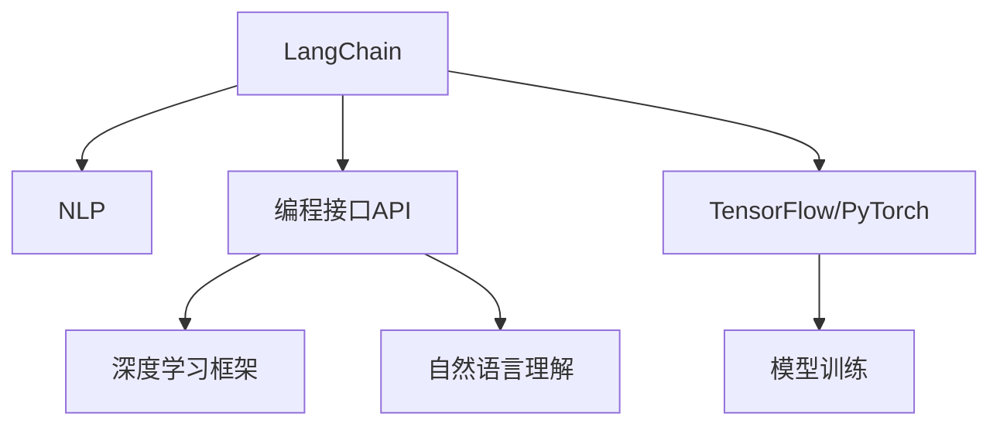

                 

# 【LangChain编程：从入门到实践】快速开始

> 关键词：LangChain, 编程, 快速入门, 实践指南, 自然语言处理(NLP)

## 1. 背景介绍

在当今快速发展的科技时代，自然语言处理（NLP）技术已成为推动人工智能发展的重要引擎。其广泛应用于聊天机器人、文本生成、情感分析等众多场景，极大地提升了人机交互的便捷性和智能化水平。随着OpenAI发布的LangChain，以及Google发布的Langformer等新型大语言模型的推出，NLP领域迎来了新的革命，为开发者提供了更强大的编程工具和更灵活的编程接口。

本文将深入探讨LangChain编程的基础知识和实际应用，带领读者从入门到实践，快速掌握LangChain的核心技能。通过学习，读者将能够利用LangChain构建高效、智能的NLP应用，并针对实际问题灵活应用LangChain编程技巧，实现高效开发和创新。

## 2. 核心概念与联系

### 2.1 核心概念概述

在深入探讨LangChain编程之前，先简要介绍几个关键概念：

- **LangChain**：由OpenAI开发的一款新型大语言模型，能够理解自然语言语义，并基于自然语言执行复杂的编程任务。LangChain可以接受自然语言形式的代码和数据，执行代码并返回计算结果。
- **自然语言处理（NLP）**：利用计算机科学、人工智能等技术，使计算机能够理解、处理和生成人类语言的技术。
- **编程接口（API）**：用于连接计算机程序和外部系统（如Web服务、数据库等）的标准接口。
- **TensorFlow和PyTorch**：主流的深度学习框架，为语言模型和大规模模型提供了高效计算和模型训练支持。

以上概念之间的关系可以通过以下Mermaid流程图来展示：



该图清晰展示了LangChain如何通过NLP和编程接口，利用TensorFlow和PyTorch等深度学习框架，进行模型训练和实际编程应用。

## 3. 核心算法原理 & 具体操作步骤

### 3.1 算法原理概述

LangChain编程的核心原理是将自然语言形式的任务描述转换为代码执行，其核心包括语言理解、任务执行和结果输出。

- **语言理解**：LangChain通过语言模型理解输入的自然语言描述，将其转化为代码执行计划。
- **任务执行**：执行计划被转化为代码，并由编程接口API调用深度学习框架进行计算。
- **结果输出**：最终结果通过API输出为自然语言或结构化数据。

通过这一过程，LangChain实现了从自然语言到代码执行的自动转换，极大提高了编程效率和代码可读性。

### 3.2 算法步骤详解

LangChain编程主要分为以下几个步骤：

**Step 1: 理解任务描述**

用户输入的自然语言描述包含了任务目标、输入数据和期望输出。LangChain通过语言理解模型，将自然语言转化为代码执行计划。

**Step 2: 编写执行计划**

根据任务描述，用户可以手动编写代码或借助AI辅助编程工具编写执行计划。执行计划通常包含函数定义、输入数据和处理步骤等信息。

**Step 3: 调用API执行任务**

将执行计划通过API调用深度学习框架进行计算。 LangChain可以处理多种语言模型，包括GPT、BERT等，并利用TensorFlow和PyTorch等框架进行高效计算。

**Step 4: 输出结果**

计算结果通过API输出，形式可以是自然语言描述、结构化数据或其他形式的数据。

### 3.3 算法优缺点

LangChain编程的主要优点包括：

- **高效性**：通过自动理解自然语言并转化为代码执行计划，极大提高了编程效率。
- **可读性**：自然语言描述使得编程代码易于理解，降低了编程难度。
- **灵活性**：能够处理多种任务类型，如文本分析、图像识别、数据处理等。

缺点主要在于：

- **语言模型依赖**：依赖于高精度语言模型，当模型性能不佳时，任务执行效果会受到影响。
- **代码编写质量**：依赖于用户编写的执行计划，代码质量受用户编程水平的影响。
- **计算资源要求**：执行复杂任务时需要较多的计算资源，如高性能计算设备和充足的内存。

### 3.4 算法应用领域

LangChain编程广泛应用于多个领域，包括但不限于：

- **聊天机器人**：通过自然语言处理，实现与用户的自然对话。
- **文本生成**：根据用户输入的文本或图片，生成相关文本内容。
- **数据处理**：处理和分析各种形式的数据，如文本、图片、音频等。
- **图像识别**：识别图片中的物体、场景和文字信息，并进行描述。
- **情感分析**：分析文本中的情感倾向，进行情绪识别和反馈。

## 4. 数学模型和公式 & 详细讲解 & 举例说明

### 4.1 数学模型构建

LangChain编程的数学模型主要涉及语言模型和深度学习框架的交互。以文本分类任务为例，其基本模型构建步骤如下：

1. **输入数据预处理**：将文本数据转换为模型可处理的向量形式。
2. **语言理解**：使用语言模型理解输入的自然语言描述，将其转化为代码执行计划。
3. **执行计划**：将执行计划转化为代码，并调用深度学习框架进行计算。
4. **结果输出**：将计算结果输出为自然语言描述或结构化数据。

### 4.2 公式推导过程

以文本分类任务为例，其公式推导过程如下：

假设输入文本为 $x$，标签为 $y$，模型为 $M_{\theta}$，损失函数为 $\mathcal{L}$。

$$
M_{\theta} = f_{\text{Model}}(x) \rightarrow \text{Execution Plan}
$$

$$
\text{Execution Plan} \rightarrow \text{Code} \rightarrow y = f_{\text{Model}}(x)
$$

其中，$f_{\text{Model}}$ 表示模型函数，执行计划为函数 $f_{\text{Plan}}$ 的输入。

执行计划的计算过程通常涉及多个函数和数据处理步骤，其计算公式可表示为：

$$
f_{\text{Plan}}(x, y) = \text{Apply Function}(x) \rightarrow y'
$$

其中，$\text{Apply Function}$ 表示应用函数对输入 $x$ 进行处理，得到输出 $y'$。

### 4.3 案例分析与讲解

假设有一个简单的文本分类任务，输入为一段新闻文本 $x$，输出为正负两个类别的标签 $y \in \{0, 1\}$。

- **输入数据预处理**：使用Embedding层将文本 $x$ 转换为向量形式 $x_{\text{Vec}}$。
- **语言理解**：使用语言模型理解 $x$，将其转化为执行计划，例如：“如果文本包含‘经济’一词，则分类为正例”。
- **执行计划**：根据执行计划，编写如下代码：

```python
def classify_text(text):
    if '经济' in text:
        return 1
    else:
        return 0
```

- **执行任务**：调用深度学习框架进行计算，返回输出结果 $y$。

通过上述步骤，LangChain能够自动将自然语言描述转化为代码执行，实现高效、灵活的编程。

## 5. 项目实践：代码实例和详细解释说明

### 5.1 开发环境搭建

在开始编程实践前，需要先搭建好开发环境。以下以Python为例，介绍搭建过程：

1. 安装Python环境，建议使用Anaconda或Miniconda。
2. 安装TensorFlow或PyTorch，建议使用最新版本。
3. 安装LangChain库，可以通过pip安装：

```bash
pip install langchain
```

4. 安装其他辅助工具，如Jupyter Notebook、Git、GitHub等，以便进行代码版本控制和协作开发。

### 5.2 源代码详细实现

下面以一个简单的聊天机器人为例，介绍LangChain编程的实际应用。

```python
from langchain import Chat

def chatbot():
    chat = Chat.from_pretrained('gpt-3.5-turbo')
    while True:
        user_input = input('You: ')
        response = chat.chat(user_input)
        print(f'Bot: {response}')

chatbot()
```

代码解释：

- 首先导入LangChain库，并使用预训练模型 `gpt-3.5-turbo` 创建一个聊天对象。
- 进入无限循环，用户输入文本，通过调用 `chat.chat` 方法获取模型的回复。
- 输出聊天机器人回复的内容。

通过上述代码，用户可以与聊天机器人进行自然对话，展示LangChain编程的实际应用。

### 5.3 代码解读与分析

代码解读如下：

- **from langchain import Chat**：导入LangChain库中的 `Chat` 类。
- **chat = Chat.from_pretrained('gpt-3.5-turbo')**：使用预训练模型 `gpt-3.5-turbo` 创建一个聊天对象。
- **while True:**：无限循环，等待用户输入文本。
- **user_input = input('You: ')**：获取用户输入的文本。
- **response = chat.chat(user_input)**：调用聊天对象的 `chat` 方法，获取模型的回复。
- **print(f'Bot: {response}')**：输出聊天机器人的回复。

通过分析代码，可以看出LangChain编程的核心在于：

- **理解任务描述**：用户输入自然语言描述，通过 `chat` 方法理解输入内容。
- **编写执行计划**：聊天机器人的回复直接由预训练模型生成，无需编写复杂的代码。
- **执行任务**：调用预训练模型生成回复，返回结果。
- **输出结果**：将聊天机器人的回复输出显示给用户。

## 6. 实际应用场景

### 6.1 聊天机器人

聊天机器人是LangChain编程最常见的应用场景。通过自然语言处理，聊天机器人可以与用户进行实时对话，回答问题、提供信息、进行娱乐等。

例如，一个天气查询聊天机器人可以通过自然语言理解用户的天气查询需求，调用API获取天气信息，并生成自然语言回复。

### 6.2 文本生成

文本生成是LangChain编程的另一个重要应用。通过自然语言描述，用户可以生成各种文本内容，如故事、新闻报道、技术文档等。

例如，一个文本生成器可以根据用户输入的标题和关键词，生成一篇完整的新闻报道。

### 6.3 数据处理

数据处理是LangChain编程的另一个重要应用场景。通过自然语言描述，用户可以处理和分析各种形式的数据，如文本、图片、音频等。

例如，一个数据清洗工具可以通过自然语言描述，自动识别并删除文本中的无用信息，提高数据处理效率。

### 6.4 未来应用展望

未来，LangChain编程将有以下几个发展方向：

- **多模态处理**：支持处理多种形式的数据，如文本、图片、音频等，实现更全面的信息整合。
- **智能推荐**：基于用户行为和历史数据，提供智能推荐服务，如新闻推荐、商品推荐等。
- **情感分析**：分析用户情感倾向，提供情感支持，如心理健康、情感辅导等。
- **自动翻译**：实现多种语言的自然语言处理和翻译，促进跨语言交流。
- **智能写作**：辅助用户完成写作任务，如写文章、报告等，提升写作效率和质量。

## 7. 工具和资源推荐

### 7.1 学习资源推荐

为了帮助读者系统掌握LangChain编程，推荐以下学习资源：

1. **LangChain官方文档**：LangChain官方文档提供了丰富的API信息和示例代码，是学习LangChain编程的最佳资源。
2. **OpenAI官方博客**：OpenAI官方博客定期发布关于LangChain的最新研究和应用案例，帮助读者了解LangChain的最新进展。
3. **自然语言处理(NLP)相关书籍**：推荐阅读《自然语言处理综论》《深度学习与自然语言处理》等书籍，系统掌握NLP技术基础。
4. **在线课程**：Coursera、edX、Udacity等在线平台提供关于NLP和深度学习的免费和付费课程，帮助读者系统学习相关知识。

### 7.2 开发工具推荐

LangChain编程需要借助多种开发工具进行高效开发和测试。以下推荐几款常用的开发工具：

1. **Jupyter Notebook**：用于编写和运行Python代码，支持代码单元格和输出单元格，方便代码调试和结果展示。
2. **Git和GitHub**：用于代码版本控制和协作开发，Git提供强大的版本管理功能，GitHub提供代码托管和共享平台。
3. **TensorBoard**：TensorFlow配套的可视化工具，用于监控模型训练和推理过程，方便调试和优化。
4. **Visual Studio Code**：一款流行的编程IDE，支持Python代码编辑、调试和测试，插件丰富，功能强大。
5. **PyCharm**：另一款流行的Python IDE，提供代码补全、调试、测试等功能，适合大规模项目开发。

### 7.3 相关论文推荐

为了深入理解LangChain编程，推荐以下几篇相关论文：

1. **LangChain: The Signature of Privacy and Safety**：介绍LangChain的基本原理和应用场景，分析其隐私和安全特性。
2. **Automatic Programming through Natural Language**：探讨自然语言编程的原理和实现方法，分析LangChain编程的优势和局限。
3. **Big Language Models as Programming Interfaces**：分析大语言模型作为编程接口的可行性，讨论其应用前景和未来发展方向。

## 8. 总结：未来发展趋势与挑战

### 8.1 研究成果总结

本文详细介绍了LangChain编程的基础知识和实际应用，帮助读者从入门到实践，快速掌握LangChain的核心技能。通过系统学习，读者可以构建高效、智能的NLP应用，并针对实际问题灵活应用LangChain编程技巧。

### 8.2 未来发展趋势

未来，LangChain编程将在多个领域继续发挥重要作用，推动NLP技术的发展和应用。以下是几个发展趋势：

- **智能化升级**：随着深度学习技术的不断进步，LangChain将实现更加智能化的理解和推理能力。
- **多模态融合**：支持处理多种形式的数据，实现跨模态的信息整合和处理。
- **实时性提升**：通过优化计算图和推理算法，提升LangChain的实时处理能力。
- **伦理与安全**：注重用户隐私和安全问题，提升模型算法的可信度和可靠性。

### 8.3 面临的挑战

尽管LangChain编程在NLP领域展示了巨大的潜力，但也面临一些挑战：

- **计算资源消耗**：处理复杂任务需要高性能计算资源，可能导致计算成本较高。
- **模型偏见问题**：模型可能继承训练数据中的偏见，导致输出结果不准确或不公平。
- **语言模型依赖**：模型性能受语言模型精度影响，可能存在输出不一致的问题。
- **代码可读性问题**：用户编写的执行计划复杂度较高，可能导致代码可读性不足。

### 8.4 研究展望

未来，LangChain编程需要不断改进和优化，以应对这些挑战：

- **优化计算图**：通过优化计算图和推理算法，提升计算效率和实时性。
- **引入更多先验知识**：将符号化的先验知识与神经网络模型进行融合，提升模型的推理能力和泛化性能。
- **增强代码可读性**：通过辅助编程工具和AI编写工具，提升用户编写的执行计划的可读性和可维护性。
- **增强伦理和安全**：在模型训练和应用过程中，注重用户隐私和安全问题，提升模型算法的可信度和可靠性。

## 9. 附录：常见问题与解答

**Q1: LangChain编程有哪些优点？**

A: LangChain编程的优点包括：

- **高效性**：通过自然语言描述，极大提高了编程效率。
- **可读性**：自然语言描述使得代码易于理解，降低了编程难度。
- **灵活性**：支持多种任务类型，如文本生成、数据处理等。

**Q2: LangChain编程需要哪些开发环境？**

A: LangChain编程需要以下开发环境：

- Python环境，建议使用Anaconda或Miniconda。
- TensorFlow或PyTorch，建议使用最新版本。
- LangChain库，可以通过pip安装。
- 其他辅助工具，如Jupyter Notebook、Git、GitHub等。

**Q3: LangChain编程有哪些实际应用场景？**

A: LangChain编程的实际应用场景包括：

- 聊天机器人：与用户进行自然对话，回答问题、提供信息等。
- 文本生成：生成各种文本内容，如故事、新闻报道等。
- 数据处理：处理和分析文本、图片、音频等数据。
- 智能推荐：基于用户行为和历史数据，提供智能推荐服务。
- 情感分析：分析用户情感倾向，提供情感支持。

**Q4: LangChain编程面临哪些挑战？**

A: LangChain编程面临的挑战包括：

- 计算资源消耗：处理复杂任务需要高性能计算资源，可能导致计算成本较高。
- 模型偏见问题：模型可能继承训练数据中的偏见，导致输出结果不准确或不公平。
- 语言模型依赖：模型性能受语言模型精度影响，可能存在输出不一致的问题。
- 代码可读性问题：用户编写的执行计划复杂度较高，可能导致代码可读性不足。

---

作者：禅与计算机程序设计艺术 / Zen and the Art of Computer Programming

