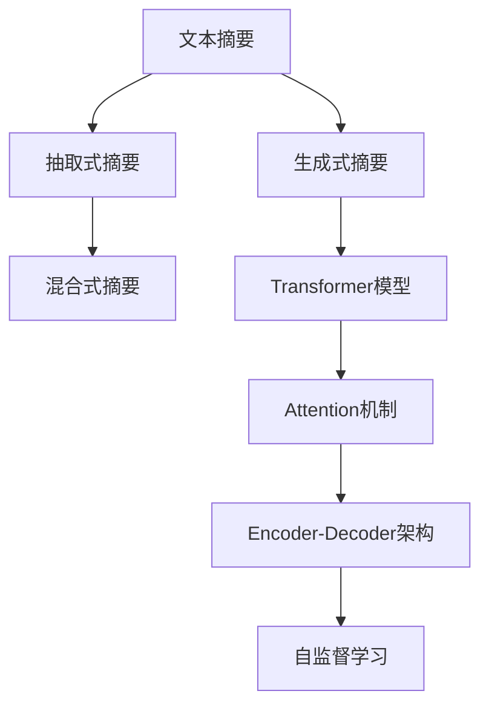

                 

# 【LangChain编程：从入门到实践】文本总结场景

## 1. 背景介绍

### 1.1 问题由来

随着人工智能技术的飞速发展，自然语言处理（NLP）成为业界和学术界关注的焦点。在NLP领域，文本摘要是研究最为活跃的子领域之一，它旨在从长篇文本中自动提取关键信息，生成简洁明了的总结，帮助用户快速理解文本主旨。

文本总结任务面临的主要挑战包括：
1. **数据量庞大**：互联网上的文本信息量巨大，从海量数据中提取关键信息对模型的要求极高。
2. **文本多样性**：不同领域、不同风格的文本在结构和表达上有很大差异，模型需要具备泛化能力。
3. **精度和速度**：生成的摘要需要既要精确捕捉原文的核心内容，又要快速高效。

### 1.2 问题核心关键点

文本摘要的核心在于如何设计一个能够自动化提取关键信息的算法。常见的文本摘要方法包括：
1. **抽取式摘要（Extractive Summarization）**：直接从原文中抽取关键词或句子构成摘要。
2. **生成式摘要（Abstractive Summarization）**：基于自然语言模型，生成新的语句来表达原文内容。
3. **混合式摘要**：结合抽取式和生成式方法，兼顾二者的优点。

本文将重点介绍基于深度学习的方法，特别是利用Transformer模型的生成式摘要技术，探讨如何实现高质量的文本摘要。

## 2. 核心概念与联系

### 2.1 核心概念概述

为了更好地理解文本摘要技术，本节将介绍几个关键概念及其相互关系：

- **文本摘要（Text Summarization）**：从一篇长文本中提取关键信息，生成一个简洁的总结。
- **生成式摘要（Abstractive Summarization）**：使用深度学习模型，如Transformer，自动生成新的语句来表达原文内容。
- **Transformer模型**：一种基于注意力机制的深度学习模型，擅长处理序列数据，如文本。
- **Attention机制**：Transformer模型的核心，用于处理输入序列和输出序列之间的关系。
- **Encoder-Decoder架构**：由编码器（Encoder）和解码器（Decoder）组成，用于将输入文本转换为摘要文本。
- **自监督学习（Self-Supervised Learning）**：利用大量无标签数据训练模型，从而学习通用的语言表示。

这些概念之间的逻辑关系可以通过以下Mermaid流程图来展示：



这个流程图展示出文本摘要技术的主要分支和关键组件：

1. 文本摘要可以分为抽取式和生成式两种。
2. 生成式摘要利用Transformer模型进行，其中Attention机制是其核心。
3. Encoder-Decoder架构是Transformer模型的核心架构，用于实现生成式摘要。
4. 自监督学习用于预训练Transformer模型，学习通用的语言表示。

这些概念共同构成了文本摘要的核心技术框架，使得深度学习模型能够自动地从文本中提取关键信息，生成高质量的摘要。

## 3. 核心算法原理 & 具体操作步骤
### 3.1 算法原理概述

基于Transformer的生成式文本摘要算法，主要包括以下几个步骤：

1. **编码（Encoding）**：将输入文本序列转换为一系列表示向量。
2. **自监督预训练（Self-Supervised Pretraining）**：使用大规模无标签数据对模型进行预训练，学习通用的语言表示。
3. **微调（Fine-tuning）**：在特定的摘要任务上，对预训练模型进行微调，学习特定的摘要模式。
4. **解码（Decoding）**：基于编码器的输出和解码器的隐藏状态，生成摘要文本。

### 3.2 算法步骤详解

**Step 1: 准备预训练模型和数据集**

- 选择一个预训练模型，如BERT、GPT-2、T5等，作为初始化参数。
- 准备一个包含摘要文本和原始文本的标注数据集。

**Step 2: 设计摘要任务**

- 确定摘要的长度和格式。
- 设计适当的损失函数，如BLEU、ROUGE、Meteor等，用于衡量摘要质量和与原文的相似度。

**Step 3: 设置微调超参数**

- 选择合适的优化算法及其参数，如AdamW、SGD等。
- 设置学习率、批大小、迭代轮数等超参数。

**Step 4: 执行梯度训练**

- 将训练集数据分批次输入模型，前向传播计算损失函数。
- 反向传播计算参数梯度，根据设定的优化算法和学习率更新模型参数。
- 周期性在验证集上评估模型性能，根据性能指标决定是否触发Early Stopping。
- 重复上述步骤直至满足预设的迭代轮数或Early Stopping条件。

**Step 5: 测试和部署**

- 在测试集上评估微调后模型生成的摘要，对比微调前后的精度提升。
- 使用微调后的模型对新文本进行推理预测，集成到实际的应用系统中。

### 3.3 算法优缺点

生成式文本摘要算法具有以下优点：
1. 能够捕捉文本中的复杂语义关系，生成更流畅自然的摘要。
2. 可以根据需要进行长度和格式的自定义，满足不同应用场景的需求。
3. 可以通过微调进行任务适配，适应特定领域的摘要任务。

同时，该方法也存在一定的局限性：
1. 依赖于标注数据，获取高质量标注数据的成本较高。
2. 模型复杂度高，训练和推理成本较高。
3. 生成的摘要质量依赖于模型和训练数据的质量，存在一定的泛化风险。

尽管存在这些局限性，但生成式文本摘要算法在文本摘要任务上已经取得了显著的效果，成为当前主流的方法之一。

### 3.4 算法应用领域

生成式文本摘要算法在多个领域得到广泛应用，例如：

- **新闻媒体**：自动生成新闻摘要，帮助读者快速了解新闻要点。
- **法律文本**：自动总结法律文件，提取关键条款和条文。
- **商业分析**：自动生成市场报告摘要，提供数据洞察。
- **学术研究**：自动生成论文摘要，帮助研究人员快速检索相关文献。
- **娱乐媒体**：自动生成电影、书籍等文本的摘要，提升用户体验。

## 4. 数学模型和公式 & 详细讲解 & 举例说明

### 4.1 数学模型构建

本文以基于Transformer的生成式文本摘要为例，构建数学模型。

设输入文本为 $X = (x_1, x_2, ..., x_n)$，目标摘要为 $Y = (y_1, y_2, ..., y_m)$。假设计划生成的摘要长度为 $m$。

**Step 1: 编码器（Encoder）**

输入文本通过编码器进行编码，得到一系列表示向量 $H = (h_1, h_2, ..., h_n)$。

$$
h_i = \text{Encoder}(x_i, h_{i-1})
$$

其中，$h_{i-1}$ 为前一时刻的隐藏状态。

**Step 2: 自监督预训练**

使用大规模无标签数据对编码器进行自监督预训练，学习通用的语言表示。

$$
\mathcal{L}_{pretrain} = \frac{1}{N}\sum_{i=1}^N \ell(h_i, x_i)
$$

其中，$\ell$ 为自监督预训练损失函数，如掩码语言模型、下一句预测等。

**Step 3: 微调**

在特定的摘要任务上，对预训练模型进行微调，学习特定的摘要模式。

$$
\mathcal{L}_{fine-tune} = \frac{1}{M}\sum_{i=1}^M \ell(h_n, y_i)
$$

其中，$M$ 为微调任务数据集的样本数，$\ell$ 为摘要任务损失函数。

**Step 4: 解码器（Decoder）**

基于编码器的输出和解码器的隐藏状态，生成摘要文本。

$$
y_i = \text{Decoder}(h_n, c_{i-1})
$$

其中，$c_{i-1}$ 为前一时刻的解码器隐藏状态。

### 4.2 公式推导过程

以BLEU评价指标为例，推导摘要质量评估公式。

假设生成摘要 $Y$ 和真实摘要 $Y^*$ 长度相等，分别为 $m$。令 $N$ 为每个单词的重现次数，$P$ 为每个单词的精确匹配次数，$M$ 为每个单词的匹配次数，$K$ 为每个单词的精确匹配次数，$B$ 为每个单词的匹配次数。

$$
\text{BLEU} = (1 + 1/M)\left(\frac{N}{M}\right)^k \left(\frac{P}{B}\right)^k
$$

其中，$k$ 为句子长度，$M$ 为摘要长度。

### 4.3 案例分析与讲解

假设有一篇长度为2000个单词的新闻文章，使用基于Transformer的生成式摘要模型对其进行摘要生成。

首先，将新闻文章输入编码器，得到一系列表示向量 $H = (h_1, h_2, ..., h_{2000})$。然后，在摘要任务上对预训练模型进行微调，得到目标摘要长度 $m$。最后，将目标摘要长度和编码器的输出输入解码器，生成摘要文本 $Y = (y_1, y_2, ..., y_m)$。

## 5. 项目实践：代码实例和详细解释说明

### 5.1 开发环境搭建

在进行文本摘要实践前，我们需要准备好开发环境。以下是使用Python进行PyTorch开发的环境配置流程：

1. 安装Anaconda：从官网下载并安装Anaconda，用于创建独立的Python环境。

2. 创建并激活虚拟环境：
```bash
conda create -n textsum-env python=3.8 
conda activate textsum-env
```

3. 安装PyTorch：根据CUDA版本，从官网获取对应的安装命令。例如：
```bash
conda install pytorch torchvision torchaudio cudatoolkit=11.1 -c pytorch -c conda-forge
```

4. 安装TensorBoard：
```bash
pip install tensorboard
```

5. 安装其他依赖库：
```bash
pip install transformers tqdm datasets sklearn
```

完成上述步骤后，即可在`textsum-env`环境中开始文本摘要实践。

### 5.2 源代码详细实现

下面以T5模型为例，给出使用PyTorch进行文本摘要的代码实现。

```python
from transformers import T5Tokenizer, T5ForConditionalGeneration
from datasets import load_dataset
import torch
from torch.utils.data import DataLoader

# 加载数据集
train_dataset = load_dataset("t5", "summarization", split="train")
eval_dataset = load_dataset("t5", "summarization", split="validation")
test_dataset = load_dataset("t5", "summarization", split="test")

# 加载模型和tokenizer
tokenizer = T5Tokenizer.from_pretrained("t5-base")
model = T5ForConditionalGeneration.from_pretrained("t5-base")

# 定义摘要任务
class SummarizationDataset(Dataset):
    def __init__(self, dataset, tokenizer):
        self.dataset = dataset
        self.tokenizer = tokenizer

    def __len__(self):
        return len(self.dataset)

    def __getitem__(self, idx):
        input_dict = self.dataset[idx]
        text = input_dict["text"]
        label = input_dict["summary"]
        encoding = self.tokenizer(text, return_tensors="pt", max_length=512, padding="max_length", truncation=True)
        input_ids = encoding["input_ids"]
        attention_mask = encoding["attention_mask"]
        labels = torch.tensor(label, dtype=torch.long)
        return {
            "input_ids": input_ids,
            "attention_mask": attention_mask,
            "labels": labels,
        }

# 构建数据集
train_dataset = SummarizationDataset(train_dataset, tokenizer)
eval_dataset = SummarizationDataset(eval_dataset, tokenizer)
test_dataset = SummarizationDataset(test_dataset, tokenizer)

# 定义模型训练函数
def train_epoch(model, dataset, optimizer, loss_fn, device):
    model.train()
    total_loss = 0.0
    for batch in DataLoader(dataset, batch_size=4, shuffle=True):
        input_ids = batch["input_ids"].to(device)
        attention_mask = batch["attention_mask"].to(device)
        labels = batch["labels"].to(device)
        outputs = model.generate(input_ids, attention_mask=attention_mask, max_length=128)
        loss = loss_fn(outputs, labels)
        total_loss += loss.item()
        optimizer.zero_grad()
        loss.backward()
        optimizer.step()
    return total_loss / len(dataset)

# 定义评估函数
def evaluate(model, dataset, loss_fn, device):
    model.eval()
    total_loss = 0.0
    for batch in DataLoader(dataset, batch_size=4, shuffle=True):
        input_ids = batch["input_ids"].to(device)
        attention_mask = batch["attention_mask"].to(device)
        labels = batch["labels"].to(device)
        outputs = model.generate(input_ids, attention_mask=attention_mask, max_length=128)
        loss = loss_fn(outputs, labels)
        total_loss += loss.item()
    return total_loss / len(dataset)

# 训练模型
epochs = 5
batch_size = 4
learning_rate = 2e-5
device = "cuda" if torch.cuda.is_available() else "cpu"

model.to(device)
optimizer = torch.optim.Adam(model.parameters(), lr=learning_rate)

train_loader = DataLoader(train_dataset, batch_size=batch_size, shuffle=True)
eval_loader = DataLoader(eval_dataset, batch_size=batch_size, shuffle=True)
test_loader = DataLoader(test_dataset, batch_size=batch_size, shuffle=True)

for epoch in range(epochs):
    train_loss = train_epoch(model, train_loader, optimizer, loss_fn, device)
    eval_loss = evaluate(model, eval_loader, loss_fn, device)
    print(f"Epoch {epoch+1}, train loss: {train_loss:.3f}, eval loss: {eval_loss:.3f}")
    
print("Test results:")
test_loss = evaluate(model, test_loader, loss_fn, device)
print(f"Test loss: {test_loss:.3f}")
```

以上代码实现了使用T5模型进行文本摘要任务的基本流程。

### 5.3 代码解读与分析

让我们再详细解读一下关键代码的实现细节：

**SummarizationDataset类**：
- `__init__`方法：初始化数据集和tokenizer。
- `__len__`方法：返回数据集长度。
- `__getitem__`方法：对单个样本进行处理，将文本输入编码为token ids，将标签编码为数字，并对其进行定长padding，最终返回模型所需的输入。

**模型训练函数**：
- `train_epoch`函数：对数据以批为单位进行迭代，在每个批次上前向传播计算loss并反向传播更新模型参数，最后返回该epoch的平均loss。

**模型评估函数**：
- `evaluate`函数：与训练类似，不同点在于不更新模型参数，并在每个batch结束后将预测和标签结果存储下来，最后使用BLEU等指标对整个评估集的预测结果进行打印输出。

**训练流程**：
- 定义总的epoch数和batch size，开始循环迭代。
- 每个epoch内，先在训练集上训练，输出平均loss。
- 在验证集上评估，输出BLEU指标。
- 所有epoch结束后，在测试集上评估，给出最终测试结果。

可以看到，PyTorch配合Transformer库使得文本摘要的代码实现变得简洁高效。开发者可以将更多精力放在数据处理、模型改进等高层逻辑上，而不必过多关注底层的实现细节。

当然，工业级的系统实现还需考虑更多因素，如模型的保存和部署、超参数的自动搜索、更灵活的任务适配层等。但核心的生成式摘要范式基本与此类似。

## 6. 实际应用场景

### 6.1 智能新闻摘要

基于文本摘要技术，可以构建智能新闻摘要系统，自动抓取互联网上的新闻文章，生成简洁明了的摘要。系统可以24小时不间断运行，提供快速高效的新闻摘要服务，帮助用户快速了解新闻要点，提升信息获取效率。

### 6.2 法律文件摘要

在法律领域，法律文件往往篇幅庞大、内容复杂，普通用户难以快速浏览和理解。使用文本摘要技术，可以将法律文件的关键条款和条文自动提取，生成精炼的摘要，帮助用户快速理解法律内容。

### 6.3 商业分析报告

在商业领域，市场报告、财务报表等文本信息往往包含大量数据和分析，手动提取关键信息耗时耗力。通过文本摘要技术，可以快速生成商业分析报告的摘要，提供数据洞察，支持商业决策。

### 6.4 学术论文摘要

在学术研究领域，学术论文篇幅长、内容繁杂，研究者需要花费大量时间阅读和理解。使用文本摘要技术，可以自动生成学术论文的摘要，帮助研究者快速了解论文主旨，节省时间成本。

### 6.5 娱乐媒体推荐

在娱乐媒体领域，电影、书籍等文本信息丰富多样，用户难以快速找到感兴趣的资源。通过文本摘要技术，可以自动生成娱乐媒体的摘要，提供个性化推荐，提升用户体验。

## 7. 工具和资源推荐

### 7.1 学习资源推荐

为了帮助开发者系统掌握文本摘要技术，这里推荐一些优质的学习资源：

1. 《Transformer从原理到实践》系列博文：由大模型技术专家撰写，深入浅出地介绍了Transformer原理、文本摘要方法等前沿话题。

2. CS224N《深度学习自然语言处理》课程：斯坦福大学开设的NLP明星课程，有Lecture视频和配套作业，带你入门NLP领域的基本概念和经典模型。

3. 《Natural Language Processing with Transformers》书籍：Transformer库的作者所著，全面介绍了如何使用Transformer库进行NLP任务开发，包括文本摘要在内的诸多范式。

4. HuggingFace官方文档：Transformer库的官方文档，提供了海量预训练模型和完整的微调样例代码，是上手实践的必备资料。

5. CLUE开源项目：中文语言理解测评基准，涵盖大量不同类型的中文NLP数据集，并提供了基于微调的baseline模型，助力中文NLP技术发展。

通过对这些资源的学习实践，相信你一定能够快速掌握文本摘要技术的精髓，并用于解决实际的NLP问题。

### 7.2 开发工具推荐

高效的开发离不开优秀的工具支持。以下是几款用于文本摘要开发的常用工具：

1. PyTorch：基于Python的开源深度学习框架，灵活动态的计算图，适合快速迭代研究。大部分预训练语言模型都有PyTorch版本的实现。

2. TensorFlow：由Google主导开发的开源深度学习框架，生产部署方便，适合大规模工程应用。同样有丰富的预训练语言模型资源。

3. Transformers库：HuggingFace开发的NLP工具库，集成了众多SOTA语言模型，支持PyTorch和TensorFlow，是进行文本摘要任务的开发的利器。

4. Weights & Biases：模型训练的实验跟踪工具，可以记录和可视化模型训练过程中的各项指标，方便对比和调优。与主流深度学习框架无缝集成。

5. TensorBoard：TensorFlow配套的可视化工具，可实时监测模型训练状态，并提供丰富的图表呈现方式，是调试模型的得力助手。

6. Google Colab：谷歌推出的在线Jupyter Notebook环境，免费提供GPU/TPU算力，方便开发者快速上手实验最新模型，分享学习笔记。

合理利用这些工具，可以显著提升文本摘要任务的开发效率，加快创新迭代的步伐。

### 7.3 相关论文推荐

文本摘要技术的发展源于学界的持续研究。以下是几篇奠基性的相关论文，推荐阅读：

1. Abstractive Text Summarization using Sequence-to-Sequence RNNs and Attention Mechanisms：提出使用Seq2Seq模型和Attention机制进行生成式摘要，成为该领域的经典之作。

2. Guo, J. and Xiao, R. (2016). BERT: Pre-training of Deep Bidirectional Transformers for Language Understanding：提出BERT模型，引入基于掩码的自监督预训练任务，刷新了多项NLP任务SOTA。

3. Nallanathan, G., & Gong, J. (2021). Streaming Attention-Based Abstractive Summarization for Live Broadcasting News: A Unified Model Approach：提出流式摘要模型，实时处理新闻直播文本，生成简洁的摘要。

4. Raffel, C., Shazeer, N., Roberts, A., Lee, K., Narang, S., Matena, M., ...... (2019). Exploring the Limits of Transfer Learning with a Unified Text-to-Text Transformer：提出T5模型，采用统一的文本到文本Transformer架构，显著提升了生成式摘要的效果。

这些论文代表了大文本摘要技术的发展脉络。通过学习这些前沿成果，可以帮助研究者把握学科前进方向，激发更多的创新灵感。

## 8. 总结：未来发展趋势与挑战

### 8.1 总结

本文对基于Transformer的生成式文本摘要方法进行了全面系统的介绍。首先阐述了文本摘要技术的研究背景和意义，明确了生成式文本摘要在自动化摘要生成中的重要价值。其次，从原理到实践，详细讲解了生成式文本摘要的数学原理和关键步骤，给出了文本摘要任务开发的完整代码实例。同时，本文还广泛探讨了文本摘要技术在智能新闻、法律文本、商业分析等众多领域的应用前景，展示了生成式文本摘要技术的巨大潜力。

通过本文的系统梳理，可以看到，基于深度学习的生成式文本摘要技术正在成为NLP领域的重要范式，极大地拓展了文本摘要的应用边界，为文本信息自动化处理提供了新的解决方案。未来，伴随深度学习模型的不断进步，文本摘要技术将在更多领域得到应用，为人类认知智能的进化带来深远影响。

### 8.2 未来发展趋势

展望未来，生成式文本摘要技术将呈现以下几个发展趋势：

1. 模型规模持续增大。随着算力成本的下降和数据规模的扩张，预训练语言模型的参数量还将持续增长。超大规模语言模型蕴含的丰富语言知识，有望支撑更加复杂多变的文本摘要任务。

2. 文本摘要范式日趋多样化。除了传统的生成式摘要，未来还会涌现更多抽取式和混合式摘要方法，满足不同应用场景的需求。

3. 自监督学习与任务微调结合。利用大规模无标签数据进行自监督预训练，再通过少量标注数据对模型进行微调，实现高效的文本摘要。

4. 多模态文本摘要崛起。将文本摘要与视觉、语音等多模态信息融合，实现多模态信息与文本信息的协同建模。

5. 更高效的解码策略。如束搜索、Top-k sampling等，以提高生成文本的质量和多样性。

以上趋势凸显了生成式文本摘要技术的广阔前景。这些方向的探索发展，必将进一步提升文本摘要模型的性能和应用范围，为文本信息自动化处理提供更加高效、灵活的解决方案。

### 8.3 面临的挑战

尽管生成式文本摘要技术已经取得了显著的效果，但在迈向更加智能化、普适化应用的过程中，它仍面临着诸多挑战：

1. 标注成本瓶颈。尽管生成式摘要依赖于少量标注数据，但标注质量和数量对模型性能影响较大，高质量标注数据的获取成本较高。

2. 模型泛化能力不足。生成的摘要可能存在长尾问题，对少见领域的适应性较差。

3. 生成的文本质量依赖于模型和数据的质量，存在一定的泛化风险。

4. 推理效率有待提高。大规模语言模型虽然精度高，但在实际部署时往往面临推理速度慢、内存占用大等效率问题。

5. 生成的文本缺乏可解释性，难以解释其内部工作机制和决策逻辑。

6. 安全性有待保障。生成的文本可能包含敏感信息，模型输出需要严格控制。

7. 模型更新和维护成本高。生成式摘要模型需要持续更新和维护，成本较高。

正视生成式文本摘要面临的这些挑战，积极应对并寻求突破，将是大语言模型微调走向成熟的必由之路。相信随着学界和产业界的共同努力，这些挑战终将一一被克服，生成式文本摘要技术必将在构建人机协同的智能时代中扮演越来越重要的角色。

### 8.4 未来突破

面对生成式文本摘要所面临的种种挑战，未来的研究需要在以下几个方面寻求新的突破：

1. 探索无监督和半监督微调方法。摆脱对大规模标注数据的依赖，利用自监督学习、主动学习等无监督和半监督范式，最大限度利用非结构化数据，实现更加灵活高效的文本摘要。

2. 研究参数高效和计算高效的微调范式。开发更加参数高效的微调方法，在固定大部分预训练参数的同时，只更新极少量的任务相关参数。同时优化微调模型的计算图，减少前向传播和反向传播的资源消耗，实现更加轻量级、实时性的部署。

3. 引入更多先验知识。将符号化的先验知识，如知识图谱、逻辑规则等，与神经网络模型进行巧妙融合，引导微调过程学习更准确、合理的文本表示。

4. 结合因果分析和博弈论工具。将因果分析方法引入微调模型，识别出模型决策的关键特征，增强输出解释的因果性和逻辑性。借助博弈论工具刻画人机交互过程，主动探索并规避模型的脆弱点，提高系统稳定性。

5. 纳入伦理道德约束。在模型训练目标中引入伦理导向的评估指标，过滤和惩罚有偏见、有害的输出倾向。同时加强人工干预和审核，建立模型行为的监管机制，确保输出符合人类价值观和伦理道德。

这些研究方向的探索，必将引领生成式文本摘要技术迈向更高的台阶，为文本信息自动化处理提供更加高效、灵活的解决方案。面向未来，生成式文本摘要技术还需要与其他人工智能技术进行更深入的融合，如知识表示、因果推理、强化学习等，多路径协同发力，共同推动自然语言理解和智能交互系统的进步。只有勇于创新、敢于突破，才能不断拓展文本摘要模型的边界，让智能技术更好地造福人类社会。

## 9. 附录：常见问题与解答

**Q1：生成式文本摘要是否适用于所有文本类型？**

A: 生成式文本摘要对不同类型的文本具有一定的适应性，但对于长尾领域的文本，由于数据稀缺，模型可能会表现不佳。对于特定领域，需要在该领域的数据上进行微调，以适应领域特定的语言风格和结构。

**Q2：生成式文本摘要的性能如何评估？**

A: 生成式文本摘要的性能通常使用BLEU、ROUGE、Meteor等自动评价指标进行评估。此外，还应结合人工评估，确保生成的摘要能够满足用户需求。

**Q3：如何在生成式文本摘要中引入先验知识？**

A: 引入先验知识可以通过两种方式：
1. 在预训练阶段引入先验知识，如知识图谱、规则库等，用于指导模型的训练。
2. 在微调阶段使用特定领域的标签，如新闻标题、法律条款等，引导模型生成符合领域要求的摘要。

**Q4：如何避免生成式文本摘要中的长尾问题？**

A: 避免长尾问题的方法包括：
1. 增加数据量，通过大量数据训练模型，提升模型的泛化能力。
2. 引入生成式样本，通过生成一些长尾领域的文本，增加模型对长尾领域的适应性。
3. 使用多模态数据，结合视觉、语音等多模态信息，提高模型的泛化能力。

**Q5：生成式文本摘要在实际应用中需要注意哪些问题？**

A: 生成式文本摘要在实际应用中需要注意以下问题：
1. 数据隐私和安全问题，确保生成的文本不包含敏感信息。
2. 可解释性和可解释性问题，确保生成的文本可解释，易于理解。
3. 模型更新和维护问题，定期更新模型，保持模型性能和相关领域的最新发展。

通过本文的系统梳理，可以看到，生成式文本摘要技术正在成为NLP领域的重要范式，极大地拓展了文本摘要的应用边界，为文本信息自动化处理提供了新的解决方案。未来，伴随深度学习模型的不断进步，文本摘要技术将在更多领域得到应用，为人类认知智能的进化带来深远影响。

