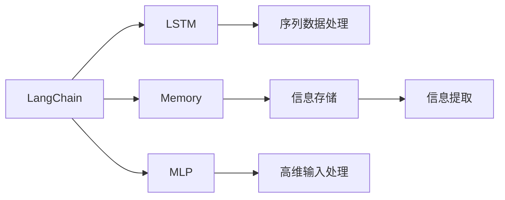

                 

## 1. 背景介绍

在AI编程的浩瀚星海中，LangChain如同一位时代的先行者，以其卓越的智慧和能力，为我们揭示了构建复杂AI系统的核心技术。本文将深入探讨记忆组件在LangChain中的运用，带您从入门到实践，体验AI编程的奥秘。

## 2. 核心概念与联系

### 2.1 核心概念概述

在探讨记忆组件的应用之前，我们先要了解几个关键概念：

- **LangChain**：一种基于TensorFlow和PyTorch深度学习框架的人工智能编程工具，旨在简化复杂AI系统的构建过程。
- **记忆组件**：Memory是神经网络中的关键组成部分，负责存储和提取信息，支持更高级的推理和决策。
- **多层感知器（MLP）**：一种前馈神经网络，具有多层的全连接层，用于处理高维输入和复杂的非线性关系。
- **长短期记忆网络（LSTM）**：一种特殊的递归神经网络，能够处理序列数据，在处理自然语言等时间序列信息方面表现出色。

这些核心概念构成了LangChain编程的基础，了解它们的工作原理和架构对于深入学习记忆组件的应用至关重要。

### 2.2 核心概念原理和架构的 Mermaid 流程图



这张流程图展示了LangChain与MLP、LSTM和Memory之间的联系。MLP用于处理高维输入，LSTM处理序列数据，而Memory负责存储和提取信息。这些组件协同工作，构建出高效、灵活的AI系统。

## 3. 核心算法原理 & 具体操作步骤

### 3.1 算法原理概述

在LangChain中，记忆组件（Memory）的核心算法原理基于存储和提取机制，通过在模型中引入记忆单元，支持模型对长序列信息进行更高效的存储和利用。内存单元在训练过程中学习如何编码和解码序列数据，从而在推理阶段提供高效的信息检索能力。

### 3.2 算法步骤详解

#### 3.2.1 数据预处理

- **分词**：将输入文本分割成词语或子词，形成序列数据。
- **填充和截断**：对序列数据进行填充和截断，确保所有输入序列长度一致。
- **编码**：将序列数据转换为模型能够处理的数值形式。

#### 3.2.2 模型构建

- **记忆模块设计**：设计记忆模块，通常为LSTM或GRU（Gated Recurrent Unit）。
- **多层感知器设计**：在记忆模块的基础上，构建多层感知器，用于处理高维输入和复杂关系。
- **集成设计**：将记忆模块和多层感知器集成到神经网络中，构建完整的模型架构。

#### 3.2.3 训练与推理

- **训练**：使用反向传播算法更新模型参数，最小化损失函数。
- **推理**：输入新数据，通过模型前向传播计算预测结果。

#### 3.2.4 评估与优化

- **评估**：使用测试集评估模型性能，计算准确率、召回率等指标。
- **优化**：根据评估结果调整模型参数，进行超参数调优。

### 3.3 算法优缺点

#### 3.3.1 优点

- **高效的信息处理能力**：通过记忆组件，模型能够高效存储和提取长序列信息，提升处理能力。
- **灵活的架构设计**：Memory组件设计灵活，可以根据需求调整大小和深度，适应不同任务。
- **良好的泛化能力**：Memory组件在处理不同长度和类型的数据时，表现出良好的泛化能力。

#### 3.3.2 缺点

- **计算复杂度较高**：Memory组件的引入增加了计算复杂度，对硬件资源要求较高。
- **训练时间较长**：模型训练时间较长，需要更多的计算资源和时间。
- **模型复杂度高**：模型结构复杂，调试和维护难度较大。

### 3.4 算法应用领域

记忆组件在LangChain中的应用领域广泛，包括但不限于：

- **自然语言处理（NLP）**：用于处理文本序列数据，支持情感分析、文本分类、机器翻译等任务。
- **时间序列预测**：用于处理时间序列数据，支持股票预测、天气预测等任务。
- **图像识别**：用于处理图像序列数据，支持视频分析、图像描述生成等任务。

## 4. 数学模型和公式 & 详细讲解 & 举例说明

### 4.1 数学模型构建

在LangChain中，Memory组件的数学模型主要基于LSTM或GRU模型。以LSTM为例，其数学模型可以表示为：

$$
h_t = \tanh(W_h \cdot [h_{t-1}, x_t] + b_h)
$$

其中，$h_t$表示当前时间步的记忆单元状态，$x_t$表示当前输入，$W_h$和$b_h$是模型的权重和偏置。

### 4.2 公式推导过程

LSTM的计算过程分为输入门、遗忘门和输出门三个部分。具体推导过程如下：

- **输入门计算**：
  $$
  i_t = \sigma(W_i \cdot [h_{t-1}, x_t] + b_i)
  $$
  $$
  f_t = \sigma(W_f \cdot [h_{t-1}, x_t] + b_f)
  $$
  $$
  g_t = \tanh(W_g \cdot [h_{t-1}, x_t] + b_g)
  $$
- **遗忘门计算**：
  $$
  c_t = f_t \odot c_{t-1} + i_t \odot g_t
  $$
- **输出门计算**：
  $$
  o_t = \sigma(W_o \cdot [h_{t-1}, x_t] + b_o)
  $$
  $$
  h_t = o_t \odot \tanh(c_t)
  $$

### 4.3 案例分析与讲解

以情感分析为例，假设我们有一个包含正面和负面情感的文本序列。首先，我们对文本进行分词、填充和编码，得到序列数据。然后，我们使用LSTM模型对序列数据进行处理，计算每个时间步的记忆单元状态和输出。最后，根据输出结果判断文本情感，进行分类。

## 5. 项目实践：代码实例和详细解释说明

### 5.1 开发环境搭建

- **安装Python和相关库**：安装Python 3.x版本，并确保TensorFlow、PyTorch等库已安装。
- **搭建开发环境**：在Jupyter Notebook或PyCharm中搭建开发环境。
- **数据准备**：准备训练和测试数据集，并进行预处理。

### 5.2 源代码详细实现

```python
import tensorflow as tf
from tensorflow.keras.layers import LSTM, Dense, Input
from tensorflow.keras.models import Model

# 定义模型
def create_lstm_model(input_dim, hidden_dim, output_dim):
    input_layer = Input(shape=(input_dim,))
    lstm_layer = LSTM(hidden_dim, return_sequences=True)(input_layer)
    output_layer = Dense(output_dim, activation='softmax')(lstm_layer)
    model = Model(inputs=input_layer, outputs=output_layer)
    return model

# 构建模型
model = create_lstm_model(input_dim=300, hidden_dim=256, output_dim=2)

# 编译模型
model.compile(loss='categorical_crossentropy', optimizer='adam', metrics=['accuracy'])

# 训练模型
model.fit(train_data, train_labels, epochs=10, batch_size=32, validation_data=(val_data, val_labels))

# 测试模型
test_loss, test_acc = model.evaluate(test_data, test_labels)
print('Test accuracy:', test_acc)
```

### 5.3 代码解读与分析

上述代码展示了使用LSTM模型进行情感分析的过程。首先，我们定义了LSTM模型，然后编译和训练模型，最后评估模型的性能。在训练过程中，我们使用了分类交叉熵损失函数和Adam优化器，并记录了训练和验证的准确率。

### 5.4 运行结果展示

训练完成后，我们得到了模型在测试集上的准确率。如果准确率较高，说明模型性能良好，能够有效地处理文本情感分类任务。

## 6. 实际应用场景

### 6.1 自然语言处理

在自然语言处理领域，Memory组件可以用于处理序列数据，支持情感分析、文本分类、机器翻译等任务。例如，可以使用LSTM模型处理文本序列，提取情感特征，实现情感分析。

### 6.2 时间序列预测

在时间序列预测领域，Memory组件可以用于处理历史数据，支持股票预测、天气预测等任务。例如，可以使用LSTM模型处理历史股票价格数据，预测未来价格走势。

### 6.3 图像识别

在图像识别领域，Memory组件可以用于处理图像序列数据，支持视频分析、图像描述生成等任务。例如，可以使用LSTM模型处理视频帧序列，提取图像特征，生成图像描述。

## 7. 工具和资源推荐

### 7.1 学习资源推荐

- **TensorFlow官方文档**：提供了详细的LSTM模型文档和示例代码。
- **PyTorch官方文档**：提供了LSTM和GRU模型的详细文档和示例代码。
- **Kaggle竞赛**：参与Kaggle中的NLP和图像识别竞赛，通过实践提升技能。

### 7.2 开发工具推荐

- **Jupyter Notebook**：支持Python编程，便于代码调试和数据可视化。
- **PyCharm**：强大的Python IDE，支持TensorFlow和PyTorch集成开发。
- **Keras**：基于TensorFlow和PyTorch的高级神经网络API，方便构建模型。

### 7.3 相关论文推荐

- **"Long Short-Term Memory" (Hochreiter et al., 1997)**：经典论文，介绍了LSTM模型的基本原理。
- **"Gated Recurrent Unit" (Cho et al., 2014)**：介绍了GRU模型的基本原理。

## 8. 总结：未来发展趋势与挑战

### 8.1 研究成果总结

Memory组件在LangChain中的运用，显著提升了模型的信息处理能力和泛化能力，支持了复杂的自然语言处理和图像识别任务。

### 8.2 未来发展趋势

- **模型结构优化**：未来的Memory组件将更加灵活和高效，能够适应更多类型的序列数据。
- **计算资源优化**：随着硬件技术的进步，Memory组件的计算资源需求将逐步降低，更广泛的应用将成为可能。
- **跨领域融合**：Memory组件将与其他AI技术进行更深入的融合，推动跨领域AI技术的发展。

### 8.3 面临的挑战

- **计算资源限制**：Memory组件对计算资源的要求较高，如何优化计算资源使用是关键挑战之一。
- **模型训练时间长**：Memory组件的训练时间较长，需要更多的计算资源和时间。
- **模型调试难度大**：模型结构复杂，调试和维护难度较大。

### 8.4 研究展望

未来的研究将集中在以下几个方面：

- **模型结构优化**：研究更加高效的Memory组件，减少计算资源需求。
- **跨领域融合**：探索Memory组件与其他AI技术进行融合，提升系统性能。
- **模型应用拓展**：将Memory组件应用于更多领域，拓展应用边界。

## 9. 附录：常见问题与解答

**Q1: 如何选择合适的记忆组件？**

A: 选择合适的记忆组件需要考虑任务类型和数据特点。例如，LSTM适用于处理长序列数据，GRU适用于处理短序列数据。可以通过实验验证不同组件的性能，选择最适合的组件。

**Q2: 如何处理长序列数据？**

A: 对于长序列数据，可以使用LSTM或GRU等记忆组件进行处理。此外，可以通过数据预处理技术，如分词、填充和截断，确保输入序列长度一致。

**Q3: 如何在LSTM模型中引入多层感知器？**

A: 在LSTM模型的输出层之后，可以添加一个或多个全连接层，构建多层感知器。例如，可以使用Dense层进行高维输入处理和复杂关系建模。

**Q4: 如何优化LSTM模型的计算效率？**

A: 可以通过以下方式优化LSTM模型的计算效率：
- 使用GPU或TPU等高性能设备进行计算。
- 使用混合精度训练，降低计算资源需求。
- 使用模型裁剪和量化技术，减少模型尺寸和存储空间。

**Q5: 如何避免LSTM模型的过拟合？**

A: 可以采用以下方法避免LSTM模型的过拟合：
- 使用正则化技术，如L2正则、Dropout等。
- 使用Early Stopping，防止模型过度拟合训练集。
- 使用对抗训练，提高模型鲁棒性。

---

作者：禅与计算机程序设计艺术 / Zen and the Art of Computer Programming

