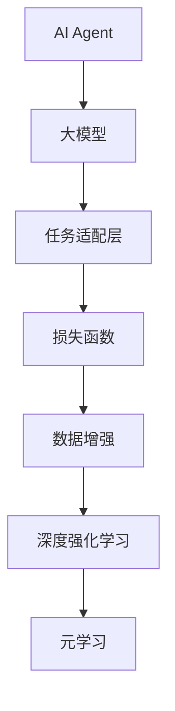

                 

# 【大模型应用开发 动手做AI Agent】基于大模型的Agent技术框架

> 关键词：大模型应用，AI Agent，自然语言处理(NLP)，计算机视觉(CV)，深度强化学习，元学习

## 1. 背景介绍

### 1.1 问题由来

随着人工智能(AI)技术的不断进步，AI Agent正逐渐成为越来越多应用场景的核心驱动力。AI Agent不仅可以执行复杂任务，还能自适应环境变化，提升系统智能水平。在NLP、CV、强化学习等领域，基于大模型的AI Agent已经成为研究热点。

然而，构建高精度的AI Agent仍然面临着诸多挑战。大模型的预训练通常需要大量计算资源和时间，且模型结构复杂，难以直接应用于特定任务。因此，如何在减少资源消耗的同时，最大限度地发挥大模型优势，是一个亟待解决的问题。

### 1.2 问题核心关键点

本文聚焦于基于大模型的AI Agent技术框架，旨在提供一个系统性的方法，使开发者能够快速构建并部署高效、智能的AI Agent。

AI Agent的核心目标是通过执行一系列动作或决策，使智能体在特定环境中最大化某种性能指标。在NLP、CV、强化学习等领域，AI Agent的应用包括聊天机器人、图像分类、自动驾驶等。

构建AI Agent的核心在于：
- 选择合适的任务适配层。
- 设计合理的损失函数。
- 进行高效的数据增强。
- 优化模型参数。

本文将详细介绍基于大模型的AI Agent技术框架，包括其核心概念、算法原理、具体步骤和实际应用，帮助开发者掌握构建AI Agent的关键技术和工具。

## 2. 核心概念与联系

### 2.1 核心概念概述

为更好地理解基于大模型的AI Agent技术框架，本节将介绍几个密切相关的核心概念：

- **AI Agent**：指在特定环境中通过执行动作或策略实现目标的智能体，能够感知环境、规划行动，并不断学习优化。

- **大模型**：指通过大规模无标签数据预训练得到的通用语言或视觉模型，如BERT、GPT、ResNet等。

- **任务适配层(Task-Adaptive Layer)**：针对特定任务设计的模型层，能够将大模型的通用能力进一步适配到特定任务。

- **损失函数(Loss Function)**：衡量模型输出与真实标签差异的量化指标，指导模型参数的优化。

- **数据增强(Data Augmentation)**：通过对训练样本进行扩充，提高模型泛化能力，减少过拟合。

- **深度强化学习(Deep Reinforcement Learning)**：基于奖励信号指导模型学习最优策略的深度学习范式。

- **元学习(Meta-Learning)**：通过学习如何学习，使模型具备快速适应新任务的泛化能力。

这些概念之间的逻辑关系可以通过以下Mermaid流程图来展示：



这个流程图展示了大模型应用于AI Agent的过程：

1. 大模型提供通用的特征表示。
2. 任务适配层进一步适配到特定任务，增强模型泛化能力。
3. 损失函数衡量模型输出和真实标签的差异。
4. 数据增强提高模型泛化能力。
5. 深度强化学习利用奖励信号指导模型优化策略。
6. 元学习使模型具备快速适应新任务的能力。

这些概念共同构成了AI Agent的核心框架，使AI Agent能够在各种场景下发挥强大的智能水平。通过理解这些核心概念，我们可以更好地把握AI Agent的工作原理和优化方向。

## 3. 核心算法原理 & 具体操作步骤
### 3.1 算法原理概述

基于大模型的AI Agent技术框架，核心思想是通过将大模型的通用特征表示适配到特定任务，构建出高效的AI Agent。具体而言，包括以下几个关键步骤：

1. 选择合适的预训练模型。
2. 添加任务适配层，适配特定任务。
3. 设计损失函数，指导模型训练。
4. 进行数据增强，提高泛化能力。
5. 使用深度强化学习或元学习，优化模型策略。

通过这些步骤，AI Agent能够高效地利用大模型的通用知识和特定任务的特点，达到最优的性能指标。

### 3.2 算法步骤详解

本节将详细介绍基于大模型的AI Agent构建的具体步骤：

**Step 1: 准备预训练模型和数据集**

1. 选择合适的预训练模型。根据任务类型，选择最合适的预训练模型，如BERT用于文本分类，ResNet用于图像分类。

2. 准备标注数据集，划分为训练集、验证集和测试集。数据集应包含尽可能多的各类样本，涵盖任务所有可能的场景。

**Step 2: 添加任务适配层**

1. 在预训练模型的顶层添加适配层，如线性层、全连接层等，适配到特定任务的输出需求。

2. 对于分类任务，添加softmax层输出类别概率分布。对于生成任务，使用解码器输出概率分布。

3. 对于强化学习任务，使用DQN、PPO等深度强化学习算法，设计奖励函数，训练模型策略。

**Step 3: 设计损失函数**

1. 根据任务类型，选择适合的损失函数。如交叉熵损失、均方误差损失、多目标损失等。

2. 设计自定义损失函数，结合模型输出和真实标签，指导模型参数优化。

**Step 4: 数据增强**

1. 对训练集数据进行扩充，如文本清洗、格式转换、近义词替换等。

2. 对于视觉数据，使用随机裁剪、旋转、翻转等方法增加数据多样性。

3. 对于强化学习数据，使用环境噪声、随机动作等方法提高数据鲁棒性。

**Step 5: 模型训练和优化**

1. 使用深度学习框架如PyTorch、TensorFlow等，实现模型的前向传播和后向传播。

2. 使用优化算法如Adam、SGD等，最小化损失函数，优化模型参数。

3. 使用正则化技术如L2正则、Dropout等，防止过拟合。

4. 使用学习率调度策略如学习率衰减、学习率温暖等，优化学习过程。

5. 使用验证集评估模型性能，及时调整训练策略。

6. 使用早停机制，防止过拟合，提高模型泛化能力。

**Step 6: 部署和应用**

1. 将训练好的模型导出，并进行保存。

2. 将模型集成到实际应用中，如聊天机器人、图像分类器、自动驾驶等。

3. 对部署后的模型进行监控和维护，确保模型性能和稳定性。

### 3.3 算法优缺点

基于大模型的AI Agent技术框架具有以下优点：

1. 高效利用大模型知识。通过预训练和微调，大幅提升模型性能，减少从头开发成本。

2. 泛化能力强。任务适配层和数据增强等技术，使模型具备更强的泛化能力，能够适应多种复杂场景。

3. 可扩展性好。在模型结构上，可以通过添加适配层、优化损失函数等手段，快速适配新任务。

4. 训练效率高。大模型预训练部分固定不变，仅微调任务相关参数，提高训练效率。

然而，该框架也存在一些局限性：

1. 对标注数据依赖较大。任务适配层的设计需要大量标注数据，标注成本较高。

2. 模型资源消耗较大。预训练模型参数量巨大，对计算资源和时间要求较高。

3. 模型解释性不足。大模型黑盒特性，难以解释模型决策过程，影响系统可解释性。

4. 安全性问题。预训练模型可能学习到有害信息，对应用场景存在安全隐患。

尽管存在这些局限性，但该框架在大模型应用和AI Agent构建方面仍具有显著优势，值得在实际开发中进行探索和应用。

### 3.4 算法应用领域

基于大模型的AI Agent技术框架，已经在多个领域得到了广泛应用，包括但不限于：

- **自然语言处理(NLP)**：构建聊天机器人、文本分类、情感分析、机器翻译等应用。

- **计算机视觉(CV)**：进行图像分类、目标检测、图像生成等任务。

- **深度强化学习(Deep Reinforcement Learning)**：开发自动驾驶、游戏AI、机器人控制等应用。

- **多模态学习(Multimodal Learning)**：融合视觉、听觉、语言等多模态数据，实现更复杂的智能交互。

未来，基于大模型的AI Agent技术框架将在更多领域得到应用，为各行各业带来智能化升级，促进数字化转型。

## 4. 数学模型和公式 & 详细讲解 & 举例说明

### 4.1 数学模型构建

在本节中，我们将使用数学语言对基于大模型的AI Agent构建过程进行更加严格的刻画。

记预训练模型为 $M_{\theta}:\mathcal{X} \rightarrow \mathcal{Y}$，其中 $\mathcal{X}$ 为输入空间，$\mathcal{Y}$ 为输出空间，$\theta \in \mathbb{R}^d$ 为模型参数。假设AI Agent的任务为分类任务，输出 $\hat{y}=M_{\theta}(x) \in \{1,2,...,K\}$，其中 $K$ 为类别数。

定义模型 $M_{\theta}$ 在输入 $x$ 上的损失函数为 $\ell(M_{\theta}(x),y)$，则在训练集 $D=\{(x_i,y_i)\}_{i=1}^N$ 上的经验风险为：

$$
\mathcal{L}(\theta) = \frac{1}{N} \sum_{i=1}^N \ell(M_{\theta}(x_i),y_i)
$$

其中 $\ell(\cdot)$ 为任务适配层和损失函数组合的损失函数。如对于分类任务，可以采用交叉熵损失函数：

$$
\ell(\hat{y},y) = -\log P_{\theta}(y|\hat{y}) = -\log \frac{e^{\hat{y} \cdot \log P_{\theta}(y)}}{\sum_{k=1}^K e^{\hat{y} \cdot \log P_{\theta}(k)}}
$$

**Step 1: 准备预训练模型和数据集**

1. 选择合适的预训练模型 $M_{\theta}$，如BERT、GPT、ResNet等。

2. 准备标注数据集 $D=\{(x_i,y_i)\}_{i=1}^N$，其中 $x_i \in \mathcal{X}$，$y_i \in \{1,2,...,K\}$。

**Step 2: 添加任务适配层**

1. 在预训练模型的顶层添加适配层 $F_{\phi}$，如线性层或全连接层，适配到特定任务的输出需求。

2. 对于分类任务，添加softmax层输出类别概率分布 $P_{\theta}(y|\hat{y})$。

3. 设计自定义损失函数 $\ell$，结合任务适配层输出和真实标签 $y_i$，指导模型参数优化。

**Step 3: 设计损失函数**

1. 对于分类任务，采用交叉熵损失函数：

$$
\mathcal{L}(\theta) = \frac{1}{N} \sum_{i=1}^N -\log P_{\theta}(y_i|\hat{y}_i)
$$

2. 对于强化学习任务，设计奖励函数 $R$，利用奖励信号指导模型策略优化。

### 4.2 公式推导过程

以文本分类任务为例，推导基于大模型的AI Agent的损失函数和优化过程。

假设模型 $M_{\theta}$ 在输入 $x$ 上的输出为 $\hat{y}=M_{\theta}(x)$，表示样本属于第 $k$ 类的概率。真实标签 $y \in \{1,2,...,K\}$。则分类任务损失函数为：

$$
\ell(\hat{y},y) = -\log P_{\theta}(y|\hat{y}) = -\log \frac{e^{\hat{y} \cdot \log P_{\theta}(y)}}{\sum_{k=1}^K e^{\hat{y} \cdot \log P_{\theta}(k)}}
$$

将其代入经验风险公式，得：

$$
\mathcal{L}(\theta) = -\frac{1}{N}\sum_{i=1}^N [y_i\log P_{\theta}(y_i|\hat{y}_i)+(1-y_i)\log (1-P_{\theta}(y_i|\hat{y}_i))]
$$

使用梯度下降等优化算法，微调过程不断更新模型参数 $\theta$，最小化损失函数 $\mathcal{L}$，使得模型输出逼近真实标签。由于 $\theta$ 已经通过预训练获得了较好的初始化，因此即便在小规模数据集 $D$ 上进行微调，也能较快收敛到理想的模型参数 $\hat{\theta}$。

### 4.3 案例分析与讲解

以聊天机器人为例，详细分析基于大模型的AI Agent构建过程。

**Step 1: 准备预训练模型和数据集**

1. 选择合适的预训练模型，如BERT作为语言模型。

2. 准备训练数据集，包括对话历史和回答。

**Step 2: 添加任务适配层**

1. 在BERT模型的顶层添加适配层，如线性层，适配到对话回答的任务。

2. 添加softmax层输出回答类别概率分布。

3. 设计自定义损失函数，结合对话历史和回答，指导模型参数优化。

**Step 3: 设计损失函数**

1. 对于对话回答任务，可以采用交叉熵损失函数：

$$
\mathcal{L}(\theta) = \frac{1}{N} \sum_{i=1}^N -\log P_{\theta}(a_i|c_i)
$$

其中 $c_i$ 为对话历史，$a_i$ 为回答。

**Step 4: 数据增强**

1. 对对话历史进行清洗、格式转换、近义词替换等操作。

2. 使用对抗样本、环境噪声等方法提高模型鲁棒性。

**Step 5: 模型训练和优化**

1. 使用深度学习框架如PyTorch实现模型的前向传播和后向传播。

2. 使用优化算法如Adam、SGD等，最小化损失函数，优化模型参数。

3. 使用正则化技术如L2正则、Dropout等，防止过拟合。

4. 使用学习率调度策略如学习率衰减、学习率温暖等，优化学习过程。

5. 使用验证集评估模型性能，及时调整训练策略。

6. 使用早停机制，防止过拟合，提高模型泛化能力。

**Step 6: 部署和应用**

1. 将训练好的模型导出，并进行保存。

2. 将模型集成到实际应用中，如聊天机器人、图像分类器、自动驾驶等。

3. 对部署后的模型进行监控和维护，确保模型性能和稳定性。

通过以上案例分析，可以看到基于大模型的AI Agent构建过程包括数据准备、任务适配、损失函数设计、数据增强、模型训练等多个环节。每个环节的设计都会影响最终模型的性能，需要开发者根据具体任务进行调整和优化。

## 5. 项目实践：代码实例和详细解释说明

### 5.1 开发环境搭建

在进行AI Agent开发前，我们需要准备好开发环境。以下是使用Python进行PyTorch开发的环境配置流程：

1. 安装Anaconda：从官网下载并安装Anaconda，用于创建独立的Python环境。

2. 创建并激活虚拟环境：
```bash
conda create -n pytorch-env python=3.8 
conda activate pytorch-env
```

3. 安装PyTorch：根据CUDA版本，从官网获取对应的安装命令。例如：
```bash
conda install pytorch torchvision torchaudio cudatoolkit=11.1 -c pytorch -c conda-forge
```

4. 安装Transformers库：
```bash
pip install transformers
```

5. 安装各类工具包：
```bash
pip install numpy pandas scikit-learn matplotlib tqdm jupyter notebook ipython
```

完成上述步骤后，即可在`pytorch-env`环境中开始AI Agent开发。

### 5.2 源代码详细实现

下面我们以聊天机器人为例，给出使用Transformers库对BERT模型进行聊天机器人微调的PyTorch代码实现。

首先，定义聊天机器人任务的数据处理函数：

```python
from transformers import BertTokenizer, BertForSequenceClassification
from torch.utils.data import Dataset
import torch

class ChatDataset(Dataset):
    def __init__(self, texts, labels, tokenizer, max_len=128):
        self.texts = texts
        self.labels = labels
        self.tokenizer = tokenizer
        self.max_len = max_len
        
    def __len__(self):
        return len(self.texts)
    
    def __getitem__(self, item):
        text = self.texts[item]
        label = self.labels[item]
        
        encoding = self.tokenizer(text, return_tensors='pt', max_length=self.max_len, padding='max_length', truncation=True)
        input_ids = encoding['input_ids'][0]
        attention_mask = encoding['attention_mask'][0]
        
        # 对label进行编码
        encoded_labels = [label2id[label] for label in label2id] 
        encoded_labels.extend([label2id['O']] * (self.max_len - len(encoded_labels)))
        labels = torch.tensor(encoded_labels, dtype=torch.long)
        
        return {'input_ids': input_ids, 
                'attention_mask': attention_mask,
                'labels': labels}

# 标签与id的映射
label2id = {'O': 0, 'Answer': 1, 'Question': 2, 'Hi': 3, 'Bye': 4}
id2label = {v: k for k, v in label2id.items()}

# 创建dataset
tokenizer = BertTokenizer.from_pretrained('bert-base-cased')

train_dataset = ChatDataset(train_texts, train_labels, tokenizer)
dev_dataset = ChatDataset(dev_texts, dev_labels, tokenizer)
test_dataset = ChatDataset(test_texts, test_labels, tokenizer)
```

然后，定义模型和优化器：

```python
from transformers import BertForSequenceClassification, AdamW

model = BertForSequenceClassification.from_pretrained('bert-base-cased', num_labels=len(label2id))

optimizer = AdamW(model.parameters(), lr=2e-5)
```

接着，定义训练和评估函数：

```python
from torch.utils.data import DataLoader
from tqdm import tqdm
from sklearn.metrics import classification_report

device = torch.device('cuda') if torch.cuda.is_available() else torch.device('cpu')
model.to(device)

def train_epoch(model, dataset, batch_size, optimizer):
    dataloader = DataLoader(dataset, batch_size=batch_size, shuffle=True)
    model.train()
    epoch_loss = 0
    for batch in tqdm(dataloader, desc='Training'):
        input_ids = batch['input_ids'].to(device)
        attention_mask = batch['attention_mask'].to(device)
        labels = batch['labels'].to(device)
        model.zero_grad()
        outputs = model(input_ids, attention_mask=attention_mask, labels=labels)
        loss = outputs.loss
        epoch_loss += loss.item()
        loss.backward()
        optimizer.step()
    return epoch_loss / len(dataloader)

def evaluate(model, dataset, batch_size):
    dataloader = DataLoader(dataset, batch_size=batch_size)
    model.eval()
    preds, labels = [], []
    with torch.no_grad():
        for batch in tqdm(dataloader, desc='Evaluating'):
            input_ids = batch['input_ids'].to(device)
            attention_mask = batch['attention_mask'].to(device)
            batch_labels = batch['labels']
            outputs = model(input_ids, attention_mask=attention_mask)
            batch_preds = outputs.logits.argmax(dim=2).to('cpu').tolist()
            batch_labels = batch_labels.to('cpu').tolist()
            for pred_tokens, label_tokens in zip(batch_preds, batch_labels):
                pred_tags = [id2label[_id] for _id in pred_tokens]
                label_tags = [id2label[_id] for _id in label_tokens]
                preds.append(pred_tags[:len(label_tokens)])
                labels.append(label_tags)
                
    print(classification_report(labels, preds))
```

最后，启动训练流程并在测试集上评估：

```python
epochs = 5
batch_size = 16

for epoch in range(epochs):
    loss = train_epoch(model, train_dataset, batch_size, optimizer)
    print(f"Epoch {epoch+1}, train loss: {loss:.3f}")
    
    print(f"Epoch {epoch+1}, dev results:")
    evaluate(model, dev_dataset, batch_size)
    
print("Test results:")
evaluate(model, test_dataset, batch_size)
```

以上就是使用PyTorch对BERT进行聊天机器人任务微调的完整代码实现。可以看到，得益于Transformers库的强大封装，我们可以用相对简洁的代码完成BERT模型的加载和微调。

### 5.3 代码解读与分析

让我们再详细解读一下关键代码的实现细节：

**ChatDataset类**：
- `__init__`方法：初始化文本、标签、分词器等关键组件。
- `__len__`方法：返回数据集的样本数量。
- `__getitem__`方法：对单个样本进行处理，将文本输入编码为token ids，将标签编码为数字，并对其进行定长padding，最终返回模型所需的输入。

**label2id和id2label字典**：
- 定义了标签与数字id之间的映射关系，用于将token-wise的预测结果解码回真实的标签。

**训练和评估函数**：
- 使用PyTorch的DataLoader对数据集进行批次化加载，供模型训练和推理使用。
- 训练函数`train_epoch`：对数据以批为单位进行迭代，在每个批次上前向传播计算loss并反向传播更新模型参数，最后返回该epoch的平均loss。
- 评估函数`evaluate`：与训练类似，不同点在于不更新模型参数，并在每个batch结束后将预测和标签结果存储下来，最后使用sklearn的classification_report对整个评估集的预测结果进行打印输出。

**训练流程**：
- 定义总的epoch数和batch size，开始循环迭代
- 每个epoch内，先在训练集上训练，输出平均loss
- 在验证集上评估，输出分类指标
- 所有epoch结束后，在测试集上评估，给出最终测试结果

可以看到，PyTorch配合Transformers库使得BERT微调的代码实现变得简洁高效。开发者可以将更多精力放在数据处理、模型改进等高层逻辑上，而不必过多关注底层的实现细节。

当然，工业级的系统实现还需考虑更多因素，如模型的保存和部署、超参数的自动搜索、更灵活的任务适配层等。但核心的微调范式基本与此类似。

## 6. 实际应用场景
### 6.1 智能客服系统

基于大模型的AI Agent技术框架，可以广泛应用于智能客服系统的构建。传统客服往往需要配备大量人力，高峰期响应缓慢，且一致性和专业性难以保证。使用基于大模型的AI Agent，能够7x24小时不间断服务，快速响应客户咨询，用自然流畅的语言解答各类常见问题。

在技术实现上，可以收集企业内部的历史客服对话记录，将问题和最佳答复构建成监督数据，在此基础上对预训练模型进行微调。微调后的AI Agent能够自动理解用户意图，匹配最合适的答案模板进行回复。对于客户提出的新问题，还可以接入检索系统实时搜索相关内容，动态组织生成回答。如此构建的智能客服系统，能大幅提升客户咨询体验和问题解决效率。

### 6.2 金融舆情监测

金融机构需要实时监测市场舆论动向，以便及时应对负面信息传播，规避金融风险。传统的人工监测方式成本高、效率低，难以应对网络时代海量信息爆发的挑战。基于大模型的AI Agent技术框架，可以进行实时舆情监测。

具体而言，可以收集金融领域相关的新闻、报道、评论等文本数据，并对其进行主题标注和情感标注。在此基础上对预训练语言模型进行微调，使其能够自动判断文本属于何种主题，情感倾向是正面、中性还是负面。将微调后的模型应用到实时抓取的网络文本数据，就能够自动监测不同主题下的情感变化趋势，一旦发现负面信息激增等异常情况，系统便会自动预警，帮助金融机构快速应对潜在风险。

### 6.3 个性化推荐系统

当前的推荐系统往往只依赖用户的历史行为数据进行物品推荐，无法深入理解用户的真实兴趣偏好。基于大模型的AI Agent技术框架，可以进行个性化推荐系统开发。

在实践中，可以收集用户浏览、点击、评论、分享等行为数据，提取和用户交互的物品标题、描述、标签等文本内容。将文本内容作为模型输入，用户的后续行为（如是否点击、购买等）作为监督信号，在此基础上微调预训练语言模型。微调后的模型能够从文本内容中准确把握用户的兴趣点。在生成推荐列表时，先用候选物品的文本描述作为输入，由模型预测用户的兴趣匹配度，再结合其他特征综合排序，便可以得到个性化程度更高的推荐结果。

### 6.4 未来应用展望

随着大模型和AI Agent技术的发展，基于大模型的AI Agent技术框架将在更多领域得到应用，为传统行业带来变革性影响。

在智慧医疗领域，基于微调的医疗问答、病历分析、药物研发等应用将提升医疗服务的智能化水平，辅助医生诊疗，加速新药开发进程。

在智能教育领域，AI Agent技术可以应用于作业批改、学情分析、知识推荐等方面，因材施教，促进教育公平，提高教学质量。

在智慧城市治理中，AI Agent技术可应用于城市事件监测、舆情分析、应急指挥等环节，提高城市管理的自动化和智能化水平，构建更安全、高效的未来城市。

此外，在企业生产、社会治理、文娱传媒等众多领域，基于大模型的AI Agent技术框架也将不断涌现，为经济社会发展注入新的动力。相信随着技术的日益成熟，AI Agent技术将成为人工智能落地应用的重要范式，推动人工智能技术在垂直行业的规模化落地。总之，AI Agent技术框架需要在数据、算法、工程、业务等多个维度协同发力，才能真正实现人工智能技术在垂直行业的规模化落地。

## 7. 工具和资源推荐
### 7.1 学习资源推荐

为了帮助开发者系统掌握大模型和AI Agent的理论与实践，这里推荐一些优质的学习资源：

1. 《Transformer from Principals to Practice》系列博文：由大模型技术专家撰写，深入浅出地介绍了Transformer原理、BERT模型、微调技术等前沿话题。

2. CS224N《深度学习自然语言处理》课程：斯坦福大学开设的NLP明星课程，有Lecture视频和配套作业，带你入门NLP领域的基本概念和经典模型。

3. 《Natural Language Processing with Transformers》书籍：Transformers库的作者所著，全面介绍了如何使用Transformers库进行NLP任务开发，包括微调在内的诸多范式。

4. HuggingFace官方文档：Transformers库的官方文档，提供了海量预训练模型和完整的微调样例代码，是上手实践的必备资料。

5. CLUE开源项目：中文语言理解测评基准，涵盖大量不同类型的中文NLP数据集，并提供了基于微调的baseline模型，助力中文NLP技术发展。

通过对这些资源的学习实践，相信你一定能够快速掌握大模型和AI Agent的核心技术，并用于解决实际的NLP问题。
### 7.2 开发工具推荐

高效的开发离不开优秀的工具支持。以下是几款用于大模型和AI Agent开发的常用工具：

1. PyTorch：基于Python的开源深度学习框架，灵活动态的计算图，适合快速迭代研究。大部分预训练语言模型都有PyTorch版本的实现。

2. TensorFlow：由Google主导开发的开源深度学习框架，生产部署方便，适合大规模工程应用。同样有丰富的预训练语言模型资源。

3. Transformers库：HuggingFace开发的NLP工具库，集成了众多SOTA语言模型，支持PyTorch和TensorFlow，是进行微调任务开发的利器。

4. Weights & Biases：模型训练的实验跟踪工具，可以记录和可视化模型训练过程中的各项指标，方便对比和调优。与主流深度学习框架无缝集成。

5. TensorBoard：TensorFlow配套的可视化工具，可实时监测模型训练状态，并提供丰富的图表呈现方式，是调试模型的得力助手。

6. Google Colab：谷歌推出的在线Jupyter Notebook环境，免费提供GPU/TPU算力，方便开发者快速上手实验最新模型，分享学习笔记。

合理利用这些工具，可以显著提升大模型和AI Agent的开发效率，加快创新迭代的步伐。

### 7.3 相关论文推荐

大模型和AI Agent的发展源于学界的持续研究。以下是几篇奠基性的相关论文，推荐阅读：

1. Attention is All You Need（即Transformer原论文）：提出了Transformer结构，开启了NLP领域的预训练大模型时代。

2. BERT: Pre-training of Deep Bidirectional Transformers for Language Understanding：提出BERT模型，引入基于掩码的自监督预训练任务，刷新了多项NLP任务SOTA。

3. Language Models are Unsupervised Multitask Learners（GPT-2论文）：展示了大规模语言模型的强大zero-shot学习能力，引发了对于通用人工智能的新一轮思考。

4. Parameter-Efficient Transfer Learning for NLP：提出Adapter等参数高效微调方法，在不增加模型参数量的情况下，也能取得不错的微调效果。

5. Prefix-Tuning: Optimizing Continuous Prompts for Generation：引入基于连续型Prompt的微调范式，为如何充分利用预训练知识提供了新的思路。

6. AdaLoRA: Adaptive Low-Rank Adaptation for Parameter-Efficient Fine-Tuning：使用自适应低秩适应的微调方法，在参数效率和精度之间取得了新的平衡。

这些论文代表了大模型和AI Agent的发展脉络。通过学习这些前沿成果，可以帮助研究者把握学科前进方向，激发更多的创新灵感。

## 8. 总结：未来发展趋势与挑战

### 8.1 总结

本文对基于大模型的AI Agent技术框架进行了全面系统的介绍。首先阐述了AI Agent和大模型的研究背景和意义，明确了AI Agent在NLP、CV、强化学习等领域的应用前景。其次，从原理到实践，详细讲解了AI Agent的构建过程，包括预训练模型选择、任务适配层设计、损失函数优化、数据增强、模型训练等多个关键步骤。最后，介绍了AI Agent在多个实际场景中的应用，展望了未来的发展趋势和挑战。

通过本文的系统梳理，可以看到，基于大模型的AI Agent技术框架已经在大规模预训练和任务适配的基础上，实现了高效、智能的AI Agent构建。未来，随着大模型和AI Agent技术的不断发展，AI Agent必将在更多领域得到应用，为各行各业带来智能化升级，促进数字化转型。

### 8.2 未来发展趋势

展望未来，基于大模型的AI Agent技术框架将呈现以下几个发展趋势：

1. 模型规模持续增大。随着算力成本的下降和数据规模的扩张，预训练语言模型的参数量还将持续增长。超大规模语言模型蕴含的丰富语言知识，有望支撑更加复杂多变的AI Agent构建。

2. 微调方法日趋多样。除了传统的全参数微调外，未来会涌现更多参数高效的微调方法，如Prompt-based Learning、LoRA等，在节省计算资源的同时也能保证AI Agent性能。

3. 持续学习成为常态。随着数据分布的不断变化，AI Agent也需要持续学习新知识以保持性能。如何在不遗忘原有知识的同时，高效吸收新样本信息，将成为重要的研究课题。

4. 标注样本需求降低。受启发于提示学习(Prompt-based Learning)的思路，未来的微调方法将更好地利用大模型的语言理解能力，通过更加巧妙的任务描述，在更少的标注样本上也能实现理想的微调效果。

5. 多模态微调崛起。当前的AI Agent主要聚焦于纯文本数据，未来会进一步拓展到图像、视频、语音等多模态数据微调。多模态信息的融合，将显著提升AI Agent对现实世界的理解和建模能力。

6. 模型通用性增强。经过海量数据的预训练和多领域任务的微调，未来的AI Agent将具备更强大的常识推理和跨领域迁移能力，逐步迈向通用人工智能(AGI)的目标。

以上趋势凸显了大模型和AI Agent技术的广阔前景。这些方向的探索发展，必将进一步提升AI Agent的性能和应用范围，为人工智能技术在各领域的落地应用提供重要支撑。

### 8.3 面临的挑战

尽管基于大模型的AI Agent技术框架已经取得了显著成效，但在迈向更加智能化、普适化应用的过程中，仍面临诸多挑战：

1. 标注成本瓶颈。虽然AI Agent能够通过微调快速适配新任务，但对于一些特定领域的任务，获取高质量标注数据的成本较高。如何进一步降低标注样本的需求，将是一大难题。

2. 模型鲁棒性不足。当前AI Agent面对域外数据时，泛化性能往往大打折扣。对于测试样本的微小扰动，AI Agent也容易发生波动。如何提高AI Agent的鲁棒性，避免灾难性遗忘，还需要更多理论和实践的积累。

3. 推理效率有待提高。尽管AI Agent通过微调大幅提升了性能，但在实际部署时往往面临推理速度慢、内存占用大等效率问题。如何优化模型结构，提升推理速度，优化资源占用，将是重要的优化方向。

4. 可解释性亟需加强。当前AI Agent更像是"黑盒"系统，难以解释其内部工作机制和决策逻辑。对于医疗、金融等高风险应用，算法的可解释性和可审计性尤为重要。如何赋予AI Agent更强的可解释性，将是亟待攻克的难题。

5. 安全性问题。预训练AI Agent可能学习到有害信息，对应用场景存在安全隐患。如何从数据和算法层面消除AI Agent偏见，避免恶意用途，确保输出的安全性，也将是重要的研究课题。

6. 知识整合能力不足。现有的AI Agent往往局限于任务内数据，难以灵活吸收和运用更广泛的先验知识。如何让AI Agent更好地与外部知识库、规则库等专家知识结合，形成更加全面、准确的信息整合能力，还有很大的想象空间。

正视AI Agent面临的这些挑战，积极应对并寻求突破，将是大模型和AI Agent技术走向成熟的必由之路。相信随着学界和产业界的共同努力，这些挑战终将一一被克服，AI Agent技术必将在构建安全、可靠、可解释、可控的智能系统铺平道路。面向未来，AI Agent技术还需要与其他人工智能技术进行更深入的融合，如知识表示、因果推理、强化学习等，多路径协同发力，共同推动人工智能技术的进步。只有勇于创新、敢于突破，才能不断拓展AI Agent的边界，让智能技术更好地造福人类社会。

### 8.4 研究展望

未来，基于大模型的AI Agent技术框架需要在以下几个方面进行更多探索：

1. 探索无监督和半监督微调方法。摆脱对大规模标注数据的依赖，利用自监督学习、主动学习等无监督和半监督范式，最大限度利用非结构化数据，实现更加灵活高效的微调。

2. 研究参数高效和计算高效的微调范式。开发更加参数高效的微调方法，在固定大部分预训练参数的同时，只更新极少量的任务相关参数。同时优化AI Agent模型的计算图，减少前向传播和反向传播的资源消耗，实现更加轻量级、实时性的部署。

3. 引入更多先验知识。将符号化的先验知识，如知识图谱、逻辑规则等，与神经网络模型进行巧妙融合，引导AI Agent学习更准确、合理的语言模型。同时加强不同模态数据的整合，实现视觉、听觉、语言等多模态信息与文本信息的协同建模。

4. 结合因果分析和博弈论工具。将因果分析方法引入AI Agent模型，识别出模型决策的关键特征，增强输出解释的因果性和逻辑性。借助博弈论工具刻画人机交互过程，主动探索并规避AI Agent的脆弱点，提高系统稳定性。

5. 纳入伦理道德约束。在AI Agent训练目标中引入伦理导向的评估指标，过滤和惩罚有偏见、有害的输出倾向。同时加强人工干预和审核，建立AI Agent行为的监管机制，确保输出符合人类价值观和伦理道德。

这些研究方向的探索，必将引领AI Agent技术迈向更高的台阶，为构建安全、可靠、可解释、可控的智能系统铺平道路。面向未来，AI Agent技术还需要与其他人工智能技术进行更深入的融合，如知识表示、因果推理、强化学习等，多路径协同发力，共同推动人工智能技术的进步。只有勇于创新、敢于突破，才能不断拓展AI Agent的边界，让智能技术更好地造福人类社会。

## 9. 附录：常见问题与解答

**Q1：AI Agent是否适用于所有NLP任务？**

A: AI Agent在大规模预训练和微调的基础上，能够适应大多数NLP任务。但对于一些特定领域的任务，如医学、法律等，仅依赖通用语料预训练的模型可能难以很好地适应。此时需要在特定领域语料上进一步预训练，再进行微调，才能获得理想效果。此外，对于一些需要时效性、个性化很强的任务，如对话、推荐等，AI Agent方法也需要针对性的改进优化。

**Q2：AI Agent在微调过程中如何选择合适的学习率？**

A: AI Agent的微调学习率通常要比预训练时小1-2个数量级，以避免破坏预训练权重。一般建议从1e-5开始调参，逐步减小学习率，直至收敛。也可以使用warmup策略，在开始阶段使用较小的学习率，再逐渐过渡到预设值。需要注意的是，不同的优化器(如AdamW、Adafactor等)以及不同的学习率调度策略，可能需要设置不同的学习率阈值。

**Q3：在AI Agent微调过程中如何缓解过拟合问题？**

A: 过拟合是AI Agent微调面临的主要挑战之一。常见的缓解策略包括：
1. 数据增强：通过回译、近义词替换等方式扩充训练集。
2. 正则化：使用L2正则、Dropout、Early Stopping等防止过拟合。
3. 对抗训练：引入对抗样本，提高模型鲁棒性。
4. 参数高效微调：只调整少量参数(如Adapter、Prefix等)，减小过拟合风险。

这些策略往往需要根据具体任务和数据特点进行灵活组合。只有在数据、模型、训练、推理等各环节进行全面优化，才能最大限度地发挥AI Agent的性能。

**Q4：在AI Agent部署和应用中需要注意哪些问题？**

A: 将AI Agent模型转化为实际应用，还需要考虑以下因素：
1. 模型裁剪：去除不必要的层和参数，减小模型尺寸，加快推理速度。
2. 量化加速：将浮点模型转为定点模型，压缩存储空间，提高计算效率。
3. 服务化封装：将AI Agent模型封装为标准化服务接口，便于集成调用。
4. 弹性伸缩：根据请求流量动态调整资源配置，平衡服务质量和成本。
5. 监控告警：实时采集系统指标，设置异常告警阈值，确保服务稳定性。

合理利用这些工具，可以显著提升AI Agent的开发效率，加快创新迭代的步伐。

---

作者：禅与计算机程序设计艺术 / Zen and the Art of Computer Programming

