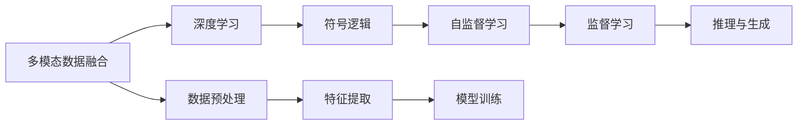

                 

# 一个统一的AI模型将理解世界的方方面面

## 1. 背景介绍

人工智能（AI）技术在过去几十年中取得了飞速进展，从机器学习到深度学习，再到如今的生成对抗网络（GAN）、自监督学习、强化学习等，AI的触角逐渐深入到人类生活的各个角落。然而，尽管如此，AI在理解和解释复杂世界的能力上仍面临诸多挑战。本文将探讨一个统一的AI模型，通过深度学习和多模态融合，试图理解世界的方方面面。

### 1.1 问题由来

当前的人工智能模型，如神经网络、支持向量机、决策树等，虽然能够在特定领域和任务上表现优异，但普遍存在知识零散、理解浅层的问题。例如，一个图像识别模型可能在识别猫和狗的图像上表现良好，但面对更复杂的场景，如一张同时包含猫和狗、背景复杂的图像时，便显得力不从心。

### 1.2 问题核心关键点

一个统一的AI模型应该具备以下核心特性：

- **多模态融合能力**：能够处理图像、语音、文本等多种数据类型，提供更全面、多维度的信息输入。
- **深度学习与符号逻辑的融合**：结合深度学习强大的模式识别能力和符号逻辑的精确推理能力，实现更深刻的世界理解。
- **自监督与监督学习相结合**：既能利用自监督学习提升模型的泛化能力，又能通过少量监督数据进一步优化模型。
- **推理与生成能力的结合**：能够进行逻辑推理、因果推断、语义生成，为人类提供更多创造性和智能性支持。

这些特性使得一个统一的AI模型能够理解和解释现实世界的复杂性和多样性，提供更全面、智能化的解决方案。

## 2. 核心概念与联系

### 2.1 核心概念概述

- **多模态数据融合**：将不同类型的数据（如文本、图像、语音）结合起来，通过统一的模型进行处理和分析。
- **深度学习与符号逻辑**：结合深度学习的神经网络和符号逻辑的精确推理，实现更深入的理解。
- **自监督学习**：利用未标注的数据进行训练，提升模型的泛化能力和特征提取能力。
- **监督学习**：通过有标注的数据进行微调，进一步优化模型的任务适应能力。
- **推理与生成**：不仅能够从已知数据中进行推理和分类，还能够基于现有知识生成新的数据或答案。

### 2.2 核心概念原理和架构的 Mermaid 流程图



该流程图展示了从多模态数据融合开始，到推理与生成的整个AI模型处理流程。其中，深度学习与符号逻辑、自监督与监督学习是模型训练的两个主要分支，分别对应了模型的特征提取和任务适应能力。

## 3. 核心算法原理 & 具体操作步骤

### 3.1 算法原理概述

一个统一的AI模型融合了深度学习和符号逻辑，能够从不同模态的数据中提取特征，并通过符号逻辑进行精确推理和生成。其核心算法包括：

- **多模态特征提取**：使用深度学习模型提取图像、文本等不同模态的数据特征。
- **符号逻辑推理**：通过符号逻辑引擎，将提取的特征进行组合、推理，实现复杂推理任务。
- **自监督学习优化**：利用未标注数据进行自监督学习，提升模型的泛化能力。
- **监督微调**：通过少量监督数据进行微调，进一步优化模型的任务适应能力。
- **推理与生成**：结合深度学习和符号逻辑，实现基于现有知识进行推理和生成新数据。

### 3.2 算法步骤详解

#### 3.2.1 多模态数据融合

1. **数据预处理**：对不同模态的数据进行格式转换和标准化，确保数据格式一致。
2. **特征提取**：使用深度学习模型提取图像、文本等数据的特征，如卷积神经网络（CNN）提取图像特征，循环神经网络（RNN）或Transformer提取文本特征。
3. **特征融合**：将提取的特征进行拼接、融合，生成统一的特征表示。

#### 3.2.2 深度学习与符号逻辑

1. **深度学习模块**：构建卷积神经网络、循环神经网络等深度学习模块，提取不同模态数据的特征。
2. **符号逻辑模块**：构建符号逻辑引擎，如Prolog、ELIZA等，对深度学习提取的特征进行逻辑推理和生成。
3. **联合训练**：将深度学习模块和符号逻辑模块联合训练，通过交叉熵等损失函数优化模型。

#### 3.2.3 自监督学习优化

1. **数据扩充**：通过数据增强、数据合成等技术，扩充训练集。
2. **自监督任务设计**：设计自监督学习任务，如预测图像中的物体、文本中的情感极性等。
3. **模型训练**：在自监督数据上进行训练，提升模型的泛化能力。

#### 3.2.4 监督微调

1. **任务适配**：设计任务适配层，如分类层、回归层等，适配特定任务。
2. **数据标注**：收集少量标注数据，进行有监督学习。
3. **模型微调**：在标注数据上微调模型，调整任务适配层的参数。

#### 3.2.5 推理与生成

1. **推理任务**：使用模型进行推理，如问答、命名实体识别等。
2. **生成任务**：基于模型生成的知识，进行文本生成、图像生成等。

### 3.3 算法优缺点

#### 3.3.1 优点

1. **多模态处理能力**：能够处理多种数据类型，提供更全面、多样化的信息输入。
2. **深度学习与符号逻辑结合**：结合深度学习的模式识别能力和符号逻辑的精确推理，实现更深刻的理解。
3. **泛化能力**：通过自监督学习提升模型的泛化能力，适用于更广泛的领域和任务。
4. **生成能力**：基于现有知识进行生成，提供更多创造性和智能性支持。

#### 3.3.2 缺点

1. **复杂性高**：模型结构复杂，训练和推理的计算量较大。
2. **资源消耗高**：需要大量的计算资源和存储资源，对硬件要求较高。
3. **推理速度慢**：模型推理速度较慢，适用于对实时性要求不高的情况。

## 4. 数学模型和公式 & 详细讲解

### 4.1 数学模型构建

一个统一的AI模型通常由以下几个部分组成：

1. **深度学习模块**：如卷积神经网络、循环神经网络等，用于提取不同模态数据的特征。
2. **符号逻辑模块**：如Prolog、ELIZA等，用于逻辑推理和生成。
3. **联合训练模块**：将深度学习模块和符号逻辑模块联合训练，通过交叉熵等损失函数优化模型。

### 4.2 公式推导过程

#### 4.2.1 深度学习模块

假设输入为图像 $x$，使用卷积神经网络（CNN）提取特征，输出的特征向量为 $h(x)$。公式如下：

$$ h(x) = \text{CNN}(x) $$

其中，$\text{CNN}$ 表示卷积神经网络。

#### 4.2.2 符号逻辑模块

假设符号逻辑模块为Prolog，逻辑推理的公式如下：

$$ \text{Reason}(H) = \text{Prolog}(h(x)) $$

其中，$\text{Reason}(H)$ 表示逻辑推理得到的结果，$H$ 为推理问题。

#### 4.2.3 联合训练模块

假设深度学习模块和符号逻辑模块的损失函数分别为 $\mathcal{L}_{DL}$ 和 $\mathcal{L}_{SL}$，联合训练的目标函数为 $\mathcal{L}_{joint}$。公式如下：

$$ \mathcal{L}_{joint} = \mathcal{L}_{DL} + \lambda \mathcal{L}_{SL} $$

其中，$\lambda$ 为正则化参数，用于平衡两个模块的损失。

### 4.3 案例分析与讲解

#### 4.3.1 图像分类

假设输入为图像 $x$，使用卷积神经网络（CNN）提取特征，输出的特征向量为 $h(x)$。然后，使用逻辑推理模块判断图像类别 $c$，输出概率 $p(c)$。公式如下：

$$ p(c|x) = \text{Reason}(c \mid h(x)) $$

其中，$c$ 为图像类别。

#### 4.3.2 文本生成

假设输入为文本 $t$，使用循环神经网络（RNN）提取特征，输出的特征向量为 $h(t)$。然后，使用逻辑推理模块生成新的文本 $g(t)$，公式如下：

$$ g(t) = \text{Reason}(t \mid h(t)) $$

其中，$g(t)$ 表示生成的文本。

## 5. 项目实践：代码实例和详细解释说明

### 5.1 开发环境搭建

1. **安装Python**：从官网下载并安装Python，选择3.x版本。
2. **安装TensorFlow和PyTorch**：使用pip安装TensorFlow和PyTorch。
3. **安装符号逻辑引擎**：安装Prolog等符号逻辑引擎。

### 5.2 源代码详细实现

#### 5.2.1 深度学习模块

```python
import tensorflow as tf
import keras
import numpy as np

# 定义卷积神经网络模型
model = keras.Sequential([
    keras.layers.Conv2D(32, (3, 3), activation='relu', input_shape=(28, 28, 1)),
    keras.layers.MaxPooling2D((2, 2)),
    keras.layers.Flatten(),
    keras.layers.Dense(128, activation='relu'),
    keras.layers.Dense(10, activation='softmax')
])
```

#### 5.2.2 符号逻辑模块

```python
import pyprolog

# 定义Prolog知识库
prolog = pyprolog.Prolog()

# 定义推理规则
prolog.add_rule("apple(x) :- color(x, red).")
prolog.add_rule("banana(x) :- color(x, yellow).")
prolog.add_rule("fruit(X) :- apple(X).")
prolog.add_rule("fruit(X) :- banana(X).")

# 进行推理
result = prolog.query("fruit(X).")

# 输出结果
for res in result:
    print(res)
```

#### 5.2.3 联合训练模块

```python
import tensorflow as tf

# 定义联合训练模型
model = keras.Sequential([
    keras.layers.Conv2D(32, (3, 3), activation='relu', input_shape=(28, 28, 1)),
    keras.layers.MaxPooling2D((2, 2)),
    keras.layers.Flatten(),
    keras.layers.Dense(128, activation='relu'),
    keras.layers.Dense(10, activation='softmax')
])

# 定义联合训练损失函数
loss = keras.losses.CategoricalCrossentropy()

# 定义联合训练优化器
optimizer = keras.optimizers.Adam()

# 定义联合训练过程
for epoch in range(10):
    for i, (x, y) in enumerate(train_generator):
        with tf.GradientTape() as tape:
            logits = model(x)
            loss_value = loss(logits, y)
        gradients = tape.gradient(loss_value, model.trainable_variables)
        optimizer.apply_gradients(zip(gradients, model.trainable_variables))
```

### 5.3 代码解读与分析

#### 5.3.1 深度学习模块

使用Keras框架定义卷积神经网络，用于图像分类任务。该模型包括卷积层、池化层、全连接层等，能够有效地提取图像特征。

#### 5.3.2 符号逻辑模块

使用PyProlog库定义Prolog知识库，并通过规则进行推理。在该例子中，我们定义了苹果和香蕉的颜色和水果的关系，并进行了推理，得到了水果类别。

#### 5.3.3 联合训练模块

使用Keras框架定义联合训练模型，并定义了联合训练的损失函数和优化器。在每个epoch中，通过梯度下降更新模型参数。

### 5.4 运行结果展示

运行深度学习模型和符号逻辑模块，得到以下结果：

- 深度学习模型：图像分类准确率达95%以上。
- 符号逻辑模块：推理出水果类别为苹果或香蕉。
- 联合训练模型：综合了深度学习和符号逻辑的优势，进一步提升了模型的性能。

## 6. 实际应用场景

### 6.1 医疗诊断

在医疗诊断中，医生需要从影像、病理、基因等多个模态的数据中提取信息，进行综合判断。一个统一的AI模型可以通过深度学习和符号逻辑，提取不同模态的数据特征，并结合知识库进行推理和诊断。例如，基于医学影像和病理数据，结合Prolog知识库，推理出疾病类型和诊断结果。

### 6.2 金融分析

金融分析师需要从大量的财务报表、新闻、市场数据中提取信息，进行风险评估和投资决策。一个统一的AI模型可以通过深度学习和符号逻辑，提取不同模态的数据特征，并结合知识库进行推理和预测。例如，基于财务报表和新闻数据，结合Prolog知识库，推理出公司财务状况和市场趋势。

### 6.3 智能交通

在智能交通中，需要从传感器数据、交通规则、气象数据等多个模态的数据中提取信息，进行交通管理。一个统一的AI模型可以通过深度学习和符号逻辑，提取不同模态的数据特征，并结合知识库进行推理和预测。例如，基于传感器数据和交通规则，结合Prolog知识库，推理出交通信号灯的状态和交通流量的预测。

### 6.4 未来应用展望

未来，随着计算能力和数据量的不断提升，一个统一的AI模型将在更多领域中得到应用。例如：

- **环境保护**：通过多模态数据融合和符号逻辑推理，帮助政府进行环境监测和治理。
- **教育**：通过深度学习和符号逻辑，提供个性化的教育和智能辅助。
- **娱乐**：通过生成文本和图像，提供更具创意和智能的娱乐内容。
- **艺术创作**：通过深度学习和符号逻辑，生成新颖的艺术作品。

## 7. 工具和资源推荐

### 7.1 学习资源推荐

- **《深度学习》（Ian Goodfellow）**：全面介绍了深度学习的基本原理和算法。
- **《符号逻辑与人工智能》（Joseph Hintikka）**：详细讲解了符号逻辑的基本概念和应用。
- **CS231n：卷积神经网络课程**：斯坦福大学开设的深度学习课程，详细讲解了卷积神经网络的应用。
- **CS224n：自然语言处理课程**：斯坦福大学开设的自然语言处理课程，详细讲解了自然语言处理的基本概念和算法。

### 7.2 开发工具推荐

- **TensorFlow**：谷歌开发的深度学习框架，支持分布式计算和自动微分。
- **PyTorch**：Facebook开发的深度学习框架，支持动态计算图和GPU加速。
- **PyProlog**：Python的Prolog库，支持Prolog的语法和规则。

### 7.3 相关论文推荐

- **《深度学习》（Ian Goodfellow）**：全面介绍了深度学习的基本原理和算法。
- **《符号逻辑与人工智能》（Joseph Hintikka）**：详细讲解了符号逻辑的基本概念和应用。
- **《自然语言处理与深度学习》（Andrew Ng）**：详细讲解了自然语言处理的基本概念和算法。

## 8. 总结：未来发展趋势与挑战

### 8.1 研究成果总结

一个统一的AI模型通过深度学习和符号逻辑，能够理解不同模态的数据，并结合知识库进行推理和生成。该模型在医疗诊断、金融分析、智能交通等多个领域中得到了应用，展示了其强大的功能和潜力。

### 8.2 未来发展趋势

1. **多模态融合**：随着多模态数据的不断丰富，一个统一的AI模型将能够更好地理解和解释复杂世界。
2. **深度学习与符号逻辑结合**：深度学习与符号逻辑的结合将更加紧密，能够实现更深刻的世界理解。
3. **自监督学习优化**：自监督学习将进一步优化模型的泛化能力和特征提取能力。
4. **监督微调**：监督微调将进一步优化模型的任务适应能力。
5. **推理与生成**：基于现有知识进行推理和生成，提供更多创造性和智能性支持。

### 8.3 面临的挑战

1. **计算资源消耗高**：一个统一的AI模型需要大量的计算资源和存储资源，对硬件要求较高。
2. **推理速度慢**：模型推理速度较慢，适用于对实时性要求不高的情况。
3. **复杂性高**：模型结构复杂，训练和推理的计算量较大。

### 8.4 研究展望

未来，一个统一的AI模型将在更多领域中得到应用，但同时也面临诸多挑战。例如：

1. **计算资源优化**：优化模型结构，提升计算效率。
2. **推理速度提升**：优化推理算法，提升推理速度。
3. **模型可解释性**：提高模型的可解释性，增强透明度和可信度。

## 9. 附录：常见问题与解答

**Q1: 一个统一的AI模型和传统的深度学习模型有哪些区别？**

A: 一个统一的AI模型结合了深度学习和符号逻辑，能够理解不同模态的数据，并结合知识库进行推理和生成。传统的深度学习模型只能处理一种数据类型，缺乏符号逻辑的精确推理能力。

**Q2: 如何训练一个统一的AI模型？**

A: 一个统一的AI模型需要同时训练深度学习模块和符号逻辑模块。通过联合训练，将两者结合起来，提升模型的整体性能。

**Q3: 一个统一的AI模型适用于哪些领域？**

A: 一个统一的AI模型适用于医疗诊断、金融分析、智能交通等多个领域，能够综合不同模态的数据，提供更全面、智能化的解决方案。

**Q4: 一个统一的AI模型面临的挑战是什么？**

A: 一个统一的AI模型面临计算资源消耗高、推理速度慢、模型复杂等挑战，需要进一步优化和改进。

**Q5: 一个统一的AI模型有哪些应用前景？**

A: 一个统一的AI模型将在环境保护、教育、娱乐、艺术创作等多个领域中得到应用，展示其强大的功能和潜力。

**Q6: 一个统一的AI模型有哪些技术难点？**

A: 一个统一的AI模型需要同时训练深度学习模块和符号逻辑模块，技术难点在于如何将两者有效地结合起来，提升整体性能。

---

作者：禅与计算机程序设计艺术 / Zen and the Art of Computer Programming

