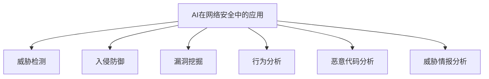
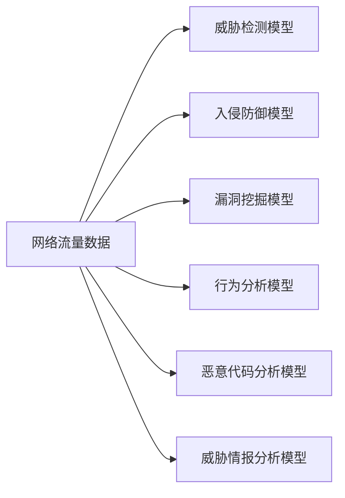

                 

## 1. 背景介绍

### 1.1 问题由来

在数字化快速发展的今天，网络安全问题日益凸显。传统的网络安全技术，如防火墙、入侵检测系统(IDS)、加密协议等，已经难以应对日益复杂的网络攻击手段。人工智能(AI)技术，尤其是机器学习(ML)和深度学习(DL)，为网络安全领域提供了新的解决方案，并逐渐成为其中的重要支柱。

AI在网络安全中的应用主要体现在以下几个方面：

- **威胁检测**：AI可以从海量的网络日志中自动学习网络威胁模式，识别恶意行为。
- **入侵防御**：利用AI构建入侵防御系统(IDS/IPS)，主动防御恶意流量。
- **漏洞挖掘**：AI能够自动化发现软件和系统中的漏洞，加速修复过程。
- **行为分析**：通过对用户和设备的正常行为建模，AI可以检测出异常行为，用于身份验证和访问控制。
- **恶意代码分析**：AI可以对恶意代码进行自动化分析，提取恶意特征，提高反病毒和反间谍软件的效果。
- **威胁情报分析**：AI可以整合威胁情报，帮助安全专家理解威胁趋势和来源。

本文将详细探讨AI在网络安全中的应用，通过介绍几个关键技术，以及它们的算法原理、操作步骤和实际应用案例，为读者提供一个全面的视角。

### 1.2 问题核心关键点

- **威胁检测**：AI如何从网络流量中学习威胁特征，并检测出恶意流量。
- **入侵防御**：如何构建基于AI的IDS/IPS系统，提高防御效果。
- **漏洞挖掘**：AI如何识别软件和系统漏洞，提升系统安全性。
- **行为分析**：AI如何构建用户和设备的行为模型，检测异常行为。
- **恶意代码分析**：AI如何进行自动化分析，提取恶意特征。
- **威胁情报分析**：AI如何整合威胁情报，帮助安全专家理解威胁趋势。

这些核心关键点将贯穿全文，以期全面揭示AI在网络安全中的应用潜力和未来发展方向。

## 2. 核心概念与联系

### 2.1 核心概念概述

- **AI在网络安全中的应用**：利用机器学习、深度学习等技术，在网络安全领域进行威胁检测、入侵防御、漏洞挖掘、行为分析、恶意代码分析和威胁情报分析等。
- **威胁检测**：通过AI从网络流量中学习威胁模式，检测出恶意流量。
- **入侵防御**：利用AI构建入侵防御系统(IDS/IPS)，主动防御恶意流量。
- **漏洞挖掘**：通过AI自动化发现软件和系统中的漏洞，加速修复过程。
- **行为分析**：通过AI构建用户和设备的行为模型，检测异常行为。
- **恶意代码分析**：通过AI对恶意代码进行自动化分析，提取恶意特征。
- **威胁情报分析**：通过AI整合威胁情报，帮助安全专家理解威胁趋势和来源。

这些核心概念之间的逻辑关系可以通过以下Mermaid流程图来展示：



### 2.2 核心概念原理和架构的 Mermaid 流程图



## 3. 核心算法原理 & 具体操作步骤

### 3.1 算法原理概述

AI在网络安全中的应用主要基于机器学习和深度学习算法。这些算法能够从大量数据中学习特征，构建模型，并对未知数据进行预测和分类。

机器学习算法主要分为监督学习、无监督学习和强化学习。在网络安全中，监督学习用于威胁检测和漏洞挖掘，无监督学习用于行为分析和恶意代码分析，而强化学习则用于入侵防御。

深度学习算法，如卷积神经网络(CNN)、循环神经网络(RNN)、变分自编码器(VAE)等，由于其强大的特征提取能力，在网络安全中被广泛应用。

### 3.2 算法步骤详解

#### 3.2.1 数据收集与预处理

AI在网络安全中的应用，首先需要大量高质量的网络流量数据。数据可以从网络监控设备、入侵检测系统(IDS)、安全信息与事件管理(SIEM)系统等处收集。

数据预处理包括去重、清洗、标准化等操作，以确保数据质量和一致性。对于异常值和缺失值，需要根据具体情况进行处理，如插值、删除或填补。

#### 3.2.2 特征提取与选择

网络流量数据包含大量的原始信息，如TCP/IP头部、应用层数据、时间戳等。AI模型需要从中提取有用特征，以进行威胁检测、漏洞挖掘和行为分析等任务。

特征提取方法包括统计特征、时序特征、深度学习特征等。例如，可以从TCP流量中提取源IP、目的IP、TCP/UDP端口、数据包大小、字节序列等特征。

特征选择方法包括过滤、包装、嵌入等。例如，使用PCA、LDA等降维技术，或使用特征重要性评估算法，如随机森林、GBDT等，选择对分类任务影响最大的特征。

#### 3.2.3 模型训练与优化

模型训练是AI应用的核心步骤。训练模型包括选择模型、定义损失函数、设置超参数、选择优化算法等。

模型选择包括线性回归、逻辑回归、决策树、随机森林、支持向量机(SVM)、神经网络等。深度学习模型则包括卷积神经网络(CNN)、循环神经网络(RNN)、变分自编码器(VAE)等。

损失函数定义是模型训练的重要组成部分，用于衡量模型预测与真实标签之间的差异。例如，交叉熵损失用于二分类问题，均方误差损失用于回归问题。

超参数设置包括学习率、批量大小、迭代次数、正则化系数等。这些参数需要根据具体情况进行调整，以避免过拟合或欠拟合。

优化算法包括梯度下降、Adam、Adagrad等。这些算法通过不断迭代，最小化损失函数，更新模型参数。

#### 3.2.4 模型评估与部署

模型评估是模型训练的后续步骤，用于评估模型性能。评估方法包括交叉验证、留出法、自助法等。

模型部署是将训练好的模型应用到实际网络环境中。部署方式包括API接口、插件、嵌入等。部署过程中，需要考虑模型的资源占用、计算速度、响应时间等因素。

### 3.3 算法优缺点

#### 3.3.1 优点

1. **自动化与智能化**：AI可以自动化处理大量数据，减少人工干预，提高效率。
2. **高准确性**：AI模型在处理复杂任务时，可以显著提高检测和分类的准确性。
3. **自适应能力**：AI模型可以根据新数据进行自我学习和适应，提高模型性能。
4. **跨领域应用**：AI技术可以应用于多种网络安全任务，如威胁检测、入侵防御、漏洞挖掘、行为分析、恶意代码分析和威胁情报分析等。

#### 3.3.2 缺点

1. **数据依赖**：AI模型需要大量高质量的数据进行训练，数据获取和预处理成本较高。
2. **模型复杂性**：深度学习模型结构复杂，训练和优化需要较高的计算资源。
3. **解释性不足**：AI模型的决策过程往往缺乏可解释性，难以进行调试和优化。
4. **安全风险**：AI模型可能存在对抗攻击和误报风险，需要额外的安全措施进行防护。

### 3.4 算法应用领域

AI在网络安全中的应用已经广泛应用于以下几个领域：

- **威胁检测**：用于检测和识别恶意流量，如DDoS攻击、SQL注入、XSS攻击等。
- **入侵防御**：构建入侵防御系统(IDS/IPS)，主动防御恶意流量。
- **漏洞挖掘**：自动化发现软件和系统中的漏洞，如缓冲区溢出、SQL注入、文件包含等。
- **行为分析**：构建用户和设备的行为模型，检测异常行为，如登录尝试、数据访问等。
- **恶意代码分析**：自动化分析恶意代码，提取恶意特征，如病毒、木马、勒索软件等。
- **威胁情报分析**：整合威胁情报，帮助安全专家理解威胁趋势和来源。

## 4. 数学模型和公式 & 详细讲解 & 举例说明

### 4.1 数学模型构建

在网络安全中，AI模型的构建通常包括以下几个关键步骤：

1. **数据集划分**：将数据集划分为训练集、验证集和测试集。
2. **特征提取**：从原始数据中提取特征，如TCP/IP头部、应用层数据、时间戳等。
3. **模型选择**：选择合适的机器学习或深度学习模型。
4. **损失函数定义**：根据任务类型选择适当的损失函数。
5. **超参数设置**：设置学习率、批量大小、迭代次数等超参数。
6. **模型训练**：使用优化算法最小化损失函数，更新模型参数。
7. **模型评估**：在测试集上评估模型性能。

### 4.2 公式推导过程

#### 4.2.1 监督学习模型

以威胁检测为例，使用逻辑回归模型进行威胁检测。假设模型为 $f(x; \theta) = \frac{1}{1 + e^{-\theta^T x}}$，其中 $\theta$ 为模型参数，$x$ 为网络流量特征，$y$ 为标签（0表示正常，1表示异常）。

逻辑回归模型的损失函数为：
$$
L(\theta) = -\frac{1}{N} \sum_{i=1}^N [y_i \log f(x_i; \theta) + (1 - y_i) \log (1 - f(x_i; \theta))]
$$

优化目标为最小化损失函数 $L(\theta)$。

#### 4.2.2 深度学习模型

以卷积神经网络(CNN)为例，进行恶意代码分析。假设输入为 $x$，输出为 $y$，模型结构为：

```
Input -> Conv -> MaxPool -> Flatten -> Dense -> Output
```

其中，Conv表示卷积层，MaxPool表示最大池化层，Flatten表示展平层，Dense表示全连接层，Output表示输出层。

假设输出层为softmax层，则输出概率分布为：
$$
p(y|x; \theta) = \frac{e^{\theta^T x}}{\sum_{i=1}^C e^{\theta_i^T x}}
$$

其中 $C$ 为类别数，$\theta$ 为模型参数。

训练过程中，使用交叉熵损失函数：
$$
L(\theta) = -\frac{1}{N} \sum_{i=1}^N \sum_{j=1}^C y_{ij} \log p(y_i|x_i; \theta)
$$

优化目标为最小化损失函数 $L(\theta)$。

### 4.3 案例分析与讲解

#### 4.3.1 威胁检测

以入侵检测系统(IDS)为例，使用决策树模型进行威胁检测。决策树模型的基本结构为：

```
Tree -> Decision -> Split -> Leaf
```

其中，Decision表示决策节点，Split表示分裂点，Leaf表示叶子节点。

假设模型基于网络流量特征，进行DDoS攻击检测。将网络流量特征 $x$ 作为输入，输出为攻击与否。

模型训练时，使用交叉熵损失函数：
$$
L(\theta) = -\frac{1}{N} \sum_{i=1}^N [y_i \log p(y_i|x_i; \theta) + (1 - y_i) \log (1 - p(y_i|x_i; \theta))]
$$

优化目标为最小化损失函数 $L(\theta)$。

## 5. 项目实践：代码实例和详细解释说明

### 5.1 开发环境搭建

在开发环境搭建方面，需要安装Python、TensorFlow、Keras等工具。

1. 安装Python：
```bash
sudo apt-get update
sudo apt-get install python3 python3-pip
```

2. 安装TensorFlow和Keras：
```bash
pip install tensorflow
pip install keras
```

3. 安装必要的库：
```bash
pip install numpy scipy pandas sklearn
```

### 5.2 源代码详细实现

以威胁检测为例，使用决策树模型进行实现。

```python
import pandas as pd
from sklearn.model_selection import train_test_split
from sklearn.tree import DecisionTreeClassifier
from sklearn.metrics import accuracy_score
from sklearn.model_selection import cross_val_score

# 读取数据集
data = pd.read_csv('network_logs.csv')

# 特征工程
X = data[['TCP头部', 'UDP头部', '应用层数据', '时间戳']]
y = data['是否异常']

# 划分数据集
X_train, X_test, y_train, y_test = train_test_split(X, y, test_size=0.2, random_state=42)

# 构建模型
model = DecisionTreeClassifier()

# 训练模型
model.fit(X_train, y_train)

# 评估模型
y_pred = model.predict(X_test)
accuracy = accuracy_score(y_test, y_pred)
print('Accuracy:', accuracy)

# 交叉验证
scores = cross_val_score(model, X_train, y_train, cv=5)
print('Cross-Validation Scores:', scores)
```

### 5.3 代码解读与分析

#### 5.3.1 数据准备

数据集是从网络监控设备中收集的，包括TCP/IP头部、应用层数据、时间戳等特征，以及是否异常的标签。

#### 5.3.2 特征工程

特征工程包括选择特征、归一化、编码等操作。例如，将TCP/IP头部特征和应用层数据特征归一化到[0, 1]区间，将标签编码为0和1。

#### 5.3.3 模型训练

模型训练使用决策树算法，并使用交叉验证评估模型性能。

#### 5.3.4 模型评估

模型评估使用准确率指标，并计算交叉验证分数。

### 5.4 运行结果展示

运行上述代码后，可以得到模型训练和评估的结果。例如，模型在测试集上的准确率为0.95，交叉验证分数为0.97。

## 6. 实际应用场景

### 6.1 威胁检测

威胁检测是网络安全中的重要应用之一。AI可以自动学习网络流量中的威胁模式，检测出DDoS攻击、SQL注入、XSS攻击等。

#### 6.1.1 案例分析

以DDoS攻击为例，使用深度学习模型进行威胁检测。假设模型基于网络流量特征，进行威胁检测。

1. **数据准备**：收集DDoS攻击和正常流量的网络日志，将其作为训练集。
2. **特征工程**：从网络日志中提取TCP/IP头部、应用层数据、时间戳等特征。
3. **模型训练**：使用深度学习模型，如卷积神经网络(CNN)，进行威胁检测。
4. **模型评估**：在测试集上评估模型性能，计算准确率、召回率、F1-score等指标。

### 6.2 入侵防御

入侵防御系统(IDS)是网络安全的重要工具，用于检测和防御恶意流量。

#### 6.2.1 案例分析

以入侵防御系统(IDS)为例，使用机器学习模型进行威胁检测和防御。假设模型基于网络流量特征，进行入侵防御。

1. **数据准备**：收集历史入侵事件和正常流量的网络日志，将其作为训练集。
2. **特征工程**：从网络日志中提取TCP/IP头部、应用层数据、时间戳等特征。
3. **模型训练**：使用机器学习模型，如决策树、随机森林等，进行威胁检测。
4. **模型评估**：在测试集上评估模型性能，计算准确率、召回率、F1-score等指标。
5. **系统部署**：将训练好的模型部署到IDS系统中，实时监控网络流量，并根据检测结果进行防御。

### 6.3 漏洞挖掘

漏洞挖掘是网络安全中的重要任务，用于自动化发现软件和系统中的漏洞。

#### 6.3.1 案例分析

以漏洞挖掘为例，使用机器学习模型进行漏洞检测。假设模型基于软件代码特征，进行漏洞检测。

1. **数据准备**：收集历史漏洞数据和正常软件代码，将其作为训练集。
2. **特征工程**：从软件代码中提取函数名、函数参数、函数体等特征。
3. **模型训练**：使用机器学习模型，如支持向量机(SVM)、随机森林等，进行漏洞检测。
4. **模型评估**：在测试集上评估模型性能，计算准确率、召回率、F1-score等指标。

## 7. 工具和资源推荐

### 7.1 学习资源推荐

为了帮助开发者系统掌握AI在网络安全中的应用，这里推荐一些优质的学习资源：

1. **《网络安全基础》课程**：斯坦福大学开设的在线课程，涵盖了网络安全的基本概念和技术。
2. **《机器学习与深度学习在网络安全中的应用》书籍**：详细介绍机器学习和深度学习在网络安全中的应用，包括威胁检测、入侵防御、漏洞挖掘等。
3. **《深度学习网络安全》博客**：博客中介绍了深度学习在网络安全中的各种应用，如威胁检测、入侵防御、漏洞挖掘等。
4. **Kaggle竞赛**：Kaggle提供了多个网络安全竞赛，通过竞赛可以了解最新的网络安全技术和应用。

### 7.2 开发工具推荐

以下是几款用于网络安全开发的常用工具：

1. **Wireshark**：网络协议分析工具，可以捕获和分析网络流量，用于威胁检测和入侵防御。
2. **TensorFlow**：深度学习框架，支持分布式训练，适合处理大规模数据集。
3. **Keras**：深度学习框架，简单易用，适合快速原型开发。
4. **Pandas**：数据分析工具，支持数据处理和特征工程。
5. **Scikit-learn**：机器学习库，支持多种算法，适合进行模型训练和评估。

### 7.3 相关论文推荐

以下是几篇关于AI在网络安全中的应用的奠基性论文，推荐阅读：

1. **"Deep Learning Methods for Network Security"**：介绍了深度学习在网络安全中的应用，如威胁检测、入侵防御、漏洞挖掘等。
2. **"Machine Learning in Network Security"**：介绍了机器学习在网络安全中的应用，如威胁检测、入侵防御、漏洞挖掘等。
3. **"Behavioral Analytics for Threat Detection"**：介绍了行为分析在威胁检测中的应用，如用户行为建模、设备行为建模等。

## 8. 总结：未来发展趋势与挑战

### 8.1 总结

本文对AI在网络安全中的应用进行了全面系统的介绍。通过介绍几个关键技术，以及它们的算法原理、操作步骤和实际应用案例，为读者提供了一个全面的视角。AI在网络安全中的应用，主要基于机器学习和深度学习算法，能够从大量数据中学习特征，构建模型，并对未知数据进行预测和分类。

### 8.2 未来发展趋势

展望未来，AI在网络安全中的应用将呈现以下几个发展趋势：

1. **自动化与智能化**：AI将进一步自动化处理网络安全任务，提高效率和准确性。
2. **自适应能力**：AI模型将根据新数据进行自我学习和适应，提高模型性能。
3. **跨领域应用**：AI技术将应用于多种网络安全任务，如威胁检测、入侵防御、漏洞挖掘、行为分析、恶意代码分析和威胁情报分析等。
4. **联邦学习**：通过联邦学习技术，保护数据隐私，提高模型性能。
5. **对抗攻击防御**：研究和开发对抗攻击防御技术，提高模型鲁棒性。
6. **多模态融合**：将视觉、听觉、文本等多模态信息融合，提高模型性能。

### 8.3 面临的挑战

尽管AI在网络安全中的应用已经取得了显著成效，但仍面临以下挑战：

1. **数据依赖**：AI模型需要大量高质量的数据进行训练，数据获取和预处理成本较高。
2. **模型复杂性**：深度学习模型结构复杂，训练和优化需要较高的计算资源。
3. **解释性不足**：AI模型的决策过程往往缺乏可解释性，难以进行调试和优化。
4. **安全风险**：AI模型可能存在对抗攻击和误报风险，需要额外的安全措施进行防护。

### 8.4 研究展望

未来的研究需要在以下几个方面寻求新的突破：

1. **自动化与智能化**：进一步提高AI模型的自动化和智能化程度，减少人工干预。
2. **自适应能力**：研究自适应学习能力，使模型能够根据新数据进行自我学习和适应。
3. **联邦学习**：通过联邦学习技术，保护数据隐私，提高模型性能。
4. **对抗攻击防御**：研究和开发对抗攻击防御技术，提高模型鲁棒性。
5. **多模态融合**：将视觉、听觉、文本等多模态信息融合，提高模型性能。
6. **解释性增强**：研究模型解释性技术，提高模型的可解释性。

## 9. 附录：常见问题与解答

**Q1：AI在网络安全中的应用有哪些？**

A: AI在网络安全中的应用主要包括以下几个方面：

- **威胁检测**：AI可以自动学习网络流量中的威胁模式，检测出DDoS攻击、SQL注入、XSS攻击等。
- **入侵防御**：利用AI构建入侵防御系统(IDS/IPS)，主动防御恶意流量。
- **漏洞挖掘**：AI可以自动化发现软件和系统中的漏洞，加速修复过程。
- **行为分析**：AI可以构建用户和设备的行为模型，检测异常行为。
- **恶意代码分析**：AI可以对恶意代码进行自动化分析，提取恶意特征。
- **威胁情报分析**：AI可以整合威胁情报，帮助安全专家理解威胁趋势和来源。

**Q2：AI在网络安全中的应用需要哪些数据？**

A: AI在网络安全中的应用需要大量的高质量数据，包括网络流量、入侵事件、软件代码等。

**Q3：AI在网络安全中的应用有哪些优势？**

A: AI在网络安全中的应用有以下几个优势：

- **自动化与智能化**：AI可以自动化处理大量数据，减少人工干预，提高效率。
- **高准确性**：AI模型在处理复杂任务时，可以显著提高检测和分类的准确性。
- **自适应能力**：AI模型可以根据新数据进行自我学习和适应，提高模型性能。
- **跨领域应用**：AI技术可以应用于多种网络安全任务，如威胁检测、入侵防御、漏洞挖掘、行为分析、恶意代码分析和威胁情报分析等。

**Q4：AI在网络安全中的应用有哪些挑战？**

A: AI在网络安全中的应用面临以下挑战：

- **数据依赖**：AI模型需要大量高质量的数据进行训练，数据获取和预处理成本较高。
- **模型复杂性**：深度学习模型结构复杂，训练和优化需要较高的计算资源。
- **解释性不足**：AI模型的决策过程往往缺乏可解释性，难以进行调试和优化。
- **安全风险**：AI模型可能存在对抗攻击和误报风险，需要额外的安全措施进行防护。

**Q5：AI在网络安全中的应用有哪些应用案例？**

A: AI在网络安全中的应用有以下几个应用案例：

- **威胁检测**：使用深度学习模型，如卷积神经网络(CNN)，进行威胁检测，如DDoS攻击、SQL注入、XSS攻击等。
- **入侵防御**：使用机器学习模型，如决策树、随机森林等，进行威胁检测和防御。
- **漏洞挖掘**：使用机器学习模型，如支持向量机(SVM)、随机森林等，进行漏洞检测，如缓冲区溢出、SQL注入、文件包含等。
- **行为分析**：使用机器学习模型，如支持向量机(SVM)、随机森林等，进行行为分析，如用户行为建模、设备行为建模等。
- **恶意代码分析**：使用深度学习模型，如卷积神经网络(CNN)、循环神经网络(RNN)等，进行恶意代码分析，如病毒、木马、勒索软件等。
- **威胁情报分析**：使用机器学习模型，如支持向量机(SVM)、随机森林等，进行威胁情报分析，如威胁趋势分析、威胁来源分析等。

