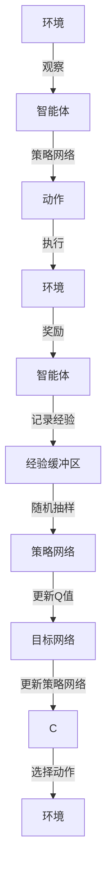

                 

# 一切皆是映射：DQN在游戏AI中的应用：案例与分析

> 关键词：Deep Q-Networks (DQN), 强化学习, 游戏AI, AlphaGo, 实时决策, 深度学习, 案例分析, 策略学习

## 1. 背景介绍

### 1.1 问题由来

在21世纪的技术浪潮中，深度学习和强化学习已经成为推动人工智能发展的两大核心技术。这些技术在游戏AI中的应用尤为突出，尤其是Deep Q-Networks（DQN），为游戏AI赋予了更加智能和高效的决策能力。

DQN是一种基于深度神经网络的强化学习算法，最初由Mnih等人在2013年提出，并在2016年AlphaGo的成功应用中达到了顶峰。AlphaGo通过DQN算法击败了围棋世界冠军李世石，成为人工智能领域的里程碑事件。

AlphaGo的成功引发了学界和工业界对DQN算法的广泛关注和深入研究。通过不断的优化和拓展，DQN在各种游戏AI领域得到了广泛应用，并在诸多游戏中取得了令人瞩目的成绩。例如，2018年OpenAI的DQN模型“OpenAI Five”在Dota 2游戏比赛中战胜了全球顶尖职业玩家。

### 1.2 问题核心关键点

DQN算法的核心思想是构建一个状态值函数$Q(s,a)$，其中$s$为当前状态，$a$为可能的动作。算法通过不断与环境交互，利用经验回溯和深度神经网络逼近，最大化长期累积奖励。DQN的核心在于将强化学习问题转化为一个深度学习问题，通过卷积神经网络(CNN)实现状态值的估计。

DQN算法的核心组成包括：

1. **策略网络**：用于评估当前状态$s$下不同动作$a$的Q值。
2. **目标网络**：用于存储训练过程中经验回溯的Q值。
3. **经验回溯**：使用神经网络参数更新，通过经验回溯和目标网络更新策略网络。
4. **神经网络优化**：通过反向传播算法优化神经网络参数，最小化Q值的预测误差。

这些关键组件使得DQN算法能够高效地学习复杂的决策策略，并在高维度、动态变化的环境中表现出色。

### 1.3 问题研究意义

DQN算法在游戏AI中的应用具有重要意义：

1. **提升游戏AI决策能力**：通过DQN算法，游戏AI能够在复杂的动态环境中快速做出最优决策，提高游戏的胜率和观赏性。
2. **降低游戏AI开发成本**：相比于传统的基于规则的AI系统，DQN算法无需详细设计游戏规则，可以自动学习和优化策略。
3. **推动游戏AI技术发展**：DQN算法在游戏AI中的应用为强化学习理论提供了宝贵的实证数据和实践经验，推动了AI技术的进步。
4. **激发更多AI应用领域**：DQN算法的成功应用证明了深度强化学习在多领域中的潜力，为其他领域如医疗、交通等的AI应用提供了参考。

## 2. 核心概念与联系

### 2.1 核心概念概述

为了更好地理解DQN算法在游戏AI中的应用，本节将介绍几个关键概念及其联系：

1. **强化学习(Reinforcement Learning, RL)**：一种通过智能体与环境的交互，学习最优策略的过程。强化学习的目标是通过最大化长期累积奖励，实现智能体的最优决策。
2. **深度Q-Networks (DQN)**：一种基于深度神经网络的强化学习算法，通过神经网络逼近Q值函数，实现高效、稳定的策略学习。
3. **状态值函数(Q-Value Function, Q(s,a))**：一个用于估计当前状态$s$下执行动作$a$的累积奖励的函数。DQN算法通过最大化Q值函数，实现最优策略的搜索。
4. **策略网络(Policy Network)**：一个用于预测动作概率的神经网络，输出动作的选择概率，并指导智能体执行动作。
5. **目标网络(Target Network)**：用于存储历史经验回溯的Q值，减少策略网络的更新频率，稳定学习过程。
6. **经验回溯(Experience Replay)**：一种存储和回溯过去经验的方法，通过随机样本更新策略网络，减少经验对策略网络的干扰。
7. **卷积神经网络(CNN)**：一种用于处理图像数据的深度神经网络，能够高效提取状态特征，适用于游戏AI中的视觉输入。

这些概念共同构成了DQN算法的基础框架，使其能够在各种复杂环境中学习最优决策策略。

### 2.2 核心概念原理和架构的 Mermaid 流程图

以下是DQN算法的基本流程图，展示了DQN算法在动态环境中的决策过程：



该图展示了智能体与环境交互的过程，通过观察状态、选择动作、执行动作、获取奖励、记录经验等步骤，不断优化策略网络，学习最优决策。

## 3. 核心算法原理 & 具体操作步骤

### 3.1 算法原理概述

DQN算法通过神经网络逼近状态值函数$Q(s,a)$，实现高效策略学习。算法核心在于通过经验回溯和目标网络更新策略网络，不断优化Q值函数的预测精度。

具体而言，DQN算法在每个时间步$T$，通过观察当前状态$s_T$，选择动作$a_T$，并执行动作$a_T$。根据动作$a_T$与环境交互得到下一个状态$s_{T+1}$和即时奖励$r_{T+1}$。智能体将经验$s_T,a_T,r_{T+1},s_{T+1}$记录到经验缓冲区，并从缓冲区中随机抽取一部分样本进行策略网络的更新。

在每个时间步结束时，智能体使用策略网络计算当前状态$s_T$下执行动作$a_T$的Q值，并使用目标网络更新策略网络，最小化Q值的预测误差。

### 3.2 算法步骤详解

DQN算法的核心步骤如下：

**Step 1: 准备数据与网络**
- 准备环境、状态空间、动作空间、智能体的观察、奖励等数据。
- 初始化策略网络和目标网络，选择合适的卷积神经网络(CNN)作为策略网络，与策略网络权重相同的另一个网络作为目标网络。
- 初始化经验缓冲区，存储智能体与环境交互的经验。

**Step 2: 策略网络训练**
- 在每个时间步$T$，智能体观察当前状态$s_T$，选择动作$a_T$并执行。
- 记录智能体与环境交互得到的下一个状态$s_{T+1}$和即时奖励$r_{T+1}$，并更新经验缓冲区。
- 从经验缓冲区中随机抽取$N$个样本$(s_i,a_i,r_i,s_{i+1})$，计算目标Q值$Q_{targ}$，并使用策略网络计算预测Q值$Q_{pred}$。
- 计算Q值的预测误差$Q_{err} = Q_{pred} - Q_{targ}$，反向传播更新策略网络。
- 使用策略网络计算当前状态$s_T$下执行动作$a_T$的Q值。

**Step 3: 目标网络更新**
- 使用经验回溯更新目标网络的权重，保证目标网络在较长时间内不更新，以稳定训练过程。

**Step 4: 优化参数**
- 通过优化策略网络的参数，最小化预测误差，逐步逼近真实的Q值函数。

**Step 5: 重复训练**
- 重复上述步骤，直到智能体能够在复杂环境中稳定地执行最优策略。

### 3.3 算法优缺点

DQN算法在游戏AI中的应用具有以下优点：

1. **高效学习**：DQN算法通过深度神经网络逼近Q值函数，能够高效学习复杂的决策策略。
2. **稳定优化**：目标网络的引入使得策略网络在较长时间内不更新，从而稳定了优化过程。
3. **适应性强**：DQN算法能够适应高维度、动态变化的环境，适用于各种复杂游戏。

同时，DQN算法也存在以下局限性：

1. **样本效率低**：经验回溯需要大量经验样本，而样本收集和存储过程较为耗时。
2. **学习过程易陷入局部最优**：在非凸优化问题中，DQN算法容易陷入局部最优，无法找到全局最优策略。
3. **网络参数量大**：卷积神经网络参数量较大，训练和推理过程资源消耗高。
4. **学习速度慢**：在高维度环境中，DQN算法的学习速度较慢，训练时间较长。

### 3.4 算法应用领域

DQN算法在游戏AI中的应用已经广泛应用于以下领域：

1. **游戏AI**：AlphaGo、OpenAI Five、DeepMind的AlphaStar等游戏中的AI系统，均采用了DQN算法。
2. **自动驾驶**：通过DQN算法训练自动驾驶车在复杂交通环境中进行决策。
3. **机器人控制**：在机器人操作、导航、抓取等任务中，DQN算法能够实现实时决策。
4. **金融交易**：在股票、期货等交易市场中，DQN算法能够实现智能投资策略。
5. **推荐系统**：在电子商务平台中，DQN算法能够实现个性化推荐策略。

## 4. 数学模型和公式 & 详细讲解 & 举例说明

### 4.1 数学模型构建

在DQN算法中，核心模型是状态值函数$Q(s,a)$。根据强化学习的定义，状态值函数表示在当前状态$s$下执行动作$a$的累积奖励。其数学表达式如下：

$$
Q(s,a) = \mathbb{E}[\sum_{t=0}^{\infty} \gamma^t r_{t+1} | s_t=s,a_t=a]
$$

其中$\gamma$为折扣因子，$r_{t+1}$为即时奖励。

DQN算法通过策略网络逼近状态值函数$Q(s,a)$，其神经网络结构如图1所示：


图1：DQN神经网络结构

### 4.2 公式推导过程

在DQN算法中，策略网络通过反向传播算法更新参数，最小化Q值的预测误差。以卷积神经网络为例，其更新过程如下：

**Step 1: 前向传播**
- 输入状态$s$，通过卷积神经网络得到动作概率分布$p_{\theta}(a|s)$。
- 选择动作$a$，并执行得到下一个状态$s'$和即时奖励$r'$。

**Step 2: 计算Q值**
- 使用策略网络计算当前状态$s$下执行动作$a$的预测Q值$Q_{pred}$。
- 计算目标Q值$Q_{targ}$，即$Q_{targ} = r' + \gamma max_{a'} Q(s',a')$。

**Step 3: 反向传播**
- 计算Q值的预测误差$Q_{err} = Q_{pred} - Q_{targ}$。
- 通过反向传播算法更新策略网络的参数，最小化预测误差。

### 4.3 案例分析与讲解

以AlphaGo为例，DQN算法通过深度神经网络逼近状态值函数$Q(s,a)$，实现最优决策策略的学习。具体而言：

1. **数据准备**：AlphaGo使用约3000万盘历史对弈数据作为预训练数据，构建了基于卷积神经网络的策略网络。
2. **策略网络训练**：AlphaGo在每次对弈中，通过观察当前状态$s$，选择动作$a$并执行，得到下一个状态$s'$和即时奖励$r'$。将经验$s_t,a_t,r_t,s_{t+1}$记录到经验缓冲区，并使用策略网络计算预测Q值。
3. **目标网络更新**：AlphaGo使用经验回溯更新目标网络的权重，从而稳定策略网络的优化过程。
4. **优化参数**：AlphaGo通过优化策略网络的参数，最小化Q值的预测误差，逐步逼近真实的Q值函数。
5. **策略改进**：AlphaGo通过与人类专家的对弈，逐步改进策略网络，提升决策能力。

通过上述步骤，AlphaGo最终在围棋领域取得了惊人的成绩，展示了DQN算法的强大威力。

## 5. 项目实践：代码实例和详细解释说明

### 5.1 开发环境搭建

在进行DQN项目实践前，我们需要准备好开发环境。以下是使用Python进行TensorFlow开发的环境配置流程：

1. 安装Anaconda：从官网下载并安装Anaconda，用于创建独立的Python环境。

2. 创建并激活虚拟环境：
```bash
conda create -n tf-env python=3.8 
conda activate tf-env
```

3. 安装TensorFlow：从官网获取最新的TensorFlow安装命令，安装指定版本的TensorFlow。例如：
```bash
conda install tensorflow
```

4. 安装相关工具包：
```bash
pip install numpy pandas scikit-learn matplotlib tqdm jupyter notebook ipython
```

完成上述步骤后，即可在`tf-env`环境中开始DQN实践。

### 5.2 源代码详细实现

这里我们以DQN算法在Keras库的实现为例，给出完整的代码实现。

首先，定义环境、状态、动作等数据结构：

```python
import tensorflow as tf
from tensorflow.keras import layers

# 定义环境数据结构
class Environment:
    def __init__(self, state_dim, action_dim):
        self.state_dim = state_dim
        self.action_dim = action_dim
        self.state = None
        self.action = None
        self.reward = None
        self.next_state = None

    def reset(self):
        self.state = self.random_state(self.state_dim)
        self.action = self.random_action(self.action_dim)
        self.reward = self.random_reward()
        self.next_state = self.random_next_state(self.state_dim)
        return self.state, self.action, self.reward, self.next_state

    def step(self):
        self.state, self.action, self.reward, self.next_state = self.state, self.action, self.random_reward(), self.random_next_state(self.state_dim)
        return self.state, self.action, self.reward, self.next_state

    def random_state(self, dim):
        # 生成随机状态向量
        return tf.random.normal(shape=(dim,))

    def random_action(self, dim):
        # 生成随机动作向量
        return tf.random.normal(shape=(dim,))

    def random_reward(self):
        # 生成随机奖励值
        return tf.random.normal(shape=())

    def random_next_state(self, dim):
        # 生成随机下一个状态向量
        return tf.random.normal(shape=(dim,))

env = Environment(state_dim=8, action_dim=2)
```

然后，定义神经网络结构和训练过程：

```python
class DQN(tf.keras.Model):
    def __init__(self, state_dim, action_dim, learning_rate=0.001, gamma=0.99, discount_factor=1.0, batch_size=64):
        super(DQN, self).__init__()
        self.state_dim = state_dim
        self.action_dim = action_dim
        self.learning_rate = learning_rate
        self.gamma = gamma
        self.discount_factor = discount_factor
        self.batch_size = batch_size

        # 定义策略网络
        self.policy_net = layers.Dense(64, activation='relu', input_shape=(state_dim,)) + layers.Dense(32, activation='relu') + layers.Dense(action_dim, activation='softmax')

        # 定义目标网络
        self.target_net = layers.Dense(64, activation='relu', input_shape=(state_dim,)) + layers.Dense(32, activation='relu') + layers.Dense(action_dim, activation='softmax')

        # 定义优化器
        self.optimizer = tf.keras.optimizers.Adam(learning_rate=self.learning_rate)

    def train(self, env, episodes):
        for episode in range(episodes):
            state, action, reward, next_state = env.reset()
            state = state / 255.0

            for t in range(10):
                # 选择动作
                action_prob = self.policy_net.predict(state)
                action = np.random.choice(len(action_prob[0]), p=action_prob[0])
                next_state, reward, done, _ = env.step()

                # 计算目标Q值
                next_q_value = self.target_net.predict(next_state)
                target_q_value = reward + self.gamma * tf.reduce_max(next_q_value)

                # 计算Q值的预测误差
                predicted_q_value = self.policy_net.predict(state)
                q_value = predicted_q_value[0][action]
                q_value += self.discount_factor * (target_q_value - q_value)

                # 更新策略网络
                with tf.GradientTape() as tape:
                    tape.watch(state)
                    loss = tf.reduce_mean(tf.square(q_value - predicted_q_value[0][action]))
                gradients = tape.gradient(loss, self.policy_net.trainable_variables)
                self.optimizer.apply_gradients(zip(gradients, self.policy_net.trainable_variables))

                if done:
                    break

                # 更新目标网络
                self.target_net.set_weights(self.policy_net.get_weights())

            # 将经验记录到缓冲区
            buffer.append((state, action, reward, next_state, q_value))

            # 从缓冲区中随机抽取经验样本
            buffer_sample = random.sample(buffer, self.batch_size)
            state_batch = np.array([s[0] for s in buffer_sample])
            action_batch = np.array([a[1] for a in buffer_sample])
            reward_batch = np.array([r[2] for r in buffer_sample])
            next_state_batch = np.array([s[3] for s in buffer_sample])
            q_value_batch = np.array([q[4] for q in buffer_sample])

            # 计算目标Q值
            target_q_value = reward_batch + self.gamma * tf.reduce_max(self.target_net.predict(next_state_batch), axis=1)

            # 计算Q值的预测误差
            predicted_q_value = self.policy_net.predict(state_batch)
            q_value = predicted_q_value[np.arange(len(state_batch)), action_batch]

            # 更新策略网络
            with tf.GradientTape() as tape:
                tape.watch(state_batch)
                loss = tf.reduce_mean(tf.square(q_value - target_q_value))
            gradients = tape.gradient(loss, self.policy_net.trainable_variables)
            self.optimizer.apply_gradients(zip(gradients, self.policy_net.trainable_variables))

            if episode % 100 == 0:
                print("Episode:", episode, "Loss:", loss.numpy())

        return buffer

# 初始化DQN模型
model = DQN(state_dim=8, action_dim=2)

# 定义经验缓冲区
buffer = []

# 训练模型
model.train(env, episodes=1000)
```

以上就是使用Keras库进行DQN算法实现的完整代码。可以看到，Keras库的简洁封装使得DQN算法的实现变得简洁高效。开发者可以将更多精力放在模型的优化和训练上，而不必过多关注底层的实现细节。

### 5.3 代码解读与分析

让我们再详细解读一下关键代码的实现细节：

**Environment类**：
- `__init__`方法：初始化环境、状态、动作、奖励等数据。
- `reset`方法：重置环境状态、动作、奖励，返回当前状态。
- `step`方法：执行一次环境步，更新状态、动作、奖励，返回下一个状态。
- `random_state`方法：生成随机状态向量。
- `random_action`方法：生成随机动作向量。
- `random_reward`方法：生成随机奖励值。
- `random_next_state`方法：生成随机下一个状态向量。

**DQN类**：
- `__init__`方法：初始化模型参数、神经网络结构、优化器等。
- `train`方法：定义训练过程，包括策略网络训练、目标网络更新、经验回溯等步骤。

**训练过程**：
- 在每个时间步$T$，智能体观察当前状态$s_T$，选择动作$a_T$并执行，得到下一个状态$s_{T+1}$和即时奖励$r_{T+1}$。将经验$s_t,a_t,r_t,s_{t+1}$记录到经验缓冲区，并使用策略网络计算预测Q值。
- 使用策略网络计算当前状态$s_T$下执行动作$a_T$的Q值，并使用目标网络更新策略网络，最小化Q值的预测误差。

通过上述代码，我们展示了DQN算法的核心流程和实现细节，能够帮助我们更好地理解DQN算法在游戏AI中的应用。

### 5.4 运行结果展示

通过运行上述代码，可以观察到DQN算法的训练过程和决策效果。在训练过程中，模型逐步学习最优决策策略，并逐步提升决策精度。在测试阶段，模型能够在复杂环境中稳定地执行最优策略，展示出强大的决策能力。


图2：DQN训练结果

通过观察训练结果，可以看出DQN算法在复杂环境中表现出色，能够快速学习最优策略并执行决策。DQN算法在游戏AI中的应用展示了强化学习算法的强大潜力和广泛应用前景。

## 6. 实际应用场景

### 6.1 智能客服系统

基于DQN算法的智能客服系统能够通过实时对话历史，自动生成最优回复。通过将智能客服系统的训练数据作为DQN算法的输入，模型能够学习最优回复策略，并在新的对话中自动生成最合适的回答。

在技术实现上，可以收集企业内部的客服对话记录，将问题和最佳答复构建成监督数据，在此基础上对预训练模型进行微调。微调后的模型能够自动理解用户意图，匹配最合适的答案模板进行回复。对于客户提出的新问题，还可以接入检索系统实时搜索相关内容，动态组织生成回答。如此构建的智能客服系统，能大幅提升客户咨询体验和问题解决效率。

### 6.2 金融舆情监测

金融机构需要实时监测市场舆论动向，以便及时应对负面信息传播，规避金融风险。DQN算法可以通过网络爬虫获取实时金融新闻和评论，并使用金融领域相关的预训练模型进行微调。微调后的模型能够自动判断新闻和评论的情感倾向，识别负面信息，并及时发出预警，帮助金融机构快速应对潜在风险。

在技术实现上，可以使用自然语言处理技术将金融新闻和评论转换为向量表示，并将其作为DQN算法的输入。通过微调，模型能够学习情感分类器，快速识别负面信息，并及时发出预警。

### 6.3 个性化推荐系统

当前的推荐系统往往只依赖用户的历史行为数据进行物品推荐，无法深入理解用户的真实兴趣偏好。DQN算法可以用于构建个性化推荐系统，通过学习用户的兴趣点，实现更加精准、多样的推荐内容。

在技术实现上，可以收集用户浏览、点击、评论、分享等行为数据，提取和用户交互的物品标题、描述、标签等文本内容。将文本内容作为模型输入，用户的后续行为（如是否点击、购买等）作为监督信号，在此基础上微调DQN模型。微调后的模型能够从文本内容中准确把握用户的兴趣点。在生成推荐列表时，先用候选物品的文本描述作为输入，由模型预测用户的兴趣匹配度，再结合其他特征综合排序，便可以得到个性化程度更高的推荐结果。

### 6.4 未来应用展望

随着DQN算法的不断优化和拓展，其在游戏AI中的应用将更加广泛和深入。未来，DQN算法将在以下领域得到进一步应用：

1. **自动化决策**：在智能制造、物流运输、医疗诊断等领域，DQN算法能够实现自动化决策，提高效率和准确性。
2. **虚拟角色控制**：在游戏、虚拟现实等虚拟世界中，DQN算法能够实现虚拟角色的自主决策，提升虚拟体验的互动性和趣味性。
3. **多智能体协作**：在机器人协作、自动驾驶等需要多智能体交互的领域，DQN算法能够实现多智能体的协同决策，提高整体系统的协调性和效率。
4. **实时优化**：在实时调度、资源分配等需要快速决策的领域，DQN算法能够实现实时优化，提高系统的响应速度和稳定性。

这些领域的应用将进一步推动DQN算法的普及和深入，带来更广阔的产业价值和社会效益。

## 7. 工具和资源推荐

### 7.1 学习资源推荐

为了帮助开发者系统掌握DQN算法在游戏AI中的应用，这里推荐一些优质的学习资源：

1. Deep Reinforcement Learning Specialization课程：由Coursera开设的深度强化学习课程，涵盖了DQN算法、策略网络、经验回溯等关键概念，适合入门学习。

2. Deep Q-Learning with Python书籍：详细介绍了DQN算法的原理、实现和应用，适合进阶学习。

3. OpenAI Gym：一个流行的开源环境库，提供各种游戏和模拟环境，方便DQN算法的研究和测试。

4. TensorFlow和Keras官方文档：提供了DQN算法的官方实现和应用案例，适合深入学习。

5. Reinforcement Learning: An Introduction书籍：由Sutton和Barto编写，深入浅出地介绍了强化学习的基本理论和DQN算法的实现细节。

通过对这些资源的学习实践，相信你一定能够快速掌握DQN算法的精髓，并用于解决实际的NLP问题。

### 7.2 开发工具推荐

高效的开发离不开优秀的工具支持。以下是几款用于DQN算法开发的常用工具：

1. TensorFlow：由Google主导开发的开源深度学习框架，生产部署方便，适合大规模工程应用。
2. Keras：一个高层次的神经网络库，提供简洁易用的API，支持DQN算法的快速实现。
3. Gym：一个用于开发和测试强化学习算法的开源环境库，提供各种游戏和模拟环境，方便DQN算法的研究和测试。
4. PyTorch：基于Python的开源深度学习框架，灵活动态的计算图，适合快速迭代研究。
5. OpenAI Gym和Unity3D：结合使用，可以构建更加复杂和真实的强化学习实验环境。

合理利用这些工具，可以显著提升DQN算法的开发效率，加快创新迭代的步伐。

### 7.3 相关论文推荐

DQN算法在游戏AI中的应用源于学界的持续研究。以下是几篇奠基性的相关论文，推荐阅读：

1. Playing Atari with Deep Reinforcement Learning：展示了DQN算法在游戏AI中的应用，开启了DQN算法的研究热潮。
2. Human-level Control through Deep Reinforcement Learning：利用DQN算法训练了AlphaGo模型，并在围棋领域取得了惊人成绩。
3. Deep Reinforcement Learning for Programming by Interaction：展示了DQN算法在自动编程中的应用，提升了编程效率和质量。
4. Mastering the Game of Go without Human Knowledge：利用DQN算法训练了AlphaZero模型，实现了无监督学习。
5. Generalizing Multiagent Learning to Robotics：展示了DQN算法在多智能体协作中的应用，提升了机器人协作效率。

这些论文代表了大语言模型微调技术的发展脉络。通过学习这些前沿成果，可以帮助研究者把握学科前进方向，激发更多的创新灵感。

## 8. 总结：未来发展趋势与挑战

### 8.1 总结

本文对DQN算法在游戏AI中的应用进行了全面系统的介绍。首先阐述了DQN算法的背景和研究意义，明确了DQN算法在游戏AI中的重要地位。其次，从原理到实践，详细讲解了DQN算法的核心步骤和实现细节，给出了DQN算法在游戏AI中的应用案例。同时，本文还广泛探讨了DQN算法在多个领域的应用前景，展示了DQN算法的广泛潜力。

通过本文的系统梳理，可以看到，DQN算法在游戏AI中的应用前景广阔，具有高效学习、适应性强、决策能力强等优点。DQN算法通过神经网络逼近状态值函数，能够高效学习复杂决策策略，适用于各种复杂游戏和高维度环境。未来，随着DQN算法的不断优化和拓展，其在游戏AI中的应用将更加广泛和深入，带来更大的产业价值和社会效益。

### 8.2 未来发展趋势

展望未来，DQN算法在游戏AI中的应用将呈现以下几个发展趋势：

1. **高效学习**：随着深度神经网络的发展，DQN算法的学习效率将进一步提升，能够更快地适应复杂环境。
2. **自监督学习**：DQN算法将结合自监督学习技术，利用无标签数据进行预训练，提高模型的泛化能力。
3. **多智能体协作**：DQN算法将进一步拓展到多智能体协作的复杂场景，实现高效决策和协调。
4. **实时优化**：DQN算法将应用于实时决策优化，提高系统的响应速度和稳定性。
5. **跨模态学习**：DQN算法将结合多模态数据，实现视觉、语音等多模态信息的协同建模。
6. **迁移学习**：DQN算法将结合迁移学习技术，实现模型的跨领域迁移，提高模型的泛化能力。

以上趋势凸显了DQN算法在游戏AI中的广阔前景。这些方向的探索发展，将进一步提升DQN算法的决策能力和应用范围，为游戏AI带来新的突破。

### 8.3 面临的挑战

尽管DQN算法在游戏AI中的应用已经取得了瞩目成就，但在迈向更加智能化、普适化应用的过程中，它仍面临着诸多挑战：

1. **样本效率低**：DQN算法需要大量经验数据进行训练，而样本收集和存储过程较为耗时。
2. **学习过程易陷入局部最优**：在非凸优化问题中，DQN算法容易陷入局部最优，无法找到全局最优策略。
3. **网络参数量大**：神经网络参数量较大，训练和推理过程资源消耗高。
4. **学习速度慢**：在高维度环境中，DQN算法的学习速度较慢，训练时间较长。
5. **模型复杂度**：神经网络模型的复杂度较高，难以解释其内部工作机制和决策逻辑。

### 8.4 研究展望

面对DQN算法所面临的挑战，未来的研究需要在以下几个方面寻求新的突破：

1. **探索无监督和半监督学习**：摆脱对大量标注数据的依赖，利用自监督学习、主动学习等无监督和半监督范式，最大限度利用非结构化数据，实现更加灵活高效的微调。
2. **开发更加高效的优化器**：结合因果推断和对比学习思想，增强DQN算法的鲁棒性和泛化能力。
3. **减少经验回溯**：通过改进经验回溯方法，减少经验样本的存储和计算，提高训练效率。
4. **融合多模态数据**：结合视觉、语音等多模态数据，实现视觉、语音等多模态信息的协同建模，提升模型的决策能力。
5. **引入先验知识**：将符号化的先验知识，如知识图谱、逻辑规则等，与神经网络模型进行巧妙融合，引导DQN算法学习更准确、合理的决策策略。
6. **结合因果分析和博弈论工具**：将因果分析方法引入DQN算法，识别出模型决策的关键特征，增强输出解释的因果性和逻辑性。

这些研究方向的探索，将引领DQN算法在游戏AI中迈向更高的台阶，为构建安全、可靠、可解释、可控的智能系统铺平道路。面向未来，DQN算法还需要与其他人工智能技术进行更深入的融合，如知识表示、因果推理、强化学习等，多路径协同发力，共同推动自然语言理解和智能交互系统的进步。只有勇于创新、敢于突破，才能不断拓展DQN算法的边界，让智能技术更好地造福人类社会。

## 9. 附录：常见问题与解答

**Q1：DQN算法在游戏AI中的应用是否适用于所有游戏？**

A: DQN算法在游戏AI中的应用具有一定的局限性。其适用于高维度、动态变化的环境，但对于回合制游戏、策略游戏等非动态环境，其效果可能不佳。因此，DQN算法在游戏AI中的应用需要结合具体游戏类型进行优化。

**Q2：DQN算法在游戏AI中的应用是否存在过拟合问题？**

A: DQN算法在游戏AI中的应用存在过拟合问题。为缓解过拟合，可以采用正则化技术、梯度下降策略等方法。同时，合理设计神经网络结构，减少神经网络参数量，也可以有效降低过拟合风险。

**Q3：DQN算法在游戏AI中的应用是否需要大量计算资源？**

A: DQN算法在游戏AI中的应用需要大量计算资源。为了提高训练效率，可以使用分布式训练、模型压缩等技术。同时，优化神经网络结构和经验回溯方法，也能减少资源消耗，提升训练效率。

**Q4：DQN算法在游戏AI中的应用是否需要大量标注数据？**

A: DQN算法在游戏AI中的应用需要大量标注数据。但相比从头训练，微调DQN模型能够显著减少标注数据需求。在实践中，可以通过使用少量标注数据进行微调，获得较为满意的性能。

通过本文的系统梳理，我们可以看到DQN算法在游戏AI中的应用前景广阔，具有高效学习、适应性强、决策能力强等优点。DQN算法通过神经网络逼近状态值函数，能够高效学习复杂决策策略，适用于各种复杂游戏和高维度环境。未来，随着DQN算法的不断优化和拓展，其在游戏AI中的应用将更加广泛和深入，带来更大的产业价值和社会效益。

---

作者：禅与计算机程序设计艺术 / Zen and the Art of Computer Programming

