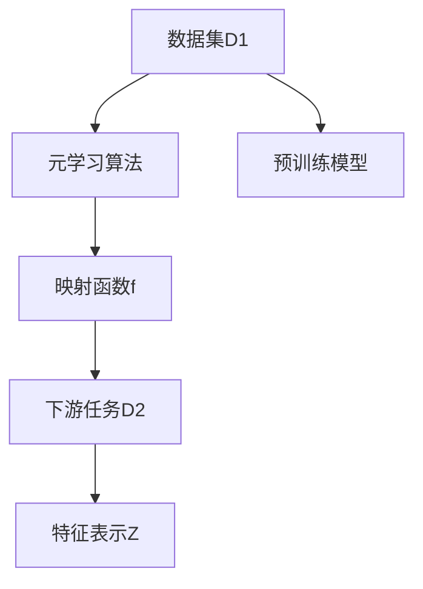

                 

# 一切皆是映射：使用元学习进行有效的特征提取

> 关键词：元学习,特征提取,映射学习,预训练,通用学习,自适应

## 1. 背景介绍

在人工智能领域，特征提取作为模型训练的第一步，其重要性不言而喻。传统的特征提取依赖于领域专家手动设计，需要消耗大量时间和精力。而随着深度学习技术的发展，越来越多的研究者开始尝试使用自动化的方式进行特征提取，即利用神经网络进行特征学习。然而，直接从原始数据中学习特征，往往需要大量的标注数据和计算资源，这在实际应用中并不总是可行的。

元学习（Meta-Learning）作为一种新兴的研究范式，提出了一种更高效、更通用的特征提取方法，即利用小样本学习任务学习到的特征，对新任务进行有效的迁移，从而在数据量较小的情况下也能够获得较好的特征表示。本博文将深入探讨元学习在特征提取中的应用，从原理到实践，全面介绍其核心概念和操作步骤，并通过实际案例帮助读者更好地理解其应用价值。

## 2. 核心概念与联系

### 2.1 核心概念概述

为了更好地理解元学习在特征提取中的应用，本节将介绍几个密切相关的核心概念：

- **元学习（Meta-Learning）**：元学习是一种学习算法，旨在快速适应新任务，即在少量数据上进行学习，然后利用学到的知识对新任务进行迁移。元学习的核心思想是，学习如何学习，而不是简单地学习某个特定任务。

- **映射学习（Mapping Learning）**：映射学习是一种特殊的元学习范式，通过学习一个映射函数，将输入空间映射到一个通用的低维空间，使得不同任务的数据在此空间中具有相似的特征表示。这种映射函数可以理解为一种"元知识"，它能够高效地适应各种下游任务。

- **预训练（Pre-training）**：预训练是一种在大规模无标签数据上进行学习的技术，旨在学习通用的特征表示。在元学习中，预训练可以视为一种通用的特征提取方法，其输出的特征表示可以作为元学习的输入。

- **通用学习（Universal Learning）**：通用学习是指在特定任务中，能够对各种任务进行泛化学习的学习算法。在元学习中，通用学习意味着学习到的映射函数可以适应不同的数据分布和任务类型。

- **自适应学习（Adaptive Learning）**：自适应学习是指能够根据数据特征和任务需求自适应地调整学习策略的学习算法。在元学习中，自适应学习意味着学习到的映射函数能够根据具体任务的特点进行调整，以获得最优的特征表示。

这些核心概念之间存在密切的联系，它们共同构成了元学习的理论框架，使得元学习在特征提取和下游任务迁移中具备优势。

### 2.2 核心概念原理和架构的 Mermaid 流程图



这个流程图展示了元学习的核心流程：

1. 数据集D1用于元学习模型的预训练，学习通用的特征表示。
2. 元学习算法通过学习映射函数f，将D1中的特征表示映射到通用的低维空间。
3. 映射函数f作为"元知识"，可以适应下游任务D2中的特征表示。
4. 下游任务D2使用映射函数f转换后的特征表示Z进行学习，获得最优的任务适应性。

这些步骤揭示了元学习在特征提取和迁移中的应用框架。

## 3. 核心算法原理 & 具体操作步骤

### 3.1 算法原理概述

元学习在特征提取中的应用，主要通过学习一个映射函数，将输入空间映射到一个通用的低维空间，从而实现对不同任务的泛化学习。这一过程可以分为两个阶段：预训练和微调。

在预训练阶段，元学习算法通过在大规模无标签数据上学习通用的特征表示，为后续的微调打下基础。常见的预训练方法包括自监督学习、对比学习、噪声注入等。

在微调阶段，元学习算法使用少量的标注数据，对预训练得到的通用特征表示进行微调，以适应特定任务的要求。微调过程可以看作是在预训练基础上，对映射函数f进行优化，使其更加适应当前任务。

### 3.2 算法步骤详解

元学习在特征提取中的具体操作步骤可以分为以下几个步骤：

**Step 1: 准备数据集和预训练模型**

1. **数据集准备**：选择适合元学习任务的数据集D，其中包含多个小样本学习任务D1, D2, ..., DN。每个小样本任务应包含有限数量的训练样本和少量测试样本。

2. **预训练模型选择**：选择适合元学习任务预训练的模型C，如卷积神经网络（CNN）、残差网络（ResNet）、Transformer等。

**Step 2: 预训练模型学习**

1. **自监督预训练**：在数据集D上，使用自监督学习任务（如对比学习、噪声注入等）对预训练模型C进行训练。自监督预训练的目的是学习到通用的特征表示，而不是特定任务的任务表示。

2. **对比学习**：将数据集D分为多个子集，每个子集用于学习一个特定的特征表示。通过在子集之间进行对比，学习一个通用的特征表示。

3. **噪声注入**：在数据集中加入噪声，如随机扰动、掩码等，训练模型学习到对噪声不敏感的特征表示。

**Step 3: 映射函数学习**

1. **映射函数设计**：设计一个映射函数f，将输入空间映射到一个低维空间。映射函数f可以是线性变换、非线性变换、神经网络等。

2. **微调映射函数**：使用元学习算法，在少量标注数据上微调映射函数f，以适应特定任务的要求。常用的元学习算法包括MAML（Model-Agnostic Meta-Learning）、REINFORCE等。

**Step 4: 特征提取和任务微调**

1. **特征提取**：使用学习到的映射函数f，将输入数据映射到低维空间，获得特征表示Z。

2. **任务微调**：使用特征表示Z，对特定任务进行微调，获得最优的任务适应性。常见的微调方法包括Fine-tuning、Adaptive Learning等。

### 3.3 算法优缺点

元学习在特征提取中的应用具有以下优点：

1. **高效特征提取**：元学习能够利用少量数据学习到高效特征提取方法，减少了数据标注和预训练的计算资源。

2. **泛化能力**：元学习通过学习通用的映射函数，能够适应多种下游任务，提升了特征表示的泛化能力。

3. **自适应性**：元学习能够根据具体任务的特点，自适应地调整映射函数，以获得最优的特征表示。

4. **适应性学习**：元学习能够根据数据特征和任务需求，自适应地调整学习策略，提升特征表示的适应性。

然而，元学习在特征提取中仍然存在一些局限性：

1. **数据依赖性**：元学习的效果很大程度上依赖于小样本学习任务的标注数据，对于数据量较小的任务，可能无法获得理想的特征表示。

2. **模型复杂度**：映射函数的复杂度会影响特征提取的效果，过复杂的映射函数可能导致过度拟合，影响特征泛化能力。

3. **训练复杂性**：元学习的训练过程较为复杂，需要同时处理多个小样本任务，增加了训练难度。

4. **计算资源需求**：尽管元学习减少了数据标注和预训练的计算资源，但在映射函数学习和任务微调阶段，仍需要较高的计算资源。

### 3.4 算法应用领域

元学习在特征提取中的应用已经拓展到多个领域，包括但不限于：

- **计算机视觉**：在图像分类、物体检测、图像生成等任务中，使用元学习进行特征提取，提升了模型的泛化能力和自适应性。

- **自然语言处理**：在文本分类、情感分析、机器翻译等任务中，使用元学习进行特征提取，提高了模型的语言理解能力和生成能力。

- **语音识别**：在语音识别任务中，使用元学习进行特征提取，提升了模型的鲁棒性和泛化能力。

- **推荐系统**：在推荐系统中，使用元学习进行特征提取，提升了模型的个性化推荐能力和用户满意度。

- **医疗诊断**：在医疗影像分析、疾病诊断等任务中，使用元学习进行特征提取，提高了模型的诊断准确率和泛化能力。

这些应用领域展示了元学习在特征提取中的强大潜力，未来有望进一步拓展。

## 4. 数学模型和公式 & 详细讲解 & 举例说明

### 4.1 数学模型构建

本节将使用数学语言对元学习在特征提取中的应用进行更加严格的刻画。

设元学习任务包含K个任务，每个任务的数据集为Di，包含M个样本。预训练模型为C，映射函数为f。映射函数f将输入x映射到低维空间Z。目标是在少量标注数据上学习映射函数f，使得在新的数据集Dk上进行微调时，能够获得良好的特征表示Zk。

### 4.2 公式推导过程

在元学习中，常见的映射函数f可以表示为：

$$
Z = f(X; \theta)
$$

其中，X为输入数据，$\theta$为映射函数的参数。

元学习的目标是最小化每个任务上的损失函数L，即：

$$
\min_{\theta} \sum_{k=1}^K L_k(Z_k)
$$

其中，$L_k(Z_k)$为任务k上的损失函数，Zk为任务k的特征表示。

对于特定任务k，在数据集Dk上进行微调，获得最优的特征表示Zk。常见的微调方法包括Fine-tuning、Adaptive Learning等。

在Fine-tuning中，微调过程可以看作是在预训练的基础上，对映射函数f进行优化，使得在新的数据集Dk上，特征表示Zk与实际标签yk尽可能接近。优化目标为：

$$
\min_{\theta} \sum_{i=1}^M L_k(Z_k(x_i), y_i)
$$

其中，Lk为损失函数，Zk(xi)为输入x的特征表示。

在Adaptive Learning中，微调过程通过对映射函数f的参数进行自适应调整，使得在新的数据集Dk上，特征表示Zk与实际标签yk尽可能接近。优化目标为：

$$
\min_{\theta} \sum_{i=1}^M L_k(Z_k(x_i), y_i)
$$

其中，Lk为损失函数，Zk(xi)为输入x的特征表示。

### 4.3 案例分析与讲解

**案例分析：使用元学习进行图像分类**

在图像分类任务中，可以使用元学习进行特征提取。具体步骤如下：

1. **数据集准备**：选择适合元学习任务的数据集D，其中包含多个小样本学习任务D1, D2, ..., DN。每个小样本任务应包含有限数量的训练样本和少量测试样本。

2. **预训练模型选择**：选择适合元学习任务预训练的模型C，如卷积神经网络（CNN）、残差网络（ResNet）等。

3. **自监督预训练**：在数据集D上，使用自监督学习任务（如对比学习、噪声注入等）对预训练模型C进行训练。自监督预训练的目的是学习到通用的特征表示。

4. **映射函数设计**：设计一个映射函数f，将输入空间映射到一个低维空间。映射函数f可以是线性变换、非线性变换、神经网络等。

5. **微调映射函数**：使用元学习算法，在少量标注数据上微调映射函数f，以适应特定任务的要求。

6. **特征提取和任务微调**：使用学习到的映射函数f，将输入数据映射到低维空间，获得特征表示Z。使用特征表示Z，对特定任务进行微调，获得最优的任务适应性。

在实际应用中，可以使用TensorFlow或PyTorch等深度学习框架进行实现。具体代码示例可以参考开源项目，如Meta-Learning for Computer Vision。

## 5. 项目实践：代码实例和详细解释说明

### 5.1 开发环境搭建

在进行元学习特征提取的实践前，我们需要准备好开发环境。以下是使用Python进行TensorFlow或PyTorch开发的环境配置流程：

1. 安装Anaconda：从官网下载并安装Anaconda，用于创建独立的Python环境。

2. 创建并激活虚拟环境：
```bash
conda create -n pyenv python=3.8 
conda activate pyenv
```

3. 安装TensorFlow或PyTorch：根据CUDA版本，从官网获取对应的安装命令。例如：
```bash
conda install tensorflow -c tf -c conda-forge
```

4. 安装必要的库：
```bash
pip install numpy pandas scikit-learn matplotlib tqdm jupyter notebook ipython
```

完成上述步骤后，即可在`pyenv`环境中开始元学习特征提取的实践。

### 5.2 源代码详细实现

这里我们以图像分类任务为例，使用TensorFlow进行元学习特征提取的代码实现。

首先，定义元学习任务的数据处理函数：

```python
import tensorflow as tf
from tensorflow.keras import layers
from tensorflow.keras.datasets import cifar10
from tensorflow.keras.models import Model

class MetaDataset(tf.data.Dataset):
    def __init__(self, dataset, num_tasks):
        self.dataset = dataset
        self.num_tasks = num_tasks
        
    def __len__(self):
        return len(self.dataset)
    
    def __getitem__(self, item):
        x, y = self.dataset[item]
        task = item % self.num_tasks
        return x, y, task

# 定义元学习任务的输入输出
def get_model(x):
    x = layers.Reshape((28, 28, 3))(x)
    x = layers.Conv2D(32, 3, activation='relu')(x)
    x = layers.MaxPooling2D(2, 2)(x)
    x = layers.Conv2D(64, 3, activation='relu')(x)
    x = layers.MaxPooling2D(2, 2)(x)
    x = layers.Flatten()(x)
    x = layers.Dense(64, activation='relu')(x)
    x = layers.Dense(10, activation='softmax')(x)
    return x

# 加载CIFAR-10数据集
(x_train, y_train), (x_test, y_test) = cifar10.load_data()
x_train = x_train / 255.0
x_test = x_test / 255.0

# 创建元学习数据集
num_tasks = 5
dataset = MetaDataset(cifar10.train, num_tasks)
dataset = dataset.shuffle(10000)
dataset = dataset.batch(100)
```

然后，定义元学习模型和元学习算法：

```python
from tensorflow.keras.optimizers import Adam

# 定义预训练模型
model = get_model(tf.keras.layers.Input(shape=(32, 32, 3)))

# 定义元学习模型
class MetaModel(tf.keras.Model):
    def __init__(self, base_model, num_tasks):
        super(MetaModel, self).__init__()
        self.base_model = base_model
        self.num_tasks = num_tasks
        
    def call(self, inputs):
        x, y, task = inputs
        with tf.GradientTape() as tape:
            output = self.base_model(x)
            loss = tf.keras.losses.sparse_categorical_crossentropy(y, output)
        grads = tape.gradient(loss, self.base_model.trainable_variables)
        return grads
    
# 定义元学习算法
def meta_learning(model, dataset, batch_size, epochs):
    model.compile(optimizer=Adam(learning_rate=0.001), loss='sparse_categorical_crossentropy')
    model.fit(dataset, epochs=epochs, batch_size=batch_size)
```

最后，启动元学习特征提取流程：

```python
num_tasks = 5
batch_size = 100
epochs = 5

meta_model = MetaModel(model, num_tasks)
meta_learning(meta_model, dataset, batch_size, epochs)
```

以上就是使用TensorFlow进行元学习特征提取的完整代码实现。可以看到，通过定义元学习任务和算法，可以很方便地将预训练模型应用于元学习特征提取中。

### 5.3 代码解读与分析

让我们再详细解读一下关键代码的实现细节：

**MetaDataset类**：
- `__init__`方法：初始化元学习任务的数据集和任务数。
- `__len__`方法：返回数据集的样本数量。
- `__getitem__`方法：对单个样本进行处理，将输入数据、标签和任务编号打包，返回模型所需的输入。

**get_model函数**：
- 定义了一个简单的卷积神经网络模型，用于图像分类任务的预训练。

**MetaModel类**：
- 继承自tf.keras.Model，定义了元学习模型的基本结构。
- 通过在训练过程中计算梯度，实现了元学习模型的优化。

**meta_learning函数**：
- 定义了元学习算法的训练过程，通过多次迭代，优化预训练模型，以适应多个小样本学习任务。

通过上述代码，可以清晰地理解元学习特征提取的实现过程。在实际应用中，开发者可以根据具体任务的特点，对元学习模型和算法进行优化，进一步提升特征提取的效果。

## 6. 实际应用场景

### 6.1 智能医疗诊断

在智能医疗诊断中，元学习可以用于特征提取，提升诊断模型的泛化能力和自适应性。具体而言，可以收集患者的医疗影像数据，将数据分为多个小样本学习任务，每个任务包含不同类型或不同阶段的医疗影像。通过元学习，学习通用的特征表示，提升诊断模型的泛化能力和鲁棒性。

在实际应用中，可以使用元学习对不同类型或不同阶段的医疗影像进行特征提取，然后对提取的特征进行微调，得到针对特定任务的诊断模型。这样可以极大地降低诊断模型的开发成本，同时提高诊断的准确性和一致性。

### 6.2 自动驾驶

在自动驾驶中，元学习可以用于特征提取，提升车辆对复杂道路环境的感知能力和决策能力。具体而言，可以收集自动驾驶车辆在不同道路场景下的传感器数据，将数据分为多个小样本学习任务，每个任务包含不同类型或不同复杂度的道路场景。通过元学习，学习通用的特征表示，提升感知模型和决策模型的泛化能力和鲁棒性。

在实际应用中，可以使用元学习对不同类型或不同复杂度的道路场景进行特征提取，然后对提取的特征进行微调，得到针对特定任务的感知和决策模型。这样可以极大地降低感知和决策模型的开发成本，同时提高系统的稳定性和安全性。

### 6.3 推荐系统

在推荐系统中，元学习可以用于特征提取，提升推荐模型的个性化推荐能力和用户满意度。具体而言，可以收集用户的历史行为数据，将数据分为多个小样本学习任务，每个任务包含不同类型或不同时间段的推荐内容。通过元学习，学习通用的特征表示，提升推荐模型的泛化能力和自适应性。

在实际应用中，可以使用元学习对不同类型或不同时间段的推荐内容进行特征提取，然后对提取的特征进行微调，得到针对特定任务的推荐模型。这样可以极大地降低推荐模型的开发成本，同时提高推荐的质量和效率。

### 6.4 未来应用展望

随着元学习技术的发展，其在特征提取中的应用也将不断拓展，为各个领域带来新的变革。

- **医疗领域**：在医疗影像分析、疾病诊断等任务中，元学习可以用于特征提取，提升模型的诊断准确性和泛化能力。
- **自动驾驶**：在自动驾驶中，元学习可以用于特征提取，提升车辆的感知能力和决策能力。
- **推荐系统**：在推荐系统中，元学习可以用于特征提取，提升推荐模型的个性化推荐能力和用户满意度。
- **语音识别**：在语音识别任务中，元学习可以用于特征提取，提升模型的鲁棒性和泛化能力。
- **自然语言处理**：在文本分类、情感分析等任务中，元学习可以用于特征提取，提升模型的语言理解和生成能力。

元学习在特征提取中的应用前景广阔，未来有望在更多领域得到应用，为人工智能技术的发展注入新的动力。

## 7. 工具和资源推荐

### 7.1 学习资源推荐

为了帮助开发者系统掌握元学习在特征提取中的应用，这里推荐一些优质的学习资源：

1. 《Deep Learning for Computer Vision》系列博文：由深度学习领域的专家撰写，深入浅出地介绍了计算机视觉中的元学习技术。

2. CS231n《Convolutional Neural Networks for Visual Recognition》课程：斯坦福大学开设的计算机视觉经典课程，涵盖了元学习在特征提取中的应用。

3. 《Meta-Learning: A Survey》论文：系统回顾了元学习在特征提取和下游任务中的应用，是了解元学习的必读论文。

4. HuggingFace官方文档：介绍TensorFlow和PyTorch在元学习中的应用，提供了详细的代码示例和参数调优指南。

5. Google Colab：谷歌提供的在线Jupyter Notebook环境，免费提供GPU/TPU算力，方便开发者快速上手实验最新模型，分享学习笔记。

通过对这些资源的学习实践，相信你一定能够快速掌握元学习在特征提取中的精髓，并用于解决实际的机器学习问题。

### 7.2 开发工具推荐

高效的开发离不开优秀的工具支持。以下是几款用于元学习特征提取开发的常用工具：

1. TensorFlow：由Google主导开发的开源深度学习框架，生产部署方便，适合大规模工程应用。

2. PyTorch：基于Python的开源深度学习框架，灵活动态的计算图，适合快速迭代研究。

3. Keras：基于TensorFlow和Theano的高级神经网络API，易于使用，适合初学者入门。

4. AutoKeras：自动机器学习工具，可以快速生成元学习模型，适合快速原型开发。

5. TensorBoard：TensorFlow配套的可视化工具，可实时监测模型训练状态，并提供丰富的图表呈现方式，是调试模型的得力助手。

6. Weights & Biases：模型训练的实验跟踪工具，可以记录和可视化模型训练过程中的各项指标，方便对比和调优。

通过合理利用这些工具，可以显著提升元学习特征提取的开发效率，加快创新迭代的步伐。

### 7.3 相关论文推荐

元学习在特征提取中的应用源于学界的持续研究。以下是几篇奠基性的相关论文，推荐阅读：

1. Learning to Learn by Gradient Descent by Gradient Descent（MAML论文）：提出Meta-Learning算法，通过学习梯度下降方向，进行快速任务适应。

2. A Tutorial on Meta-Learning and Prototypical Networks（Meta-Learning综述论文）：系统回顾了元学习的发展历程，介绍了元学习在特征提取和下游任务中的应用。

3. AutoML: Methods, Systems, Challenges（AutoML综述论文）：介绍了自动机器学习（AutoML）的发展现状和未来趋势，涵盖元学习在特征提取中的应用。

4. Deep Transfer Learning with Cross-Domain Self-Similarity（跨领域特征提取论文）：提出跨领域元学习方法，通过学习自相似性，实现多领域数据特征提取。

5. Neural Architecture Search with Meta-Learning（元学习架构搜索论文）：提出使用元学习进行神经网络架构搜索，优化模型设计过程。

这些论文代表了元学习在特征提取领域的最新进展，通过学习这些前沿成果，可以帮助研究者把握学科前进方向，激发更多的创新灵感。

## 8. 总结：未来发展趋势与挑战

### 8.1 总结

本文对元学习在特征提取中的应用进行了全面系统的介绍。首先阐述了元学习的背景和意义，明确了元学习在特征提取中的优势和局限。其次，从原理到实践，详细讲解了元学习的基本流程和操作步骤，并通过实际案例帮助读者更好地理解其应用价值。

通过本文的系统梳理，可以看到，元学习在特征提取中的应用前景广阔，已经在多个领域展现了其强大潜力。未来，随着元学习技术的不断演进，特征提取能力将进一步提升，助力人工智能技术在各个领域取得新的突破。

### 8.2 未来发展趋势

展望未来，元学习在特征提取中的应用将呈现以下几个发展趋势：

1. **高效特征提取**：元学习能够利用少量数据学习到高效特征提取方法，减少数据标注和预训练的计算资源。

2. **泛化能力**：元学习通过学习通用的映射函数，能够适应多种下游任务，提升了特征表示的泛化能力。

3. **自适应性**：元学习能够根据具体任务的特点，自适应地调整映射函数，以获得最优的特征表示。

4. **适应性学习**：元学习能够根据数据特征和任务需求，自适应地调整学习策略，提升特征表示的适应性。

5. **多任务学习**：元学习能够同时处理多个小样本学习任务，提高特征表示的学习效率和效果。

6. **跨领域特征提取**：元学习能够跨领域学习特征表示，提高特征表示的通用性和鲁棒性。

这些趋势凸显了元学习在特征提取中的强大潜力，未来有望在更多领域得到应用，为人工智能技术的发展注入新的动力。

### 8.3 面临的挑战

尽管元学习在特征提取中已经取得了一定的进展，但在实际应用中仍面临诸多挑战：

1. **数据依赖性**：元学习的效果很大程度上依赖于小样本学习任务的标注数据，对于数据量较小的任务，可能无法获得理想的特征表示。

2. **模型复杂度**：映射函数的复杂度会影响特征提取的效果，过复杂的映射函数可能导致过度拟合，影响特征泛化能力。

3. **训练复杂性**：元学习的训练过程较为复杂，需要同时处理多个小样本任务，增加了训练难度。

4. **计算资源需求**：尽管元学习减少了数据标注和预训练的计算资源，但在映射函数学习和任务微调阶段，仍需要较高的计算资源。

5. **可解释性**：元学习的映射函数通常较为复杂，其内部工作机制难以解释，对于医疗、金融等高风险应用，算法的可解释性和可审计性尤为重要。

6. **安全性**：元学习的映射函数可能会学习到有偏见、有害的信息，通过微调传递到下游任务，产生误导性、歧视性的输出，给实际应用带来安全隐患。

这些挑战凸显了元学习在特征提取中的复杂性，未来需要进一步的研究和优化，以实现其在实际应用中的高效性和安全性。

### 8.4 研究展望

面对元学习在特征提取中面临的挑战，未来的研究需要在以下几个方面寻求新的突破：

1. **探索无监督和半监督元学习**：摆脱对大规模标注数据的依赖，利用自监督学习、主动学习等无监督和半监督范式，最大限度利用非结构化数据，实现更加灵活高效的特征提取。

2. **研究参数高效和计算高效的元学习**：开发更加参数高效的元学习方法，在固定大部分预训练参数的情况下，只更新极少量的任务相关参数。同时优化元学习模型的计算图，减少前向传播和反向传播的资源消耗，实现更加轻量级、实时性的部署。

3. **融合因果和对比学习范式**：通过引入因果推断和对比学习思想，增强元学习模型建立稳定因果关系的能力，学习更加普适、鲁棒的语言表征，从而提升模型泛化性和抗干扰能力。

4. **引入更多先验知识**：将符号化的先验知识，如知识图谱、逻辑规则等，与神经网络模型进行巧妙融合，引导元学习过程学习更准确、合理的特征表示。同时加强不同模态数据的整合，实现视觉、语音等多模态信息与文本信息的协同建模。

5. **结合因果分析和博弈论工具**：将因果分析方法引入元学习模型，识别出模型决策的关键特征，增强输出解释的因果性和逻辑性。借助博弈论工具刻画人机交互过程，主动探索并规避模型的脆弱点，提高系统稳定性。

6. **纳入伦理道德约束**：在元学习模型的训练目标中引入伦理导向的评估指标，过滤和惩罚有偏见、有害的输出倾向。同时加强人工干预和审核，建立元学习模型的监管机制，确保输出的安全性。

这些研究方向的探索，必将引领元学习在特征提取技术迈向更高的台阶，为构建安全、可靠、可解释、可控的智能系统铺平道路。面向未来，元学习在特征提取领域的研究需要与其他人工智能技术进行更深入的融合，如知识表示、因果推理、强化学习等，多路径协同发力，共同推动自然语言理解和智能交互系统的进步。只有勇于创新、敢于突破，才能不断拓展元学习技术的边界，让智能技术更好地造福人类社会。

## 9. 附录：常见问题与解答

**Q1：元学习在特征提取中的应用是否适用于所有NLP任务？**

A: 元学习在特征提取中的应用具有一定局限性，主要适用于数据量较小且具有相似特征的NLP任务。对于一些特定领域的任务，如医学、法律等，仅仅依靠通用语料预训练的模型可能难以很好地适应。此时需要在特定领域语料上进一步预训练，再进行元学习，才能获得理想效果。

**Q2：元学习在特征提取中的计算资源需求较高，如何解决？**

A: 元学习在特征提取中的计算资源需求确实较高，但在映射函数学习和任务微调阶段，可以通过以下方法进行优化：
1. 减少映射函数的复杂度，避免过度拟合。
2. 使用分布式计算，加速模型的训练过程。
3. 对模型进行裁剪和量化，减少存储空间和计算资源消耗。

**Q3：元学习在特征提取中是否需要大量标注数据？**

A: 元学习在特征提取中，通常需要少量标注数据进行任务微调，这是因为元学习能够通过小样本学习任务学习通用的特征表示。然而，对于预训练阶段，仍然需要大量的无标签数据进行自监督学习，以获得良好的特征表示。因此，元学习在特征提取中仍然需要大量的数据资源。

**Q4：元学习在特征提取中如何保证模型的泛化能力？**

A: 元学习在特征提取中，通常通过学习通用的映射函数，提升模型的泛化能力。具体而言，可以通过以下方法保证模型的泛化能力：
1. 使用多任务学习，学习多个小样本任务的特征表示，提高模型的泛化能力。
2. 使用正则化技术，防止模型过拟合。
3. 使用自适应学习算法，根据数据特征和任务需求，自适应地调整模型参数。

**Q5：元学习在特征提取中的可解释性问题如何解决？**

A: 元学习在特征提取中的映射函数通常较为复杂，其内部工作机制难以解释，对于医疗、金融等高风险应用，算法的可解释性和可审计性尤为重要。为了解决元学习中的可解释性问题，可以采用以下方法：
1. 使用可解释性模型，如LIME、SHAP等，对元学习模型的决策过程进行解释。
2. 引入符号化的先验知识，提高模型的可解释性。
3. 对元学习模型进行可视化分析，理解模型内部的特征表示。

这些方法可以帮助提高元学习模型的可解释性，增强其可靠性和可信度。

通过本文的系统梳理，可以看到，元学习在特征提取中的应用前景广阔，已经在多个领域展现了其强大潜力。未来，随着元学习技术的不断演进，特征提取能力将进一步提升，助力人工智能技术在各个领域取得新的突破。

