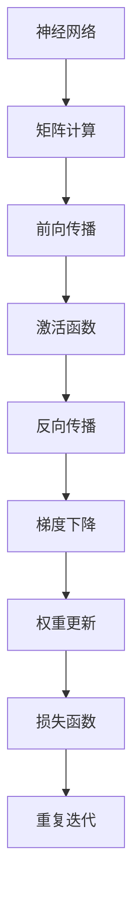

                 

# 一切皆是映射：构建第一个深度学习模型

> 关键词：深度学习,机器学习,神经网络,矩阵计算,反向传播,梯度下降

## 1. 背景介绍

深度学习(Depending Learning)作为人工智能(AI)领域的一门关键技术，近年来取得了举世瞩目的成就。它不仅在图像识别、语音识别、自然语言处理(NLP)等领域刷新了诸多任务的最先进指标，还在自动驾驶、医疗诊断、金融分析等诸多实际应用中展现了巨大的潜力。然而，对于大多数初学者而言，深度学习的核心思想和基本框架仍然显得有些抽象和复杂。

本文将深入浅出地讲解深度学习模型构建的基本原理和方法。我们将从矩阵计算和梯度下降等基础概念出发，逐步搭建起一个基本的神经网络模型。通过对这一过程的详细介绍，读者将能全面理解深度学习模型的内部机制，并掌握构建自己的深度学习模型的技能。

## 2. 核心概念与联系

### 2.1 核心概念概述

为更好地理解深度学习的构建过程，我们先介绍几个核心的概念：

- **神经网络(Neural Network)**：由多个神经元(即节点)通过权值(w)和偏置(b)相连构成的网络结构。神经网络通过多层级联的前馈计算，实现对复杂函数的逼近。

- **深度学习(Deep Learning)**：指包含多个隐藏层的神经网络。通过层次化的特征提取，深度学习模型能够捕捉数据中的高层次抽象信息，进而实现更高精度的学习和预测。

- **矩阵计算(Matrix Calculation)**：神经网络的核心计算过程为矩阵乘法。通过层与层之间矩阵的线性变换和非线性激活，深度学习模型能够高效计算复杂的非线性映射。

- **反向传播(Backpropagation)**：深度学习模型的训练过程是通过梯度下降算法进行的。反向传播算法通过反向计算损失函数对权重和偏置的梯度，指导模型参数的优化方向。

- **梯度下降(Gradient Descent)**：一种常用的优化算法，通过不断迭代更新模型参数，使得损失函数最小化。

- **激活函数(Activation Function)**：神经网络中用于引入非线性因素的函数，如Sigmoid、ReLU、Tanh等。激活函数将输入映射为非线性输出，使模型具备表达复杂非线性关系的能力。

这些概念之间的联系和互动构成了深度学习模型的核心框架。通过矩阵计算和反向传播算法，深度学习模型能够高效地进行前向计算和梯度更新，进而优化参数，提升模型性能。

### 2.2 核心概念的Mermaid流程图



该流程图展示了深度学习模型构建的基本流程：

1. 输入数据通过层级连接的矩阵计算进行前向传播。
2. 在前向传播过程中，激活函数将计算结果映射为非线性输出。
3. 利用反向传播算法计算损失函数对模型参数的梯度。
4. 梯度下降算法根据梯度信息，更新模型参数。
5. 重复迭代直至模型收敛。

## 3. 核心算法原理 & 具体操作步骤

### 3.1 算法原理概述

深度学习模型的训练过程主要分为两个阶段：前向传播(Forward Propagation)和反向传播(Backward Propagation)。

前向传播是指将输入数据逐层传递，通过一系列线性变换和非线性激活，得到模型的预测输出。假设输入数据为 $x$，经过 $L$ 层网络计算，输出为 $y$，其中每一层包含若干个神经元。令第 $i$ 层神经元的输出为 $h_i$，对应的权重矩阵为 $W_i$，偏置向量为 $b_i$，激活函数为 $\sigma_i$，则前向传播的计算过程为：

$$
h_1 = \sigma_1(W_1x + b_1)
$$
$$
h_2 = \sigma_2(W_2h_1 + b_2)
$$
$$
\vdots
$$
$$
h_L = \sigma_L(W_Lh_{L-1} + b_L)
$$
$$
y = h_L
$$

其中 $\sigma_i$ 表示第 $i$ 层的激活函数，通常采用Sigmoid、ReLU、Tanh等函数。通过前向传播，输入数据 $x$ 被逐步映射为最终的输出 $y$。

反向传播则用于计算损失函数对模型参数的梯度，以指导参数的更新。假设训练集为 $D$，损失函数为 $\mathcal{L}$，则反向传播的计算过程为：

$$
\frac{\partial \mathcal{L}}{\partial h_L} = \frac{\partial \mathcal{L}}{\partial y} \cdot \frac{\partial y}{\partial h_L}
$$
$$
\frac{\partial \mathcal{L}}{\partial h_{L-1}} = \frac{\partial \mathcal{L}}{\partial h_L} \cdot \frac{\partial h_L}{\partial h_{L-1}}
$$
$$
\vdots
$$
$$
\frac{\partial \mathcal{L}}{\partial h_1} = \frac{\partial \mathcal{L}}{\partial h_2} \cdot \frac{\partial h_2}{\partial h_1}
$$

其中 $\frac{\partial \mathcal{L}}{\partial h_i}$ 表示损失函数对第 $i$ 层输出的偏导数。通过反向传播，可以得到损失函数对每个神经元输出的偏导数，从而计算出权重和偏置的梯度。

### 3.2 算法步骤详解

构建一个基本的深度学习模型，主要分为以下几个步骤：

**Step 1: 准备数据集和标签**

首先，准备训练数据集 $D=\{x_i,y_i\}_{i=1}^N$，其中 $x_i$ 为输入数据，$y_i$ 为对应的标签。标签可以是离散或连续的，具体根据任务而定。

**Step 2: 初始化模型参数**

随机初始化模型的权重矩阵 $W$ 和偏置向量 $b$。权重矩阵和偏置向量的形状取决于层数和神经元的数量。

**Step 3: 前向传播计算**

将输入数据 $x$ 逐层传递，计算每一层的输出 $h_i$。具体公式如上所述。

**Step 4: 计算损失函数**

根据实际任务，选择适当的损失函数 $\mathcal{L}$，计算模型的预测输出 $y$ 与真实标签 $y_i$ 之间的差异。

**Step 5: 反向传播计算梯度**

根据反向传播公式，计算损失函数对权重和偏置的梯度。

**Step 6: 更新模型参数**

根据梯度下降算法，更新模型的权重和偏置，具体公式为：

$$
W_i \leftarrow W_i - \eta \frac{\partial \mathcal{L}}{\partial W_i}
$$
$$
b_i \leftarrow b_i - \eta \frac{\partial \mathcal{L}}{\partial b_i}
$$

其中 $\eta$ 为学习率，控制每次参数更新的幅度。

**Step 7: 重复迭代**

重复以上步骤，直到模型收敛或达到预设迭代次数。

### 3.3 算法优缺点

深度学习模型的优点包括：

- **表达能力强大**：多层的非线性映射使深度学习模型能够逼近任意复杂的非线性函数。
- **数据利用充分**：通过反向传播算法，深度学习模型能够高效利用训练集数据。
- **泛化能力强**：深度学习模型在图像识别、语音识别等任务上表现优异，具有较强的泛化能力。

然而，深度学习模型也存在一些缺点：

- **参数量巨大**：深度学习模型通常包含数百万甚至上亿的参数，需要大量的存储空间和计算资源。
- **训练时间长**：深度学习模型的训练过程往往需要耗费大量时间和计算资源。
- **过拟合风险**：深度学习模型容易过拟合训练数据，泛化能力可能受到影响。

尽管存在这些缺点，但深度学习模型凭借其强大的表达能力和泛化能力，在许多实际应用中取得了显著效果，成为了当前AI领域的重要技术之一。

### 3.4 算法应用领域

深度学习模型在多个领域中得到了广泛应用，以下是几个典型案例：

- **计算机视觉**：深度学习模型在图像识别、物体检测、人脸识别等任务上表现优异，广泛应用于自动驾驶、安防监控、医学影像分析等领域。
- **自然语言处理**：深度学习模型在语言模型、机器翻译、文本生成等任务上取得了显著进展，广泛应用于聊天机器人、智能客服、情感分析等场景。
- **语音识别**：深度学习模型在语音识别、语音合成等任务上表现卓越，广泛应用于智能音箱、语音助手、电话客服等领域。
- **游戏AI**：深度学习模型在围棋、象棋等策略类游戏上取得了突破，推动了AI在游戏领域的创新应用。
- **金融分析**：深度学习模型在股票预测、风险评估、欺诈检测等金融任务上展现了强大的能力，支持金融机构进行决策支持。

随着深度学习技术的不断进步，其在更多领域的应用前景将更加广阔，为各行各业带来新的变革和机遇。

## 4. 数学模型和公式 & 详细讲解

### 4.1 数学模型构建

深度学习模型的核心数学模型是线性变换和非线性激活的组合。以下将通过一个简单的线性回归模型来详细讲解这一过程。

假设有一组训练数据 $D=\{x_i,y_i\}_{i=1}^N$，其中 $x_i \in \mathbb{R}^d$，$y_i \in \mathbb{R}$。目标是构建一个线性回归模型，使得模型输出 $y$ 与真实标签 $y_i$ 之间的差异最小化。令模型的权重矩阵为 $W \in \mathbb{R}^{d \times 1}$，偏置向量为 $b \in \mathbb{R}^{1}$，则模型的线性变换可以表示为：

$$
y = Wx + b
$$

其中 $W$ 和 $b$ 是模型的可训练参数。

### 4.2 公式推导过程

在构建好线性回归模型后，我们需要使用损失函数来衡量模型预测输出与真实标签之间的差异。常用的损失函数包括均方误差(MSE)、交叉熵损失等。这里我们选择均方误差损失函数，定义如下：

$$
\mathcal{L} = \frac{1}{N} \sum_{i=1}^N (y_i - Wx_i - b)^2
$$

我们需要最小化损失函数 $\mathcal{L}$，以优化模型参数 $W$ 和 $b$。为了得到损失函数对 $W$ 和 $b$ 的梯度，需要对 $\mathcal{L}$ 对 $W$ 和 $b$ 求偏导数：

$$
\frac{\partial \mathcal{L}}{\partial W} = -\frac{2}{N} \sum_{i=1}^N (y_i - Wx_i - b)x_i
$$
$$
\frac{\partial \mathcal{L}}{\partial b} = -\frac{2}{N} \sum_{i=1}^N (y_i - Wx_i - b)
$$

根据梯度下降算法，更新模型参数的公式为：

$$
W \leftarrow W - \eta \frac{\partial \mathcal{L}}{\partial W}
$$
$$
b \leftarrow b - \eta \frac{\partial \mathcal{L}}{\partial b}
$$

其中 $\eta$ 为学习率。

### 4.3 案例分析与讲解

以一个简单的手写数字识别任务为例，讲解深度学习模型的构建和训练过程。

假设训练集为 $D=\{(x_i,y_i)\}_{i=1}^N$，其中 $x_i$ 为手写数字图像，$y_i$ 为对应的数字标签。首先，我们需要准备数据集，并将图像数据归一化处理，使其在 [0,1] 范围内。

然后，构建一个简单的卷积神经网络(CNN)模型，包含若干卷积层和池化层，最后连接全连接层输出数字标签。在训练过程中，我们使用交叉熵损失函数，并采用随机梯度下降算法进行参数更新。

模型训练完毕后，我们使用测试集评估模型性能。在测试集中，我们将输入图像通过模型计算得到数字标签，并与真实标签进行比较，计算准确率、精度等指标。

通过这一过程，读者可以全面理解深度学习模型的构建和训练过程，并掌握如何应用到具体的实际任务中。

## 5. 项目实践：代码实例和详细解释说明

### 5.1 开发环境搭建

要进行深度学习模型的开发，首先需要搭建好开发环境。以下是一个基于PyTorch框架的深度学习模型开发环境搭建流程：

1. 安装Anaconda：从官网下载并安装Anaconda，用于创建独立的Python环境。

2. 创建并激活虚拟环境：
```bash
conda create -n deep_learning python=3.8
conda activate deep_learning
```

3. 安装PyTorch：从官网获取对应版本的PyTorch安装包，并安装。

```bash
pip install torch torchvision torchaudio
```

4. 安装TensorBoard：用于可视化训练过程和结果。

```bash
pip install tensorboard
```

5. 安装其他必要的Python库：
```bash
pip install numpy pandas scikit-learn matplotlib tqdm
```

完成以上步骤后，即可在`deep_learning`环境中开始深度学习模型的开发。

### 5.2 源代码详细实现

下面以手写数字识别任务为例，给出使用PyTorch实现卷积神经网络模型的代码实现。

```python
import torch
import torch.nn as nn
import torch.optim as optim
import torchvision.transforms as transforms
import torchvision.datasets as datasets
import torchvision.models as models
from torch.utils.data import DataLoader
import matplotlib.pyplot as plt

# 定义模型
class Net(nn.Module):
    def __init__(self):
        super(Net, self).__init__()
        self.conv1 = nn.Conv2d(1, 6, 5)
        self.pool = nn.MaxPool2d(2, 2)
        self.conv2 = nn.Conv2d(6, 16, 5)
        self.fc1 = nn.Linear(16 * 4 * 4, 120)
        self.fc2 = nn.Linear(120, 84)
        self.fc3 = nn.Linear(84, 10)

    def forward(self, x):
        x = self.pool(F.relu(self.conv1(x)))
        x = self.pool(F.relu(self.conv2(x)))
        x = x.view(-1, 16 * 4 * 4)
        x = F.relu(self.fc1(x))
        x = F.relu(self.fc2(x))
        x = self.fc3(x)
        return x

# 加载数据集
train_dataset = datasets.MNIST(root='./data', train=True, transform=transforms.ToTensor(), download=True)
test_dataset = datasets.MNIST(root='./data', train=False, transform=transforms.ToTensor(), download=True)

train_loader = DataLoader(train_dataset, batch_size=64, shuffle=True)
test_loader = DataLoader(test_dataset, batch_size=64, shuffle=False)

# 初始化模型和优化器
model = Net()
optimizer = optim.SGD(model.parameters(), lr=0.001, momentum=0.9)
criterion = nn.CrossEntropyLoss()

# 训练模型
for epoch in range(10):
    running_loss = 0.0
    for i, data in enumerate(train_loader, 0):
        inputs, labels = data

        optimizer.zero_grad()
        outputs = model(inputs)
        loss = criterion(outputs, labels)
        loss.backward()
        optimizer.step()

        running_loss += loss.item()
        if i % 100 == 99:
            print('[%d, %5d] loss: %.3f' %
                  (epoch + 1, i + 1, running_loss / 100))
            running_loss = 0.0

print('Finished Training')

# 测试模型
correct = 0
total = 0
with torch.no_grad():
    for data in test_loader:
        images, labels = data
        outputs = model(images)
        _, predicted = torch.max(outputs.data, 1)
        total += labels.size(0)
        correct += (predicted == labels).sum().item()

print('Accuracy of the network on the 10000 test images: %d %%' % (
    100 * correct / total))
```

### 5.3 代码解读与分析

接下来，我们详细解读一下关键代码的实现细节：

**Net类**：
- `__init__`方法：定义模型结构，包含卷积层、池化层、全连接层等。
- `forward`方法：实现前向传播，将输入数据通过多个层级计算得到输出。

**训练流程**：
- 定义训练集和测试集，并使用DataLoader进行批次加载。
- 初始化模型、优化器和损失函数。
- 在每个epoch中，对训练集数据进行迭代训练。
- 在每个mini-batch上，计算模型的预测输出，并计算损失函数。
- 根据梯度下降算法更新模型参数。
- 在测试集上评估模型性能。

该代码实现了简单的卷积神经网络模型，并在MNIST数据集上进行训练和测试。通过这一过程，读者可以全面理解深度学习模型的构建和训练方法，并掌握使用PyTorch进行模型开发的技巧。

## 6. 实际应用场景

### 6.1 计算机视觉

深度学习模型在计算机视觉领域取得了巨大的成功。例如，在图像识别任务中，卷积神经网络(CNN)可以高效地提取图像特征，并实现高精度的分类识别。在目标检测任务中，区域卷积神经网络(R-CNN)和其变种如Fast R-CNN、Faster R-CNN等，能够快速准确地定位和识别图像中的目标物体。在人脸识别任务中，Siamese网络、Triplet Loss等技术能够有效解决人脸识别中的特征对齐和相似度计算问题。

### 6.2 自然语言处理

深度学习模型在自然语言处理(NLP)领域同样表现出色。例如，在语言模型任务中，循环神经网络(RNN)、长短时记忆网络(LSTM)、门控循环单元(GRU)等模型能够处理序列数据，并生成高质量的语言模型。在机器翻译任务中，序列到序列(Seq2Seq)模型、Transformer等模型能够高效地进行文本序列的编码和解码，实现高精度的翻译转换。在文本生成任务中，变分自编码器(VAE)、生成对抗网络(GAN)等模型能够生成逼真的文本内容，用于文本补全、摘要生成等任务。

### 6.3 语音识别

深度学习模型在语音识别领域也展现了强大的能力。例如，在语音识别任务中，卷积神经网络(CNN)、循环神经网络(RNN)、长短时记忆网络(LSTM)等模型能够高效地处理音频信号，并实现高精度的语音识别。在语音合成任务中，生成对抗网络(GAN)、变分自编码器(VAE)等模型能够生成逼真的语音内容，用于语音合成、语音增强等任务。

### 6.4 未来应用展望

随着深度学习技术的不断进步，其在更多领域的应用前景将更加广阔。

- **自动驾驶**：深度学习模型在自动驾驶领域的应用包括车辆定位、障碍物检测、路径规划等。通过结合计算机视觉和传感器数据，深度学习模型能够实现高精度和实时的驾驶辅助。
- **医疗诊断**：深度学习模型在医学影像分析、疾病预测、基因组学等领域展现了强大的能力，支持医疗机构进行精准诊断和治疗决策。
- **金融分析**：深度学习模型在股票预测、风险评估、欺诈检测等金融任务上表现卓越，支持金融机构进行决策支持。
- **游戏AI**：深度学习模型在策略类游戏如围棋、象棋中取得了突破，推动了AI在游戏领域的创新应用。

总之，深度学习技术正在逐步渗透到各行各业，为各行各业带来新的变革和机遇。

## 7. 工具和资源推荐

### 7.1 学习资源推荐

为了帮助开发者系统掌握深度学习模型的构建和训练方法，这里推荐一些优质的学习资源：

1. 《深度学习》书籍：由斯坦福大学教授Ian Goodfellow、Yoshua Bengio、Aaron Courville合著，全面系统地介绍了深度学习的基本概念和前沿技术。

2. CS231n《卷积神经网络》课程：斯坦福大学开设的深度学习课程，内容涵盖了卷积神经网络、图像分类、目标检测等主题。

3. Udacity深度学习专项课程：由Google Brain团队设计，包含多个深度学习项目实战，适合初学者系统学习深度学习框架和工具。

4. TensorFlow官方文档：Google推出的深度学习框架，提供了丰富的教程、示例和API文档，帮助开发者快速上手。

5. PyTorch官方文档：Facebook开源的深度学习框架，提供了丰富的教程、示例和API文档，支持动态计算图和静态图两种计算模式。

6. Kaggle竞赛平台：全球最大的数据科学竞赛平台，包含大量深度学习竞赛项目和数据集，适合通过实战提升深度学习技能。

通过这些资源的学习实践，相信你一定能够全面掌握深度学习模型的构建和训练方法，并应用到实际项目中。

### 7.2 开发工具推荐

高效的开发离不开优秀的工具支持。以下是几款用于深度学习模型开发的常用工具：

1. PyTorch：由Facebook开源的深度学习框架，支持动态计算图和静态图两种计算模式，灵活高效。

2. TensorFlow：由Google开源的深度学习框架，支持GPU、TPU等高性能计算，生产部署方便。

3. Keras：基于TensorFlow和Theano等后端，提供了高级API，简单易用，适合初学者快速上手。

4. MXNet：由Apache开源的深度学习框架，支持多种语言和平台，灵活高效。

5. JAX：Google开发的自动微分框架，支持深度学习模型的高效计算和优化。

6. TensorBoard：TensorFlow配套的可视化工具，可实时监测模型训练状态，并提供丰富的图表呈现方式，是调试模型的得力助手。

通过合理利用这些工具，可以显著提升深度学习模型的开发效率，加快创新迭代的步伐。

### 7.3 相关论文推荐

深度学习模型的研究源于学界的持续探索。以下是几篇奠基性的相关论文，推荐阅读：

1. AlexNet：2012年ImageNet图像识别竞赛的冠军，标志着深度学习在计算机视觉领域的突破。

2. GoogleNet：2014年ImageNet图像识别竞赛的冠军，提出了Inception模块，进一步提升了深度学习模型的表达能力。

3. VGGNet：2014年ImageNet图像识别竞赛的亚军，提出了VGG网络结构，进一步提高了深度学习模型的精度。

4. RNN：1997年提出的循环神经网络，首次实现了序列数据的建模和预测。

5. LSTM：1997年提出的长短时记忆网络，能够处理长期依赖的序列数据，广泛应用于自然语言处理任务。

6. CNN：1989年提出的卷积神经网络，能够高效处理图像数据，广泛应用于计算机视觉任务。

这些论文代表了深度学习模型的发展脉络。通过学习这些前沿成果，可以帮助研究者把握学科前进方向，激发更多的创新灵感。

## 8. 总结：未来发展趋势与挑战

### 8.1 总结

本文对深度学习模型构建的基本原理和方法进行了深入浅出的讲解。通过矩阵计算和反向传播算法，读者能够全面理解深度学习模型的内部机制，并掌握构建自己的深度学习模型的技能。通过学习这些基本概念和核心算法，相信读者能够在深度学习技术中实现从零到一，并逐步构建复杂多样的深度学习模型。

### 8.2 未来发展趋势

展望未来，深度学习模型的发展将呈现以下几个趋势：

1. **模型规模更大**：随着计算资源和算力水平的提升，深度学习模型的参数量将持续增加，模型规模将进一步扩大。

2. **训练时间更短**：新的优化算法和硬件加速技术将使得深度学习模型的训练时间进一步缩短。

3. **迁移学习更加普及**：迁移学习将使得深度学习模型能够更好地适应新任务，并减少数据标注的依赖。

4. **多模态学习更加成熟**：多模态学习将使得深度学习模型能够更好地融合多种数据类型，提升模型的综合性能。

5. **模型可解释性增强**：可解释性技术将使得深度学习模型具备更好的可解释性和透明性，支持人类的理解和信任。

6. **模型隐私保护更加重要**：在数据隐私保护的要求下，深度学习模型需要具备更好的隐私保护能力，防止数据泄露和滥用。

这些趋势将进一步推动深度学习技术的发展，使其在更多领域中发挥更大的作用。

### 8.3 面临的挑战

尽管深度学习模型在许多领域中取得了显著成果，但其发展过程中仍然面临诸多挑战：

1. **模型规模过大**：深度学习模型通常需要巨大的计算资源和存储空间，制约了其在移动设备和嵌入式系统中的应用。

2. **训练时间长**：深度学习模型的训练过程往往需要耗费大量时间和计算资源，难以支持实时推理和快速迭代。

3. **过拟合风险**：深度学习模型容易过拟合训练数据，泛化能力可能受到影响。

4. **可解释性不足**：深度学习模型的决策过程通常缺乏可解释性，难以对其推理逻辑进行分析和调试。

5. **数据隐私问题**：深度学习模型在处理敏感数据时，需要考虑数据隐私和安全问题，防止数据泄露和滥用。

6. **伦理道德挑战**：深度学习模型在应用过程中需要考虑伦理道德问题，确保模型输出符合人类价值观和伦理道德。

这些挑战需要从技术、伦理、社会等多个维度进行全面应对，才能推动深度学习技术的健康发展。

### 8.4 研究展望

未来，深度学习技术需要在以下几个方向进行深入研究：

1. **模型压缩与优化**：研究如何高效压缩深度学习模型，支持其在移动设备和嵌入式系统中的应用。

2. **模型可解释性**：研究如何增强深度学习模型的可解释性，支持人类的理解和信任。

3. **多模态学习**：研究如何更好地融合多种数据类型，提升模型的综合性能。

4. **隐私保护**：研究如何保护深度学习模型的隐私，防止数据泄露和滥用。

5. **伦理道德**：研究如何确保深度学习模型的伦理道德，避免有害输出和偏见。

6. **模型迁移**：研究如何将深度学习模型迁移到新的数据集和任务中，提高模型的泛化能力和适应性。

这些研究方向将推动深度学习技术的发展，使其在更多领域中发挥更大的作用。

## 9. 附录：常见问题与解答

**Q1：深度学习模型是否可以处理非结构化数据？**

A: 深度学习模型可以处理非结构化数据，但需要将非结构化数据转换为结构化数据。例如，自然语言处理任务中的文本数据需要转换为向量或嵌入表示，才能输入到深度学习模型中进行处理。

**Q2：深度学习模型是否适用于所有数据类型？**

A: 深度学习模型适用于数值型数据和结构化数据，但对于图像、文本等非数值型数据，需要进行预处理和特征提取。不同类型的数据需要采用不同的处理方法。

**Q3：深度学习模型是否可以处理序列数据？**

A: 深度学习模型适用于序列数据，如时间序列、文本序列等。循环神经网络(RNN)、长短时记忆网络(LSTM)等模型能够高效地处理序列数据，并提取其中的模式和规律。

**Q4：深度学习模型是否需要大量标注数据？**

A: 深度学习模型通常需要大量的标注数据进行训练，但可以通过迁移学习和半监督学习等方法，减少对标注数据的依赖。

**Q5：深度学习模型是否适用于计算机视觉任务？**

A: 深度学习模型在计算机视觉任务中表现出色，如图像分类、目标检测、图像生成等任务。卷积神经网络(CNN)和深度学习模型在计算机视觉领域取得了显著进展。

通过这些常见问题的解答，读者可以更好地理解深度学习模型的应用场景和限制条件，并全面掌握深度学习技术的核心思想和实现方法。

---

作者：禅与计算机程序设计艺术 / Zen and the Art of Computer Programming

