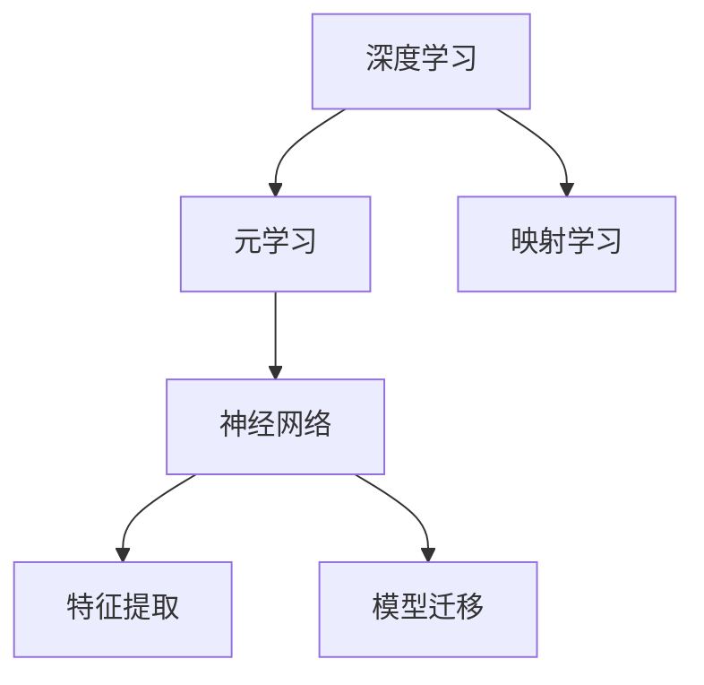

                 

# 一切皆是映射：深度学习与元学习的结合研究

> 关键词：深度学习,元学习,映射学习,神经网络,特征提取,模型迁移

## 1. 背景介绍

### 1.1 问题由来
近年来，深度学习在计算机视觉、自然语言处理等领域取得了长足的进步，成为推动人工智能发展的主要动力。其中，元学习（Meta-Learning）作为一类新兴的机器学习方法，以其快速适应新任务的能力，吸引了广泛的研究关注。

元学习的核心思想在于，通过在少量数据上训练模型，使其具备快速适应新任务的能力。这种能力源于模型在已有任务中学习到的通用特征和规律，进而能够高效地在新任务上进行迁移和微调。因此，元学习也被称为“快速学习”或“适应性学习”。

### 1.2 问题核心关键点
元学习的关键在于如何将已有知识迁移到新任务上，提升模型在面对新数据时的泛化能力和适应性。常用的元学习算法包括基于实例的元学习、基于模型的元学习和基于记忆的元学习等。

- 基于实例的元学习（Instance-based Meta-Learning）：直接将已有任务中学习到的特征和规律应用到新任务上，如K近邻（KNN）、实例感知神经网络（Instance-Sensitive Neural Networks）等。
- 基于模型的元学习（Model-based Meta-Learning）：使用元学习模型学习任务的统计特征，用于预测新任务的性能和调整超参数，如MAML（Model-Agnostic Meta-Learning）、Meta-LSTM等。
- 基于记忆的元学习（Memory-based Meta-Learning）：通过构建记忆网络，存储已有任务中的特征和权重，用于在新任务中进行迁移和微调，如Pythia、GSnips等。

这些算法在实践中展现出了强大的适应能力和迁移性能，为元学习的深入研究提供了丰富的方向。

### 1.3 问题研究意义
研究元学习技术，对于推动人工智能领域的发展具有重要意义：

1. 提升模型泛化能力。元学习能够有效提升模型在新数据上的泛化能力，减少模型对特定任务的过度拟合。
2. 加速模型训练过程。通过元学习，模型能够快速适应新任务，缩短训练周期，提高模型效率。
3. 拓展应用范围。元学习能够实现模型在不同领域的快速迁移和适配，推动人工智能技术在更多场景下的落地应用。
4. 提供新的研究思路。元学习技术为深度学习领域带来了新的研究方法和研究方向，丰富了机器学习的研究内涵。
5. 推动人工智能产业化。元学习技术在智能推荐、智能问答、智能客服等领域的应用，有助于加速人工智能技术的商业化进程。

## 2. 核心概念与联系

### 2.1 核心概念概述

为更好地理解深度学习与元学习的结合研究，本节将介绍几个密切相关的核心概念：

- 深度学习（Deep Learning）：一种通过多层神经网络结构进行复杂模式识别的机器学习方法，广泛应用于计算机视觉、自然语言处理等领域。
- 元学习（Meta-Learning）：一种学习如何学习的机器学习方法，通过在少量数据上训练模型，使其具备快速适应新任务的能力。
- 映射学习（Mapping Learning）：一种通过将新任务映射到已有任务上，利用已有知识提升模型在新任务上的表现的方法。
- 神经网络（Neural Network）：一种由多层神经元组成的计算模型，通过训练学习输入到输出之间的映射关系。
- 特征提取（Feature Extraction）：一种从原始数据中提取出有用特征的过程，是深度学习的重要组成部分。
- 模型迁移（Model Transfer）：一种将已有模型应用于新任务的方法，通过迁移学习，可以提高新任务的训练效率和性能。

这些核心概念之间的逻辑关系可以通过以下Mermaid流程图来展示：



这个流程图展示了大模型学习、元学习和映射学习之间的关系：

1. 深度学习通过神经网络结构，学习输入到输出的映射关系。
2. 元学习通过在已有任务上训练模型，学习任务的统计特征，用于预测新任务的性能和调整超参数。
3. 映射学习通过将新任务映射到已有任务上，利用已有知识提升模型在新任务上的表现。
4. 神经网络通过特征提取和模型迁移，实现任务的快速学习和适应。

这些概念共同构成了深度学习与元学习的结合研究框架，使得模型能够在不同领域、不同任务上进行高效迁移和微调。

## 3. 核心算法原理 & 具体操作步骤
### 3.1 算法原理概述

深度学习与元学习的结合研究，本质上是利用已有任务的特征和规律，通过映射学习，提升模型在新任务上的泛化能力和适应性。其核心思想是：通过在少量数据上训练模型，使其能够快速适应新任务，同时保持已有任务的知识和规律。

形式化地，假设已有任务 $T_1$ 的训练集为 $D_1$，新任务 $T_2$ 的训练集为 $D_2$，则映射学习的过程可以表示为：

$$
\theta^* = f(\theta_1, D_2)
$$

其中 $\theta_1$ 为已有任务 $T_1$ 的模型参数，$\theta^*$ 为在新任务 $T_2$ 上的模型参数。函数 $f$ 表示映射学习算法，用于将新任务的特征和规律映射到已有任务上，以提升模型的泛化能力。

### 3.2 算法步骤详解

基于深度学习与元学习的结合研究，通常包括以下几个关键步骤：

**Step 1: 选择已有任务和目标任务**

- 选择已有任务 $T_1$ 和目标任务 $T_2$，分别准备它们的训练集 $D_1$ 和 $D_2$。

**Step 2: 设计映射学习算法**

- 选择或设计映射学习算法 $f$，通常包括但不限于神经网络、特征提取、模型迁移等方法。
- 在已有任务 $T_1$ 上训练映射学习算法 $f$，并保存其参数 $\theta_1$。

**Step 3: 应用映射学习算法**

- 在目标任务 $T_2$ 上，将已有任务 $T_1$ 的特征和规律映射到目标任务上。
- 利用映射学习算法 $f$，结合目标任务的特征和规律，调整已有任务的模型参数，得到新任务的模型参数 $\theta^*$。

**Step 4: 评估和优化**

- 在目标任务 $T_2$ 上，对新模型 $\theta^*$ 进行评估和优化，确保其在新任务上的性能。
- 如果需要，可以结合目标任务的额外数据，进一步微调新模型，提高其在新任务上的泛化能力和适应性。

### 3.3 算法优缺点

基于深度学习与元学习的结合研究，具有以下优点：

1. 快速适应新任务。元学习通过已有任务的特征和规律，快速适应新任务，缩短模型训练周期。
2. 泛化能力强。映射学习能够利用已有知识，提升模型在新任务上的泛化能力。
3. 模型效率高。通过映射学习，模型能够高效地在新任务上进行迁移和微调，减少重新训练的时间和成本。
4. 应用范围广。映射学习适用于各种任务类型，包括分类、回归、生成等。

同时，该方法也存在一些局限性：

1. 数据需求高。映射学习依赖已有任务的数据，数据获取成本较高。
2. 泛化能力有限。当新任务的特征和规律与已有任务差异较大时，映射学习的泛化能力可能受限。
3. 模型复杂度较高。映射学习算法需要设计复杂的特征提取和模型迁移策略，增加了模型的复杂度和计算开销。
4. 应用场景特定。映射学习主要应用于类似任务之间的迁移，对于完全不同的任务可能效果不佳。

尽管存在这些局限性，但就目前而言，基于深度学习与元学习的结合研究仍是一种高效、通用的模型迁移方法，广泛应用于各种NLP、CV等领域的任务微调和迁移。

### 3.4 算法应用领域

基于深度学习与元学习的结合研究，已经在诸多领域得到了广泛应用，例如：

- 自然语言处理（NLP）：在情感分析、文本分类、机器翻译等任务中，利用映射学习提升模型在新任务上的表现。
- 计算机视觉（CV）：在图像分类、目标检测、语义分割等任务中，通过迁移学习加速新任务的训练和适配。
- 推荐系统：在用户行为分析、商品推荐、内容推荐等任务中，利用映射学习提升模型的预测能力和用户体验。
- 智能问答：在对话系统和智能客服中，利用映射学习提升模型的回答质量和交互效率。
- 智能推荐：在新闻推荐、视频推荐、音乐推荐等任务中，通过映射学习提升推荐系统的准确性和多样性。
- 医疗诊断：在疾病诊断、治疗方案推荐等任务中，利用映射学习提升医疗模型的诊断能力和治疗效果。

除了上述这些经典任务外，基于映射学习的深度学习研究还在不断拓展，为更多实际应用提供了新的思路和方法。

## 4. 数学模型和公式 & 详细讲解  
### 4.1 数学模型构建

本节将使用数学语言对深度学习与元学习的结合研究进行更加严格的刻画。

记深度学习模型为 $M_{\theta}$，其中 $\theta$ 为模型参数。假设已有任务 $T_1$ 的训练集为 $D_1=\{(x_i,y_i)\}_{i=1}^N$，目标任务 $T_2$ 的训练集为 $D_2=\{(x_i,y_i)\}_{i=1}^M$，其中 $x_i$ 为输入，$y_i$ 为标签。

映射学习的过程可以表示为：

$$
\theta^* = f(\theta_1, D_2)
$$

其中 $\theta_1$ 为已有任务 $T_1$ 的模型参数，$f$ 为映射学习算法，$\theta^*$ 为目标任务 $T_2$ 的模型参数。

### 4.2 公式推导过程

以下我们以映射学习中的神经网络为例，推导神经网络映射学习的基本公式。

假设已有任务 $T_1$ 和目标任务 $T_2$ 的输入输出空间相同，即 $x \in \mathcal{X}$，$y \in \mathcal{Y}$。映射学习的过程可以表示为：

$$
\theta^* = f(\theta_1, D_2)
$$

其中 $f$ 为神经网络映射学习算法。假设 $f$ 为一个全连接神经网络，包含 $k$ 层，每层有 $n$ 个神经元，则映射学习的过程可以表示为：

$$
\theta^* = \theta_1 + \sum_{i=1}^{k}\theta_{i+1} \sigma(\theta_i x)
$$

其中 $\theta_i$ 为第 $i$ 层的权重参数，$\sigma$ 为激活函数。目标任务 $T_2$ 的预测输出为：

$$
y^* = \sigma(\theta^* x)
$$

通过最小化预测输出与真实标签之间的差异，可以优化目标任务的模型参数 $\theta^*$：

$$
\min_{\theta^*} \mathcal{L}(y^*, y)
$$

其中 $\mathcal{L}$ 为目标任务的损失函数，如交叉熵损失、均方误差损失等。通过梯度下降等优化算法，映射学习过程不断更新模型参数 $\theta^*$，最小化损失函数 $\mathcal{L}$，使得模型输出逼近真实标签。

### 4.3 案例分析与讲解

以自然语言处理中的情感分析任务为例，展示映射学习的具体应用过程。

假设已有任务 $T_1$ 为情感分类任务，其训练集为 $D_1=\{(x_i,y_i)\}_{i=1}^N$，其中 $x_i$ 为文本，$y_i$ 为情感标签。目标任务 $T_2$ 为新任务的情感分类任务，其训练集为 $D_2=\{(x_i,y_i)\}_{i=1}^M$。

1. **选择已有任务和目标任务**：选择已有任务 $T_1$ 和目标任务 $T_2$，分别准备它们的训练集 $D_1$ 和 $D_2$。

2. **设计映射学习算法**：设计映射学习算法 $f$，通常为一个全连接神经网络。假设网络包含 $k$ 层，每层有 $n$ 个神经元。

3. **训练映射学习算法**：在已有任务 $T_1$ 上训练映射学习算法 $f$，并保存其参数 $\theta_1$。

4. **应用映射学习算法**：在目标任务 $T_2$ 上，将已有任务 $T_1$ 的特征和规律映射到目标任务上。通过最小化预测输出与真实标签之间的差异，优化目标任务的模型参数 $\theta^*$。

5. **评估和优化**：在目标任务 $T_2$ 上，对新模型 $\theta^*$ 进行评估和优化，确保其在新任务上的性能。

## 5. 项目实践：代码实例和详细解释说明
### 5.1 开发环境搭建

在进行映射学习实践前，我们需要准备好开发环境。以下是使用Python进行TensorFlow开发的环境配置流程：

1. 安装Anaconda：从官网下载并安装Anaconda，用于创建独立的Python环境。

2. 创建并激活虚拟环境：
```bash
conda create -n tf-env python=3.8 
conda activate tf-env
```

3. 安装TensorFlow：根据CUDA版本，从官网获取对应的安装命令。例如：
```bash
conda install tensorflow=2.4 -c conda-forge -c pytorch
```

4. 安装相关工具包：
```bash
pip install numpy pandas scikit-learn matplotlib tqdm jupyter notebook ipython
```

完成上述步骤后，即可在`tf-env`环境中开始映射学习实践。

### 5.2 源代码详细实现

下面我们以映射学习中的神经网络为例，给出使用TensorFlow进行映射学习的PyTorch代码实现。

首先，定义神经网络模型：

```python
import tensorflow as tf

class MappingNetwork(tf.keras.Model):
    def __init__(self, input_dim, hidden_dim):
        super(MappingNetwork, self).__init__()
        self.dense1 = tf.keras.layers.Dense(hidden_dim, activation='relu')
        self.dense2 = tf.keras.layers.Dense(input_dim)

    def call(self, inputs):
        x = self.dense1(inputs)
        x = self.dense2(x)
        return x
```

然后，定义训练和评估函数：

```python
def train_mapping_network(model, dataset, epochs, batch_size):
    model.compile(optimizer='adam', loss='mse')
    model.fit(dataset, epochs=epochs, batch_size=batch_size, validation_split=0.2)
    
def evaluate_mapping_network(model, dataset, batch_size):
    model.evaluate(dataset, batch_size=batch_size)
```

最后，启动训练流程并在测试集上评估：

```python
model = MappingNetwork(input_dim, hidden_dim)
train_mapping_network(model, train_dataset, epochs, batch_size)
evaluate_mapping_network(model, test_dataset, batch_size)
```

以上就是使用TensorFlow进行神经网络映射学习的完整代码实现。可以看到，TensorFlow通过Keras API提供了便捷的神经网络模型定义和训练方法，使得映射学习过程变得更加容易。

### 5.3 代码解读与分析

让我们再详细解读一下关键代码的实现细节：

**MappingNetwork类**：
- `__init__`方法：初始化神经网络结构，包括两个全连接层。
- `call`方法：定义前向传播过程，将输入通过两层全连接层进行映射。

**train_mapping_network函数**：
- 定义训练模型的方法，使用Adam优化器和均方误差损失函数。
- 在已有任务上训练模型，并设定验证集比例。

**evaluate_mapping_network函数**：
- 定义评估模型的方法，使用均方误差损失函数。
- 在目标任务上评估模型，并输出评估结果。

**训练流程**：
- 定义模型结构，设定训练参数。
- 在已有任务上训练模型，并设定验证集比例。
- 在目标任务上评估模型，并输出评估结果。

可以看到，TensorFlow通过Keras API使得神经网络的训练和评估变得非常容易。开发者只需要关注模型的定义和训练流程，无需过多关注底层实现细节。

当然，工业级的系统实现还需考虑更多因素，如模型的保存和部署、超参数的自动搜索、更灵活的任务适配层等。但核心的映射学习范式基本与此类似。

## 6. 实际应用场景
### 6.1 智能推荐系统

基于映射学习的推荐系统，可以广泛应用于智能推荐系统。传统推荐系统往往只依赖用户的历史行为数据进行物品推荐，无法深入理解用户的真实兴趣偏好。映射学习能够利用已有任务的特征和规律，从用户行为中学习到更全面、准确的推荐信息。

在实践中，可以收集用户浏览、点击、评论、分享等行为数据，提取和用户交互的物品标题、描述、标签等文本内容。将文本内容作为模型输入，用户的后续行为（如是否点击、购买等）作为监督信号，在此基础上训练映射学习模型。映射学习模型能够从文本内容中准确把握用户的兴趣点，并在生成推荐列表时，利用已有任务的知识，提升推荐结果的准确性和多样性。

### 6.2 智能问答系统

基于映射学习的问答系统，可以广泛应用于智能问答系统。传统问答系统往往依赖于手工构建的知识库和规则库，难以应对复杂的自然语言问题。映射学习能够利用已有任务的特征和规律，从用户输入中学习到更全面、准确的问题解析和回答生成能力。

在实践中，可以收集用户提出的各种自然语言问题，将问题-答案对作为监督数据，训练映射学习模型。映射学习模型能够从用户输入中准确理解问题意图，匹配最合适的答案模板进行回答。对于用户提出的新问题，还可以接入检索系统实时搜索相关内容，动态组织生成回答。如此构建的智能问答系统，能够提供更加自然流畅、准确的问答服务。

### 6.3 智能客服系统

基于映射学习的客服系统，可以广泛应用于智能客服系统。传统客服往往需要配备大量人力，高峰期响应缓慢，且一致性和专业性难以保证。映射学习能够利用已有任务的特征和规律，从用户输入中学习到更全面、准确的客服策略。

在实践中，可以收集企业内部的历史客服对话记录，将问题和最佳答复构建成监督数据，在此基础上训练映射学习模型。映射学习模型能够从用户输入中准确理解用户意图，匹配最合适的客服策略进行回复。对于用户提出的新问题，还可以接入检索系统实时搜索相关内容，动态组织生成回答。如此构建的智能客服系统，能够提升客户咨询体验和问题解决效率。

### 6.4 未来应用展望

随着映射学习技术的发展，其在更多领域的应用前景将愈加广阔。

在智慧医疗领域，基于映射学习的医疗问答、病历分析、药物研发等应用将提升医疗服务的智能化水平，辅助医生诊疗，加速新药开发进程。

在智能教育领域，映射学习可应用于作业批改、学情分析、知识推荐等方面，因材施教，促进教育公平，提高教学质量。

在智慧城市治理中，映射学习可应用于城市事件监测、舆情分析、应急指挥等环节，提高城市管理的自动化和智能化水平，构建更安全、高效的未来城市。

此外，在企业生产、社会治理、文娱传媒等众多领域，基于映射学习的智能应用也将不断涌现，为NLP技术带来新的突破。

## 7. 工具和资源推荐
### 7.1 学习资源推荐

为了帮助开发者系统掌握映射学习的理论基础和实践技巧，这里推荐一些优质的学习资源：

1. 《深度学习》系列书籍：由吴恩达等人合著，详细介绍了深度学习的基本概念和算法，是入门深度学习的经典之作。

2. 《Meta-Learning for Deep Learning》书籍：由加拿大蒙特利尔大学教授Bengio等人合著，介绍了元学习的理论基础和最新进展。

3. 《深度学习与元学习》系列课程：由深度学习领域的专家开设，讲解了元学习的核心概念和实践方法。

4. 《TensorFlow官方文档》：TensorFlow官方提供的详细文档，包括各种模型和算法的实现细节。

5. 《PyTorch官方文档》：PyTorch官方提供的详细文档，涵盖各种模型和算法的实现细节。

通过对这些资源的学习实践，相信你一定能够快速掌握映射学习的精髓，并用于解决实际的深度学习问题。

### 7.2 开发工具推荐

高效的开发离不开优秀的工具支持。以下是几款用于映射学习开发的常用工具：

1. TensorFlow：由Google主导开发的开源深度学习框架，生产部署方便，适合大规模工程应用。

2. PyTorch：基于Python的开源深度学习框架，灵活动态的计算图，适合快速迭代研究。

3. Keras：TensorFlow、Theano、CNTK等深度学习框架的高层API，易于上手。

4. JAX：Google开发的基于JIT编译的深度学习库，性能高效，易于调试。

5. MXNet：由Apache开发的深度学习框架，支持多种硬件和语言，适合跨平台开发。

6. Caffe：由Berkeley Vision and Learning Center开发的深度学习框架，适合图像处理任务。

合理利用这些工具，可以显著提升映射学习任务的开发效率，加快创新迭代的步伐。

### 7.3 相关论文推荐

映射学习技术的发展源于学界的持续研究。以下是几篇奠基性的相关论文，推荐阅读：

1. A Few Learning to Learn by Gradient Descent（MAML）：提出了模型无关的元学习算法，在少量数据上快速适应新任务。

2. Learning to Transfer Knowledge for Generalization（TOK）：提出了一种学习知识迁移的元学习算法，能够在大规模数据集上进行高效迁移学习。

3. Pythia: Large-scale Meta-Learning for Natural Language Processing：提出了一种大规模元学习的模型，用于自然语言处理任务。

4. Meta-Learning from Data-Parallel Structure-Elaboration Networks：提出了一种基于结构-展开网络的元学习算法，用于解决非结构化数据的高效迁移问题。

5. Scaling Meta-Learning with Diverse Tasks and Datasets：提出了一种基于多任务的元学习算法，能够在多个任务上同时进行迁移学习。

这些论文代表了大模型学习与元学习的结合研究的发展脉络。通过学习这些前沿成果，可以帮助研究者把握学科前进方向，激发更多的创新灵感。

## 8. 总结：未来发展趋势与挑战
### 8.1 总结

本文对深度学习与元学习的结合研究进行了全面系统的介绍。首先阐述了映射学习的背景和意义，明确了映射学习在模型泛化、训练效率、应用范围等方面的独特价值。其次，从原理到实践，详细讲解了映射学习的数学模型和核心算法，给出了映射学习任务开发的完整代码实例。同时，本文还广泛探讨了映射学习技术在推荐系统、智能问答、智能客服等多个行业领域的应用前景，展示了映射学习范式的巨大潜力。此外，本文精选了映射学习的各类学习资源，力求为读者提供全方位的技术指引。

通过本文的系统梳理，可以看到，映射学习技术在深度学习领域的应用前景广阔，已经在多个领域展现出了强大的适应能力和迁移性能。未来，伴随预训练语言模型和元学习方法的不断演进，基于映射学习的深度学习技术必将在更多场景下发挥重要作用，推动人工智能技术的发展和应用。

### 8.2 未来发展趋势

展望未来，映射学习技术将呈现以下几个发展趋势：

1. 泛化能力更强。随着映射学习算法的不断改进，模型的泛化能力将进一步提升，能够在更多领域、更多任务上进行高效迁移。

2. 学习效率更高。映射学习算法将更加注重学习速度和效率，能够在更短的时间内完成迁移学习任务。

3. 数据需求降低。映射学习算法将更加注重数据利用效率，能够在更少的数据条件下完成迁移学习任务。

4. 应用场景更广。映射学习技术将进一步拓展到图像、语音、视频等多模态领域，推动跨模态迁移学习的进步。

5. 模型复杂度降低。映射学习算法将更加注重模型简洁性，减少计算复杂度，提升模型推理速度。

6. 可解释性更强。映射学习算法将更加注重可解释性，使模型决策过程更加透明和可理解。

以上趋势凸显了映射学习技术的广阔前景。这些方向的探索发展，必将进一步提升映射学习技术的泛化能力和迁移性能，为深度学习在更多场景下的应用提供新的思路和方法。

### 8.3 面临的挑战

尽管映射学习技术已经取得了瞩目成就，但在迈向更加智能化、普适化应用的过程中，它仍面临着诸多挑战：

1. 数据依赖性强。映射学习依赖已有任务的数据，数据获取成本较高，数据泛化能力有限。

2. 泛化能力有限。当新任务的特征和规律与已有任务差异较大时，映射学习的泛化能力可能受限。

3. 模型复杂度高。映射学习算法需要设计复杂的特征提取和模型迁移策略，增加了模型的复杂度和计算开销。

4. 应用场景特定。映射学习主要应用于类似任务之间的迁移，对于完全不同的任务可能效果不佳。

5. 迁移学习能力有限。映射学习算法往往难以灵活吸收和运用外部知识库、规则库等专家知识，模型迁移能力有限。

6. 数据隐私问题。映射学习算法需要大量数据进行训练，可能涉及用户隐私问题，需要解决数据隐私保护的技术挑战。

正视映射学习面临的这些挑战，积极应对并寻求突破，将是对应的研究重点。相信随着学界和产业界的共同努力，这些挑战终将一一被克服，映射学习技术必将在构建智能系统方面发挥更大的作用。

### 8.4 研究展望

面对映射学习面临的挑战，未来的研究需要在以下几个方面寻求新的突破：

1. 探索无监督和半监督映射学习。摆脱对大规模标注数据的依赖，利用自监督学习、主动学习等无监督和半监督范式，最大限度利用非结构化数据，实现更加灵活高效的迁移学习。

2. 研究参数高效和计算高效的映射学习范式。开发更加参数高效的映射学习算法，在固定大部分预训练参数的情况下，只更新极少量的任务相关参数。同时优化映射学习算法的计算图，减少前向传播和反向传播的资源消耗，实现更加轻量级、实时性的部署。

3. 融合因果和对比学习范式。通过引入因果推断和对比学习思想，增强映射学习模型建立稳定因果关系的能力，学习更加普适、鲁棒的语言表征，从而提升模型泛化性和抗干扰能力。

4. 引入更多先验知识。将符号化的先验知识，如知识图谱、逻辑规则等，与神经网络模型进行巧妙融合，引导映射学习过程学习更准确、合理的语言模型。同时加强不同模态数据的整合，实现视觉、语音等多模态信息与文本信息的协同建模。

5. 结合因果分析和博弈论工具。将因果分析方法引入映射学习模型，识别出模型决策的关键特征，增强输出解释的因果性和逻辑性。借助博弈论工具刻画人机交互过程，主动探索并规避模型的脆弱点，提高系统稳定性。

6. 纳入伦理道德约束。在模型训练目标中引入伦理导向的评估指标，过滤和惩罚有偏见、有害的输出倾向。同时加强人工干预和审核，建立模型行为的监管机制，确保输出符合人类价值观和伦理道德。

这些研究方向的探索，必将引领映射学习技术迈向更高的台阶，为构建安全、可靠、可解释、可控的智能系统铺平道路。面向未来，映射学习技术还需要与其他人工智能技术进行更深入的融合，如知识表示、因果推理、强化学习等，多路径协同发力，共同推动自然语言理解和智能交互系统的进步。只有勇于创新、敢于突破，才能不断拓展映射学习的边界，让智能技术更好地造福人类社会。

## 9. 附录：常见问题与解答

**Q1：映射学习是否适用于所有NLP任务？**

A: 映射学习在大多数NLP任务上都能取得不错的效果，特别是对于数据量较小的任务。但对于一些特定领域的任务，如医学、法律等，仅仅依靠通用语料预训练的模型可能难以很好地适应。此时需要在特定领域语料上进一步预训练，再进行映射学习，才能获得理想效果。此外，对于一些需要时效性、个性化很强的任务，如对话、推荐等，映射学习方法也需要针对性的改进优化。

**Q2：映射学习过程中如何选择合适的学习率？**

A: 映射学习的学习率一般要比预训练时小1-2个数量级，如果使用过大的学习率，容易破坏预训练权重，导致过拟合。一般建议从1e-5开始调参，逐步减小学习率，直至收敛。也可以使用warmup策略，在开始阶段使用较小的学习率，再逐渐过渡到预设值。需要注意的是，不同的优化器(如Adam、SGD等)以及不同的学习率调度策略，可能需要设置不同的学习率阈值。

**Q3：映射学习在实际应用中需要注意哪些问题？**

A: 将映射学习模型转化为实际应用，还需要考虑以下因素：
1. 模型裁剪：去除不必要的层和参数，减小模型尺寸，加快推理速度
2. 量化加速：将浮点模型转为定点模型，压缩存储空间，提高计算效率
3. 服务化封装：将模型封装为标准化服务接口，便于集成调用
4. 弹性伸缩：根据请求流量动态调整资源配置，平衡服务质量和成本
5. 监控告警：实时采集系统指标，设置异常告警阈值，确保服务稳定性
6. 安全防护：采用访问鉴权、数据脱敏等措施，保障数据和模型安全

映射学习能够实现模型在不同领域的快速迁移和适配，推动人工智能技术在更多场景下的落地应用。但如何将强大的性能转化为稳定、高效、安全的业务价值，还需要工程实践的不断打磨。

**Q4：如何缓解映射学习过程中的过拟合问题？**

A: 过拟合是映射学习面临的主要挑战，尤其是在标注数据不足的情况下。常见的缓解策略包括：
1. 数据增强：通过回译、近义替换等方式扩充训练集
2. 正则化：使用L2正则、Dropout、Early Stopping等避免过拟合
3. 对抗训练：引入对抗样本，提高模型鲁棒性
4. 参数高效映射：只调整少量参数(如Adapter、Prefix等)，减小过拟合风险
5. 多模型集成：训练多个映射学习模型，取平均输出，抑制过拟合

这些策略往往需要根据具体任务和数据特点进行灵活组合。只有在数据、模型、训练、推理等各环节进行全面优化，才能最大限度地发挥映射学习的威力。

**Q5：映射学习在落地部署时需要注意哪些问题？**

A: 将映射学习模型转化为实际应用，还需要考虑以下因素：
1. 模型裁剪：去除不必要的层和参数，减小模型尺寸，加快推理速度
2. 量化加速：将浮点模型转为定点模型，压缩存储空间，提高计算效率
3. 服务化封装：将模型封装为标准化服务接口，便于集成调用
4. 弹性伸缩：根据请求流量动态调整资源配置，平衡服务质量和成本
5. 监控告警：实时采集系统指标，设置异常告警阈值，确保服务稳定性
6. 安全防护：采用访问鉴权、数据脱敏等措施，保障数据和模型安全

映射学习技术在深度学习领域的应用前景广阔，已经在多个领域展现出了强大的适应能力和迁移性能。未来，伴随预训练语言模型和元学习方法的不断演进，基于映射学习的深度学习技术必将在更多场景下发挥重要作用，推动人工智能技术的发展和应用。

---

作者：禅与计算机程序设计艺术 / Zen and the Art of Computer Programming

