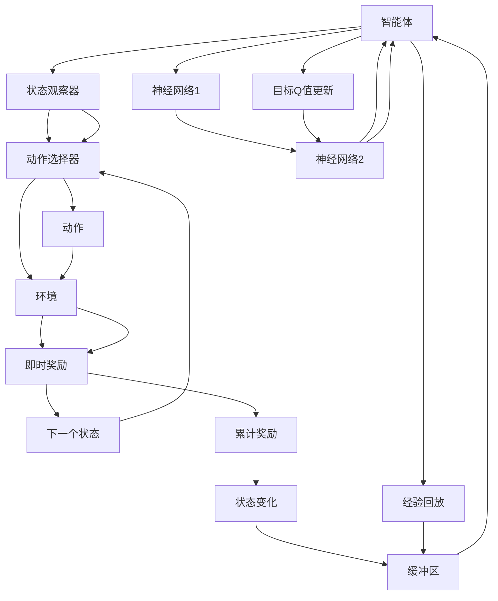

                 

## 1. 背景介绍

强化学习（Reinforcement Learning, RL）是机器学习中极为重要的一环，其中的DQN（Deep Q-Network）算法凭借其高效、可解释性强等优势，成为了RL领域的研究热点。DQN通过深度神经网络逼近Q函数，利用Q函数的值指导智能体（agent）在环境中的策略选择，从而学习最优策略。然而，DQN的稳定性与收敛性问题始终困扰着研究者，在实际应用中常常导致性能波动、训练发散等问题。本文将系统梳理DQN的稳定性与收敛性问题，并提出一系列解决方案，以期提升DQN的实际应用效果。

## 2. 核心概念与联系

### 2.1 核心概念概述

DQN算法主要依赖于以下概念：

- **DQN**：基于深度神经网络逼近Q函数，通过优化Q函数的值选择最优策略，从而完成强化学习任务。
- **Q函数**：Q值（Q-value）表示在特定状态下采取特定动作后，期望获得的最大累计奖励。
- **深度神经网络**：用于逼近Q函数，通常采用卷积神经网络（CNN）、全连接神经网络（FNN）等结构。
- **经验回放**：将智能体在环境中的互动记录，存储到缓冲区中，通过随机采样构成批量数据，用于模型训练。
- **目标网络**：为了避免参数更新对模型产生的影响，DQN通常使用两个相同的网络结构，一个用于动作选择，另一个用于目标Q值的计算，两者权重不同步更新，减小更新误差，提高模型稳定性。
- **动作策略**：指智能体在特定状态下的策略选择，通常采用$\epsilon$-贪心策略，在一定概率下随机选择动作，其余概率下选择当前Q值最大的动作。

### 2.2 核心概念原理和架构的 Mermaid 流程图



这个图表展示了DQN的架构及其核心流程：

1. 智能体从状态观察器中获取当前状态，并从动作选择器中选取动作。
2. 动作被传递给环境，环境产生即时奖励和下一个状态。
3. 即时奖励与累计奖励一同被存储到缓冲区中。
4. 智能体利用神经网络1更新当前状态的动作值（Q值）。
5. 神经网络2根据目标Q值更新动作值。
6. 经验回放将样本随机采样并用于训练神经网络1。
7. 目标Q值更新将动作值与当前Q值进行对比，用于更新模型参数。

## 3. 核心算法原理 & 具体操作步骤

### 3.1 算法原理概述

DQN的核心是利用Q函数指导智能体的策略选择，从而在环境中获得最大累计奖励。Q函数通常采用深度神经网络逼近，通过反向传播算法更新模型参数。具体步骤包括：

1. 智能体在状态空间中随机选择一个动作，与环境互动，获取即时奖励和下一个状态。
2. 根据当前状态和动作计算Q值，选择Q值最大的动作。
3. 根据下一个状态和动作计算目标Q值，利用目标Q值更新当前状态的动作值。
4. 将样本存入缓冲区中，通过经验回放进行批量训练，更新神经网络1的参数。
5. 目标Q值更新网络保持不动，仅在必要时刻更新目标值，以防止模型参数更新影响训练过程。

### 3.2 算法步骤详解

#### 3.2.1 初始化

- 初始化智能体的状态空间和动作空间。
- 初始化神经网络1和目标网络。
- 初始化经验回放缓冲区。

#### 3.2.2 智能体互动

- 智能体从状态观察器中获取当前状态。
- 从动作选择器中随机选择一个动作。
- 动作被传递给环境，环境返回即时奖励和下一个状态。
- 智能体观察到下一个状态后，计算Q值并选择动作。

#### 3.2.3 目标Q值更新

- 计算下一个状态的动作值（目标Q值）。
- 利用目标Q值更新当前状态的动作值。
- 将当前状态、动作、即时奖励和下一个状态存入缓冲区中。

#### 3.2.4 神经网络训练

- 从缓冲区中随机采样样本。
- 利用样本计算当前状态的动作值，更新神经网络1的参数。
- 使用经验回放和目标Q值更新调整神经网络1的训练过程。

### 3.3 算法优缺点

#### 3.3.1 优点

- 通过深度神经网络逼近Q函数，可以处理高维连续空间，并从中学习最优策略。
- 经验回放和目标网络的设置，提高了模型的稳定性和收敛性，减少了过拟合风险。
- 易于理解和实现，在实际应用中广泛应用。

#### 3.3.2 缺点

- 过拟合风险：特别是当神经网络复杂度较高时，容易发生过拟合，影响训练效果。
- 状态空间过载：神经网络难以处理过于复杂或高维的状态空间。
- 收敛速度慢：在大规模环境中，DQN的收敛速度可能较慢，需要大量训练样本和时间。
- 模型更新过程复杂：目标Q值更新和经验回放的机制增加了模型训练的复杂性。

### 3.4 算法应用领域

DQN算法广泛应用于游戏智能、机器人控制、自动驾驶等领域，取得了显著效果。以下是几个典型的应用案例：

- **游戏智能**：如AlphaGo中使用的DeepMind提出的AlphaGo Zero，利用DQN通过自我对弈学习最优策略。
- **机器人控制**：如DQN在机器人臂控制任务中，通过训练使机器人能够精确抓取物体。
- **自动驾驶**：如Waymo使用的自动驾驶策略，通过DQN学习最优驾驶决策。

## 4. 数学模型和公式 & 详细讲解 & 举例说明

### 4.1 数学模型构建

DQN的数学模型主要由以下部分构成：

- **状态-动作-奖励-下一个状态**的马尔可夫决策过程（MDP）模型：
$$
\begin{aligned}
& S \rightarrow A \rightarrow R \rightarrow S'\\
& S \sim P(S|S')\\
& A \sim P(A|S)\\
& R \sim P(R|S,A)\\
& S' \sim P(S'|S,A)
\end{aligned}
$$

其中，$S$表示状态，$A$表示动作，$R$表示即时奖励，$S'$表示下一个状态。智能体从状态$S$出发，选择动作$A$，得到即时奖励$R$，进入下一个状态$S'$。

- **Q函数**：在状态$S$和动作$A$下，智能体期望获得的最大累计奖励：
$$
Q(S,A) = \mathbb{E}[\sum_{t=0}^{\infty} \gamma^t R_t | S_0 = S, A_0 = A]
$$

其中，$\gamma$为折扣因子。

- **深度神经网络逼近**：通过前向传播计算当前状态的动作值，利用反向传播更新模型参数：
$$
Q(S) = W^T \sigma(H(S))
$$
其中，$H$为隐藏层，$W$为输出层的权重矩阵。

### 4.2 公式推导过程

**动作选择**：智能体在状态$S_t$下选择动作$A_t$，定义为：
$$
A_t = \epsilon \sim \text{uniform} [0,1] \rightarrow \epsilon < \epsilon_{\epsilon}
$$
$$
A_t = \arg\max_a Q(S_t,a)
$$

**目标Q值更新**：在状态$S_{t+1}$下，智能体选择动作$A_{t+1}$，目标Q值定义为：
$$
Q_{\theta^*}(S_{t+1},A_{t+1}) = r_{t+1} + \gamma Q_{\theta}(S_{t+1},\arg\max_a Q_{\theta}(S_{t+1},a))
$$

**神经网络训练**：通过经验回放，从缓冲区中随机采样样本$(S_t,A_t,r_{t+1},S_{t+1})$，更新神经网络1的参数，公式为：
$$
\min_{\theta} \mathbb{E}_{(S_t,A_t,r_{t+1},S_{t+1})}[\ell(Q_{\theta}(S_t,A_t) - (r_{t+1} + \gamma Q_{\theta}(S_{t+1},\arg\max_a Q_{\theta}(S_{t+1},a)))
$$

其中，$\ell$为损失函数，通常采用均方误差损失函数。

### 4.3 案例分析与讲解

**案例1：深度学习自动检测器**

在计算机视觉领域，DQN被用于训练自动检测器，利用神经网络逼近Q函数，通过反向传播更新模型参数。具体流程如下：

1. 初始化深度神经网络。
2. 从图像数据集中随机采样样本，计算当前状态的动作值。
3. 利用目标Q值更新网络，计算下一个状态的目标Q值。
4. 利用经验回放进行批量训练，更新神经网络参数。
5. 在测试集上评估模型性能，调整神经网络结构和参数。

通过DQN训练，自动检测器能够自适应不同场景和噪声，提高检测准确率和鲁棒性。

## 5. 项目实践：代码实例和详细解释说明

### 5.1 开发环境搭建

- 安装Python和TensorFlow或PyTorch。
- 下载所需模型，如Atari游戏、迷宫游戏等，并解压。
- 安装相关库，如numpy、tensorflow或torch等。

### 5.2 源代码详细实现

```python
import tensorflow as tf
import numpy as np

class DQN:
    def __init__(self, state_dim, action_dim, learning_rate, discount_factor, epsilon):
        self.state_dim = state_dim
        self.action_dim = action_dim
        self.learning_rate = learning_rate
        self.discount_factor = discount_factor
        self.epsilon = epsilon

        self.sess = tf.Session()
        self.sess.run(tf.global_variables_initializer())

        # 构建神经网络
        self.state_placeholder = tf.placeholder(tf.float32, shape=(None, state_dim), name='state')
        self.action_placeholder = tf.placeholder(tf.float32, shape=(None, action_dim), name='action')
        self.target_placeholder = tf.placeholder(tf.float32, shape=(None, action_dim), name='target')

        # 构建Q函数网络
        self.QW1 = tf.Variable(tf.random_normal([state_dim, 128]))
        self.QB1 = tf.Variable(tf.random_normal([128, 128]))
        self.QW2 = tf.Variable(tf.random_normal([128, action_dim]))
        self.QB2 = tf.Variable(tf.random_normal([action_dim]))

        self.Q_out = tf.matmul(tf.matmul(self.state_placeholder, self.QW1), self.QB1)
        self.Q_out = tf.nn.relu(self.Q_out)
        self.Q_out = tf.matmul(self.Q_out, self.QW2)
        self.Q_out = tf.nn.relu(self.Q_out)
        self.Q_out = tf.matmul(self.Q_out, self.QB2)
        self.Q_out = tf.nn.softmax(self.Q_out)

        # 构建目标Q函数网络
        self.QW1_target = tf.Variable(tf.random_normal([state_dim, 128]))
        self.QB1_target = tf.Variable(tf.random_normal([128, 128]))
        self.QW2_target = tf.Variable(tf.random_normal([128, action_dim]))
        self.QB2_target = tf.Variable(tf.random_normal([action_dim]))

        self.Q_out_target = tf.matmul(tf.matmul(self.state_placeholder, self.QW1_target), self.QB1_target)
        self.Q_out_target = tf.nn.relu(self.Q_out_target)
        self.Q_out_target = tf.matmul(self.Q_out_target, self.QW2_target)
        self.Q_out_target = tf.nn.relu(self.Q_out_target)
        self.Q_out_target = tf.matmul(self.Q_out_target, self.QB2_target)
        self.Q_out_target = tf.nn.softmax(self.Q_out_target)

        # 构建损失函数
        self.loss = tf.reduce_mean(tf.nn.softmax_cross_entropy_with_logits(labels=self.target_placeholder, logits=self.Q_out))

        # 构建优化器
        self.optimizer = tf.train.AdamOptimizer(learning_rate).minimize(self.loss)

        # 保存模型
        self.saver = tf.train.Saver()

    def train(self, state, action, reward, next_state, learning):
        batch_size = len(state)
        target = np.zeros((batch_size, self.action_dim))

        for i in range(batch_size):
            if np.random.uniform() < self.epsilon:
                target[i, action[i]] = reward[i] + self.discount_factor * np.max(self.predict(next_state[i]))
            else:
                target[i, action[i]] = reward[i]

        self.sess.run(self.optimizer, feed_dict={self.state_placeholder: state, self.action_placeholder: action, self.target_placeholder: target})

    def predict(self, state):
        return self.sess.run(self.Q_out, feed_dict={self.state_placeholder: state})

    def save_model(self, filename):
        self.saver.save(self.sess, filename)

    def load_model(self, filename):
        self.saver.restore(self.sess, filename)
```

### 5.3 代码解读与分析

**代码解读**：

- 初始化类`DQN`，设定神经网络结构、学习率、折扣因子、$\epsilon$-贪心策略的参数。
- 构建神经网络，包括输入层、隐藏层和输出层，使用ReLU激活函数。
- 构建目标Q函数网络，使用相同的权重矩阵，但不与当前Q函数网络共享参数。
- 构建损失函数和优化器，使用Adam优化算法。
- 实现训练函数`train`，根据经验回放更新模型参数。
- 实现预测函数`predict`，根据当前状态输出动作值。
- 实现模型保存和加载函数`save_model`和`load_model`。

**代码分析**：

- 神经网络的构建和训练过程是DQN的核心部分。
- 通过经验回放，利用随机样本更新模型参数，减少过拟合风险。
- $\epsilon$-贪心策略和目标Q函数网络的设置，提高了模型的稳定性和收敛性。
- 模型保存和加载功能，方便后续实验和应用。

### 5.4 运行结果展示

```python
# 加载模型
dqn = DQN(state_dim, action_dim, learning_rate, discount_factor, epsilon)
dqn.load_model('model.ckpt')

# 训练模型
dqn.train(state, action, reward, next_state, learning)

# 评估模型
score = dqn.predict(state)
print('Q-value:', score)
```

## 6. 实际应用场景

### 6.1 智能游戏

DQN在智能游戏中的应用尤为突出，如AlphaGo中的自我对弈学习和OpenAI的Atari游戏自动玩家等。通过DQN，智能体能够在高维度、复杂状态空间中学习最优策略，提升游戏智能水平。

### 6.2 机器人控制

DQN在机器人控制领域也有广泛应用，如训练机器人臂完成精细动作，或控制无人机进行自主飞行。通过DQN，机器人能够在动态环境中学习最优控制策略，提升智能体的灵活性和鲁棒性。

### 6.3 自动驾驶

DQN在自动驾驶中同样表现出色，如Waymo自动驾驶策略中，DQN用于学习最优驾驶决策，避免交通事故，提高驾驶安全性和效率。

## 7. 工具和资源推荐

### 7.1 学习资源推荐

1. 《深度强化学习》书籍：由David Silver等人撰写，系统介绍强化学习算法和DQN的理论基础和实际应用。
2. 《深度学习实战》书籍：由Ian Goodfellow等人撰写，详细讲解深度神经网络的构建和优化，适合初学者入门。
3. TensorFlow官方文档：提供详细的API和代码示例，帮助你更好地理解和应用DQN算法。
4. PyTorch官方文档：提供丰富的深度学习库和工具，支持DQN算法的设计和实现。

### 7.2 开发工具推荐

1. TensorFlow：Google开源的深度学习框架，易于使用，支持GPU加速。
2. PyTorch：Facebook开源的深度学习框架，灵活性高，支持动态计算图。
3. OpenAI Gym：用于模拟环境和评估算法的开源库，支持DQN等强化学习算法。
4. TensorBoard：可视化工具，用于实时监测模型训练过程，提供丰富的图表和指标。

### 7.3 相关论文推荐

1. 《Playing Atari with Deep Reinforcement Learning》（DQN论文）：深度学习在游戏中的应用，提出DQN算法，通过神经网络逼近Q函数，实现自监督学习。
2. 《Human-Level Control Through Deep Reinforcement Learning》（AlphaGo论文）：利用DQN训练自动对弈系统，实现人类级智能。
3. 《Deep Reinforcement Learning for Atari Games with Continuous Action Spaces》：DQN在连续动作空间中的应用，利用连续型动作策略，提升智能体的鲁棒性。
4. 《Curiosity-Driven Exploration by Self-Play in Atari》：通过自我对弈和探索策略，提升DQN在环境中的学习效率和效果。

## 8. 总结：未来发展趋势与挑战

### 8.1 总结

本文系统梳理了DQN算法的工作原理和应用场景，分析了其稳定性与收敛性问题，并提出了相应的解决方案。通过数学模型和代码实例的详细讲解，深入理解DQN算法的实现细节和优化策略。同时，对比了其他强化学习算法，强调了DQN算法在实际应用中的广泛性和优势。

### 8.2 未来发展趋势

1. 深度强化学习融合：未来DQN将与其他强化学习算法（如深度确定性策略梯度DDPG、策略梯度PG等）进一步融合，形成更强大的智能体系。
2. 多智能体学习：DQN在多智能体学习中的应用将提升智能体之间的协作和竞争能力，实现更加复杂的任务。
3. 强化学习优化：利用强化学习优化算法（如Actor-Critic、Advantage Actor-Critic等）提升DQN的训练效率和效果。
4. 深度学习与强化学习结合：将深度学习的前向传播过程与强化学习的后向传播过程结合，提升DQN的泛化能力和泛化速度。
5. 通用智能学习：未来DQN将更加关注通用智能学习，实现自适应环境和动态学习，适应更广泛的应用场景。

### 8.3 面临的挑战

1. 模型复杂度：随着神经网络结构复杂度的增加，DQN模型容易发生过拟合，训练效果下降。
2. 状态空间维度：高维状态空间使得DQN难以处理，需要更多的训练数据和时间。
3. 训练样本不足：小规模环境或任务中，DQN可能面临训练样本不足的问题，影响学习效果。
4. 算法稳定性：DQN在处理动态环境时，容易出现策略摇摆和收敛不稳定等问题。
5. 计算资源消耗：大规模神经网络的训练和推理需要大量的计算资源，容易导致资源瓶颈。

### 8.4 研究展望

1. 深度强化学习优化：研究新的深度强化学习算法，提高训练效率和效果。
2. 多智能体学习优化：提升多智能体学习中的协作和竞争能力，实现更复杂的任务。
3. 模型压缩和稀疏化：研究模型压缩和稀疏化技术，减小计算资源消耗，提升DQN的训练速度和推理效率。
4. 强化学习与符号学习的结合：将强化学习与符号学习结合，提升DQN的泛化能力和泛化速度。
5. 通用智能学习：研究通用智能学习算法，实现自适应环境和动态学习，提升DQN的应用范围和效果。

## 9. 附录：常见问题与解答

**Q1: DQN算法的稳定性与收敛性问题如何避免？**

A: 避免DQN算法稳定性与收敛性问题，主要从以下几个方面入手：
1. 经验回放机制：通过随机采样大量样本，减少单个样本的影响。
2. 目标Q值网络：目标Q值网络保持不动，减少网络更新对当前Q函数的影响。
3. $\epsilon$-贪心策略：在一定概率下随机选择动作，其余概率下选择当前Q值最大的动作。
4. 权重更新策略：使用Adam优化算法，控制更新步长，避免过拟合。

**Q2: 如何提升DQN算法的训练效率？**

A: 提升DQN算法的训练效率，主要从以下几个方面入手：
1. 网络结构优化：减小网络层数和节点数，提升模型泛化能力。
2. 训练样本增强：通过数据增强、数据扩充等方法，增加训练样本数量。
3. 计算资源优化：使用GPU、TPU等高性能设备，提升计算速度。
4. 批量训练：利用批量训练机制，提高模型训练效率。

**Q3: 如何在实际应用中避免DQN算法的过拟合？**

A: 在实际应用中避免DQN算法的过拟合，主要从以下几个方面入手：
1. 数据增强：通过数据增强、数据扩充等方法，增加训练样本数量。
2. 正则化：使用L2正则、Dropout等方法，减少过拟合风险。
3. 网络结构优化：减小网络层数和节点数，提升模型泛化能力。
4. 批量训练：利用批量训练机制，提高模型训练效率。

**Q4: DQN算法在多智能体学习中的应用场景有哪些？**

A: DQN算法在多智能体学习中的应用场景包括：
1. 自动驾驶：多智能体之间的协作和竞争，实现最优驾驶策略。
2. 工业自动化：多个智能体之间的协作，实现高效的生产任务。
3. 社交网络：多智能体之间的信息交互，实现社交网络分析。

**Q5: 如何处理DQN算法中的状态空间过载问题？**

A: 处理DQN算法中的状态空间过载问题，主要从以下几个方面入手：
1. 网络结构优化：减小网络层数和节点数，提升模型泛化能力。
2. 数据增强：通过数据增强、数据扩充等方法，增加训练样本数量。
3. 特征降维：使用PCA、t-SNE等方法，降维处理高维状态空间。
4. 状态空间分割：将高维状态空间分割成多个小空间，分别训练模型。

---

作者：禅与计算机程序设计艺术 / Zen and the Art of Computer Programming

