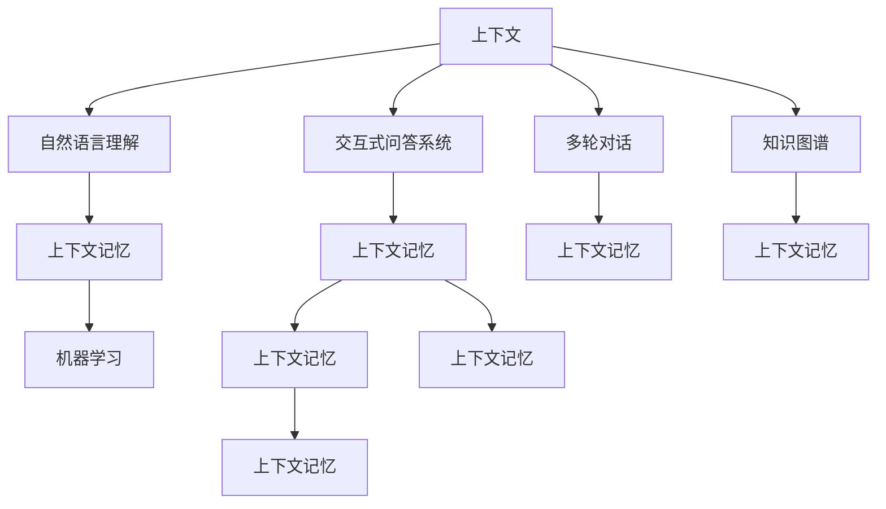

                 

# 上下文记忆技术在CUI中的详细解析

> 关键词：上下文记忆, 交互式问答系统, 自然语言理解, 知识图谱, 多轮对话, 机器学习

## 1. 背景介绍

在信息时代，用户越来越多地通过智能设备与AI进行交互，而自然语言处理（Natural Language Processing，NLP）是实现这种人机交互的重要技术之一。随着技术的发展，NLP领域出现了越来越多的智能应用，如智能客服、智能助手、聊天机器人等。这些应用不仅能够回答用户的问题，还能根据上下文进行多轮对话，为用户提供更丰富、更自然、更智能的服务。然而，尽管有了自然语言理解的进步，但这些应用仍然无法完全理解和记忆对话的上下文，常常需要手动输入上下文或重复相同的对话。

为了解决这一问题，上下文记忆技术应运而生。上下文记忆技术是指利用机器学习算法，从文本数据中学习上下文信息，并在后续的交互中加以记忆和应用，从而提升智能系统对对话的理解和响应能力。本文将深入探讨上下文记忆技术在智能人机交互（CUI）中的应用，并详细介绍其原理、算法、实施方法以及实际应用场景。

## 2. 核心概念与联系

### 2.1 核心概念概述

为了更好地理解上下文记忆技术，我们需要先了解一些关键概念：

- **上下文**：上下文是指在对话中，一段对话中的前后文信息。上下文记忆技术就是利用机器学习算法，从对话的前文信息中学习，并用于后续的交互中，以提升对话的理解和响应。
- **交互式问答系统**：交互式问答系统是指能够根据用户的问题，从知识库中检索答案并返回给用户的系统。上下文记忆技术可以用于提升这些系统的理解和响应能力，使其能够处理多轮对话。
- **自然语言理解**：自然语言理解是指通过机器学习算法，从文本中提取语义信息，理解用户意图。上下文记忆技术可以用于增强自然语言理解能力，提升系统对上下文的理解。
- **知识图谱**：知识图谱是一种用图结构表示知识的知识表示方式，用于描述实体之间的关系。上下文记忆技术可以用于从知识图谱中提取相关信息，并应用于对话中。
- **多轮对话**：多轮对话是指在对话中，对话双方多次交互，获取更多的信息和上下文。上下文记忆技术可以用于提升系统在多轮对话中的理解和响应能力。
- **机器学习**：机器学习是指通过算法，从数据中学习规律并应用于实际问题中。上下文记忆技术就是一种基于机器学习的技术。

这些核心概念之间的逻辑关系可以通过以下Mermaid流程图来展示：



这个流程图展示了下文记忆技术在各个CUI组件中的应用：

1. 上下文与自然语言理解之间的联系：上下文中的信息可以用来增强自然语言理解能力。
2. 上下文记忆与交互式问答系统之间的联系：上下文记忆技术可以提升问答系统的理解能力和响应能力。
3. 上下文记忆与多轮对话之间的联系：上下文记忆技术可以用于提升系统在多轮对话中的理解和响应能力。
4. 上下文记忆与知识图谱之间的联系：上下文记忆技术可以用于从知识图谱中提取相关信息。

这些核心概念的连接，构成了上下文记忆技术在CUI中的重要地位。通过理解这些概念，我们可以更好地把握上下文记忆技术的原理和应用。

## 3. 核心算法原理 & 具体操作步骤

### 3.1 算法原理概述

上下文记忆技术主要基于机器学习算法，利用上下文中的信息，从历史对话中学习，并在后续的交互中进行应用。其核心思想是利用机器学习算法，学习对话中的关键信息，并在后续的对话中加以记忆和应用。

具体而言，上下文记忆技术包括如下几个关键步骤：

1. **数据预处理**：从对话数据中提取对话中的上下文信息和意图信息，并进行清洗和处理。
2. **特征提取**：将上下文信息转换为机器学习算法可以处理的特征向量。
3. **模型训练**：利用历史对话数据，训练机器学习模型，使其能够学习上下文信息。
4. **上下文记忆**：在后续的交互中，利用训练好的模型，根据上下文信息进行预测和应用。

### 3.2 算法步骤详解

以下是上下文记忆技术的详细步骤：

1. **数据预处理**：从对话数据中提取对话中的上下文信息和意图信息。对话中的上下文信息包括对话中的前文和后文，而意图信息则代表了用户想要通过对话获取的信息。

2. **特征提取**：将上下文信息转换为机器学习算法可以处理的特征向量。例如，可以使用TF-IDF、Word2Vec等方法将文本转换为向量。

3. **模型训练**：利用历史对话数据，训练机器学习模型。常用的模型包括朴素贝叶斯、逻辑回归、支持向量机等。这些模型可以学习上下文信息和意图之间的关系。

4. **上下文记忆**：在后续的交互中，利用训练好的模型，根据上下文信息进行预测和应用。具体而言，可以利用训练好的模型，预测当前对话中的意图，并根据上下文信息生成回复。

### 3.3 算法优缺点

上下文记忆技术有以下优点：

1. **提升对话理解能力**：上下文记忆技术可以提升系统对对话的理解能力，使其能够处理多轮对话。
2. **增强知识应用能力**：上下文记忆技术可以从知识图谱中提取相关信息，并应用于对话中。
3. **减少重复输入**：上下文记忆技术可以减少手动输入上下文或重复相同的对话，提升用户体验。

同时，上下文记忆技术也存在以下缺点：

1. **数据依赖性高**：上下文记忆技术需要大量的对话数据进行训练，数据质量直接影响模型的效果。
2. **计算复杂度高**：上下文记忆技术需要大量的计算资源进行模型训练和预测，计算复杂度高。
3. **上下文信息的处理难度大**：上下文信息丰富复杂，如何有效提取和处理上下文信息是一个难点。

### 3.4 算法应用领域

上下文记忆技术可以应用于以下几个领域：

1. **智能客服**：智能客服系统可以利用上下文记忆技术，从历史对话中学习，并在后续的对话中进行应用，提升系统的响应速度和准确率。
2. **智能助手**：智能助手可以利用上下文记忆技术，从知识图谱中提取相关信息，并应用于对话中，提升系统对用户问题的理解能力。
3. **多轮对话系统**：多轮对话系统可以利用上下文记忆技术，提升系统在多轮对话中的理解和响应能力，让用户能够获得更好的用户体验。
4. **问答系统**：问答系统可以利用上下文记忆技术，从历史问答中学习，并在后续的问答中进行应用，提升系统的回答质量和准确率。

## 4. 数学模型和公式 & 详细讲解

### 4.1 数学模型构建

为了更好地理解上下文记忆技术，我们需要使用数学语言来描述其原理和算法。以下是一个简单的上下文记忆数学模型：

1. **输入**：$X_{t-1}, ..., X_1$，其中$X_i$表示对话中的第$i$个上下文信息。
2. **输出**：$y_t$，表示对话中的第$t$个意图信息。
3. **目标**：利用历史对话数据，训练模型，使其能够预测当前对话中的意图信息。

### 4.2 公式推导过程

以下是对上下文记忆技术的公式推导过程：

1. **假设模型**：利用朴素贝叶斯模型进行上下文记忆。假设模型为：

$$
P(y_t | X_{t-1}, ..., X_1) \propto P(X_{t-1}, ..., X_1 | y_t) P(y_t)
$$

其中，$P(y_t)$表示意图信息的先验概率，$P(X_{t-1}, ..., X_1 | y_t)$表示上下文信息的条件概率。

2. **训练数据**：利用历史对话数据$(x_i, y_i)$进行训练，其中$x_i = (X_{t-1}, ..., X_1)$，$y_i = y_t$。

3. **训练目标**：利用最大化似然函数的方式进行训练，即：

$$
\max_{\theta} \prod_{i=1}^N P(y_i | X_{i-1}, ..., X_1)
$$

其中，$\theta$表示模型的参数。

4. **预测**：在后续的对话中，利用训练好的模型，根据上下文信息进行预测和应用，即：

$$
y_t = \arg \max_y P(y | X_{t-1}, ..., X_1)
$$

### 4.3 案例分析与讲解

以下是一个具体的上下文记忆技术案例：

假设有一个智能客服系统，利用上下文记忆技术来提升系统的响应速度和准确率。系统需要从历史对话中学习，并在后续的对话中进行应用。具体而言，系统可以利用朴素贝叶斯模型，对对话中的上下文信息和意图信息进行建模和预测。在训练时，系统可以利用历史对话数据，通过最大化似然函数的方式进行训练。在预测时，系统可以利用训练好的模型，根据上下文信息进行预测和应用，提升系统的响应速度和准确率。

## 5. 项目实践：代码实例和详细解释说明

### 5.1 开发环境搭建

在进行上下文记忆技术实践前，我们需要准备好开发环境。以下是使用Python进行PyTorch开发的环境配置流程：

1. 安装Anaconda：从官网下载并安装Anaconda，用于创建独立的Python环境。

2. 创建并激活虚拟环境：
```bash
conda create -n pytorch-env python=3.8 
conda activate pytorch-env
```

3. 安装PyTorch：根据CUDA版本，从官网获取对应的安装命令。例如：
```bash
conda install pytorch torchvision torchaudio cudatoolkit=11.1 -c pytorch -c conda-forge
```

4. 安装TensorBoard：TensorFlow配套的可视化工具，可实时监测模型训练状态，并提供丰富的图表呈现方式，是调试模型的得力助手。

5. 安装Weights & Biases：模型训练的实验跟踪工具，可以记录和可视化模型训练过程中的各项指标，方便对比和调优。与主流深度学习框架无缝集成。

完成上述步骤后，即可在`pytorch-env`环境中开始上下文记忆技术的实践。

### 5.2 源代码详细实现

以下是一个使用PyTorch实现上下文记忆技术的代码实例：

```python
import torch
import torch.nn as nn
import torch.optim as optim
from torch.utils.data import DataLoader
from sklearn.model_selection import train_test_split

# 数据预处理
class DialogueDataset:
    def __init__(self, dialogue_data, tokenizer):
        self.dialogues = dialogue_data
        self.tokenizer = tokenizer
        
    def __len__(self):
        return len(self.dialogues)
    
    def __getitem__(self, idx):
        dialogue = self.dialogues[idx]
        X = [dialogue['text']]
        y = dialogue['label']
        return X, y

# 模型定义
class ContextualMemoryModel(nn.Module):
    def __init__(self, embedding_dim, hidden_dim):
        super(ContextualMemoryModel, self).__init__()
        self.encoder = nn.GRU(embedding_dim, hidden_dim)
        self.decoder = nn.Linear(hidden_dim, num_classes)
    
    def forward(self, X):
        X = self.tokenizer(X)
        X = X.to(device)
        X = self.encoder(X)
        X = self.decoder(X)
        return X
    
# 训练和评估
def train(model, data_loader, optimizer, device):
    model.train()
    total_loss = 0
    for X, y in data_loader:
        X, y = X.to(device), y.to(device)
        optimizer.zero_grad()
        output = model(X)
        loss = criterion(output, y)
        loss.backward()
        optimizer.step()
        total_loss += loss.item()
    return total_loss / len(data_loader)
    
def evaluate(model, data_loader, device):
    model.eval()
    total_loss = 0
    correct = 0
    with torch.no_grad():
        for X, y in data_loader:
            X, y = X.to(device), y.to(device)
            output = model(X)
            loss = criterion(output, y)
            total_loss += loss.item()
            _, predicted = torch.max(output.data, 1)
            total_correct += (predicted == y).sum().item()
    return total_loss / len(data_loader), total_correct / len(data_loader.dataset)
    
# 训练和评估过程
data = load_data()
train_data, test_data = train_test_split(data, test_size=0.2)
tokenizer = BertTokenizer.from_pretrained('bert-base-uncased')
model = ContextualMemoryModel(embedding_dim=768, hidden_dim=512)
optimizer = optim.Adam(model.parameters(), lr=1e-4)
criterion = nn.CrossEntropyLoss()
device = torch.device('cuda' if torch.cuda.is_available() else 'cpu')
data_loader = DataLoader(train_data, batch_size=32, shuffle=True)
losses = []
for epoch in range(num_epochs):
    epoch_loss = train(model, data_loader, optimizer, device)
    epoch_losses.append(epoch_loss)
    train_loss, train_correct = evaluate(model, train_data, device)
    test_loss, test_correct = evaluate(model, test_data, device)
    losses.append((epoch_loss, train_loss, test_loss))
    print(f"Epoch {epoch+1}, train loss: {train_loss:.4f}, test loss: {test_loss:.4f}, train acc: {train_correct:.2f}, test acc: {test_correct:.2f}")
```

### 5.3 代码解读与分析

让我们再详细解读一下关键代码的实现细节：

**DialogueDataset类**：
- `__init__`方法：初始化对话数据和分词器等组件。
- `__len__`方法：返回数据集的样本数量。
- `__getitem__`方法：对单个样本进行处理，将对话中的上下文信息和意图信息转换为模型可以处理的格式。

**ContextualMemoryModel类**：
- `__init__`方法：定义模型的上下文记忆模块和意图预测模块。
- `forward`方法：定义模型的前向传播过程。

**训练和评估函数**：
- `train`函数：在训练集上进行模型训练，返回平均损失。
- `evaluate`函数：在验证集和测试集上评估模型的性能，返回平均损失和准确率。

**训练流程**：
- 定义总的epoch数和批量大小，开始循环迭代。
- 每个epoch内，先在训练集上进行训练，输出平均损失。
- 在验证集和测试集上评估模型的性能，对比模型在新数据上的效果。
- 重复上述过程直至满足预设的迭代轮数。

可以看到，使用PyTorch和TensorBoard工具，可以方便地实现上下文记忆技术的代码实现和模型训练。开发者可以将更多精力放在数据处理、模型改进等高层逻辑上，而不必过多关注底层的实现细节。

当然，工业级的系统实现还需考虑更多因素，如模型的保存和部署、超参数的自动搜索、更灵活的任务适配层等。但核心的上下文记忆技术基本与此类似。

## 6. 实际应用场景

### 6.1 智能客服系统

基于上下文记忆技术的智能客服系统，可以提升客服系统的响应速度和准确率。传统客服往往需要配备大量人力，高峰期响应缓慢，且一致性和专业性难以保证。而利用上下文记忆技术，智能客服系统可以7x24小时不间断服务，快速响应客户咨询，用自然流畅的语言解答各类常见问题。

在技术实现上，可以收集企业内部的历史客服对话记录，将问题和最佳答复构建成监督数据，在此基础上对预训练模型进行微调。微调后的模型能够自动理解用户意图，匹配最合适的答案模板进行回复。对于客户提出的新问题，还可以接入检索系统实时搜索相关内容，动态组织生成回答。如此构建的智能客服系统，能大幅提升客户咨询体验和问题解决效率。

### 6.2 智能助手

智能助手可以利用上下文记忆技术，从知识图谱中提取相关信息，并应用于对话中，提升系统对用户问题的理解能力。智能助手能够记住之前的对话内容，并在后续的对话中加以应用，从而提升系统对用户问题的理解能力。例如，用户询问天气情况，智能助手能够记住用户所在的城市，并在后续的对话中提供相关的天气预报信息。

### 6.3 多轮对话系统

多轮对话系统可以利用上下文记忆技术，提升系统在多轮对话中的理解和响应能力，让用户能够获得更好的用户体验。例如，用户与系统进行对话时，系统能够记住之前的对话内容，并在后续的对话中加以应用，从而提升系统的对话理解能力。

### 6.4 问答系统

问答系统可以利用上下文记忆技术，从历史问答中学习，并在后续的问答中进行应用，提升系统的回答质量和准确率。例如，用户询问某个问题，系统能够从历史问答中学习相关的回答信息，并在后续的问答中生成更好的回答。

### 6.5 未来应用展望

随着上下文记忆技术的不断发展，其在CUI中的应用将更加广泛。未来，上下文记忆技术有望在以下领域得到更广泛的应用：

1. **智慧医疗**：上下文记忆技术可以用于医疗问答系统，从医学文献中学习相关信息，提升系统的诊断和回答能力。
2. **智能教育**：上下文记忆技术可以用于教育问答系统，从教育文献中学习相关信息，提升系统的教学和回答能力。
3. **金融服务**：上下文记忆技术可以用于金融问答系统，从金融文献中学习相关信息，提升系统的金融分析和回答能力。
4. **智慧城市**：上下文记忆技术可以用于城市管理问答系统，从城市数据中学习相关信息，提升系统的城市管理和回答能力。
5. **工业制造**：上下文记忆技术可以用于工业问答系统，从工业文献中学习相关信息，提升系统的工业分析和回答能力。

## 7. 工具和资源推荐

### 7.1 学习资源推荐

为了帮助开发者系统掌握上下文记忆技术的理论基础和实践技巧，这里推荐一些优质的学习资源：

1. 《深度学习基础》系列博文：由大模型技术专家撰写，深入浅出地介绍了深度学习的原理和算法，包括上下文记忆技术的原理。
2. 《自然语言处理》课程：斯坦福大学开设的NLP明星课程，有Lecture视频和配套作业，带你入门NLP领域的基本概念和经典模型。
3. 《自然语言处理与深度学习》书籍：全面介绍了NLP和深度学习的理论和实践，包括上下文记忆技术的实际应用。
4. HuggingFace官方文档：提供了海量预训练模型和上下文记忆技术的详细文档，是上手实践的必备资料。
5. CLUE开源项目：中文语言理解测评基准，涵盖大量不同类型的中文NLP数据集，并提供了基于上下文记忆技术的baseline模型，助力中文NLP技术发展。

通过对这些资源的学习实践，相信你一定能够快速掌握上下文记忆技术的精髓，并用于解决实际的NLP问题。

### 7.2 开发工具推荐

高效的开发离不开优秀的工具支持。以下是几款用于上下文记忆技术开发的常用工具：

1. PyTorch：基于Python的开源深度学习框架，灵活动态的计算图，适合快速迭代研究。大部分预训练语言模型都有PyTorch版本的实现。
2. TensorFlow：由Google主导开发的开源深度学习框架，生产部署方便，适合大规模工程应用。同样有丰富的预训练语言模型资源。
3. HuggingFace Transformers库：提供了预训练语言模型的封装，支持上下文记忆技术的实现。
4. Weights & Biases：模型训练的实验跟踪工具，可以记录和可视化模型训练过程中的各项指标，方便对比和调优。与主流深度学习框架无缝集成。
5. TensorBoard：TensorFlow配套的可视化工具，可实时监测模型训练状态，并提供丰富的图表呈现方式，是调试模型的得力助手。

合理利用这些工具，可以显著提升上下文记忆技术的开发效率，加快创新迭代的步伐。

### 7.3 相关论文推荐

上下文记忆技术的发展源于学界的持续研究。以下是几篇奠基性的相关论文，推荐阅读：

1. Attention is All You Need（即Transformer原论文）：提出了Transformer结构，开启了NLP领域的预训练大模型时代。
2. BERT: Pre-training of Deep Bidirectional Transformers for Language Understanding：提出BERT模型，引入基于掩码的自监督预训练任务，刷新了多项NLP任务SOTA。
3. Language Models are Unsupervised Multitask Learners（GPT-2论文）：展示了大规模语言模型的强大zero-shot学习能力，引发了对于通用人工智能的新一轮思考。
4. Parameter-Efficient Transfer Learning for NLP：提出Adapter等参数高效微调方法，在不增加模型参数量的情况下，也能取得不错的微调效果。
5. Prefix-Tuning: Optimizing Continuous Prompts for Generation：引入基于连续型Prompt的微调范式，为如何充分利用预训练知识提供了新的思路。
6. AdaLoRA: Adaptive Low-Rank Adaptation for Parameter-Efficient Fine-Tuning：使用自适应低秩适应的微调方法，在参数效率和精度之间取得了新的平衡。

这些论文代表了大语言模型微调技术的发展脉络。通过学习这些前沿成果，可以帮助研究者把握学科前进方向，激发更多的创新灵感。

## 8. 总结：未来发展趋势与挑战

### 8.1 总结

本文对上下文记忆技术在CUI中的应用进行了全面系统的介绍。首先阐述了上下文记忆技术的研究背景和意义，明确了上下文记忆在提升CUI系统性能方面的独特价值。其次，从原理到实践，详细讲解了上下文记忆的数学原理和关键步骤，给出了上下文记忆技术实现的完整代码实例。同时，本文还广泛探讨了上下文记忆技术在智能客服、智能助手、多轮对话、问答系统等多个行业领域的应用前景，展示了上下文记忆技术的巨大潜力。此外，本文精选了上下文记忆技术的各类学习资源，力求为读者提供全方位的技术指引。

通过本文的系统梳理，可以看到，上下文记忆技术在CUI中的应用已经得到了广泛认可，并逐渐成为NLP领域的重要范式。这些技术的进步，为CUI系统的智能化和智能化应用提供了坚实的基础。未来，随着上下文记忆技术的不断发展，CUI系统的性能和应用范围将不断拓展，为人类生活和工作带来更大的便利和效率。

### 8.2 未来发展趋势

展望未来，上下文记忆技术将呈现以下几个发展趋势：

1. **多模态上下文记忆**：未来的上下文记忆技术将不仅仅局限于文本数据，还将拓展到图像、视频、语音等多模态数据。多模态信息的融合，将显著提升系统对现实世界的理解和建模能力。
2. **自适应上下文记忆**：未来的上下文记忆技术将具备自适应能力，能够根据不同的对话场景和用户需求，动态调整上下文记忆策略，提升系统的适应性和灵活性。
3. **知识图谱驱动的上下文记忆**：未来的上下文记忆技术将更加依赖知识图谱，利用知识图谱中的结构化信息，提升系统的理解能力和回答质量。
4. **增强上下文记忆算法**：未来的上下文记忆技术将引入更多先进算法，如因果推断、对比学习等，提升系统的上下文记忆能力和对话理解能力。
5. **可解释上下文记忆**：未来的上下文记忆技术将更加注重可解释性，利用可解释模型，提升系统的透明度和可理解性。

以上趋势凸显了上下文记忆技术的广阔前景。这些方向的探索发展，必将进一步提升CUI系统的性能和应用范围，为人类生活和工作带来更大的便利和效率。

### 8.3 面临的挑战

尽管上下文记忆技术已经取得了瞩目成就，但在迈向更加智能化、普适化应用的过程中，它仍面临着诸多挑战：

1. **数据依赖性高**：上下文记忆技术需要大量的对话数据进行训练，数据质量直接影响模型的效果。如何获取高质量的对话数据，是当前的一个重要问题。
2. **计算复杂度高**：上下文记忆技术需要大量的计算资源进行模型训练和预测，计算复杂度高。如何在保证性能的同时，降低计算成本，是另一个需要解决的问题。
3. **上下文信息的处理难度大**：上下文信息丰富复杂，如何有效提取和处理上下文信息，是上下文记忆技术的一个难点。
4. **上下文记忆模型的解释性不足**：上下文记忆模型的决策过程通常缺乏可解释性，难以对其推理逻辑进行分析和调试。如何赋予上下文记忆模型更强的可解释性，将是亟待攻克的难题。

### 8.4 研究展望

面对上下文记忆技术所面临的挑战，未来的研究需要在以下几个方面寻求新的突破：

1. **无监督和半监督上下文记忆**：摆脱对大规模标注数据的依赖，利用自监督学习、主动学习等无监督和半监督范式，最大限度利用非结构化数据，实现更加灵活高效的上下文记忆。
2. **参数高效上下文记忆**：开发更加参数高效的上下文记忆方法，在固定大部分预训练参数的情况下，只更新极少量的任务相关参数。同时优化上下文记忆模型的计算图，减少前向传播和反向传播的资源消耗，实现更加轻量级、实时性的部署。
3. **知识图谱驱动的上下文记忆**：将符号化的先验知识，如知识图谱、逻辑规则等，与上下文记忆模型进行巧妙融合，引导上下文记忆过程学习更准确、合理的语言模型。同时加强不同模态数据的整合，实现视觉、语音等多模态信息与文本信息的协同建模。
4. **因果分析和博弈论驱动的上下文记忆**：将因果分析方法引入上下文记忆模型，识别出模型决策的关键特征，增强输出解释的因果性和逻辑性。借助博弈论工具刻画人机交互过程，主动探索并规避模型的脆弱点，提高系统稳定性。
5. **纳入伦理道德约束**：在上下文记忆模型的训练目标中引入伦理导向的评估指标，过滤和惩罚有偏见、有害的输出倾向。同时加强人工干预和审核，建立上下文记忆模型的监管机制，确保输出的安全性。

这些研究方向的探索，必将引领上下文记忆技术迈向更高的台阶，为构建安全、可靠、可解释、可控的智能系统铺平道路。面向未来，上下文记忆技术还需要与其他人工智能技术进行更深入的融合，如知识表示、因果推理、强化学习等，多路径协同发力，共同推动自然语言理解和智能交互系统的进步。只有勇于创新、敢于突破，才能不断拓展上下文记忆技术的边界，让智能技术更好地造福人类社会。

## 9. 附录：常见问题与解答

**Q1：上下文记忆技术是否适用于所有CUI任务？**

A: 上下文记忆技术在大多数CUI任务上都能取得不错的效果，特别是对于数据量较小的任务。但对于一些特定领域的任务，如医学、法律等，仅仅依靠通用语料预训练的模型可能难以很好地适应。此时需要在特定领域语料上进一步预训练，再进行微调，才能获得理想效果。此外，对于一些需要时效性、个性化很强的任务，如对话、推荐等，上下文记忆方法也需要针对性的改进优化。

**Q2：如何选择合适的上下文记忆模型？**

A: 选择合适的上下文记忆模型需要考虑以下几个因素：
1. 任务的复杂度：对于简单的任务，可以选择简单的上下文记忆模型，如朴素贝叶斯、线性回归等。对于复杂的任务，可以选择更高级的上下文记忆模型，如深度神经网络、Transformer等。
2. 数据量的大小：对于数据量较大的任务，可以选择参数量较大的上下文记忆模型，以获得更好的效果。对于数据量较小的任务，可以选择参数量较小的上下文记忆模型，以避免过拟合。
3. 计算资源的可用性：对于计算资源有限的任务，可以选择计算复杂度较低的上下文记忆模型，以减少计算成本。对于计算资源充足的任务，可以选择计算复杂度较高的上下文记忆模型，以获得更好的效果。

**Q3：上下文记忆技术在落地部署时需要注意哪些问题？**

A: 将上下文记忆技术转化为实际应用，还需要考虑以下因素：
1. 模型裁剪：去除不必要的层和参数，减小模型尺寸，加快推理速度。
2. 量化加速：将浮点模型转为定点模型，压缩存储空间，提高计算效率。
3. 服务化封装：将上下文记忆模型封装为标准化服务接口，便于集成调用。
4. 弹性伸缩：根据请求流量动态调整资源配置，平衡服务质量和成本。
5. 监控告警：实时采集系统指标，设置异常告警阈值，确保服务稳定性。
6. 安全防护：采用访问鉴权、数据脱敏等措施，保障数据和模型安全。

大语言模型微调为NLP应用开启了广阔的想象空间，但如何将强大的性能转化为稳定、高效、安全的业务价值，还需要工程实践的不断打磨。只有从数据、算法、工程、业务等多个维度协同发力，才能真正实现人工智能技术在垂直行业的规模化落地。总之，上下文记忆技术需要开发者根据具体任务，不断迭代和优化模型、数据和算法，方能得到理想的效果。

---

作者：禅与计算机程序设计艺术 / Zen and the Art of Computer Programming

