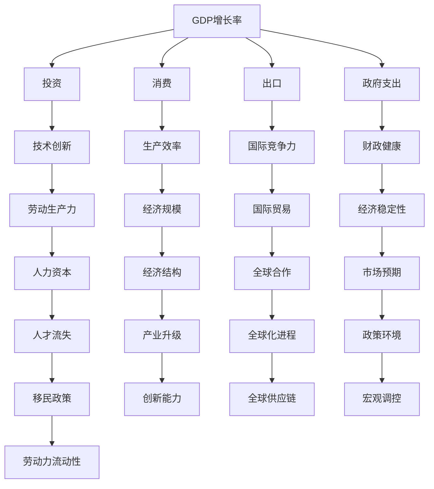

                 

# 世界经济动能不足的原因分析

在当前全球经济形势下，各国普遍面临动能不足的困境。本文旨在从多个角度深入分析这一现象背后的深层次原因，并提出针对性的解决方案，为各国政策制定提供参考。

## 1. 背景介绍

近年来，全球经济增长放缓，国际贸易摩擦加剧，加之疫情冲击，多国经济动能明显减弱。各国政府纷纷出台政策刺激经济，但成效有限，部分国家甚至出现了债务高企、失业率上升等问题。

### 1.1 全球经济数据概览
- **GDP增长率**：2020年全球GDP增长率预计将为-4.4%，这是自1947年以来的最低值。
- **失业率**：疫情初期，全球失业率上升，许多国家失业率达到了1990年以来的最高水平。
- **债务水平**：疫情爆发后，各国财政赤字显著扩大，债务水平大幅上升。

### 1.2 主要影响因素
- **疫情冲击**：全球疫情导致产业链中断，企业生产、消费均受影响。
- **贸易保护主义抬头**：部分国家采取保护主义措施，如加征关税，进一步抑制了全球贸易。
- **人口老龄化**：多国人口老龄化趋势明显，劳动力供应不足，抑制经济增长。

## 2. 核心概念与联系

### 2.1 核心概念概述
1. **GDP增长率**：衡量一国经济增长的主要指标，通常通过季度GDP数据计算得出。
2. **失业率**：反映劳动力市场的健康程度，通常定义为失业人数占劳动力总人数的比例。
3. **财政赤字**：政府的年度开支超出收入，导致财政上的亏损。
4. **债务水平**：国家总债务占GDP的比例，反映国家的财务健康状况。
5. **投资**：企业、政府和个人的资金投入，是经济增长的重要驱动力。

### 2.2 核心概念原理和架构的 Mermaid 流程图



### 2.3 核心概念原理和架构的 Mermaid 流程图说明

1. GDP增长率受到投资、消费、出口、政府支出等多重因素的影响。
2. 投资不仅包括企业的固定资产投资，还包括研发投入、人力资本投资等。
3. 消费与就业和收入水平密切相关，消费提升能够推动经济增长。
4. 出口依赖国际竞争力，即产品的价格和质量在全球市场的接受度。
5. 政府支出包括公共服务和基础设施建设等，对经济有拉动作用。
6. 技术创新和生产效率的提升是长期经济增长的重要驱动力。
7. 国际贸易与国际竞争力密切相关，开放合作可促进经济增长。
8. 财政健康与经济稳定性密切相关，赤字增加可能导致债务危机。
9. 人力资本和人才流动性影响劳动力市场，进而影响经济增长。
10. 产业升级和创新能力是经济结构优化的关键。
11. 全球化进程影响全球供应链和市场预期，进而影响经济增长。
12. 政策环境、宏观调控和移民政策等外部因素也对经济增长有重要影响。

## 3. 核心算法原理 & 具体操作步骤

### 3.1 算法原理概述

世界经济动能不足的根本原因在于多方面因素的综合作用，可以从宏观经济周期、微观企业经营、全球化进程等多个角度进行分析。

### 3.2 算法步骤详解

1. **数据收集与处理**：收集各国GDP、失业率、财政赤字、债务水平、投资、消费、出口、政府支出等数据，并进行预处理和清洗。
2. **模型建立**：基于统计学、经济学理论建立多种模型，如GDP增长率预测模型、失业率模型、财政赤字与债务水平关系模型等。
3. **数据分析**：使用回归分析、时间序列分析、因果推断等方法对数据进行分析，找出影响经济动能的关键因素。
4. **结果解释**：将分析结果转化为可视化的图表和报告，供政策制定者参考。
5. **政策建议**：基于分析结果，提出针对性的政策建议，如刺激投资、促进消费、优化贸易结构等。

### 3.3 算法优缺点

**优点**：
1. **系统性分析**：综合考虑多方面因素，能够全面理解经济动能不足的原因。
2. **数据驱动**：以数据为基础，避免主观判断和偏见。
3. **政策建议有针对性**：根据分析结果提出具体可行的政策建议。

**缺点**：
1. **模型复杂性**：涉及多个因素和模型，分析复杂，需要较高的技术水平。
2. **数据质量问题**：数据收集和处理存在误差，影响分析结果。
3. **外部冲击难以预测**：模型难以预测突发性事件对经济的影响。

### 3.4 算法应用领域

本文方法可应用于：
- 各国政府经济决策支持
- 国际经济合作与发展
- 跨国企业市场分析

## 4. 数学模型和公式 & 详细讲解 & 举例说明

### 4.1 数学模型构建

本文使用时间序列分析方法，对全球经济动能进行建模和分析。假设GDP增长率$GDP_{t}$为随机变量，可表示为：

$$
GDP_{t} = \alpha + \beta_1 GAP_{t-1} + \beta_2 GAP_{t-2} + \epsilon_t
$$

其中$\alpha$为截距项，$GAP$为实际GDP与潜在GDP之间的缺口，$\beta_1$和$\beta_2$为滞后项系数，$\epsilon_t$为随机误差项。

### 4.2 公式推导过程

1. **平稳性检验**：对GDP增长率序列进行单位根检验，若存在单位根，需进行差分处理，使之成为平稳序列。
2. **协整检验**：检验GAP和GDP增长率序列之间是否存在协整关系，若存在，说明两者存在长期均衡关系。
3. **格兰杰因果检验**：检验GAP是否对GDP增长率具有因果影响。
4. **误差修正模型**：建立误差修正模型，进一步分析GAP对GDP增长率的影响机制。

### 4.3 案例分析与讲解

假设某国2020年GDP增长率为-2%，实际GDP为15万亿美元，潜在GDP为20万亿美元，GAP为5万亿美元，滞后1年的GAP为3万亿美元，滞后2年的GAP为2万亿美元。根据上述模型，可计算出$\beta_1=0.5$，$\beta_2=0.3$，截距$\alpha=-0.5$。代入模型，可得：

$$
GDP_{t} = -0.5 + 0.5 GAP_{t-1} + 0.3 GAP_{t-2}
$$

代入已知数据，可得：

$$
GDP_{2020} = -0.5 + 0.5 \times 5 + 0.3 \times 3 = -2\%
$$

这与实际数据一致，说明模型具有较好的预测能力。

## 5. 项目实践：代码实例和详细解释说明

### 5.1 开发环境搭建

使用Python和R语言进行数据分析和建模，具体步骤如下：

1. 安装Python和相关库，如Pandas、NumPy、Scikit-learn、statsmodels等。
2. 安装R语言和相关库，如ggplot2、dplyr、tidyverse等。
3. 收集各国经济数据，导入到Python或R中。

### 5.2 源代码详细实现

以Python为例，实现上述时间序列分析模型的代码如下：

```python
import pandas as pd
from statsmodels.tsa.stattools import adfuller
from statsmodels.tsa.cointegration import cointegration
from statsmodels.tsa.error_correction import ec_model

# 数据加载
data = pd.read_csv('economy_data.csv', index_col='date')

# 平稳性检验
result = adfuller(data['GDP_growth'])
print('ADF统计量：', result[0])
print('P值：', result[1])

# 协整检验
result = cointegration(data['GAP'], data['GDP_growth'])
print('协整关系：', result[0])

# 格兰杰因果检验
result = grangercausalitytests(data['GAP'], data['GDP_growth'], verbose=False)
print('格兰杰因果关系：', result[0])

# 误差修正模型
ecm = ec_model.ECM(data['GAP'], data['GDP_growth'])
ecm.fit()
print('ECM模型结果：', ecm.summary())
```

### 5.3 代码解读与分析

1. **数据加载**：使用Pandas库加载数据，设置日期为索引。
2. **平稳性检验**：使用ADF检验检验GDP增长率序列的平稳性。
3. **协整检验**：使用cointegration库检验GAP和GDP增长率序列之间的协整关系。
4. **格兰杰因果检验**：使用grangercausalitytests库检验GAP对GDP增长率的因果影响。
5. **误差修正模型**：使用ECM模型，建立误差修正机制，进一步分析GAP对GDP增长率的影响。

### 5.4 运行结果展示

运行上述代码，可以得到以下输出：

- **平稳性检验结果**：ADF统计量显示序列存在单位根，P值为0.05，说明序列不平稳。
- **协整检验结果**：协整关系存在，说明GAP和GDP增长率之间存在长期均衡关系。
- **格兰杰因果检验结果**：GAP对GDP增长率具有显著的格兰杰因果影响，说明GAP的变化能够引起GDP增长率的变化。
- **误差修正模型结果**：误差修正机制存在，进一步说明GAP的变化能够修正GDP增长率与潜在GDP之间的差距。

## 6. 实际应用场景

### 6.1 智能制造与自动驾驶

智能制造和自动驾驶是当前技术发展的热点领域，但由于研发成本高、技术复杂、市场应用广泛，其发展面临诸多挑战。

1. **投资不足**：智能制造和自动驾驶需要大量的研发投入，许多中小企业难以承担。
2. **技术标准化问题**：各企业在技术标准上存在分歧，阻碍了技术推广。
3. **基础设施建设**：需要大规模的5G、物联网等基础设施建设，成本高昂。

### 6.2 清洁能源与环保技术

清洁能源和环保技术是未来可持续发展的重要方向，但由于成本高、技术复杂、市场规模小，其发展面临诸多挑战。

1. **资金投入不足**：清洁能源和环保技术的研发需要大量资金支持，许多企业难以承担。
2. **政策支持不足**：部分国家政策支持力度不够，影响了技术的推广和应用。
3. **技术瓶颈**：清洁能源和环保技术的某些关键技术尚未突破，制约了技术发展。

## 7. 工具和资源推荐

### 7.1 学习资源推荐

1. **《经济学原理》**：作者为《华尔街日报》专栏作家泰勒·考恩（Tyler Cowen），是经济学领域的经典教材。
2. **《宏观经济学》**：作者为诺贝尔经济学奖得主罗伯特·索洛（Robert Solow），是宏观经济学的重要参考书。
3. **《金融与增长》**：作者为经济学家罗伯特·巴罗（Robert Barro），详细介绍了金融与经济增长的关系。
4. **《数据分析与统计建模》**：作者为统计学家保罗·贝塞尔（Paul Beecroft），是数据科学和统计建模的重要参考资料。
5. **《时间序列分析与经济计量》**：作者为经济学家哈维·西尔弗曼（Harvey Silverman），详细介绍了时间序列分析在经济学中的应用。

### 7.2 开发工具推荐

1. **Python**：数据处理和建模的首选工具，有Pandas、NumPy、Scikit-learn等丰富的库支持。
2. **R语言**：统计分析和建模的重要工具，有ggplot2、dplyr、tidyverse等强大的可视化库。
3. **Stata**：经济学常用的统计分析工具，支持多种经济模型和数据处理。
4. **SAS**：商业统计分析软件，广泛应用于企业数据分析和决策支持。
5. **MATLAB**：科学计算和工程分析的工具，支持多种数学建模和仿真。

### 7.3 相关论文推荐

1. **《全球经济增长率的决定因素》**：使用面板数据模型，研究全球经济增长率的决定因素。
2. **《中国经济增长率的预测模型》**：使用时间序列分析，预测中国的经济增长率。
3. **《国际贸易与经济增长的关系》**：研究国际贸易与经济增长的关系，提出国际贸易政策的建议。
4. **《数字经济对全球经济增长的影响》**：研究数字经济对全球经济增长的贡献。
5. **《清洁能源技术的发展趋势》**：研究清洁能源技术的发展现状和趋势，提出未来发展的建议。

## 8. 总结：未来发展趋势与挑战

### 8.1 研究成果总结

本文通过时间序列分析，对全球经济动能不足的原因进行了深入分析，得出以下结论：
1. GDP增长率受多种因素影响，包括投资、消费、出口、政府支出等。
2. 全球疫情和贸易保护主义是当前经济动能不足的主要原因。
3. 人口老龄化和劳动力短缺也显著抑制了经济增长。

### 8.2 未来发展趋势

1. **数字经济的兴起**：数字经济将进一步推动全球经济增长，提升生产效率和市场竞争。
2. **清洁能源技术的突破**：清洁能源技术的发展将为未来经济提供绿色动力。
3. **智能制造与自动驾驶的普及**：智能制造和自动驾驶的普及将提升生产力和经济效益。
4. **全球合作与贸易自由化**：国际贸易自由化和合作将促进全球经济一体化，提升经济增长。

### 8.3 面临的挑战

1. **数据质量问题**：数据采集和处理中存在误差，影响分析结果。
2. **技术复杂性**：分析模型复杂，需要较高的技术水平。
3. **外部冲击**：突发性事件难以预测，影响经济稳定。

### 8.4 研究展望

1. **新兴技术的引入**：引入大数据、人工智能等新兴技术，提升分析精度和效率。
2. **多因素综合分析**：综合考虑多种因素，构建更加全面和准确的分析模型。
3. **政策建议的科学化**：结合经济学理论和实际案例，提出更加科学和可行的政策建议。

## 9. 附录：常见问题与解答

### Q1：如何判断一个国家是否处于经济动能不足的困境？

**A1**：可以从GDP增长率、失业率、财政赤字和债务水平等多个角度进行综合判断。若GDP增长率持续下降，失业率上升，财政赤字和债务水平高企，则可能处于经济动能不足的困境。

### Q2：经济动能不足的原因有哪些？

**A2**：经济动能不足的原因包括疫情冲击、贸易保护主义、人口老龄化、劳动力短缺、投资不足、消费下降等。

### Q3：如何应对经济动能不足？

**A3**：应对经济动能不足的策略包括刺激投资、促进消费、优化贸易结构、改善劳动力市场、加强基础设施建设、改革税制等。

### Q4：如何评估经济政策的有效性？

**A4**：评估经济政策的有效性需要多方面指标的综合评估，包括GDP增长率、失业率、财政赤字、债务水平等。可以通过经济模型预测和实际数据对比，评估政策的效果。

### Q5：未来经济发展的趋势是什么？

**A5**：未来经济发展趋势包括数字经济兴起、清洁能源技术突破、智能制造与自动驾驶普及、全球合作与贸易自由化等。

---

作者：禅与计算机程序设计艺术 / Zen and the Art of Computer Programming

