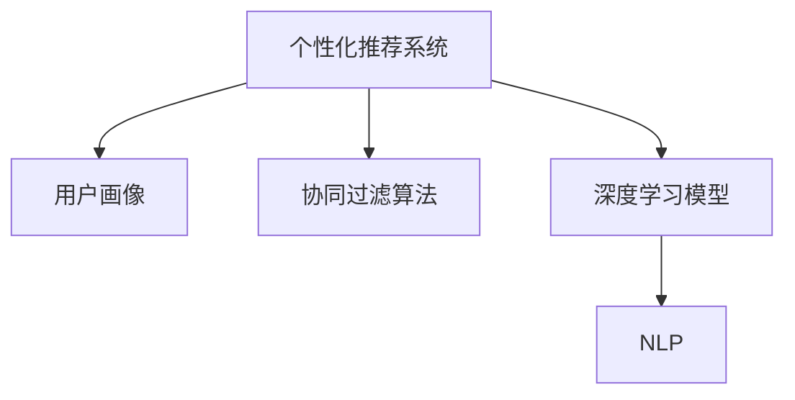

                 

## 1. 背景介绍

### 1.1 问题由来
在现代电商平台上，用户的购物体验和转化率往往取决于他们对产品的搜索和导购体验。然而，传统电商搜索的精准度往往有限，无法满足用户个性化需求。随着人工智能技术的发展，电商搜索导购系统开始引入个性化推荐算法，通过AI算法对用户的购物行为和偏好进行分析，提供更精准的搜索结果和个性化推荐，大大提升了用户的购物体验和转化率。

### 1.2 问题核心关键点
个性化推荐的核心关键点包括：
1. **用户画像构建**：通过对用户的历史行为、浏览记录、购买记录等数据进行分析，构建用户画像，识别用户的偏好和需求。
2. **搜索优化**：通过优化搜索算法，提升搜索结果的相关性和多样性，使用户能够快速找到满足需求的商品。
3. **推荐生成**：根据用户画像和搜索结果，生成个性化的商品推荐，提高用户的满意度和转化率。
4. **动态调整**：基于用户反馈和新数据，动态调整算法模型，提升推荐效果。

### 1.3 问题研究意义
个性化推荐在电商搜索导购中的应用，对于提升用户体验、增加平台收入、减少运营成本具有重要意义：
1. **提升用户体验**：通过个性化的搜索结果和推荐，用户能够更快找到满意的商品，增加购物的乐趣和满足感。
2. **增加平台收入**：个性化推荐能够提高用户购买转化率，增加销售额，提升平台的收入和市场竞争力。
3. **减少运营成本**：优化用户搜索体验，减少用户流失，降低平台的运营成本。
4. **驱动技术进步**：推动个性化推荐算法和电商搜索导购系统的技术创新，为未来电商搜索导购的智能化发展奠定基础。

## 2. 核心概念与联系

### 2.1 核心概念概述

为更好地理解个性化推荐在电商搜索导购中的应用，本节将介绍几个密切相关的核心概念：

- **个性化推荐系统**：基于用户画像和行为数据，为用户生成个性化的商品推荐。
- **用户画像**：通过分析用户的历史行为、兴趣、偏好等信息，构建用户的多维度特征表示。
- **协同过滤算法**：通过分析用户间的相似性，推荐用户可能感兴趣的商品。
- **深度学习模型**：如深度神经网络、协同矩阵分解等，用于从大规模数据中学习复杂的用户行为和商品特征。
- **自然语言处理(NLP)**：用于分析用户搜索查询的语义信息，提升搜索相关性。

这些核心概念之间的逻辑关系可以通过以下Mermaid流程图来展示：



这个流程图展示了个性化推荐系统的工作流程：

1. 个性化推荐系统以用户画像为基础。
2. 协同过滤算法和深度学习模型用于生成推荐。
3. NLP技术用于分析搜索查询。

这些概念共同构成了个性化推荐系统的核心，使得系统能够为用户生成定制化的搜索结果和推荐，提升购物体验。

## 3. 核心算法原理 & 具体操作步骤
### 3.1 算法原理概述

个性化推荐系统通常基于以下原理：

1. **用户画像构建**：通过分析用户的历史行为、兴趣、偏好等信息，构建用户的多维度特征表示。
2. **协同过滤算法**：基于用户行为数据，识别用户间的相似性，为用户生成推荐。
3. **深度学习模型**：利用深度神经网络、协同矩阵分解等技术，从大规模数据中学习复杂的用户行为和商品特征。
4. **自然语言处理(NLP)**：分析用户搜索查询的语义信息，提升搜索结果的相关性。

个性化推荐系统的工作流程可以概括为以下几个步骤：

1. **数据采集**：从电商平台的日志、用户行为数据中采集数据。
2. **数据预处理**：对数据进行清洗、归一化等预处理操作，去除噪声和冗余。
3. **用户画像构建**：使用协同过滤、深度学习等技术，构建用户的多维度特征表示。
4. **搜索优化**：使用NLP技术分析用户搜索查询的语义信息，提升搜索结果的相关性和多样性。
5. **推荐生成**：基于用户画像和搜索结果，使用协同过滤、深度学习等技术，生成个性化的商品推荐。
6. **动态调整**：基于用户反馈和新数据，动态调整算法模型，提升推荐效果。

### 3.2 算法步骤详解

以下是个性化推荐系统的工作流程详细步骤：

**Step 1: 数据采集**
- 从电商平台的日志、用户行为数据中采集数据。
- 数据包括用户ID、商品ID、浏览时间、点击次数、购买记录等。

**Step 2: 数据预处理**
- 对数据进行清洗、归一化等预处理操作，去除噪声和冗余。
- 使用数据平衡技术，处理数据不均衡问题。

**Step 3: 用户画像构建**
- 使用协同过滤算法（如基于用户的协同过滤、基于物品的协同过滤），构建用户的多维度特征表示。
- 使用深度学习模型（如基于CTR的深度学习模型、基于注意力机制的推荐模型），进一步优化用户画像。
- 通过自然语言处理(NLP)技术，分析用户搜索查询的语义信息，提升搜索相关性。

**Step 4: 搜索优化**
- 使用NLP技术分析用户搜索查询的语义信息，构建搜索向量。
- 使用向量空间模型、TF-IDF等技术，计算搜索结果与查询的相似度。
- 对搜索结果进行排序，选择相关性和多样性高的商品。

**Step 5: 推荐生成**
- 使用协同过滤算法（如基于用户的协同过滤、基于物品的协同过滤），生成个性化的商品推荐。
- 使用深度学习模型（如基于CTR的深度学习模型、基于注意力机制的推荐模型），进一步优化推荐结果。

**Step 6: 动态调整**
- 根据用户反馈和新数据，动态调整算法模型。
- 使用在线学习、增量学习等技术，提升推荐效果。

### 3.3 算法优缺点

个性化推荐系统的优点包括：
1. **提升用户体验**：通过个性化的搜索结果和推荐，用户能够更快找到满意的商品，增加购物的乐趣和满足感。
2. **增加平台收入**：个性化推荐能够提高用户购买转化率，增加销售额，提升平台的收入和市场竞争力。
3. **减少运营成本**：优化用户搜索体验，减少用户流失，降低平台的运营成本。
4. **技术创新**：推动个性化推荐算法和电商搜索导购系统的技术创新，为未来电商搜索导购的智能化发展奠定基础。

个性化推荐系统也存在一些局限性：
1. **冷启动问题**：对于新用户或新商品，系统难以生成准确的推荐。
2. **数据隐私**：用户行为数据的收集和使用可能引发隐私保护问题。
3. **过度推荐**：推荐过度可能导致用户疲劳和心理负担。
4. **模型复杂度**：深度学习模型和高阶协同过滤算法可能带来计算复杂度和内存消耗高的问题。

尽管存在这些局限性，但就目前而言，个性化推荐系统仍是在线电商平台上应用最广泛和最有效的方式之一。未来相关研究的重点在于如何进一步降低冷启动问题，保护用户隐私，提高推荐效率和效果，同时兼顾可解释性和伦理安全性等因素。

### 3.4 算法应用领域

个性化推荐在电商搜索导购中的应用非常广泛，涵盖了几乎所有电商平台的购物场景，例如：

- 商品推荐：根据用户的历史行为和兴趣，为用户推荐可能感兴趣的商品。
- 搜索优化：提升用户搜索查询的相关性和多样性，使用户能够快速找到满足需求的商品。
- 广告定向：根据用户画像和行为数据，生成个性化的广告推荐。
- 价格优化：基于用户行为数据，动态调整商品价格，提高销售转化率。
- 库存管理：预测商品需求，优化库存管理，减少缺货和库存积压。

除了上述这些经典应用外，个性化推荐还被创新性地应用于更多场景中，如用户留存、跨平台推荐、个性化营销等，为电商平台的运营带来了新的突破。

## 4. 数学模型和公式 & 详细讲解  
### 4.1 数学模型构建

本节将使用数学语言对个性化推荐系统的工作原理进行更加严格的刻画。

记用户画像为 $\mathbf{u} \in \mathbb{R}^n$，商品特征为 $\mathbf{i} \in \mathbb{R}^m$，用户行为矩阵为 $Y \in \mathbb{R}^{N \times M}$，其中 $N$ 为商品数，$M$ 为用户数。假设 $Y_{ui}$ 表示用户 $u$ 对商品 $i$ 的评分或行为（例如点击次数、购买次数等）。

定义个性化推荐系统的目标为最大化用户满意度，即最大化用户对推荐商品的评分。假设用户对商品 $i$ 的评分为 $r_{ui}$，则推荐目标可以表示为：

$$
\max_{\mathbf{u},\mathbf{i},\boldsymbol{\theta}} \sum_{u=1}^M \sum_{i=1}^N r_{ui} \mathbb{P}(r_{ui} \mid \mathbf{u},\mathbf{i},\boldsymbol{\theta})
$$

其中 $\boldsymbol{\theta}$ 为模型的参数，$\mathbb{P}(r_{ui} \mid \mathbf{u},\mathbf{i},\boldsymbol{\theta})$ 为条件概率模型，用于预测用户对商品 $i$ 的评分。

### 4.2 公式推导过程

以下我们以基于深度学习的协同过滤模型为例，推导推荐目标函数及其梯度的计算公式。

假设用户画像 $\mathbf{u}$ 和商品特征 $\mathbf{i}$ 通过深度神经网络进行映射，得到隐层表示 $\mathbf{h}_u \in \mathbb{R}^d$ 和 $\mathbf{h}_i \in \mathbb{R}^d$，其中 $d$ 为隐层维度。则用户对商品 $i$ 的评分预测函数可以表示为：

$$
\mathbb{P}(r_{ui} \mid \mathbf{u},\mathbf{i},\boldsymbol{\theta}) = \sigma\left(\mathbf{h}_u^T \mathbf{W} \mathbf{h}_i + b\right)
$$

其中 $\sigma(\cdot)$ 为 sigmoid 函数，$\mathbf{W} \in \mathbb{R}^{d \times d}$ 为权重矩阵，$b \in \mathbb{R}$ 为偏置项。

将评分预测函数代入推荐目标函数，得：

$$
\max_{\mathbf{u},\mathbf{i},\boldsymbol{\theta}} \sum_{u=1}^M \sum_{i=1}^N r_{ui} \sigma\left(\mathbf{h}_u^T \mathbf{W} \mathbf{h}_i + b\right)
$$

为了优化上述目标函数，可以引入交叉熵损失函数，对每个用户-商品对的评分进行预测。损失函数可以表示为：

$$
L(\boldsymbol{\theta}) = -\frac{1}{M \times N} \sum_{u=1}^M \sum_{i=1}^N r_{ui} \log \mathbb{P}(r_{ui} \mid \mathbf{u},\mathbf{i},\boldsymbol{\theta})
$$

将评分预测函数和损失函数代入目标函数，得到最终的目标函数为：

$$
\max_{\mathbf{u},\mathbf{i},\boldsymbol{\theta}} L(\boldsymbol{\theta}) + \lambda ||\mathbf{W}||^2_F
$$

其中 $||\mathbf{W}||^2_F$ 为正则项，$\lambda$ 为正则化系数。

通过梯度下降等优化算法，最小化损失函数，更新模型参数 $\boldsymbol{\theta}$，使得推荐系统输出的评分最大化，从而提升用户体验和平台收入。

## 5. 项目实践：代码实例和详细解释说明
### 5.1 开发环境搭建

在进行个性化推荐系统开发前，我们需要准备好开发环境。以下是使用Python进行TensorFlow开发的环境配置流程：

1. 安装Anaconda：从官网下载并安装Anaconda，用于创建独立的Python环境。

2. 创建并激活虚拟环境：
```bash
conda create -n tf-env python=3.8 
conda activate tf-env
```

3. 安装TensorFlow：根据CUDA版本，从官网获取对应的安装命令。例如：
```bash
pip install tensorflow==2.7
```

4. 安装TensorBoard：用于可视化训练过程和模型效果。
```bash
pip install tensorflow-estimator
```

5. 安装Pandas、Numpy等工具包：
```bash
pip install pandas numpy
```

完成上述步骤后，即可在`tf-env`环境中开始个性化推荐系统的开发。

### 5.2 源代码详细实现

下面我们以电商搜索推荐系统为例，给出使用TensorFlow进行个性化推荐开发的代码实现。

首先，定义推荐系统的数据处理函数：

```python
import tensorflow as tf
import pandas as pd
import numpy as np

def preprocess_data(data_path):
    # 读取用户行为数据
    data = pd.read_csv(data_path, index_col='user_id')
    
    # 处理缺失值
    data = data.fillna(0)
    
    # 划分训练集和测试集
    train_data = data[data['timestamp'] < 2021-01-01]
    test_data = data[data['timestamp'] >= 2021-01-01]
    
    # 将用户行为数据转换为稀疏矩阵
    train_data = train_data.to_sparse(index='user_id', columns='item_id')
    test_data = test_data.to_sparse(index='user_id', columns='item_id')
    
    # 将用户行为矩阵转换为numpy数组
    train_data = train_data.toarray()
    test_data = test_data.toarray()
    
    return train_data, test_data
```

然后，定义推荐模型的函数：

```python
def build_model(input_shape, hidden_size, num_classes):
    # 定义输入层
    inputs = tf.keras.Input(shape=input_shape)
    
    # 定义编码层
    x = tf.keras.layers.Dense(hidden_size, activation='relu')(inputs)
    
    # 定义预测层
    x = tf.keras.layers.Dense(num_classes, activation='sigmoid')(x)
    
    # 定义输出层
    outputs = tf.keras.layers.Lambda(lambda x: x)(x)
    
    return tf.keras.Model(inputs=inputs, outputs=outputs)
```

接着，定义训练和评估函数：

```python
def compile_model(model, optimizer, loss_fn, metrics):
    model.compile(optimizer=optimizer, loss=loss_fn, metrics=metrics)
    
def train_model(model, train_data, batch_size, epochs):
    # 划分训练集和验证集
    train_dataset = tf.data.Dataset.from_tensor_slices(train_data)
    train_dataset = train_dataset.shuffle(buffer_size=1000).batch(batch_size)
    
    # 训练模型
    history = model.fit(train_dataset, epochs=epochs, validation_steps=10)
    
    return history
```

最后，启动训练流程并在测试集上评估：

```python
# 设置超参数
hidden_size = 64
num_classes = 1
batch_size = 32
epochs = 10

# 加载数据
train_data, test_data = preprocess_data('data.csv')

# 构建模型
model = build_model(input_shape=(1,), hidden_size=hidden_size, num_classes=num_classes)

# 编译模型
optimizer = tf.keras.optimizers.Adam(learning_rate=0.001)
loss_fn = tf.keras.losses.BinaryCrossentropy()
metrics = [tf.keras.metrics.BinaryAccuracy()]

compile_model(model, optimizer, loss_fn, metrics)

# 训练模型
history = train_model(model, train_data, batch_size=batch_size, epochs=epochs)

# 评估模型
test_data = test_data.toarray()
predictions = model.predict(test_data)
```

以上就是使用TensorFlow对电商搜索推荐系统进行个性化推荐的完整代码实现。可以看到，借助TensorFlow的强大封装，我们可以用相对简洁的代码完成模型的构建、训练和评估。

### 5.3 代码解读与分析

让我们再详细解读一下关键代码的实现细节：

**preprocess_data函数**：
- 读取用户行为数据
- 处理缺失值
- 划分训练集和测试集
- 将用户行为数据转换为稀疏矩阵
- 将用户行为矩阵转换为numpy数组

**build_model函数**：
- 定义输入层
- 定义编码层
- 定义预测层
- 定义输出层

**compile_model函数**：
- 编译模型
- 定义优化器、损失函数和评估指标

**train_model函数**：
- 划分训练集和验证集
- 构建训练集数据集
- 训练模型
- 返回训练历史

**训练流程**：
- 设置超参数
- 加载数据
- 构建模型
- 编译模型
- 训练模型
- 评估模型

可以看到，TensorFlow使得个性化推荐系统的开发变得简洁高效。开发者可以将更多精力放在数据处理、模型改进等高层逻辑上，而不必过多关注底层的实现细节。

当然，工业级的系统实现还需考虑更多因素，如模型的保存和部署、超参数的自动搜索、更灵活的推荐算法等。但核心的个性化推荐范式基本与此类似。

## 6. 实际应用场景
### 6.1 智能客服系统

基于个性化推荐技术，电商平台的智能客服系统可以实现更加智能化的服务。智能客服可以通过分析用户的历史行为和搜索记录，识别用户的常见问题和需求，自动提供针对性的回复和解决方案，大大提升客服效率和用户满意度。

在技术实现上，可以收集用户的历史搜索记录和对话内容，将其作为监督数据，对预训练的推荐模型进行微调。微调后的模型能够自动理解用户意图，匹配最合适的答案模板进行回复。对于用户提出的新问题，还可以接入检索系统实时搜索相关内容，动态组织生成回答。如此构建的智能客服系统，能大幅提升客户咨询体验和问题解决效率。

### 6.2 金融舆情监测

金融机构需要实时监测市场舆论动向，以便及时应对负面信息传播，规避金融风险。传统的人工监测方式成本高、效率低，难以应对网络时代海量信息爆发的挑战。基于个性化推荐技术，金融舆情监测系统可以自动识别新闻、报道、评论等文本中的舆情信息，生成及时的风险预警。

具体而言，可以收集金融领域相关的新闻、报道、评论等文本数据，并对其进行主题标注和情感标注。在此基础上对预训练推荐模型进行微调，使其能够自动判断文本属于何种主题，情感倾向是正面、中性还是负面。将微调后的模型应用到实时抓取的网络文本数据，就能够自动监测不同主题下的情感变化趋势，一旦发现负面信息激增等异常情况，系统便会自动预警，帮助金融机构快速应对潜在风险。

### 6.3 个性化推荐系统

基于个性化推荐技术，电商平台可以实现高度个性化的商品推荐。推荐系统可以分析用户的历史行为和搜索记录，识别用户的兴趣和需求，生成高度个性化的商品推荐，提升用户的购物体验和购买转化率。

在技术实现上，可以收集用户的历史浏览、点击、购买记录，提取和商品相关联的文本信息，如商品描述、用户评价等。将文本信息作为模型输入，用户的后续行为（如是否点击、购买等）作为监督信号，在此基础上微调预训练模型。微调后的模型能够从文本信息中准确把握用户的兴趣点，在生成推荐列表时，先用候选物品的文本描述作为输入，由模型预测用户的兴趣匹配度，再结合其他特征综合排序，便可以得到高度个性化的推荐结果。

### 6.4 未来应用展望

随着个性化推荐算法和电商搜索导购系统的不断发展，未来在更多领域将迎来新的突破：

- **医疗健康**：个性化推荐技术可以应用于医疗咨询、健康管理等领域，根据用户的健康数据和历史行为，生成个性化的健康建议和治疗方案，提升用户健康管理水平。
- **教育培训**：个性化推荐可以应用于在线教育、在线培训等场景，根据学生的学习行为和成绩，生成个性化的课程推荐和学习路径，提升学习效果。
- **旅游出行**：个性化推荐可以应用于旅游推荐、酒店预订等领域，根据用户的出行历史和偏好，生成个性化的旅游推荐和行程安排，提升出行体验。
- **智慧城市**：个性化推荐可以应用于城市交通、公共服务等场景，根据用户的行为数据，生成个性化的交通路线和公共服务推荐，提升城市管理水平。
- **智能家居**：个性化推荐可以应用于智能家居系统，根据用户的家居行为和生活习惯，生成个性化的家居控制和推荐，提升生活质量。

总之，个性化推荐技术将在更多领域得到应用，为各行各业带来变革性影响。未来，伴随个性化推荐算法和电商搜索导购系统的持续演进，相信NLP技术将在更广阔的应用领域大放异彩，深刻影响人类的生产生活方式。

## 7. 工具和资源推荐
### 7.1 学习资源推荐

为了帮助开发者系统掌握个性化推荐在电商搜索导购中的应用，这里推荐一些优质的学习资源：

1. **《深度学习》课程**：斯坦福大学开设的深度学习课程，深入浅出地介绍了深度学习的基本概念和前沿技术。
2. **《推荐系统实践》书籍**：介绍推荐系统的设计、实现和优化，包括协同过滤、深度学习等主流算法。
3. **《自然语言处理》课程**：斯坦福大学开设的NLP课程，涵盖了NLP的基本概念和最新进展，包括文本表示、情感分析等。
4. **Kaggle竞赛**：Kaggle上多个推荐系统相关的竞赛，提供了大量真实数据和解决方案，适合实践和交流。
5. **GitHub代码库**：GitHub上多个推荐系统的代码实现，提供了丰富的开源资源和经验分享。

通过对这些资源的学习实践，相信你一定能够快速掌握个性化推荐在电商搜索导购中的应用，并用于解决实际的NLP问题。

### 7.2 开发工具推荐

高效的开发离不开优秀的工具支持。以下是几款用于个性化推荐系统开发的常用工具：

1. **TensorFlow**：谷歌开发的深度学习框架，提供了丰富的模型和算法库，支持分布式训练和部署。
2. **PyTorch**：Facebook开发的深度学习框架，提供了灵活的动态计算图和自动微分功能，适合研究型开发。
3. **TensorBoard**：谷歌开发的可视化工具，实时监测训练过程和模型效果，帮助调试和优化模型。
4. **Pandas**：Python的数据分析库，提供了丰富的数据处理和分析功能，适合数据预处理和可视化。
5. **Scikit-learn**：Python的机器学习库，提供了多种经典的算法实现，适合快速原型开发。
6. **Jupyter Notebook**：交互式的Python开发环境，支持代码块的复用和版本控制，适合研究和实验。

合理利用这些工具，可以显著提升个性化推荐系统的开发效率，加快创新迭代的步伐。

### 7.3 相关论文推荐

个性化推荐在电商搜索导购中的应用源于学界的持续研究。以下是几篇奠基性的相关论文，推荐阅读：

1. **《推荐系统》**：Jian Qin等人，介绍了推荐系统的基本概念、算法和应用。
2. **《协同过滤推荐系统》**：Beng Hong Loke等人，介绍了基于协同过滤的推荐算法和优化方法。
3. **《深度学习在推荐系统中的应用》**：Jiawei Han等人，介绍了深度学习在推荐系统中的应用和优势。
4. **《个性化推荐系统》**：Zhou Luo等人，介绍了个性化推荐系统的设计、实现和优化。
5. **《NLP在推荐系统中的应用》**：Yuxin Wu等人，介绍了NLP技术在推荐系统中的应用和前景。

这些论文代表了个性化推荐技术的发展脉络。通过学习这些前沿成果，可以帮助研究者把握学科前进方向，激发更多的创新灵感。

## 8. 总结：未来发展趋势与挑战
### 8.1 总结

本文对基于个性化推荐的电商搜索导购系统进行了全面系统的介绍。首先阐述了个性化推荐在电商搜索导购中的研究背景和意义，明确了个性化推荐在提升用户体验、增加平台收入、减少运营成本等方面的重要价值。其次，从原理到实践，详细讲解了个性化推荐系统的数学模型和算法流程，给出了电商搜索推荐系统的完整代码实现。同时，本文还探讨了个性化推荐技术在智能客服、金融舆情、个性化推荐等多个领域的应用前景，展示了个性化推荐技术的巨大潜力。此外，本文精选了推荐系统的学习资源，力求为读者提供全方位的技术指引。

通过本文的系统梳理，可以看到，基于个性化推荐的电商搜索导购系统正在成为电商平台上应用最广泛和最有效的方式之一。个性化推荐能够为用户生成定制化的搜索结果和推荐，提升购物体验和购买转化率，具有重要的实际应用价值。未来，伴随个性化推荐算法和电商搜索导购系统的持续演进，相信NLP技术将在更广阔的应用领域大放异彩，深刻影响人类的生产生活方式。

### 8.2 未来发展趋势

展望未来，个性化推荐技术将在更多领域得到应用，为各行各业带来变革性影响：

1. **数据规模持续增大**：随着技术的发展，推荐系统将能够处理更大规模的数据，提升推荐精度和效率。
2. **算法模型更加多样化**：除了传统的协同过滤、深度学习等算法，未来的推荐系统将融合更多元化的算法模型，如强化学习、图神经网络等。
3. **实时性进一步提升**：通过分布式计算和流处理技术，推荐系统将能够实现更快速的实时推荐，提升用户体验。
4. **跨领域推荐系统**：未来的推荐系统将能够实现跨领域、跨模态的推荐，涵盖更多维度的用户行为和商品特征。
5. **伦理与安全**：未来的推荐系统将更加注重用户隐私保护和推荐公平性，避免算法偏见和滥用。

这些趋势凸显了个性化推荐技术的广阔前景。这些方向的探索发展，必将进一步提升推荐系统的性能和应用范围，为人类生产生活方式带来新的变革。

### 8.3 面临的挑战

尽管个性化推荐技术已经取得了显著成效，但在迈向更加智能化、普适化应用的过程中，它仍面临诸多挑战：

1. **冷启动问题**：对于新用户或新商品，系统难以生成准确的推荐。
2. **数据隐私**：用户行为数据的收集和使用可能引发隐私保护问题。
3. **推荐效果**：推荐系统需要高效地处理大规模数据，并实时更新推荐结果，这对系统性能和计算资源提出了更高要求。
4. **模型复杂度**：深度学习模型和高阶协同过滤算法可能带来计算复杂度和内存消耗高的问题。
5. **伦理与安全**：推荐系统需要避免算法偏见和滥用，确保推荐结果的公平性和安全性。

尽管存在这些挑战，但随着学界和产业界的共同努力，这些问题终将一一被克服，个性化推荐技术必将在构建人机协同的智能时代中扮演越来越重要的角色。

### 8.4 研究展望

面对个性化推荐技术面临的诸多挑战，未来的研究需要在以下几个方面寻求新的突破：

1. **跨领域推荐系统**：实现跨领域、跨模态的推荐，涵盖更多维度的用户行为和商品特征。
2. **实时推荐系统**：通过分布式计算和流处理技术，实现更快速的实时推荐，提升用户体验。
3. **深度学习与传统算法融合**：将深度学习与传统协同过滤等算法融合，提升推荐效果和效率。
4. **用户隐私保护**：采用差分隐私、联邦学习等技术，保护用户隐私，避免数据滥用。
5. **伦理与安全**：注重算法公平性和安全性，避免推荐偏见和滥用，确保推荐结果的公正性和透明性。

这些研究方向的探索，必将引领个性化推荐技术迈向更高的台阶，为构建安全、可靠、可解释、可控的智能系统铺平道路。面向未来，个性化推荐技术还需要与其他人工智能技术进行更深入的融合，如知识表示、因果推理、强化学习等，多路径协同发力，共同推动推荐系统的智能化发展。

## 9. 附录：常见问题与解答

**Q1：个性化推荐系统是否适用于所有电商场景？**

A: 个性化推荐系统在大多数电商场景中都能取得不错的效果，但对于一些特殊场景，如在线教育、金融理财等，仅仅依靠用户行为数据可能难以完全理解用户需求，此时需要结合其他因素进行推荐。

**Q2：如何缓解个性化推荐系统中的冷启动问题？**

A: 缓解冷启动问题的方法包括：
1. 使用生成模型（如基于变分自编码器VAE）生成用户初始画像。
2. 使用协同过滤算法进行推荐，结合用户行为数据和新商品特征进行推荐。
3. 采用多臂老虎机算法（Multi-Armed Bandit）等在线学习算法，动态调整推荐策略。

**Q3：推荐系统中的数据隐私问题如何解决？**

A: 解决推荐系统中的数据隐私问题的方法包括：
1. 采用差分隐私技术，对用户数据进行加密和噪声化处理，保护用户隐私。
2. 采用联邦学习技术，在分布式环境中对模型进行训练，减少数据泄露风险。
3. 采用多方安全计算（MPC）技术，在不泄露数据的情况下进行模型训练和推理。

**Q4：推荐系统中的推荐效果如何提升？**

A: 提升推荐系统效果的方法包括：
1. 使用深度学习模型，如基于CTR的深度学习模型、基于注意力机制的推荐模型，提升推荐精度。
2. 采用多任务学习（MTL）技术，同时优化多个任务，提高模型泛化能力。
3. 结合自然语言处理（NLP）技术，分析用户搜索查询的语义信息，提升搜索结果的相关性和多样性。

**Q5：推荐系统中的模型复杂度如何优化？**

A: 优化推荐系统模型复杂度的方法包括：
1. 采用模型压缩和剪枝技术，减少模型参数和计算量。
2. 使用分布式计算和流处理技术，提升系统性能和扩展性。
3. 采用增量学习和在线学习技术，减少模型更新频率和计算成本。

这些方法可以帮助推荐系统在保证效果的同时，优化模型复杂度和计算效率。

---

作者：禅与计算机程序设计艺术 / Zen and the Art of Computer Programming

