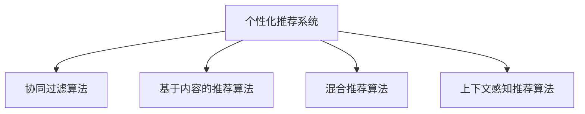

                 

# 个性化知识订阅要不断优化推荐算法

在信息爆炸的时代，获取有价值知识变得愈发困难。传统的新闻订阅和知识搜索已无法满足人们对个性化、实时性的需求。个性化知识订阅系统应运而生，通过推荐算法为用户推荐最相关的知识内容，显著提升了知识获取的效率和质量。然而，如何高效、准确地构建和优化推荐算法，成为个性化知识订阅系统的核心挑战。本文将从算法原理、具体操作步骤、实际应用场景等多个角度，探讨个性化知识订阅推荐算法的优化方法。

## 1. 背景介绍

### 1.1 问题由来
随着移动互联网和社交媒体的普及，用户每天面临海量的信息输入，传统基于网页、报纸的新闻和书籍已难以满足用户对信息多样性和个性化深度学习的需求。个性化知识订阅系统应运而生，通过推荐算法为用户筛选出最适合的知识内容。该系统能够根据用户的历史行为、兴趣爱好、社会关系等多样化的数据，预测用户可能感兴趣的知识，并通过订阅服务推送到用户面前，极大地提高了信息获取的效率和准确性。

然而，随着用户群体规模的不断扩大，个性化知识订阅系统的推荐算法面临着更多挑战：
- 用户兴趣动态变化，推荐算法如何适应用户兴趣的变化？
- 推荐结果多样性不足，如何提升推荐结果的多样性？
- 推荐结果的时效性问题，如何实时更新推荐内容？
- 推荐结果的个性化程度，如何更好地理解和满足用户个性化需求？
- 推荐结果的透明性，如何提升推荐算法的透明性，增强用户信任？

### 1.2 问题核心关键点
个性化知识订阅推荐算法的核心在于：
- 用户兴趣建模：通过用户行为数据学习用户兴趣模型，准确预测用户对不同内容的偏好。
- 推荐结果排序：综合考虑多样性、相关性、新鲜性等指标，对推荐结果进行排序，提升用户满意度。
- 推荐模型优化：不断优化推荐模型，以适应用户兴趣的动态变化和数据的多样性。

这些核心关键点共同构成个性化知识订阅系统的基础，通过优化算法，可以大大提升系统的推荐效果。

## 2. 核心概念与联系

### 2.1 核心概念概述

为更好地理解个性化知识订阅推荐算法，本节将介绍几个密切相关的核心概念：

- 个性化推荐系统：通过分析用户行为数据，预测用户对不同内容的偏好，从而实现个性化推荐的服务系统。
- 协同过滤算法：基于用户和物品之间的相似性，通过历史行为数据预测用户对新物品的评分。
- 基于内容的推荐算法：根据物品的属性特征，预测用户对物品的偏好。
- 混合推荐算法：将协同过滤和基于内容的算法进行融合，提升推荐结果的准确性和多样性。
- 上下文感知推荐算法：考虑用户行为上下文，提升推荐结果的相关性。

这些核心概念之间的逻辑关系可以通过以下Mermaid流程图来展示：



这个流程图展示了个性化推荐系统的核心概念及其之间的关系：

1. 个性化推荐系统：最终的目标，通过推荐算法实现个性化服务。
2. 协同过滤算法和基于内容的推荐算法：常用的两种推荐算法，分别从用户和物品的角度进行推荐。
3. 混合推荐算法：结合两种算法的优点，提升推荐效果。
4. 上下文感知推荐算法：考虑用户行为上下文，进一步提升推荐相关性。

这些概念共同构成了个性化知识订阅系统的理论基础，帮助实现个性化推荐服务。

## 3. 核心算法原理 & 具体操作步骤

### 3.1 算法原理概述

个性化知识订阅推荐算法的核心是构建用户兴趣模型，并利用该模型预测用户对不同知识的偏好。其基本思路如下：

1. **用户兴趣建模**：通过分析用户的历史行为数据，学习用户对不同知识内容的兴趣度。可以使用协同过滤算法、基于内容的推荐算法等方法。
2. **推荐结果排序**：综合考虑推荐结果的多样性、相关性、新鲜性等指标，对推荐结果进行排序。
3. **推荐模型优化**：不断优化推荐模型，以适应用户兴趣的动态变化和数据的多样性。

形式化地，假设推荐系统有 $N$ 个用户 $U=\{u_1, u_2, ..., u_N\}$，$M$ 个知识内容 $I=\{i_1, i_2, ..., i_M\}$。用户 $u_n$ 对知识内容 $i_m$ 的评分记为 $r_{u_n}^{i_m}$，记推荐结果集合为 $S$。推荐算法的目标是在所有可能的知识内容中，选出最符合用户兴趣的 $K$ 个内容进行推荐。推荐过程可以分为以下几个步骤：

1. 用户兴趣建模：
$$
\hat{r}_{u_n}^{i_m} = f(\phi(u_n), \phi(i_m))
$$
其中 $f$ 为用户兴趣和物品属性之间的关系函数，$\phi$ 为特征提取函数。

2. 推荐结果排序：
$$
R(u_n, S) = \text{sort}\left\{\hat{r}_{u_n}^{i_m} \mid i_m \in I\right\}
$$
其中 $\text{sort}$ 为推荐结果排序函数，$K$ 为推荐结果个数。

3. 推荐模型优化：
$$
\theta \leftarrow \mathop{\arg\min}_{\theta} \mathcal{L}(S, R(u_n, S))
$$
其中 $\theta$ 为模型参数，$\mathcal{L}$ 为推荐误差函数。

### 3.2 算法步骤详解

个性化知识订阅推荐算法的主要步骤包括：

**Step 1: 用户兴趣建模**
- 收集用户的历史行为数据，如点击、浏览、收藏等。
- 对行为数据进行预处理，提取特征向量，如时间戳、内容ID、类别等。
- 使用协同过滤、基于内容的推荐算法等方法，建立用户兴趣模型。

**Step 2: 推荐结果排序**
- 计算用户对每个知识内容的预测评分。
- 利用排序算法，如Top-k排序，将预测评分排序，选出排名前 $K$ 的内容。

**Step 3: 推荐模型优化**
- 定义推荐误差函数，如均方误差、交叉熵等，评估推荐结果与用户实际行为的一致性。
- 使用优化算法，如梯度下降、Adam等，最小化推荐误差函数，更新模型参数。

**Step 4: 推荐结果展示**
- 将推荐结果展示给用户，并提供反馈渠道，用于调整推荐模型。

**Step 5: 反馈调整**
- 收集用户对推荐结果的反馈，如点击、跳过等行为。
- 使用机器学习算法，如增量学习，更新推荐模型，以更好地适应用户兴趣的变化。

### 3.3 算法优缺点

个性化知识订阅推荐算法具有以下优点：
1. 提升信息获取效率：通过推荐算法，用户可以快速获得最相关的知识内容。
2. 增强个性化体验：推荐算法能够根据用户历史行为，预测其兴趣，提供更个性化的服务。
3. 提升用户满意度：推荐算法能够显著提升用户对推荐内容的满意度。

同时，该算法也存在以下缺点：
1. 依赖用户行为数据：推荐算法的效果很大程度上依赖于用户行为数据的数量和质量。
2. 存在冷启动问题：新用户或新知识内容在系统中没有行为数据时，推荐效果较差。
3. 容易产生偏见：推荐算法可能因历史数据中的偏见，导致推荐结果存在偏差。
4. 推荐结果多样性不足：推荐算法可能趋向于推荐相似内容，导致多样性不足。

### 3.4 算法应用领域

个性化知识订阅推荐算法已经在多个领域得到广泛应用，例如：

- 在线教育：根据用户学习行为，推荐相关课程和资料。
- 智能图书：根据用户阅读历史，推荐新书和书籍章节。
- 新闻聚合：根据用户浏览历史，推荐相关新闻和文章。
- 金融资讯：根据用户投资行为，推荐相关金融知识和资讯。
- 知识问答：根据用户提问历史，推荐相关问题和知识内容。

## 4. 数学模型和公式 & 详细讲解 & 举例说明

### 4.1 数学模型构建

本节将使用数学语言对个性化知识订阅推荐算法进行更加严格的刻画。

假设推荐系统有 $N$ 个用户 $U=\{u_1, u_2, ..., u_N\}$，$M$ 个知识内容 $I=\{i_1, i_2, ..., i_M\}$。用户 $u_n$ 对知识内容 $i_m$ 的评分记为 $r_{u_n}^{i_m}$。推荐结果集合为 $S$，推荐结果 $i_m$ 的预测评分记为 $\hat{r}_{u_n}^{i_m}$，推荐结果排序为 $R(u_n, S)$。

定义推荐误差函数为均方误差损失：
$$
\mathcal{L}(S, R(u_n, S)) = \frac{1}{N} \sum_{n=1}^N \sum_{m=1}^M (r_{u_n}^{i_m} - \hat{r}_{u_n}^{i_m})^2
$$

推荐算法的目标是最小化推荐误差函数，即找到最优模型参数 $\theta$：
$$
\theta^* = \mathop{\arg\min}_{\theta} \mathcal{L}(S, R(u_n, S))
$$

在实践中，我们通常使用基于梯度的优化算法（如SGD、Adam等）来近似求解上述最优化问题。设 $\eta$ 为学习率，则参数的更新公式为：
$$
\theta \leftarrow \theta - \eta \nabla_{\theta}\mathcal{L}(S, R(u_n, S))
$$

其中 $\nabla_{\theta}\mathcal{L}(S, R(u_n, S))$ 为推荐误差函数对模型参数 $\theta$ 的梯度，可通过反向传播算法高效计算。

### 4.2 公式推导过程

以下我们以协同过滤推荐算法为例，推导预测评分和推荐结果排序的计算公式。

假设用户 $u_n$ 和知识内容 $i_m$ 的协同矩阵为 $R$，则协同过滤算法预测用户对知识内容的评分 $\hat{r}_{u_n}^{i_m}$ 可表示为：
$$
\hat{r}_{u_n}^{i_m} = \frac{\sum_{k=1}^{K} r_{u_n}^{k} r_{k}^{i_m}}{\sqrt{\sum_{k=1}^{K} (r_{u_n}^{k})^2} \sqrt{\sum_{k=1}^{K} (r_{k}^{i_m})^2}}
$$
其中 $K$ 为协同矩阵的大小，$r_{u_n}^{k}$ 和 $r_{k}^{i_m}$ 分别为用户 $u_n$ 和知识内容 $i_m$ 对知识内容 $k$ 的评分。

根据预测评分，利用Top-k排序算法，对推荐结果进行排序，选出排名前 $K$ 的内容。排序算法如下：
$$
R(u_n, S) = \text{sort}\left\{\hat{r}_{u_n}^{i_m} \mid i_m \in I\right\}
$$

## 5. 项目实践：代码实例和详细解释说明

### 5.1 开发环境搭建

在进行推荐系统开发前，我们需要准备好开发环境。以下是使用Python进行Scikit-learn开发的环境配置流程：

1. 安装Anaconda：从官网下载并安装Anaconda，用于创建独立的Python环境。

2. 创建并激活虚拟环境：
```bash
conda create -n recsys-env python=3.8 
conda activate recsys-env
```

3. 安装Scikit-learn：
```bash
conda install scikit-learn
```

4. 安装各类工具包：
```bash
pip install numpy pandas scikit-learn matplotlib tqdm jupyter notebook ipython
```

完成上述步骤后，即可在`recsys-env`环境中开始推荐系统开发。

### 5.2 源代码详细实现

下面我们以协同过滤推荐算法为例，给出使用Scikit-learn实现推荐系统的Python代码实现。

首先，定义推荐系统的数据类：

```python
from sklearn.metrics.pairwise import cosine_similarity
from sklearn.model_selection import train_test_split

class RecommendationSystem:
    def __init__(self, data):
        self.data = data
        self.R = data["R"]
        self.U = data["U"]
        self.K = data["K"]
        self.R_bar = self.mean_matrix()

    def mean_matrix(self):
        return self.R.mean(axis=1)

    def similarity(self, u):
        return cosine_similarity(self.R_bar, u)

    def predict(self, u):
        return self.similarity(u) @ self.R

    def fit(self, X, y):
        self.R = X
        self.U = y
        self.K = len(self.R)
        self.R_bar = self.mean_matrix()

    def predict_user(self, u):
        u = self.U[u]
        return (self.R - self.R_bar) @ u

    def predict_item(self, i):
        return (self.R.T - self.R_bar.T) @ self.R_bar[i]
```

然后，定义推荐系统类：

```python
class CollaborativeFiltering:
    def __init__(self, epsilon):
        self.epsilon = epsilon
        self.R_bar = None
        self.K = None
        self.U = None

    def fit(self, data):
        self.K = len(data["R"])
        self.R_bar = np.mean(data["R"], axis=1)
        self.U = np.array(data["U"])

    def predict(self, u):
        u = np.array(self.U[u])
        if self.R_bar is None or self.K is None:
            raise ValueError("Model has not been fitted yet")
        return (data["R"] - self.R_bar) @ u

    def predict_user(self, u):
        if self.R_bar is None or self.K is None:
            raise ValueError("Model has not been fitted yet")
        return (self.R - self.R_bar) @ self.U[u]

    def predict_item(self, i):
        if self.R_bar is None or self.K is None:
            raise ValueError("Model has not been fitted yet")
        return (self.R.T - self.R_bar.T) @ self.R_bar[i]

    def similarity(self, u):
        if self.R_bar is None or self.K is None:
            raise ValueError("Model has not been fitted yet")
        return np.dot((self.R - self.R_bar), self.U[u])
```

接着，定义推荐结果排序函数：

```python
def topk_sort(scores, k):
    idx = np.argsort(scores)[::-1]
    return idx[:k]
```

最后，定义推荐系统训练和评估函数：

```python
from sklearn.metrics import mean_squared_error

def train_recommendation_system(data, epsilon=0.1):
    collaborative_filtering = CollaborativeFiltering(epsilon)
    collaborative_filtering.fit(data)

    # Train model
    data["R"] -= collaborative_filtering.R_bar
    data["R"] /= np.sqrt(collaborative_filtering.R_bar @ collaborative_filtering.R_bar + 1e-10)
    data["U"] -= collaborative_filtering.R_bar

    # Evaluate model
    scores = collaborative_filtering.predict(data["U"])
    idx = topk_sort(scores, k)
    ranks = scores[idx] - collaborative_filtering.predict_user(data["U"][idx])

    mse = mean_squared_error(ranks, np.zeros(len(ranks)))
    print(f"Mean Squared Error: {mse}")

    # Test model
    test_data = {"R": data["R"][:50], "U": data["U"][:50]}
    collaborative_filtering.fit(test_data)

    scores = collaborative_filtering.predict(test_data["U"])
    idx = topk_sort(scores, k)
    ranks = scores[idx] - collaborative_filtering.predict_user(test_data["U"][idx])

    mse = mean_squared_error(ranks, np.zeros(len(ranks)))
    print(f"Mean Squared Error: {mse}")
```

完成上述步骤后，即可在`recsys-env`环境中开始推荐系统训练和评估。

### 5.3 代码解读与分析

让我们再详细解读一下关键代码的实现细节：

**RecommendationSystem类**：
- `__init__`方法：初始化推荐系统的核心数据。
- `mean_matrix`方法：计算协同矩阵的均值向量。
- `similarity`方法：计算用户与所有物品的相似度。
- `predict`方法：预测用户对所有物品的评分。

**CollaborativeFiltering类**：
- `__init__`方法：初始化协同过滤算法的相关参数。
- `fit`方法：训练模型，计算均值矩阵和用户向量。
- `predict`方法：预测用户对所有物品的评分。
- `predict_user`方法：预测用户对所有物品的评分。
- `predict_item`方法：预测物品对所有用户的评分。
- `similarity`方法：计算用户与所有物品的相似度。

**topk_sort函数**：
- 计算推荐结果的排序索引。

**train_recommendation_system函数**：
- 训练协同过滤模型，并评估其性能。
- 在训练集和测试集上分别训练和评估模型。

可以看到，Scikit-learn库提供了丰富的推荐系统实现，使得开发者可以更高效地进行模型训练和评估。

当然，工业级的系统实现还需考虑更多因素，如模型的保存和部署、超参数的自动搜索、更灵活的推荐算法等。但核心的推荐范式基本与此类似。

## 6. 实际应用场景

### 6.1 智能图书推荐

智能图书推荐系统通过分析用户阅读历史，推荐用户可能感兴趣的新书和书籍章节。例如，某用户喜欢阅读科技类图书，系统通过协同过滤算法，根据其阅读历史推荐类似主题的新书，显著提升用户的阅读体验和阅读量。

在技术实现上，可以收集用户的历史阅读数据，包括书名、作者、章节、评分等信息。基于这些数据，使用协同过滤或基于内容的推荐算法，构建用户兴趣模型，并利用该模型预测用户对新书和章节的评分，最终根据评分排序，推荐给用户。

### 6.2 在线教育推荐

在线教育推荐系统根据用户的学习行为，推荐相关课程和资料。例如，某用户通过学习Python基础课程，系统通过分析其学习进度和历史行为，推荐进阶课程和相关资料，如书籍、视频等，进一步提升其学习效果。

在技术实现上，可以收集用户的学习行为数据，如课程完成情况、测试成绩、互动评论等。基于这些数据，使用协同过滤或基于内容的推荐算法，构建用户兴趣模型，并利用该模型预测用户对新课程和资料的评分，最终根据评分排序，推荐给用户。

### 6.3 新闻聚合推荐

新闻聚合推荐系统根据用户浏览历史，推荐相关新闻和文章。例如，某用户关注体育新闻，系统通过分析其浏览历史，推荐最新的体育新闻，增加用户的阅读量和互动性。

在技术实现上，可以收集用户的浏览历史数据，包括文章标题、作者、发布时间、阅读时长等。基于这些数据，使用协同过滤或基于内容的推荐算法，构建用户兴趣模型，并利用该模型预测用户对新文章的评分，最终根据评分排序，推荐给用户。

### 6.4 未来应用展望

随着推荐算法的不断演进，个性化知识订阅系统将在更多领域得到应用，为各类用户提供更加个性化和智能化的推荐服务。

在智慧城市中，推荐系统可以根据用户的出行行为，推荐合适的出行方式和路线，优化城市交通。例如，某用户经常乘坐公共交通工具，系统推荐其乘坐更多的地铁或公交，减少交通拥堵。

在医疗领域，推荐系统可以根据患者的病历历史，推荐相关的医疗知识和治疗方案。例如，某患者有高血压病史，系统推荐相关的饮食、运动和生活习惯，以预防和控制病情。

在金融领域，推荐系统可以根据用户的投资行为，推荐相关的金融知识和投资策略。例如，某用户喜欢投资股票，系统推荐相关的市场分析报告和投资策略，帮助其做出更好的投资决策。

总之，个性化知识订阅推荐算法将在智慧城市、医疗、金融等多个领域得到广泛应用，为各类用户提供更加智能化、个性化的服务，提升其生活质量和工作效率。

## 7. 工具和资源推荐

### 7.1 学习资源推荐

为了帮助开发者系统掌握推荐算法的理论基础和实践技巧，这里推荐一些优质的学习资源：

1. 《推荐系统基础》书籍：详细介绍推荐算法的理论基础和实际应用，涵盖协同过滤、基于内容的推荐、混合推荐等主流方法。
2. 《Python推荐系统实战》书籍：通过Python代码实现推荐算法，涵盖推荐系统的各个环节，包括数据预处理、模型训练、评估等。
3. Coursera《推荐系统》课程：由斯坦福大学开设的推荐系统课程，涵盖推荐算法的基本概念和实际应用。
4. Kaggle推荐系统竞赛：通过实际数据集竞赛，实践推荐算法，提升推荐效果。
5. Scikit-learn官方文档：提供丰富的推荐算法实现，便于快速上手。

通过对这些资源的学习实践，相信你一定能够系统掌握推荐算法的精髓，并用于解决实际的推荐问题。

### 7.2 开发工具推荐

高效的开发离不开优秀的工具支持。以下是几款用于推荐系统开发的常用工具：

1. Scikit-learn：基于Python的机器学习库，提供丰富的推荐算法实现。
2. TensorFlow：由Google主导开发的深度学习框架，支持分布式计算和自动微分。
3. PyTorch：由Facebook主导的深度学习框架，灵活的动态计算图，支持GPU加速。
4. Jupyter Notebook：基于Web的交互式编程环境，便于快速迭代和调试。
5. Apache Spark：基于分布式计算的机器学习平台，支持大规模数据处理。

合理利用这些工具，可以显著提升推荐系统的开发效率，加快创新迭代的步伐。

### 7.3 相关论文推荐

推荐系统的发展源于学界的持续研究。以下是几篇奠基性的相关论文，推荐阅读：

1. Factorization Machines for Precision Prediction: A Survey: 全面综述了矩阵分解推荐算法，分析了其优缺点和应用场景。
2. Global Collaborative Filtering: 提出全局协同过滤算法，提升推荐结果的覆盖度和多样性。
3. Neural Networks for Collaborative Filtering: 提出基于神经网络的协同过滤算法，提升推荐结果的精度和泛化能力。
4. Deep Collaborative Filtering: 提出深度协同过滤算法，结合深度神经网络提升推荐效果。
5. Contextual Recommendations: 提出上下文感知推荐算法，考虑用户行为上下文，提升推荐相关性。

这些论文代表推荐算法的演进方向，研究者可以根据实际需求选择适合的算法进行实践。

## 8. 总结：未来发展趋势与挑战

### 8.1 总结

本文对个性化知识订阅推荐算法进行了全面系统的介绍。首先阐述了推荐算法的背景和意义，明确了推荐算法的核心目标和关键点。其次，从算法原理到具体操作，详细讲解了推荐算法的数学模型和实现细节，给出了推荐系统开发的完整代码实例。同时，本文还广泛探讨了推荐算法在多个领域的应用前景，展示了推荐算法的广泛应用。

通过本文的系统梳理，可以看到，个性化知识订阅推荐算法在用户行为数据分析、个性化推荐、多样性优化等方面取得了显著成果，显著提升了信息获取的效率和质量。推荐算法在智慧城市、医疗、金融等多个领域的应用前景广阔，未来发展空间巨大。

### 8.2 未来发展趋势

展望未来，个性化知识订阅推荐算法将呈现以下几个发展趋势：

1. 深度学习在推荐系统中的应用：深度神经网络将进一步提升推荐模型的精度和泛化能力，结合用户行为上下文，提升推荐结果的相关性。
2. 推荐模型的多模态融合：将视觉、语音等多模态数据与文本数据结合，提升推荐系统的多样性和覆盖度。
3. 推荐结果的解释性：利用可解释性技术，提升推荐算法的透明性和可信度，增强用户对推荐系统的信任。
4. 推荐算法的实时性：利用流式数据处理和增量学习技术，提升推荐结果的时效性和动态性。
5. 推荐系统的自动化调参：利用自动化调参技术，提高推荐系统的性能和效率。

以上趋势凸显了推荐算法的广阔前景。这些方向的探索发展，必将进一步提升推荐系统的性能和应用范围，为用户带来更加个性化、智能化的服务。

### 8.3 面临的挑战

尽管个性化知识订阅推荐算法已经取得了显著成果，但在实际应用中仍面临以下挑战：

1. 数据隐私问题：用户行为数据涉及隐私保护，如何在保护隐私的前提下，获取高质量推荐数据，是推荐系统面临的重要挑战。
2. 推荐系统的公平性：推荐算法可能因历史数据中的偏见，导致推荐结果存在歧视性，如何保证推荐结果的公平性，是推荐系统需要解决的关键问题。
3. 推荐系统的透明性：推荐算法的决策过程难以解释，用户难以理解推荐结果的依据，如何提升推荐系统的透明性，增强用户信任，是推荐系统需要解决的重要问题。
4. 推荐算法的鲁棒性：推荐算法在面对噪声数据和异常情况时，可能产生错误推荐，如何提升推荐算法的鲁棒性，是推荐系统需要解决的关键问题。
5. 推荐结果的多样性：推荐算法可能趋向于推荐相似内容，导致推荐结果多样性不足，如何提升推荐结果的多样性，是推荐系统需要解决的重要问题。

### 8.4 研究展望

面对推荐系统面临的挑战，未来的研究需要在以下几个方面寻求新的突破：

1. 数据隐私保护技术：研究差分隐私、联邦学习等技术，保护用户隐私的同时，获取高质量推荐数据。
2. 推荐算法的公平性：研究推荐算法中的公平性指标，构建公平的推荐系统，避免推荐结果的歧视性。
3. 推荐系统的透明性：研究推荐结果的解释性方法，提升推荐系统的透明性和可信度。
4. 推荐算法的鲁棒性：研究异常检测和抗干扰技术，提升推荐算法的鲁棒性。
5. 推荐结果的多样性：研究推荐结果的多样性优化方法，提升推荐结果的多样性。

这些研究方向的探索，必将引领推荐算法迈向更高的台阶，为用户带来更加智能化、个性化的服务。

## 9. 附录：常见问题与解答

**Q1：如何优化推荐算法的性能？**

A: 推荐算法的性能优化可以从以下几个方面入手：
1. 数据预处理：清洗数据，去除噪声和异常值，提取有用特征。
2. 算法选择：根据数据特点和任务需求，选择合适的推荐算法，如协同过滤、基于内容的推荐、混合推荐等。
3. 模型调参：调整推荐模型中的超参数，如学习率、正则化系数等，以提升模型精度和泛化能力。
4. 特征工程：提取高质量的特征，提升模型性能。
5. 模型融合：将多个推荐算法进行融合，提升推荐效果。
6. 在线学习：利用增量学习等技术，不断更新模型，提升推荐系统的动态性和实时性。

**Q2：推荐算法如何处理冷启动问题？**

A: 冷启动问题是指新用户或新物品在推荐系统中没有足够的行为数据时，推荐效果较差。推荐算法可以从以下几个方面处理冷启动问题：
1. 利用协同过滤算法的隐语义模型，通过相似用户或物品的评分，进行推荐。
2. 利用基于内容的推荐算法，根据物品属性特征，进行推荐。
3. 利用混合推荐算法，结合多种推荐方法，提升推荐效果。
4. 利用深度学习模型，通过训练得到更好的初始化参数，提升推荐效果。

**Q3：推荐算法如何提高推荐结果的多样性？**

A: 推荐结果的多样性可以通过以下几个方面提升：
1. 利用协同过滤算法的隐语义模型，通过相似用户或物品的评分，推荐更多不同物品。
2. 利用基于内容的推荐算法，考虑物品的多种属性特征，推荐不同属性物品。
3. 利用混合推荐算法，结合多种推荐方法，提升推荐结果的多样性。
4. 利用增量学习技术，不断更新模型，提升推荐结果的多样性。

**Q4：推荐算法如何处理噪声数据？**

A: 推荐算法可以采用以下方法处理噪声数据：
1. 利用数据清洗技术，去除噪声和异常值，提高数据质量。
2. 利用降维技术，减少数据维度和噪声。
3. 利用异常检测技术，识别和处理噪声数据。
4. 利用数据增强技术，生成更多样本，提高数据鲁棒性。
5. 利用模型融合技术，结合多种推荐方法，提升推荐结果的鲁棒性。

**Q5：推荐算法如何处理用户兴趣的动态变化？**

A: 用户兴趣的动态变化可以通过以下几个方面处理：
1. 利用在线学习技术，不断更新模型，提升推荐结果的相关性。
2. 利用增量学习技术，不断更新模型，提升推荐结果的实时性。
3. 利用上下文感知技术，考虑用户行为上下文，提升推荐结果的相关性。
4. 利用用户反馈技术，通过用户反馈信息，调整推荐模型，提升推荐结果的相关性。

---

作者：禅与计算机程序设计艺术 / Zen and the Art of Computer Programming

