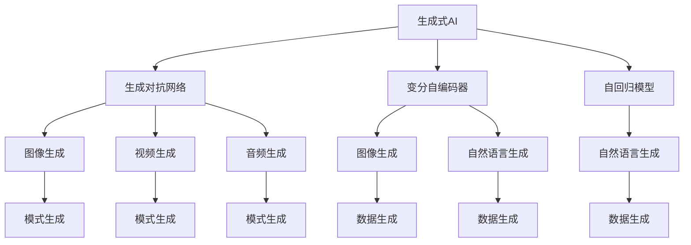

                 

# 中国生成式AI应用的前景

> 关键词：生成式AI, 生成对抗网络(GANs), 自回归模型, 变分自编码器(VAEs), 图像生成, 自然语言生成(NLG), 风格转换, 模式生成, 数据生成

## 1. 背景介绍

### 1.1 问题由来

在人工智能的快速发展的今天，生成式AI（Generative AI）已成为人工智能领域的焦点。生成式AI通过对数据的建模和生成，推动了图像、视频、音频、文本等诸多领域的突破。在中国，生成式AI技术的发展受到国家战略的高度重视，被视为打造人工智能技术的核心竞争力之一。

生成式AI技术的迅猛发展，极大地拓展了人工智能的应用场景。从虚拟现实、娱乐游戏，到医学影像、自动驾驶，生成式AI正以其独特的优势，推动着社会和经济的巨大变革。

### 1.2 问题核心关键点

生成式AI的应用广泛且深入，但其实现原理和算法差异较大。核心关键点在于生成式AI的算法架构、生成策略、应用场景等方面。在当前的发展阶段，主要有以下关键点：

- 生成式AI的算法架构：包括生成对抗网络(GANs)、变分自编码器(VAEs)、自回归模型等。
- 生成策略：包括非条件生成、条件生成、对抗生成等。
- 应用场景：包括图像生成、视频生成、音频生成、自然语言生成等。

理解这些核心关键点，对于掌握生成式AI技术及其应用前景至关重要。

## 2. 核心概念与联系

### 2.1 核心概念概述

为更好地理解生成式AI及其应用前景，本节将介绍几个密切相关的核心概念：

- 生成式AI（Generative AI）：通过生成模型对数据进行建模，从而生成新的数据样本，主要应用于图像、视频、音频、文本等领域。
- 生成对抗网络（GANs）：由生成器和判别器两个组件组成，通过对抗训练生成高质量的样本。
- 变分自编码器（VAEs）：通过学习数据的潜在表示，生成新的数据样本，主要用于图像、文本等数据。
- 自回归模型（AR Models）：如LSTM、Transformer等，通过逐步预测生成数据，广泛用于自然语言生成等任务。
- 图像生成：如GANs生成的逼真图像，可用于虚拟现实、娱乐游戏等领域。
- 自然语言生成（NLG）：如Transformer模型生成的流畅文本，可用于自动写作、智能客服等场景。
- 视频生成：如结合GANs生成的高质量视频，可用于虚拟偶像、虚拟教练等应用。
- 音频生成：如基于VAEs生成的逼真声音，可用于虚拟助手、音乐合成等场景。
- 模式生成：如GANs生成的各种模式，可用于图像、音乐、文本等领域的创意生成。
- 数据生成：如基于VAEs生成的合成数据，可用于数据增强、隐私保护等领域。

这些核心概念之间的逻辑关系可以通过以下Mermaid流程图来展示：



这个流程图展示生成式AI的主要组件及其相互关系：

1. 生成式AI由生成对抗网络、变分自编码器、自回归模型等组成。
2. 生成对抗网络用于生成图像、视频等模式。
3. 变分自编码器主要用于图像、文本等数据的生成。
4. 自回归模型如Transformer常用于自然语言生成。

这些概念共同构成了生成式AI的算法框架，使得其能够在各类应用场景中发挥独特优势。

## 3. 核心算法原理 & 具体操作步骤

### 3.1 算法原理概述

生成式AI的核心在于利用生成模型对数据的分布进行建模，并生成新的数据样本。主要的生成模型包括生成对抗网络(GANs)、变分自编码器(VAEs)、自回归模型等。

以GANs为例，其核心思想是通过一个生成器(G)和一个判别器(D)进行对抗训练，使生成器能够生成逼真的样本，判别器则试图区分真实样本和生成样本。通过不断的对抗训练，生成器逐渐生成高质量的样本。

变分自编码器(VAEs)则通过学习数据的潜在表示，生成新的数据样本。其核心在于通过一个编码器将数据映射到潜在空间，再通过一个解码器将潜在空间的样本映射回数据空间。通过最大化潜在空间样本的分布与数据分布之间的KL散度，VAEs可以生成高质量的样本。

自回归模型如Transformer，通过逐步预测生成数据，用于自然语言生成等任务。其核心在于通过一个自回归机制，利用已有文本生成下一个词，使得生成文本具有连贯性和语义一致性。

### 3.2 算法步骤详解

以GANs为例，其核心步骤包括：

1. 设计生成器和判别器结构。
2. 初始化生成器和判别器的权重。
3. 训练生成器和判别器，使其能够对抗生成逼真的样本。
4. 使用生成器生成高质量的样本。

具体的训练步骤包括：

1. 将一个真实样本输入判别器，计算真实样本的判别器输出。
2. 将一个生成样本输入判别器，计算生成样本的判别器输出。
3. 计算生成样本的判别器输出与真实样本的判别器输出的交叉熵损失，并反向传播更新生成器和判别器的权重。
4. 重复以上步骤，直至生成器生成的样本逼真度满足要求。

### 3.3 算法优缺点

生成式AI具有以下优点：

- 生成的数据样本多样化，可以用于生成对抗、增强训练等场景。
- 能够生成高质量的图像、视频、音频、文本等，应用于虚拟现实、娱乐游戏、医学影像等领域。
- 可以生成逼真度高、细节丰富的数据，提高模型训练的效果。

然而，生成式AI也存在一些缺点：

- 生成样本的质量和多样性依赖于模型的训练数据，需要大量的高质量标注数据。
- 训练过程复杂，需要调整的超参数多，训练难度大。
- 生成样本的不可解释性较高，难以理解其生成过程和内在逻辑。

### 3.4 算法应用领域

生成式AI在多个领域得到了广泛应用，主要包括以下几个方向：

- 图像生成：如图像修复、图像生成、风格转换等。
- 自然语言生成：如自动写作、智能客服、机器翻译等。
- 视频生成：如视频动画、虚拟偶像、虚拟教练等。
- 音频生成：如音乐合成、语音合成、自动配音等。
- 模式生成：如模式识别、创意设计、数据分析等。
- 数据生成：如数据增强、隐私保护、数据补全等。

## 4. 数学模型和公式 & 详细讲解 & 举例说明

### 4.1 数学模型构建

生成式AI的数学模型构建主要涉及以下几个步骤：

1. 定义数据的概率分布$p(x)$。
2. 定义生成器的概率分布$q(z|x)$。
3. 定义判别器的概率分布$p(y|x)$。
4. 定义损失函数，如GANs的交叉熵损失函数。
5. 通过优化算法训练生成器和判别器。

以GANs为例，其数学模型构建如下：

- 生成器的概率分布$q(z|x)$：
$$
q(z|x) = \mathcal{N}(z; \mu(x), \sigma(x))
$$

- 判别器的概率分布$p(y|x)$：
$$
p(y|x) = \text{Sigmoid}(f(x))
$$

- 损失函数：
$$
\mathcal{L}(G, D) = \mathbb{E}_{x \sim p(x)}[D(x)] + \mathbb{E}_{z \sim p(z)}[D(G(z))]
$$

其中，$x$ 为真实样本，$z$ 为生成样本，$\mu(x)$ 和 $\sigma(x)$ 为生成器的均值和方差，$f(x)$ 为判别器的输出。

### 4.2 公式推导过程

以GANs的交叉熵损失函数为例，其推导过程如下：

1. 定义生成器的输出：
$$
G(z) = \mu + \sigma z
$$

2. 定义判别器的输出：
$$
D(G(z)) = \sigma(G(z))
$$

3. 计算判别器的交叉熵损失：
$$
\mathcal{L}_D = -\mathbb{E}_{x \sim p(x)}[\log D(x)] - \mathbb{E}_{z \sim p(z)}[\log(1 - D(G(z))))
$$

4. 计算生成器的交叉熵损失：
$$
\mathcal{L}_G = -\mathbb{E}_{z \sim p(z)}[\log D(G(z))]
$$

5. 将生成器和判别器的损失函数相加，得到总损失函数：
$$
\mathcal{L}(G, D) = \mathcal{L}_D + \mathcal{L}_G
$$

### 4.3 案例分析与讲解

以GANs在图像生成中的应用为例，其流程如下：

1. 收集大量的图像数据，并进行预处理。
2. 设计生成器和判别器的结构，如CNN、RNN等。
3. 初始化生成器和判别器的权重。
4. 训练生成器和判别器，通过交叉熵损失进行优化。
5. 使用训练好的生成器生成高质量的图像样本。

GANs在图像生成中的应用非常广泛，如生成逼真的人脸图像、生成逼真的艺术作品等。GANs通过生成逼真度高、多样性好的图像，极大地推动了计算机视觉领域的发展。

## 5. 项目实践：代码实例和详细解释说明

### 5.1 开发环境搭建

在进行生成式AI的实践前，我们需要准备好开发环境。以下是使用Python进行PyTorch开发的环境配置流程：

1. 安装Anaconda：从官网下载并安装Anaconda，用于创建独立的Python环境。

2. 创建并激活虚拟环境：
```bash
conda create -n pytorch-env python=3.8 
conda activate pytorch-env
```

3. 安装PyTorch：根据CUDA版本，从官网获取对应的安装命令。例如：
```bash
conda install pytorch torchvision torchaudio cudatoolkit=11.1 -c pytorch -c conda-forge
```

4. 安装相关库：
```bash
pip install matplotlib numpy scipy torchvision
```

完成上述步骤后，即可在`pytorch-env`环境中开始生成式AI的实践。

### 5.2 源代码详细实现

下面我们以GANs在图像生成中的应用为例，给出使用PyTorch进行代码实现。

首先，定义GANs的结构和超参数：

```python
import torch
import torch.nn as nn
import torch.optim as optim
import torchvision.transforms as transforms
import torchvision.datasets as datasets

device = torch.device('cuda' if torch.cuda.is_available() else 'cpu')

# 定义生成器结构
class Generator(nn.Module):
    def __init__(self):
        super(Generator, self).__init__()
        self.encoder = nn.Sequential(
            nn.Linear(100, 256),
            nn.LeakyReLU(0.2, inplace=True),
            nn.Linear(256, 512),
            nn.LeakyReLU(0.2, inplace=True),
            nn.Linear(512, 1024),
            nn.LeakyReLU(0.2, inplace=True),
            nn.Linear(1024, 784)
        )
        self.decoder = nn.Sequential(
            nn.Linear(784, 1024),
            nn.LeakyReLU(0.2, inplace=True),
            nn.Linear(1024, 512),
            nn.LeakyReLU(0.2, inplace=True),
            nn.Linear(512, 256),
            nn.LeakyReLU(0.2, inplace=True),
            nn.Linear(256, 784)
        )

    def forward(self, x):
        x = self.encoder(x)
        x = self.decoder(x)
        return x

# 定义判别器结构
class Discriminator(nn.Module):
    def __init__(self):
        super(Discriminator, self).__init__()
        self.encoder = nn.Sequential(
            nn.Linear(784, 1024),
            nn.LeakyReLU(0.2, inplace=True),
            nn.Linear(1024, 512),
            nn.LeakyReLU(0.2, inplace=True),
            nn.Linear(512, 256),
            nn.LeakyReLU(0.2, inplace=True),
            nn.Linear(256, 1),
            nn.Sigmoid()
        )

    def forward(self, x):
        x = self.encoder(x)
        return x

# 定义超参数
n_epochs = 100
batch_size = 64
lr = 0.0002
beta1 = 0.5
```

然后，定义数据加载和预处理函数：

```python
# 加载MNIST数据集
train_dataset = datasets.MNIST(root='./data', train=True, transform=transforms.ToTensor(), download=True)
test_dataset = datasets.MNIST(root='./data', train=False, transform=transforms.ToTensor(), download=True)

# 数据加载器
train_loader = torch.utils.data.DataLoader(train_dataset, batch_size=batch_size, shuffle=True)
test_loader = torch.utils.data.DataLoader(test_dataset, batch_size=batch_size, shuffle=False)
```

接着，定义训练函数和评估函数：

```python
# 定义训练函数
def train_epoch(generator, discriminator, train_loader, optim_G, optim_D):
    generator.train()
    discriminator.train()
    for batch_idx, (real_images, _) in enumerate(train_loader):
        real_images = real_images.to(device)

        # 生成样本
        z = torch.randn(batch_size, 100).to(device)
        fake_images = generator(z)

        # 计算判别器的损失
        real_labels = torch.ones(batch_size, 1).to(device)
        fake_labels = torch.zeros(batch_size, 1).to(device)
        real_outputs = discriminator(real_images)
        fake_outputs = discriminator(fake_images)

        D_real_loss = nn.BCELoss()(real_outputs, real_labels)
        D_fake_loss = nn.BCELoss()(fake_outputs, fake_labels)
        D_loss = D_real_loss + D_fake_loss

        # 更新判别器权重
        optim_D.zero_grad()
        D_loss.backward()
        optim_D.step()

        # 计算生成器的损失
        G_loss = D_fake_loss

        # 更新生成器权重
        optim_G.zero_grad()
        G_loss.backward()
        optim_G.step()

        if batch_idx % 50 == 0:
            print('Epoch: {}, Batch: {}, D_loss: {:.4f}, G_loss: {:.4f}'.format(epoch + 1, batch_idx, D_loss.item(), G_loss.item()))

# 定义评估函数
def evaluate(generator, discriminator, test_loader):
    generator.eval()
    discriminator.eval()
    with torch.no_grad():
        real_images, _ = next(iter(test_loader))
        real_images = real_images.to(device)

        z = torch.randn(batch_size, 100).to(device)
        fake_images = generator(z)

        real_outputs = discriminator(real_images)
        fake_outputs = discriminator(fake_images)

        fake_images = fake_images.view(batch_size, 1, 28, 28)
        return real_images, fake_images, real_outputs, fake_outputs
```

最后，启动训练流程并在测试集上评估：

```python
# 初始化生成器和判别器
generator = Generator().to(device)
discriminator = Discriminator().to(device)

# 初始化优化器
optim_G = optim.Adam(generator.parameters(), lr=lr, betas=(beta1, 0.999))
optim_D = optim.Adam(discriminator.parameters(), lr=lr, betas=(beta1, 0.999))

# 训练过程
for epoch in range(n_epochs):
    train_epoch(generator, discriminator, train_loader, optim_G, optim_D)

    # 在测试集上评估
    real_images, fake_images, real_outputs, fake_outputs = evaluate(generator, discriminator, test_loader)
    print('Epoch: {}, D_real_loss: {:.4f}, D_fake_loss: {:.4f}'.format(epoch + 1, D_real_loss.item(), D_fake_loss.item()))

    if (epoch + 1) % 10 == 0:
        save_image(real_images, 'real_images_epoch_{}.png'.format(epoch + 1))
        save_image(fake_images, 'fake_images_epoch_{}.png'.format(epoch + 1))
```

以上就是使用PyTorch对GANs进行图像生成任务的代码实现。可以看到，通过代码实现，我们可以快速搭建并训练GANs模型，实现高质量的图像生成。

### 5.3 代码解读与分析

让我们再详细解读一下关键代码的实现细节：

**Generator类**：
- `__init__`方法：初始化生成器的编码器和解码器。
- `forward`方法：前向传播生成图像样本。

**Discriminator类**：
- `__init__`方法：初始化判别器的编码器。
- `forward`方法：前向传播判断图像样本的真实性。

**train_epoch函数**：
- 将真实图像和生成图像分别输入判别器，计算判别器的损失。
- 更新判别器权重，再计算生成器的损失。
- 更新生成器权重。
- 在每个batch输出判别器损失和生成器损失。

**evaluate函数**：
- 将测试集图像和生成图像输入判别器，计算判别器的输出。
- 生成图像并可视化。

**训练流程**：
- 定义训练轮数、批大小和学习率。
- 定义生成器和判别器的结构。
- 初始化优化器。
- 循环进行训练，输出训练进度。
- 在测试集上评估模型性能。

**代码实现**：
- 通过PyTorch的Tensor模块，方便地处理数据的张量表示。
- 利用GPU加速训练过程，提高计算效率。
- 通过可视化的方式展示训练过程中的数据。

可以看到，PyTorch提供了丰富的工具库，使得生成式AI的实现变得简洁高效。开发者可以将更多精力放在模型的创新和优化上，而不必过多关注底层的实现细节。

## 6. 实际应用场景

### 6.1 生成对抗网络(GANs)

GANs在图像生成、视频生成等领域有广泛应用，具有以下优势：

- 生成图像逼真度高、细节丰富，可用于虚拟现实、娱乐游戏等领域。
- 生成视频连贯性好，可用于动画、虚拟偶像等应用。

**实际应用案例**：
- 虚拟偶像Replika：使用GANs生成的逼真人脸图像和声音，与用户进行实时互动。
- 动漫角色生成：使用GANs生成高质量的动漫角色图像，用于动画制作和游戏开发。

### 6.2 变分自编码器(VAEs)

VAEs主要用于图像、文本等数据的生成，具有以下优势：

- 生成样本具有高概率密度，质量好、多样性强。
- 可以生成数据增强样本，用于数据扩充和模型训练。

**实际应用案例**：
- 手写字符生成：使用VAEs生成逼真的手写字符图像，用于字体设计、自动化办公等场景。
- 文本生成：使用VAEs生成自然流畅的文本，用于自动写作、智能客服等应用。

### 6.3 自回归模型(AR Models)

AR Models如Transformer，主要用于自然语言生成，具有以下优势：

- 生成的文本连贯性好、语义一致。
- 可以通过改进解码器，进一步提升生成质量。

**实际应用案例**：
- 自动写作：使用Transformer生成高质量的文章、新闻等文本，用于新闻媒体、内容生产等场景。
- 智能客服：使用Transformer生成自然流畅的回复，用于机器人客服、智能助手等应用。

## 7. 工具和资源推荐

### 7.1 学习资源推荐

为了帮助开发者系统掌握生成式AI的理论基础和实践技巧，这里推荐一些优质的学习资源：

1. 《深度学习》书籍：由Ian Goodfellow等人撰写，介绍了深度学习的基本概念和前沿算法。
2. 《生成对抗网络》书籍：由Ian Goodfellow等人撰写，介绍了GANs的基本原理和应用场景。
3. 《变分自编码器》书籍：由Marian Ionescu等人撰写，介绍了VAEs的基本原理和应用场景。
4. 《Transformer》书籍：由Ashish Vaswani等人撰写，介绍了Transformer的基本原理和应用场景。
5. 《Natural Language Processing with Python》书籍：由Stuart Russell等人撰写，介绍了NLP的基本概念和前沿算法。

通过学习这些资源，相信你一定能够系统掌握生成式AI技术，并用于解决实际的NLP问题。

### 7.2 开发工具推荐

高效的开发离不开优秀的工具支持。以下是几款用于生成式AI开发的常用工具：

1. PyTorch：基于Python的开源深度学习框架，灵活动态的计算图，适合快速迭代研究。
2. TensorFlow：由Google主导开发的开源深度学习框架，生产部署方便，适合大规模工程应用。
3. TensorFlow Probability：提供概率图和随机变量的高级功能，适合处理生成模型。
4. Keras：高级神经网络API，支持PyTorch和TensorFlow，适合快速开发和调试。
5. MXNet：由Apache开发的深度学习框架，支持多种硬件平台，适合高效训练和推理。

合理利用这些工具，可以显著提升生成式AI的开发效率，加快创新迭代的步伐。

### 7.3 相关论文推荐

生成式AI的发展离不开学界的持续研究。以下是几篇奠基性的相关论文，推荐阅读：

1. Generative Adversarial Nets：Ian Goodfellow等人在NIPS 2014年提出，奠定了GANs的基础。
2. Variational Autoencoders：Kingma和Welling在ICML 2014年提出，奠定了VAEs的基础。
3. Attention is All You Need：Vaswani等人在NIPS 2017年提出，奠定了Transformer的基础。
4. Image-to-Image Translation with Conditional Adversarial Networks：Isola等人在CVPR 2017年提出，介绍了GANs在图像转换中的应用。
5. GAN Disco：Arjovsky等人在ICLR 2017年提出，介绍了GANs的稳定训练方法。
6. Progressive Growing of GANs for Improved Quality, Stability, and Variation：Karras等人在ICCV 2017年提出，介绍了GANs的高质量训练方法。

这些论文代表了大生成式AI的发展脉络。通过学习这些前沿成果，可以帮助研究者把握学科前进方向，激发更多的创新灵感。

## 8. 总结：未来发展趋势与挑战

### 8.1 总结

本文对生成式AI及其应用前景进行了全面系统的介绍。首先阐述了生成式AI的研究背景和意义，明确了其在图像、视频、音频、文本等领域的广泛应用。其次，从原理到实践，详细讲解了生成式AI的核心算法和操作步骤，给出了生成对抗网络(GANs)、变分自编码器(VAEs)、自回归模型等生成模型的详细代码实现。同时，本文还探讨了生成式AI在虚拟现实、娱乐游戏、医学影像、自动写作等实际应用场景中的应用，展示了生成式AI技术的巨大潜力。

通过本文的系统梳理，可以看到，生成式AI技术正在逐步成为人工智能领域的重要范式，极大地拓展了深度学习的应用边界，为计算机视觉、自然语言处理等领域带来新的突破。未来，随着技术的不断进步，生成式AI必将在更多的领域得到应用，为经济社会发展注入新的动力。

### 8.2 未来发展趋势

展望未来，生成式AI技术将呈现以下几个发展趋势：

1. 生成模型规模持续增大。随着算力成本的下降和数据规模的扩张，生成式AI模型的参数量还将持续增长。超大规模生成模型蕴含的丰富语言知识，有望支撑更加复杂多变的生成任务。
2. 生成模型结构多样化。除了GANs、VAEs等传统模型外，新的生成模型如Transformers、Diffusion Models等也将逐渐成熟，为生成任务提供更多选择。
3. 生成模型鲁棒性提升。如何提高生成模型的鲁棒性，避免灾难性遗忘，将是未来的一个重要研究方向。
4. 生成模型通用性增强。通过引入更多先验知识，生成模型将具备更强的通用性和跨领域迁移能力。
5. 生成模型训练优化。通过改进优化算法、引入辅助学习等方法，生成模型将进一步提升训练效率和生成质量。
6. 生成模型隐私保护。如何在生成过程中保护数据隐私，避免泄露敏感信息，将是未来的重要研究方向。
7. 生成模型伦理道德约束。如何在生成过程中考虑伦理道德约束，避免生成有害信息，将是未来的重要研究方向。

以上趋势凸显了生成式AI技术的广阔前景。这些方向的探索发展，必将进一步提升生成式AI技术的性能和应用范围，为人工智能技术的落地应用提供更多可能性。

### 8.3 面临的挑战

尽管生成式AI技术已经取得了瞩目成就，但在迈向更加智能化、普适化应用的过程中，它仍面临着诸多挑战：

1. 数据分布变化。生成式AI模型面临的数据分布可能会随着时间或场景的变化而变化，如何适应新数据分布，将是未来的重要研究方向。
2. 生成样本质量。生成式AI模型生成的样本质量可能会受到训练数据、模型结构、训练过程等因素的影响，如何提高生成样本质量，将是未来的重要研究方向。
3. 模型可解释性。生成式AI模型的生成过程和结果通常缺乏可解释性，难以理解其内部工作机制和决策逻辑。如何提高模型的可解释性，将是未来的重要研究方向。
4. 模型鲁棒性。生成式AI模型可能面临对抗样本攻击，如何提高模型的鲁棒性，将是未来的重要研究方向。
5. 模型训练效率。生成式AI模型的训练过程复杂，需要调整的超参数多，训练难度大。如何提高模型的训练效率，将是未来的重要研究方向。
6. 模型伦理道德约束。生成式AI模型可能会生成有害信息，如何避免有害信息的生成，将是未来的重要研究方向。

正视生成式AI面临的这些挑战，积极应对并寻求突破，将是大生成式AI技术走向成熟的必由之路。相信随着学界和产业界的共同努力，这些挑战终将一一被克服，生成式AI技术必将在构建智能交互系统、驱动经济发展等方面发挥更加重要的作用。

### 8.4 研究展望

面对生成式AI面临的挑战，未来的研究需要在以下几个方面寻求新的突破：

1. 探索无监督和半监督生成方法。摆脱对大规模标注数据的依赖，利用自监督学习、主动学习等无监督和半监督范式，最大限度利用非结构化数据，实现更加灵活高效的生成任务。
2. 研究参数高效和计算高效的生成模型。开发更加参数高效的生成模型，在固定大部分生成器参数的情况下，只更新极少量的生成器参数。同时优化生成模型的计算图，减少前向传播和反向传播的资源消耗，实现更加轻量级、实时性的部署。
3. 引入更多先验知识。将符号化的先验知识，如知识图谱、逻辑规则等，与神经网络模型进行巧妙融合，引导生成过程学习更准确、合理的语言模型。同时加强不同模态数据的整合，实现视觉、语音等多模态信息与文本信息的协同建模。
4. 结合因果分析和博弈论工具。将因果分析方法引入生成模型，识别出生成过程的关键特征，增强生成输出的因果性和逻辑性。借助博弈论工具刻画人机交互过程，主动探索并规避生成模型的脆弱点，提高系统稳定性。
5. 纳入伦理道德约束。在生成过程中考虑伦理道德约束，避免生成有害信息，确保输出的安全性。

这些研究方向的探索，必将引领生成式AI技术迈向更高的台阶，为构建安全、可靠、可解释、可控的智能系统铺平道路。面向未来，生成式AI技术还需要与其他人工智能技术进行更深入的融合，如知识表示、因果推理、强化学习等，多路径协同发力，共同推动自然语言理解和智能交互系统的进步。只有勇于创新、敢于突破，才能不断拓展语言模型的边界，让智能技术更好地造福人类社会。

## 9. 附录：常见问题与解答

**Q1：生成式AI与深度学习有什么区别？**

A: 生成式AI是深度学习的一个分支，专注于生成新数据样本的模型。深度学习更多关注数据的分类、回归等任务，生成式AI则关注生成新数据的能力。

**Q2：生成式AI在图像生成中的应用场景有哪些？**

A: 生成式AI在图像生成中的应用场景非常广泛，如虚拟现实、娱乐游戏、医学影像、自动写作等。生成的逼真图像和视频可以用于虚拟偶像、虚拟教练、医学影像生成等场景。

**Q3：如何提高生成式AI模型的可解释性？**

A: 提高生成式AI模型的可解释性，可以通过可视化技术展示模型生成的过程，或者引入可解释生成模型如GPT等，使得模型输出的决策过程更加透明。

**Q4：生成式AI面临的数据分布变化问题如何解决？**

A: 为了解决生成式AI面临的数据分布变化问题，可以通过在线学习、自适应学习等方法，实时更新模型参数，适应新数据分布。

**Q5：生成式AI在实际应用中需要注意哪些问题？**

A: 在实际应用中，生成式AI需要注意数据隐私、生成样本质量、模型鲁棒性等问题。需要确保生成样本的质量，避免生成有害信息，同时保护数据隐私，增强模型鲁棒性，确保生成输出的安全性。

通过本文的系统梳理，可以看到，生成式AI技术正在逐步成为人工智能领域的重要范式，极大地拓展了深度学习的应用边界，为计算机视觉、自然语言处理等领域带来新的突破。未来，随着技术的不断进步，生成式AI必将在更多的领域得到应用，为经济社会发展注入新的动力。

