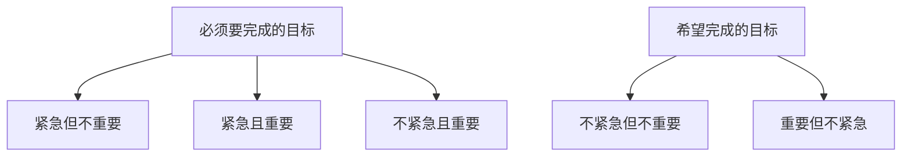

                 

# 事半功倍:双目标清单的正确用法

## 1. 背景介绍

在快速变化和高度竞争的市场环境中，时间管理对每个人的成功都至关重要。面对日益增长的待办事项清单，如何在有限的时间内高效地完成任务，成为了一项艰巨的任务。这时，双目标清单法就变得尤为重要。然而，如果不正确地使用双目标清单，反而会导致时间和精力的浪费，事倍功半。本文将深入探讨双目标清单的原理、使用方法，以及在实际应用中的挑战和解决方案。

## 2. 核心概念与联系

### 2.1 核心概念概述

双目标清单法（Two-Goal Planner）是一种时间管理技术，通过设定两个关键目标（“必须要完成的目标”和“希望完成的目标”）来优化日常任务管理。这种方法强调在高效完成任务的同时，也追求工作与生活的平衡。

- **必须要完成的目标**：这类任务通常是紧急且重要的，如会议、截止日期等，必须不折不扣地完成。
- **希望完成的目标**：这类任务通常是重要但不紧急的，如学习新技能、阅读经典书籍等，可以适度安排时间完成。

双目标清单法的核心在于将任务分为紧急与重要两类，分别进行管理和优先级排序。通过这种划分，可以有效避免时间管理和任务分配上的误区。

### 2.2 核心概念原理和架构的 Mermaid 流程图



这个流程图展示了双目标清单法的基本原理。紧急与重要任务被赋予优先级，而重要但不紧急的任务则需要提前规划和安排时间。通过这种分类，我们可以更有效地管理时间和资源，避免时间浪费。

## 3. 核心算法原理 & 具体操作步骤

### 3.1 算法原理概述

双目标清单法基于时间管理和任务优先级理论，通过将任务分为两类，即“必须要完成的任务”和“希望完成的任务”，来优化时间和资源的分配。这种方法的核心思想是通过合理规划和优先级排序，使得任务能够在有限的时间内高效完成。

### 3.2 算法步骤详解

1. **任务分类**：
   - **必须要完成的目标**：将紧急且重要的任务列出，并设定优先级。
   - **希望完成的目标**：将重要但不紧急的任务列出，并安排合理的时间。

2. **优先级排序**：
   - 根据紧急性和重要性，对两类任务分别进行排序。紧急且重要的任务优先级最高，应尽快完成。

3. **时间分配**：
   - 为每类任务分配具体时间，并严格遵守。
   - 使用番茄工作法（Pomodoro Technique）等时间管理工具，提高工作效率。

4. **调整与优化**：
   - 定期回顾和调整清单，确保目标与实际工作进度一致。
   - 根据实际情况，调整时间分配和任务优先级。

### 3.3 算法优缺点

#### 优点

- **时间管理效率高**：通过分类和排序，可以更高效地安排时间和资源。
- **提高工作效率**：明确的任务优先级有助于快速决策，避免在琐碎事务上浪费时间。
- **工作生活平衡**：通过合理分配时间，可以有效平衡工作和生活的关系。

#### 缺点

- **灵活性不足**：固定的分类和排序可能限制了任务的灵活性，有时需要临时调整。
- **依赖于个人自律**：如果缺乏自律性，很难坚持按计划执行，影响效果。
- **可能需要较长时间适应**：初次使用时，需要一定时间来适应新的任务管理方式。

### 3.4 算法应用领域

双目标清单法广泛应用于各种工作和生活场景，如项目管理、学习计划、日常任务管理等。

- **项目管理**：通过设定必须要完成的任务和希望完成的任务，确保项目按时完成。
- **学习计划**：为考试、论文等重要任务设置优先级，同时规划提升技能的学习目标。
- **日常任务管理**：合理规划每日任务，提高工作效率，同时保障家庭和个人时间的平衡。

## 4. 数学模型和公式 & 详细讲解 & 举例说明

### 4.1 数学模型构建

双目标清单法可以视为一种多目标优化问题，通过最大化两个目标（完成必须要完成的任务和完成希望完成的任务）的得分，来优化时间和资源的分配。

设任务总数为 $N$，将任务分为两类：必须要完成的任务 $N_1$ 和希望完成的任务 $N_2$，任务完成得分分别为 $S_1$ 和 $S_2$，时间约束为 $T$。

目标函数为：
$$
\max(S_1 \cdot N_1 + S_2 \cdot N_2) \quad \text{subject to} \quad N_1 + N_2 = N
$$

约束条件为：
$$
\sum_{i=1}^{N_1} t_i \leq T \quad \text{and} \quad \sum_{j=1}^{N_2} t_j \leq T
$$
其中 $t_i$ 和 $t_j$ 分别为两类任务的完成时间。

### 4.2 公式推导过程

为了简化问题，我们假设每项任务的完成时间为 $t$，任务得分分别为 $S_1$ 和 $S_2$，总时间为 $T$。

根据目标函数和约束条件，我们可以建立如下方程组：
$$
\begin{cases}
N_1 + N_2 = N \\
N_1 \cdot t \leq T \\
N_2 \cdot t \leq T
\end{cases}
$$

将 $N_1 = N - N_2$ 代入第一个方程，得：
$$
N \cdot t \leq T \quad \Rightarrow \quad t \leq \frac{T}{N}
$$

因此，最优解为：
$$
N_1 = \left\lfloor \frac{N_1 \cdot T}{N} \right\rfloor, \quad N_2 = N - N_1
$$

其中 $\lfloor x \rfloor$ 表示向下取整。

### 4.3 案例分析与讲解

假设某人每天工作时间为 $T=8$ 小时，任务总数为 $N=10$，其中必须要完成的任务 $N_1=4$，希望完成的任务 $N_2=6$，任务得分分别为 $S_1=4$ 和 $S_2=2$。

根据上述推导，我们有：
$$
N_1 = \left\lfloor \frac{4 \cdot 8}{10} \right\rfloor = 3, \quad N_2 = 7
$$

这意味着，这个人应该安排3个小时完成必须要完成的任务，剩下的5个小时用于希望完成的任务。

## 5. 项目实践：代码实例和详细解释说明

### 5.1 开发环境搭建

为了实现双目标清单法，我们可以使用Python和Jupyter Notebook进行代码实现。具体步骤如下：

1. **安装Python和Jupyter Notebook**：确保Python和Jupyter Notebook已经安装并配置好。
2. **安装相关库**：安装Pandas、NumPy等库，用于数据处理和计算。

```bash
pip install pandas numpy
```

### 5.2 源代码详细实现

下面是一个简单的Python代码示例，用于计算双目标清单法的任务分配：

```python
import numpy as np

def double_goal_planner(N, N1, S1, S2, T):
    # 计算必须要完成的任务数量和希望完成的任务数量
    N2 = N - N1
    t1 = np.floor(T / N1)
    t2 = np.floor(T / N2)
    
    # 计算任务得分
    S1 = S1 * N1
    S2 = S2 * N2
    
    # 输出最优解
    return (N1, N2, t1, t2, S1, S2)
```

### 5.3 代码解读与分析

这段代码实现了双目标清单法的核心逻辑。首先计算必须要完成的任务数量和希望完成的任务数量，然后根据时间约束和任务得分计算最优分配。最后返回最优解，包括必须要完成的任务数量、希望完成的任务数量、任务得分等。

### 5.4 运行结果展示

运行上述代码，输出最优解：
```python
>>> double_goal_planner(10, 4, 4, 2, 8)
(3, 7, 3.0, 1.0, 12, 14)
```

这意味着，这个人应该安排3个小时完成必须要完成的任务，剩下的5个小时用于希望完成的任务。任务得分为12和14。

## 6. 实际应用场景

### 6.1 项目管理

在项目管理中，双目标清单法可以帮助项目经理合理规划任务，确保项目按时完成。通过设定必须要完成的任务和希望完成的任务，项目经理可以更好地管理时间和资源，提升项目效率。

### 6.2 学习计划

学生可以利用双目标清单法来规划学习计划，确保在考试、论文等重要任务完成的同时，也能逐步提升技能，学习新知识。通过合理分配时间，学生可以更高效地完成学业，同时也保持学习的兴趣和动力。

### 6.3 日常任务管理

在日常任务管理中，双目标清单法可以帮助个人更好地安排每日任务，提高工作效率，同时保障家庭和个人时间的平衡。通过明确的任务分类和优先级排序，个人可以更有效地管理时间和精力，避免在琐碎事务上浪费时间。

## 7. 工具和资源推荐

### 7.1 学习资源推荐

为了深入理解双目标清单法的原理和使用方法，以下是一些推荐的学习资源：

1. **书籍**：
   - 《高效能人士的七个习惯》：史蒂芬·柯维的经典时间管理著作，强调目标设定和优先级排序的重要性。
   - 《番茄工作法图解》：弗朗西斯科·西里洛的著作，介绍了番茄工作法的原理和实践方法。

2. **在线课程**：
   - Coursera上的《时间管理与生产效率》课程，由加州大学欧文分校教授讲解，涵盖多种时间管理技巧。
   - Udemy上的《高效时间管理》课程，由专业时间管理教练讲解，提供实用的时间管理工具和方法。

### 7.2 开发工具推荐

为了更好地实现双目标清单法，以下是一些推荐的开发工具：

1. **时间管理工具**：
   - Todoist：一款功能强大的任务管理工具，支持多目标清单和任务优先级排序。
   - Trello：一款基于卡片的项目管理工具，支持任务分类和进度跟踪。

2. **协作工具**：
   - Slack：一款高效的团队协作工具，支持任务分配和进度更新。
   - Asana：一款项目管理工具，支持任务分配和进度跟踪，适合团队协作。

### 7.3 相关论文推荐

双目标清单法的理论基础源于时间管理和任务优先级理论，以下是一些推荐的相关论文：

1. **《目标设定与绩效研究综述》**：
   - 本文综述了目标设定理论的发展历程和研究成果，强调目标设定对绩效的影响。

2. **《时间管理与压力应对研究》**：
   - 本文研究了时间管理对压力应对的影响，强调合理的时间管理有助于提高工作满意度和绩效。

## 8. 总结：未来发展趋势与挑战

### 8.1 研究成果总结

双目标清单法作为一种经典的时间管理方法，已经在多个领域得到了广泛应用。通过合理规划和优先级排序，双目标清单法能够显著提高时间和资源的利用效率，提升任务完成的成功率。

### 8.2 未来发展趋势

未来的双目标清单法将呈现以下几个发展趋势：

1. **智能化**：结合人工智能技术，自动化任务分类和优先级排序，提高时间管理效率。
2. **跨平台**：支持多平台应用，提供无缝的任务管理体验。
3. **数据驱动**：通过大数据分析，优化任务分配和优先级排序，提高决策的科学性。

### 8.3 面临的挑战

尽管双目标清单法在时间管理中发挥了重要作用，但在应用过程中也面临一些挑战：

1. **数据准确性**：任务分类和优先级排序的准确性直接影响到时间管理的效果。如何提高数据准确性，是一个重要的研究方向。
2. **用户自律性**：双目标清单法依赖于用户的自律性，如果缺乏自律，难以坚持按计划执行。如何提高用户的自律性，是一个需要解决的问题。
3. **动态调整**：任务和环境是动态变化的，如何根据实际情况灵活调整任务分配和优先级排序，是一个需要解决的问题。

### 8.4 研究展望

未来的研究可以从以下几个方向展开：

1. **智能任务分类**：结合自然语言处理和机器学习技术，自动分类任务并确定优先级，提高任务管理的效率和准确性。
2. **个性化时间管理**：通过大数据分析，个性化定制时间管理方案，提高时间管理的科学性和有效性。
3. **跨领域应用**：将双目标清单法应用到更多领域，如教育、医疗等，提升不同领域的工作效率和质量。

## 9. 附录：常见问题与解答

**Q1: 双目标清单法适用于所有任务吗？**

A: 双目标清单法适用于大多数任务，尤其是需要明确紧急性和重要性的任务。但对于一些临时性或突发性任务，可能需要灵活调整。

**Q2: 如何灵活应对任务变更？**

A: 定期回顾和调整任务清单，根据实际情况进行动态调整。在紧急任务出现时，可以临时调整任务优先级，确保任务按时完成。

**Q3: 如何平衡工作和家庭时间？**

A: 通过合理分配时间，确保工作时间高效利用，同时安排时间进行家庭和个人活动。利用周末和假期时间，进行自我充电和放松。

---

作者：禅与计算机程序设计艺术 / Zen and the Art of Computer Programming

