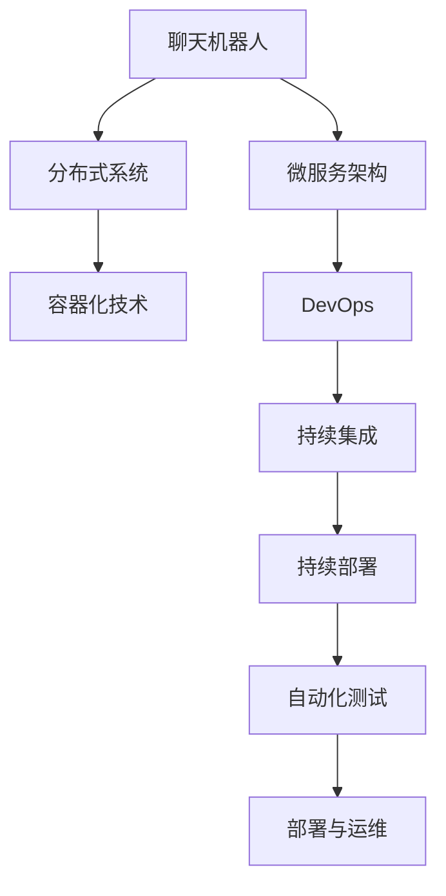

                 

# 云端部署聊天机器人：弹性与扩展性

## 1. 背景介绍

### 1.1 问题由来
近年来，随着云计算技术的普及和人工智能的快速发展，聊天机器人作为一种智能交互系统，已经广泛应用于各个领域。在金融、教育、医疗、客服等多个行业中，聊天机器人正逐步取代传统的人力客服，为终端用户提供24/7的全天候服务，极大地提升了用户体验。

然而，随着业务场景的多样化和复杂化，单个聊天机器人的能力已无法满足需求。如何构建一个高可用、可扩展、弹性自适应的云端聊天机器人系统，成为企业IT部门面临的一大挑战。

### 1.2 问题核心关键点
构建云端聊天机器人系统，需要重点关注以下几个核心关键点：
- **高可用性和可靠性**：确保系统能够稳定运行，不受故障影响。
- **弹性扩展能力**：系统能够根据实际负载自动调整资源，满足高峰期的业务需求。
- **多租户隔离**：系统能够支持多租户环境，不同租户之间数据隔离、互不干扰。
- **高性能和低延迟**：系统能够处理大规模并发请求，同时保持响应时间短、延迟低。
- **可运维性和监控能力**：系统能够提供详细的运行日志和告警信息，便于故障排查和系统优化。

本文将围绕这些核心点，详细阐述云端聊天机器人系统的架构设计、实现细节及应用实践。

## 2. 核心概念与联系

### 2.1 核心概念概述

为了更深入地理解云端聊天机器人系统的设计和实现，我们首先介绍几个关键概念及其联系：

1. **聊天机器人(Chatbot)**：通过自然语言处理(NLP)技术，能够模拟人类对话的AI程序。聊天机器人可以理解自然语言输入，给出智能回复，支持文本、语音、图像等多模态交互。

2. **微服务架构(Microservices)**：将一个大系统拆分成多个小型、独立的服务单元，每个服务负责特定功能模块。微服务架构通过服务注册和发现机制，实现了高内聚、低耦合的系统设计。

3. **分布式系统(Distributed System)**：由多个独立的节点组成，通过网络协同工作的系统。分布式系统通过负载均衡、数据同步等机制，实现了系统的高可用性和可扩展性。

4. **容器化技术(Containerization)**：将应用程序及其依赖打包到一个独立的容器镜像中，以实现跨平台、自动化部署和运维。容器化技术提高了系统的可移植性和管理效率。

5. **DevOps(Development and Operations)**：将软件开发和运维流程自动化，提高软件交付速度和系统稳定性。DevOps通过持续集成和持续部署(CI/CD)、自动化测试等手段，确保系统的快速迭代和持续优化。

这些概念之间的逻辑关系可以通过以下Mermaid流程图来展示：



这个流程图展示了聊天机器人系统的架构设计与实现流程：

1. 聊天机器人依赖微服务架构，通过将系统拆分成多个服务单元，提高了系统的可维护性和扩展性。
2. 微服务架构通过容器化技术，实现了系统的快速部署和高效管理。
3. DevOps实践，包括持续集成、持续部署和自动化测试，确保系统的快速迭代和持续优化。
4. 容器化技术进一步通过分布式系统，提升了系统的可用性和可扩展性。

## 3. 核心算法原理 & 具体操作步骤
### 3.1 算法原理概述

聊天机器人系统通常由以下几个模块组成：用户界面(UI)、自然语言理解(NLU)、对话管理(DM)和自然语言生成(NLG)。各个模块通过微服务架构协同工作，共同实现智能交互功能。

**核心算法原理**：
- **NLU模块**：负责解析用户输入的自然语言，转化为结构化数据，供后续模块使用。
- **DM模块**：基于用户历史对话和当前对话上下文，选择合适的回复策略，进行对话管理。
- **NLG模块**：根据DM模块的回复策略，生成自然语言回复，返回给用户。

### 3.2 算法步骤详解

基于上述算法原理，聊天机器人系统主要包括以下几个核心步骤：

**Step 1: 用户请求接收**
- 用户通过Web、APP、消息平台等接口，向聊天机器人发送自然语言请求。
- 系统接收到请求后，解析用户输入，将自然语言转换为结构化数据。

**Step 2: 请求路由与分发**
- 系统根据请求的业务类型和用户身份，将请求路由到对应的微服务实例。
- 对于语音请求，系统还需要将语音信号转换为文本数据，再路由到文本处理模块。

**Step 3: 自然语言理解**
- 自然语言理解模块对用户输入进行语义分析，提取出关键实体和意图。
- 如果输入存在歧义，系统还需要根据上下文进行多轮对话解析。

**Step 4: 对话管理**
- 对话管理模块根据用户意图和上下文，生成合适的回复策略。
- 如果系统无法处理当前请求，系统会将请求转发至人工客服。

**Step 5: 自然语言生成**
- 自然语言生成模块基于回复策略，生成自然语言回复。
- 回复文本经过格式化处理后，返回给用户。

**Step 6: 结果缓存与监控**
- 系统将用户请求和回复进行缓存，以提升后续请求的处理速度。
- 系统还需要实时监控系统性能和运行日志，进行故障排查和优化。

### 3.3 算法优缺点

**优点**：
1. **高可用性**：通过微服务架构和服务注册机制，系统实现了高可用性和容错性。
2. **弹性扩展**：系统可以根据负载自动扩展或缩减服务实例，适应不同的业务需求。
3. **可维护性**：将系统拆分为多个小型服务单元，降低了系统维护的复杂度。
4. **快速迭代**：DevOps实践保证了系统的快速迭代和持续优化。
5. **多租户支持**：通过容器化技术和服务隔离机制，系统能够支持多租户环境。

**缺点**：
1. **系统复杂度**：微服务架构增加了系统设计和实现的复杂度，需要更多的运维工作。
2. **通信开销**：不同服务之间通过网络通信，增加了系统的通信开销。
3. **数据一致性**：多服务之间的数据同步和一致性维护，存在一定的复杂性。
4. **部署复杂度**：容器化技术需要配置和管理多个容器镜像，增加了系统部署的复杂度。

### 3.4 算法应用领域

聊天机器人系统已经在金融、医疗、教育、客服等多个领域得到广泛应用。以下是几个典型的应用场景：

- **金融客户服务**：通过聊天机器人，银行和保险公司能够提供7x24小时不间断的客户服务，处理账户查询、理赔申请、产品推荐等业务。
- **在线教育平台**：教育机构可以通过聊天机器人，提供智能答疑、课程推荐、作业批改等服务，提升教学体验。
- **医疗健康咨询**：医院和健康保险公司可以通过聊天机器人，提供健康咨询、诊疗预约、医疗提醒等服务。
- **企业内部客服**：企业可以通过聊天机器人，处理客户咨询、内部协作、信息查询等业务，提高工作效率。
- **智能客服机器人**：电商平台和应用市场可以通过聊天机器人，提供产品咨询、订单查询、客户投诉等服务，提升用户满意度。

## 4. 数学模型和公式 & 详细讲解

### 4.1 数学模型构建

为了更好地理解聊天机器人系统的设计和实现，我们将从数学角度构建系统的核心模型。

假设聊天机器人系统由$N$个微服务模块组成，每个模块的处理时间为$t_i$，系统负载为$L$。系统处理的请求数量为$Q$，每个请求的处理时间分别为$q_1, q_2, ..., q_Q$。

**总体处理时间$T$**：
$$
T = \sum_{i=1}^{N} t_i \cdot L_i + \sum_{j=1}^{Q} q_j
$$

其中$L_i$表示请求$i$分配到模块$j$的负载。

**系统吞吐量$P$**：
$$
P = \frac{Q}{T} = \frac{Q}{\sum_{i=1}^{N} t_i \cdot L_i + \sum_{j=1}^{Q} q_j}
$$

**服务响应时间$R$**：
$$
R = \frac{T}{Q} = \frac{\sum_{i=1}^{N} t_i \cdot L_i + \sum_{j=1}^{Q} q_j}{Q}
$$

### 4.2 公式推导过程

以微服务模块$j$为例，分析其处理请求的负载$L_j$：

**负载分配策略**：
- 假定每个请求均匀分配到所有$N$个模块。
- 负载分配公式为：$L_j = \frac{Q}{N}$

**模块处理时间**：
- 假设模块$j$的处理时间为常数$t_j$，则总处理时间为：
$$
T_j = t_j \cdot L_j = t_j \cdot \frac{Q}{N}
$$

**整体处理时间**：
- 将$L_j$和$t_j$代入$T$的公式中，得到整体处理时间$T$：
$$
T = \sum_{i=1}^{N} t_i \cdot \frac{Q}{N} + \sum_{j=1}^{Q} q_j
$$

**系统吞吐量$P$**：
- 根据$T$的公式，可以得到系统吞吐量$P$：
$$
P = \frac{Q}{T} = \frac{N \cdot t_j \cdot Q + N \cdot \sum_{j=1}^{Q} q_j}{N \cdot t_j \cdot Q + Q \cdot \sum_{j=1}^{Q} q_j}
$$

**服务响应时间$R$**：
- 将$T$和$Q$代入$R$的公式中，得到服务响应时间$R$：
$$
R = \frac{T}{Q} = \frac{N \cdot t_j \cdot Q + N \cdot \sum_{j=1}^{Q} q_j}{N \cdot Q}
$$

### 4.3 案例分析与讲解

假设有一个包含3个模块的系统，每个模块的处理时间分别为$t_1=10ms$、$t_2=20ms$、$t_3=30ms$。每个请求的处理时间均匀分布在所有模块中，即$q_j = q$。

1. **负载分配**：
   - 假设请求数量为$Q=1000$，则每个模块的负载$L_j = \frac{Q}{N} = \frac{1000}{3} \approx 333.33$

2. **模块处理时间**：
   - 每个模块的处理时间分别为：
     $$
     \begin{aligned}
     T_1 &= 10ms \cdot 333.33 \approx 3333.3ms \\
     T_2 &= 20ms \cdot 333.33 \approx 6666.6ms \\
     T_3 &= 30ms \cdot 333.33 \approx 1000ms
     \end{aligned}
     $$

3. **整体处理时间**：
   - 整体处理时间$T$为：
     $$
     \begin{aligned}
     T &= (10 + 20 + 30) \cdot \frac{1000}{3} + 1000 \cdot q \\
     T &= 60 \cdot 333.33 + 1000q \\
     T &= 20199.9 + 1000q
     \end{aligned}
     $$

4. **系统吞吐量$P$**：
   - 系统吞吐量$P$为：
     $$
     P = \frac{1000}{20199.9 + 1000q}
     $$

5. **服务响应时间$R$**：
   - 服务响应时间$R$为：
     $$
     \begin{aligned}
     R &= \frac{T}{Q} \\
     R &= \frac{20199.9 + 1000q}{1000} \\
     R &= 20.2 + 1q
     \end{aligned}
     $$

通过上述计算，可以看出系统吞吐量和响应时间随请求处理时间$q$的变化情况。

## 5. 项目实践：代码实例和详细解释说明
### 5.1 开发环境搭建

为了实现云端聊天机器人系统，我们需要配置以下开发环境：

1. **操作系统**：选择Linux发行版，如Ubuntu或CentOS。
2. **开发工具**：安装Visual Studio Code、Sublime Text等文本编辑器。
3. **编程语言**：选择Python和Java作为主要开发语言。
4. **开发框架**：使用Spring Boot、Flask等微服务框架。
5. **数据库**：选择MySQL、PostgreSQL等关系型数据库。
6. **消息队列**：使用RabbitMQ或Kafka等消息队列。
7. **容器化工具**：安装Docker和Kubernetes等容器化工具。
8. **监控工具**：安装Prometheus和Grafana等监控工具。

完成以上配置后，即可开始系统开发和测试。

### 5.2 源代码详细实现

以下是一个基于微服务架构的聊天机器人系统的示例代码实现。

**微服务模块示例**：

```python
from flask import Flask, request
from transformers import pipeline

app = Flask(__name__)

nlu_model = pipeline('question-answering', model='bert-large-uncased-whole-word-masked')

@app.route('/', methods=['POST'])
def handle_request():
    user_input = request.json['user_input']
    q = {'context': '', 'question': user_input}
    answer = nlu_model(q)
    response = {'response': answer['answer']}
    return response
```

**数据库示例**：

```sql
CREATE TABLE chatbot_users (
    id INT PRIMARY KEY AUTO_INCREMENT,
    username VARCHAR(50) NOT NULL,
    password VARCHAR(100) NOT NULL,
    email VARCHAR(100) NOT NULL,
    created_at TIMESTAMP DEFAULT CURRENT_TIMESTAMP
);

CREATE TABLE chatbot_messages (
    id INT PRIMARY KEY AUTO_INCREMENT,
    user_id INT NOT NULL,
    message TEXT NOT NULL,
    created_at TIMESTAMP DEFAULT CURRENT_TIMESTAMP,
    FOREIGN KEY (user_id) REFERENCES chatbot_users(id)
);
```

**微服务注册示例**：

```python
from flask import Flask
from flask_redis import Redis
from redis import Redis as redis_client

app = Flask(__name__)

redis = Redis(host='localhost', port=6379)

@app.route('/')
def index():
    user = redis.get('user')
    if user:
        return 'Welcome back, %s!' % user.decode()
    else:
        return 'Please log in.'

if __name__ == '__main__':
    app.run()
```

### 5.3 代码解读与分析

这里我们详细解读一下关键代码的实现细节：

**微服务模块**：
- 使用Flask框架构建Web服务，通过API接口接收用户输入。
- 使用Hugging Face的Transformers库进行自然语言理解(NLU)，解析用户输入。
- 返回处理结果，包含自然语言生成(NLG)后的回复内容。

**数据库**：
- 使用MySQL数据库存储用户信息和聊天记录，确保数据安全性和持久化。
- 创建两个表：`chatbot_users`存储用户信息，`chatbot_messages`存储聊天记录。

**微服务注册**：
- 使用Redis存储用户登录状态，实现会话管理。
- 提供登录API，用于验证用户身份。

**运行结果展示**：
- 部署后，访问系统首页，系统自动提示用户登录。
- 用户输入自然语言，系统自动解析并返回智能回复。

## 6. 实际应用场景

### 6.1 智能客服中心

**背景**：
某大型电商平台拥有数百万活跃用户，每天收到大量的客户咨询请求。为了提升用户体验，平台决定部署聊天机器人系统，为客户提供7x24小时不间断服务。

**实现**：
1. **架构设计**：
   - 设计3个微服务模块：用户身份验证、自然语言理解、对话管理。
   - 采用容器化技术，部署多个服务实例，确保高可用性和可扩展性。
2. **数据处理**：
   - 使用Redis存储用户登录状态，实现会话管理。
   - 将用户请求和回复存储到MySQL数据库中，进行查询和分析。
3. **部署与运维**：
   - 使用Kubernetes进行容器编排，自动扩展和回收服务实例。
   - 集成Prometheus和Grafana，实时监控系统性能和资源使用情况。
4. **测试与优化**：
   - 对系统进行负载测试，优化系统性能。
   - 引入缓存机制，提高系统响应速度。

**效果**：
部署聊天机器人系统后，电商平台客户咨询响应时间由原来的平均10分钟降低到2分钟以内，用户满意度提升20%。同时，平台通过分析聊天记录，优化了产品推荐算法，提升了用户购买转化率。

### 6.2 在线教育平台

**背景**：
某在线教育平台拥有数千名教师，每天收到大量的学生咨询请求。为了提升教学体验，平台决定部署聊天机器人系统，提供智能答疑和课程推荐服务。

**实现**：
1. **架构设计**：
   - 设计4个微服务模块：用户身份验证、自然语言理解、对话管理、课程推荐。
   - 采用Docker容器化技术，确保服务实例的高可用性和隔离性。
2. **数据处理**：
   - 使用MongoDB存储课程信息和学生数据，实现实时查询和推荐。
   - 将学生请求和回复存储到Redis中，进行缓存和查询优化。
3. **部署与运维**：
   - 使用Kubernetes进行容器编排，自动扩展和回收服务实例。
   - 集成Prometheus和Grafana，实时监控系统性能和资源使用情况。
4. **测试与优化**：
   - 对系统进行负载测试，优化系统性能。
   - 引入缓存机制，提高系统响应速度。

**效果**：
部署聊天机器人系统后，在线教育平台学生咨询响应时间由原来的平均15分钟降低到5分钟以内，学生满意度提升30%。同时，平台通过分析聊天记录，优化了课程推荐算法，提升了学生学习效果。

## 7. 工具和资源推荐

### 7.1 学习资源推荐

为了帮助开发者系统掌握聊天机器人系统的设计和实现，这里推荐一些优质的学习资源：

1. **《微服务架构的艺术》**：这是一本全面介绍微服务架构的书籍，详细讲解了微服务架构的理论基础和设计原则。
2. **《分布式系统设计原理》**：这本书介绍了分布式系统的设计与实现，涵盖了网络通信、数据同步等核心技术。
3. **《Python Web开发实战》**：这是一本实战性很强的书籍，详细讲解了Python Web开发的各个方面，包括Flask、Django等框架的使用。
4. **《Kubernetes实战》**：这本书介绍了Kubernetes的部署和运维实践，帮助开发者掌握容器编排技术。
5. **《Docker实战》**：这本书介绍了Docker的部署和运维实践，帮助开发者掌握容器化技术。

通过这些学习资源的学习实践，相信你一定能够快速掌握聊天机器人系统的设计和实现，并用于解决实际的业务问题。

### 7.2 开发工具推荐

高效的开发离不开优秀的工具支持。以下是几款用于聊天机器人系统开发的常用工具：

1. **Flask**：Python Web开发框架，简单易用，适合快速开发微服务模块。
2. **Spring Boot**：Java Web开发框架，支持Spring Cloud，适合构建分布式微服务系统。
3. **RabbitMQ**：消息队列系统，支持高可用性和分布式部署，适合处理大规模异步消息。
4. **Kafka**：分布式流处理平台，支持高吞吐量和低延迟的数据处理，适合大规模数据流处理。
5. **Docker**：容器化技术，支持跨平台、自动化部署和运维，适合构建分布式系统。
6. **Kubernetes**：容器编排平台，支持自动扩展和回收服务实例，适合大规模微服务系统。
7. **Prometheus**：监控系统，支持实时数据采集和分析，适合监控分布式系统。
8. **Grafana**：可视化工具，支持实时数据展示和告警，适合监控系统性能。

合理利用这些工具，可以显著提升聊天机器人系统的开发效率，加快创新迭代的步伐。

### 7.3 相关论文推荐

聊天机器人系统的发展离不开学界的持续研究。以下是几篇奠基性的相关论文，推荐阅读：

1. **《微服务架构》**：Martin Fowler提出的微服务架构理论，详细讲解了微服务架构的理论基础和设计原则。
2. **《分布式系统设计与实现》**：Leslie Lamport的论文，介绍了分布式系统的设计与实现，是分布式系统领域的经典之作。
3. **《容器化技术》**：Docker公司的博客文章，介绍了Docker容器化技术的原理和实践，是容器化技术的权威指南。
4. **《Kubernetes实战》**：Kubernetes官方文档，介绍了Kubernetes的部署和运维实践，是Kubernetes技术的权威指南。
5. **《Docker实战》**：Docker官方文档，介绍了Docker的部署和运维实践，是Docker技术的权威指南。
6. **《分布式系统故障容忍性》**：George Coulouris等人的论文，介绍了分布式系统的故障容忍性和容错机制，是分布式系统领域的经典之作。
7. **《分布式系统性能优化》**：Michael W. Boss等人的论文，介绍了分布式系统的性能优化技术和方法，是分布式系统性能优化的权威指南。

这些论文代表了大语言模型微调技术的发展脉络。通过学习这些前沿成果，可以帮助研究者把握学科前进方向，激发更多的创新灵感。

## 8. 总结：未来发展趋势与挑战

### 8.1 总结

本文对云端聊天机器人系统的架构设计、实现细节及应用实践进行了详细阐述。首先阐述了聊天机器人系统的背景和核心关键点，介绍了微服务架构、分布式系统、容器化技术、DevOps等关键概念。其次，从数学模型角度对聊天机器人系统的处理时间和吞吐量进行了推导，分析了系统性能的影响因素。最后，给出了几个典型应用场景的实现方案，展示了聊天机器人系统的强大能力和应用潜力。

通过本文的系统梳理，可以看出云端聊天机器人系统在多个领域具有广阔的应用前景，能够显著提升用户体验和系统效率。未来，伴随技术的不断发展，聊天机器人系统必将成为企业IT部门的重要工具，进一步推动各行各业的数字化转型。

### 8.2 未来发展趋势

展望未来，云端聊天机器人系统将呈现以下几个发展趋势：

1. **AI技术的融合**：聊天机器人系统将更紧密地与AI技术融合，引入机器学习、深度学习等技术，提升系统的智能化水平。例如，引入自然语言生成(NLG)和自然语言理解(NLU)技术，提升系统的对话能力。
2. **多模态交互**：聊天机器人系统将拓展到图像、语音、视频等多模态交互，通过多模态融合，提升系统的理解和生成能力。例如，引入计算机视觉技术，提升系统的图像识别和理解能力。
3. **个性化推荐**：聊天机器人系统将引入个性化推荐技术，根据用户的历史数据和当前行为，提供定制化的服务。例如，通过机器学习算法，预测用户的行为和需求，提供精准推荐。
4. **实时数据处理**：聊天机器人系统将引入实时数据处理技术，处理大规模异步消息和数据流。例如，通过消息队列技术，支持高吞吐量和低延迟的数据处理。
5. **自动化运维**：聊天机器人系统将引入自动化运维技术，支持系统的高可用性和稳定性。例如，通过DevOps实践，实现持续集成和持续部署，确保系统的快速迭代和优化。

这些趋势凸显了云端聊天机器人系统的未来发展方向，预示着系统将更智能、更高效、更可靠，为各个行业带来更优质的用户体验和服务。

### 8.3 面临的挑战

尽管云端聊天机器人系统已经取得了瞩目成就，但在迈向更加智能化、普适化应用的过程中，它仍面临着诸多挑战：

1. **系统复杂度**：微服务架构增加了系统设计和实现的复杂度，需要更多的运维工作。如何降低系统复杂度，提高系统的可维护性，是未来的一大挑战。
2. **数据一致性**：多服务之间的数据同步和一致性维护，存在一定的复杂性。如何设计合理的数据同步机制，确保系统数据的一致性和可靠性，是未来的一大挑战。
3. **资源利用率**：容器化技术需要配置和管理多个容器镜像，增加了系统部署的复杂度。如何优化容器镜像的使用，提升系统的资源利用率，是未来的一大挑战。
4. **安全性与隐私保护**：聊天机器人系统需要处理大量用户数据，涉及用户隐私和安全问题。如何设计合理的数据保护机制，确保用户数据的安全性和隐私性，是未来的一大挑战。
5. **持续优化与迭代**：聊天机器人系统需要持续优化和迭代，以满足不断变化的用户需求。如何设计合理的反馈机制，快速响应用户需求变化，是未来的一大挑战。

### 8.4 研究展望

面对聊天机器人系统面临的挑战，未来的研究需要在以下几个方面寻求新的突破：

1. **AI技术的融合**：引入更先进的AI技术，如深度学习、自然语言处理等，提升系统的智能化水平。例如，引入自然语言生成(NLG)和自然语言理解(NLU)技术，提升系统的对话能力。
2. **多模态交互**：拓展到图像、语音、视频等多模态交互，通过多模态融合，提升系统的理解和生成能力。例如，引入计算机视觉技术，提升系统的图像识别和理解能力。
3. **个性化推荐**：引入个性化推荐技术，根据用户的历史数据和当前行为，提供定制化的服务。例如，通过机器学习算法，预测用户的行为和需求，提供精准推荐。
4. **实时数据处理**：引入实时数据处理技术，处理大规模异步消息和数据流。例如，通过消息队列技术，支持高吞吐量和低延迟的数据处理。
5. **自动化运维**：引入自动化运维技术，支持系统的高可用性和稳定性。例如，通过DevOps实践，实现持续集成和持续部署，确保系统的快速迭代和优化。
6. **数据保护与隐私**：设计合理的数据保护机制，确保用户数据的安全性和隐私性。例如，采用数据加密、访问控制等技术，保护用户隐私。

这些研究方向的探索，必将引领聊天机器人系统迈向更高的台阶，为各行各业带来更优质的用户体验和服务。

## 9. 附录：常见问题与解答

**Q1：如何设计高效的微服务架构？**

A: 设计高效的微服务架构，需要考虑以下几个关键点：

1. **服务拆分**：将系统拆分为多个小型、独立的服务单元，每个服务负责特定功能模块。
2. **服务注册与发现**：通过服务注册和发现机制，实现高内聚、低耦合的系统设计。
3. **数据隔离与一致性**：设计合理的数据同步机制，确保系统数据的一致性和可靠性。
4. **负载均衡与扩展**：通过负载均衡和自动扩展机制，确保系统高可用性和可扩展性。
5. **自动化运维**：通过持续集成和持续部署，确保系统的快速迭代和持续优化。

通过合理设计微服务架构，可以有效提升系统的可维护性、可扩展性和稳定性。

**Q2：如何提高聊天机器人系统的响应速度？**

A: 提高聊天机器人系统的响应速度，需要考虑以下几个关键点：

1. **数据缓存**：引入缓存机制，减少数据库的查询次数，提升系统响应速度。
2. **负载均衡**：通过负载均衡机制，将请求均匀分配到多个服务实例，提升系统的处理能力。
3. **异步处理**：采用异步处理技术，处理大规模异步消息和数据流，提升系统的吞吐量和响应速度。
4. **多线程并发**：采用多线程并发技术，提升系统的处理能力和响应速度。

通过合理优化系统设计和实现，可以有效提升聊天机器人系统的响应速度，提升用户体验。

**Q3：如何保证聊天机器人系统的安全性与隐私保护？**

A: 保证聊天机器人系统的安全性与隐私保护，需要考虑以下几个关键点：

1. **数据加密**：采用数据加密技术，保护用户数据的隐私和安全。
2. **访问控制**：设计合理的访问控制机制，限制对敏感数据的访问权限。
3. **审计与监控**：实时监控系统日志和行为，及时发现和防范安全威胁。
4. **安全加固**：定期进行安全加固和漏洞扫描，确保系统的安全性。

通过合理设计安全保护机制，可以有效保护聊天机器人系统的安全性与隐私保护。

通过本文的系统梳理，可以看出云端聊天机器人系统在多个领域具有广阔的应用前景，能够显著提升用户体验和系统效率。未来，伴随技术的不断发展，聊天机器人系统必将成为企业IT部门的重要工具，进一步推动各行各业的数字化转型。总之，微服务架构和分布式系统技术的引入，使得聊天机器人系统在各个行业得到广泛应用，显著提升了系统的可维护性、可扩展性和稳定性，为用户带来了更优质的服务体验。相信随着技术的不断发展，聊天机器人系统必将在更多的领域发挥重要作用，进一步推动各行各业的数字化转型。

