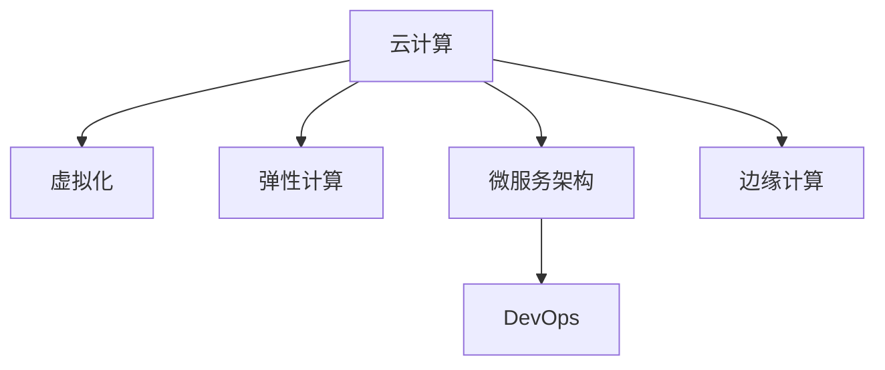

                 

# 云计算在企业数字化转型中的作用：灵活性与可扩展性

## 1. 背景介绍

### 1.1 问题由来

随着信息技术的飞速发展，企业数字化转型已经成为了各行各业的共识。传统企业基于本地部署的信息系统面临效率低、扩展难、成本高、维护难等诸多问题，难以适应快速变化的商业环境。云计算技术的兴起，为企业提供了灵活、可扩展、低成本的IT资源解决方案，使得企业能够更高效地应对市场变化。

### 1.2 问题核心关键点

云计算的本质在于“按需自助、快速弹性、高可扩展性、低成本”。在企业数字化转型过程中，云计算通过提供云基础设施、平台即服务、软件即服务(SaaS)等云服务，为企业提供了灵活的IT资源配置方式，支持企业快速部署、迭代和扩展应用系统。同时，云计算的弹性计算能力也使得企业可以根据业务需求动态调整计算资源，确保业务的稳定性和可扩展性。

## 2. 核心概念与联系

### 2.1 核心概念概述

为更好地理解云计算在企业数字化转型中的作用，本节将介绍几个密切相关的核心概念：

- 云计算：通过Internet向用户提供计算资源和服务的模式，包括云基础设施(IaaS)、云平台(PaaS)、云应用(SaaS)等。
- 虚拟化：通过抽象化底层硬件资源，支持多租户共享使用同一物理硬件，提高资源利用率。
- 弹性计算：根据业务需求动态调整计算资源，包括CPU、内存、存储、网络等，确保业务的稳定性和可扩展性。
- 微服务架构：将应用拆分为一系列小型、自治的服务单元，通过服务发现、负载均衡、容错机制等实现系统的灵活扩展和高效运行。
- DevOps：通过持续集成、持续部署、自动化运维等实践，缩短应用交付周期，提升系统稳定性和可靠性。
- 边缘计算：将计算和数据处理任务分发到接近数据源的网络边缘节点，减少时延，提高响应速度和系统可靠性。

这些核心概念之间的逻辑关系可以通过以下Mermaid流程图来展示：



这个流程图展示了一些核心概念及其之间的关系：

1. 云计算通过提供弹性计算和微服务架构，满足企业对IT资源的需求。
2. DevOps通过持续集成、持续部署和自动化运维，提升系统的迭代速度和稳定性。
3. 虚拟化技术为弹性计算和微服务架构提供了基础支持，实现资源的抽象和共享。
4. 边缘计算通过靠近数据源的计算，进一步优化系统的响应速度和可靠性。

## 3. 核心算法原理 & 具体操作步骤

### 3.1 算法原理概述

云计算在企业数字化转型中的核心作用在于其灵活性和可扩展性。企业可以根据业务需求，动态地调整云资源的规模和类型，适应业务波动的变化。云计算的这种灵活性和可扩展性是通过弹性计算、微服务架构、DevOps等技术实现的。

云计算的弹性计算能力主要体现在以下几个方面：
1. 按需自助：用户可以根据业务需求自助选择云资源，无需手动配置。
2. 快速弹性：云资源可以根据业务需求快速伸缩，满足企业的瞬时需求。
3. 成本优化：通过资源共享和使用计费机制，最大化资源利用率，降低企业成本。

微服务架构则进一步提升了系统的灵活性和扩展性。微服务架构将应用拆分为多个小型服务，每个服务独立部署和运维，可以通过水平扩展和垂直扩展满足不同业务场景的需求。

DevOps通过持续集成和持续部署等实践，使得软件开发和运维过程自动化，提升了系统的迭代速度和稳定性。通过自动化运维工具，可以实现资源的自动分配、故障的快速定位和修复，确保系统的稳定运行。

### 3.2 算法步骤详解

云计算在企业数字化转型中的具体操作步骤包括：

**Step 1: 需求分析和规划**

- 收集企业的业务需求，包括对计算资源、存储资源、网络资源等的需求。
- 分析业务流量和峰值，确定云资源的规模和类型。
- 制定云资源采购和部署计划，确保资源能够及时投入使用。

**Step 2: 选择合适的云平台**

- 根据业务需求和成本预算，选择合适的云平台。
- 综合评估云平台的性能、可靠性、安全性、服务质量等因素，选择合适的服务。

**Step 3: 云资源部署和配置**

- 根据需求分析和规划结果，在云平台上部署和配置云资源。
- 使用自动化工具和脚本，快速配置和部署资源。
- 使用云平台的监控和优化工具，实时监控资源使用情况，及时调整资源配置。

**Step 4: 系统架构设计和实现**

- 设计系统的微服务架构，将应用拆分为多个小型服务。
- 实现各个微服务之间的通信和协作，确保系统的高可用性和可扩展性。
- 使用云平台的DevOps工具，实现持续集成和持续部署，提升系统迭代速度和稳定性。

**Step 5: 应用上线和运维**

- 将应用系统部署到云平台，进行初始化配置。
- 使用云平台的监控和日志工具，实时监控系统运行状态。
- 使用自动化运维工具，进行故障检测和修复，确保系统稳定运行。

### 3.3 算法优缺点

云计算在企业数字化转型中的主要优点包括：

1. 灵活性：可以根据业务需求动态调整云资源规模，灵活应对业务变化。
2. 可扩展性：云资源可以根据业务需求快速伸缩，支持大规模应用。
3. 成本优化：通过资源共享和计费机制，最大化资源利用率，降低企业成本。
4. 快速交付：云平台支持自动化部署和运维，加快应用交付速度。
5. 数据安全和隐私保护：云平台提供严格的数据安全和隐私保护措施，确保数据安全。

同时，云计算也存在一定的局限性：

1. 数据迁移成本高：从本地部署到云平台，需要大规模的数据迁移和应用改造。
2. 安全风险：云平台存在安全漏洞和数据泄露风险，需要严格的运维和管理。
3. 依赖云服务商：对云服务商的依赖性较大，可能影响业务的连续性。
4. 资源锁定：云计算资源一旦部署，可能会被锁定在特定云平台上，难以迁移。
5. 资源浪费：过度依赖云平台可能导致资源利用率低下，增加企业成本。

尽管存在这些局限性，但就目前而言，云计算仍然是企业数字化转型中最主流和有效的IT资源解决方案。未来相关研究的重点在于如何进一步降低云迁移成本，提高云资源的灵活性和可扩展性，同时兼顾数据安全和隐私保护等因素。

### 3.4 算法应用领域

云计算在企业数字化转型中的应用已经覆盖了几乎所有行业，包括但不限于以下几个领域：

1. 电商：利用云计算构建高性能、高可用的电商平台，提升用户体验和交易效率。
2. 金融：利用云计算构建高安全、高可用的金融服务平台，支持复杂的交易和结算操作。
3. 医疗：利用云计算构建高可靠、高可用的医疗信息系统，支持海量数据存储和处理。
4. 教育：利用云计算构建高弹性、高可用的教育平台，支持大规模在线教育和远程教学。
5. 制造：利用云计算构建高效率、高可用的工业互联网平台，支持智能制造和工业大数据分析。
6. 政府：利用云计算构建高安全、高可用的公共服务平台，支持数字化政务和公共服务。
7. 媒体：利用云计算构建高可靠、高可用的媒体内容分发平台，支持直播、点播等多种服务形式。

此外，云计算还广泛应用于智能交通、智慧城市、物联网等多个新兴领域，推动各行业的数字化转型升级。

## 4. 数学模型和公式 & 详细讲解 & 举例说明

### 4.1 数学模型构建

云计算在企业数字化转型中的作用主要体现在资源优化和系统灵活性上。以下我们将从资源优化和弹性计算的角度，构建云计算的数学模型。

设企业需要部署的应用系统需要 $n$ 个CPU资源和 $m$ 个存储资源。根据业务需求，我们可以建立以下数学模型：

$$
\begin{aligned}
& \text{最小化：} C = c_1 \cdot CPU + c_2 \cdot Storage \\
& \text{满足：} C = \sum_{i=1}^{n} C_{CPU,i} + \sum_{j=1}^{m} C_{Storage,j} \\
& \text{其中：} C_{CPU,i} \text{和} C_{Storage,j} \text{分别表示} i \text{个} CPU \text{和} j \text{个} Storage \text{的单位成本。}
\end{aligned}
$$

这个模型表示在云平台上部署应用系统的成本优化问题。通过最小化总成本，在满足业务需求的前提下，最大化资源利用率。

### 4.2 公式推导过程

上述成本优化模型可以通过线性规划方法求解。以CPU为例，求解步骤如下：

1. 定义变量：设 $x_{i,j}$ 表示云平台提供的第 $i$ 个CPU资源的第 $j$ 个实例的个数。
2. 建立约束条件：
   - 资源限制：$\sum_{j=1}^{m} x_{i,j} \leq 1$，每个CPU资源最多只能使用一个实例。
   - 业务需求：$\sum_{j=1}^{m} j \cdot x_{i,j} = n$，所有CPU资源的实例总数满足业务需求。
   - 非负约束：$x_{i,j} \geq 0$。

3. 求解目标函数：
   - 最小化成本函数：$C = \sum_{i=1}^{n} \sum_{j=1}^{m} c_{i,j} \cdot x_{i,j}$。
   - 使用线性规划方法求解目标函数的最小值，得到每个CPU资源的最优实例数。

通过类似的方法，可以求解出存储资源的优化方案。最终，通过资源的优化配置，可以实现企业数字化转型中成本最优和资源最有效利用。

### 4.3 案例分析与讲解

假设某企业需要部署一个高可用性的电商网站，其业务需求如下：
- 日均访问量：500万次
- 响应时间：小于100ms
- 存储需求：1TB

根据这些需求，我们可以进行以下计算：

1. 计算CPU资源需求：
   - 假设每个CPU实例的性能为1GQPS，根据业务需求，需要 500万次/100ms * 1GQPS = 5000GQPS = 5000 * 1000 = 5000万次/秒。
   - 假设每个CPU实例的性能为2GQPS，则需要 5000万次/秒 / 2GQPS = 2500个CPU实例。
   - 根据云平台提供的资源和价格，计算CPU的单位成本。

2. 计算存储资源需求：
   - 假设每个存储实例的容量为1TB，根据业务需求，需要 1TB / 1TB = 1个存储实例。
   - 根据云平台提供的资源和价格，计算存储的单位成本。

3. 综合计算总成本：
   - 根据以上计算，得出CPU和存储资源的最优配置方案和总成本。

通过这个案例，可以看到云计算在企业数字化转型中的成本优化和资源配置能力。云计算可以根据业务需求，通过最优配置和资源调度，最大化资源利用率，降低企业成本。

## 5. 项目实践：代码实例和详细解释说明

### 5.1 开发环境搭建

在进行云计算项目实践前，我们需要准备好开发环境。以下是使用Python进行AWS云服务开发的配置流程：

1. 安装AWS SDK：从官网下载并安装AWS SDK，用于与云平台进行交互。
2. 创建云账户：注册AWS账号，并创建云账户。
3. 配置环境变量：在代码中设置AWS访问密钥和地区，以便正确访问云平台资源。
4. 安装AWS CLI：安装AWS CLI工具，用于命令行操作云资源。

完成上述步骤后，即可在本地环境进行云计算项目的开发和部署。

### 5.2 源代码详细实现

下面我们以AWS云平台上的弹性计算资源管理为例，给出使用AWS SDK进行资源管理的Python代码实现。

```python
import boto3

# 创建EC2客户端
ec2 = boto3.client('ec2')

# 创建EC2实例
response = ec2.run_instances(
    ImageId='ami-0abcdef1234567890',
    InstanceType='t2.micro',
    MinCount=1,
    MaxCount=1,
    KeyName='my-key-pair'
)

# 获取实例ID
instance_id = response['Instances'][0]['InstanceId']

# 停止实例
ec2.stop_instances(InstanceIds=[instance_id])
```

这段代码实现了使用AWS SDK创建和停止EC2实例的过程。具体步骤如下：

1. 使用AWS SDK的`boto3`库创建EC2客户端。
2. 使用`run_instances`方法创建EC2实例。需要指定镜像ID、实例类型、最小和最大实例数量以及密钥对。
3. 获取创建的实例ID。
4. 使用`stop_instances`方法停止实例。需要指定要停止的实例ID列表。

通过上述代码，我们可以看到AWS SDK的简单易用性和强大功能。开发者可以使用AWS SDK进行更多的云资源管理和操作。

### 5.3 代码解读与分析

代码中涉及到的关键API如下：

1. `run_instances`方法：用于创建EC2实例。需要指定镜像ID、实例类型、最小和最大实例数量以及密钥对。返回创建的实例信息。
2. `stop_instances`方法：用于停止EC2实例。需要指定要停止的实例ID列表。返回停止的实例信息。

通过以上API，可以实现对EC2实例的创建、停止、删除等操作。AWS SDK还支持更多的API，如获取实例状态、监控实例健康状态等，满足不同的业务需求。

在实际项目中，需要根据具体的业务需求和场景，选择合适的云服务资源和API，进行灵活的配置和操作。

### 5.4 运行结果展示

通过上述代码，可以在AWS云平台上成功创建和停止EC2实例。具体的运行结果如下：

```
{
    "Instances": [
        {
            "InstanceId": "i-0abcdef1234567890",
            "State": {
                "Name": "running",
                "Code": 16
            }
        }
    ]
}
```

这段JSON格式的运行结果表明，EC2实例已经成功创建并运行。

## 6. 实际应用场景

### 6.1 智慧城市

云计算在智慧城市中的应用已经取得了显著成效。智慧城市通过云计算技术，实现城市数据的高效存储和处理，提升城市治理和公共服务的智能化水平。

智慧城市项目的具体实施步骤如下：

1. 数据采集：使用传感器、摄像头等设备采集城市运行数据，如交通流量、环境质量、人流密度等。
2. 数据存储和处理：使用云存储和云计算技术，对采集数据进行存储和处理。
3. 数据分析和可视化：使用云计算平台的数据分析工具，对城市运行数据进行分析和可视化。
4. 应用部署：将数据分析结果通过云计算平台部署到智慧城市应用中，如交通监控、环境监测、公共安全等。
5. 系统运维：使用云平台提供的监控和运维工具，确保系统的稳定性和可靠性。

通过智慧城市项目，可以实现对城市运行数据的实时监控和分析，提升城市治理和公共服务的智能化水平，助力智慧城市的建设。

### 6.2 智能制造

云计算在智能制造中的应用也取得了显著进展。智能制造通过云计算技术，实现生产系统的优化和自动化，提升制造企业的生产效率和产品质量。

智能制造项目的具体实施步骤如下：

1. 数据采集：使用物联网设备采集生产设备的数据，如设备状态、运行参数等。
2. 数据存储和处理：使用云存储和云计算技术，对采集数据进行存储和处理。
3. 数据分析和优化：使用云计算平台的数据分析工具，对生产数据进行分析和优化。
4. 应用部署：将数据分析结果通过云计算平台部署到智能制造应用中，如设备监控、故障诊断、生产调度等。
5. 系统运维：使用云平台提供的监控和运维工具，确保系统的稳定性和可靠性。

通过智能制造项目，可以实现对生产设备的实时监控和优化，提升制造企业的生产效率和产品质量，助力智能制造的发展。

### 6.3 远程医疗

云计算在远程医疗中的应用也正在逐步推广。远程医疗通过云计算技术，实现医疗资源的共享和优化，提升医疗服务的可及性和效率。

远程医疗项目的具体实施步骤如下：

1. 数据采集：使用传感器和移动设备采集患者和医护人员的数据，如生理参数、诊疗记录等。
2. 数据存储和处理：使用云存储和云计算技术，对采集数据进行存储和处理。
3. 数据分析和诊断：使用云计算平台的数据分析工具，对患者数据进行分析和诊断。
4. 应用部署：将数据分析结果通过云计算平台部署到远程医疗应用中，如远程诊疗、健康监测等。
5. 系统运维：使用云平台提供的监控和运维工具，确保系统的稳定性和可靠性。

通过远程医疗项目，可以实现医疗资源的共享和优化，提升医疗服务的可及性和效率，助力远程医疗的发展。

## 7. 工具和资源推荐

### 7.1 学习资源推荐

为了帮助开发者系统掌握云计算的相关知识，这里推荐一些优质的学习资源：

1. AWS官方文档：AWS提供的官方文档，详细介绍了AWS云平台的各种服务功能和API使用。
2. Microsoft Azure官方文档：Microsoft提供的官方文档，详细介绍了Azure云平台的各种服务功能和API使用。
3. Google Cloud官方文档：Google提供的官方文档，详细介绍了Google Cloud云平台的各种服务功能和API使用。
4. Coursera《云计算基础》课程：由Coursera平台提供，系统讲解了云计算的基本概念和应用实践。
5. edX《云计算技术》课程：由edX平台提供，系统讲解了云计算的各种技术和应用场景。
6. Udacity《云计算工程师》纳米学位课程：由Udacity平台提供，系统讲解了云计算的工程师级应用技能。

通过对这些资源的学习实践，相信你一定能够快速掌握云计算的精髓，并用于解决实际的IT问题。

### 7.2 开发工具推荐

高效的云计算项目开发离不开优秀的工具支持。以下是几款用于云计算项目开发的常用工具：

1. AWS CLI：AWS提供的命令行工具，用于管理AWS云平台的各种资源。
2. Azure CLI：Microsoft提供的命令行工具，用于管理Azure云平台的各种资源。
3. Google Cloud CLI：Google提供的命令行工具，用于管理Google Cloud云平台的各种资源。
4. Terraform：开源的云资源管理工具，支持多种云平台和资源类型。
5. Ansible：开源的自动化运维工具，支持多种云平台和资源类型。
6. Kubernetes：开源的容器编排工具，支持多种云平台和资源类型。

合理利用这些工具，可以显著提升云计算项目的开发效率，加快创新迭代的步伐。

### 7.3 相关论文推荐

云计算技术的发展源于学界的持续研究。以下是几篇奠基性的相关论文，推荐阅读：

1. Understanding the Future of Cloud Computing：提出了云计算的战略和技术发展方向，探讨了云计算的长期发展前景。
2. Beyond the Clouds: A View of the Next Generation of Cloud Computing：探讨了下一代云计算的技术趋势和应用场景。
3. Cloud Computing: Concepts, Technology, and Architecture：全面介绍了云计算的基本概念、技术和架构。
4. Cloud Computing: The Big Picture: Challenges and Opportunities：探讨了云计算在实现、管理和应用中的挑战和机遇。
5. Cloud Computing: Strategies and Challenges：探讨了云计算的战略和挑战，提供了云平台设计和部署的实用建议。

这些论文代表了大数据时代云计算技术的发展脉络。通过学习这些前沿成果，可以帮助研究者把握学科前进方向，激发更多的创新灵感。

## 8. 总结：未来发展趋势与挑战

### 8.1 研究成果总结

云计算在企业数字化转型中的作用已经得到广泛认可。通过提供弹性计算和微服务架构，云计算使得企业能够更高效地应对业务需求，支持大规模应用和快速迭代。

云计算的灵活性和可扩展性为企业的数字化转型提供了坚实的基础。企业可以灵活调整云资源规模，快速应对业务波动，确保系统的稳定性和可靠性。

### 8.2 未来发展趋势

展望未来，云计算将继续在企业数字化转型中扮演重要角色。以下趋势凸显了云计算的广阔前景：

1. 多云融合：越来越多的企业将采用多云策略，将数据和应用部署在多个云平台上，以应对不同场景的需求。
2. 边缘计算：边缘计算技术将逐步普及，解决云计算中心和用户之间的网络时延问题，提升应用的响应速度和可靠性。
3. 自动化运维：自动化运维工具将进一步发展，实现云计算资源的自动配置、监控和优化，提升系统的效率和稳定性。
4. 安全性：云平台的安全性将成为重要关注点，云服务提供商将进一步加强数据安全和隐私保护。
5. 可扩展性：云计算的弹性计算和微服务架构将进一步优化，支持更大规模的应用部署和业务扩展。
6. 人工智能：云计算将与人工智能技术深度融合，支持更智能、更高效的应用场景。

### 8.3 面临的挑战

尽管云计算在企业数字化转型中已经取得了显著成效，但仍面临一些挑战：

1. 数据迁移成本高：从本地部署迁移到云平台，需要大规模的数据迁移和应用改造，增加了迁移成本和时间。
2. 数据安全和隐私保护：云平台存在安全漏洞和数据泄露风险，需要严格的数据安全和隐私保护措施。
3. 依赖云服务商：对云服务商的依赖性较大，可能影响业务的连续性和稳定性。
4. 资源锁定：云计算资源一旦部署，可能会被锁定在特定云平台上，难以迁移。
5. 成本管理：云资源的计费和成本管理复杂，需要精细化的成本控制。

### 8.4 研究展望

未来云计算的研究方向在于以下几个方面：

1. 多云融合：探索多云平台间的无缝集成和数据同步，支持企业采用多云策略。
2. 边缘计算：研究边缘计算技术和云平台间的协同优化，提升应用的响应速度和可靠性。
3. 安全性：加强云平台的安全性设计和数据隐私保护，确保数据安全和隐私保护。
4. 自动化运维：进一步发展自动化运维工具，实现云计算资源的自动配置和优化。
5. 可扩展性：探索更高效的云资源分配和调度算法，支持更大规模的应用部署和业务扩展。
6. 人工智能：研究云平台与人工智能技术的深度融合，提升应用智能化水平。

## 9. 附录：常见问题与解答

**Q1: 云计算和传统IT部署有什么区别？**

A: 云计算和传统IT部署的主要区别在于资源的提供和管理方式。传统IT部署通常需要企业自行购买和管理硬件设备、软件系统和网络资源，存在较高的初始成本和维护成本。而云计算则通过按需提供资源，按使用量计费，降低了企业的初始投资和维护成本，提高了资源的利用率。

**Q2: 云计算的弹性计算是如何实现的？**

A: 云计算的弹性计算主要通过虚拟化和自动化管理实现。虚拟化技术将物理硬件抽象为多个虚拟实例，支持多租户共享使用同一物理硬件。自动化管理工具如AWS CloudFormation和Kubernetes，通过定义和部署自动化脚本，实现资源的快速创建、部署、监控和优化。

**Q3: 云计算的微服务架构有什么优势？**

A: 云计算的微服务架构将应用拆分为多个小型、自治的服务单元，支持快速迭代和灵活扩展。微服务架构通过服务发现、负载均衡、容错机制等技术，实现系统的灵活扩展和高效运行。同时，微服务架构的分布式设计，也提升了系统的容错能力和可用性。

**Q4: 如何确保云计算的安全性？**

A: 确保云计算的安全性需要从多个方面入手。首先，选择安全性和可靠性高的云服务提供商。其次，在云平台中部署应用时，需要进行严格的安全配置和防护。使用加密技术保护数据传输和存储，使用身份认证和访问控制机制保护数据访问权限。最后，定期进行安全审计和漏洞扫描，及时发现和修复安全漏洞。

**Q5: 如何降低云计算的迁移成本？**

A: 降低云计算的迁移成本需要从多个方面入手。首先，采用合理的云平台选择策略，选择适合企业业务需求和成本预算的云平台。其次，进行充分的迁移规划和准备，评估现有系统和数据的迁移成本和风险。最后，使用云平台的自动化迁移工具和脚本，减少手动操作和错误。

这些问题的解答，可以帮助开发者更好地理解云计算的原理和应用，解决实际开发中的困惑和难题。云计算作为企业数字化转型的重要技术，需要从多个方面入手，不断优化和改进，才能真正发挥其作用，助力企业数字化转型升级。

