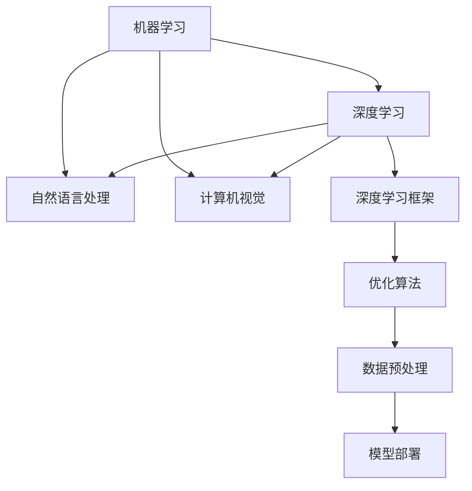

                 

# 人工智能 原理与代码实例讲解

> 关键词：人工智能,机器学习,深度学习,自然语言处理(NLP),计算机视觉,深度学习框架,优化算法,数据预处理,模型部署

## 1. 背景介绍

### 1.1 问题由来
人工智能(AI)作为当前科技发展的前沿领域，正在深刻改变我们的生活方式。从自动驾驶汽车到个性化推荐系统，从智能客服到医疗诊断，人工智能技术在各行各业广泛应用，极大地提升了效率和生产力。其中，机器学习(ML)和深度学习(DL)是人工智能的核心技术，提供了从数据到智能系统的桥梁。

深度学习特别是深度神经网络(DNN)在图像识别、语音识别、自然语言处理等领域取得了革命性的突破。通过构建大规模的神经网络模型，并利用大量标注数据进行训练，深度学习能够学习复杂的非线性模式，从而实现自动化决策和推理。

本文将系统介绍人工智能的基本原理，并结合代码实例，深入讲解深度学习框架的应用，帮助读者理解和掌握人工智能技术的关键概念和实现技巧。

### 1.2 问题核心关键点
人工智能的核心在于利用算法和大数据，构建能够模拟人类智能的计算模型。其核心关键点包括：

- 机器学习：通过算法从数据中学习规律，进而进行预测、分类等任务。
- 深度学习：一种基于神经网络的机器学习方法，利用多层非线性变换，能够处理更复杂的数据结构。
- 自然语言处理(NLP)：处理和理解人类语言的技术，包括文本分类、情感分析、机器翻译等。
- 计算机视觉(CV)：识别、理解和生成图像、视频等视觉数据的技术，包括图像分类、目标检测等。
- 深度学习框架：如TensorFlow、PyTorch等，提供了高效构建、训练和部署深度学习模型的工具。
- 优化算法：如梯度下降、Adam等，用于训练深度学习模型，确保模型参数优化。
- 数据预处理：数据清洗、特征提取、数据增强等技术，保证数据质量和一致性。
- 模型部署：将训练好的模型转化为可用的服务或应用，实现实际应用场景。

这些关键点共同构成了人工智能技术的核心，并推动了其在各领域的应用和发展。

### 1.3 问题研究意义
理解人工智能的原理和实现方法，对开发和部署AI应用具有重要意义：

1. 降低开发成本。通过学习人工智能的基本原理，开发者能够快速上手各类AI技术，减少从头开发所需的时间和人力成本。
2. 提升模型效果。掌握深度学习框架和优化算法，可以设计更高效、更精确的模型，提升AI应用的表现。
3. 加速应用开发。理解机器学习的基本流程，可以快速迭代模型和算法，缩短开发周期。
4. 推动技术创新。人工智能技术正在快速发展，掌握其核心原理，能够跟上最新的技术趋势，推动自身技术进步。
5. 赋能产业升级。人工智能技术在各行各业的应用，能够显著提升工作效率，加速产业数字化转型。

## 2. 核心概念与联系

### 2.1 核心概念概述

人工智能涉及众多概念和术语，本文将系统介绍其中几个关键概念，并探讨它们之间的联系：

- 机器学习(Machine Learning, ML)：一种从数据中学习规律，用于预测、分类、聚类等任务的技术。
- 深度学习(Deep Learning, DL)：一种基于神经网络的机器学习方法，利用多层非线性变换，能够处理更复杂的数据结构。
- 自然语言处理(Natural Language Processing, NLP)：处理和理解人类语言的技术，包括文本分类、情感分析、机器翻译等。
- 计算机视觉(Computer Vision, CV)：识别、理解和生成图像、视频等视觉数据的技术，包括图像分类、目标检测等。
- 深度学习框架：如TensorFlow、PyTorch等，提供了高效构建、训练和部署深度学习模型的工具。
- 优化算法：如梯度下降、Adam等，用于训练深度学习模型，确保模型参数优化。

这些概念之间的逻辑关系可以通过以下Mermaid流程图来展示：



这个流程图展示了机器学习、深度学习、自然语言处理、计算机视觉等核心概念之间的相互关系。深度学习框架和优化算法是实现这些概念的关键工具，数据预处理和模型部署则是从模型训练到实际应用的全流程重要环节。

## 3. 核心算法原理 & 具体操作步骤
### 3.1 算法原理概述

人工智能的核心算法包括监督学习、无监督学习和强化学习。其中，深度学习主要采用监督学习范式，通过标注数据进行训练。

深度学习模型的基本结构为多层神经网络，每一层都对输入数据进行线性变换和非线性变换。通过反向传播算法，模型不断调整参数，最小化损失函数，以优化模型性能。

深度学习模型通常由输入层、若干隐藏层和输出层组成。每个神经元接收来自前一层的输出作为输入，通过权重和偏置进行线性变换，并加入激活函数进行非线性变换。模型的目标是最小化预测输出与真实标签之间的差异，通常采用交叉熵损失函数。

### 3.2 算法步骤详解

深度学习模型的训练过程主要包括以下几个关键步骤：

**Step 1: 准备数据**
- 收集和预处理训练数据集，包括数据清洗、特征提取、数据增强等。
- 划分训练集、验证集和测试集。

**Step 2: 设计模型架构**
- 选择合适的深度学习框架，如TensorFlow、PyTorch等，定义模型的层数和结构。
- 定义损失函数，如交叉熵、均方误差等，衡量模型预测输出与真实标签之间的差异。

**Step 3: 初始化模型参数**
- 使用随机初始化方法，如Xavier初始化，对模型参数进行初始化。

**Step 4: 训练模型**
- 使用优化算法，如梯度下降、Adam等，最小化损失函数，更新模型参数。
- 周期性在验证集上评估模型性能，避免过拟合。

**Step 5: 测试和部署**
- 在测试集上评估模型性能，对比训练前后的精度提升。
- 使用训练好的模型进行实际应用，如图像分类、文本生成等。

### 3.3 算法优缺点

深度学习在图像识别、语音识别、自然语言处理等领域取得了卓越的性能，但也存在以下缺点：

- **过拟合风险**：深度学习模型往往具有较多参数，容易过拟合训练数据。
- **计算成本高**：深度学习模型训练和推理的计算成本较高，需要高性能设备支持。
- **数据依赖性高**：深度学习模型的效果高度依赖于标注数据的质量和数量。
- **模型可解释性不足**：深度学习模型的决策过程难以解释，缺乏透明度。
- **泛化能力受限**：深度学习模型在泛化新数据集上的表现可能不佳，尤其是数据分布变化较大的场景。

尽管存在这些缺点，但深度学习仍然是目前最为有效的AI技术之一，其强大的学习和推理能力，已经广泛应用于各个领域。

### 3.4 算法应用领域

深度学习在多个领域得到了广泛应用，例如：

- **计算机视觉**：图像分类、目标检测、图像生成等。通过深度学习模型，可以从原始图像数据中学习到丰富的视觉特征，实现高效图像处理和分析。
- **自然语言处理**：文本分类、情感分析、机器翻译、对话系统等。深度学习模型能够处理和理解自然语言，实现自动化文本处理和理解。
- **语音识别**：语音转文本、说话人识别等。深度学习模型能够处理音频信号，实现高效语音识别和生成。
- **推荐系统**：用户行为分析、物品推荐等。深度学习模型能够学习用户和物品的特征关系，实现精准推荐。
- **游戏AI**：决策制定、路径规划等。深度学习模型能够实现高效的游戏AI，提升游戏体验。

以上应用领域展示了深度学习技术的强大实力，为人工智能技术在各行业的发展提供了坚实基础。

## 4. 数学模型和公式 & 详细讲解
### 4.1 数学模型构建

深度学习模型通常采用多层神经网络结构，包括输入层、隐藏层和输出层。模型的基本目标是最大化似然函数，即在给定输入 $x$ 的情况下，最大化输出 $y$ 的概率。

以一个简单的二分类任务为例，模型的输入为 $x$，输出为 $y \in \{0, 1\}$，目标是最小化交叉熵损失函数：

$$
\mathcal{L}(\theta) = -\frac{1}{N}\sum_{i=1}^N [y_i \log \hat{y}_i + (1-y_i) \log(1-\hat{y}_i)]
$$

其中 $y_i$ 表示样本的真实标签，$\hat{y}_i$ 表示模型对样本的预测概率，$N$ 表示样本数量。

模型的参数 $\theta$ 包括隐藏层的权重 $W$ 和偏置 $b$。通过反向传播算法，模型不断调整参数，最小化损失函数，从而提升模型性能。

### 4.2 公式推导过程

以一个简单的多层神经网络为例，进行数学推导。假设模型由 $L$ 层神经网络组成，其中第 $l$ 层的输出为 $z_l$，隐藏层的激活函数为 $\sigma$，输出层的激活函数为 $g$。模型的输入为 $x$，输出为 $y$。

模型的损失函数为交叉熵损失函数，定义为：

$$
\mathcal{L}(\theta) = -\frac{1}{N}\sum_{i=1}^N [y_i \log g(z_L) + (1-y_i) \log(1-g(z_L))]
$$

其中 $z_L$ 为输出层隐藏层的输出，$g(z_L)$ 为输出层的激活函数。

模型的参数 $\theta$ 包括所有隐藏层的权重 $W_l$ 和偏置 $b_l$。通过反向传播算法，计算损失函数对各层参数的梯度，更新模型参数：

$$
\frac{\partial \mathcal{L}}{\partial W_l} = \frac{\partial \mathcal{L}}{\partial z_l} \frac{\partial z_l}{\partial W_l}
$$

$$
\frac{\partial \mathcal{L}}{\partial b_l} = \frac{\partial \mathcal{L}}{\partial z_l} \frac{\partial z_l}{\partial b_l}
$$

其中 $\frac{\partial \mathcal{L}}{\partial z_l}$ 为损失函数对隐藏层 $l$ 的梯度，$\frac{\partial z_l}{\partial W_l}$ 和 $\frac{\partial z_l}{\partial b_l}$ 为隐藏层 $l$ 的梯度，通过链式法则计算得到。

### 4.3 案例分析与讲解

以一个简单的图像分类任务为例，进行案例分析。假设任务是识别图像中是否包含猫，数据集包含1000张猫的图片和1000张非猫的图片。模型的输入为图片像素值，输出为0或1。

首先，将原始图片像素值标准化为均值为0，方差为1的特征向量，作为模型的输入。然后，使用卷积神经网络(CNN)对图片进行处理，得到特征向量 $z_L$。最后，使用全连接层输出分类结果，经过softmax激活函数得到预测概率 $y$。

模型训练的目标是最小化交叉熵损失函数，使用Adam优化算法进行训练。训练过程包括前向传播计算损失函数，反向传播计算参数梯度，使用梯度下降更新模型参数。

在训练过程中，模型会自动调整隐藏层的权重和偏置，以最小化损失函数。训练完成后，模型可以对新图片进行分类预测，得到0或1的输出。

## 5. 项目实践：代码实例和详细解释说明
### 5.1 开发环境搭建

在进行深度学习项目开发前，需要准备好开发环境。以下是使用Python进行TensorFlow开发的环境配置流程：

1. 安装Anaconda：从官网下载并安装Anaconda，用于创建独立的Python环境。

2. 创建并激活虚拟环境：
```bash
conda create -n tf-env python=3.8 
conda activate tf-env
```

3. 安装TensorFlow：根据CUDA版本，从官网获取对应的安装命令。例如：
```bash
conda install tensorflow-gpu=2.6.0 -c tf -c conda-forge
```

4. 安装各类工具包：
```bash
pip install numpy pandas scikit-learn matplotlib tqdm jupyter notebook ipython
```

完成上述步骤后，即可在`tf-env`环境中开始深度学习项目开发。

### 5.2 源代码详细实现

下面我们以一个简单的图像分类任务为例，给出使用TensorFlow对卷积神经网络(CNN)进行图像分类的代码实现。

首先，定义CNN模型的数据处理函数：

```python
import tensorflow as tf

def preprocess_image(image, label):
    image = tf.image.resize(image, [224, 224])
    image = tf.image.per_image_standardization(image)
    return image, label
```

然后，定义模型和优化器：

```python
from tensorflow.keras.applications import VGG16
from tensorflow.keras.layers import Dense, Flatten, Input
from tensorflow.keras.models import Model

input_shape = (224, 224, 3)

# 加载预训练模型
base_model = VGG16(weights='imagenet', include_top=False, input_shape=input_shape)

# 定义输出层
x = Flatten()(base_model.output)
x = Dense(256, activation='relu')(x)
output = Dense(1, activation='sigmoid')(x)

# 构建模型
model = Model(inputs=base_model.input, outputs=output)

# 冻结预训练权重
for layer in base_model.layers:
    layer.trainable = False

# 设置优化器和损失函数
optimizer = tf.keras.optimizers.Adam(learning_rate=0.001)
loss_fn = tf.keras.losses.BinaryCrossentropy()

# 编译模型
model.compile(optimizer=optimizer, loss=loss_fn, metrics=['accuracy'])
```

接着，定义训练和评估函数：

```python
from tensorflow.keras.preprocessing.image import ImageDataGenerator

train_datagen = ImageDataGenerator(rescale=1./255)
test_datagen = ImageDataGenerator(rescale=1./255)

train_generator = train_datagen.flow_from_directory(train_dir, target_size=input_shape[:2], batch_size=32, class_mode='binary')
test_generator = test_datagen.flow_from_directory(test_dir, target_size=input_shape[:2], batch_size=32, class_mode='binary')

def train_epoch(model, train_generator, validation_generator, epochs):
    for epoch in range(epochs):
        model.fit(train_generator, epochs=1, validation_data=validation_generator)
        val_loss, val_acc = model.evaluate(validation_generator)
        print(f'Epoch {epoch+1}, Val Loss: {val_loss:.4f}, Val Accuracy: {val_acc:.4f}')

# 训练模型
train_epoch(model, train_generator, test_generator, 10)
```

以上就是使用TensorFlow对CNN进行图像分类的完整代码实现。可以看到，TensorFlow的Keras API提供了丰富的组件和工具，使得深度学习模型的构建和训练过程更加便捷高效。

### 5.3 代码解读与分析

让我们再详细解读一下关键代码的实现细节：

**preprocess_image函数**：
- 定义了图像预处理函数，包括图像缩放、标准化等步骤，确保输入数据的一致性。

**VGG16模型**：
- 使用VGG16预训练模型作为特征提取器，通过设置`include_top=False`，只使用模型的卷积层，去除全连接层。

**输出层定义**：
- 在模型的输出层前添加全连接层，用于将特征向量映射到分类概率。

**模型构建**：
- 使用Keras的`Model`类构建完整的模型，将预训练模型的输入和输出与输出层连接起来。

**权重冻结**：
- 将预训练模型的权重设置为不可训练，以保留已学到的特征。

**优化器和损失函数**：
- 使用Adam优化器，设置学习率，选择合适的损失函数进行训练。

**模型编译**：
- 使用`compile`方法对模型进行编译，设置优化器、损失函数和评估指标。

**训练函数**：
- 使用`flow_from_directory`方法加载数据集，使用`ImageDataGenerator`进行数据增强，构建数据生成器。
- 在每个epoch内，使用`fit`方法进行训练，设置验证集，输出验证集上的损失和精度。

**训练流程**：
- 定义总的epoch数，循环迭代进行训练。
- 在每个epoch内，使用`fit`方法进行训练，输出验证集上的损失和精度。
- 重复上述过程直至收敛。

可以看到，TensorFlow的Keras API使得深度学习模型的开发和训练过程非常简洁和高效。开发者可以将更多精力放在模型架构的设计和优化上，而不必过多关注底层实现细节。

当然，工业级的系统实现还需考虑更多因素，如模型的保存和部署、超参数的自动搜索、更多的数据增强技巧等。但核心的深度学习范式基本与此类似。

## 6. 实际应用场景
### 6.1 智能客服系统

基于深度学习技术的智能客服系统，能够处理大量客户咨询，提升客户体验和服务效率。传统客服往往需要配备大量人力，高峰期响应缓慢，且一致性和专业性难以保证。

使用深度学习模型构建的智能客服系统，可以通过历史客服对话记录进行预训练，学习如何自动理解客户意图，匹配最合适的回答模板。对于客户提出的新问题，还可以接入检索系统实时搜索相关内容，动态组织生成回答。

### 6.2 金融舆情监测

金融机构需要实时监测市场舆论动向，以便及时应对负面信息传播，规避金融风险。传统的人工监测方式成本高、效率低，难以应对网络时代海量信息爆发的挑战。

基于深度学习技术的文本分类和情感分析技术，可以从金融领域相关的新闻、报道、评论等文本数据中，自动识别其情感倾向，判断市场情绪变化趋势，一旦发现负面信息激增等异常情况，系统便会自动预警，帮助金融机构快速应对潜在风险。

### 6.3 个性化推荐系统

当前的推荐系统往往只依赖用户的历史行为数据进行物品推荐，无法深入理解用户的真实兴趣偏好。基于深度学习技术的推荐系统，可以更好地挖掘用户行为背后的语义信息，从而提供更精准、多样的推荐内容。

在实践中，可以收集用户浏览、点击、评论、分享等行为数据，提取和用户交互的物品标题、描述、标签等文本内容。将文本内容作为模型输入，用户的后续行为（如是否点击、购买等）作为监督信号，在此基础上训练深度学习模型。训练好的模型能够从文本内容中准确把握用户的兴趣点。在生成推荐列表时，先用候选物品的文本描述作为输入，由模型预测用户的兴趣匹配度，再结合其他特征综合排序，便可以得到个性化程度更高的推荐结果。

### 6.4 未来应用展望

深度学习技术在各行各业的应用前景广阔。未来，基于深度学习的应用将更加广泛，涵盖更多的领域和场景，带来更深层次的变革。

在智慧医疗领域，基于深度学习技术的医学影像分析、智能诊断等应用，将提升医疗服务的智能化水平，辅助医生诊疗，加速新药开发进程。

在智能教育领域，深度学习技术可应用于作业批改、学情分析、知识推荐等方面，因材施教，促进教育公平，提高教学质量。

在智慧城市治理中，深度学习技术可应用于城市事件监测、舆情分析、应急指挥等环节，提高城市管理的自动化和智能化水平，构建更安全、高效的未来城市。

此外，在企业生产、社会治理、文娱传媒等众多领域，基于深度学习的人工智能应用也将不断涌现，为NLP技术带来全新的突破。

## 7. 工具和资源推荐
### 7.1 学习资源推荐

为了帮助开发者系统掌握深度学习的基本原理和实践技巧，这里推荐一些优质的学习资源：

1. 《深度学习》（Ian Goodfellow著）：全面介绍了深度学习的理论和实践，是深度学习领域的经典教材。
2. CS231n《深度学习与计算机视觉》课程：斯坦福大学开设的深度学习与计算机视觉课程，有Lecture视频和配套作业，带你入门深度学习的基本概念和经典模型。
3. 《TensorFlow实战》（Manning Publications）：详细介绍了TensorFlow的各个组件和工具，帮助你快速上手深度学习模型的开发。
4. PyTorch官方文档：PyTorch的官方文档，提供了丰富的教程、示例和API文档，是PyTorch学习的必备资源。
5. Kaggle竞赛平台：Kaggle提供了大量深度学习竞赛和数据集，是深度学习实践的好去处。

通过对这些资源的学习实践，相信你一定能够快速掌握深度学习的基本原理，并用于解决实际的深度学习问题。

### 7.2 开发工具推荐

高效的深度学习开发离不开优秀的工具支持。以下是几款用于深度学习开发的常用工具：

1. TensorFlow：由Google主导开发的深度学习框架，生产部署方便，适合大规模工程应用。
2. PyTorch：由Facebook主导开发的深度学习框架，灵活高效，适合科研和原型开发。
3. Keras：高层次的深度学习API，易于上手，支持多种后端（如TensorFlow、Theano等），适合快速原型开发。
4. Jupyter Notebook：免费的开源工具，支持代码、文本、图像等多种格式，适合进行交互式开发和数据探索。
5. Anaconda：Python环境的集成管理系统，方便创建和管理多个Python环境，支持各种库和工具的安装。

合理利用这些工具，可以显著提升深度学习模型的开发效率，加快创新迭代的步伐。

### 7.3 相关论文推荐

深度学习技术的发展离不开学界的持续研究。以下是几篇奠基性的相关论文，推荐阅读：

1. AlexNet：ImageNet大规模视觉识别挑战赛的胜利者，开创了卷积神经网络在图像识别中的时代。
2. RNN：循环神经网络，解决了传统神经网络处理序列数据的问题，广泛应用于自然语言处理等领域。
3. ResNet：残差网络，解决了深度神经网络中的梯度消失问题，使得深度网络的训练和优化更加稳定。
4. Attention Mechanism：注意力机制，提升了序列建模的准确性和效率，被广泛应用于机器翻译、语音识别等领域。
5. GAN：生成对抗网络，能够生成高质量的图像、视频等，开创了生成模型的新方向。

这些论文代表了大深度学习技术的发展脉络。通过学习这些前沿成果，可以帮助研究者把握学科前进方向，激发更多的创新灵感。

## 8. 总结：未来发展趋势与挑战
### 8.1 总结

本文对深度学习的原理和实践进行了系统介绍。首先阐述了深度学习的基本概念和算法原理，然后通过代码实例展示了深度学习模型的开发和训练过程。文章还讨论了深度学习在多个领域的应用，展示了其广泛的前景。

通过本文的系统梳理，可以看到，深度学习技术在图像识别、语音识别、自然语言处理等领域取得了革命性的突破，极大地提升了各个行业的智能化水平。未来，随着深度学习技术的不断进步，其在各行各业的应用将更加广泛，带来更深层次的变革。

### 8.2 未来发展趋势

深度学习技术的未来发展趋势包括以下几个方面：

1. **模型规模持续增大**：随着算力成本的下降和数据规模的扩张，深度学习模型的参数量还将持续增长。超大模型的语言表示能力，将为深度学习提供更强大的知识基础。
2. **模型可解释性提升**：为了满足实际应用中的需求，未来的深度学习模型将更加注重可解释性，引入符号化知识、因果推断等技术，增强模型的透明度和可理解性。
3. **多模态深度学习**：将视觉、语音、文本等多种模态数据融合，提升模型的综合感知能力，推动深度学习在更多领域的应用。
4. **迁移学习和联邦学习**：通过迁移学习和联邦学习，深度学习模型能够跨领域、跨设备共享知识，提升模型的泛化能力和隐私保护。
5. **自监督学习**：利用无标签数据进行自监督学习，减少对标注数据的依赖，提升模型训练的效率和效果。

这些趋势将推动深度学习技术在各个领域的应用，为人工智能的发展带来新的突破。

### 8.3 面临的挑战

尽管深度学习技术已经取得了巨大成功，但在向更广泛的应用领域扩展时，仍然面临诸多挑战：

1. **计算资源需求高**：深度学习模型的训练和推理需要高性能设备支持，高计算成本限制了其在大规模生产环境中的应用。
2. **数据质量和多样性不足**：深度学习模型对数据的质量和多样性要求较高，标注数据不足或标注质量差都会影响模型性能。
3. **模型鲁棒性和泛化能力不足**：深度学习模型在面对新数据或数据分布变化时，泛化能力往往较弱，容易发生过拟合或欠拟合。
4. **模型可解释性和透明度不足**：深度学习模型通常被视为"黑盒"，难以解释其内部工作机制和决策逻辑。
5. **数据隐私和安全问题**：深度学习模型的训练和使用涉及大量个人数据，数据隐私和安全问题需要得到重视。

这些挑战需要在未来的研究中加以解决，才能使深度学习技术更好地服务于实际应用。

### 8.4 研究展望

面向未来，深度学习技术需要在以下几个方面寻求新的突破：

1. **高效模型和算法**：开发更加高效、可解释的深度学习模型和算法，提升模型的训练和推理效率。
2. **融合符号化知识**：将符号化知识与深度学习模型融合，提升模型的逻辑推理和可解释性。
3. **跨模态深度学习**：将视觉、语音、文本等多种模态数据融合，提升模型的综合感知能力。
4. **自监督学习**：利用无标签数据进行自监督学习，减少对标注数据的依赖，提升模型训练的效率和效果。
5. **联邦学习和隐私保护**：通过联邦学习等技术，提升深度学习模型的跨设备和跨领域协作能力，同时保护数据隐私。

这些研究方向的探索，将引领深度学习技术迈向更高的台阶，为人工智能技术的发展提供新的动力。

## 9. 附录：常见问题与解答

**Q1: 深度学习模型在训练过程中容易出现过拟合，有哪些方法可以缓解这一问题？**

A: 深度学习模型在训练过程中容易出现过拟合，有以下几种方法可以缓解：

1. **数据增强**：通过对训练数据进行随机变换，如旋转、裁剪、翻转等，增加数据的多样性，减少模型对数据的依赖。
2. **正则化**：通过L1、L2正则化等技术，限制模型参数的大小，防止过拟合。
3. **Dropout**：在训练过程中随机丢弃部分神经元，强制模型学习多个子集，提升泛化能力。
4. **Early Stopping**：在验证集上监控模型性能，当性能不再提升时停止训练，避免过拟合。
5. **Batch Normalization**：在每个批次的输入上规范化数据，提升模型的稳定性和训练速度。

这些方法可以结合使用，根据具体任务和模型结构进行优化选择。

**Q2: 深度学习模型在推理阶段是否比传统模型更快？**

A: 深度学习模型在推理阶段通常比传统模型更快。这是因为深度学习模型在推理阶段不需要重新计算所有参数，而是直接使用模型权重进行快速计算。但在大规模数据集上，深度学习模型由于参数量较大，其推理速度较慢，需要高性能设备支持。

**Q3: 深度学习模型的训练过程中有哪些常见问题？**

A: 深度学习模型的训练过程中，常见问题包括：

1. **梯度消失或爆炸**：在深层网络中，梯度容易消失或爆炸，导致模型难以训练。可以通过Batch Normalization、残差连接等技术解决。
2. **学习率选择不当**：学习率过高或过低都会影响模型的训练效果。通常采用自适应学习率算法，如Adam、Adagrad等，自动调整学习率。
3. **过拟合或欠拟合**：过拟合或欠拟合都会影响模型性能。需要通过正则化、数据增强等技术，提升模型的泛化能力。
4. **模型选择不当**：模型结构或参数量不合适，会导致训练效果不佳。需要通过实验验证，选择适合的模型结构和超参数。

这些常见问题需要在训练过程中不断调试和优化，才能提升模型的训练效果。

**Q4: 深度学习模型的可解释性如何提升？**

A: 深度学习模型的可解释性可以通过以下方法提升：

1. **简化模型结构**：将复杂的深度网络简化为更易解释的模型，如决策树、线性回归等。
2. **引入符号化知识**：将符号化知识与深度学习模型融合，提升模型的逻辑推理能力。
3. **使用可解释的模型**：如LIME、SHAP等，解释深度学习模型的预测过程。
4. **模型可视化**：通过可视化工具，展示模型的权重分布、激活图等，帮助理解模型的工作机制。

这些方法可以结合使用，提升深度学习模型的可解释性和透明度。

**Q5: 深度学习模型如何应用于推荐系统？**

A: 深度学习模型可以应用于推荐系统，主要通过以下步骤：

1. **用户行为数据采集**：收集用户的历史浏览、点击、购买等行为数据。
2. **用户和物品特征提取**：将用户和物品的特征提取为向量，作为模型的输入。
3. **模型训练**：使用深度学习模型，如神经网络、自编码器等，训练用户行为预测模型。
4. **推荐生成**：在用户输入新查询时，使用训练好的模型预测用户对物品的兴趣，生成推荐列表。

在推荐系统中，深度学习模型能够学习用户和物品的复杂关系，提供更精准、多样的推荐结果。

---

作者：禅与计算机程序设计艺术 / Zen and the Art of Computer Programming

