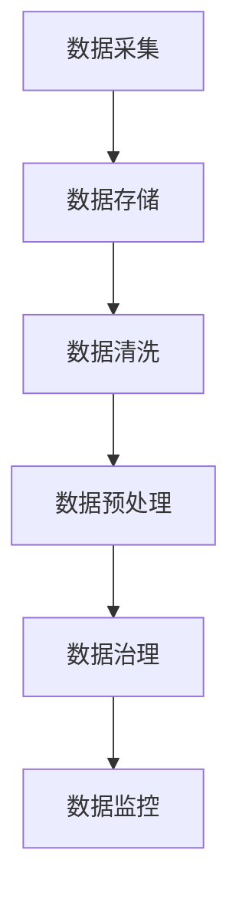

                 

# 人工智能创业数据管理的策略与措施研究

在人工智能（AI）创业的浪潮中，数据管理成为了至关重要的一环。对于AI创业者而言，掌握高效、系统的数据管理策略不仅能够提升模型性能，还能优化开发流程，加速产品上市。本文旨在深入探讨AI创业中的数据管理策略与措施，帮助创业者在数据采集、存储、处理、治理等环节游刃有余，确保AI技术的成功落地。

## 1. 背景介绍

### 1.1 数据在人工智能中的地位
在AI领域，数据被誉为“石油”。深度学习模型依赖大量高质量的数据进行训练，才能获得优秀的性能表现。因此，对于AI创业者而言，获取、管理和利用数据的能力，直接决定了其项目的成败。

### 1.2 数据管理的挑战
尽管数据在AI中的重要性不言而喻，但数据管理的复杂性和多变性也带来了挑战。数据的来源多样、格式各异、分布广泛，如何高效采集、存储、处理、治理数据，成为创业者需要解决的重大问题。

## 2. 核心概念与联系

### 2.1 核心概念概述

为便于理解数据管理的策略与措施，本节将介绍几个关键概念：

- **数据管理**：涵盖数据采集、存储、处理、治理等多个环节，旨在确保数据的可用性、完整性、准确性和安全性。
- **数据湖**：一个集中存储各种数据类型的分布式文件系统，支持大规模数据的存储和分析。
- **数据清洗**：去除数据中的噪声、重复、错误和异常值，确保数据的质量。
- **数据预处理**：将原始数据转换为模型可以使用的格式，如归一化、特征工程等。
- **数据治理**：通过制定规范、实施监控和管理措施，确保数据的质量和安全。

这些核心概念通过数据管理这一核心流程串联起来，形成了完整的AI数据管理框架。

### 2.2 核心概念联系

数据管理的各个环节之间相互关联，共同构成了数据管理的整体流程。数据采集和存储是数据管理的基础，数据清洗和预处理是提升数据质量的关键步骤，而数据治理则是确保数据管理合规和可持续发展的保障。

通过以下Mermaid流程图，可以更直观地理解这些环节之间的联系：



这个流程图展示了数据管理的流程：数据从采集开始，依次经过存储、清洗、预处理、治理等环节，最终实现对数据的有效管理和监控。

## 3. 核心算法原理 & 具体操作步骤

### 3.1 算法原理概述

AI创业中的数据管理，主要依赖于以下算法原理：

- **数据分布式存储**：采用分布式文件系统（如Hadoop、Spark）存储大规模数据，确保数据的可扩展性和容错性。
- **数据清洗算法**：包括缺失值填充、异常值检测和处理等算法，确保数据的质量。
- **数据预处理技术**：如归一化、标准化、特征选择和特征提取等，将原始数据转换为模型可用的格式。
- **数据治理策略**：包括数据质量监控、数据安全和合规性管理等策略，确保数据管理的合规性和持续性。

### 3.2 算法步骤详解

#### 数据采集
- **步骤1**：确定数据采集目标和来源。根据项目需求，明确需要采集的数据类型和来源，确保数据的全面性和代表性。
- **步骤2**：选择适合的数据采集工具。如爬虫工具、API接口、数据库导出等，根据数据来源和采集方式选择合适的工具。
- **步骤3**：编写数据采集脚本。根据采集目标和工具，编写详细的采集脚本，确保数据的准确性和完整性。

#### 数据存储
- **步骤1**：选择合适的存储系统。根据数据量大小和访问频率，选择合适的分布式文件系统（如Hadoop、Spark）进行数据存储。
- **步骤2**：设计数据存储架构。根据数据存储需求，设计数据存储架构，包括分区、索引等。
- **步骤3**：实施数据存储。将采集到的数据按照设计好的架构存储到分布式文件系统中。

#### 数据清洗
- **步骤1**：定义数据清洗规则。根据数据特点，定义清洗规则，包括缺失值处理、异常值检测和处理等。
- **步骤2**：编写数据清洗脚本。根据清洗规则，编写详细的清洗脚本，确保数据的质量。
- **步骤3**：执行数据清洗。运行数据清洗脚本，对数据进行清洗，去除噪声、重复、错误和异常值。

#### 数据预处理
- **步骤1**：选择预处理技术。根据数据特点，选择合适的预处理技术，如归一化、标准化、特征选择和特征提取等。
- **步骤2**：编写预处理脚本。根据预处理技术，编写详细的预处理脚本，确保数据的格式一致。
- **步骤3**：执行数据预处理。运行预处理脚本，对数据进行预处理，转换为模型可用的格式。

#### 数据治理
- **步骤1**：制定数据治理策略。根据数据特点，制定数据治理策略，包括数据质量监控、数据安全和合规性管理等。
- **步骤2**：实施数据治理措施。根据数据治理策略，实施相应的措施，确保数据管理的合规性和持续性。
- **步骤3**：进行数据监控和评估。实时监控数据质量和安全，定期评估数据治理措施的效果，确保数据管理的有效性和持续性。

### 3.3 算法优缺点

#### 优点
- **可扩展性**：分布式文件系统确保了数据的可扩展性，能够存储和处理大规模数据。
- **高容错性**：分布式系统具备高容错性，确保数据存储的稳定性和可靠性。
- **数据质量提升**：数据清洗和预处理技术确保了数据的质量，提升了模型性能。
- **治理合规性**：数据治理策略确保了数据的合规性和安全性，减少了法律风险。

#### 缺点
- **复杂性高**：数据管理的复杂性高，需要综合考虑数据采集、存储、清洗、预处理等多个环节。
- **技术门槛高**：需要掌握分布式系统、数据清洗和预处理等技术，技术门槛较高。
- **成本高**：需要投入大量的时间和资金进行数据管理，成本较高。

### 3.4 算法应用领域

基于上述算法原理和操作步骤，AI创业中的数据管理在以下几个领域具有广泛的应用：

- **金融科技**：在金融风控、智能投顾、信用评估等领域，数据管理至关重要。通过高效的数据采集和治理，能够提升模型的性能和应用的稳定性。
- **医疗健康**：在医疗影像分析、电子病历管理、智能诊断等领域，数据管理能够确保数据的质量和安全，提升医疗服务的精准度。
- **智能制造**：在设备监控、质量控制、生产优化等领域，数据管理能够实现数据的全面采集和分析，提升生产效率和产品质量。
- **智能家居**：在智能设备互联、家居自动化、智能安防等领域，数据管理能够实现数据的实时采集和分析，提升家居生活的智能化水平。
- **智慧城市**：在交通管理、公共安全、城市规划等领域，数据管理能够实现数据的全面采集和分析，提升城市管理的智能化水平。

## 4. 数学模型和公式 & 详细讲解 & 举例说明

### 4.1 数学模型构建

为了更好地理解AI创业中的数据管理策略，本节将构建一个简单的数学模型，以数据清洗为例。

假设我们有一个包含N个样本的数据集，每个样本有M个特征。数据集中存在一些异常值，我们需要使用均值和方差来去除异常值，保留质量较好的数据。

定义数据集 $\mathbf{X}=\{(x_i,y_i)\}_{i=1}^N, x_i \in \mathbb{R}^M, y_i \in \{0,1\}$，其中 $y_i$ 表示样本是否为异常值，$x_i$ 表示样本特征。

定义数据清洗后的结果为 $\mathbf{\tilde{X}}=\{(\tilde{x}_i)\}_{i=1}^N, \tilde{x}_i \in \mathbb{R}^M$。

### 4.2 公式推导过程

我们需要定义一个函数 $f(x_i)$ 来计算每个样本的异常值程度。常用的方法是计算样本的Z分数，即将每个特征值标准化，然后计算其Z分数。Z分数的计算公式为：

$$
z_i = \frac{x_i - \mu}{\sigma}
$$

其中 $\mu$ 和 $\sigma$ 分别为特征 $i$ 的均值和标准差。

对于每个样本 $x_i$，计算其所有特征的Z分数，然后取绝对值的最大值，即得到样本的异常值程度：

$$
d_i = \max_j|z_j|
$$

定义一个阈值 $\tau$，当 $d_i > \tau$ 时，认为样本为异常值。设置阈值的方法有多种，常用的方法是基于经验或者先验知识，如 $k$ 近邻法、统计学方法等。

对于每个样本 $x_i$，如果 $y_i=1$，则认为其是异常值，将其删除。如果 $y_i=0$，则认为其是正常值，保留。

### 4.3 案例分析与讲解

假设我们有一个包含100个样本的数据集，每个样本有3个特征。其中，前20个样本为异常值。

首先，计算每个样本的均值和标准差：

$$
\mu_1 = 10, \sigma_1 = 2 \\
\mu_2 = 20, \sigma_2 = 5 \\
\mu_3 = 30, \sigma_3 = 3
$$

然后，计算每个样本的Z分数，并取绝对值的最大值，得到每个样本的异常值程度：

$$
\begin{align*}
d_1 &= \max(|z_1|, |z_2|, |z_3|) = \max(|10 - 10|/2, |20 - 20|/5, |30 - 30|/3|) = 0 \\
d_2 &= \max(|z_1|, |z_2|, |z_3|) = \max(|10 - 20|/2, |20 - 20|/5, |30 - 30|/3|) = 1 \\
d_3 &= \max(|z_1|, |z_2|, |z_3|) = \max(|10 - 30|/2, |20 - 20|/5, |30 - 30|/3|) = 1 \\
\end{align*}
$$

其中，$d_1$ 为正常值，$d_2$ 和 $d_3$ 为异常值。

最后，删除所有异常值，得到清洗后的数据集 $\mathbf{\tilde{X}}=\{(\tilde{x}_1, \tilde{x}_2, \tilde{x}_3)\}_{i=1}^80$。

## 5. 项目实践：代码实例和详细解释说明

### 5.1 开发环境搭建

在进行数据管理实践前，我们需要准备好开发环境。以下是使用Python进行Pandas、NumPy、Scikit-learn等工具的环境配置流程：

1. 安装Anaconda：从官网下载并安装Anaconda，用于创建独立的Python环境。

2. 创建并激活虚拟环境：
```bash
conda create -n data-management python=3.8 
conda activate data-management
```

3. 安装必要的工具包：
```bash
conda install pandas numpy scikit-learn matplotlib seaborn jupyter notebook
```

4. 安装Jupyter Notebook：
```bash
pip install jupyterlab
```

完成上述步骤后，即可在`data-management`环境中开始数据管理实践。

### 5.2 源代码详细实现

下面我们以数据清洗为例，给出使用Pandas、NumPy、Scikit-learn等工具对数据集进行清洗的Python代码实现。

```python
import pandas as pd
import numpy as np
from sklearn.preprocessing import StandardScaler

# 读取数据集
data = pd.read_csv('data.csv')

# 删除缺失值
data.dropna(inplace=True)

# 计算均值和标准差
scaler = StandardScaler()
data_scaled = scaler.fit_transform(data)

# 定义Z分数计算函数
def z_score(x):
    return (x - np.mean(x)) / np.std(x)

# 计算每个样本的Z分数，并取绝对值的最大值
data['z_score'] = data.apply(lambda x: max(map(z_score, x)), axis=1)

# 设置异常值阈值
threshold = 2

# 删除异常值
data = data[data['z_score'] <= threshold]

# 保存清洗后的数据
data.to_csv('cleaned_data.csv', index=False)
```

这个代码片段展示了数据清洗的完整流程，包括读取数据、删除缺失值、计算均值和标准差、计算Z分数、设置异常值阈值、删除异常值和保存清洗后的数据。

### 5.3 代码解读与分析

让我们再详细解读一下关键代码的实现细节：

**读取数据**：
- 使用Pandas的`read_csv`函数读取CSV文件，并将其存储到DataFrame对象`data`中。

**删除缺失值**：
- 使用`dropna`函数删除包含缺失值的行，确保数据集的完整性。

**计算均值和标准差**：
- 使用Scikit-learn的`StandardScaler`计算每个特征的均值和标准差，并将数据进行标准化。

**计算Z分数**：
- 定义一个函数`z_score`，计算每个特征的Z分数，即标准化后的值除以标准差。

**计算每个样本的Z分数，并取绝对值的最大值**：
- 使用`apply`函数和`map`函数，对每个样本的所有特征计算Z分数，并取绝对值的最大值，得到每个样本的异常值程度。

**设置异常值阈值**：
- 定义一个阈值`threshold`，用于判断样本是否为异常值。

**删除异常值**：
- 使用条件筛选，删除Z分数超过阈值的样本，得到清洗后的数据集。

**保存清洗后的数据**：
- 使用Pandas的`to_csv`函数将清洗后的数据保存到CSV文件中。

## 6. 实际应用场景

### 6.1 金融科技

在金融科技领域，数据管理对于风控、智能投顾、信用评估等应用至关重要。通过高效的数据采集和治理，金融科技公司能够提升模型的性能和应用的稳定性。

例如，一个智能投顾平台可以通过高效的数据管理，实时监测用户行为和市场数据，根据历史数据和实时信息，进行精准的投资建议和风险控制。同时，平台还可以通过用户行为数据，实现个性化推荐和动态定价，提升用户体验和平台收益。

### 6.2 医疗健康

在医疗健康领域，数据管理能够确保医疗数据的完整性和安全性，提升医疗服务的精准度和效率。

例如，一个智能诊断平台可以通过高效的数据管理，收集和分析大量的医疗影像和电子病历数据，帮助医生进行疾病诊断和治疗方案优化。平台还可以通过患者的实时数据，进行健康监测和预警，提升医疗服务的智能化水平。

### 6.3 智能制造

在智能制造领域，数据管理能够实现设备的全面监控和生产优化，提升生产效率和产品质量。

例如，一个智能制造系统可以通过高效的数据管理，实时监测设备运行状态和生产过程，进行故障预测和维护优化。系统还可以通过历史数据和实时信息，进行生产调度和资源优化，提升生产效率和产品质量。

### 6.4 未来应用展望

随着数据管理技术的不断进步，未来AI创业中的数据管理将呈现以下几个趋势：

1. **自动化数据采集和清洗**：借助自动化工具和算法，实现数据采集和清洗的自动化，减少人工干预，提升效率和准确性。
2. **多源数据融合**：将来自不同来源的数据进行融合，实现数据的全面和多样化，提升模型的性能和泛化能力。
3. **实时数据处理**：实现数据的实时采集和处理，及时响应用户需求和市场变化，提升应用的响应速度和用户体验。
4. **联邦学习**：通过联邦学习技术，实现数据在多方参与的情况下进行模型训练，保护数据隐私和安全。
5. **数据治理平台**：构建数据治理平台，实现数据的集中管理和治理，提升数据管理的规范性和可持续性。

## 7. 工具和资源推荐

### 7.1 学习资源推荐

为了帮助开发者系统掌握数据管理的理论基础和实践技巧，这里推荐一些优质的学习资源：

1. **《数据科学手册》**：是一本全面介绍数据科学基础和实践的书籍，涵盖数据采集、数据清洗、数据预处理、数据治理等多个方面。

2. **《Python数据科学手册》**：是一本介绍Python数据科学工具的书籍，包括Pandas、NumPy、Scikit-learn等工具的使用。

3. **《数据治理最佳实践》**：是一份数据治理指南，涵盖数据治理的策略、措施和实践，帮助企业构建数据治理体系。

4. **Kaggle**：是一个数据科学竞赛平台，提供大量开源数据集和数据管理案例，助力数据管理能力的提升。

5. **DataCamp**：是一个在线学习平台，提供数据科学和数据管理相关的课程，适合初学者和进阶学习者。

通过对这些资源的学习实践，相信你一定能够快速掌握数据管理的精髓，并用于解决实际的AI问题。

### 7.2 开发工具推荐

高效的数据管理离不开优秀的工具支持。以下是几款用于数据管理的常用工具：

1. **Pandas**：是一个强大的数据处理库，提供了丰富的数据清洗、数据预处理和数据分析功能。
2. **NumPy**：是一个数值计算库，提供了高效的数组和矩阵运算功能。
3. **Scikit-learn**：是一个机器学习库，提供了多种数据预处理和特征工程工具。
4. **Seaborn**：是一个数据可视化库，提供了丰富的图表展示功能，帮助分析数据趋势和关系。
5. **Jupyter Notebook**：是一个交互式编程环境，支持Python和其他编程语言的代码编写和数据展示。

合理利用这些工具，可以显著提升数据管理的开发效率，加快创新迭代的步伐。

### 7.3 相关论文推荐

数据管理技术的不断发展源于学界的持续研究。以下是几篇奠基性的相关论文，推荐阅读：

1. **《大数据时代下的数据管理》**：是一篇关于大数据时代下数据管理的综述论文，涵盖数据采集、存储、处理、治理等多个方面。
2. **《数据清洗和预处理技术综述》**：是一篇关于数据清洗和预处理技术的综述论文，涵盖多种数据清洗和预处理算法。
3. **《联邦学习在数据治理中的应用》**：是一篇关于联邦学习技术在数据治理中的应用论文，探讨了如何实现数据的分布式训练和治理。
4. **《自动化数据管理的挑战与对策》**：是一篇关于自动化数据管理的挑战和对策的论文，探讨了如何提升数据管理的自动化水平。

这些论文代表了大数据管理技术的发展脉络。通过学习这些前沿成果，可以帮助研究者把握学科前进方向，激发更多的创新灵感。

## 8. 总结：未来发展趋势与挑战

### 8.1 总结

本文对AI创业中的数据管理策略与措施进行了全面系统的介绍。首先阐述了数据管理在AI项目中的重要性，然后从数据采集、存储、处理、治理等多个环节，详细讲解了数据管理的核心算法原理和具体操作步骤。

通过本文的系统梳理，可以看到，高效的数据管理是AI创业成功的关键因素之一。掌握数据管理的核心策略和措施，能够显著提升AI模型的性能和应用的稳定性，推动AI技术的落地应用。

### 8.2 未来发展趋势

展望未来，AI创业中的数据管理将呈现以下几个发展趋势：

1. **自动化水平提升**：随着自动化工具和算法的发展，数据管理的自动化水平将不断提升，减少人工干预，提升效率和准确性。
2. **数据质量和安全性增强**：通过数据清洗、异常检测和隐私保护等技术，数据质量和安全性将得到进一步提升，保障数据管理的高效和可靠。
3. **数据治理体系完善**：构建完善的数据治理体系，实现数据管理的规范化和可持续化，提升数据管理的合规性和可控性。
4. **数据融合与分析深化**：实现多源数据的融合和分析，提升模型的性能和泛化能力，推动AI技术在更多领域的应用。
5. **实时数据处理能力增强**：实现数据的实时采集和处理，及时响应用户需求和市场变化，提升应用的响应速度和用户体验。

### 8.3 面临的挑战

尽管数据管理技术已经取得了显著进步，但在AI创业的实际应用中，仍面临诸多挑战：

1. **数据来源多样化**：不同来源的数据格式和质量各异，如何高效采集和管理，成为一大挑战。
2. **数据清洗和预处理复杂**：数据清洗和预处理过程复杂繁琐，需要综合考虑多种因素，确保数据的质量。
3. **数据隐私和安全**：数据隐私和安全问题日益严峻，如何保护数据隐私和防止数据泄露，成为一大难题。
4. **数据治理规范缺失**：数据治理规范和标准不统一，数据管理难以规范化和可持续化。
5. **数据治理成本高**：数据治理需要投入大量人力和资金，成本较高。

### 8.4 研究展望

面对数据管理面临的这些挑战，未来的研究需要在以下几个方面寻求新的突破：

1. **自动化工具和算法**：开发更加高效的自动化工具和算法，提升数据管理的自动化水平，减少人工干预。
2. **数据质量提升技术**：研究数据清洗、异常检测和隐私保护等技术，提升数据的质量和安全性。
3. **数据治理规范和标准**：制定和完善数据治理规范和标准，提升数据管理的规范化和可持续性。
4. **数据融合与分析技术**：研究多源数据的融合和分析技术，提升模型的性能和泛化能力。
5. **实时数据处理技术**：研究实时数据处理技术，实现数据的实时采集和处理，提升应用的响应速度和用户体验。

这些研究方向的探索，必将引领数据管理技术的不断进步，为AI技术的成功落地提供坚实的基础。总之，数据管理是AI创业中不可或缺的一环，需要在技术、工具和管理等多个维度不断优化和提升，方能确保AI技术的成功落地。

## 9. 附录：常见问题与解答

**Q1：数据管理在AI项目中的重要性是什么？**

A: 数据管理在AI项目中至关重要，直接影响到模型的性能和应用的稳定性。高效的数据管理能够提升数据质量，减少噪音和异常，为模型的训练和应用提供可靠的支撑。

**Q2：数据清洗和预处理的具体步骤是什么？**

A: 数据清洗和预处理的具体步骤如下：
1. 删除缺失值和异常值
2. 处理重复数据
3. 归一化和标准化数据
4. 特征选择和特征工程

**Q3：数据管理的自动化工具和算法有哪些？**

A: 常用的数据管理自动化工具和算法包括：
1. Pandas：强大的数据处理库，提供丰富的数据清洗和预处理功能。
2. NumPy：数值计算库，提供高效的数组和矩阵运算功能。
3. Scikit-learn：机器学习库，提供多种数据预处理和特征工程工具。
4. Seaborn：数据可视化库，提供丰富的图表展示功能。

**Q4：数据隐私和安全有哪些保障措施？**

A: 数据隐私和安全的保障措施包括：
1. 数据脱敏和匿名化
2. 访问控制和身份认证
3. 数据加密和传输安全
4. 数据审计和监控

**Q5：数据治理规范和标准的制定有哪些步骤？**

A: 数据治理规范和标准的制定步骤如下：
1. 确定治理目标和范围
2. 设计治理架构和流程
3. 制定治理规范和标准
4. 实施治理措施
5. 定期评估和改进

---

作者：禅与计算机程序设计艺术 / Zen and the Art of Computer Programming

