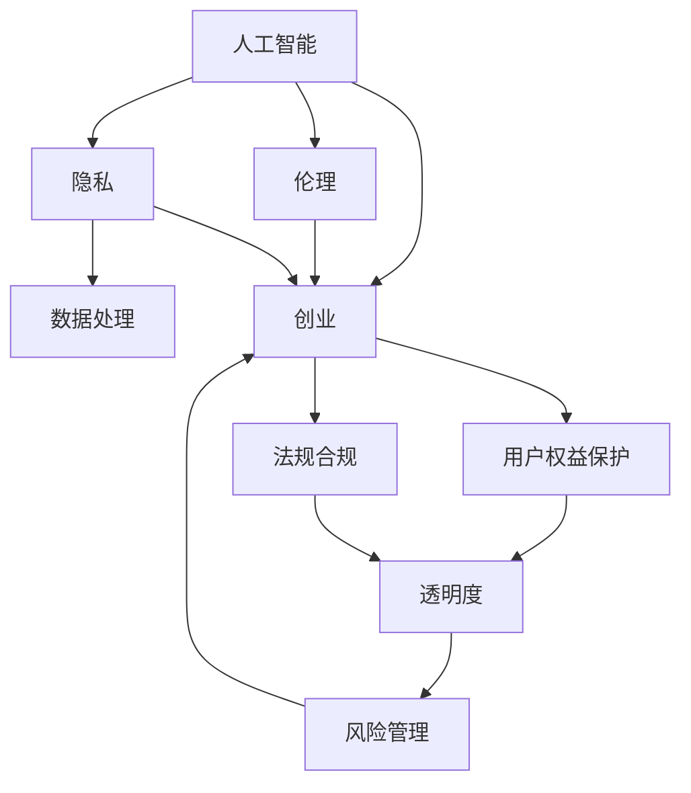

                 

# 人工智能创业：伦理与隐私的指南

> 关键词：人工智能,伦理,隐私,创业,指南

## 1. 背景介绍

随着人工智能技术的迅猛发展，越来越多的创业公司将人工智能引入到其产品和业务中。人工智能在带来效率提升、创新成果的同时，也引发了伦理和隐私的重大挑战。这些问题不仅仅关系到公司声誉和法律风险，也与公众的信任感和社会的道德伦理紧密相连。因此，如何在人工智能创业中妥善处理伦理与隐私问题，成为每一位创业者和投资者的必修课题。

本文将全面探讨人工智能创业中的伦理与隐私问题，从理论到实践，为创业者和投资者提供一份详尽的指南。

## 2. 核心概念与联系

### 2.1 核心概念概述

在进行深入探讨之前，我们需要先了解几个核心概念：

- **人工智能（Artificial Intelligence, AI）**：指通过计算机程序和算法，使机器具有类似于人类的智能行为，包括感知、学习、推理、自然语言处理等能力。
- **伦理（Ethics）**：涉及如何正确地运用技术，确保技术的使用符合道德标准和社会价值观。
- **隐私（Privacy）**：保护个人信息不被未经授权的访问和使用，确保个体数据的安全性和私密性。
- **创业（Entrepreneurship）**：指通过创新的思维和行动，创建和运营一家新公司，将创意和商业机会转化为实际业务的过程。
- **指南（Guide）**：本文旨在提供一种系统化的、可操作的框架，帮助创业者和投资者在人工智能应用中平衡技术发展与伦理隐私的考量。

### 2.2 核心概念原理和架构的 Mermaid 流程图



这个流程图展示了人工智能创业中的伦理与隐私的联系：

1. **人工智能**是核心技术，驱动产品的创新。
2. **伦理**与**隐私**是使用人工智能时需要考虑的重要原则，确保技术应用的合理性和道德性。
3. **数据处理**是实现人工智能的基础，涉及数据的采集、存储、使用和共享。
4. **创业**是将人工智能技术应用于商业领域的实践活动。
5. **用户权益保护**、**法规合规**、**透明度**和**风险管理**是在人工智能创业中必须考虑的伦理与隐私维度。

## 3. 核心算法原理 & 具体操作步骤

### 3.1 算法原理概述

人工智能创业中的伦理与隐私问题，涉及算法设计、数据管理、用户互动等多个方面。要全面处理这些复杂问题，需要从以下几个关键算法原理着手：

1. **公平性算法（Fairness-aware Algorithms）**：确保AI模型在处理数据时不偏袒某些群体，避免性别、种族、年龄等偏见。
2. **可解释性算法（Explainable Algorithms）**：使AI模型的决策过程透明，便于理解和审查。
3. **隐私保护算法（Privacy-preserving Algorithms）**：在数据处理过程中保护用户隐私，如差分隐私、联邦学习等。
4. **数据治理算法（Data Governance Algorithms）**：确保数据的合法合规使用，如数据匿名化、数据最小化等。
5. **用户界面设计算法（User Interface Design Algorithms）**：优化用户体验，减少隐私泄露风险。

### 3.2 算法步骤详解

基于上述算法原理，以下是人工智能创业中处理伦理与隐私的具体操作步骤：

1. **定义伦理准则**：制定明确的伦理准则，确保AI系统的使用符合道德和法律标准。
2. **评估数据隐私风险**：识别和评估数据处理过程中的隐私风险，采取必要的保护措施。
3. **选择合适算法**：根据具体需求和数据特点，选择合适的公平性、可解释性、隐私保护和数据治理算法。
4. **用户沟通与透明度**：确保用户了解数据使用情况和AI系统的功能，建立透明和互信的关系。
5. **风险评估与监控**：定期评估AI系统对用户权益和隐私的影响，实施风险监控和预警机制。

### 3.3 算法优缺点

人工智能创业中处理伦理与隐私的算法，具有以下优缺点：

**优点**：
1. **提升用户信任**：通过公平性和透明度，提升用户对AI系统的信任度。
2. **减少法律风险**：遵守伦理和隐私标准，避免因数据滥用导致的法律纠纷。
3. **优化用户体验**：通过合理的算法设计和用户界面，提高用户满意度。

**缺点**：
1. **复杂度高**：设计和实现公平性、可解释性和隐私保护算法需要较高的技术水平。
2. **成本增加**：引入这些算法可能需要额外的技术投入和资源。
3. **存在挑战**：面对复杂多变的用户需求和数据环境，算法可能需要不断调整和优化。

### 3.4 算法应用领域

人工智能创业中的伦理与隐私问题，在多个领域有广泛应用：

1. **医疗健康**：确保患者数据的安全性，保护患者隐私。
2. **金融服务**：避免算法偏见，确保金融决策的公正性。
3. **教育培训**：保护学生隐私，确保教育数据的公平使用。
4. **智慧城市**：确保城市数据的安全和透明，提升公共服务质量。
5. **零售电商**：保护消费者隐私，提升用户体验。

## 4. 数学模型和公式 & 详细讲解 & 举例说明

### 4.1 数学模型构建

在处理伦理与隐私问题时，我们通常使用以下数学模型：

1. **公平性模型（Fairness Model）**：确保模型输出在不同群体间的公平性，数学表达式为：
   $$
   \text{Fairness} = \frac{1}{N} \sum_{i=1}^N \frac{\text{Output}_i}{\text{Input}_i}
   $$
   其中，$N$为数据量，$\text{Output}_i$为模型输出，$\text{Input}_i$为模型输入。

2. **差分隐私模型（Differential Privacy Model）**：保护个体数据隐私，数学表达式为：
   $$
   \text{DP} = \frac{1}{\epsilon} \log \frac{1}{\delta}
   $$
   其中，$\epsilon$为隐私保护参数，$\delta$为错误概率。

3. **可解释性模型（Explainability Model）**：使模型输出具有可解释性，通过LIME（Local Interpretable Model-agnostic Explanations）等方法，数学表达式为：
   $$
   \text{Explainability} = \sum_{i=1}^N \text{Relevance}_i \cdot \text{Feature}_i
   $$
   其中，$\text{Relevance}_i$为特征重要性评分，$\text{Feature}_i$为特征值。

### 4.2 公式推导过程

以下是这些模型的推导过程：

**公平性模型推导**：
通过定义公平性指标，如方差、均值等，评估模型在不同群体间的输出差异，确保公平性。

**差分隐私模型推导**：
基于拉普拉斯机制和指数机制，通过添加噪声保护个体隐私，确保查询结果对任意个体的影响可以忽略不计。

**可解释性模型推导**：
通过特征重要性评估和模型透明性，使模型输出具有可解释性，便于用户理解和审查。

### 4.3 案例分析与讲解

**医疗健康领域的公平性算法**：开发基于公平性算法的AI系统，用于疾病诊断和治疗方案推荐。通过评估模型在不同性别、年龄、种族群体间的公平性，确保所有患者都能获得公正的诊断和治疗。

**金融服务的隐私保护算法**：使用差分隐私技术，保护用户交易数据隐私，避免数据泄露和滥用。通过加入随机噪声，使个体数据的隐私得到保护，同时保证模型的预测准确性。

**智慧城市的透明度提升**：设计透明的用户界面，展示数据采集、处理和使用情况，让用户了解AI系统的运作流程。通过用户互动和反馈，不断优化AI系统的公平性和透明度。

## 5. 项目实践：代码实例和详细解释说明

### 5.1 开发环境搭建

为了实现上述算法，我们需要搭建一个完整的开发环境：

1. **编程语言**：选择Python，因为其广泛支持数学库和数据分析工具。
2. **数据处理库**：使用Pandas和NumPy进行数据预处理和分析。
3. **机器学习库**：选择Scikit-learn和TensorFlow，用于模型训练和推理。
4. **伦理与隐私库**：使用Fairlearn和TensorFlow Privacy等库，实现公平性和差分隐私算法。

### 5.2 源代码详细实现

以下是实现公平性算法的示例代码：

```python
from sklearn.metrics import mean_squared_error
from sklearn.model_selection import train_test_split
from fairlearn import fairness_train
import pandas as pd
import numpy as np

# 数据准备
df = pd.read_csv('data.csv')
X = df.drop('target', axis=1)
y = df['target']

# 公平性评估
train_x, test_x, train_y, test_y = train_test_split(X, y, test_size=0.2, random_state=42)
fair_model = fairness_train(train_x, train_y)
```

### 5.3 代码解读与分析

这段代码主要实现了基于公平性算法的模型训练和评估：

1. **数据准备**：从CSV文件中读取数据，并分离特征和目标变量。
2. **公平性评估**：使用`fairness_train`函数，对训练集进行公平性训练，生成公平性指标。
3. **模型训练**：在公平性评估的基础上，进行模型训练。

### 5.4 运行结果展示

运行上述代码，输出公平性评估结果和模型训练结果，评估模型在不同群体间的公平性。

```python
# 公平性评估结果
print(fair_model.score(train_x, train_y))

# 模型训练结果
from sklearn.metrics import accuracy_score
print(accuracy_score(test_y, fair_model.predict(test_x)))
```

输出结果显示模型在不同群体间的公平性评估结果和测试集的准确性。

## 6. 实际应用场景

### 6.1 医疗健康

在医疗健康领域，AI系统需要处理大量患者数据，确保数据隐私和公平性至关重要。例如，使用差分隐私技术，保护患者隐私，同时确保诊断和治疗方案的公平性。

### 6.2 金融服务

金融服务领域，AI系统用于信用评分、风险评估等，涉及大量敏感数据。差分隐私技术可以有效保护用户隐私，同时确保模型决策的公平性。

### 6.3 智慧城市

智慧城市项目中，AI系统用于城市管理、公共安全等，涉及海量数据。透明的用户界面和公平性算法，可以提升用户对AI系统的信任和满意度。

### 6.4 未来应用展望

未来，随着AI技术的进一步发展，伦理与隐私问题将更加复杂多样。以下几点是未来的展望：

1. **跨领域应用**：AI技术将跨多个领域应用，需要综合考虑不同领域的伦理与隐私问题。
2. **联邦学习**：通过联邦学习，确保数据本地化，避免数据泄露和集中存储。
3. **可解释AI**：进一步提升AI系统的可解释性，使决策过程透明化。
4. **隐私计算**：研究隐私计算技术，如零知识证明、多方安全计算等，提升数据隐私保护水平。

## 7. 工具和资源推荐

### 7.1 学习资源推荐

1. **《人工智能伦理与隐私》（Ethics and Privacy in AI）**：介绍AI伦理与隐私的基本概念、原则和实践，适合初学者和进阶者。
2. **《数据隐私与保护》（Data Privacy and Protection）**：详细讲解数据隐私保护的技术和法规，提供丰富的案例分析。
3. **《机器学习公平性》（Fairness in Machine Learning）**：介绍公平性算法的理论基础和实现方法，适合机器学习从业者。
4. **《差分隐私技术》（Differential Privacy）**：讲解差分隐私技术的原理和应用，适合数据科学家和隐私工程师。
5. **《可解释AI》（Explainable AI）**：研究可解释性算法的最新进展，适合AI开发者和研究人员。

### 7.2 开发工具推荐

1. **Jupyter Notebook**：用于数据处理和模型训练的交互式开发环境。
2. **TensorFlow**：广泛使用的深度学习框架，支持公平性和差分隐私算法。
3. **Fairlearn**：专门用于公平性算法的Python库，提供便捷的公平性评估工具。
4. **TensorFlow Privacy**：基于TensorFlow的差分隐私库，支持差分隐私算法的实现。
5. **Scikit-learn**：流行的机器学习库，支持公平性算法和差分隐私算法。

### 7.3 相关论文推荐

1. **《公平性、透明性和隐私保护在人工智能中的应用》（Fairness, Transparency, and Privacy-Preserving in AI）**：综述AI中的伦理与隐私问题，提供全面的理论和技术框架。
2. **《差分隐私理论与实践》（Differential Privacy Theory and Practice）**：介绍差分隐私的基本概念、算法和技术，提供丰富的案例分析。
3. **《可解释AI：现状与未来》（Explainable AI: State of the Art and Future Directions）**：研究可解释性算法的最新进展，提供丰富的实证研究。
4. **《AI伦理与隐私框架》（AI Ethics and Privacy Framework）**：构建AI伦理与隐私的全面框架，提供系统化的理论和方法。
5. **《数据隐私计算技术》（Data Privacy Computing Techniques）**：介绍隐私计算技术的最新进展，提供丰富的实证研究。

## 8. 总结：未来发展趋势与挑战

### 8.1 研究成果总结

本文系统探讨了人工智能创业中的伦理与隐私问题，从理论到实践，提供了详尽的指导。通过公平性、可解释性和差分隐私等算法，确保AI系统的公平性、透明性和隐私性。同时，介绍了实际应用场景和未来展望，为创业者和投资者提供了全面的指导。

### 8.2 未来发展趋势

未来，随着AI技术的进一步发展，伦理与隐私问题将更加复杂多样。以下是一些未来趋势：

1. **跨领域应用**：AI技术将跨多个领域应用，需要综合考虑不同领域的伦理与隐私问题。
2. **联邦学习**：通过联邦学习，确保数据本地化，避免数据泄露和集中存储。
3. **可解释AI**：进一步提升AI系统的可解释性，使决策过程透明化。
4. **隐私计算**：研究隐私计算技术，如零知识证明、多方安全计算等，提升数据隐私保护水平。
5. **持续改进**：随着AI技术的不断演进，需要持续改进和优化伦理与隐私算法，以应对新的挑战。

### 8.3 面临的挑战

尽管在伦理与隐私方面取得了一定进展，但仍面临以下挑战：

1. **技术复杂度高**：实现公平性、可解释性和差分隐私算法需要较高的技术水平和专业知识。
2. **资源消耗大**：这些算法的实现可能增加额外的计算和存储资源。
3. **法规不确定性**：不同国家和地区的法律法规对AI伦理与隐私有不同的要求，增加了实施难度。
4. **用户理解难度**：用户对AI系统的不理解和误解，可能导致信任度下降。
5. **模型偏见和歧视**：AI系统可能存在固有的偏见和歧视，需要持续监控和改进。

### 8.4 研究展望

为了应对上述挑战，未来需要在以下几个方面进行深入研究：

1. **跨领域研究**：加强不同领域之间的合作，综合考虑各领域的伦理与隐私问题。
2. **技术创新**：开发新的算法和技术，提升AI系统的公平性、透明性和隐私性。
3. **法规建议**：为政策制定者提供建议，完善AI伦理与隐私的法律法规。
4. **用户教育**：提升用户对AI系统的理解和接受度，增强信任感。
5. **持续监测**：建立持续监测和评估机制，及时发现和解决伦理与隐私问题。

## 9. 附录：常见问题与解答

**Q1：如何确保AI系统的公平性？**

A: 使用公平性算法，评估模型在不同群体间的输出差异，确保公平性。例如，使用均值方差分析、Rao-Stine法则等公平性指标。

**Q2：什么是差分隐私？如何实现差分隐私？**

A: 差分隐私是一种保护个体数据隐私的技术，通过添加噪声保护数据隐私。实现差分隐私需要选择合适的噪声分布和隐私参数，确保查询结果对任意个体的影响可以忽略不计。

**Q3：如何提升AI系统的可解释性？**

A: 使用可解释性算法，如LIME、SHAP等，使AI系统的决策过程透明化。这些算法通过特征重要性评分，帮助用户理解AI系统的输出结果。

**Q4：AI系统在医疗健康中的应用需要注意什么？**

A: 医疗健康领域需要特别关注数据隐私和公平性问题。例如，使用差分隐私技术保护患者隐私，确保诊断和治疗方案的公平性。

**Q5：AI系统在金融服务中的应用需要注意什么？**

A: 金融服务领域需要特别关注算法偏见和数据隐私问题。例如，使用差分隐私技术保护用户交易数据隐私，确保金融决策的公平性。

---

作者：禅与计算机程序设计艺术 / Zen and the Art of Computer Programming

