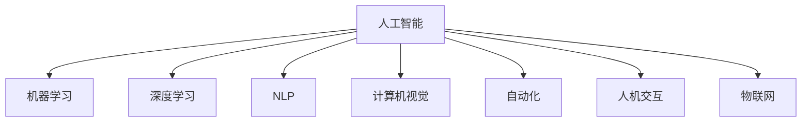

                 

# 人工智能对各行业的影响

## 1. 背景介绍

### 1.1 问题由来
人工智能（AI）技术自20世纪50年代以来便逐步发展，从早期的逻辑推理、专家系统，到21世纪初的深度学习、自然语言处理，再到今天的智能感知、人机交互，AI技术始终在不断地向纵深推进，并逐步渗透至各个行业。AI技术的快速发展不仅改变了传统的业务流程和商业模式，还为各行各业带来了深刻变革。本文将从不同行业出发，深入分析AI对它们的影响。

### 1.2 问题核心关键点
AI技术的应用在带来机遇的同时，也带来了挑战。如何通过合理的策略和措施，最大化AI技术带来的价值，并最小化其潜在的负面影响，成为各行业面临的重要课题。

1. **技术适配**：不同的行业具有不同的业务特点和数据需求，如何适配AI技术，是实现技术落地应用的关键。
2. **数据隐私与安全**：在AI技术应用中，数据隐私和安全问题尤为重要，如何保障数据安全，避免数据滥用，是AI应用中的重要考虑。
3. **人机协作**：AI技术的发展，并不意味着完全替代人力，而是通过人机协作，提升工作效率，改善服务质量。
4. **伦理与合规**：AI技术的广泛应用，带来了诸多伦理和合规问题，如何制定相关政策，保障公平、公正，是AI技术应用中的重要课题。
5. **社会与经济影响**：AI技术的应用不仅改变了经济结构，还对社会就业、教育、医疗等领域产生了深远影响。

### 1.3 问题研究意义
研究AI对各行业的影响，对于推动AI技术的普及和应用，提升行业竞争力，促进经济社会发展具有重要意义：

1. **优化业务流程**：AI技术的应用，可以显著优化业务流程，提高效率，降低成本，提升客户满意度。
2. **创新商业模式**：AI技术的应用，可以创新商业模式，拓展新的市场空间，增强行业竞争力。
3. **推动产业升级**：AI技术的应用，可以推动传统行业向智能化、数字化方向转型，实现产业升级。
4. **促进社会进步**：AI技术在医疗、教育、安全等领域的应用，可以提升公共服务水平，推动社会进步。
5. **保障数据安全**：AI技术的应用，需要严格的数据隐私和安全保障措施，以确保数据安全，避免滥用。

## 2. 核心概念与联系

### 2.1 核心概念概述

为更好地理解AI对各行业的影响，本节将介绍几个密切相关的核心概念：

- **人工智能（AI）**：利用计算机技术模拟人类智能行为的技术，包括机器学习、深度学习、自然语言处理、计算机视觉等。
- **机器学习（ML）**：通过数据驱动，让机器自动学习规律和模式，并用于决策和预测的技术。
- **深度学习（DL）**：一种特殊的机器学习方法，通过多层次神经网络，自动提取数据的复杂特征。
- **自然语言处理（NLP）**：让计算机理解、处理和生成自然语言的技术，包括语音识别、文本分类、情感分析等。
- **计算机视觉（CV）**：让计算机理解和分析图像和视频内容的技术，包括目标检测、图像分割、视频分析等。
- **自动化（Automation）**：通过机器学习、机器人等技术，自动完成重复性高、规律性强的工作。
- **人机交互（HMI）**：通过语音识别、手势识别、自然语言生成等技术，实现人机之间的自然交互。
- **物联网（IoT）**：通过传感器、智能设备等，实现设备与设备、人与设备之间的互联互通。

这些核心概念之间的逻辑关系可以通过以下Mermaid流程图来展示：



这个流程图展示了几大核心概念之间的关系：

1. 人工智能包括机器学习、深度学习、自然语言处理、计算机视觉等技术。
2. 自动化、人机交互、物联网等技术均基于人工智能的基础。

## 3. 核心算法原理 & 具体操作步骤

### 3.1 算法原理概述

人工智能在各行业的应用，其核心原理是通过算法模型对数据进行分析和处理，从而实现特定的功能。以下以深度学习为例，简要介绍其基本原理：

深度学习通过构建多层次的神经网络，自动从输入数据中提取特征，并进行分类、回归、生成等任务。其基本流程包括数据预处理、模型训练、模型评估和模型部署。

### 3.2 算法步骤详解

深度学习在各行业的应用，通常包括以下几个关键步骤：

1. **数据收集与预处理**：收集与行业相关的数据，并进行清洗、标注、归一化等预处理。
2. **模型构建与训练**：选择合适的深度学习模型（如CNN、RNN、Transformer等），并进行参数初始化、前向传播、损失计算、反向传播、参数更新等训练步骤。
3. **模型评估与调优**：在验证集上评估模型性能，通过调整超参数、数据增强、正则化等手段优化模型。
4. **模型部署与应用**：将训练好的模型部署到实际应用场景中，进行实时数据处理和决策。

### 3.3 算法优缺点

深度学习在各行业的应用，具有以下优点：

1. **高精度**：通过多层次网络结构，深度学习能够自动提取复杂特征，提高模型精度。
2. **可解释性**：通过可视化工具，可以直观地理解模型的特征和决策过程，增强模型的可解释性。
3. **广泛应用**：深度学习在图像识别、自然语言处理、语音识别等领域均有广泛应用。

同时，深度学习也存在一些缺点：

1. **计算资源消耗大**：深度学习模型参数量庞大，需要大量计算资源进行训练和推理。
2. **数据需求高**：深度学习模型通常需要大量标注数据进行训练，获取高质量标注数据成本较高。
3. **过拟合风险高**：深度学习模型容易过拟合，需要大量的数据和正则化技术来避免过拟合。

### 3.4 算法应用领域

深度学习在各行业的应用领域非常广泛，以下是几个典型应用：

1. **医疗健康**：深度学习应用于医学影像分析、疾病预测、基因组分析等，提升了医疗诊断的准确性和效率。
2. **金融服务**：深度学习应用于信用评分、欺诈检测、风险控制等，提升了金融风险管理能力。
3. **零售电商**：深度学习应用于商品推荐、库存管理、顾客行为分析等，提升了零售电商的运营效率和用户体验。
4. **智能制造**：深度学习应用于设备故障预测、生产调度、质量控制等，提升了智能制造的自动化和智能化水平。
5. **交通运输**：深度学习应用于自动驾驶、交通流量预测、智能交通管理等，提升了交通运输的安全性和效率。
6. **农业生产**：深度学习应用于农作物识别、病虫害检测、产量预测等，提升了农业生产的智能化水平。

## 4. 数学模型和公式 & 详细讲解 & 举例说明

### 4.1 数学模型构建

深度学习在各行业的应用，通常涉及到复杂的数学模型和计算过程。以下以图像分类任务为例，简要介绍其基本数学模型：

设输入数据为$x \in \mathbb{R}^d$，输出标签为$y \in \{0, 1\}$，定义损失函数$L(\theta, x, y)$为预测结果与真实标签之间的差异。常用的损失函数包括交叉熵损失、均方误差损失等。

模型的目标是最小化损失函数$L(\theta, x, y)$，即：

$$
\theta^* = \mathop{\arg\min}_{\theta} \sum_{i=1}^N L(\theta, x_i, y_i)
$$

其中$\theta$为模型参数，$N$为样本数量。

### 4.2 公式推导过程

以下以卷积神经网络（CNN）为例，推导其基本的计算过程。

CNN通过卷积层、池化层、全连接层等组成，对输入图像进行特征提取和分类。以图像分类任务为例，CNN的计算过程如下：

1. **卷积层**：通过卷积操作，提取输入图像的局部特征。公式如下：

$$
f(x) = \sum_{i=1}^k w_ix_i + b_i
$$

其中$w_i$为卷积核，$b_i$为偏置项。

2. **池化层**：通过池化操作，降低特征图的空间维度。常用的池化方式包括最大池化和平均池化。公式如下：

$$
f(x) = \max_{i,j} x_{i,j}
$$

3. **全连接层**：通过全连接层，将特征图映射到输出标签空间。公式如下：

$$
y = g(\sum_{i=1}^k w_ix_i + b_i)
$$

其中$g$为激活函数，如ReLU、Sigmoid等。

### 4.3 案例分析与讲解

以下以医疗影像分析为例，介绍深度学习的应用。

医疗影像分析是深度学习在医疗健康领域的重要应用之一。通过深度学习模型，可以从医学影像中自动检测出病变区域，辅助医生进行诊断和治疗。其基本流程包括数据收集与预处理、模型构建与训练、模型评估与调优、模型部署与应用。

1. **数据收集与预处理**：收集大量的医学影像数据，并进行清洗、标注、归一化等预处理。
2. **模型构建与训练**：选择合适的深度学习模型（如卷积神经网络CNN），并进行参数初始化、前向传播、损失计算、反向传播、参数更新等训练步骤。
3. **模型评估与调优**：在验证集上评估模型性能，通过调整超参数、数据增强、正则化等手段优化模型。
4. **模型部署与应用**：将训练好的模型部署到实际应用场景中，进行实时医学影像分析，辅助医生进行诊断和治疗。

## 5. 项目实践：代码实例和详细解释说明

### 5.1 开发环境搭建

在进行深度学习项目开发前，我们需要准备好开发环境。以下是使用Python进行TensorFlow开发的环境配置流程：

1. 安装Anaconda：从官网下载并安装Anaconda，用于创建独立的Python环境。

2. 创建并激活虚拟环境：
```bash
conda create -n tf-env python=3.8 
conda activate tf-env
```

3. 安装TensorFlow：根据CUDA版本，从官网获取对应的安装命令。例如：
```bash
conda install tensorflow-gpu -c conda-forge
```

4. 安装各类工具包：
```bash
pip install numpy pandas scikit-learn matplotlib tqdm jupyter notebook ipython
```

完成上述步骤后，即可在`tf-env`环境中开始深度学习项目的开发。

### 5.2 源代码详细实现

这里我们以图像分类任务为例，给出使用TensorFlow进行深度学习模型训练的PyTorch代码实现。

首先，定义数据集：

```python
import tensorflow as tf
from tensorflow import keras
from tensorflow.keras import layers

# 加载数据集
(x_train, y_train), (x_test, y_test) = keras.datasets.mnist.load_data()

# 数据预处理
x_train = x_train / 255.0
x_test = x_test / 255.0

# 数据增强
x_train = tf.image.resize(x_train, [32, 32])
x_train = tf.image.random_flip_left_right(x_train)
```

然后，定义模型：

```python
# 定义卷积神经网络模型
model = keras.Sequential([
    layers.Conv2D(32, 3, activation='relu', input_shape=(32, 32, 1)),
    layers.MaxPooling2D(),
    layers.Conv2D(64, 3, activation='relu'),
    layers.MaxPooling2D(),
    layers.Flatten(),
    layers.Dense(10, activation='softmax')
])
```

接着，定义训练过程：

```python
# 编译模型
model.compile(optimizer='adam',
              loss='sparse_categorical_crossentropy',
              metrics=['accuracy'])

# 训练模型
model.fit(x_train, y_train, epochs=10, validation_data=(x_test, y_test))
```

最后，评估模型：

```python
# 评估模型
model.evaluate(x_test, y_test)
```

以上就是使用TensorFlow对图像分类任务进行深度学习模型训练的完整代码实现。可以看到，通过TensorFlow的高级API，可以显著简化深度学习模型的开发过程。

### 5.3 代码解读与分析

让我们再详细解读一下关键代码的实现细节：

**数据集定义**：
- 使用`keras.datasets.mnist.load_data()`加载MNIST数据集，获取训练集和测试集。
- 对数据进行预处理，将像素值归一化到[0, 1]区间。
- 使用`tf.image.resize()`和`tf.image.random_flip_left_right()`进行数据增强，增加模型泛化能力。

**模型定义**：
- 使用`keras.Sequential()`定义卷积神经网络模型，包括卷积层、池化层、全连接层等。
- 在卷积层中使用3x3的卷积核和ReLU激活函数，在全连接层中使用softmax激活函数。

**模型编译与训练**：
- 使用`model.compile()`编译模型，指定优化器、损失函数和评估指标。
- 使用`model.fit()`训练模型，指定训练集、测试集、迭代轮数等。

**模型评估**：
- 使用`model.evaluate()`评估模型在测试集上的性能。

可以看到，TensorFlow的高级API显著简化了深度学习模型的开发过程。开发者可以将更多精力放在模型改进、数据增强等高层逻辑上，而不必过多关注底层的实现细节。

当然，工业级的系统实现还需考虑更多因素，如模型的保存和部署、超参数的自动搜索、更灵活的任务适配层等。但核心的深度学习模型开发基本与此类似。

## 6. 实际应用场景

### 6.1 医疗健康

深度学习在医疗健康领域的应用，为疾病诊断和治疗带来了新的可能。深度学习可以自动分析医学影像、电子病历等数据，辅助医生进行诊断和治疗。

在实际应用中，深度学习模型可以通过迁移学习的方式，在特定医疗数据集上进行微调，以适应特定疾病的诊断需求。例如，通过在大规模胸片数据集上进行预训练，再在大规模肺结节数据集上进行微调，可以构建针对肺结节的自动检测模型。

### 6.2 金融服务

深度学习在金融服务领域的应用，主要集中在信用评分、欺诈检测、风险控制等方面。通过深度学习模型，金融机构可以更准确地评估客户的信用风险，预测潜在欺诈行为，优化风险管理策略。

在实际应用中，深度学习模型可以通过迁移学习的方式，在金融数据集上进行微调，以适应特定的业务需求。例如，通过在大规模信用卡交易数据集上进行预训练，再在特定的欺诈检测数据集上进行微调，可以构建针对信用卡欺诈的自动检测模型。

### 6.3 零售电商

深度学习在零售电商领域的应用，主要集中在商品推荐、库存管理、顾客行为分析等方面。通过深度学习模型，零售电商可以更精准地推荐商品，优化库存管理，提升顾客满意度。

在实际应用中，深度学习模型可以通过迁移学习的方式，在零售电商数据集上进行微调，以适应特定的业务需求。例如，通过在大规模电商交易数据集上进行预训练，再在特定的商品推荐数据集上进行微调，可以构建针对电商平台的自动推荐模型。

### 6.4 智能制造

深度学习在智能制造领域的应用，主要集中在设备故障预测、生产调度、质量控制等方面。通过深度学习模型，智能制造可以更准确地预测设备故障，优化生产调度，提升产品质量。

在实际应用中，深度学习模型可以通过迁移学习的方式，在制造数据集上进行微调，以适应特定的业务需求。例如，通过在大规模制造设备数据集上进行预训练，再在特定的设备故障预测数据集上进行微调，可以构建针对制造设备的自动预测模型。

## 7. 工具和资源推荐

### 7.1 学习资源推荐

为了帮助开发者系统掌握深度学习理论基础和实践技巧，这里推荐一些优质的学习资源：

1. 《深度学习》系列书籍：由深度学习领域权威人士撰写，全面介绍了深度学习的理论基础和应用实践。
2. 《TensorFlow实战Google深度学习》书籍：由TensorFlow官方团队编写，详细介绍了TensorFlow的使用方法和应用案例。
3. 《动手学深度学习》课程：由李沐教授等人主导，通过动手实践的方式，深入浅出地讲解了深度学习的核心概念和算法。
4. Coursera《深度学习》课程：由斯坦福大学Andrew Ng教授讲授，通过线上课程的方式，介绍了深度学习的理论和实践。
5. Kaggle竞赛平台：提供大量深度学习竞赛和数据集，是练习深度学习技能的绝佳平台。

通过对这些资源的学习实践，相信你一定能够快速掌握深度学习技术的精髓，并用于解决实际的业务问题。

### 7.2 开发工具推荐

高效的开发离不开优秀的工具支持。以下是几款用于深度学习开发的常用工具：

1. TensorFlow：由Google主导开发的开源深度学习框架，生产部署方便，适合大规模工程应用。
2. PyTorch：基于Python的开源深度学习框架，灵活动态的计算图，适合快速迭代研究。
3. Keras：一个高级深度学习API，易于上手，可以快速构建深度学习模型。
4. Jupyter Notebook：一个强大的交互式开发环境，支持Python、R、SQL等多种语言。
5. Git：版本控制系统，方便团队协作和代码管理。

合理利用这些工具，可以显著提升深度学习项目的开发效率，加快创新迭代的步伐。

### 7.3 相关论文推荐

深度学习的发展源于学界的持续研究。以下是几篇奠基性的相关论文，推荐阅读：

1. AlexNet: ImageNet Classification with Deep Convolutional Neural Networks：提出深度卷积神经网络（CNN），刷新了图像分类任务SOTA。
2. GoogleNet: Going Deeper with Convolutions：提出Inception模块，提升了深度神经网络的计算效率。
3. ResNet: Deep Residual Learning for Image Recognition：提出残差网络（ResNet），解决了深度神经网络训练过程中梯度消失的问题。
4. LSTM: A Long Short-Term Memory Network for Conversational Response Generation：提出长短期记忆网络（LSTM），提升了序列数据的建模能力。
5. Transformer: Attention Is All You Need：提出Transformer结构，开启了自注意力机制在深度学习中的应用。
6. GAN: Generative Adversarial Networks：提出生成对抗网络（GAN），在生成模型和图像生成任务中取得了突破性进展。

这些论文代表了大深度学习的发展脉络。通过学习这些前沿成果，可以帮助研究者把握学科前进方向，激发更多的创新灵感。

## 8. 总结：未来发展趋势与挑战

### 8.1 总结

本文对深度学习在各行业的应用进行了全面系统的介绍。首先阐述了深度学习技术的发展背景和重要意义，明确了深度学习在优化业务流程、创新商业模式、推动产业升级等方面的独特价值。其次，从原理到实践，详细讲解了深度学习的数学模型和计算过程，给出了深度学习项目开发的完整代码实例。同时，本文还广泛探讨了深度学习技术在医疗健康、金融服务、零售电商等行业的实际应用场景，展示了深度学习技术的广泛应用前景。最后，本文精选了深度学习的学习资源、开发工具和相关论文，力求为读者提供全方位的技术指引。

通过本文的系统梳理，可以看到，深度学习技术正在成为各行各业的重要范式，极大地提升了业务效率和运营质量。未来，伴随深度学习技术的不断演进，AI技术必将进一步拓展应用的边界，为经济社会发展带来新的动能。

### 8.2 未来发展趋势

展望未来，深度学习在各行业的应用将呈现以下几个发展趋势：

1. **跨模态学习**：深度学习将进一步拓展到视觉、听觉、文本等多种模态数据的融合学习，提升综合感知能力。
2. **联邦学习**：通过分布式计算，实现多端数据共享和模型融合，保护数据隐私。
3. **自监督学习**：利用无标签数据进行自我监督学习，减少对标注数据的依赖。
4. **模型压缩与优化**：通过模型压缩、量化加速等技术，提升深度学习模型的计算效率和资源利用率。
5. **可解释性增强**：通过可视化、解释性AI等手段，提升深度学习模型的可解释性和可信度。
6. **人机协作**：深度学习将更多地与人工智能伦理、社会责任等课题结合，提升AI技术的社会效益。

以上趋势凸显了深度学习技术的广阔前景。这些方向的探索发展，必将进一步提升深度学习系统的性能和应用范围，为人类认知智能的进化带来深远影响。

### 8.3 面临的挑战

尽管深度学习技术已经取得了瞩目成就，但在迈向更加智能化、普适化应用的过程中，它仍面临着诸多挑战：

1. **数据隐私与安全**：深度学习模型通常需要大量标注数据进行训练，如何保护数据隐私和安全，避免数据滥用，是深度学习应用中的重要课题。
2. **计算资源消耗**：深度学习模型参数量庞大，需要大量计算资源进行训练和推理。如何降低计算成本，提升资源利用率，是深度学习技术发展的重要挑战。
3. **模型鲁棒性与泛化能力**：深度学习模型容易过拟合，如何提高模型鲁棒性和泛化能力，是深度学习模型应用中的重要问题。
4. **模型可解释性与透明性**：深度学习模型通常被称为"黑箱"模型，如何提升模型可解释性和透明性，是深度学习技术发展中的重要课题。
5. **伦理与公平性**：深度学习模型在应用中可能带来伦理和公平性问题，如何制定相关政策，保障公平、公正，是深度学习技术应用中的重要课题。

正视深度学习面临的这些挑战，积极应对并寻求突破，将使深度学习技术更加成熟和稳健，推动人工智能技术在各个领域的广泛应用。

### 8.4 研究展望

面对深度学习面临的这些挑战，未来的研究需要在以下几个方面寻求新的突破：

1. **隐私保护与安全**：开发更加安全的深度学习模型，保护用户隐私，防止数据滥用。
2. **计算优化与效率**：通过模型压缩、量化加速等技术，提升深度学习模型的计算效率和资源利用率。
3. **鲁棒性与泛化能力**：通过正则化、对抗训练等手段，提高深度学习模型的鲁棒性和泛化能力。
4. **可解释性与透明性**：通过可视化、解释性AI等手段，提升深度学习模型的可解释性和透明性。
5. **伦理与公平性**：通过公平性评估、伦理约束等手段，提升深度学习模型的公平性和可信度。

这些研究方向凸显了深度学习技术的发展方向，将使深度学习技术更加成熟和稳健，推动人工智能技术在各个领域的广泛应用。面向未来，深度学习技术还需要与其他人工智能技术进行更深入的融合，如知识表示、因果推理、强化学习等，多路径协同发力，共同推动人工智能技术的发展。只有勇于创新、敢于突破，才能不断拓展深度学习技术的边界，让智能技术更好地造福人类社会。

## 9. 附录：常见问题与解答

**Q1：深度学习是否适用于所有行业？**

A: 深度学习技术具有广泛的应用前景，但并非适用于所有行业。不同行业具有不同的业务特点和数据需求，需要根据具体情况选择适合的模型和技术。例如，在金融领域，深度学习常用于信用评分和风险控制；在医疗领域，深度学习常用于医学影像分析和疾病预测。

**Q2：深度学习在应用过程中需要注意哪些问题？**

A: 深度学习在应用过程中需要注意以下几个问题：

1. **数据隐私与安全**：在应用深度学习时，需要严格保护数据隐私和安全，防止数据滥用。
2. **计算资源消耗**：深度学习模型参数量庞大，需要大量计算资源进行训练和推理，需要合理规划计算资源。
3. **模型鲁棒性与泛化能力**：深度学习模型容易过拟合，需要采取正则化、对抗训练等手段提高模型鲁棒性和泛化能力。
4. **模型可解释性与透明性**：深度学习模型通常被称为"黑箱"模型，需要提升模型可解释性和透明性，增强用户信任。

**Q3：深度学习在实际应用中如何提升模型性能？**

A: 在实际应用中，提升深度学习模型性能的方法包括：

1. **数据增强**：通过数据增强技术，扩充训练集，提高模型泛化能力。
2. **正则化**：通过L2正则、Dropout等正则化技术，防止过拟合，提高模型鲁棒性。
3. **模型优化**：通过优化模型结构、参数初始化等手段，提升模型性能。
4. **迁移学习**：通过迁移学习，利用预训练模型，提高模型性能。
5. **对抗训练**：通过对抗训练，提升模型鲁棒性，防止模型过拟合。

**Q4：深度学习在实际应用中如何提高模型可解释性？**

A: 在实际应用中，提高深度学习模型可解释性的方法包括：

1. **可视化工具**：通过可视化工具，直观地展示模型特征和决策过程，增强模型可解释性。
2. **解释性AI**：通过解释性AI技术，解释模型的内部工作机制，提高模型透明性。
3. **模型融合**：通过模型融合，将多个模型进行集成，提高模型可解释性。

**Q5：深度学习在实际应用中如何保护用户隐私？**

A: 在实际应用中，保护用户隐私的方法包括：

1. **数据脱敏**：对敏感数据进行脱敏处理，防止数据泄露。
2. **差分隐私**：在数据发布时，引入差分隐私技术，保护用户隐私。
3. **联邦学习**：通过分布式计算，实现多端数据共享和模型融合，保护数据隐私。

---

作者：禅与计算机程序设计艺术 / Zen and the Art of Computer Programming

