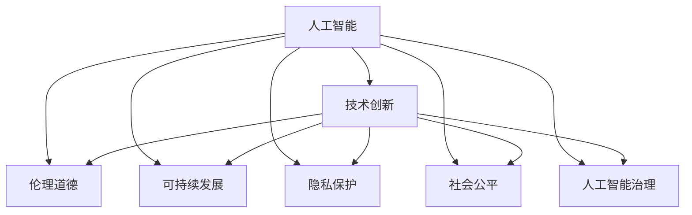

                 

# 人工智能：社会影响与思考

> 关键词：人工智能,社会影响,伦理道德,技术创新,可持续发展,隐私保护,人工智能治理,教育应用,社会公平,未来展望

## 1. 背景介绍

### 1.1 问题由来
随着人工智能(AI)技术的迅猛发展，它已深刻影响了人类社会的各个方面。从医疗、教育到金融、交通，AI在各个领域展现出强大的应用潜力。然而，AI技术的普及和应用也带来了诸多挑战，如伦理道德、隐私保护、社会公平等问题。如何在享受AI带来的便利的同时，解决这些问题，确保技术造福人类，已成为社会各界关注的焦点。

## 2. 核心概念与联系

### 2.1 核心概念概述

本节将介绍几个与AI社会影响相关的核心概念：

- **人工智能(AI)**：指利用计算机技术和算法，模拟、延伸和扩展人类智能的技术。主要包含机器学习、深度学习、自然语言处理等子领域。

- **技术创新(技术变革)**：指通过新技术的开发和应用，推动社会生产力和生活水平提高的过程。AI技术的创新应用正推动各行各业转型升级，提升工作效率和创新能力。

- **伦理道德(Ethics & Morality)**：指在AI应用中，维护公正、透明、尊重隐私等原则的道德规范。伦理道德问题涉及AI的决策公正性、透明度、可解释性等。

- **可持续发展(Sustainable Development)**：指在AI应用中，保护环境资源、促进经济社会协调发展，实现人与自然的和谐共生。

- **隐私保护(Privacy Protection)**：指在AI应用中，保护用户个人信息的安全，避免数据滥用和泄露。隐私保护是AI应用的关键考量因素。

- **社会公平(Social Equity)**：指在AI应用中，确保技术普惠，避免因技术应用带来的不平等问题，如“数字鸿沟”。

- **人工智能治理(Regulation of AI)**：指在AI应用中，通过法律、政策、标准等手段，规范AI技术的开发和应用，保障社会公共利益。

这些核心概念之间的逻辑关系可以通过以下Mermaid流程图来展示：



这个流程图展示了人工智能的核心概念及其与其他概念的相互联系：

1. 人工智能通过技术创新推动社会发展，但也带来了一系列社会问题。
2. 伦理道德、可持续发展、隐私保护、社会公平等问题需要与人工智能技术紧密结合，共同保障技术健康发展。
3. 人工智能治理是解决上述问题的重要手段，确保AI技术在法律、政策等规范下进行合理应用。

## 3. 核心算法原理 & 具体操作步骤

### 3.1 算法原理概述

人工智能在社会应用中，通过算法和技术的创新，实现了对社会各领域的深刻影响。AI算法的核心原理可以总结为以下几点：

1. **数据驱动**：AI算法依赖于大量的数据训练，通过数据分析和模型优化，提升算法性能和应用效果。

2. **自动化决策**：AI算法能够自动从数据中学习决策模式，实现自动化决策，提高效率和准确性。

3. **跨领域应用**：AI算法不仅限于特定领域，通过迁移学习和知识复用，可以应用于医疗、金融、教育等各个行业。

4. **持续优化**：AI算法通过不断的数据反馈和模型更新，实现持续优化和自我改进。

### 3.2 算法步骤详解

AI在社会应用中，通常遵循以下步骤：

1. **数据收集**：从各个领域收集大量数据，构建训练集和验证集，为算法训练提供数据基础。

2. **模型训练**：使用机器学习或深度学习算法，在训练集上对模型进行训练，不断调整模型参数以优化性能。

3. **模型评估**：在验证集上对模型进行评估，通过各种指标（如准确率、召回率、F1值等）评估模型性能。

4. **模型应用**：将训练好的模型应用于实际问题中，通过自动化的决策过程，解决实际问题。

5. **反馈与优化**：根据实际应用中的反馈数据，对模型进行优化和改进，提高模型效果。

### 3.3 算法优缺点

AI算法在社会应用中，具有以下优点：

1. **高效性**：AI算法能够快速处理大量数据，提高决策效率，缩短问题解决时间。

2. **普适性**：AI算法具有较强的泛化能力，能够在不同领域中应用，提升各个行业的自动化水平。

3. **智能化**：AI算法能够通过学习和自我优化，不断提高算法性能，适应不断变化的环境。

4. **低成本**：相比于传统的人工操作，AI算法能够降低人力成本，提高经济效益。

但同时也存在一些缺点：

1. **依赖数据质量**：AI算法依赖高质量的数据训练，数据噪音和偏差会影响算法效果。

2. **模型黑箱**：AI算法的内部决策过程复杂，缺乏可解释性，难以理解算法的决策依据。

3. **伦理道德问题**：AI算法在决策过程中可能存在偏见，影响社会公平。

4. **隐私风险**：AI算法需要大量数据训练，涉及用户隐私信息，隐私保护问题需要特别关注。

### 3.4 算法应用领域

AI算法在社会各个领域都有广泛应用，例如：

- **医疗领域**：通过AI算法，实现医疗影像分析、疾病预测、个性化治疗等，提升医疗服务质量。

- **金融领域**：利用AI算法进行风险评估、欺诈检测、智能投顾等，提高金融服务的精准度和效率。

- **教育领域**：通过AI算法，进行个性化教学、作业批改、学习效果分析等，提升教育公平和质量。

- **城市管理**：利用AI算法进行交通管理、公共安全、城市规划等，提升城市治理智能化水平。

- **工业制造**：通过AI算法进行智能制造、质量控制、设备维护等，提升制造业自动化和智能化水平。

## 4. 数学模型和公式 & 详细讲解 & 举例说明

### 4.1 数学模型构建

本节将介绍几个常用的AI数学模型及其构建方法。

以回归问题为例，常见数学模型包括线性回归、逻辑回归、决策树等。线性回归模型表示为：

$$
y = \theta_0 + \sum_{i=1}^n \theta_i x_i + \epsilon
$$

其中，$\theta_i$ 为模型参数，$\epsilon$ 为误差项。

### 4.2 公式推导过程

以线性回归模型为例，推导其最小二乘估计公式：

1. 假设有一组样本数据 $(x_1, y_1), (x_2, y_2), ..., (x_n, y_n)$，其中 $y_i = \theta_0 + \sum_{j=1}^n \theta_j x_{ij} + \epsilon_i$。

2. 求最小化均方误差（MSE）的目标函数：

$$
\min_{\theta_0, \theta_j} \sum_{i=1}^n (y_i - (\theta_0 + \sum_{j=1}^n \theta_j x_{ij}))^2
$$

3. 对 $\theta_0$ 和 $\theta_j$ 求偏导数，得到最小二乘估计公式：

$$
\theta_0 = \frac{\sum_{i=1}^n y_i}{n}
$$
$$
\theta_j = \frac{\sum_{i=1}^n (x_{ij} - \bar{x}) (y_i - \bar{y})}{\sum_{i=1}^n (x_{ij} - \bar{x})^2}
$$

### 4.3 案例分析与讲解

以金融领域为例，利用逻辑回归算法进行信用评分。假设有一组样本数据，每个样本包含用户年龄、收入、信用记录等特征，以及是否违约的标签。使用逻辑回归模型，建立用户违约概率预测模型。通过训练数据集，得到模型参数 $\theta$，然后对新用户进行信用评分，判断其是否可能违约。

## 5. 项目实践：代码实例和详细解释说明

### 5.1 开发环境搭建

在进行AI项目实践前，我们需要准备好开发环境。以下是使用Python进行TensorFlow开发的环境配置流程：

1. 安装Anaconda：从官网下载并安装Anaconda，用于创建独立的Python环境。

2. 创建并激活虚拟环境：
```bash
conda create -n tensorflow-env python=3.8 
conda activate tensorflow-env
```

3. 安装TensorFlow：根据CUDA版本，从官网获取对应的安装命令。例如：
```bash
conda install tensorflow=2.4.1 cudatoolkit=11.1 -c tensorflow -c conda-forge
```

4. 安装各类工具包：
```bash
pip install numpy pandas scikit-learn matplotlib tqdm jupyter notebook ipython
```

完成上述步骤后，即可在`tensorflow-env`环境中开始项目实践。

### 5.2 源代码详细实现

这里我们以信用评分项目为例，给出使用TensorFlow进行逻辑回归模型的PyTorch代码实现。

```python
import tensorflow as tf
import pandas as pd
from sklearn.model_selection import train_test_split
from sklearn.preprocessing import StandardScaler

# 加载数据
data = pd.read_csv('credit_data.csv')
X = data[['age', 'income', 'credit_length', 'loan_status']]
y = data['default']

# 数据预处理
scaler = StandardScaler()
X = scaler.fit_transform(X)
X_train, X_test, y_train, y_test = train_test_split(X, y, test_size=0.2)

# 构建模型
model = tf.keras.Sequential([
    tf.keras.layers.Dense(64, activation='relu', input_shape=(4,)),
    tf.keras.layers.Dense(1, activation='sigmoid')
])

# 编译模型
model.compile(optimizer='adam', loss='binary_crossentropy', metrics=['accuracy'])

# 训练模型
model.fit(X_train, y_train, epochs=10, batch_size=32)

# 评估模型
model.evaluate(X_test, y_test)
```

以上就是使用TensorFlow进行信用评分项目的完整代码实现。可以看到，得益于TensorFlow的强大封装，我们可以用相对简洁的代码完成逻辑回归模型的开发。

### 5.3 代码解读与分析

让我们再详细解读一下关键代码的实现细节：

- **数据加载和预处理**：使用Pandas加载数据，并使用Sklearn的StandardScaler对特征进行标准化处理。
- **模型构建**：使用TensorFlow的Sequential模型构建两层神经网络，第一层为64个神经元的全连接层，激活函数为ReLU，第二层为输出层，激活函数为Sigmoid。
- **模型编译**：使用Adam优化器和二元交叉熵损失函数编译模型。
- **模型训练**：使用训练集数据训练模型，并记录10个epoch的训练效果。
- **模型评估**：在测试集上评估模型性能，输出准确率和损失值。

可以看到，TensorFlow提供了一整套易于使用的API，可以方便地构建、训练和评估机器学习模型。开发者可以将更多精力放在模型设计和特征工程等关键环节上，而不必过多关注底层实现细节。

当然，工业级的系统实现还需考虑更多因素，如模型的保存和部署、超参数的自动搜索、更灵活的任务适配层等。但核心的算法实现基本与此类似。

## 6. 实际应用场景

### 6.1 智能医疗

在医疗领域，AI技术可以用于疾病预测、影像诊断、个性化治疗等。通过AI算法，医疗专家可以快速分析大量的医学数据，提高诊断准确率和效率，同时为患者提供个性化治疗方案。

在实践中，可以收集患者的病历、检查报告、基因信息等数据，利用深度学习模型进行数据分析和预测。例如，使用卷积神经网络（CNN）进行医学影像分析，识别肿瘤、病变等异常情况；使用循环神经网络（RNN）进行病历分析，预测疾病发展趋势；使用强化学习进行个性化治疗方案优化等。

### 6.2 智能制造

在制造领域，AI技术可以用于智能制造、质量控制、设备维护等。通过AI算法，制造企业可以提升生产效率、降低成本、提高产品质量。

在实践中，可以收集制造过程中的设备数据、传感器数据、生产日志等，利用机器学习模型进行数据分析和预测。例如，使用时间序列分析预测设备故障，提前进行维护；使用图像识别检测产品质量，提高生产合格率；使用异常检测算法监控生产异常，及时采取措施等。

### 6.3 智能城市

在城市管理领域，AI技术可以用于交通管理、公共安全、城市规划等。通过AI算法，城市管理者可以提升城市治理智能化水平，提高城市运行效率，改善居民生活质量。

在实践中，可以收集城市交通数据、环境数据、公共安全数据等，利用AI算法进行数据分析和预测。例如，使用深度学习模型进行交通流量预测，优化交通信号灯；使用计算机视觉技术进行公共安全监控，预防犯罪；使用地理信息系统（GIS）进行城市规划，优化城市布局等。

## 7. 工具和资源推荐

### 7.1 学习资源推荐

为了帮助开发者系统掌握AI技术，这里推荐一些优质的学习资源：

1. 《深度学习》系列书籍：由深度学习专家撰写，全面介绍了深度学习的基本概念和算法原理。

2. Coursera《深度学习专项课程》：由斯坦福大学、吴恩达教授等开设的深度学习课程，提供系统的理论学习和实践练习。

3. Kaggle竞赛平台：提供丰富的数据集和竞赛机会，帮助开发者在实践中提升AI技能。

4. GitHub开源项目：包含大量优秀的AI项目代码，提供学习参考和借鉴。

5. AI领域顶级会议论文：如NeurIPS、ICML、ICCV等，涵盖最新AI研究进展和技术成果。

通过对这些资源的学习实践，相信你一定能够快速掌握AI技术的精髓，并用于解决实际问题。

### 7.2 开发工具推荐

高效的开发离不开优秀的工具支持。以下是几款用于AI开发常用的工具：

1. TensorFlow：由Google主导开发的开源深度学习框架，生产部署方便，适合大规模工程应用。

2. PyTorch：基于Python的开源深度学习框架，灵活动态的计算图，适合快速迭代研究。

3. Scikit-learn：基于Python的机器学习库，提供丰富的机器学习算法和数据处理工具。

4. Jupyter Notebook：用于数据科学和机器学习的交互式开发环境，方便代码编写和数据可视化。

5. Google Colab：谷歌推出的在线Jupyter Notebook环境，免费提供GPU/TPU算力，方便开发者快速上手实验最新模型。

合理利用这些工具，可以显著提升AI开发效率，加快创新迭代的步伐。

### 7.3 相关论文推荐

AI技术的发展源于学界的持续研究。以下是几篇奠基性的相关论文，推荐阅读：

1. Deep Neural Networks for Energy Efficient Image Classification（AlexNet论文）：展示了深度卷积神经网络在图像分类任务上的强大能力，推动了深度学习的发展。

2. Word Embeddings（Word2Vec论文）：提出Word2Vec模型，通过词向量表示，实现对自然语言的理解和处理。

3. ImageNet Classification with Deep Convolutional Neural Networks（AlexNet论文）：展示了深度卷积神经网络在图像分类任务上的强大能力，推动了深度学习的发展。

4. Generative Adversarial Nets（GAN论文）：提出GAN模型，实现高质量的图像生成和样式转换。

5. AlphaGo Zero（AlphaGo论文）：展示了深度强化学习在复杂策略游戏中的成功应用，推动了AI在复杂决策领域的研究。

这些论文代表了大数据和深度学习技术的发展脉络。通过学习这些前沿成果，可以帮助研究者把握学科前进方向，激发更多的创新灵感。

## 8. 总结：未来发展趋势与挑战

### 8.1 总结

本文对AI技术在社会各领域的应用进行了全面系统的介绍。首先阐述了AI技术对社会的深远影响，明确了技术创新、伦理道德、隐私保护等核心问题。其次，从原理到实践，详细讲解了AI算法的构建和应用过程，给出了AI项目开发的完整代码实例。同时，本文还广泛探讨了AI技术在医疗、制造、城市管理等领域的实际应用，展示了AI技术的广阔前景。最后，本文精选了AI技术的学习资源、开发工具和研究论文，力求为读者提供全方位的技术指引。

通过本文的系统梳理，可以看到，AI技术在各个领域都展现出巨大的潜力，正逐步改变人类的生产和生活方式。AI技术的发展离不开技术创新、伦理道德和隐私保护等方面的综合考虑，只有在多方协同努力下，才能真正实现技术造福社会的目标。

### 8.2 未来发展趋势

展望未来，AI技术将呈现以下几个发展趋势：

1. **技术创新加速**：随着计算能力的提升和数据量的增加，AI技术将不断突破瓶颈，实现更强的计算能力和更广泛的应用。

2. **跨领域融合**：AI技术将更多地与其他领域的技术进行融合，如自然语言处理与知识图谱、计算机视觉与物联网等，实现更全面的智能应用。

3. **伦理道德提升**：AI技术的开发和应用将更加注重伦理道德，实现公正、透明、可解释的AI系统。

4. **隐私保护强化**：在AI应用中，隐私保护将得到更加严格的关注和保护，确保数据安全和用户隐私。

5. **社会公平提升**：AI技术的普及将更多地关注社会公平问题，避免因技术应用带来的不平等问题。

6. **智能化治理增强**：AI技术将更多地应用于政府治理和社会管理中，提升治理智能化水平，实现更高效、公正的社会管理。

以上趋势凸显了AI技术在社会各领域的广阔前景。这些方向的探索发展，必将进一步提升AI技术的社会价值，为人类社会的可持续发展提供新的动力。

### 8.3 面临的挑战

尽管AI技术在各个领域已展现出巨大潜力，但在迈向更加智能化、普适化应用的过程中，仍面临诸多挑战：

1. **数据质量问题**：AI算法依赖高质量的数据训练，数据噪音和偏差会影响算法效果。如何获取高质量的数据，是AI技术应用中的关键问题。

2. **算法透明性问题**：AI算法的内部决策过程复杂，缺乏可解释性，难以理解算法的决策依据。如何提升算法的透明性，实现可解释的AI系统，是一大挑战。

3. **伦理道德问题**：AI算法在决策过程中可能存在偏见，影响社会公平。如何避免算法偏见，实现公正、透明的AI系统，仍需深入研究。

4. **隐私保护问题**：AI算法需要大量数据训练，涉及用户隐私信息，隐私保护问题需要特别关注。如何在保证数据隐私的同时，实现高效的数据利用，是AI技术应用中的重要课题。

5. **技术安全问题**：AI技术的应用可能带来技术安全风险，如数据泄露、系统漏洞等。如何保障AI系统的安全性，确保技术应用的可靠性和安全性，是一大挑战。

6. **技术普及问题**：AI技术的普及将面临“数字鸿沟”问题，如何实现技术普惠，避免因技术应用带来的不平等问题，是一大挑战。

正视AI技术面临的这些挑战，积极应对并寻求突破，将是大数据和深度学习技术不断成熟的重要保障。

### 8.4 研究展望

面对AI技术面临的种种挑战，未来的研究需要在以下几个方面寻求新的突破：

1. **数据质量提升**：通过数据清洗、数据增强、数据融合等手段，提升数据质量，减少数据噪音和偏差。

2. **算法透明性提升**：通过可解释的AI、透明性优化等手段，提升算法的透明性，实现可解释的AI系统。

3. **伦理道德规范**：通过伦理道德规范、数据隐私保护等手段，确保AI系统的公正、透明、可解释性。

4. **隐私保护技术**：通过差分隐私、联邦学习等手段，确保数据隐私保护，实现高效的数据利用。

5. **技术安全性提升**：通过安全审计、安全加固等手段，提升AI系统的安全性，确保技术应用的可靠性和安全性。

6. **技术普及普惠**：通过技术普及、教育培训等手段，实现技术普惠，避免因技术应用带来的不平等问题。

这些研究方向的探索，必将引领AI技术迈向更加成熟和完善，为人类社会的可持续发展提供新的动力。相信在多方协同努力下，AI技术必将为人类社会带来更多的福祉和进步。

## 9. 附录：常见问题与解答

**Q1：如何避免AI算法中的数据偏见问题？**

A: 避免AI算法中的数据偏见问题，主要从数据获取和算法设计两个方面入手：

1. **数据获取**：在数据收集过程中，确保数据样本的多样性和代表性，避免数据偏差。可以使用多样化的数据源、多样化的采样方法，减少数据偏见。

2. **算法设计**：在算法设计过程中，引入公平性约束、去偏方法等技术手段，避免算法偏见。例如，使用公平性约束算法，确保算法输出结果的公平性；使用去偏方法，如对抗训练、生成对抗网络（GAN）等，减少算法偏见。

**Q2：如何确保AI算法的透明性和可解释性？**

A: 确保AI算法的透明性和可解释性，主要通过以下手段：

1. **模型简化**：将复杂的模型简化为易于理解的模型，例如使用决策树、逻辑回归等简单模型，提高模型的可解释性。

2. **可解释的AI**：引入可解释的AI技术，例如LIME、SHAP等，通过局部线性模型或影响力分析，解释模型的决策过程和输出结果。

3. **透明度优化**：通过透明度优化手段，例如可视化技术、特征重要性分析等，提高模型的透明度和可解释性。

**Q3：如何在AI应用中保护用户隐私？**

A: 在AI应用中保护用户隐私，主要通过以下手段：

1. **数据匿名化**：通过数据匿名化技术，例如差分隐私、联邦学习等，保护用户隐私，确保数据的安全性。

2. **访问控制**：通过访问控制技术，例如身份认证、权限管理等，限制对数据的访问权限，确保数据的安全性。

3. **数据加密**：通过数据加密技术，例如对称加密、非对称加密等，保护数据的安全性，防止数据泄露。

4. **隐私保护算法**：引入隐私保护算法，例如差分隐私、同态加密等，保护用户隐私，确保数据的安全性。

这些手段的综合应用，可以有效保护用户隐私，确保AI应用的安全性。

**Q4：如何应对AI技术带来的社会公平问题？**

A: 应对AI技术带来的社会公平问题，主要通过以下手段：

1. **数据公平性**：在数据获取和处理过程中，确保数据公平性，避免数据偏见，确保AI算法输出的公正性。

2. **算法公平性**：在算法设计过程中，引入公平性约束、去偏方法等技术手段，确保算法输出的公正性。

3. **公平性评估**：引入公平性评估技术，例如公平性评估指标、公平性测试等，评估和优化AI算法的公平性。

4. **社会监督**：通过社会监督手段，例如公众监督、政府监管等，确保AI算法应用的公正性，避免因技术应用带来的不平等问题。

这些手段的综合应用，可以有效应对AI技术带来的社会公平问题，确保AI技术应用的公正性和公平性。

---

作者：禅与计算机程序设计艺术 / Zen and the Art of Computer Programming

