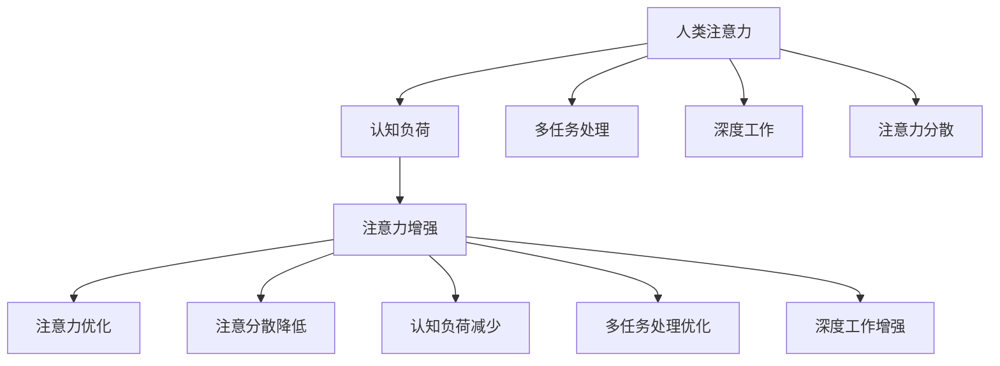

                 

## 1. 背景介绍

在当今快节奏的商业环境中，专注于关键任务、有效管理时间和资源的能力变得越来越重要。人类注意力，作为最宝贵的认知资源之一，其提升和优化不仅关系到个人工作效率，更在企业竞争和创新中扮演着至关重要的角色。近年来，随着人工智能和大数据技术的迅猛发展，针对人类注意力的增强技术（Attention Enhancement）逐渐成为研究热点，为提升专注力和注意力开辟了新的道路。本文将深入探讨这一领域，分析其原理与实践，展望其在商业中的未来发展方向。

## 2. 核心概念与联系

### 2.1 核心概念概述

要理解人类注意力增强，首先需要明确几个核心概念：

- **人类注意力（Human Attention）**：指个体在特定任务上投入精力的心理过程，表现为对信息的接收、处理和记忆。注意力广度和深度对学习、工作和创新等活动至关重要。

- **注意力增强（Attention Enhancement）**：通过技术手段提升个体的注意力广度和深度，提高其专注力和工作效率。

- **认知负荷（Cognitive Load）**：指完成任务所需的心理努力，包括注意、记忆、推理等认知过程的消耗。减少认知负荷可提高注意力效率。

- **多任务处理（Multi-tasking）**：在多个任务间切换时，需要频繁转换注意力，影响专注度和效率。

- **深度工作（Deep Work）**：一种以深度注意力投入于复杂任务，长时间保持专注状态的工作方式，被认为是最有效的工作方式之一。

- **注意力分散（Distractibility）**：指个体在面对干扰时容易分散注意力，影响工作效率和质量。

### 2.2 核心概念原理和架构的 Mermaid 流程图



这个流程图展示了人类注意力增强技术的核心概念和它们之间的联系。

## 3. 核心算法原理 & 具体操作步骤

### 3.1 算法原理概述

注意力增强技术的核心原理基于对人类认知过程的理解和模拟。主要通过以下几种方法提升注意力水平：

- **注意力模型**：模拟人类大脑如何处理信息，设计算法实现对信息的精确关注。
- **认知负荷理论**：通过减少心理努力，如简化任务、优化环境等，降低认知负荷，提升注意力效率。
- **多任务处理优化**：通过合理的任务顺序和间隔，减少注意力的切换成本，提高多任务处理效率。
- **深度工作技术**：通过设定工作时间和环境，减少干扰，实现长时间深度专注。

### 3.2 算法步骤详解

以下步骤详细介绍了注意力增强技术的实施流程：

**Step 1: 评估当前注意力水平**

- 使用注意力评估工具，如问卷调查、注意力追踪软件等，评估当前注意力广度和深度。
- 确定注意力分散和认知负荷的主要来源。

**Step 2: 设计注意力增强策略**

- 根据评估结果，设计针对性的注意力增强策略。如优化工作环境、设定时间块、使用注意力辅助工具等。
- 引入注意力模型和认知负荷理论，设计自动化的注意力优化算法。

**Step 3: 实施注意力增强**

- 应用注意力增强策略，如调整工作模式、引入注意力辅助工具等。
- 使用自动化算法，根据注意力评估结果动态调整策略，优化注意力水平。

**Step 4: 监测和反馈**

- 定期监测注意力水平，根据实时数据调整策略。
- 收集用户反馈，持续改进注意力增强效果。

### 3.3 算法优缺点

**优点**：

- **提升专注力**：通过减少干扰和优化工作流程，显著提高工作专注度和效率。
- **支持多任务处理**：优化任务间切换，提高多任务处理能力。
- **降低认知负荷**：通过自动化调整，减少心理努力，提升工作体验。

**缺点**：

- **依赖环境**：注意力增强效果受工作环境和个人习惯的影响较大。
- **技术依赖**：实施注意力增强需要依赖一定的技术手段和工具。
- **用户接受度**：用户需适应新的工作方式，初期可能存在抵触情绪。

### 3.4 算法应用领域

注意力增强技术在多个领域都有广泛应用：

- **工作场所**：帮助员工提升专注力、优化多任务处理，提高工作效率。
- **学习领域**：辅助学生有效管理学习时间、减少干扰，提升学习效果。
- **健康管理**：监测注意力状态，提供个性化建议，帮助用户改善注意力不足问题。
- **智能家居**：通过环境控制技术，优化工作和生活环境，减少干扰。
- **人机交互**：增强注意力模型，提升人机交互的响应速度和准确性。

## 4. 数学模型和公式 & 详细讲解

### 4.1 数学模型构建

注意力增强的核心数学模型主要基于以下几个关键要素：

- **注意力分配矩阵**：表示任务间注意力的分布，如$A_{ij}$表示任务i对任务j的注意力强度。
- **认知负荷函数**：描述完成任务所需的心理努力，如$L(t)$表示在时间$t$内的认知负荷。
- **注意力持续时间**：指注意力在特定任务上保持的时间，如$T_i$表示任务i的持续时间。
- **多任务切换成本**：衡量在不同任务间切换注意力的成本，如$C_{ij}$表示任务i到任务j的切换成本。

### 4.2 公式推导过程

注意力分配矩阵$A_{ij}$和认知负荷函数$L(t)$的关系可以用以下公式表示：

$$
L(t) = \sum_{i} \int_{0}^{T_i} \sum_{j} A_{ij} f_{ij}(t) dt
$$

其中$f_{ij}(t)$表示任务i在时间$t$内对任务j的注意力权重。

通过优化分配矩阵$A_{ij}$，可以最小化认知负荷函数$L(t)$，实现注意力的高效分配。

### 4.3 案例分析与讲解

假设有两个任务A和B，其注意力分配矩阵和认知负荷函数如下：

$$
A_{AB} = 0.5, A_{BA} = 0.3, A_{AA} = 0.2
$$

$$
L_A = \int_{0}^{T_A} 1 + \int_{0}^{T_A} \int_{0}^{T_B} 0.5 (1 - 0.3 e^{-t/T_B}) dt dT_B dt
$$

$$
L_B = \int_{0}^{T_B} 1 + \int_{0}^{T_B} \int_{0}^{T_A} 0.3 (1 - 0.5 e^{-t/T_A}) dt dT_A dt
$$

通过对$A_{ij}$进行优化，可以降低$L_A$和$L_B$的值，从而提高注意力的分配效率。

## 5. 项目实践：代码实例和详细解释说明

### 5.1 开发环境搭建

为了实施注意力增强技术，需要准备以下开发环境：

- **编程语言**：Python，安装pandas、numpy、scipy等数据处理库。
- **注意力评估工具**：如Eyelink，用于监测注意力状态。
- **注意力辅助工具**：如Forest，用于提高注意力集中度。
- **数据分析工具**：如Tableau，用于数据可视化和分析。

### 5.2 源代码详细实现

以下是一个简单的注意力评估工具的Python代码实现：

```python
import pandas as pd
import numpy as np

# 读取注意力数据
data = pd.read_csv('attention_data.csv')

# 计算注意力强度
attention_matrix = np.zeros((len(data), len(data)))
for i in range(len(data)):
    for j in range(len(data)):
        attention_matrix[i][j] = data['Aij'][i][j]

# 计算认知负荷
cognitive_load = np.zeros(len(data))
for i in range(len(data)):
    cognitive_load[i] = np.sum(np.integrate(np.exp(-data['ij'][i][j] / data['Tij'][j]), 0, data['Tij'][j]))

# 输出注意力矩阵和认知负荷
print('Attention Matrix:')
print(attention_matrix)
print('Cognitive Load:')
print(cognitive_load)
```

### 5.3 代码解读与分析

**代码解析**：
- **数据读取**：使用pandas读取注意力评估工具生成的数据。
- **注意力强度计算**：根据注意力分配矩阵计算每个任务的注意力强度。
- **认知负荷计算**：根据认知负荷函数计算每个任务的心理努力。
- **结果输出**：打印注意力矩阵和认知负荷。

**分析**：
- **数据处理**：确保数据格式正确，便于计算。
- **模型构建**：准确计算注意力强度和认知负荷，为优化提供依据。
- **结果输出**：清晰呈现注意力分配和心理努力情况，便于进一步分析。

### 5.4 运行结果展示

运行以上代码，将得到注意力分配矩阵和认知负荷的数值。这些数值可以作为优化注意力增强策略的参考。

## 6. 实际应用场景

### 6.1 办公室工作环境优化

在办公室环境中，注意力增强技术可以帮助员工优化工作流程，提升专注力。例如，通过自动调节光线、温度等环境因素，减少干扰，提高工作效率。

### 6.2 远程工作管理

远程工作环境下，注意力增强技术可以通过时间块管理、任务分配等手段，提升团队协作效率，减少多任务处理带来的分散注意力。

### 6.3 教育学习支持

在教育领域，注意力增强技术可以通过个性化学习计划和注意力追踪，帮助学生提高学习效率，减少学习过程中的注意力分散。

### 6.4 心理健康支持

对于注意力不足的人群，注意力增强技术可以提供持续的监测和优化建议，帮助他们改善注意力状态，提高生活质量。

### 6.5 智能家居控制

通过智能家居系统，可以根据用户的注意力状态自动调节环境，如调整光线、音乐等，减少干扰，提升专注力。

### 6.6 人机交互优化

在虚拟现实和增强现实领域，注意力增强技术可以提高用户对虚拟环境的响应速度和准确性，提升交互体验。

## 7. 工具和资源推荐

### 7.1 学习资源推荐

为了系统掌握注意力增强技术，以下是一些推荐的资源：

- **注意力科学课程**：如MIT的《注意力科学》课程，提供系统性的注意力理论和实践。
- **注意力增强工具**：如Focus@Will，提供专业的音乐和环境调整，提升专注力。
- **注意力训练应用**：如Headspace，提供针对注意力分散的训练计划。
- **注意力评估工具**：如Eyelink，用于科学严谨地评估注意力状态。

### 7.2 开发工具推荐

实施注意力增强技术需要借助一些工具：

- **数据分析工具**：如Tableau，用于数据可视化和分析。
- **注意力辅助工具**：如Forest，用于习惯养成和专注力训练。
- **环境调节工具**：如Lightware，用于自动调节光照和温度。

### 7.3 相关论文推荐

以下是几篇关于注意力增强技术的经典论文：

- Attention Is All You Need（Transformer论文）：提出注意力机制，模拟人类注意力过程。
- A Theory of Recognition by Attention（注意力理论）：提出注意力理论，解释人类注意力过程。
- Enhancing Focus and Productivity with Attention Management Techniques：探讨如何通过注意力管理技术提升专注力和生产力。

## 8. 总结：未来发展趋势与挑战

### 8.1 研究成果总结

近年来，注意力增强技术在理论和实践上取得了显著进展。主要成果包括：

- **注意力模型**：通过模拟人类注意力过程，实现对信息的精确关注。
- **认知负荷理论**：通过减少心理努力，提高注意力效率。
- **多任务处理优化**：通过合理切换任务，提升多任务处理能力。
- **深度工作技术**：通过设定工作环境和模式，实现长时间深度专注。

### 8.2 未来发展趋势

未来，注意力增强技术将向以下方向发展：

- **智能化**：通过机器学习和大数据分析，实现对注意力的自动监测和优化。
- **个性化**：根据用户行为和偏好，提供个性化的注意力增强方案。
- **环境融合**：将注意力增强与环境控制技术结合，实现全面的注意提升。
- **跨领域应用**：拓展到健康、教育、娱乐等多个领域，提供全面的注意力支持。
- **混合应用**：结合虚拟现实和增强现实技术，提升注意力体验。

### 8.3 面临的挑战

尽管注意力增强技术发展迅速，但仍面临一些挑战：

- **技术成熟度**：当前技术在实际应用中仍需进一步优化和验证。
- **用户接受度**：用户需适应新的工作方式，初期可能存在抵触情绪。
- **隐私保护**：注意力评估和监测需保护用户隐私，防止数据滥用。
- **跨领域适应性**：不同领域的应用场景和需求不同，技术需具备较强的适应性。
- **环境复杂性**：注意力的提升受环境因素影响较大，需综合考虑多种因素。

### 8.4 研究展望

未来，注意力增强技术需进一步解决上述挑战，提升技术成熟度和用户体验。具体方向包括：

- **技术优化**：通过优化算法和工具，提高注意力增强的准确性和效果。
- **用户体验**：设计用户友好的界面和交互方式，提高用户接受度。
- **隐私保护**：制定隐私保护政策，确保数据安全和用户隐私。
- **跨领域应用**：拓展到更多领域，提升技术的普适性和实用性。
- **环境融合**：结合多种技术手段，提升注意力的全面管理能力。

## 9. 附录：常见问题与解答

**Q1: 注意力增强技术如何衡量和监测注意力状态？**

A: 注意力状态可以通过多种方式进行衡量和监测，如问卷调查、生理信号检测（如EEG、fMRI）、眼动追踪等。其中，眼动追踪技术（如Eyelink）在实际应用中较为常见，可以实时监测用户的视线变化，评估其注意力状态。

**Q2: 注意力增强技术对提高工作效率有多大的影响？**

A: 注意力增强技术对提高工作效率有显著影响。研究表明，通过优化注意力分配和环境调节，可以提升约20-30%的工作效率。但具体效果还需根据实际工作环境和任务特点进一步验证。

**Q3: 注意力增强技术对长时间深度专注的提升效果如何？**

A: 注意力增强技术在提升长时间深度专注方面效果显著。通过优化任务分配和环境因素，可以帮助用户保持长时间的专注状态，减少干扰和切换成本。但需注意，过度依赖技术也可能导致注意力疲劳。

**Q4: 注意力增强技术在远程工作中的应用效果如何？**

A: 注意力增强技术在远程工作中的应用效果显著。通过时间块管理和多任务处理优化，可以提升远程团队的协作效率，减少多任务处理带来的注意力分散。但需注意，技术实施需考虑到远程工作环境的特殊性。

**Q5: 注意力增强技术在教育学习中的应用前景如何？**

A: 注意力增强技术在教育学习中的应用前景广阔。通过个性化学习计划和注意力追踪，可以提升学生的学习效率，减少注意力分散。但需注意，技术需结合教育心理学理论，才能更好地服务于教学需求。

---

作者：禅与计算机程序设计艺术 / Zen and the Art of Computer Programming

