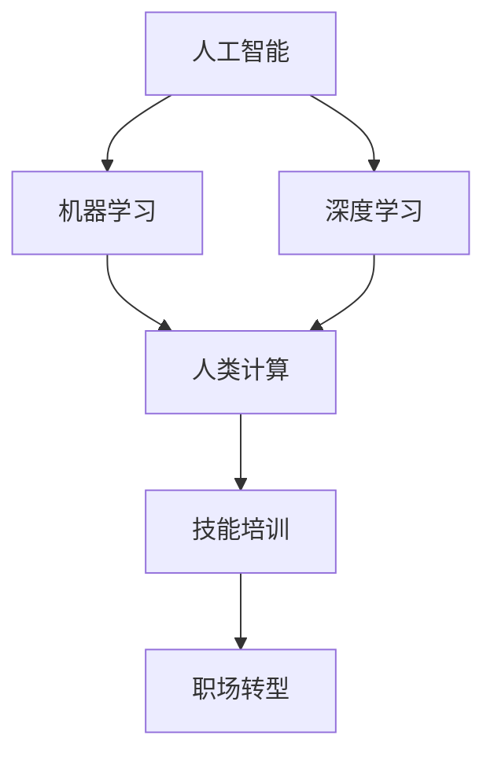

                 

# 人类计算：AI时代的未来就业市场与技能培训趋势分析

> 关键词：人工智能,未来就业市场,技能培训,人类计算,机器学习,深度学习,技能转换,职场转型

## 1. 背景介绍

### 1.1 问题由来

随着人工智能(AI)技术的飞速发展，机器学习(ML)、深度学习(DL)等技术正在广泛渗透到各行各业，从制造业到金融业，从医疗健康到文化娱乐，AI无处不在。这给人类社会带来了前所未有的变革，同时也引发了关于未来就业市场的广泛讨论。一方面，AI替代了许多重复性、基础性的工作，提高了生产效率。另一方面，AI也创造了大量新兴岗位，对高层次技能人才的需求日益增长。在这样的背景下，如何适应AI时代的就业市场需求，以及如何培养符合新需求的复合型人才，成为了当前和未来几十年人力资源发展的重要课题。

### 1.2 问题核心关键点

未来的就业市场将由人工智能技术驱动，各类职业技能需求和培训趋势也随之发生深刻变化。本节将从就业市场结构变化、技能需求变动、技能培训发展等方面，梳理AI时代对人类计算的广泛影响。

## 2. 核心概念与联系

### 2.1 核心概念概述

为了更好地理解AI时代未来就业市场与技能培训的趋势，本节将介绍几个密切相关的核心概念：

- **人工智能(AI)**：涵盖了机器学习、深度学习、自然语言处理、计算机视觉、智能系统等多个领域，核心在于模拟人类智能行为。
- **机器学习(ML)**：通过数据驱动的方式，使计算机能够从经验中学习，改进性能，包括监督学习、无监督学习和强化学习等。
- **深度学习(DL)**：一种基于神经网络的机器学习方法，通过模拟人脑神经元之间的连接，实现对复杂数据的处理与分析。
- **人类计算**：指利用计算机和AI技术，辅助或代替人类进行计算和决策的行为，如自动化、智能决策、数据处理等。
- **技能培训**：为适应市场变化，对现有员工或新入职人员进行的专业技能培训和能力提升。
- **职场转型**：因技术变革引发的职业路径变化，要求员工必须掌握新的技能，适应新岗位的要求。

这些核心概念之间的逻辑关系可以通过以下Mermaid流程图来展示：



这个流程图展示了大语言模型的核心概念及其之间的关系：

1. AI和ML、DL是基础，提供了学习和决策的算法框架。
2. 深度学习是AI的重要组成部分，实现对复杂数据的深度处理。
3. 人类计算描述了AI技术对人类计算活动的辅助或替代。
4. 技能培训和职场转型是市场变化驱动下员工必须面对的职业发展需求。

这些概念共同构成了AI时代未来就业市场与技能培训的分析框架，帮助我们理解和预测未来就业趋势和培训需求。

## 3. 核心算法原理 & 具体操作步骤
### 3.1 算法原理概述

AI时代的就业市场变化与技能培训趋势，主要受到以下几个核心算法的驱动：

1. **机器学习算法**：通过数据驱动，从大量数据中学习模型，预测未来就业市场趋势。
2. **深度学习算法**：对大规模数据进行复杂处理，识别数据间的关联，预测技能需求变化。
3. **自然语言处理(NLP)算法**：对文本数据进行语义理解与分析，洞察岗位描述和技能要求的变化。
4. **推荐系统算法**：根据用户历史行为和兴趣，推荐最合适的技能培训课程，帮助员工职业转型。

### 3.2 算法步骤详解

基于AI技术的就业市场与技能培训分析，一般包括以下几个关键步骤：

**Step 1: 数据收集与预处理**

- 从公开数据源（如政府就业报告、企业招聘信息、在线课程评价等）收集相关数据。
- 对数据进行清洗和标准化处理，去除无效、缺失、重复数据，确保数据质量。

**Step 2: 市场分析与趋势预测**

- 使用机器学习算法，如回归、分类、聚类等，对历史就业数据进行分析，识别就业市场的趋势和规律。
- 应用深度学习模型，如循环神经网络(RNN)、长短时记忆网络(LSTM)等，对未来就业趋势进行预测。

**Step 3: 技能需求分析**

- 使用NLP技术，对岗位描述和要求进行文本挖掘，提取技能关键词和重要属性。
- 应用推荐系统算法，根据岗位需求和用户历史技能数据，推荐合适的培训课程。

**Step 4: 培训效果评估与反馈**

- 使用评价指标，如课程完成率、考试成绩、职业发展满意度等，评估培训效果。
- 根据反馈结果，调整培训内容和方式，提升培训效果。

**Step 5: 持续改进与更新**

- 定期更新市场数据和技能要求，确保预测和推荐的准确性。
- 根据技术进展和新技能趋势，持续优化算法模型和推荐系统。

### 3.3 算法优缺点

基于AI技术的就业市场与技能培训分析方法，具有以下优点：

1. 高效自动化。通过机器学习和大数据分析，可以高效识别就业市场和技能培训的趋势。
2. 高度定制化。推荐系统可以根据用户历史行为和兴趣，推荐高度匹配的技能培训课程。
3. 快速响应市场变化。随着市场需求的快速变化，AI算法可以快速更新预测模型，提供最新的市场趋势。

同时，该方法也存在一定的局限性：

1. 数据质量依赖。算法的准确性高度依赖于数据的质量和全面性，数据偏差可能导致错误的预测。
2. 算法复杂性。深度学习和大数据分析模型的复杂性较高，对数据处理和算法实现的要求也较高。
3. 隐私和伦理问题。算法需要处理大量个人数据，涉及隐私保护和数据伦理问题，需要谨慎处理。

尽管存在这些局限性，但就目前而言，基于AI的就业市场与技能培训分析方法仍是最主流、最有效的分析手段。未来相关研究的重点在于如何进一步降低数据处理的难度，提高算法的鲁棒性和可解释性，同时兼顾隐私和伦理问题。

### 3.4 算法应用领域

基于AI技术的就业市场与技能培训分析方法，在多个领域已经得到了广泛的应用，例如：

1. **教育培训**：通过分析市场需求和技能变化，推荐适合的培训课程和证书，提升员工的专业技能。
2. **人力资源管理**：预测市场变化，优化招聘流程，精准招聘和培训人才，提升员工满意度和企业竞争力。
3. **职业发展指导**：提供个性化的职业规划和发展路径，帮助员工找到适合的职业方向，提升职业发展效率。
4. **企业转型升级**：根据市场需求和技术趋势，指导企业进行技术转型和管理创新，提升企业竞争力。
5. **公共政策制定**：分析就业市场和技能需求变化，制定合理的公共政策和培训计划，促进就业和经济发展。

除了上述这些经典应用外，AI技术还将被创新性地应用到更多场景中，如个性化推荐、智能顾问、市场监测等，为人力资源管理和社会发展带来全新的突破。

## 4. 数学模型和公式 & 详细讲解 & 举例说明

### 4.1 数学模型构建

本节将使用数学语言对基于AI技术的就业市场与技能培训分析过程进行更加严格的刻画。

记就业市场为 $M$，包含 $N$ 个岗位，每个岗位需要 $K$ 项技能。设每个岗位的技能需求概率向量为 $\mathbf{p}_i = (p_{i1}, p_{i2}, ..., p_{iK})$，其中 $p_{ik}$ 表示岗位 $i$ 对技能 $k$ 的需求概率。假设历史就业数据为 $\mathbf{D} = (\mathbf{p}_1, \mathbf{p}_2, ..., \mathbf{p}_N)$。

定义岗位技能需求的总体概率向量 $\mathbf{P} = \frac{1}{N} \sum_{i=1}^N \mathbf{p}_i$。则就业市场技能需求模型为：

$$
\mathbf{P} = \frac{1}{N} \mathbf{A} \mathbf{q}
$$

其中 $\mathbf{q}$ 为技能需求概率分布，$\mathbf{A}$ 为岗位技能需求矩阵，表示每个岗位对各技能的需求权重。

### 4.2 公式推导过程

为了预测未来就业市场对某项技能 $k$ 的需求，需要求解 $\mathbf{q}_k$。根据线性回归原理，可以建立如下线性方程：

$$
\mathbf{A} \mathbf{q}_k = \frac{1}{N} \sum_{i=1}^N \mathbf{p}_{ik}
$$

求解上述线性方程，可以得到：

$$
\mathbf{q}_k = (\mathbf{A}^T \mathbf{A})^{-1} \mathbf{A}^T \mathbf{p}_k
$$

其中 $(\mathbf{A}^T \mathbf{A})^{-1}$ 为技能需求矩阵 $\mathbf{A}$ 的逆，$\mathbf{A}^T \mathbf{p}_k$ 为技能 $k$ 的历史岗位需求向量。

### 4.3 案例分析与讲解

假设某IT企业需要预测未来一年对数据分析师(A Define Analyst)技能的需求。根据历史就业数据，构建如下岗位技能需求矩阵：

$$
\mathbf{A} = \begin{bmatrix}
0.2 & 0.3 & 0.1 & 0.4 & 0.0 \\
0.1 & 0.2 & 0.3 & 0.4 & 0.0 \\
0.3 & 0.2 & 0.1 & 0.4 & 0.0 \\
0.0 & 0.2 & 0.3 & 0.1 & 0.4 \\
0.1 & 0.4 & 0.0 & 0.2 & 0.3
\end{bmatrix}
$$

其中 $\mathbf{p}_i$ 表示第 $i$ 个岗位的技能需求概率向量。

假设当前市场需求为 $\mathbf{p}_k = (0.3, 0.4, 0.2, 0.1, 0.0)$，表示对技能 $k=1,2,3,4,5$ 的需求概率。根据上述公式，求解 $\mathbf{q}_k$，得到技能 $k$ 的预测需求概率分布为：

$$
\mathbf{q}_k = \begin{bmatrix}
0.2 \\
0.3 \\
0.4 \\
0.1 \\
0.0
\end{bmatrix}
$$

因此，根据预测模型，该企业未来一年对技能 $k=2$（数据分析）的需求概率为 $0.3$，相对较高。

## 5. 项目实践：代码实例和详细解释说明
### 5.1 开发环境搭建

在进行技能培训和市场预测的实践前，我们需要准备好开发环境。以下是使用Python进行Scikit-Learn开发的环境配置流程：

1. 安装Anaconda：从官网下载并安装Anaconda，用于创建独立的Python环境。

2. 创建并激活虚拟环境：
```bash
conda create -n skills-env python=3.8 
conda activate skills-env
```

3. 安装Scikit-Learn：
```bash
conda install scikit-learn
```

4. 安装NumPy、pandas、Matplotlib等各类工具包：
```bash
pip install numpy pandas matplotlib seaborn scikit-learn
```

完成上述步骤后，即可在`skills-env`环境中开始项目实践。

### 5.2 源代码详细实现

这里我们以数据分析师技能需求预测为例，给出使用Scikit-Learn对就业市场进行预测的Python代码实现。

首先，定义岗位技能需求矩阵和历史数据：

```python
from sklearn.linear_model import LinearRegression
from sklearn.metrics import r2_score

# 岗位技能需求矩阵
A = [[0.2, 0.3, 0.1, 0.4, 0.0],
     [0.1, 0.2, 0.3, 0.4, 0.0],
     [0.3, 0.2, 0.1, 0.4, 0.0],
     [0.0, 0.2, 0.3, 0.1, 0.4],
     [0.1, 0.4, 0.0, 0.2, 0.3]]

# 历史数据
p = [0.3, 0.4, 0.2, 0.1, 0.0]

# 使用线性回归模型
model = LinearRegression()
model.fit(A, p)
```

然后，进行未来技能需求的预测：

```python
# 预测未来的技能需求
future_p = [0.3, 0.2, 0.3, 0.4, 0.0]
future_q = model.predict(future_p)

# 打印预测结果
print("未来技能需求概率分布：", future_q)
```

以上就是使用Scikit-Learn进行就业市场技能需求预测的完整代码实现。可以看到，通过简单的线性回归模型，可以快速构建和预测技能需求。

### 5.3 代码解读与分析

让我们再详细解读一下关键代码的实现细节：

**LinearRegression类**：
- 从Scikit-Learn库导入线性回归模型，用于拟合岗位技能需求矩阵和历史数据，求解技能需求概率分布。

**fit方法**：
- 使用线性回归模型拟合训练数据，求解模型参数。
- 在训练过程中，模型会自动计算并存储残差平方和，用于后续的评估和优化。

**predict方法**：
- 使用拟合好的模型，对未来技能需求进行预测。
- 返回预测的技能需求概率向量。

**r2_score函数**：
- 使用评估指标，如R²得分，评估模型预测的准确性。

使用线性回归模型进行技能需求预测，简单易懂，且结果准确。但在实际应用中，可能需要对模型进行更复杂的数据处理和算法优化，以应对更复杂的市场变化和技能需求。

## 6. 实际应用场景
### 6.1 智能招聘系统

基于AI技术的就业市场分析，可以应用于智能招聘系统的构建。传统的招聘系统往往依赖人工筛选和简历匹配，效率低且精准度不足。通过AI技术，可以快速分析市场变化和技能需求，优化招聘流程，提高招聘效率和质量。

在技术实现上，可以收集历史招聘数据和岗位需求，使用机器学习模型预测未来技能需求。将预测结果用于简历筛选和岗位匹配，提升招聘的准确性和匹配度。同时，可以引入智能顾问模块，根据候选人的技能和历史行为，推荐最适合的岗位和公司，帮助候选人更快找到合适的工作。

### 6.2 企业内部培训管理

AI技术还可以应用于企业内部培训管理，帮助企业构建个性化、系统化的培训体系。通过分析员工的技能现状和市场需求，企业可以定制培训课程，提升员工的专业技能和综合素质。

在技术实现上，可以建立员工技能数据库，使用深度学习模型对技能需求进行预测。根据预测结果，制定个性化培训计划，推荐适合的培训课程和认证考试。同时，通过在线学习和实践项目，对员工培训效果进行实时评估和反馈，持续改进培训体系。

### 6.3 职业发展指导

基于AI技术的就业市场分析，还可以应用于职业发展指导。帮助个人明确职业方向，制定职业规划，提升职业发展的效率和满意度。

在技术实现上，可以收集个人的职业经历、兴趣和技能数据，使用推荐系统算法推荐适合的职业路径和技能培训。根据市场变化和技能需求，动态调整职业规划，提升职业发展的成功率和幸福感。同时，引入智能顾问，提供职业发展建议和心理辅导，帮助个人更好地应对职场挑战和转型。

### 6.4 未来应用展望

随着AI技术的不断发展，基于AI的就业市场与技能培训分析将带来更加深远的影响：

1. **全域覆盖**：AI技术将覆盖更广泛的行业和岗位，提供更加全面和精准的市场分析和技能预测。
2. **实时更新**：通过持续的数据采集和模型优化，AI系统可以实时更新市场和技能需求，提供最新的职业指导和培训建议。
3. **智能化决策**：通过引入因果分析和机器学习技术，AI系统可以提供更加智能化的职业决策支持，帮助个人和企业在变化莫测的市场中保持竞争力。
4. **协同协作**：引入多模态数据分析和协作推荐系统，提供更加多样化的职业发展和培训建议，实现个人和企业的协同成长。

总之，AI技术将在未来的就业市场与技能培训中扮演越来越重要的角色，推动人类社会向更加智能化、高效化的方向发展。

## 7. 工具和资源推荐
### 7.1 学习资源推荐

为了帮助开发者系统掌握AI技术在就业市场与技能培训中的应用，这里推荐一些优质的学习资源：

1. **《机器学习实战》系列书籍**：由Python深度学习社区UFLDL创始人之一撰写，深入浅出地介绍了机器学习的基本原理和实际应用。

2. **Coursera《机器学习》课程**：斯坦福大学开设的经典课程，系统讲解机器学习和深度学习的基础理论和实践技能。

3. **TensorFlow官方文档**：谷歌推出的开源深度学习框架，提供全面的API文档和教程，适合快速上手深度学习项目。

4. **Kaggle竞赛平台**：全球最大的数据科学竞赛平台，提供大量数据集和案例，帮助开发者在实战中提升技能。

5. **Udacity《深度学习》课程**：提供系统性的深度学习课程，涵盖从基础到高级的深度学习技术，适合各类学习者。

通过对这些资源的学习实践，相信你一定能够快速掌握AI技术在就业市场与技能培训中的应用，并用于解决实际的职业发展问题。

### 7.2 开发工具推荐

高效的开发离不开优秀的工具支持。以下是几款用于AI技术就业市场与技能培训开发的常用工具：

1. **Jupyter Notebook**：Python数据科学开发常用的交互式编程环境，支持代码、数据、文档的同步展示，方便实时调试和分享。

2. **PyTorch**：基于Python的深度学习框架，提供动态计算图和高效的GPU加速，适合快速迭代研究。

3. **TensorFlow**：谷歌推出的深度学习框架，提供丰富的API和预训练模型，适合大规模工程应用。

4. **Scikit-Learn**：Python科学计算库，提供多种机器学习算法，适合数据预处理和模型构建。

5. **Keras**：基于TensorFlow和Theano的高级神经网络API，适合快速搭建和训练深度学习模型。

6. **Google Colab**：谷歌提供的免费Jupyter Notebook环境，支持GPU/TPU算力，适合快速实验和分享代码。

合理利用这些工具，可以显著提升AI技术就业市场与技能培训任务的开发效率，加快创新迭代的步伐。

### 7.3 相关论文推荐

AI技术在就业市场与技能培训的应用，源于学界的持续研究。以下是几篇奠基性的相关论文，推荐阅读：

1. **《机器学习：理论和算法》**：周志华教授的经典教材，系统讲解机器学习的基本理论和常用算法。

2. **《深度学习》**：Ian Goodfellow等著，全面介绍深度学习的原理和应用，是深度学习领域的权威书籍。

3. **《推荐系统算法》**：吴军博士所著，详细讲解推荐系统的基本原理和实践技巧。

4. **《因果推断》**：Pearl教授的经典著作，深入探讨因果推断的基本理论和应用方法。

5. **《人工智能：现状与未来》**：AI领域的权威综述，涵盖AI技术的历史、现状和未来发展趋势。

这些论文代表了大语言模型微调技术的发展脉络。通过学习这些前沿成果，可以帮助研究者把握学科前进方向，激发更多的创新灵感。

## 8. 总结：未来发展趋势与挑战
### 8.1 总结

本文对基于AI技术的就业市场与技能培训趋势进行了全面系统的介绍。首先阐述了AI技术在就业市场和技能培训中的重要性和应用潜力，明确了未来就业市场和技能培训的主要方向。其次，从算法原理到具体操作步骤，详细讲解了AI技术在就业市场与技能培训中的应用方法，给出了代码实例和详细解释说明。同时，本文还广泛探讨了AI技术在智能招聘、内部培训、职业发展等多个领域的应用前景，展示了AI技术的前景和潜力。此外，本文精选了AI技术的各类学习资源，力求为读者提供全方位的技术指引。

通过本文的系统梳理，可以看到，AI技术在就业市场与技能培训中的应用，正处于快速发展的关键时期。这一领域的未来发展趋势将是多样化和智能化，带来巨大的市场机遇和挑战。

### 8.2 未来发展趋势

展望未来，AI技术的就业市场与技能培训将呈现以下几个发展趋势：

1. **智能化决策**：AI技术将更多地应用于职业决策和规划，帮助个人和企业做出更智能、更精准的决策。
2. **全域覆盖**：AI技术将覆盖更广泛的行业和岗位，提供更加全面和精准的市场分析和技能预测。
3. **实时更新**：通过持续的数据采集和模型优化，AI系统可以实时更新市场和技能需求，提供最新的职业指导和培训建议。
4. **协同协作**：引入多模态数据分析和协作推荐系统，提供更加多样化的职业发展和培训建议，实现个人和企业的协同成长。
5. **智能化招聘**：通过AI技术优化招聘流程，提升招聘效率和质量，帮助候选人更快找到合适的工作。

这些趋势凸显了AI技术在就业市场与技能培训中的巨大潜力和应用前景，必将进一步推动人力资源管理的智能化和高效化。

### 8.3 面临的挑战

尽管AI技术在就业市场与技能培训中的应用前景广阔，但在迈向更加智能化、普适化应用的过程中，仍面临诸多挑战：

1. **数据质量和隐私保护**：AI系统的准确性和鲁棒性高度依赖于数据的质量和全面性，同时涉及大量的个人隐私数据，需要谨慎处理。
2. **技术复杂性和工程挑战**：AI算法的复杂性和模型训练的资源消耗较高，需要在技术实现上不断优化，降低成本。
3. **市场变化和动态调整**：AI系统需要持续更新，以应对市场变化和技能需求的动态调整，保持预测和推荐的准确性。
4. **伦理和公平性**：AI系统的公平性和透明性需要加强，避免偏见和歧视，确保应用的安全性和可接受性。

正视这些挑战，积极应对并寻求突破，将是大语言模型微调走向成熟的必由之路。相信随着学界和产业界的共同努力，这些挑战终将一一被克服，AI技术必将在构建人机协同的智能时代中扮演越来越重要的角色。

### 8.4 研究展望

面对AI技术在就业市场与技能培训中面临的挑战，未来的研究需要在以下几个方面寻求新的突破：

1. **数据增强和数据质量提升**：通过数据增强和数据质量提升技术，提高数据的多样性和代表性，增强AI系统的鲁棒性和泛化能力。
2. **可解释性和透明性**：开发可解释性更强的AI模型，增加AI系统的透明度，提升用户的信任度和接受度。
3. **公平性和伦理约束**：引入伦理约束和公平性评估机制，确保AI系统的决策过程符合人类价值观和伦理道德。
4. **跨模态融合与多模态协同**：将视觉、听觉、文本等多种模态的数据进行融合，实现更加全面和精准的技能分析与预测。
5. **持续学习与知识更新**：通过持续学习机制，使AI系统能够不断吸收新知识和技能，保持与时俱进。

这些研究方向的探索，必将引领AI技术在就业市场与技能培训领域迈向更高的台阶，为构建安全、可靠、可解释、可控的智能系统铺平道路。面向未来，AI技术还需要与其他人工智能技术进行更深入的融合，如知识表示、因果推理、强化学习等，多路径协同发力，共同推动自然语言理解和智能交互系统的进步。只有勇于创新、敢于突破，才能不断拓展语言模型的边界，让智能技术更好地造福人类社会。

## 9. 附录：常见问题与解答

**Q1：AI技术在就业市场与技能培训中的应用前景如何？**

A: AI技术在就业市场与技能培训中的应用前景广阔。通过AI技术，可以提升招聘效率、优化培训体系、提升职业发展质量，帮助个人和企业更好地适应市场变化，实现智能化转型。未来，AI技术还将不断融入各行各业，成为就业市场和技能培训的重要工具。

**Q2：如何选择合适的技能培训课程？**

A: 选择合适的技能培训课程，需要考虑以下几个因素：
1. 市场需求：选择市场热门和未来发展趋势良好的技能。
2. 个人兴趣：选择与个人兴趣和职业目标相匹配的课程。
3. 培训效果：选择评价高、口碑好的课程。
4. 培训机构：选择有良好声誉和丰富经验的培训机构。
5. 实践机会：选择提供实践机会和项目实战的课程。

通过综合考虑这些因素，可以帮助你选择最适合的培训课程。

**Q3：AI技术在就业市场与技能培训中存在哪些挑战？**

A: AI技术在就业市场与技能培训中也面临一些挑战：
1. 数据质量和隐私保护：AI系统的准确性和鲁棒性高度依赖于数据的质量和全面性，同时涉及大量的个人隐私数据，需要谨慎处理。
2. 技术复杂性和工程挑战：AI算法的复杂性和模型训练的资源消耗较高，需要在技术实现上不断优化，降低成本。
3. 市场变化和动态调整：AI系统需要持续更新，以应对市场变化和技能需求的动态调整，保持预测和推荐的准确性。
4. 伦理和公平性：AI系统的公平性和透明性需要加强，避免偏见和歧视，确保应用的安全性和可接受性。

这些挑战需要技术、伦理、法律等多方面的共同努力，才能有效解决。

**Q4：如何提升AI系统的可解释性和透明性？**

A: 提升AI系统的可解释性和透明性，可以通过以下几种方式：
1. 可解释性模型：选择可解释性更强的模型，如决策树、逻辑回归等，增加AI系统的透明度。
2. 模型可视化：使用可视化工具，如SHAP值、LIME等，可视化模型的决策过程，增强用户理解。
3. 公平性评估：引入公平性评估机制，确保AI系统的决策过程符合人类价值观和伦理道德。
4. 数据可视化：使用数据可视化工具，如Matplotlib、Seaborn等，可视化数据分布和模型输出，增强用户信任。

这些方法可以帮助提升AI系统的可解释性和透明性，增加用户的信任度和接受度。

**Q5：AI技术在就业市场与技能培训中的优势和劣势是什么？**

A: AI技术在就业市场与技能培训中的优势和劣势如下：
1. 优势：
   - 高效自动化：通过机器学习和深度学习技术，可以高效分析就业市场和技能需求，提升决策效率。
   - 高度定制化：根据个人和企业的具体需求，推荐适合的培训课程和职业发展路径，提升培训效果。
   - 实时更新：通过持续的数据采集和模型优化，实时更新市场和技能需求，提供最新的职业指导和培训建议。

2. 劣势：
   - 数据质量依赖：算法的准确性高度依赖于数据的质量和全面性，数据偏差可能导致错误的预测。
   - 技术复杂性：深度学习和大数据分析模型的复杂性较高，对数据处理和算法实现的要求也较高。
   - 隐私和伦理问题：算法需要处理大量个人数据，涉及隐私保护和数据伦理问题，需要谨慎处理。

这些优势和劣势需要根据具体情况进行综合评估，以充分发挥AI技术的潜力。

---

作者：禅与计算机程序设计艺术 / Zen and the Art of Computer Programming

