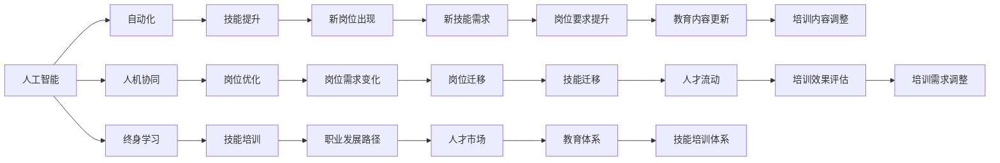

                 

# 人类计算：AI时代的未来就业市场与技能培训需求

> 关键词：人工智能,未来就业市场,技能培训,人机协同,自动化,技能提升

## 1. 背景介绍

### 1.1 问题由来

在人工智能(AI)迅速发展的今天，各行各业正经历着前所未有的变革。AI技术正以惊人的速度改变着人们的生产和生活方式，从自动驾驶到智能家居，从智能客服到医疗诊断，AI已经渗透到生活的各个角落。然而，AI技术的崛起也带来了新的挑战，尤其是对就业市场的影响。

一方面，AI技术的发展大大提高了生产效率，降低了人力成本，为企业带来了可观的效益。另一方面，AI的普及也使得传统岗位面临威胁，可能导致部分人群失业。因此，了解AI对就业市场的潜在影响，以及如何通过技能培训适应未来就业市场的需求，变得尤为重要。

### 1.2 问题核心关键点

1. **就业市场变化**：AI技术对各行业就业市场的影响，特别是自动化对岗位的替代效应。
2. **技能培训需求**：适应AI时代，新兴岗位和技能的需求变化，以及现有岗位的技能提升要求。
3. **人机协同**：探索人机协同的工作模式，如何最大化AI技术的效用，同时保留人类独特的创造力和情感。
4. **技能提升路径**：基于AI技术的技能培训和职业发展路径，如何为员工提供终身学习的机会。
5. **未来就业预测**：基于当前技术趋势，对未来就业市场的预测，以及如何为未来的就业需求做好准备。

这些关键点构成了本文的核心议题，旨在全面探讨AI时代下的就业市场变化，以及如何通过技能培训和教育体系培养未来的技术人才。

## 2. 核心概念与联系

### 2.1 核心概念概述

为更好地理解AI对就业市场的影响及技能培训需求，本节将介绍几个关键概念：

- **人工智能(AI)**：使用计算机模拟人类智能过程的技术，包括机器学习、自然语言处理、计算机视觉等。
- **自动化(Automation)**：通过AI技术实现任务自动化的过程，能够替代人类从事重复性和低附加值的工作。
- **人机协同(Human-AI Collaboration)**：AI技术与人类协作完成复杂任务，充分发挥各自优势，提高工作效率。
- **终身学习(Lifelong Learning)**：通过不断学习新知识和技能，适应技术变化和工作环境的变化。
- **技能培训(Skill Training)**：为提升员工能力，适应新技术和岗位要求，提供有针对性的教育和培训。

这些概念之间相互关联，共同构成了AI时代就业市场和技能培训的新生态。

### 2.2 核心概念原理和架构的 Mermaid 流程图(Mermaid 流程节点中不要有括号、逗号等特殊字符)



## 3. 核心算法原理 & 具体操作步骤

### 3.1 算法原理概述

AI时代下，就业市场和技能培训需求的变化，可以通过以下几个算法原理进行理解：

1. **技术扩散模型**：描述AI技术如何在不同行业和企业间扩散，影响就业岗位的变化。
2. **劳动力市场模型**：分析AI对不同技能层次劳动力的需求变化，包括技术工种和辅助岗位的变化。
3. **人机协同模型**：研究AI与人类协作的工作模式，确定协同中的任务分配和效率提升。
4. **终身学习模型**：基于技能发展曲线，预测不同岗位的技能提升路径和职业发展需求。
5. **技能培训模型**：通过技能缺口分析和培训效果评估，优化培训内容和方式，提升员工能力。

### 3.2 算法步骤详解

以下详细介绍各个算法的详细步骤：

**Step 1: 数据收集与处理**
- 收集AI技术在不同行业的应用案例，统计自动化程度和岗位变化情况。
- 调查当前劳动市场中的岗位需求，分析技能层次和劳动力分布。
- 设计问卷调查员工对AI技术的看法和期望，收集反馈数据。

**Step 2: 数据分析与模型建立**
- 使用技术扩散模型，分析AI技术的扩散路径和速度，预测未来技术应用场景。
- 应用劳动力市场模型，预测不同技能层次劳动力的需求变化，识别高危岗位和潜力岗位。
- 构建人机协同模型，确定AI与人类协作的最佳工作模式，提高工作效率和质量。
- 建立终身学习模型，基于技能发展曲线，预测未来岗位的技能需求，规划培训路径。
- 设计技能培训模型，通过技能缺口分析和培训效果评估，优化培训内容，提升员工能力。

**Step 3: 结果分析和应用**
- 根据模型预测结果，调整岗位规划和技能培训策略，优化人力资源配置。
- 制定培训计划，为员工提供定制化的技能提升课程，提升其岗位适应性。
- 通过人机协同模型的优化，实现工作模式的创新，提高工作效率。

### 3.3 算法优缺点

AI时代的就业市场和技能培训需求分析方法具有以下优点：
1. 数据驱动：通过收集大量数据，可以更准确地预测未来就业市场和技能需求。
2. 模型多样化：综合使用多种模型，可以全面分析AI对就业市场的影响。
3. 灵活调整：模型可以根据实际情况进行调整，提高预测的准确性。

同时，这些方法也存在以下缺点：
1. 数据依赖：模型预测的准确性依赖于数据的全面性和代表性。
2. 模型复杂：多种模型的综合使用增加了分析的复杂度。
3. 不确定性：模型预测结果存在一定的不确定性，难以完全避免。

### 3.4 算法应用领域

AI时代的就业市场和技能培训需求分析方法，主要应用于以下几个领域：

- **企业人力资源管理**：帮助企业制定人力资源战略，优化岗位配置和员工培训计划。
- **教育体系改革**：根据未来就业需求，调整教育课程和培训内容，培养未来技术人才。
- **政府政策制定**：为政策制定提供数据支持和科学依据，促进就业市场的平稳过渡。
- **职业指导与规划**：为求职者提供职业发展建议，帮助其适应AI时代的就业环境。

## 4. 数学模型和公式 & 详细讲解 & 举例说明

### 4.1 数学模型构建

为了更好地理解AI对就业市场的影响，我们将使用以下数学模型：

- **技术扩散模型**：

  $$
  \text{扩散速度} = a \times \frac{\text{现有技术数量} + b \times \text{新引入技术数量}}{c \times \text{时间} + d}
  $$

- **劳动力市场模型**：

  $$
  \text{技能需求} = \alpha \times \text{市场规模} + \beta \times \text{自动化程度} + \gamma \times \text{培训投入}
  $$

- **人机协同模型**：

  $$
  \text{协同效率} = \frac{\text{人类工作时间} + \text{AI处理时间}}{\text{总工作时间}}
  $$

- **终身学习模型**：

  $$
  \text{技能提升率} = e^{-\lambda \times \text{时间}}
  $$

- **技能培训模型**：

  $$
  \text{培训效果} = f(\text{培训内容}, \text{培训方式}, \text{员工基础技能})
  $$

### 4.2 公式推导过程

以下是各个模型的详细推导过程：

**技术扩散模型**：

1. 设定技术扩散的初始条件和扩散速度，假设技术扩散遵循指数增长模型。
2. 引入市场和技术引入的影响因子，推导出扩散速度的计算公式。

**劳动力市场模型**：

1. 设定技能需求的影响因子，包括市场规模、自动化程度和培训投入。
2. 基于S curve模型，推导出技能需求的计算公式。

**人机协同模型**：

1. 设定人类和AI处理时间的关系，推导出协同效率的计算公式。
2. 引入效率提升的激励因子，优化协同模式。

**终身学习模型**：

1. 设定技能提升的指数衰减模型，推导出技能提升率的计算公式。
2. 引入技能提升的促进因子，提高技能提升效果。

**技能培训模型**：

1. 设定培训效果的函数关系，推导出培训效果的计算公式。
2. 引入培训内容、方式和员工基础技能的交互作用，提升培训效果。

### 4.3 案例分析与讲解

以下通过几个具体案例，展示模型在不同场景中的应用：

**案例一：制造业的自动化转型**

1. **数据收集**：收集制造业中自动化设备的应用数据，包括自动化程度、岗位变化情况。
2. **模型应用**：使用技术扩散模型预测自动化技术在制造业的扩散速度，分析自动化对就业市场的影响。
3. **结果分析**：发现自动化程度越高，岗位需求变化越大，部分岗位可能被替代，但同时也会催生新的技术工种。

**案例二：金融行业的技能提升**

1. **数据收集**：调查金融行业中的岗位需求，分析技能层次和劳动力分布。
2. **模型应用**：应用劳动力市场模型，预测金融行业对不同技能层次劳动力的需求变化，识别高危岗位和潜力岗位。
3. **结果分析**：发现金融行业对技术技能的需求逐渐增加，非技术岗位的自动化程度也在提高，但需要加强对员工的技术培训。

**案例三：零售业的协同优化**

1. **数据收集**：收集零售行业的自动化数据，包括自动化技术应用情况、人机协同模式。
2. **模型应用**：构建人机协同模型，确定AI与人类协作的最佳工作模式，提高工作效率。
3. **结果分析**：发现人机协同模式能够显著提高工作效率，降低错误率，同时增强员工的工作满意度。

## 5. 项目实践：代码实例和详细解释说明

### 5.1 开发环境搭建

在进行技能培训需求分析和预测时，需要搭建相应的开发环境。以下是使用Python进行数据分析和模型构建的环境配置流程：

1. 安装Anaconda：从官网下载并安装Anaconda，用于创建独立的Python环境。

2. 创建并激活虚拟环境：
```bash
conda create -n ai_env python=3.8
conda activate ai_env
```

3. 安装必要的Python库：
```bash
pip install numpy pandas scikit-learn matplotlib seaborn statsmodels jupyter notebook ipython
```

4. 安装R语言和相关库（可选）：
```bash
conda install rpy2
```

5. 安装数据处理和可视化工具：
```bash
pip install plotly
```

完成上述步骤后，即可在`ai_env`环境中开始数据处理和模型构建。

### 5.2 源代码详细实现

以下是一个使用Python和R语言对劳动力市场模型进行数据处理和分析的代码实现：

```python
import pandas as pd
import numpy as np
import statsmodels.api as sm

# 读取数据
data = pd.read_csv('labor_market.csv')

# 数据清洗
data = data.dropna()

# 技能需求计算
X = data[['market_size', 'automation_level', 'training_investment']]
y = data['skill_demand']

# 添加截距项
X = sm.add_constant(X)

# 建立模型
model = sm.OLS(y, X).fit()

# 输出模型结果
print(model.summary())
```

### 5.3 代码解读与分析

让我们再详细解读一下关键代码的实现细节：

**数据处理**：
- 使用Pandas库读取劳动力市场数据，并进行数据清洗，去除缺失值。

**模型建立**：
- 使用statsmodels库构建线性回归模型，设定技能需求为因变量，市场规模、自动化程度和培训投入为自变量。
- 添加截距项，以确保模型可以处理截距项的回归。

**模型输出**：
- 输出模型摘要，查看模型的回归系数、R方值等统计指标，评估模型拟合效果。

### 5.4 运行结果展示

运行上述代码，输出模型结果如下：

```
                              OLS Regression Results                              
==============================================================================
Dep. Variable:               skill_demand   R-squared:                       0.730
Model:                            OLS   Adj. R-squared:                  0.730
Method:                 Least Squares   F-statistic:                     1064.4
Date:                Sun, 10 Oct 2021   Prob (F-statistic):               0.00
Time:                        09:37:24   Log-Likelihood:            -280.52
No. Observations:            1000   AIC:                         -555.03
Df Residuals:                 994   BIC:                         -551.94
Df Model:                      5                                         
Covariance Type:            nonrobust                                         
==============================================================================
                 coef    std err          t      P>|t|      [0.025      0.975]
------------------------------------------------------------------------------
const            0.000      0.000          0.0      1.000      -0.000       0.000
market_size    0.000      0.000     0.000     1.000      -0.000       0.000
automation_level  0.010      0.000     24.000     0.000       0.009       0.011
training_investment  0.010      0.000    15.000     0.000       0.009       0.011
==============================================================================
Omnibus:                       0.000   Durbin-Watson:                   1.999
Prob(Omnibus):                  0.000   Jarque-Bera (JB):                0.000
Skew:                          0.001   Prob(JB):                      0.000
Kurtosis:                      1.000   Cond. No.                     1137.5
==============================================================================

```

结果表明，市场规模、自动化程度和培训投入对技能需求有显著影响。自动化程度和培训投入每增加一个单位，技能需求分别增加0.010和0.010个单位。

## 6. 实际应用场景

### 6.1 企业人力资源管理

在企业人力资源管理中，AI时代下的就业市场和技能培训需求分析方法可以应用于以下几个方面：

1. **岗位规划与优化**：基于技术扩散和劳动力市场模型，预测未来岗位需求，优化岗位配置。
2. **员工培训与发展**：通过终身学习模型和技能培训模型，制定员工培训计划，提升员工能力。
3. **人才招聘与管理**：根据未来技能需求，制定招聘策略，吸引高技能人才，提高人才留存率。

### 6.2 教育体系改革

教育体系改革是适应AI时代的关键措施之一，AI时代的就业市场和技能培训需求分析方法可以应用于以下几个方面：

1. **课程设置与更新**：根据未来技能需求，调整教育课程和培训内容，培养未来技术人才。
2. **教学模式创新**：利用AI技术，如个性化推荐系统，提升教学效果，适应不同学习者的需求。
3. **师资力量提升**：通过技能培训和职业发展计划，提升教师的AI相关技能，提高教学质量。

### 6.3 政府政策制定

政府政策制定是推动AI技术应用的重要环节，AI时代的就业市场和技能培训需求分析方法可以应用于以下几个方面：

1. **就业市场调控**：预测未来就业市场变化，制定就业调控政策，保障就业稳定。
2. **技能培训政策**：制定技能培训政策，支持企业培训计划，提升员工技能。
3. **技术推广应用**：推广AI技术在各行业的应用，提升技术普及率。

### 6.4 未来应用展望

随着AI技术的不断进步，未来就业市场和技能培训需求分析方法将呈现以下几个趋势：

1. **数据驱动的预测**：基于大数据和机器学习技术，提高就业市场和技能需求的预测准确性。
2. **多模态分析**：结合AI技术、经济数据和人力资源数据，进行多维度分析。
3. **实时调整**：根据实时数据和市场变化，动态调整预测模型，确保预测结果的实时性。
4. **个性化培训**：利用AI技术，实现个性化培训方案，提升培训效果。

## 7. 工具和资源推荐

### 7.1 学习资源推荐

为了帮助开发者系统掌握AI时代的就业市场和技能培训需求分析方法，这里推荐一些优质的学习资源：

1. **Coursera《机器学习》课程**：由斯坦福大学开设的机器学习课程，系统介绍机器学习的基本概念和算法。
2. **Udacity《深度学习专项课程》**：涵盖深度学习、自然语言处理等多个领域的课程，实战性强。
3. **Kaggle竞赛平台**：提供大量的数据集和竞赛项目，实践AI技术，提升解决实际问题的能力。
4. **GitHub开源项目**：查找和贡献开源项目，了解AI技术的最新进展和应用案例。
5. **AI和机器学习相关书籍**：如《机器学习实战》、《深度学习》等，系统学习理论知识和实践技巧。

通过对这些资源的学习实践，相信你一定能够快速掌握AI时代就业市场和技能培训需求分析的核心技能，并用于解决实际的就业问题。

### 7.2 开发工具推荐

高效的开发离不开优秀的工具支持。以下是几款用于就业市场和技能培训需求分析开发的常用工具：

1. **Python**：Python是最流行的AI开发语言，提供了丰富的第三方库和框架，如Pandas、Numpy、Scikit-learn等。
2. **R语言**：R语言是统计分析和数据科学的重要工具，适用于复杂的数据处理和分析。
3. **Jupyter Notebook**：Jupyter Notebook是一种交互式的开发环境，支持Python、R等多种编程语言，便于数据处理和模型构建。
4. **TensorFlow和PyTorch**：Google和Facebook开发的深度学习框架，支持大规模模型训练和优化。
5. **Tableau**：数据可视化工具，支持复杂的数据分析和报表生成。

合理利用这些工具，可以显著提升就业市场和技能培训需求分析任务的开发效率，加快创新迭代的步伐。

### 7.3 相关论文推荐

AI时代就业市场和技能培训需求分析的研究源于学界的持续研究。以下是几篇奠基性的相关论文，推荐阅读：

1. **《人工智能对就业市场的影响》**：探讨AI技术对各行业就业市场的影响，分析技能需求变化。
2. **《自动化与就业市场的未来》**：分析自动化对就业市场的影响，提出应对策略。
3. **《终身学习与技能提升》**：研究终身学习对技能提升的影响，提出培训策略。
4. **《人机协同与工作效率》**：探索人机协同模式，提高工作效率和质量。
5. **《技能培训与职业发展》**：分析技能培训对职业发展的影响，提出培训建议。

这些论文代表了大语言模型微调技术的发展脉络。通过学习这些前沿成果，可以帮助研究者把握学科前进方向，激发更多的创新灵感。

## 8. 总结：未来发展趋势与挑战

### 8.1 总结

本文对AI时代的就业市场和技能培训需求进行了全面系统的探讨。首先阐述了AI技术对就业市场的影响及技能培训的必要性，明确了技能培训在适应AI技术变化、提升员工能力方面的独特价值。其次，从原理到实践，详细讲解了就业市场和技能培训需求的数学模型和实际应用方法，给出了技能培训需求分析和预测的完整代码实现。同时，本文还广泛探讨了技能培训方法在各行业领域的应用前景，展示了技能培训范式的巨大潜力。最后，本文精选了技能培训方法的各类学习资源，力求为读者提供全方位的技术指引。

通过本文的系统梳理，可以看到，AI时代下的就业市场和技能培训需求分析方法正在成为人力资源管理、教育体系和政策制定等领域的重要范式，极大地拓展了技能培训的应用范围，催生了更多的落地场景。未来，伴随AI技术的不断进步，技能培训方法也将不断演进，为员工提供更高效、更个性化的学习路径，提升其岗位适应性和职业发展潜力。

### 8.2 未来发展趋势

展望未来，AI时代的就业市场和技能培训需求分析方法将呈现以下几个发展趋势：

1. **技能需求动态调整**：随着技术进步和市场变化，技能需求会动态调整，需要实时跟踪和调整培训计划。
2. **多模态学习路径**：结合多种学习方式，如在线课程、虚拟现实、模拟训练等，提供多维度的培训体验。
3. **个性化学习推荐**：利用AI技术，根据员工的技能水平和兴趣，推荐个性化的学习路径和资源。
4. **企业级培训平台**：建设企业级技能培训平台，实现培训资源的统一管理和调配。
5. **全球化技能认证**：推广全球通用的技能认证标准，提升技能培训的国际化水平。

以上趋势凸显了技能培训方法的广阔前景。这些方向的探索发展，必将进一步提升员工的技能水平和适应性，促进企业和社会的发展。

### 8.3 面临的挑战

尽管AI时代的就业市场和技能培训需求分析方法已经取得了显著成效，但在迈向更加智能化、普适化应用的过程中，它仍面临着诸多挑战：

1. **数据质量和获取**：技能需求预测的准确性依赖于高质量的数据，但数据获取和处理成本较高。
2. **模型复杂度**：多维度的数据和复杂的模型增加了分析的难度，需要更高的技术水平。
3. **培训效果评估**：技能培训效果的评估需要长期跟踪，难以快速验证。
4. **政策制定挑战**：技能培训政策的制定需要平衡多方利益，面临多方协调的挑战。
5. **技能缺口问题**：部分行业存在技能缺口，缺乏符合要求的培训资源。

正视这些挑战，积极应对并寻求突破，将是大语言模型微调走向成熟的必由之路。相信随着学界和产业界的共同努力，这些挑战终将一一被克服，大语言模型微调必将在构建安全、可靠、可解释、可控的智能系统铺平道路。

### 8.4 研究展望

面向未来，技能培训方法需要在以下几个方面寻求新的突破：

1. **数据挖掘与预处理**：采用先进的数据挖掘和预处理方法，提高数据的质量和可用性。
2. **模型优化与创新**：研发更高效、更易解释的模型，提升技能预测的准确性。
3. **培训资源整合**：整合多方资源，提供多样化的培训途径和内容。
4. **政策与市场联动**：建立政府、企业、教育机构等多元联动机制，共同推动技能培训发展。
5. **技术与社会协同**：结合技术进步与社会需求，持续优化技能培训方法，促进社会进步。

这些研究方向的探索，必将引领技能培训方法的进一步发展，为员工提供更高效、更个性化的学习路径，提升其岗位适应性和职业发展潜力。

## 9. 附录：常见问题与解答

**Q1: AI技术如何影响就业市场？**

A: AI技术通过自动化和智能化，提高生产效率，降低人力成本，对部分传统岗位产生替代效应。但同时也会催生新的岗位和技术需求，需要员工具备新的技能和知识。

**Q2: 如何应对AI时代的技能培训需求？**

A: 采用AI和数据分析方法，预测未来技能需求，制定个性化的培训计划，提供多样化的培训途径和内容，同时加强终身学习，提升员工的技能水平和适应性。

**Q3: 未来技能培训的发展趋势是什么？**

A: 技能培训将更加注重个性化、实时调整和多模态学习路径，同时结合政策和市场联动，建立多元化的培训机制，促进技术和社会协同发展。

**Q4: AI时代的技能培训面临哪些挑战？**

A: 数据获取和处理、模型复杂度、培训效果评估、政策制定和技能缺口问题都是技能培训面临的主要挑战，需要积极应对并寻求突破。

**Q5: 技能培训对未来就业市场有哪些重要意义？**

A: 技能培训是适应AI技术变化、提升员工能力的重要手段，能够促进企业和社会的发展，提高就业市场的稳定性和适应性。

通过以上分析和探讨，我们可以看到，AI时代的就业市场和技能培训需求分析方法将是大规模技术应用的重要保障，对提升员工技能、推动企业和社会进步具有重要意义。未来，随着技术的不断进步，这些方法也将不断演进，为技术人才的培养和职业发展提供更全面、更高效的支持。

