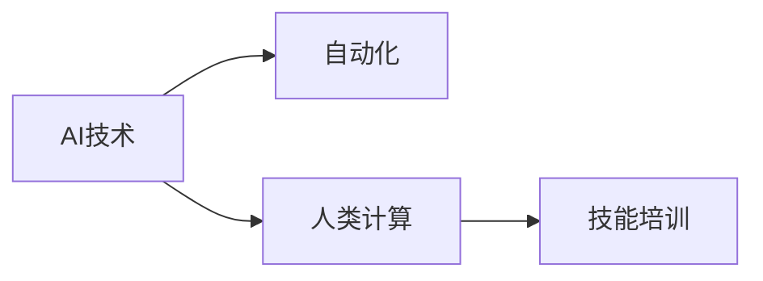

                 

## 1. 背景介绍

随着人工智能（AI）技术的不断进步和普及，自动化和智能化的浪潮正在席卷全球各行各业。AI技术的引入，不仅提高了工作效率，降低了人工成本，还为各行各业带来了新的增长点和就业机会。然而，这种变化也引发了人们对于未来就业趋势的担忧，尤其是对于那些可能被自动化替代的工作岗位。在AI时代，哪些技能将成为雇主最需要的？如何培养下一代的AI技术人才？本文将深入探讨这些问题，并提供一些实用的建议。

## 2. 核心概念与联系

### 2.1 核心概念概述

- **人工智能（AI）**：指利用计算机模拟人类智能的技术，包括机器学习、深度学习、自然语言处理、计算机视觉等方向。
- **自动化**：指通过软件和算法实现的任务自动完成，减少了人工操作的需求。
- **人类计算（Human Computation）**：指人类在AI系统的辅助下，完成需要高度智能和创新性的任务，例如数据分析、模型构建、算法优化等。
- **技能培训**：指为提高员工适应AI时代的就业需求，而进行的职业技能培训和学习。

这些概念之间存在紧密的联系。自动化技术的发展使得越来越多的任务可以被机器代替，而人类计算则在AI系统的辅助下，继续完成高智能任务。技能培训则是为了应对自动化带来的挑战，确保人才的持续竞争力。

### 2.2 核心概念原理和架构的 Mermaid 流程图



## 3. 核心算法原理 & 具体操作步骤

### 3.1 算法原理概述

人类计算的核心算法原理主要基于以下几个方面：

- **机器学习**：通过大量数据训练模型，使其具备自主学习和预测的能力。
- **深度学习**：通过多层神经网络模拟人脑的思维方式，解决复杂模式识别和预测问题。
- **自然语言处理**：通过文本分析和理解，实现人机交互和信息提取。
- **计算机视觉**：通过图像处理和模式识别，实现物体识别、场景分析等功能。

### 3.2 算法步骤详解

人类计算的算法步骤一般包括以下几个关键步骤：

1. **数据收集与预处理**：收集相关数据，并进行清洗和标注。
2. **模型选择与构建**：选择合适的机器学习或深度学习模型，并进行训练。
3. **模型评估与优化**：评估模型性能，并根据结果进行模型优化。
4. **实际应用**：将模型应用到实际场景中，解决特定问题。

### 3.3 算法优缺点

**优点**：
- 高效率：AI技术可以快速处理大量数据，提高工作效率。
- 高精度：AI模型在特定任务上通常具有更高的预测精度。
- 高适应性：AI模型可以根据实际需求进行调整和优化。

**缺点**：
- 依赖数据：AI模型的效果高度依赖于数据的质量和数量。
- 模型复杂度：AI模型通常需要大量的计算资源和专业知识。
- 可解释性：AI模型的决策过程往往缺乏可解释性，难以理解和调试。

### 3.4 算法应用领域

人类计算技术已经被广泛应用于多个领域，例如：

- **医疗**：AI辅助诊断、药物研发、基因分析等。
- **金融**：风险管理、投资策略、欺诈检测等。
- **零售**：推荐系统、库存管理、客户分析等。
- **制造业**：质量控制、设备维护、供应链优化等。
- **交通运输**：自动驾驶、交通流量预测、路径规划等。

## 4. 数学模型和公式 & 详细讲解 & 举例说明

### 4.1 数学模型构建

人类计算的数学模型通常基于机器学习或深度学习的框架，包括但不限于以下几种：

- **线性回归**：用于预测连续型变量的模型，形式为 $y = \beta_0 + \beta_1 x_1 + \cdots + \beta_n x_n + \epsilon$。
- **逻辑回归**：用于分类问题的模型，形式为 $P(y|x) = \sigma(\beta_0 + \beta_1 x_1 + \cdots + \beta_n x_n)$。
- **卷积神经网络（CNN）**：用于图像处理的模型，通过卷积和池化操作提取图像特征。
- **循环神经网络（RNN）**：用于序列数据处理的模型，通过循环结构处理时序信息。

### 4.2 公式推导过程

以线性回归模型为例，其基本公式为 $y = \beta_0 + \beta_1 x_1 + \cdots + \beta_n x_n + \epsilon$，其中 $y$ 为预测值，$x_1, \cdots, x_n$ 为输入变量，$\beta_0, \beta_1, \cdots, \beta_n$ 为模型参数，$\epsilon$ 为误差项。

在线性回归中，模型的目标是最小化预测误差，即 $argmin \sum_{i=1}^n (y_i - \hat{y_i})^2$，其中 $y_i$ 为真实值，$\hat{y_i}$ 为模型预测值。

### 4.3 案例分析与讲解

假设我们要预测房价，可以使用线性回归模型。收集历史房价数据，包括房屋面积、位置、年龄等特征，并标注每个房屋的真实价格。将这些数据输入模型进行训练，得到模型的预测公式，然后对新房屋进行预测。

## 5. 项目实践：代码实例和详细解释说明

### 5.1 开发环境搭建

进行人类计算的开发，需要安装相应的Python环境和机器学习库，例如：

1. 安装Anaconda，创建一个虚拟环境。
2. 安装必要的库，如NumPy、Pandas、Scikit-learn等。
3. 安装Jupyter Notebook，用于编写和运行代码。

### 5.2 源代码详细实现

以下是一个使用Scikit-learn库进行线性回归的示例代码：

```python
from sklearn.linear_model import LinearRegression
from sklearn.datasets import load_boston
from sklearn.model_selection import train_test_split

# 加载数据
boston = load_boston()
X = boston.data
y = boston.target

# 分割数据集
X_train, X_test, y_train, y_test = train_test_split(X, y, test_size=0.2, random_state=42)

# 创建模型并训练
model = LinearRegression()
model.fit(X_train, y_train)

# 评估模型
score = model.score(X_test, y_test)
print(f"模型评估得分：{score:.2f}")
```

### 5.3 代码解读与分析

在上述代码中，我们首先加载了波士顿房价数据集，并将其分割为训练集和测试集。然后，使用Scikit-learn库中的LinearRegression模型对训练集进行训练，并使用测试集评估模型的性能。

## 6. 实际应用场景

### 6.1 医疗诊断

AI技术在医疗领域的应用非常广泛，例如基于图像的病变检测、基因分析、药物研发等。在医疗诊断中，AI技术可以帮助医生进行初步筛查，提供诊断建议，并辅助治疗决策。

### 6.2 金融风控

金融行业通过AI技术进行风险管理、欺诈检测、信用评分等。AI技术可以实时分析大量交易数据，发现异常行为，防止金融诈骗和风险事故的发生。

### 6.3 零售推荐

电商平台通过AI技术进行用户行为分析，推荐个性化的商品和服务。AI技术可以根据用户的浏览、购买历史，预测其购买意愿，提供精准的推荐服务。

### 6.4 未来应用展望

随着AI技术的不断发展，人类计算的应用场景将越来越广泛。未来，AI将在自动驾驶、智能制造、智慧城市等领域发挥重要作用，带来更多的就业机会。

## 7. 工具和资源推荐

### 7.1 学习资源推荐

1. **Coursera**：提供众多AI和机器学习的在线课程，适合初学者和进阶学习者。
2. **Kaggle**：数据科学竞赛平台，提供丰富的数据集和比赛，适合实战练习。
3. **Google AI Blog**：Google AI团队的博客，分享最新AI研究成果和应用案例。
4. **DeepLearning.AI**：Andrew Ng教授的深度学习课程，系统讲解AI技术原理。
5. **Python Machine Learning**：本书详细介绍了使用Python进行机器学习的方法和技巧。

### 7.2 开发工具推荐

1. **Anaconda**：Python环境管理工具，支持多种Python版本和库的安装。
2. **Jupyter Notebook**：交互式编程环境，支持代码块、代码输出和注释。
3. **TensorFlow**：谷歌开发的机器学习框架，支持分布式计算和深度学习。
4. **PyTorch**：Facebook开发的深度学习框架，支持动态计算图和GPU加速。
5. **Scikit-learn**：Python机器学习库，包含众多经典的机器学习算法。

### 7.3 相关论文推荐

1. **Deep Learning**（Ian Goodfellow）：全面介绍了深度学习的基本概念和算法。
2. **Pattern Recognition and Machine Learning**（Christopher Bishop）：讲解了机器学习的基本方法和技术。
3. **Human Computation: A Survey**：综述了人类计算领域的研究现状和未来方向。
4. **Human-Computer Interaction in Data-Driven Decision Making**：讨论了人类计算在决策支持系统中的应用。
5. **Towards a Theory of Human-Computer Interaction in AI-Driven Organizations**：探讨了AI驱动组织中的人机交互理论。

## 8. 总结：未来发展趋势与挑战

### 8.1 研究成果总结

本文主要探讨了人类计算在AI时代的应用前景和技能培训的重要性。通过机器学习、深度学习等技术，AI在各行各业中发挥着越来越重要的作用，创造了大量的就业机会。然而，AI技术的发展也带来了新的挑战，例如数据隐私、模型可解释性等问题。

### 8.2 未来发展趋势

未来，人类计算将在更多的领域得到应用，例如自动驾驶、智能制造、智慧城市等。AI技术将不断进步，带来更高的效率和更准确的预测，为人类创造更多的价值。

### 8.3 面临的挑战

尽管AI技术带来了诸多机遇，但也存在一些挑战：

- **数据隐私**：如何保护用户数据隐私，避免数据滥用。
- **模型可解释性**：AI模型的决策过程难以理解和解释，需要更多的透明性。
- **就业替代**：自动化技术可能导致部分工作岗位的消失，需要制定应对策略。

### 8.4 研究展望

未来的研究需要重点关注以下几个方向：

- **数据隐私保护**：开发更加安全、高效的数据保护技术，保护用户隐私。
- **模型可解释性**：研究如何使AI模型更加透明，提高其可解释性。
- **技能培训**：开发针对未来就业需求的培训课程，提升人才的AI技能。

## 9. 附录：常见问题与解答

**Q1: 自动化技术将对哪些工作产生影响？**

A: 自动化技术将对重复性、低技能的工作产生影响，例如数据录入、客服、物流等。这些工作将被机器取代，但同时也将创造新的就业机会，例如AI工程师、数据科学家、自动化系统维护人员等。

**Q2: 如何提升技能培训的效果？**

A: 提升技能培训效果的方法包括：

- **多场景实践**：通过多种实际场景的案例分析，提升学员的实战能力。
- **跨学科融合**：结合数据科学、计算机科学、业务知识等，培养全面的人才。
- **持续学习**：鼓励终身学习，不断更新和补充新知识。

**Q3: 如何应对就业替代带来的挑战？**

A: 应对就业替代的挑战需要政府、企业、教育机构等多方共同努力：

- **政策引导**：政府应出台相关政策，支持技能培训和转岗再就业。
- **企业支持**：企业应为员工提供培训机会，帮助其适应新的工作环境。
- **教育创新**：教育机构应加强与企业的合作，培养符合市场需求的人才。

---

作者：禅与计算机程序设计艺术 / Zen and the Art of Computer Programming

