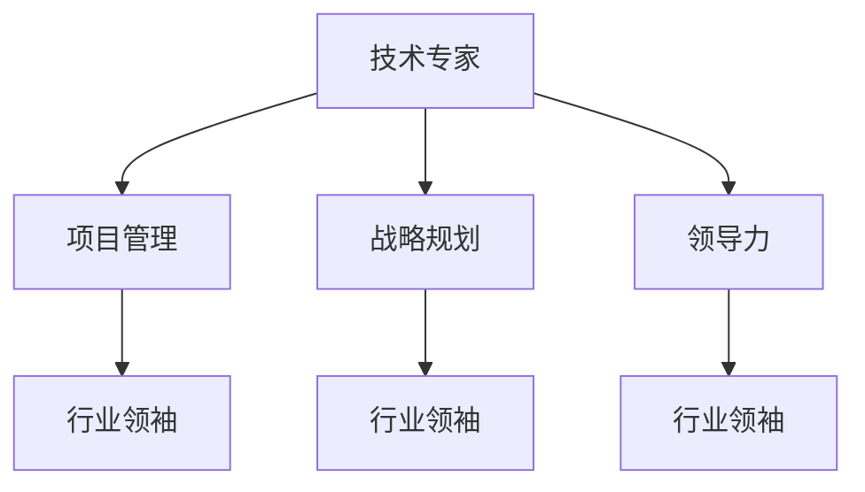

                 

# 从技术专家到行业意见领袖

> 关键词：行业领导力, 技术专家, 技术转型, 项目管理, 战略规划

## 1. 背景介绍

### 1.1 问题由来
在信息技术飞速发展的今天，技术专家已经成为各行各业不可或缺的核心力量。然而，随着技术的不断迭代，对技术专家的要求已经不再仅仅局限于技术本身，而更多地扩展到跨领域、跨学科的综合能力。一个真正卓越的技术专家，不仅需要掌握尖端技术，更需要具备行业洞察、领导力、项目管理、战略规划等多方面的综合能力。

### 1.2 问题核心关键点
从技术专家到行业意见领袖的转变，其核心关键点在于技术深度、行业广度和领导力宽度。具体来说：

- 技术深度：指对某一技术领域或多个领域核心技术的深入理解和应用能力。这是成为技术专家的基础。
- 行业广度：指对行业现状、趋势、痛点、机会等的广泛了解和深刻洞察。这是将技术应用到实际问题中的关键。
- 领导力宽度：指在团队管理、战略规划、影响力和决策能力等方面的综合素质。这是将技术转化为实际业务价值的必要条件。

### 1.3 问题研究意义
研究从技术专家到行业意见领袖的转变路径，对技术社区和个人发展具有重要意义：

1. 为技术专家提供了一条从技术深专到行业应用的成长路径。
2. 帮助技术专家理解行业需求，提升技术解决方案的市场竞争力。
3. 助力技术专家培养全面的领导力，提升其在团队和组织中的影响力。
4. 为技术专家提供战略规划和项目管理的方法论，加速业务价值的实现。

## 2. 核心概念与联系

### 2.1 核心概念概述

为更好地理解从技术专家到行业意见领袖的转变过程，本节将介绍几个关键概念及其相互关系：

- 技术专家：掌握某领域核心技术的深度专业人才。
- 行业领袖：在某一行业内具备广泛知识、深刻洞察和强大影响力的领导者。
- 项目管理：规划、执行和管理项目，确保项目按时按质按预算完成的过程。
- 战略规划：确定组织的长期目标，并制定实现这些目标的策略和计划。
- 领导力：指导、激励和影响团队成员的能力，使团队达成共同目标。

这些核心概念之间的逻辑关系可以通过以下Mermaid流程图来展示：



这个流程图展示了几类核心概念之间的联系：

1. 技术专家通过项目管理、战略规划和领导力，逐步向行业领袖转变。
2. 项目管理、战略规划和领导力是技术专家向行业领袖转变的关键能力。
3. 行业领袖需要在技术、管理、战略和领导力等多方面具备综合素质。

## 3. 核心算法原理 & 具体操作步骤

### 3.1 算法原理概述

从技术专家到行业意见领袖的转变，可以类比为“从点到面”的过程。技术专家的工作往往集中在技术的深度和广度，而行业领袖的工作则更多地涉及管理和战略。这种转变并非一蹴而就，而是一个逐步积累和提升的过程。其核心在于通过不断的项目实践、战略规划和领导力锻炼，逐步扩大自己的影响力和决策范围。

### 3.2 算法步骤详解

实现这一转变的过程大致可以分为以下几个步骤：

**Step 1: 技术精进与知识积累**
- 选择一个技术方向或多个方向进行深度研究。
- 参与多个项目，积累实际应用经验。
- 持续学习行业前沿技术和新趋势，保持知识更新。

**Step 2: 项目管理能力的提升**
- 学习项目管理方法论，如敏捷开发、Scrum等。
- 在实际项目中担任关键角色，如项目经理、技术负责人等。
- 积累项目管理和跨团队协作的经验，培养团队领导能力。

**Step 3: 战略规划意识的形成**
- 参与公司或部门的战略规划会议，理解公司愿景和业务目标。
- 主动思考如何利用技术推动业务发展，参与关键战略项目。
- 学习和应用战略规划的工具和技术，如SWOT分析、PEST分析等。

**Step 4: 领导力的培养**
- 担任更高级别的技术和管理角色，如CTO、部门主管等。
- 学习和应用领导力理论，如情境领导、变革管理等。
- 不断反思和改进自己的领导风格，建立高效的团队文化。

**Step 5: 行业洞察与影响力扩大**
- 参与行业会议、交流和调研，获取行业前沿信息。
- 建立行业影响力，通过技术分享、演讲、发表文章等形式展示自己的思想和成果。
- 参与行业协会和社团，建立广泛的行业联系和网络。

### 3.3 算法优缺点

从技术专家到行业意见领袖的转变方法，具有以下优点：
1. 系统性强：通过明确的步骤和方法论，确保每个阶段的能力提升。
2. 目标明确：每一步骤都有明确的输出和衡量指标，便于持续改进。
3. 应用广泛：适用于各种技术专家向行业领袖转变的场景，具有普遍适用性。

同时，该方法也存在一定的局限性：
1. 时间和资源投入大：需要持续投入时间和精力，进行深入学习和实践。
2. 受个人经验限制：每个人的学习路径和背景不同，需要根据自身情况灵活调整。
3. 效果难以量化：转型过程中的某些能力提升（如领导力、战略思维等）较难量化评估。

尽管存在这些局限性，但通过遵循这一转变方法，大多数技术专家仍能顺利完成从技术深专到行业领袖的转变，获得更大的职业发展空间和影响力。

### 3.4 算法应用领域

从技术专家到行业意见领袖的转变方法，不仅适用于IT行业，还适用于其他技术密集型领域，如工程、金融、医疗等。该方法的核心在于技术、管理、战略和领导力的综合培养，具有广泛的适用性。

## 4. 数学模型和公式 & 详细讲解  
### 4.1 数学模型构建

本节将使用数学语言对从技术专家到行业意见领袖的转变过程进行更加严格的刻画。

设技术专家为 $E$，行业领袖为 $L$，则这一转变过程可以表示为：

$$
L = f(E)
$$

其中 $f$ 为从技术专家到行业领袖的映射函数。我们将这一过程分解为多个子过程，即：

$$
L = f_1(E) \rightarrow f_2(L)
$$

其中 $f_1$ 为从技术专家到项目管理者的映射，$f_2$ 为从项目管理到行业领袖的映射。

### 4.2 公式推导过程

根据上述模型构建，我们可以进一步推导出每个子过程的具体公式。

假设 $E$ 在某个技术领域的深度为 $d$，行业广度为 $w$，项目管理能力为 $p$，战略规划能力为 $s$，领导力为 $l$。则：

- $f_1(E) = (d, p, s, l)$
- $f_2(L) = (d', p', s', l')$

其中 $d'$ 表示行业领袖在技术领域的深度，$p'$ 表示项目管理能力，$s'$ 表示战略规划能力，$l'$ 表示领导力。

通过 $f_1$ 和 $f_2$ 的映射，我们可以得出：

$$
L = (d', p', s', l')
$$

### 4.3 案例分析与讲解

以一个具体案例来说明这一转变过程：

- 假设 $E$ 是一位精通深度学习的工程师，具有五年技术深度经验，对多个行业有初步了解。
- 通过参与多个项目，积累项目管理经验，培养团队领导能力。
- 主动参与公司战略规划，提出基于深度学习的新业务方案。
- 通过公开演讲、技术分享等形式建立行业影响力。

经过这一系列步骤，$E$ 逐步成为深度学习领域的行业领袖，具备更广泛的知识、更深刻的洞察力和更大的影响力。

## 5. 项目实践：代码实例和详细解释说明
### 5.1 开发环境搭建

在进行技术专家到行业领袖的转变实践前，我们需要准备好开发环境。以下是使用Python进行项目管理实践的环境配置流程：

1. 安装Anaconda：从官网下载并安装Anaconda，用于创建独立的Python环境。

2. 创建并激活虚拟环境：
```bash
conda create -n project-env python=3.8 
conda activate project-env
```

3. 安装必要的Python包：
```bash
pip install numpy pandas matplotlib scikit-learn 
```

4. 配置项目管理工具：
```bash
pip install git python-git
```

完成上述步骤后，即可在`project-env`环境中开始实践。

### 5.2 源代码详细实现

下面以一个简单的项目管理案例为例，给出使用Python进行项目管理的代码实现。

首先，定义一个项目管理类 `ProjectManager`，包含以下方法：

```python
class ProjectManager:
    def __init__(self, project_name, project_desc, team_members):
        self.project_name = project_name
        self.project_desc = project_desc
        self.team_members = team_members
        
    def plan_project(self):
        print(f"Project Name: {self.project_name}")
        print(f"Project Description: {self.project_desc}")
        print(f"Team Members: {self.team_members}")
        print("Project Plan:")
        print("1. Define Project Objectives")
        print("2. Allocate Resources")
        print("3. Create Timeline")
        print("4. Define Milestones")
        print("5. Assign Tasks to Team Members")
        
    def execute_project(self):
        print("Executing Project:")
        print("1. Initial Task Briefing")
        print("2. Continuous Monitoring")
        print("3. Iterative Feedback and Adjustment")
        print("4. Final Review and Delivery")
        print("5. Project Closure")
        
    def evaluate_project(self):
        print("Evaluating Project:")
        print("1. Performance Metrics")
        print("2. Stakeholder Feedback")
        print("3. Post-Mortem Analysis")
```

然后，创建一个具体的项目管理实例，并调用相关方法：

```python
manager = ProjectManager("AI Project", "Develop AI-driven models for customer data analysis", ["John", "Mary", "Tom"])
manager.plan_project()
manager.execute_project()
manager.evaluate_project()
```

### 5.3 代码解读与分析

让我们再详细解读一下关键代码的实现细节：

**ProjectManager类**：
- `__init__`方法：初始化项目名称、项目描述和团队成员等关键信息。
- `plan_project`方法：定义项目计划，包含目标设定、资源分配、时间线制定、里程碑设置和任务分配。
- `execute_project`方法：执行项目过程，包括任务布置、持续监控、反馈调整和最终评审交付。
- `evaluate_project`方法：评估项目结果，包含性能指标分析、利益相关者反馈和事后总结。

这些方法通过模拟项目管理的实际流程，展现了技术专家向项目管理者的转变。通过编写类似代码，技术专家可以更直观地理解项目管理的全过程，积累实战经验。

## 6. 实际应用场景
### 6.1 软件开发

项目管理技能在软件开发中尤为重要。一个项目经理不仅需要掌握技术细节，还需要具备规划、执行、协调等多方面的能力。通过在实际项目中应用项目管理方法，技术专家可以逐步提升自身在项目管理中的影响力和决策能力。

在具体实践中，技术专家可以参与公司的敏捷开发项目，担任Scrum Master或Product Owner，负责协调团队成员、管理项目进度、确保项目质量。通过这些角色，技术专家可以深入了解项目管理方法论，积累实战经验。

### 6.2 数据科学项目

数据科学项目通常涉及多学科知识，需要跨团队协作和综合管理能力。通过参与数据科学项目，技术专家可以逐步提升战略规划和领导力。

在实践中，技术专家可以担任数据科学团队的领导者，负责制定项目目标、分配资源、协调跨部门合作。通过这些实践，技术专家可以学习如何利用技术推动业务创新，提升项目管理能力。

### 6.3 新产品研发

新产品研发是一个复杂的过程，涉及技术、市场、运营等多个维度。通过参与新产品研发项目，技术专家可以逐步培养战略规划和决策能力。

在具体实践中，技术专家可以参与新产品立项、市场调研、技术方案设计和测试验证等环节。通过这些实践，技术专家可以学习如何从技术角度评估市场需求，制定有效策略，提升战略规划能力。

## 7. 工具和资源推荐
### 7.1 学习资源推荐

为了帮助技术专家系统掌握从技术专家到行业意见领袖的转变方法，这里推荐一些优质的学习资源：

1. 《项目管理知识体系指南(PMBOK)》：项目管理领域的权威指南，涵盖项目管理的全流程和核心方法。
2. 《敏捷软件开发：原则、模式与实践》：介绍敏捷开发方法论，帮助技术专家在项目管理中灵活应对变化。
3. 《数据科学与工程》：吴恩达教授主讲的Coursera课程，涵盖数据科学的全链条知识，帮助技术专家从数据角度提升业务理解。
4. 《领导力精进：成为卓越领导者》：介绍领导力的理论和方法，帮助技术专家提升团队管理和决策能力。
5. 《战略管理》：哈佛商学院的战略管理课程，涵盖战略规划的理论与工具，帮助技术专家学习如何制定长期战略。

通过对这些资源的学习实践，相信你一定能够快速掌握从技术专家到行业领袖的转变精髓，并在实际应用中取得成效。

### 7.2 开发工具推荐

高效的开发离不开优秀的工具支持。以下是几款用于项目管理开发的常用工具：

1. JIRA：流行的项目管理工具，支持敏捷开发和Scrum方法，提供任务分配、进度跟踪和报告等功能。
2. Trello：基于卡片和看板的项目管理工具，适合小型项目和敏捷团队。
3. GitHub：代码托管平台，支持版本控制、协作和项目管理，是开发项目管理的重要工具。
4. Slack：即时通讯工具，支持多团队协作和任务分配，帮助技术专家管理跨团队项目。
5. Asana：任务管理和协作工具，支持任务分配、进度跟踪和报告等功能，适合中大型项目团队。

合理利用这些工具，可以显著提升项目管理任务的开发效率，加快创新迭代的步伐。

### 7.3 相关论文推荐

从技术专家到行业意见领袖的转变过程涉及多个领域的研究，以下是几篇奠基性的相关论文，推荐阅读：

1. "The Leadership Challenge" by James Kouzes and Barry Posner：介绍领导力理论和方法的经典著作，帮助技术专家提升领导能力。
2. "Project Management Body of Knowledge (PMBOK Guide)" by PMI：项目管理领域的权威指南，涵盖项目管理的全流程和核心方法。
3. "Agile Manifesto"：介绍敏捷开发方法论的核心价值观和原则，帮助技术专家在项目管理中灵活应对变化。
4. "Strategic Management: Text and Cases" by Hitt, Ireland, and Hoskisson：哈佛商学院的战略管理课程教材，涵盖战略规划的理论与工具。
5. "Data Science for Business" by Foster Provost and Tom Fawcett：吴恩达教授主讲的Coursera课程讲义，涵盖数据科学的全链条知识，帮助技术专家从数据角度提升业务理解。

这些论文代表了大语言模型微调技术的发展脉络。通过学习这些前沿成果，可以帮助技术专家把握学科前进方向，激发更多的创新灵感。

## 8. 总结：未来发展趋势与挑战

### 8.1 总结

本文对从技术专家到行业意见领袖的转变方法进行了全面系统的介绍。首先阐述了技术专家和行业领袖之间的联系，明确了转变的核心关键点。其次，从原理到实践，详细讲解了转变的数学模型和详细步骤，给出了项目管理任务的代码实例。同时，本文还广泛探讨了转变方法在软件开发、数据科学项目和新产品研发等多个行业领域的应用前景，展示了转变的广泛适用性。

通过本文的系统梳理，可以看到，从技术专家到行业意见领袖的转变方法，不仅是一种技术和能力的提升，更是一种全面素质和领导力的培养。通过不断的实践和学习，技术专家可以逐步摆脱单一技术的局限，成为具有广泛影响力和决策能力的行业领袖。

### 8.2 未来发展趋势

展望未来，从技术专家到行业意见领袖的转变方法将呈现以下几个发展趋势：

1. 技术融合度加深：随着技术的发展，未来的行业领袖将需要掌握更多跨学科知识，如AI、大数据、区块链等，以应对复杂多变的问题。
2. 项目管理工具智能化：未来的项目管理工具将更加智能，能够自动生成计划、跟踪进度和提供建议，提高项目管理效率。
3. 战略规划模型化：战略规划将更多地应用数学模型和优化算法，帮助企业制定更加科学合理的战略。
4. 领导力更加数据驱动：未来的领导力培养将更加注重数据分析和量化评估，帮助领导者更好地进行决策和团队管理。
5. 跨领域协作增强：未来的项目管理和团队协作将更加注重跨领域、跨团队的协同工作，提高综合管理能力。

以上趋势凸显了从技术专家到行业领袖转变方法的广阔前景。这些方向的探索发展，必将进一步提升技术专家的综合素质和影响力，推动技术在更多领域的应用和创新。

### 8.3 面临的挑战

尽管从技术专家到行业意见领袖的转变方法已经取得了瞩目成就，但在迈向更加智能化、普适化应用的过程中，它仍面临诸多挑战：

1. 技术更新速度快：技术领域的变化日新月异，技术专家需要不断学习新知识，以保持自身的竞争力。
2. 跨学科知识复杂：从技术专家到行业领袖的转变涉及多个学科领域的知识，学习和应用难度较大。
3. 资源投入大：项目管理、战略规划等能力的提升需要时间和精力的投入，且效果难以量化评估。
4. 团队管理难度大：领导团队和管理复杂项目需要高度的综合素质和经验，容易出现管理盲点和误区。
5. 行业洞察需要广泛调研：获取行业前沿信息需要深入调研和大量实践，可能面临数据获取和分析的困难。

尽管存在这些挑战，但通过持续学习和实践，技术专家仍能逐步实现向行业领袖的转变，提升自身在业务和技术领域的综合影响力。

### 8.4 研究展望

面对从技术专家到行业意见领袖的转变过程中面临的挑战，未来的研究需要在以下几个方面寻求新的突破：

1. 开发更加智能化的项目管理工具：利用AI和机器学习技术，自动生成项目计划、跟踪进度和提供建议，提高项目管理效率和准确性。
2. 引入量化评估和数据驱动的战略规划方法：通过大数据和优化算法，量化评估战略规划的效果，提高战略决策的科学性和可靠性。
3. 提升技术专家的跨学科能力：通过跨学科的学习和实践，提升技术专家在多个领域的综合素质和应用能力。
4. 开发更加高效的项目管理模型：利用模型优化和自动化技术，提高项目管理过程中的效率和效果。
5. 建立行业洞察和信息获取平台：通过大数据和人工智能技术，为技术专家提供丰富的行业信息和前沿趋势，帮助其更好地进行决策和规划。

这些研究方向的探索，必将引领从技术专家到行业领袖转变方法的进一步发展和完善，为技术专家提供更全面的支持和工具，推动其在更广阔的领域实现卓越表现。

## 9. 附录：常见问题与解答

**Q1：技术专家如何提升项目管理能力？**

A: 技术专家可以通过以下步骤提升项目管理能力：
1. 学习项目管理方法论，如敏捷开发、Scrum等。
2. 在实际项目中担任关键角色，如项目经理、技术负责人等。
3. 积累项目管理和跨团队协作的经验，培养团队领导能力。

**Q2：技术专家如何从技术深度转向行业广度？**

A: 技术专家可以从以下方面提升行业广度：
1. 参与行业会议、交流和调研，获取行业前沿信息。
2. 建立行业影响力，通过技术分享、演讲、发表文章等形式展示自己的思想和成果。
3. 参与行业协会和社团，建立广泛的行业联系和网络。

**Q3：技术专家如何培养领导力？**

A: 技术专家可以从以下方面提升领导力：
1. 担任更高级别的技术和管理角色，如CTO、部门主管等。
2. 学习和应用领导力理论，如情境领导、变革管理等。
3. 不断反思和改进自己的领导风格，建立高效的团队文化。

**Q4：技术专家如何在项目中应用战略规划？**

A: 技术专家可以在项目中应用战略规划：
1. 参与公司或部门的战略规划会议，理解公司愿景和业务目标。
2. 主动思考如何利用技术推动业务发展，参与关键战略项目。
3. 学习和应用战略规划的工具和技术，如SWOT分析、PEST分析等。

**Q5：技术专家如何应对技术更新速度快的问题？**

A: 技术专家可以通过以下方式应对技术更新速度快的问题：
1. 持续学习和跟进最新的技术发展，保持知识更新。
2. 参与技术社区和讨论，与同行交流分享。
3. 定期进行知识回顾和技能提升培训。

这些方法可以帮助技术专家不断适应技术变化，保持自身的竞争力。

---

作者：禅与计算机程序设计艺术 / Zen and the Art of Computer Programming

