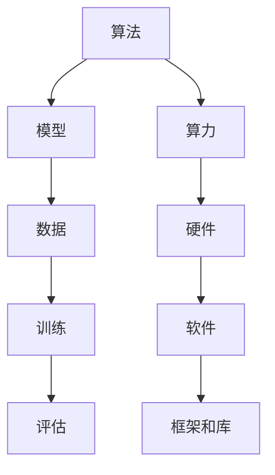
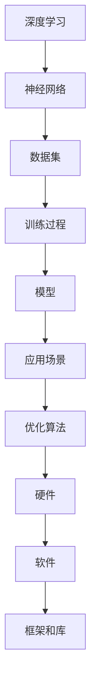

                 

## 1. 背景介绍

### 1.1 问题由来
人工智能（AI）的快速发展正在重塑全球科技和经济的格局。从数据科学、机器学习到深度学习，AI的每一步骤都离不开算法的创新和算力的推动。这一动态过程不仅影响了技术的演进，也反映了社会对AI不断增长的需求。然而，随着AI的普及，其带来的挑战和风险也开始显现，如隐私保护、伦理道德和就业问题等。因此，对AI发展的全景图进行全面分析，是理解AI当前状况和未来趋势的关键。

### 1.2 问题核心关键点
AI的发展分为算法和算力两个核心方面。算法旨在模拟人类智能，通过复杂的数据处理和计算，实现对复杂问题的解决。而算力，则是指用于支持这些算法运行所需的计算资源和硬件基础设施。两者相辅相成，共同驱动AI技术的进步。本文将深入探讨算法和算力的关系，并从历史演变、技术创新、应用场景和未来趋势等多个角度，全面展示AI发展的全景图。

## 2. 核心概念与联系

### 2.1 核心概念概述
AI的演进过程，主要是由算法和算力共同推动的。算法方面，从早期的符号主义到现在的深度学习，逐步提升了模型对数据和任务的适应能力。算力方面，从传统的计算机到如今的高性能计算，不断扩大了AI的计算范围和速度。

以下是核心概念之间的关系：

- **算法**：用于模拟人类智能的计算过程，通过模型和训练数据，实现对数据的处理和预测。
- **算力**：指用于执行算法的计算资源，包括硬件设施、软件工具和网络条件等。
- **数据**：算法和算力的基础，AI系统通过学习数据，不断优化算法和提升算力。
- **应用场景**：AI算法和算力的应用领域，如自动驾驶、智能推荐、医疗诊断等。
- **模型**：算法实现的形式，如线性模型、决策树、神经网络等。
- **框架和库**：支持算法开发和算力优化的工具，如TensorFlow、PyTorch等。

这些概念之间的关系可以用以下Mermaid流程图表示：



### 2.2 核心概念原理和架构的 Mermaid 流程图



这个流程图展示了深度学习中的神经网络构建、数据处理、模型训练和应用场景。同时，也表明了算力对优化算法、硬件和软件的需求。

## 3. 核心算法原理 & 具体操作步骤

### 3.1 算法原理概述
AI的核心算法包括符号主义、统计学习、机器学习、深度学习等。这些算法通过不同的方式处理和分析数据，实现对复杂问题的预测和决策。其中，深度学习是目前应用最广泛的AI算法，通过多层神经网络的组合，实现了对大规模数据的处理和深度特征的提取。

### 3.2 算法步骤详解

#### 3.2.1 算法选择
算法的选择取决于问题类型、数据量和计算资源。常见的算法包括线性回归、逻辑回归、决策树、支持向量机和深度学习等。

#### 3.2.2 数据准备
数据准备是算法执行的前提，包括数据收集、清洗、特征工程和分割等。数据的质量直接影响算法的性能。

#### 3.2.3 模型训练
模型训练是算法的关键步骤，通过训练数据，调整算法参数，使其能够更好地预测新数据。常见的训练方法包括梯度下降、随机梯度下降和Adam等。

#### 3.2.4 模型评估
模型评估是检验算法效果的重要步骤，通过测试数据集，评估模型在实际场景中的表现。常见的评估指标包括准确率、召回率、F1值和ROC曲线等。

#### 3.2.5 模型优化
模型优化是提升算法性能的必要步骤，包括超参数调优、正则化、交叉验证和集成学习等。

### 3.3 算法优缺点
#### 3.3.1 算法优点
- **泛化能力强**：深度学习等算法通过大量数据训练，能够泛化到新数据集。
- **自动特征提取**：神经网络等算法自动提取特征，减少人工干预。
- **处理非线性问题**：复杂的神经网络能够处理非线性关系。

#### 3.3.2 算法缺点
- **计算资源需求高**：深度学习等算法需要大量计算资源和存储资源。
- **过拟合风险高**：模型复杂度大，容易过拟合。
- **解释性差**：神经网络等算法的黑盒特性，使得模型的决策过程难以解释。

### 3.4 算法应用领域

#### 3.4.1 计算机视觉
计算机视觉是AI在图像和视频处理领域的应用，通过算法实现图像识别、目标检测和语义分割等。

#### 3.4.2 自然语言处理
自然语言处理是AI在文本和语言处理领域的应用，通过算法实现文本分类、情感分析和机器翻译等。

#### 3.4.3 语音识别
语音识别是AI在语音处理领域的应用，通过算法实现语音识别和语音合成。

#### 3.4.4 自动驾驶
自动驾驶是AI在智能交通领域的应用，通过算法实现车辆的自动驾驶和导航。

#### 3.4.5 医疗诊断
医疗诊断是AI在医疗健康领域的应用，通过算法实现疾病的早期诊断和个性化治疗。

## 4. 数学模型和公式 & 详细讲解 & 举例说明

### 4.1 数学模型构建
AI的数学模型通常基于线性代数、概率统计和微积分等数学工具构建。例如，深度学习中的神经网络模型由多层感知器组成，每层包含多个神经元，每个神经元接受输入，输出加权和，并经过激活函数生成输出。

### 4.2 公式推导过程
以线性回归模型为例，其公式推导过程如下：

1. 假设训练数据集为 $(X_i, y_i)$，其中 $X_i$ 为特征向量，$y_i$ 为目标值。
2. 假设模型为 $y = \theta_0 + \theta_1x_1 + \cdots + \theta_nx_n$。
3. 最小二乘法求得 $\theta_0, \theta_1, \cdots, \theta_n$：
   $$
   \theta = (X^TX)^{-1}X^Ty
   $$
4. 预测新数据时，使用模型 $y = \theta_0 + \theta_1x_1 + \cdots + \theta_nx_n$。

### 4.3 案例分析与讲解
以图像分类为例，CNN（卷积神经网络）是一种常用的深度学习模型，用于图像分类任务。其核心思想是通过卷积层和池化层提取图像的特征，并通过全连接层进行分类。

### 4.4 案例分析与讲解

## 5. 项目实践：代码实例和详细解释说明

### 5.1 开发环境搭建
开发环境搭建包括选择合适的编程语言和框架、安装必要的软件和工具等。例如，使用Python和PyTorch搭建深度学习模型。

### 5.2 源代码详细实现
以图像分类为例，代码实现如下：

```python
import torch
import torch.nn as nn
import torchvision.transforms as transforms
from torchvision import datasets, models

# 定义数据转换
transform = transforms.Compose([
    transforms.Resize(256),
    transforms.CenterCrop(224),
    transforms.ToTensor(),
    transforms.Normalize(mean=[0.485, 0.456, 0.406], std=[0.229, 0.224, 0.225])
])

# 加载数据集
train_dataset = datasets.ImageFolder('train', transform=transform)
test_dataset = datasets.ImageFolder('test', transform=transform)

# 定义数据加载器
train_loader = torch.utils.data.DataLoader(train_dataset, batch_size=64, shuffle=True)
test_loader = torch.utils.data.DataLoader(test_dataset, batch_size=64, shuffle=False)

# 定义模型
model = models.resnet50(pretrained=False)

# 定义损失函数和优化器
criterion = nn.CrossEntropyLoss()
optimizer = torch.optim.SGD(model.parameters(), lr=0.001, momentum=0.9)

# 训练模型
for epoch in range(10):
    for inputs, labels in train_loader:
        optimizer.zero_grad()
        outputs = model(inputs)
        loss = criterion(outputs, labels)
        loss.backward()
        optimizer.step()

# 测试模型
correct = 0
total = 0
with torch.no_grad():
    for inputs, labels in test_loader:
        outputs = model(inputs)
        _, predicted = torch.max(outputs.data, 1)
        total += labels.size(0)
        correct += (predicted == labels).sum().item()

print('Accuracy: {:.2f}%'.format(correct/total*100))
```

### 5.3 代码解读与分析
这段代码实现了使用PyTorch进行图像分类的过程。首先，定义了数据转换和数据加载器，然后加载了数据集。接着，定义了ResNet模型和损失函数及优化器，并进行了模型训练。最后，在测试集上测试了模型的准确率。

### 5.4 运行结果展示
运行结果展示了模型在测试集上的准确率。通过逐步调参和优化，可以进一步提高模型的准确率。

## 6. 实际应用场景

### 6.1 医疗影像分析
AI在医疗影像分析中的应用非常广泛，通过深度学习模型，可以实现对医学影像的自动分析和诊断。

### 6.2 智能交通
AI在智能交通中的应用包括自动驾驶、交通信号优化和车辆导航等。

### 6.3 金融风控
AI在金融风控中的应用包括信用评估、反欺诈检测和交易监控等。

### 6.4 未来应用展望
未来的AI将更加注重可解释性和伦理性，实现更加智能和安全的系统。同时，AI在各个领域的深度融合，也将带来更多的创新和突破。

## 7. 工具和资源推荐

### 7.1 学习资源推荐
- Coursera和edX等在线课程：提供深度学习、机器学习和AI的基础和进阶课程。
- arXiv和IEEE Xplore等学术资源：提供最新的AI研究论文和成果。
- GitHub和Kaggle等社区平台：提供大量的AI项目和数据集。

### 7.2 开发工具推荐
- TensorFlow和PyTorch等深度学习框架：提供丰富的API和工具库。
- Jupyter Notebook和Google Colab等开发环境：提供便捷的编程和调试工具。
- Git和GitHub等版本控制工具：提供高效的软件管理和协作方式。

### 7.3 相关论文推荐
- 《深度学习》（Ian Goodfellow等）：深度学习领域的经典教材。
- 《人工智能：一种现代方法》（Russell和Norvig）：全面介绍AI的历史和未来发展方向。
- 《TensorFlow实战》（Clevert和Ullrich）：TensorFlow的实战指南。

## 8. 总结：未来发展趋势与挑战

### 8.1 研究成果总结
AI在各个领域的应用已经取得了显著进展，但仍然存在诸多挑战，如算力瓶颈、伦理道德和隐私保护等。未来的研究将更加注重这些问题的解决。

### 8.2 未来发展趋势
- **算力需求更高**：随着算法复杂度的提升，对计算资源的需求将越来越高。
- **跨领域融合**：AI将更多地与其他技术（如量子计算、物联网）融合，实现更广泛的应用。
- **可解释性和伦理性**：未来的AI系统将更加注重可解释性和伦理性，提升公众信任度。

### 8.3 面临的挑战
- **数据隐私和安全**：如何保护数据隐私和安全，防止数据泄露和滥用。
- **伦理和道德问题**：AI系统的决策过程如何确保符合伦理和道德标准。
- **技术壁垒和普及**：如何降低AI技术的壁垒，实现更广泛的应用和普及。

### 8.4 研究展望
未来的AI研究将更加注重跨学科的融合，实现多领域的协同创新。同时，也将更多地关注AI的社会影响和伦理道德，确保AI技术的可持续发展。

## 9. 附录：常见问题与解答

**Q1：AI的算法和算力哪个更重要？**

A: AI的算法和算力缺一不可。算法是AI的核心，决定了模型能够解决何种问题。而算力则是算法运行的基础，决定了模型的计算效率和精度。

**Q2：AI的发展前景如何？**

A: AI在各个领域的应用前景广阔，如医疗、交通、金融等。但同时也面临着隐私保护、伦理道德和技术壁垒等挑战，需要多方努力才能实现AI的可持续发展。

**Q3：AI的就业前景如何？**

A: AI的就业前景非常广阔，但同时也需要不断学习新的技术和工具。未来，AI专业人才的需求将持续增长，但也需要具备跨学科的知识和技能。

**Q4：AI的伦理问题如何解决？**

A: 解决AI的伦理问题需要多方努力，包括政府、企业和学术界等。需要制定相应的政策和规范，确保AI系统的决策过程符合伦理和道德标准。

**Q5：AI的可解释性如何提高？**

A: 提高AI的可解释性需要结合AI和符号逻辑等领域的技术，开发更加透明的AI系统。同时，也需要增强用户对AI系统的理解和信任。

---

作者：禅与计算机程序设计艺术 / Zen and the Art of Computer Programming

